# NOTES FOR THE TEACHER

#### CHAPTER 4 : GLOBALISATION AND THE INDIAN ECONOMY

Most regions of the world are getting increasingly interconnected. While this interconnectedness across countries has many dimensions cultural, political, social and economic — this chapter looks at globalisation in a more limited sense. It defines globalisation as the integration between countries through foreign trade and foreign investments by multinational corporations (MNCs). As you will notice, the more complex issues of portfolio investment have been left out.

If we look at the past thirty years or so, we find that MNCs have been a major force in the globalisation process connecting distant regions of the world. Why are the MNCs spreading their production to other countries and what are the ways in which they are doing so? The first part of the chapter discusses this. Rather than relying on quantitative estimates, the rapid rise and influence of the MNCs has been shown through a variety of examples, mainly drawn from the Indian context. Note that the examples are an aid to explain a more general point. While teaching, the emphasis should be on the ideas and examples are to be used as illustrations. You can also creatively use comprehension passages like the one given after Section II to test and reinforce new concepts.

Integration of production and integration of markets is a key idea behind understanding the process of globalisation and its impact. This has been dealt with at length in this chapter, highlighting the role of MNCs in the process. You have to ensure that the students grasp this idea with sufficient clarity, before moving on to the next topic.

Globalisation has been facilitated by several factors. Three of these have been highlighted: rapid improvements in technology, liberalisation of trade and investment policies and, pressures from international organisations such as the WTO. Improvement in technology is a fascinating area for students and you may, with a few directions, encourage them to do their own explorations. While discussing liberalisation, you have to keep in mind that the students are unaware of what India was like in the pre-liberalisation era. A role-play could be conceived to compare and contrast the pre and post-liberalisation era. Similarly, international negotiations under WTO and the uneven balances in power are interesting subjects that can be covered in a discussion mode rather than as lectures.

The final section covers the impact of globalisation*.* To what extent has globalisation contributed to the development process? This section draws on the topics covered in Chapters 1 and 2 (for example, what is a fair development goal), which you can refer to. Also, examples and activities drawn from the local environment are a must while discussing this section. This might include contexts that have not been covered in the chapter, such as the impact of imports on local farmers, etc. Collective brainstorming sessions can be conducted to analyse such situations.

#### Sources for Information

The call for a fairer globalisation has been given, among others, by the International Labour Organisation — *www.ilo.org.* Another interesting resource is the WTO website *http://www.wto.org.* It gives access to the variety of agreements that are being negotiated at the WTO. For company related information, most MNCs have their own websites. If you want to critically look at the MNCs, one recommended website is *www.corporatewatch.org.uk.*

#### 54 UNDERSTANDING ECONOMIC DEVELOPMENT

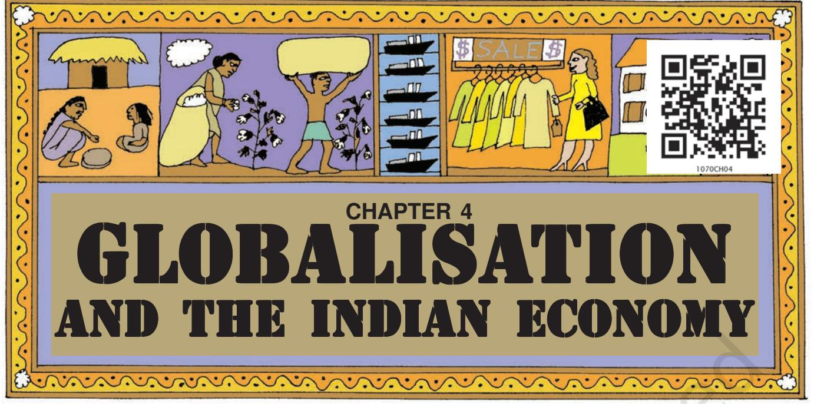

As consumers in today's world, some of us have a wide choice of goods and services before us. The latest models of digital cameras, mobile phones and televisions made by the leading manufacturers of the world are within our reach. Every season, new models of automobiles can be seen on Indian roads. Gone are the days when Ambassador and Fiat were the only cars on Indian roads. Today, Indians are buying cars produced by nearly all the top companies in the world. A similar explosion of brands can be seen for many other goods: from shirts to televisions to processed fruit juices.

Such wide-ranging choice of goods in our markets is a relatively recent phenomenon. You wouldn't have found such a wide variety of goods in Indian markets even two decades back. In a matter of years, our markets have been transformed!

How do we understand these rapid transformations? What are the factors that are bringing about these changes? And, how are these changes affecting the lives of the people? We shall dwell on these questions in this chapter.

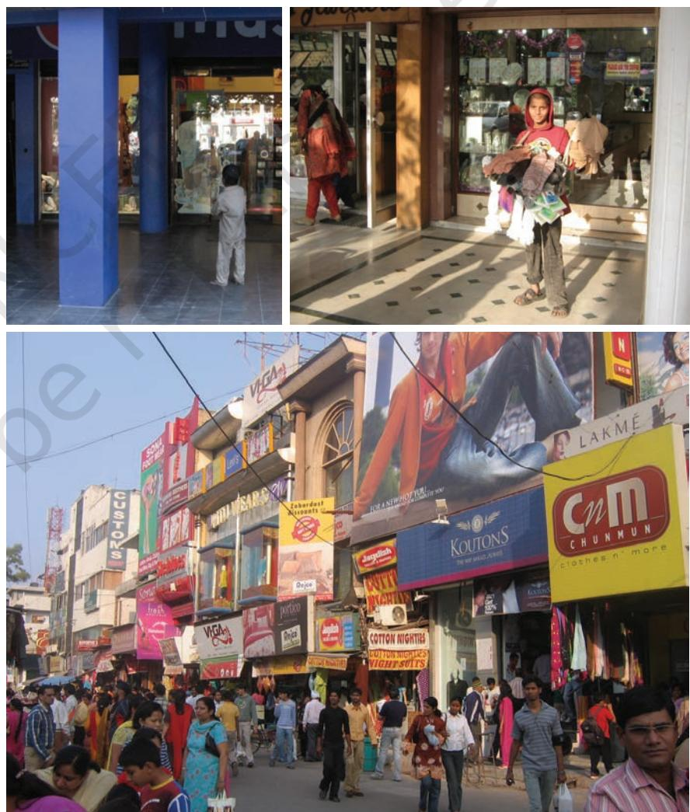

GLOBALISATION AND THE INDIAN ECONOMY 55

## PRODUCTION ACROSS COUNTRIES

Until the middle of the twentieth century, production was largely organised within countries. What crossed the boundaries of these countries were raw material, food stuff and finished products. Colonies such as India exported raw materials and food stuff and imported finished goods. Trade was the main channel connecting distant countries. This was before large companies called multinational corporations (MNCs) emerged on the scene. A MNC is a company that owns or controls production in more than one nation. MNCs set up offices and factories for production in regions where they can get cheap labour and other resources. This is done so that the cost of production is low and the MNCs can earn greater profits. Consider the following example.

## Spreading of Production by an MNC

*A large MNC, producing industrial equipment, designs its products in research centres in the United States, and then has the components manufactured in China. These are then shipped to Mexico and Eastern Europe where the products are assembled and the finished products are sold all over the world. Meanwhile, the company's customer care is carried out through call centres located in India.*

*This is a call centre in Bengaluru, equipped with telecom facilities and access to the Internet to provide information and support to customers abroad.*

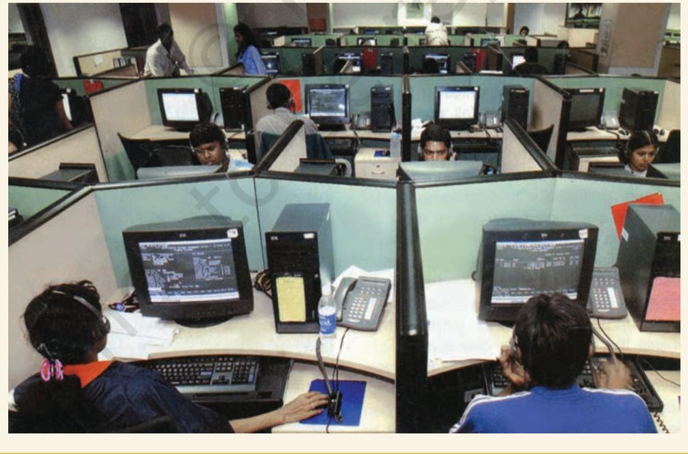

In this example the MNC is not only selling its finished products globally, but more important, the goods and services are produced globally. As a result, production is organised in increasingly complex ways. The production process is divided into small parts and spread out across the globe. In the above example, China provides the advantage of being a cheap manufacturing location. Mexico and Eastern Europe are useful for their closeness to the markets in the US and Europe. India has highly skilled engineers who can understand the technical aspects of production. It also has educated English speaking youth who can provide customer care services. And all this probably can mean 50-60 per cent cost-savings for the MNC! The advantage of spreading out production across the borders to the multinationals can be truly immense.

## **LET'S WORK THIS OUT**

Complete the following statement to show how the production process in the garment industry is spread across countries.

The brand tag says 'Made in Thailand' but they are not Thai products. We dissect the manufacturing process and look for the best solution at each step. We are doing it globally. In making garments, the company may, for example, get cotton fibre from Korea, ........

#### INTERLINKING PRODUCTION ACROSS COUNTRIES

In general, MNCs set up production where it is close to the markets; where there is skilled and unskilled labour available at low costs; and where the availability of other factors of production is assured. In addition, MNCs might look for government policies that look after their interests. You will read more about the policies later in the chapter.

Having assured themselves of these conditions, MNCs set up factories and offices for production. The money that is spent to buy assets such as land, building, machines and other equipment is called investment. Investment made by MNCs is called foreign investment. Any investment is made with the hope that these assets will earn profits.

At times, MNCs set up production jointly with some of the local companies of these countries. The benefit to the local company of such joint production is two-fold. First, MNCs can provide money for additional investments, like buying new machines for faster production. Second, MNCs might bring with them the latest technology for production.

WE WILL SHIFT THIS FACTORY TO ANOTHER COUNTRY. IT HAS BECOME EXPENSIVE HERE!

But the most common route for MNC investments is to buy up local companies and then to expand production. MNCs with huge wealth can quite easily do so. To take an example, *Cargill Foods, a very large American MNC, has bought over smaller Indian companies such as Parakh Foods. Parakh Foods had built a large marketing network in various parts of India, where its brand was well-reputed. Also, Parakh Foods had four oil refineries, whose control has now shifted to Cargill. Cargill is now the largest producer of edible oil in India, with a capacity to make 5 million pouches daily!*

In fact, many of the top MNCs have wealth exceeding the entire budgets of the developing country governments*.* With such enormous wealth, imagine the power and influence of these MNCs!

There's another way in which MNCs control production. Large MNCs in developed countries place orders for production with small producers. Garments, footwear, sports items are examples of industries where production is carried out by a large number of small producers around the world.

*Women at home in Ludhiana making footballs for large MNCs*

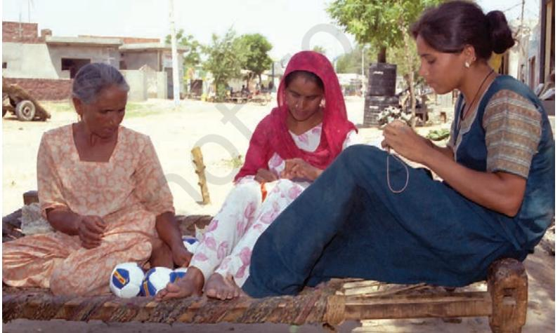

*Jeans produced in developing countries being sold in USA for Rs 6500 ($145)*

The products are supplied to the MNCs, which then sell these under their own brand names to the customers. These large MNCs have tremendous power to determine price, quality, delivery, and labour conditions for these distant producers.

Thus, we see that there are a variety of ways in which the MNCs are spreading their production and interacting with local producers in various countries across the globe. By setting up partnerships with local companies, by using the local companies for supplies, by closely competing with the local companies or buying them up, MNCs are exerting a strong influence on production at these distant locations. As a result, production in these widely dispersed locations is getting interlinked.

58 UNDERSTANDING ECONOMIC DEVELOPMENT

## **LET'S WORK THESE OUT**

*Ford Motors, an American company, is one of the world's largest automobile manufacturers with production spread over 26 countries of the world. Ford Motors came to India in 1995 and spent Rs. 1700 crore to set up a large plant near Chennai. This was done in collaboration with Mahindra and Mahindra, a major Indian manufacturer of jeeps and trucks. By the year 2017, Ford Motors was selling 88,000 cars in the Indian markets, while another 1,81,000 cars were exported from India to South Africa, Mexico, Brazil and United States of America. The company wants to develop Ford India as a component supplying base for its other plants*

Read the passage on the left and answer the questions.

- 1. Would you say Ford Motors is a MNC? Why?
- 2. What is foreign investment? How much did Ford Motors invest in India?
- 3. By setting up their production plants in India, MNCs such as Ford Motors tap the advantage not only of the large markets that countries such as India provide, but also the lower costs of production. Explain the statement.
- 4. Why do you think the company wants to develop India as a base for manufacturing car components for its global operations? Discuss the following factors:
	- (a) cost of labour and other resources in India
	- (b) the presence of several local manufacturers who supply autoparts to Ford Motors
	- (c) closeness to a large number of buyers in India and China
- 5. In what ways will the production of cars by Ford Motors in India lead to interlinking of production?
- 6. In what ways is a MNC different from other companies?
- 7. Nearly all major multinationals are American, Japanese or European, such as Nike, Coca-Cola, Pepsi, Honda, Nokia. Can you guess why?

#### FOREIGN TRADE AND INTEGRATION OF MARKETS

For a long time foreign trade has been the main channel connecting countries. In history you would have read about the trade routes connecting India and South Asia to markets both in the East and West and the extensive trade that took place along these routes. Also, you would remember that it was trading interests which attracted various trading companies such as the East India Company to India. What then is the basic function of foreign trade?

To put it simply, foreign trade creates an opportunity for the producers to reach beyond the domestic markets, i.e., markets of their own countries. Producers can sell their produce not only in markets located within the country but can also compete in markets located in other countries of the world. Similarly, for the buyers, import of goods produced in another country is one way of expanding the choice of goods beyond what is domestically produced.

GLOBALISATION AND THE INDIAN ECONOMY 59

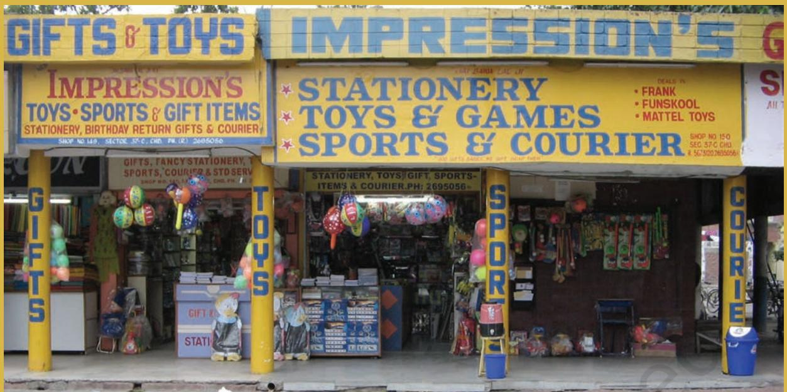

Let us see the effect of foreign trade through the example of Chinese toys in the Indian markets.

## Chinese Toys in India

*Chinese manufacturers learn of an opportunity to export toys to India, where toys are sold at a high price. They start exporting plastic toys to India. Buyers in India now have the option of choosing between Indian and the Chinese toys. Because of the cheaper prices and new designs, Chinese toys become more popular in the Indian markets. Within a year, 70 to 80 per cent of the toy shops have replaced Indian toys with Chinese toys. Toys are now cheaper in the Indian markets than earlier.*

*What is happening here? As a result of trade, Chinese toys come into the Indian markets. In the competition between Indian and Chinese toys, Chinese toys prove better. Indian buyers have a greater choice of toys and at lower prices. For the Chinese toy makers, this provides an opportunity to expand business. The opposite is true for Indian toy makers. They face losses, as their toys are selling much less.*

In general, with the opening of trade, goods travel from one market to another. Choice of goods in the markets rises. Prices of similar goods in the two markets tend to become equal. And, producers in the two countries now closely compete against each other even though they are separated by thousands of miles! Foreign trade thus results in connecting the markets or integration of markets in different countries.

*Small traders of readymade garments facing stiff competition from both the MNC brands and imports.*

## **LET'S WORK THESE OUT**

- 1. What was the main channel connecting countries in the past? How is it different now?
- 2. Distinguish between foreign trade and foreign investment.
- 3. In recent years China has been importing steel from India. Explain how the import of steel by China will affect.
	- (a) steel companies in China.
	- (b) steel companies in India.
	- (c) industries buying steel for production of other industrial goods in China.
- 4. How will the import of steel from India into the Chinese markets lead to integration of markets for steel in the two countries? Explain.

#### WHAT IS GLOBALISATION?

In the past two to three decades, more and more MNCs have been looking for locations around the world which would be cheap for their production. Foreign investment by MNCs in these countries has been rising. At the same time, foreign trade between countries has been rising rapidly. A large part of the foreign trade is also controlled by MNCs. For instance, the car manufacturing plant of Ford Motors in India not only produces cars for the Indian markets, it also exports cars to other developing countries and exports car components for its many factories around the world. Likewise, activities of most MNCs involve substantial trade in goods and also services.

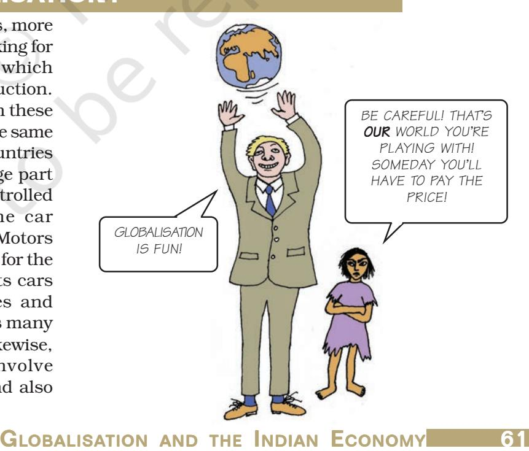

The result of greater foreign investment and greater foreign trade has been greater integration of production and markets across countries. Globalisation is this process of rapid integration or interconnection between countries. MNCs are playing a major role in the globalisation process. More and more goods and services, investments and technology are moving between countries. Most regions of the world are in closer

## **LET'S WORK THESE OUT**

- 1. What is the role of MNCs in the globalisation process?
- 2. What are the various ways in which countries can be linked?
- 3. Choose the correct option.

Globalisation, by connecting countries, shall result in

- (a) lesser competition among producers.
- (b) greater competition among producers.
- (c) no change in competition among producers.

contact with each other than a few decades back.

Besides the movements of goods, services, investments and technology, there is one more way in which the countries can be connected. This is through the movement of people between countries. People usually move from one country to another in search of better income, better jobs or better education. In the past few decades, however, there has not been much increase in the movement of people between countries due to various restrictions.

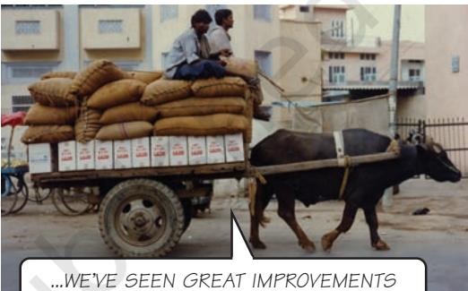

IN TRANSPORTATION...

## FACTORS THAT HAVE ENABLED GLOBALISATION

#### Technology

Rapid improvement in technology has been one major factor that has stimulated the globalisation process. For instance, the past fifty years have seen several improvements in transportation technology. This has made much faster delivery of goods across long distances possible at lower costs.

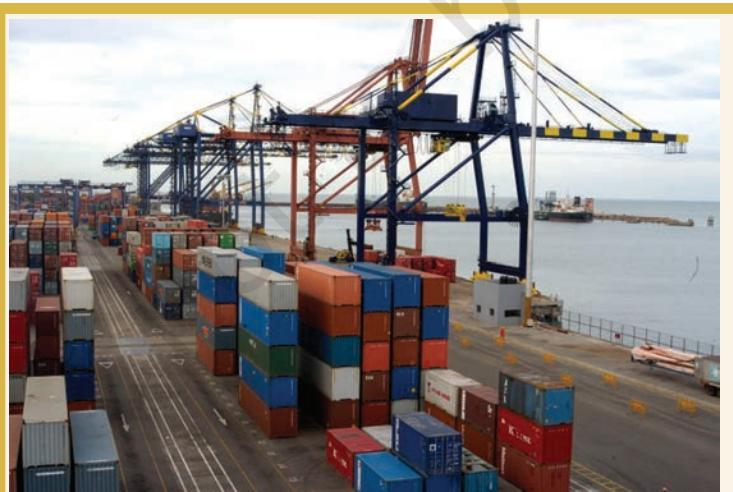

### Containers for transport of goods

*Goods are placed in containers that can be loaded intact onto ships, railways, planes and trucks. Containers have led to huge reduction in port handling costs and increased the speed with which exports can reach markets. Similarly, the cost of air transport has fallen. This has enabled much greater volumes of goods being transported by airlines.*

Even more remarkable have been the developments in information and communication technology. In recent times, technology in the areas of telecommunications, computers, Internet has been changing rapidly. Telecommunication facilities (telegraph, telephone including mobile phones, fax) are used to contact one another around the world, to access information instantly, and to communicate from remote areas. This has been facilitated by satellite communication devices. As you would be aware, computers have now entered almost every field of activity. You might have also ventured into the amazing world of internet, where you can obtain and share information on almost anything you want to know. Internet also allows us to send instant electronic mail (e-mail) and talk (voice-mail) across the world at negligible costs.

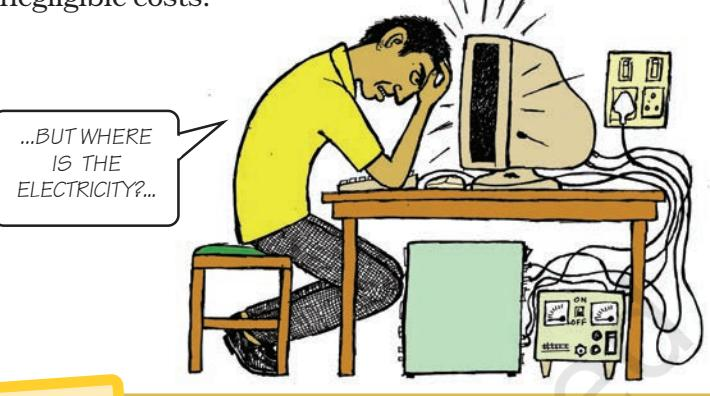

Information and communication technology(or IT in short) has played a major role in spreading out production of services across countries. Let us see how.

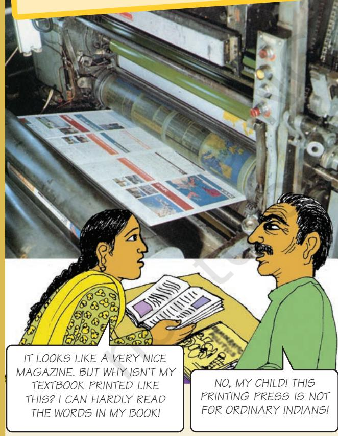

## Using IT in Globalisation

A news magazine published for London readers is to be designed and printed in Delhi. The text of the magazine is sent through Internet to the Delhi office. The designers in the Delhi office get orders on how to design the magazine from the office in London using telecommunication facilities. The designing is done on a computer. After printing, the magazines are sent by air to London. Even the payment of money for designing and printing from a bank in London to a bank in Delhi is done instantly through the Internet (e-banking)!

### **LET'S WORK THESE OUT**

- 1. In the above example, underline the words describing the use of technology in production.
- 2. How is information technology connected with globalisation? Would globalisation have been possible without expansion of IT?

GLOBALISATION AND THE INDIAN ECONOMY 63

#### Liberalisation of foreign trade and foreign investment policy

Let us return to the example of imports of Chinese toys in India. Suppose the Indian government puts a tax on import of toys. What would happen? Those who wish to import these toys would have to pay tax on this. Because of the tax, buyers will have to pay a higher price on imported toys. Chinese toys will no longer be as cheap in the Indian markets and imports from China will automatically reduce. Indian toy-makers will prosper.

Tax on imports is an example of trade barrier. It is called a barrier because some restriction has been set up. Governments can use trade barriers to increase or decrease (regulate) foreign trade and to decide what kinds of goods and how much of each, should come into the country.

The Indian government, after Independence, had put barriers to foreign trade and foreign investment. This was considered necessary to protect the producers within the country from foreign competition. Industries were just coming up in the 1950s and 1960s, and competition from imports at that stage would not have allowed these industries to come up. Thus, India allowed imports of only essential items such as machinery, fertilisers, petroleum etc. Note that all developed countries, during the early stages of development, have given protection to domestic producers through a variety of means.

Starting around 1991, some farreaching changes in policy were made in India. The government decided that the time had come for Indian producers to compete with producers around the globe. It felt that competition would improve the performance of producers within the country since they would have to improve their quality. This decision was supported by powerful international organisations.

Thus, barriers on foreign trade and foreign investment were removed to a large extent. This meant that goods could be imported and exported easily and also foreign companies could set up factories and offices here.

Removing barriers or restrictions set by the government is what is known as liberalisation. With liberalisation of trade, businesses are allowed to make decisions freely about what they wish to import or export. The government imposes much less restrictions than before and is therefore said to be more liberal.

## **LET'S WORK THESE OUT**

- 1. What do you understand by liberalisation of foreign trade?
- 2. Tax on imports is one type of trade barrier. The government could also place a limit on the number of goods that can be imported. This is known as quotas. Can you explain, using the example of Chinese toys, how quotas can be used as trade barriers? Do you think this should be used? Discuss.

### 64 UNDERSTANDING ECONOMIC DEVELOPMENT

## WORLD TRADE ORGANISATION

We have seen that the liberalisation of foreign trade and investment in India was supported by some very powerful international organisations. These organisations say that all barriers to foreign trade and investment are harmful. There should be no barriers. Trade between countries should be 'free'. All countries in the world should liberalise their policies.

World Trade Organisation (WTO) is one such organisation whose aim is to liberalise international trade. Started at the initiative of the developed countries, WTO establishes rules regarding international trade, and sees that these rules are obeyed. About 160 countries of the world are currently members of the WTO.

Though WTO is supposed to allow free trade for all, in practice, it is seen that the developed countries have unfairly retained trade barriers. On the other hand, WTO rules have forced the developing countries to remove trade barriers. An example of this is the current debate on trade in agricultural products.

## Debate on Trade Practices

*You have seen in Chapter 2, that the agriculture sector provides the bulk of employment and a significant portion of the GDP in India. Compare this to a developed country such as the US with the share of agriculture in GDP at 1% and its share in total employment a tiny 0.5%! And yet this very small percentage of people who are engaged in agriculture in the US receive massive sums of money from the US government for production and for exports to other countries. Due to this massive money that they receive, US farmers can sell the farm products at abnormally low prices. The surplus farm products are sold in other country markets at low prices, adversely affecting farmers in these countries.*

*Developing countries are, therefore, asking the developed country governments, "We have reduced trade barriers as per WTO rules. But you have ignored the rules of WTO and have continued to pay your farmers vast sums of money. You have asked our governments to stop supporting our farmers, but you are doing so yourselves. Is this free and fair trade?"*

*A typical cotton farm in USA consists of thousands of acres owned by a huge corporation that will sell cotton abroad at lowered prices.*

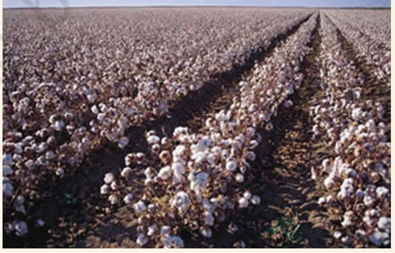

GLOBALISATION AND THE INDIAN ECONOMY 65

## **LET'S WORK THESE OUT**

- 1. Fill in the blanks.

| WTO was started at the initiative of __________countries. The aim of the WTO is to |
| --- |
| ____________________. WTO establishes rules regarding ________________ for |
| all countries, and sees that ___________________ In practice, trade between countries |
| is not ______________________________. Developing countries like India have |
| ___________________, whereas developed countries, in many cases, have continued |
| to provide protection to their producers. |

- 2. What do you think can be done so that trade between countries is more fair?
- 3. In the above example, we saw that the US government gives massive sums of money to farmers for production. At times, governments also give support to promote production of certain types of goods, such as those which are environmentally friendly. Discuss whether these are fair or not.

### IMPACT OF GLOBALISATION IN INDIA

In the last twenty years, globalisation of the Indian economy has come a long way. What has been its effect on the lives of people? Let us look at some of the evidence.

Globalisation and greater competition among producers - both local and foreign producers - has been of advantage to consumers, particularly the well-off sections in the urban areas. There is greater choice before these consumers who now enjoy improved quality and lower prices for several products. As a result, these people today, enjoy much higher standards of living than was possible earlier.

Among producers and workers, the impact of globalisation has not been uniform.

Firstly, MNCs have increased their investments in India over the past 20 years, which means investing in India has been beneficial for them. MNCs have been interested in industries such as cell phones, automobiles, electronics, soft drinks, fast food or services such as banking in urban areas. These products have a large number of well-off buyers. In these industries and services, new jobs have been created. Also, local companies supplying raw materials, etc. to these industries have prospered.

## Steps to Attract Foreign Investment

In recent years, the central and state governments in India are taking special steps to attract foreign companies to invest in India. Industrial zones, called Special Economic Zones (SEZs), are being set up. SEZs are to have world class facilities: electricity, water, roads, transport, storage, recreational and educational facilities. Companies who set up production units in the SEZs do not have to pay taxes for an initial period of five years.

Government has also allowed flexibility in the labour laws to attract foreign investment. You have seen in Chapter 2 that the companies in the organised sector have to obey certain rules that aim to protect the workers' rights. In the recent years, the government has allowed companies to ignore many of these. Instead of hiring workers on a regular basis, companies hire workers 'flexibly' for short periods when there is intense pressure of work. This is done to reduce the cost of labour for the company. However, still not satisfied, foreign companies are demanding more flexibility in labour laws.

Secondly, several of the top Indian companies have been able to benefit from the increased competition. They have invested in newer technology and production methods and raised their production standards. Some have gained from successful collaborations with foreign companies.

Moreover, globalisation has enabled some large Indian companies to emerge as multinationals themselves! Tata Motors (automobiles), Infosys (IT), Ranbaxy (medicines), Asian Paints (paints), Sundaram Fasteners (nuts and bolts) are some Indian companies which are spreading their operations worldwide.

Globalisation has also created new opportunities for companies providing services, particularly those involving IT. The Indian company producing a magazine for the London based company and call centres are some examples. Besides, a host of services such as data entry, accounting, administrative tasks, engineering are now being done cheaply in countries such as India and are exported to the developed countries.

### **LET'S WORK THESE OUT**

- 1. How has competition benefited people in India?
- 2. Should more Indian companies emerge as MNCs? How would it benefit the people in the country?
- 3. Why do governments try to attract more foreign investment?
- 4. In Chapter 1, we saw what may be development for one may be destructive for others. The setting of SEZs has been opposed by some people in India. Find out who are these people and why are they opposing it.

GLOBALISATION AND THE INDIAN ECONOMY 67

#### **Small producers: Compete or perish**

For a large number of small producers and workers globalisation has posed major challenges.

#### Rising Competition

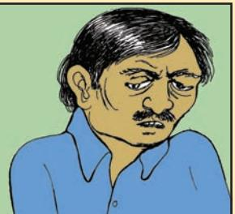

*Ravi did not expect that he would have to face a crisis in such a short period of his life as industrialist. Ravi took a loan from the bank to start his own company producing capacitors in 1992 in Hosur, an industrial town in Tamil Nadu. Capacitors are used in many electronic home appliances including tube lights, television etc. Within three years, he was able to expand production and had 20 workers working under him.*

*His struggle to run his company started when the government removed restrictions on imports of capacitors as per its agreement at WTO in 2001. His main clients, the television companies,*

*used to buy different components including capacitors in bulk for the manufacture of television sets. However, competition from the MNC brands forced the Indian television companies to move into assembling activities for MNCs. Even when some of them bought capacitors, they would prefer to import as the price of the imported item was half the price charged by people like Ravi.*

*Ravi now produces less than half the capacitors that he produced in the year 2000 and has only seven workers working for him. Many of Ravi's friends in the same business in Hyderabad and Chennai have closed their units.*

Batteries, capacitors, plastics, toys, tyres, dairy products, and vegetable oil are some examples of industries where the small manufacturers have been hit hard due to competition. Several of the units have shut down rendering many workers jobless. The small and medium industries in India employ the largest number of workers (11 crores) in the country, next only to agriculture.

#### **LET'S WORK THESE OUT**

- 1. What are the ways in which Ravi's small production unit was affected by rising competition?
- 2. Should producers such as Ravi stop production because their cost of production is higher compared to producers in other countries? What do you think?
- 3. Recent studies point out that small producers in India need three things to compete better in the market (a) better roads, power, water, raw materials, marketing and information network (b) improvements and modernisation of technology (c) timely availability of credit at reasonable interest rates.
	- l Can you explain how these three things would help Indian producers?
	- l Do you think MNCs will be interested in investing in these? Why?
	- l Do you think the government has a role in making these facilities available? Why?
	- l Can you think of any other step that the government could take? Discuss.

#### Competition and Uncertain Employment

Globalisation and the pressure of competition have substantially changed the lives of workers. Faced with growing competition, most employers these days prefer to employ workers 'flexibly'. This means that workers' jobs are no longer secure.

Let us see how the workers in the garment export industry in India are having to bear this pressure of competition.

*Factory workers folding garments for export. Though globalisation has created opportunities for paid work for women, the condition of employment shows that women are denied their fair share of benefits.*

Large MNCs in the garment industry in Europe and America order their products from Indian exporters. These large MNCs with worldwide network look for the cheapest goods in order to maximise their profits. To get these large orders, Indian garment exporters try hard to cut their own costs. As cost of raw materials cannot be reduced, exporters try to cut labour costs. Where earlier a factory used to employ workers on a permanent basis, now they employ workers only on a temporary basis so that they do not have to pay workers for the whole year. Workers also have to put in very long working hours and work night shifts on a regular basis during the peak season. Wages are low and workers are forced to work overtime to make both ends meet.

While this competition among the garment exporters has allowed the MNCs to make large profits, workers are denied their fair share of benefits brought about by globalisation.

## A Garment Worker

*35 year old Sushila has spent many years as a worker in garment export industry of Delhi. She was employed as a 'permanent worker' entitled to health insurance, provident fund, overtime at a double rate, when Sushila's factory closed in the late 1990s. After searching for a job for six months, she finally got a job 30 km. away from where she lives. Even after working in this factory for several years, she is a temporary worker and earns less than half of what she was earning earlier. Sushila leaves her house every morning, seven days a week at 7:30 a.m. and returns at 10 p.m. A day off from work means no wage. She has none of the benefits she used to get earlier. Factories closer to her home have widely fluctuating orders and therefore pay even less.*

The conditions of work and the hardships of the workers described above have become common to many industrial units and services in India. Most workers, today, are employed in the unorganised sector. Moreover, increasingly conditions of work in the organised sector have come to resemble the unorganised sector. Workers in the organised sector such as Sushila no longer get the protection and benefits that they enjoyed earlier.

## **LET'S WORK THESE OUT**

- 1. In what ways has competition affected workers, Indian exporters and foreign MNCs in the garment industry?
- 2. What can be done by each of the following so that the workers can get a fair share of benefits brought by globalisation?
	- (a) government
	- (b) employers at the exporting factories
	- (c) MNCs
	- (d) workers.
- 3. One of the present debates in India is whether companies should have flexible policies for employment. Based on what you have read in the chapter, summarise the point of view of the employers and workers.

#### THE STRUGGLE FOR A FAIR GLOBALISATION

The above evidence indicates that not everyone has benefited from globalisation. People with education, skill and wealth have made the best use of the new opportunities. On the other hand, there are many people who have not shared the benefits.

Since globalisation is now a reality, the question is how to make globalisation more 'fair'? Fair globalisation would create opportunities for all, and also ensure that the benefits of globalisation are shared better.

The government can play a major role in making this possible. Its policies must protect the interests, not only of the rich and the powerful, but all the people in the country. You have read about some of the possible steps that the government can take. For instance, the government can ensure that labour laws are properly implemented and the workers get their rights. It can support small producers to improve their performance till the time they become strong enough to compete. If necessary, the government can use trade and investment barriers. It can negotiate at the WTO for 'fairer rules'. It can also align with other developing countries with similar interests to fight against the domination of developed countries in the WTO.

In the past few years, massive campaigns and representation by people's organisations have influenced important decisions relating to trade and investments at the WTO. This has demonstrated that people also can play an important role in the struggle for fair globalisation.

70 UNDERSTANDING ECONOMIC DEVELOPMENT

*A demonstration against WTO in Hong Kong, 2005*

#### SUMMING UP

In this chapter, we looked at the present phase of globalisation. Globalisation is the process of rapid integration of countries. This is happening through greater foreign trade and foreign investment. MNCs are playing a major role in the globalisation process. More and more MNCs are looking for locations around the world that are cheap for their production. As a result, production is being organised in complex ways.

Technology, particularly IT, has played a big role in organising production across countries. In addition, liberalisation of trade and investment has facilitated globalisation by removing barriers to trade and investment. At the inter national level, WTO has put pressure on developing countries to liberalise trade and investment.

While globalisation has benefited well-off consumers and also producers with skill, education and wealth, many small producers and workers have suffered as a result of the rising competition. Fair globalisation would create opportunities for all, and also ensure that the benefits of globalisation are shared better.

GLOBALISATION AND THE INDIAN ECONOMY 71

## **EXERCISES**

- 1 What do you understand by globalisation? Explain in your own words.
- 2. What were the reasons for putting barriers to foreign trade and foreign investment by the Indian government? Why did it wish to remove these barriers?
- 3. How would flexibility in labour laws help companies?
- 4. What are the various ways in which MNCs set up, control or produce in other countries?
- 5. Why do developed countries want developing countries to liberalise their trade and investment? What do you think should the developing countries demand in return?
- 6. "The impact of globalisation has not been uniform." Explain this statement.
- 7. How has liberalisation of trade and investment policies helped the globalisation process?
- 8. How does foreign trade lead to integration of markets across countries? Explain with an example other than those given here.
- 9. Globalisation will continue in the future. Can you imagine what the world would be like twenty years from now? Give reasons for your answer.
- 10.Supposing you find two people arguing: One is saying globalisation has hurt our country's development. The other is telling, globalisation is helping India develop. How would you respond to these arguments?
- 11.Fill in the blanks.

| Indian buyers have a greater choice of goods than they did two decades back. This |
| --- |
| is closely associated with the process of ______________. Markets in India are selling |
| goods produced in many other countries. This means there is increasing |
| ______________ with other countries. Moreover, the rising number of brands that we |
| see in the markets might be produced by MNCs in India. MNCs are investing in India |
| because _____________ ___________________________________________ . While |
| consumers have more choices in the market, the effect of rising _______________ |

and ______________has meant greater _________________among the producers.

#### 12.Match the following.

- (i) MNCs buy at cheap rates from small (a) Automobiles producers
- (ii) Quotas and taxes on imports are used to (b) Garments, footwear, sports regulate trade items
- (iii)Indian companies who have invested abroad (c) Call centres
- production of services
- (v) Several MNCs have invested in setting (e) Trade barriers up factories in India for production
- 
- 
- 
- (iv) IT has helped in spreading of (d) Tata Motors, Infosys, Ranbaxy
	-

#### 72 UNDERSTANDING ECONOMIC DEVELOPMENT

- 13.Choose the most appropriate option.
	- (i) The past two decades of globalisation has seen rapid movements in
		- (a) goods, services and people between countries.
		- (b) goods, services and investments between countries.
		- (c) goods, investments and people between countries.
	- (ii) The most common route for investments by MNCs in countries around the world is to
		- (a) set up new factories.
		- (b) buy existing local companies.
		- (c) form partnerships with local companies.
	- (iii) Globalisation has led to improvement in living conditions
		- (a) of all the people
		- (b) of people in the developed countries
		- (c) of workers in the developing countries
		- (d) none of the above

## **ADDITIONAL ACTIVITY / PROJECT**

- I. Take some branded products that we use everyday (soaps, toothpaste, garments, electronic goods, etc.). Check which of these are produced by MNCs.
- II. Take any Indian industry or service of your choice. Collect information and photographs from newspapers, magazine clippings, books, television, internet, interviews with people on the following aspects of the industry.
	- (i) Various producers/companies in the industry
	- (ii) Is the product exported to other countries?
	- (iii) Are there MNCs among the producers?
	- (iv) Competition in the industry
	- (v) Conditions of work in the industry
	- (vi) Has there been any major change in the industry in the past 15 years?
	- (vii) Problems that people in the industry face.

GLOBALISATION AND THE INDIAN ECONOMY 73

