# NOTES FOR THE TEACHER

## CHAPTER 5 : CONSUMER RIGHTS

This chapter proposes to discuss the issue of consumer rights within the context of the ways markets operate in our country. There are many aspects of unequal situations in a market and poor enforcement of rules and regulations. Hence, there is a need to sensitise learners and encourage them to participate in the consumer movement. This chapter provides case histories — how some consumers were exploited in real life situation and how legal institutions helped consumers in getting compensated and in upholding their rights. The case histories would enable the students to link these narratives to their life experiences. We have to enable students to understand that the awareness of being a well-informed consumer arose out of consumer movement and active participation of people through their struggles over a long period. This chapter also provides details of a few organisations helping consumers in different ways. Finally, it ends with some critical issues of the consumer movement in India.

### Aspects of Teaching / Sources of Information

This chapter has questions, case studies and activities. It would be preferred that students discuss these in groups orally. Some of these could be answered in writing individually.

While carrying out each activity you could start with a brainstorming session about the activity. Similarly, there are many opportunities for roleplay in this chapter and this could be a useful way to share their experiences and understand the issues at a deeper level. Making posters collectively is another way to think about these issues. This lesson contains activities, which require visits — visit to consumer protection councils, consumer organisations, District/State/National level Consumer Disputes Redressal Commissions, retail shops, marketplaces, etc. Organise the visits to maximise learners' experience. Have a discussion with them about the purpose of the visit, things they need to do beforehand and things that need to be collected and the task (report/ project / article, etc.) they would carry out after the visit. As part of this chapter, the learners may do letter-writing and speaking activities. We may have to be sensitive to the language aspect of exercises.

This chapter contains material collected from authenticated websites, books, newspapers and magazines. For example, *https://consumer affairs.nic.in* is a website of Central Government Ministry of Consumer Affairs, Food & Public Distribution. Another website *www.cutsinternational.org* is the website of a consumer organisation working in India for 40 years. It publishes a variety of material to create consumer awareness in India. They need to be shared among learners so that they can also collect material as part of their activities. For example, case histories were taken from newspaper clippings and consumers who fought in Consumer Disputes Redressal Commissions. Let learners collect and read such material from different sources: consumer protection councils, Consumer Disputes Redressal Commissions and internet.

## 74 UNDERSTANDING ECONOMIC DEVELOPMENT

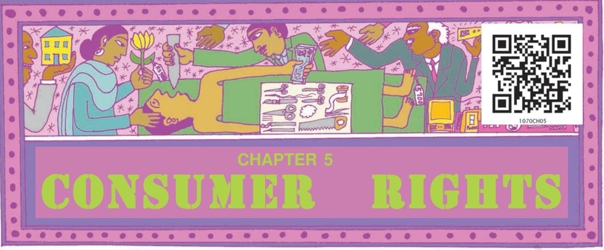

The collage you see below contains some news clippings of Consumer Disputes Redressal Commission verdicts. Why did the people go to these organisations in these cases? These verdicts came about because some people persisted and struggled to get justice. In what ways were they denied justice? More importantly, what are the ways in which they can exercise their rights as consumers to get a fair deal from the sellers when they felt they had been denied a just treatment?

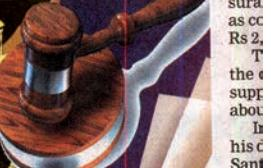

## THE CONSUMER IN THE MARKETPLACE

We participate in the market both as producers and consumers. As producers of goods and services we could be working in any of the sectors discussed earlier such as agriculture, industry, or services. Consumers participate in the market when they purchase goods and services that they need. These are the final goods that people as consumers use.

In the preceding chapters we discussed the need for rules and regulations or steps that would promote development. These could be for the protection of workers in the unorganised sector or to protect people from high interest rates charged by moneylenders in the informal sector. Similarly, rules and regulations are also required for protecting the environment.

For example, moneylenders in the informal sector that you read about in Chapter 3 adopt various tricks to bind the borrower: they could make the producer sell the produce to them at a low rate in return for a timely loan; they could force a small farmer like Swapna to sell her land to pay back the loan. Similarly, many people who work in the unorganised sector have to work at a low wage and accept conditions that are not fair and are also often harmful to their health. To prevent such exploitation, we have talked of rules and regulations for their protection. There are organisations that have struggled for long to ensure that these rules are followed.

Likewise, rules and regulations are required for the protection of the consumers in the marketplace. Individual consumers often find themselves in a weak position. Whenever there is a complaint regarding a good or service that had been bought, the seller tries to shift all the responsibility on to the buyer. Their position usually is – "If you didn't like what you bought, please go elsewhere". As if the seller has no responsibility once a sale is completed! The consumer movement, as we shall discuss later, is an effort to change this situation.

Exploitation in the marketplace happens in various ways. For example, sometimes traders indulge in unfair trade practices such as when shopkeepers weigh less than what they should or when traders add charges that were not mentioned before, or when adulterated/defective goods are sold.

Markets do not work in a fair manner when producers are few and powerful whereas consumers purchase in small amounts and are scattered. This happens especially when large companies are producing these goods. These companies with huge wealth, power and reach can manipulate the market in various ways. At times false information is passed on through the media, and other sources to attract consumers. For example, a company for years sold powder milk for babies all over

THEY PURPOSELY MADE IT SO IT WOULD FALL APART AFTER A FEW MONTHS SO THAT I WILL BUY A NEW ONE! the world as the most scientific product claiming this to be better than mother's milk. It took years of struggle before the company was forced to accept that it had been making false claims. Similarly, a long battle had to be fought with court cases to make cigarettemanufacturing companies accept that their product could cause cancer. Hence, there is a need for rules and regulations to ensure protection for consumers.

EVERYONE KNOWS TOBACCO KILLS PEOPLE, BUT WHO CAN SAY THAT TOBACCO COMPANIES SHOULD NOT BE FREE TO SELL TOBACCO?

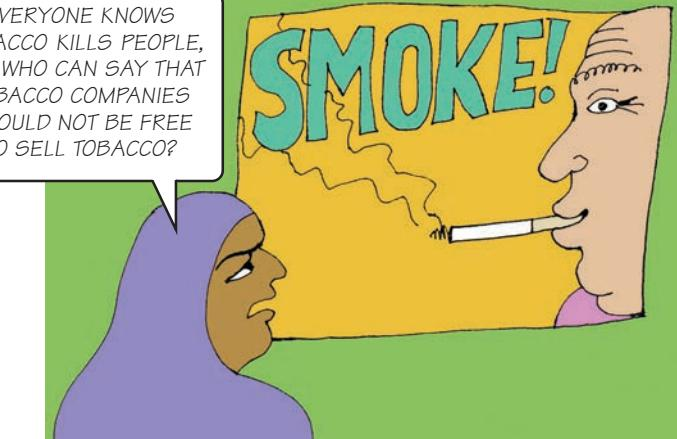

## **LET'S WORK THESE OUT**

- 1. What are the various ways by which people may be exploited in the market?
- 2. Think of one example from your experience where you thought that there was some 'cheating' in the market. Discuss in the classroom.
- 3. What do you think should be the role of government to protect consumers?

## CONSUMER MOVEMENT

The consumer movement arose out of dissatisfaction of the consumers as many unfair practices were being indulged in by the sellers. There was no legal system available to consumers to protect them from exploitation in the marketplace. For a long time, when a consumer was not happy with a particular brand product or shop, he or she generally avoided buying that brand product, or would stop purchasing from that shop. It was presumed that it was the responsibility of consumers to be careful while buying a commodity or service. It took many years for organisations in India, and around the world, to create awareness amongst people. This has also shifted the responsibility of ensuring quality of goods and services on the sellers.

In India, the consumer movement as a 'social force' originated with the necessity of protecting and promoting the interests of consumers against unethical and unfair trade practices. Rampant food shortages, hoarding, black marketing, adulteration of food and edible oil gave birth to the consumer movement in an organised form in the 1960s. Till the 1970s, consumer organisations were largely engaged in writing articles and holding exhibitions. They formed consumer groups to look into the malpractices in ration shops and overcrowding in the road passenger transport. More recently, India witnessed an upsurge in the number of consumer groups.

## Consumers International

*In 1985 United Nations adopted the UN Guidelines for Consumer Protection. This was a tool for nations to adopt measures to protect consumers and for consumer advocacy groups to press their governments to do so. At the international level, this has become the foundation for consumer movement. Today, Consumers International has become an umbrella body to over 200 member organisations from over 100 countries.*

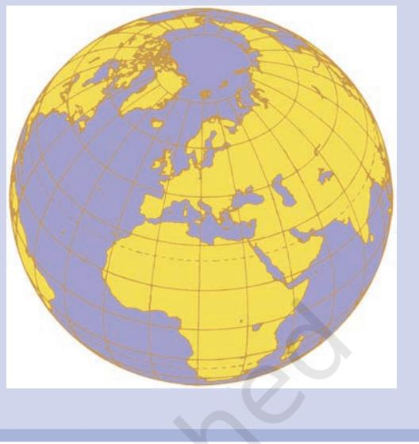

Because of all these efforts, the movement succeeded in bringing pressure on business firms as well as government to correct business conduct which may be unfair and against the interests of consumers at large. A major step taken in 1986 by the Indian government was the enactment of the Consumer Protection Act 1986, popularly known as COPRA. You will learn more about COPRA later.

## **LET'S WORK THESE OUT**

- 1. What could have been the steps taken by consumer groups?
- 2. There may be rules and regulations but they are often not followed. Why? Discuss.

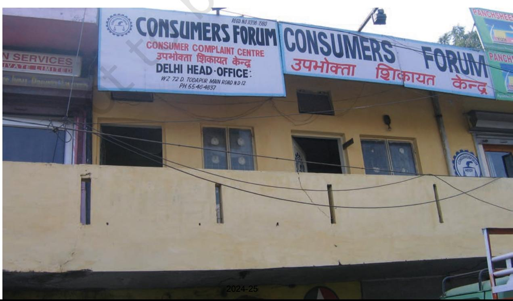

## CONSUMER RIGHTS

## SAFETY IS EVERYONE'S RIGHT

# Reji's Suffering

*Reji Mathew, a healthy boy studying in Class IX, was admitted in a private clinic in Kerala for removal of tonsils. An ENT surgeon performed the tonsillectomy operation under general anaesthesia. As a result of improper anaesthesia Reji showed symptoms of some brain abnormalities because of which he was crippled for life.*

*His father filed a complaint in the State Consumer Disputes Redressal Commission claiming compensation of Rs 5,00,000 for medical negligence and deficiency, in service. The State Commission, saying that the evidence was not sufficient, dismissed it. Reji's father appealed again in the National Consumer Disputes Redressal*

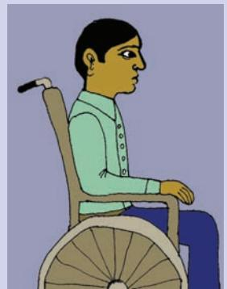

*Commission located in New Delhi. The National Commission after looking into the complaint, held the hospital responsible for medical negligence and directed it to pay the compensation.*

Reji's suffering shows how a hospital, due to negligence by the doctors and staff in giving anaesthesia, crippled a student for life. While using many goods and services, we as consumers, have the right to be protected against the marketing of goods and delivery of services that are hazardous to life and property. Producers need to strictly follow the required safety rules and regulations. There are many goods and services that we purchase that require special attention to safety. For example, pressure cookers have a safety valve which, if it is defective, can cause a serious accident. The manufacturers of the safety valve have to ensure high quality. You also need public or government action to see that this quality is maintained. However, we do find bad quality products in the market because the supervision of these rules is weak and the consumer movement is also not strong enough.

## **LET'S WORK THESE OUT**

- 1. For the following (you can add to the list) products/services discuss what safety rules should be observed by the producer?
	- (a) LPG cylinder (b) cinema theatre (c) circus (d) medicines (e) edible oil (f) marriage pandal (g) a high-rise building.
- 2. Find out any case of accident or negligence from people around you, where you think that the responsibility lay with the producer. Discuss.

CONSUMER RIGHTS 79

## Information about goods and services

When you buy any commodity, you will find certain details given on the packing. These details are about ingredients used, price, batch number, date of manufacture, expiry date and the address of the manufacturer. When we buy medicines, on the packets, you might find 'directions for proper use' and information relating to side effects and risks associated with usage of that medicine. When you buy garments, you will find information on 'instructions for washing'.

Why is it that rules have been made so that the manufacturer displays this information? It is because consumers have the right to be informed about the particulars of goods and services that they purchase. Consumers can then complain and ask for compensation or replacement if the product proves to be defective in any manner. For example, if we buy a product and find it defective well within the expiry period, we can ask for a replacement. If the expiry period was not printed, the manufacturer would blame the shopkeeper and will not accept the responsibility. If people sell medicines that have expired severe action can be taken against them. Similarly, one can protest and complain if someone sells a good at more than the printed price on the packet. This is indicated by 'MRP' maximum retail price. In fact consumers can bargain with the seller to sell at less than the MRP.

In recent times, the right to information has been expanded to cover various services provided by the Government. In October 2005, the Government of India enacted a law, popularly known as RTI (Right to Information) Act, which ensures its citizens all the information about the functions of government departments. The effect of the RTI Act can be understood from the following case.

Waiting...

*Amritha, an engineering graduate after submitting all the certificates and attending the interview for a job in a government department, did not receive any news of the result. The officials also refused to comply with her queries. She therefore filed an application using the RTI Act saying that it was her right to know the result in a reasonable time so that she could plan her future. She was not only informed about the reasons for delay in the declaration of results but also got her call letter for appointment as she performed well in the interview.*

80 UNDERSTANDING ECONOMIC DEVELOPMENT

## **LET'S WORK THESE OUT**

- 1. When we buy commodities we find that the price charged is sometimes higher or lower than the Maximum Retail Price printed on the pack. Discuss the possible reasons. Should consumer groups do something about this?
- 2. Pick up a few packaged goods that you want to buy and examine the information given. In what ways are they useful? Is there some information that you think should be given on those packaged goods but is not? Discuss.
- 3. People make complaints about the lack of civic amenities such as bad roads or poor water and health facilities but no one listens. Now the RTI Act gives you the power to question. Do you agree? Discuss.

## When choice is denied

*Abirami, a student of Ansari Nagar, joined a two-year course at a local coaching institute for professional courses in New Delhi. At the time of joining the course, she paid the fees Rs 61,020 as lumpsum for the entire course of two years. However, she decided to opt*

*out of the course at the end of one year as she found that the quality of teaching was not up to the mark. When she asked for a refund of the fee for one year, it was denied to her.*

*When she filed the case in the District Consumer Disputes Redressal Commission, the Commission directed the Institute to refund Rs 28,000 saying that she had the right to choose. The*

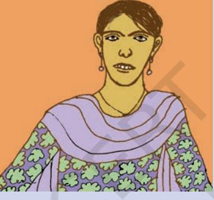

*Institute again appealed in the State Consumer Com-mission. The State Commission upheld the District Commission's direction and further fined the institute Rs 25,000 for a frivolous appeal. It also directed the institute to pay*

*Rs 7000 as compensation and litigation cost.*

*The State Commission also restrained all the educational and professional institutions in the state from charging fees from students for the entire duration of the course in advance and that too at one go. Any violation of this order may invite penalties and imprisonment, the commission said.*

What do we understand from this incident? Any consumer who receives a service in whatever capacity, regardless of age, gender and nature of service, has the right to choosewhether to continue to receive the service.

Suppose you want to buy toothpaste, and the shop owner says that she can sell the toothpaste only if you buy a toothbrush. If you are not interested in buying the brush, your right to choice is denied. Similarly, sometimes gas supply dealers insist that you have to buy the stove from them when you take a new connection. In this way many a times you are forced to buy things that you may not wish to and you are left with no choice.

## **LET'S WORK THIS OUT**

The following are some of the catchy advertisements of products that we purchase from the market. Which of the following offers would really benefit consumers? Discuss.

- l 15 gm more in every 500 gm pack.
- l Subscribe for a newspaper with a gift at the end of a year.
- l Scratch and win gifts worth Rs 10 lakhs.
- l A milk chocolate inside a 500 gram glucose box.
- l Win a gold coin inside a pack.
- l Buy shoes worth Rs 2000 and get one pair of shoes worth Rs 500 free.

### Where should consumers go to get justice?

Read again the cases of Reji Mathew and Abirami given earlier in the chapter.

These are some examples in which consumers are denied their rights. Such instances occur quite often in our country. Where should these consumers go to get justice?

Consumers have the right to seek redressal against unfair trade practices and exploitation. If any damage is done to a consumer, she has the right to get compensation depending on the degree of damage. There is a need to provide an easy and effective public system by which this can be done.

The consumer can file a complaint before the appropriate consumer forum on his/her own with or without the services of lawyers. You might be interested in knowing how an aggrieved person gets his or her compensation. Let us take the case of Prakash. He had sent a money-order to his village for his daughter's marriage. The money did not reach his daughter at the time when she needed it nor did it reach months later. Prakash filed a case in a district level Consumer Disputes Redressal Commission in New Delhi. All the steps he undertook are illustrated here. These days consumer as an individual or as a group (called class action suit) file a complaint both Physically or through internet and conduct the case through video conferencing.

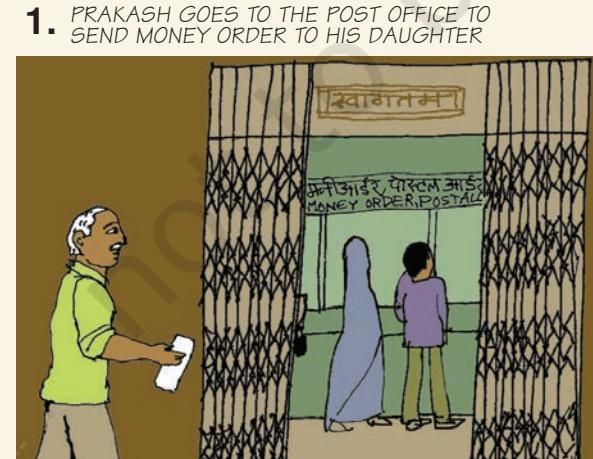

- SEND MONEY ORDER TO HIS DAUGHTER **2.** PRAKASH COMES TO KNOW THAT THE MONEY HAS NOT REACHED HIS DAUGHTER
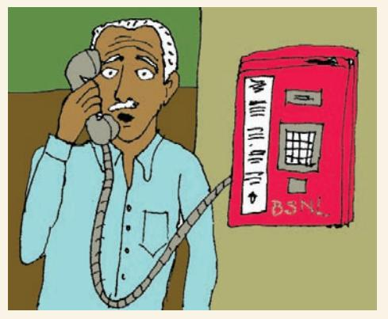

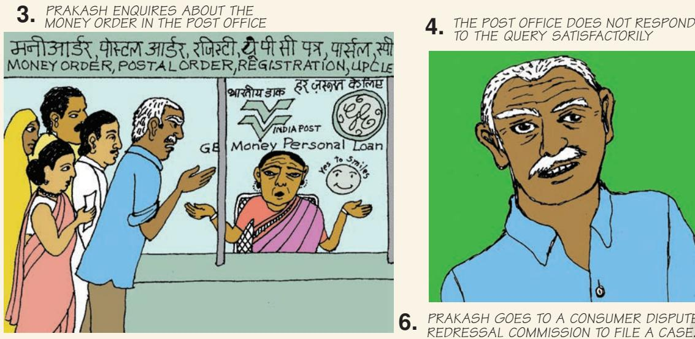

- **5.** PRAKASH GOES TO THE LOCAL CONSUMER PROTECTION COUNCIL FOR ADVICE
- TO THE QUERY SATISFACTORILY
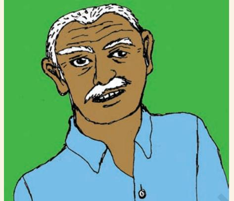

- **6.** PRAKASH GOES TO A CONSUMER DISPUTES REDRESSAL COMMISSION TO FILE A CASE. HE FILLS A REGISTRATION FORM. THE COMMISSION SENDS NOTICE TO THE OTHER PARTY
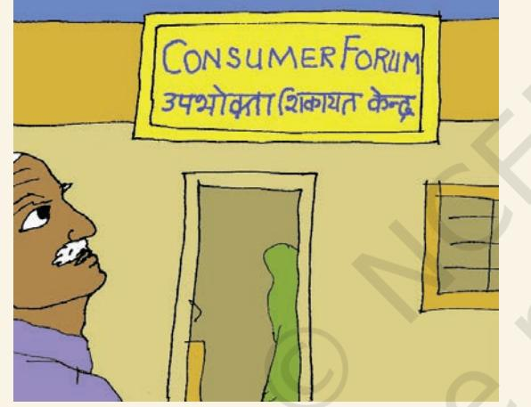

- **7.** HE HIMSELF PLEADS THE CASE IN THE COMMISSION
OFFICE **9.** THE JUDGE ANNOUNCES **8.** THE COMMISSION OFFICE JUDGE VERIFIES THE DOCUMENTS AND HEARS THE ARGUMENTS OF BOTH THE AGGRIEVED PARTY AND THE OTHER PARTY

- THE DISPUTES REDRESSAL COMMISSION VERDICT.
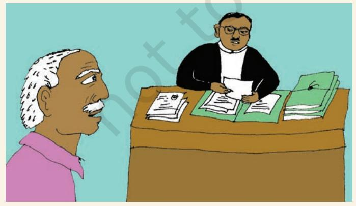

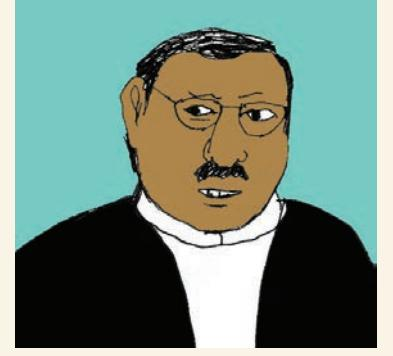

CONSUMER RIGHTS 83

The consumer movement in India has led to the formation of various organisations, locally known as consumer forums or consumer protection councils. They guide consumers on how to file cases in the Consumer Disputes Redressal Commissions. On many occasions, they also represent individual consumers in these commissions. These voluntary organisations also receive financial support from the government for creating awareness among people.

If you are living in a residential colony, you might have noticed boards of Residents' Welfare Associations. If there is any unfair trade practice meted out to their members, they take up the case on their behalf.

Under COPRA, a three-tier quasijudicial machinery at the district, state and national levels was set up for redressal of consumer disputes. The district-level authority called District Consumer Disputes Redressal Commission deals with the cases involving claims up to Rs 1 crore, the state-level Consumer Disputes Redressal Commissions called State Commission between Rs 1 crore and Rs 10 crore and the national-level commission — National Commission — deals with cases involving claims exceeding Rs 10 crore. If a case is dismissed in district-level commission, a consumer can also appeal in the state and then in national-level commissions.

Thus, the Act has enabled us as consumers to have the right to represent in the Consumer Disputes Redressal Commissions.

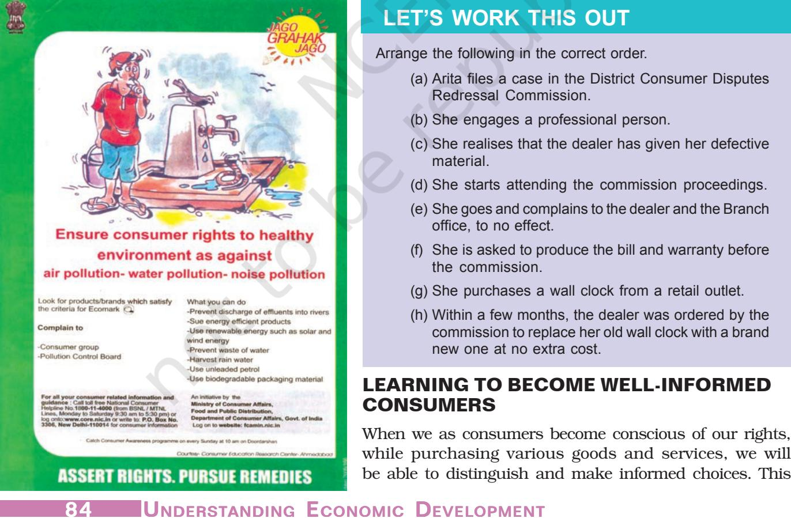

calls for acquiring the knowledge and skill to become a well-informed consumer. How do we become conscious of our rights? Look at the posters on the right and in the previous page. What do you think?

The enactment of COPRA has led to the setting up of separate Departments of Consumer Affairs in central and state governments. The posters that you have seen are one example through which government spread information about legal process which people can use. You might also be seeing such advertisements on television channels.

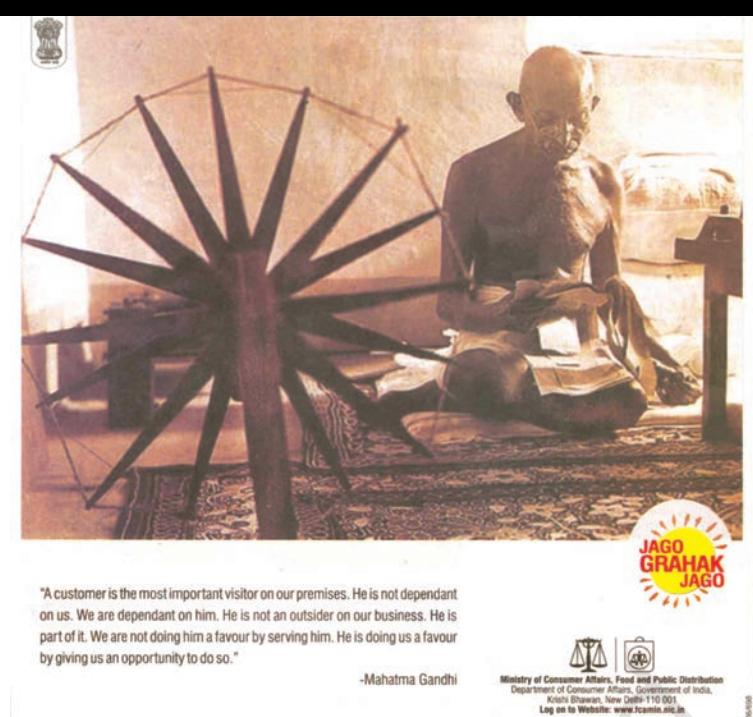

## ISI and Agmark

*While buying many commodities, on the cover, you might have seen a logo with the letters ISI, Agmark, Hallmark or +F. These logos and certification help consumers get assured of quality while purchasing the goods and services. The organisations that monitor and issue these certificates allow producers to use their logos provided they follow certain quality standards.*

*Though these organisations develop quality standards for many products, it is not compulsory for all the producers to follow standards. However, for some products that affect the health and safety of consumers or of products of mass consumption like LPG cylinders, food colours and additives, cement, packaged drinking water, it is mandatory on the part of the producers to get certified by these organisations.*

## **LET'S WORK THESE OUT**

- 1. Look at the posters and cartoons in this chapter. Think of any particular commodity and the aspects that need to be looked at as a consumer. Design a poster for this.
- 2. Find out the nearest Consumer Disputes Redressal Commission for your area.
- 3. What is the difference between consumer protection council and Consumer Disputes Redressal Commission?
- 4. The Consumer Protection Act 1986 ensures the following as rights which every consumer in India should possess
	- (i) Right to choice. (iv) Right to representation.
	- (ii) Right to information. (v) Right to safety.
	- (iii) Right to redressal. (vi) Right to consumer education.

Categorise the following cases under different heads and mark against each in brackets.

- (a) Lata got an electric shock from a newly purchased iron. She complained to the shopkeeper immediately. ( )
- (b) John is dissatisfied with the services provided by MTNL/BSNL/TATA INDICOM for the past few months. He files a case in the District Level Consumer Commission. ( )
- (c) Your friend has been sold a medicine that has crossed the expiry date and you are advising her to lodge a complaint ( ).
- (d) Iqbal makes it a point to scan through all the particulars given on the pack of any item that he buys. ( )
- (e) You are not satisfied with the services of the cable operator catering to your locality but you are unable to switch over to anybody else. ( )
- (f) You realise that you have received a defective camera from a dealer. You are complaining to the head office persistently ( ).
- 5. If the standardisation ensures the quality of a commodity, why are many goods available in the market without ISI or Agmark certification?
- 6. Find out the details of who provides Hallmark and ISO certification.

## TAKING THE CONSUMER MOVEMENT FORWARD

India has been observing 24 December as the National Consumers' Day. It was on this day that the Indian Parliament enacted the Consumer Protection Act in 1986. India is one of the countries that have exclusive authority for consumer redressal.

The consumer movement in India has made some progress in terms of numbers of organised groups and their activities. There are today more than 2000 consumer groups in the country of which only about 50-60 are well organised and recognised for their work.

However, the consumer redressal process is becoming cumbersome, expensive and time consuming. Many a time, consumers are required to engage lawyers. These cases require

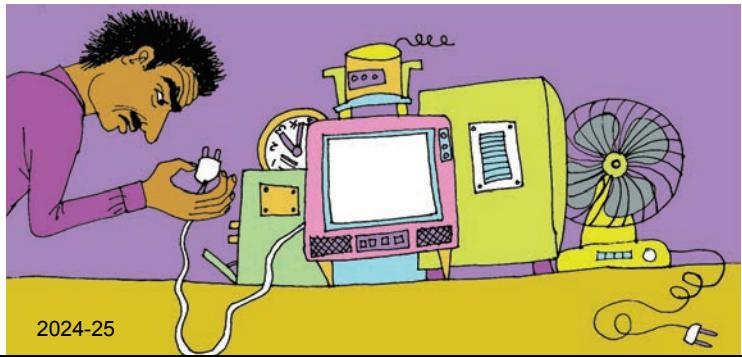

time for filing and attending the commission proceedings etc. In most purchases cash memos are not issued hence evidence is not easy to gather. Moreover most purchases in the market are small retail sales. The COPRA was amended in the year 2019 to further strengthen consumers in India. Buying through internet is now included. If there is any service deficiency or defective product, service provider or manufacturer is also held responsible and would be penalized or even imprisoned. Settlement of disputes with the help of a neutral intermediary outside the Consumer Disputes Redressal Commission, called mediator, is now encouraged at all the three tiers Consumer Commissions. After more than 30 years of the enactment of COPRA, consumer awareness in India is spreading but slowly. Besides this the enforcement of laws that protect workers, especially in the unorganised sectors is weak. Similarly, rules and regulations for working of markets are often not followed.

Nevertheless, there is scope for consumers to realise their role and importance. It is often said that consumer movements can be effective only with the consumers' active involvement. It requires a voluntary effort and struggle involving the participation of one and all.

## **EXERCISES**

- 1. Why are rules and regulations required in the marketplace? Illustrate with a few examples.
- 2. What factors gave birth to the consumer movement in India? Trace its evolution.
- 3. Explain the need for consumer consciousness by giving two examples.
- 4. Mention a few factors which cause exploitation of consumers.
- 5. What is the rationale behind the enactment of Consumer Protection Act 1986?
- 6. Describe some of your duties as consumers if you visit a shopping complex in your locality.
- 7. Suppose you buy a bottle of honey and a biscuit packet. Which logo or mark you will have to look for and why?
- 8. What legal measures were taken by the government to empower the consumers in India?
- 9. Mention some of the rights of consumers and write a few sentences on each.
- 10. By what means can the consumers express their solidarity?
- 11. Critically examine the progress of consumer movement in India.
- 12. Match the following.
	- (i) Availing details of ingredients of a product (a) Right to safety
	-
	- (iii) Accident due to faulty engine in a scooter (c) Certification of edible oil and cereals
	-
	-
	-
	-
- 
- (ii) Agmark (b) Dealing with consumer cases
	-
- (iv) District Consumer Commission (d) Agency that develop standards for goods and services
- (v) Food fortification (e) Right to information
- (vi) Consumers International (f) Global level institution of consumer welfare organisations
- (vii) Bureau of Indian Standards (g) Addition of key nutrients to staple foods

CONSUMER RIGHTS

87

- 13. Say True or False.
	- (i) COPRA applies only to goods.
	- (ii) India is one of the many countries in the world which has exclusive authorities established for consumer disputes redressal.
	- (iii) When a consumer feels that he has been exploited, he must file a case in the District Consumer Commission.
	- (iv) It is worthwhile to move to consumer commissions only if the damages incurred are of high value.
	- (v) Hallmark is the certification maintained for standardisation of jewellry.
	- (vi) The consumer redressal process is very simple and quick.
	- (vii) A consumer has the right to get compensation depending on the degree of the damage.

## **ADDITIONAL PROJECTS / ACTIVITIES**

- 1. Your school organises a consumer awareness week. As the Secretary of the Consumer Awareness Forum, draft a poster covering all the consumer rights. You may use the clues and ideas given in the poster on page 84 and 85. This activity can be done with the help of your English teacher.
- 2. Mrs. Krishna bought a colour television (CTV) against six months warranty. The CTV stopped working after three months. When she complained to the dealer / shop where it was purchased, they sent an engineer to set it right. The CTV continues to give trouble and Mrs Krishna no longer gets any reply to the complaint she made to the dealer / shop. She decides to write to the Consumer Commission in her area. Write a letter on her behalf. You may discuss with your partner / group members before you write it.
- 3. Establish a consumer club in your school. Organise mock consumer awareness workshops like monitoring bookshops, canteen, and shops in your school area.
- 4. Prepare posters with catchy slogans like:
	- An alert consumer is a safe consumer
	- Buyers, Beware
	- Consumers be cautious
	- Be aware of your rights
	- As consumers, assert your right
	- Arise, awake and stop not till ______________________ (Complete it)
- 5. Interview 4-5 persons in your neighbourhood and collect varied experiences regarding how they have been victims of such exploitation and their responses.
- 6. Conduct a survey in your locality by supplying the following questionnaire to get an idea as to how alert they are as consumers.

## 88 UNDERSTANDING ECONOMIC DEVELOPMENT

| For each question, tick one. |  | Always Sometimes | Never |
| --- | --- | --- | --- |
|  | A | B | C |
| 1. When you buy some item, do you insist on a bill? | î | î | î |
| 2. Do you keep the bill carefully? | î | î | î |
| 3. If you realise that you have been tricked by the shop | î | î | î |
| keeper, have you bothered to complain to him or her? |  |  |  |
| 4. Have you been able to convince him or her that you've | î | î | î |
| been cheated? |  |  |  |
| 5. Do you simply grumble to yourself reconciling that it is | î | î | î |
| your fate that you are often being victimised so and it is |  |  |  |
| nothing new? |  |  |  |
| 6. Do you look for ISI mark, expiry date etc.? | î | î | î |
| 7. If the expiry date mentioned is just a month or so away, | î | î | î |
| do you insist on a fresh packet? |  |  |  |
| 8. Do you weigh the new gas cylinder/old newspapers | î | î | î |
| yourself before buying/selling? |  |  |  |
| 9. Do you raise an objection if a vegetable seller uses stones | î | î | î |
| in place of the exact weight? |  |  |  |
| 10. Do excessively bright coloured vegetables arouse your | î | î | î |
| suspicion? |  |  |  |
| 11. Are you brand-conscious? | î | î | î |
| 12. Do you associate high price with good quality (to reassure | î | î | î |
| yourself that after all you have not paid a higher price just |  |  |  |
| like that)? |  |  |  |
| 13. Do you unhesitatingly respond to catchy offers? | î | î | î |
| 14. Do you compare the price paid by you with those of | î | î | î |
| others? |  |  |  |
| 15. Do you strongly believe that your shopkeeper never cheats | î | î | î |
| a regular customer like you? |  |  |  |
| 16. Do you favour 'home delivery' provision of items without | î | î | î |
| any doubt regarding weight etc.? |  |  |  |
| 17. Do you insist on 'paying by meter' when you travel by | î | î | î |
| auto? |  |  |  |
| Note |  |  |  |
| (i) You are extremely aware as a consumer if your answers for |  |  |  |
| Qns. 5, 12, 13, 15 and 16 are (C) and for the rest (A). |  |  |  |
| (ii) If your answers are (A) for Qns. 5, 12, 13, 15 and 16 and the rest (C), then you have to wake up as consumer. |  |  |  |
| (iii) If your answer is (B) for all the questions – you are somewhat aware. |  |  |  |

| Appendix 1: Body Mass Index for Adolescent Girls (Age 14-18) |
| --- |

| Years | Month | Malnourished | Normal | Malnourished |
| --- | --- | --- | --- | --- |
|  |  | (underweight) |  | (obesity) |
| 14 | 0 | Less than 15.4 | 15.4 to 27.3 | More than 27.3 |
| 14 | 1 | Less than 15.5 | 15.5 to 27.4 | More than 27.4 |
| 14 | 2 | Less than 15.5 | 15.5 to 27.5 | More than 27.5 |
| 14 | 3 | Less than 15.6 | 15.6 to 27.6 | More than 27.6 |
| 14 | 4 | Less than 15.6 | 15.6 to 27.7 | More than 26.3 |
| 14 | 5 | Less than 15.6 | 15.6 to 27.7 | More than 27.7 |
| 14 | 6 | Less than 15.7 | 15.7 to 27.8 | More than 27.8 |
| 14 | 7 | Less than 15.7 | 15.7 to 27.9 | More than 27.9 |
| 14 | 8 | Less than 15.7 | 15.7 to 28.0 | More than 28.0 |
| 14 | 9 | Less than 15.8 | 15.8 to 28.0 | More than 28.0 |
| 14 | 10 | Less than 15.8 | 15.8 to 28.1 | More than 28.1 |
| 14 | 11 | Less than 15.8 | 15.8 to 28.2 | More than 28.2 |
| 15 | 0 | Less than 15.9 | 15.9 to 28.2 | More than 28.2 |
| 15 | 1 | Less than 15.9 | 15.9 to 28.3 | More than 28.3 |
| 15 | 2 | Less than 15.9 | 15.9 to 28.4 | More than 28.4 |
| 15 | 3 | Less than 16.0 | 16.0 to 28.4 | More than 28.4 |
| 15 | 4 | Less than 16.0 | 16.0 to 28.5 | More than 28.5 |
| 15 | 5 | Less than 16.0 | 16.0 to 28.6 | More than 28.5 |
| 15 | 6 | Less than 16.0 | 16.0 to 28.6 | More than 28.6 |
| 15 | 7 | Less than 16.1 | 16.1 to 28.7 | More than 28.6 |
| 15 | 8 | Less than 16.1 | 16.1 to 28.7 | More than 28.7 |
| 15 | 9 | Less than 16.1 | 16.1 to 28.7 | More than 28.7 |
| 15 | 10 | Less than 16.1 | 16.1 to 28.8 | More than 28.8 |
| 15 | 11 | Less than 16.2 | 16.2 to 28.8 | More than 28.8 |
| 16 | 0 | Less than 16.2 | 16.2 to 28.9 | More than 28.9 |
| 16 | 1 | Less than 16.2 | 16.2 to 28.9 | More than 28.9 |
| 16 | 2 | Less than 16.2 | 16.2 to 29.0 | More than 29.0 |
| 16 | 3 | Less than 16.2 | 16.2 to 29.0 | More than 29.0 |
| 16 | 4 | Less than 16.2 | 16.2 to 29.0 | More than 29.0 |
| 16 | 5 | Less than 16.3 | 16.3 to 29.1 | More than 29.1 |
| 16 | 6 | Less than 16.3 | 16.3 to 29.1 | More than 29.1 |
| 16 | 7 | Less than 16.3 | 16.3 to 29.1 | More than 29.1 |
| 16 | 8 | Less than 16.3 | 16.3 to 29.2 | More than 29.2 |
| 16 | 9 | Less than 16.3 | 16.3 to 29.2 | More than 29.2 |
| 16 | 10 | Less than 16.3 | 16.3 to 29.2 | More than 29.2 |
| 16 | 11 | Less than 16.3 | 16.3 to 29.3 | More than 29.3 |
| 17 | 0 | Less than 16.4 | 16.3 to 29.3 | More than 29.3 |
| 17 | 1 | Less than 16.4 | 16.3 to 29.3 | More than 29.3 |
| 17 | 2 | Less than 16.4 | 16.3 to 29.3 | More than 29.3 |
| 17 | 3 | Less than 16.4 | 16.4 to 29.4 | More than 29.4 |
| 17 | 4 | Less than 16.4 | 16.4 to 29.4 | More than 29.4 |
| 17 | 5 | Less than 16.4 | 16.4 to 29.4 | More than 29.4 |
| 17 | 6 | Less than 16.4 | 16.4 to 29.4 | More than 29.4 |
| 17 | 7 | Less than 16.4 | 16.4 to 29.4 | More than 29.4 |
| 17 | 8 | Less than 16.4 | 16.4 to 29.4 | More than 29.5 |
| 17 | 9 | Less than 16.4 | 16.4 to 29.4 | More than 29.5 |
| 17 | 10 | Less than 16.4 | 16.4 to 29.4 | More than 29.5 |
| 17 | 11 | Less than 16.4 | 16.4 to 29.4 | More than 29.5 |
| 18 | 0 | Less than 16.4 | 16.4 to 29.4 | More than 29.5 |

90 UNDERSTANDING ECONOMIC DEVELOPMENT

| Years | Month | Malnourished | Normal | Malnourished |
| --- | --- | --- | --- | --- |
|  |  | (underweight) |  | (obesity) |
| 14 | 0 | Less than 15.5 | 15.5 to 25.9 | More than 25.9 |
| 14 | 1 | Less than 15.5 | 15.5 to 26.0 | More than 26.0 |
| 14 | 2 | Less than 15.6 | 15.6 to 26.1 | More than 26.1 |
| 14 | 3 | Less than 15.6 | 15.6 to 26.2 | More than 26.2 |
| 14 | 4 | Less than 15.7 | 15.7 to 26.3 | More than 26.3 |
| 14 | 5 | Less than 15.7 | 15.7 to 26.4 | More than 26.4 |
| 14 | 6 | Less than 15.7 | 15.7 to 26.5 | More than 26.5 |
| 14 | 7 | Less than 15.8 | 15.8 to 26.5 | More than 26.5 |
| 14 | 8 | Less than 15.8 | 15.8 to 26.6 | More than 26.6 |
| 14 | 9 | Less than 15.9 | 15.9 to 26.7 | More than 26.7 |
| 14 | 10 | Less than 15.9 | 15.9 to 26.8 | More than 26.8 |
| 14 | 11 | Less than 16.0 | 16.0 to 26.9 | More than 26.9 |
| 15 | 0 | Less than 16.0 | 16.0 to 27.0 | More than 27.0 |
| 15 | 1 | Less than 16.1 | 16.1 to 27.1 | More than 27.1 |
| 15 | 2 | Less than 16.1 | 16.1 to 27.1 | More than 27.1 |
| 15 | 3 | Less than 16.1 | 16.1 to 27.2 | More than 27.2 |
| 15 | 4 | Less than 16.2 | 16.2 to 27.3 | More than 27.3 |
| 15 | 5 | Less than 16.2 | 16.2 to 27.4 | More than 27.4 |
| 15 | 6 | Less than 16.3 | 16.3 to 27.4 | More than 27.4 |
| 15 | 7 | Less than 16.3 | 16.3 to 27.5 | More than 27.5 |
| 15 | 8 | Less than 16.3 | 16.3 to 27.6 | More than 27.6 |
| 15 | 9 | Less than 16.4 | 16.4 to 27.7 | More than 27.7 |
| 15 | 10 | Less than 16.4 | 16.4 to 27.7 | More than 27.7 |
| 15 | 11 | Less than 16.5 | 16.5 to 27.8 | More than 27.8 |
| 16 | 0 | Less than 16.5 | 16.5 to 27.9 | More than 27.9 |
| 16 | 1 | Less than 16.5 | 16.5 to 27.9 | More than 27.9 |
| 16 | 2 | Less than 16.6 | 16.6 to 28.0 | More than 28.0 |
| 16 | 3 | Less than 16.6 | 16.6 to 28.1 | More than 28.1 |
| 16 | 4 | Less than 16.7 | 16.7 to 28.1 | More than 28.1 |
| 16 | 5 | Less than 16.7 | 16.7 to 28.2 | More than 28.2 |
| 16 | 6 | Less than 16.7 | 16.7 to 28.3 | More than 28.3 |
| 16 | 7 | Less than 16.8 | 16.8 to 28.3 | More than 28.3 |
| 16 | 8 | Less than 16.8 | 16.8 to 28.4 | More than 28.4 |
| 16 | 9 | Less than 16.8 | 16.8 to 28.5 | More than 28.5 |
| 16 | 10 | Less than 16.9 | 16.9 to 28.5 | More than 28.5 |
| 16 | 11 | Less than 16.9 | 16.9 to 28.6 | More than 28.6 |
| 17 | 0 | Less than 16.9 | 16.9 to 28.6 | More than 28.6 |
| 17 | 1 | Less than 17.0 | 17.0 to 28.7 | More than 28.7 |
| 17 | 2 | Less than 17.0 | 17.0 to 28.7 | More than 28.7 |
| 17 | 3 | Less than 17.0 | 17.1 to 28.8 | More than 28.8 |
| 17 | 4 | Less than 17.1 | 17.1 to 28.9 | More than 28.9 |
| 17 | 5 | Less than 17.1 | 17.1 to 28.9 | More than 28.9 |
| 17 | 6 | Less than 17.1 | 17.1 to 29.0 | More than 29.0 |
| 17 | 7 | Less than 17.1 | 17.1 to 29.0 | More than 29.0 |
| 17 | 8 | Less than 17.2 | 17.2 to 29.1 | More than 29.1 |
| 17 | 9 | Less than 17.2 | 17.2 to 29.1 | More than 29.1 |
| 17 | 10 | Less than 17.2 | 17.2 to 29.2 | More than 29.2 |
| 17 | 11 | Less than 17.3 | 17.3 to 29.2 | More than 29.2 |
| 18 | 0 | Less than 17.3 | 17.3 to 29.2 | More than 29.2 |

### Appendix 2: Body Mass Index for Adolescent Boys (Age 14-18)

*Source:* Based on chart published by the World Health Organization APPENDIX

## SUGGESTED READINGS

### Books

- Abijit Vinayak Banerjee, Roland Benabou and Dilip Mookherjee (eds.), *Understanding Poverty*, Oxford University Press, New York, 2006.
- Amit Bhaduri and Deepak Nayyar, *Intelligent Person's Guide to Liberalisation*, Penguin Books, New Delhi, 1996.
- Amit Bhaduri, *Development with Dignity: The Case for Full Employment*, National Book Trust, New Delhi, 2005.
- Amit Bhaduri, *Macroeconomics: The Dynamics of Commodity Production*, Macmillan, London, 1986.
- Bimal Jalan (ed.), *Indian Economy*, Penguin Books, New Delhi, 2002.
- CUTS, *Is it Really Safe*, Consumer Unity Trust Society, Jaipur, 2004.
- CUTS, *State of the Indian Consumer: Analyses of the Implementation of the United Nations Guidelines for Consumer Protection, 1985 in India*, Consumer Unity Trust Society, Jaipur, 2001.
- Indrani Mazumdar, *Women and Globalisation: The Impact on Women Workers in the Formal and Informal Sectors in India*, Stree, Delhi, 2007.
- Jagdish Bhagwati *In Defence of Globalisation*, Oxford University Press, Delhi, 2004.
- Jan Breman and Parthiv Shah, *Working in the mill no more*, Oxford University Press, Delhi, 2005.
- Jan Breman, *Footloose Labour: Working in India's Informal Economy*, Cambridge University Press, Cambridge, 1996.
- Jean Dreze and Amartya Sen, *India: Development and Participation*, Oxford University Press, Delhi, Third Impression, 2007.
- John K.Galbraith, *Money: Whence it Came, Whence it Went*, Indian Book Company, New Delhi, 1975.
- Joseph Stiglitz, *Globalisation and its Discontents*, Penguin Books India, New Delhi, 2003.
- National Consumer Disputes Redressal Commission, *Landmark Judgments on Consumer Protection*, Universal Law Publishing Co., Delhi, 2005.
- Tirthankar Roy, *The Economic History of India, 1857-1947*, Oxford University Press, Delhi, Second Edition, 2006.

### Government Publications

*Economic Survey*, Ministry of Finance, Government of India.

92 UNDERSTANDING ECONOMIC DEVELOPMENT

- *Key Results of Employment-Unemployment Rounds*, National Sample Survey Organisation, Ministry of Statistics and Programme Implementation, Govt of India, New Delhi.
- *National Human Development Report* , Planning Commission, Government of India, New Delhi.
- *National Family Health Survey 4 (2015–16)*, Ministry of Health and Family Welfare, New Delhi and *International Institute of Population Studies,* Mumbai.

### Other Reports

*Handbook of Statistics on Indian Economy*, Reserve Bank of India, Mumbai. *Human Development Report*, United Nations Development Programme, New York. *World Development Indicators,* The World Bank, Washington.

