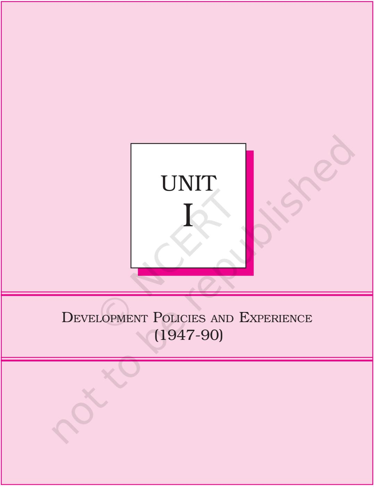
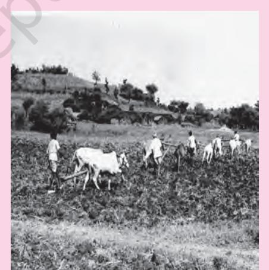
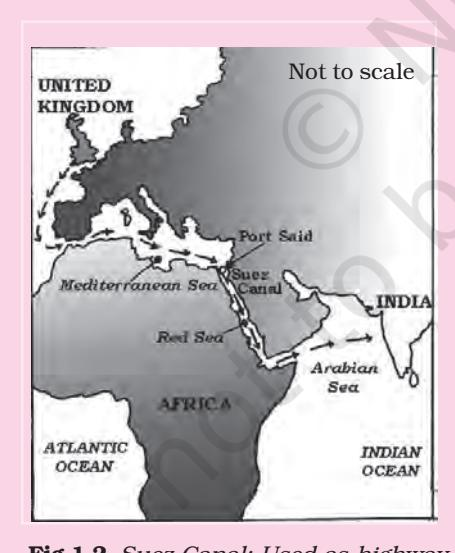
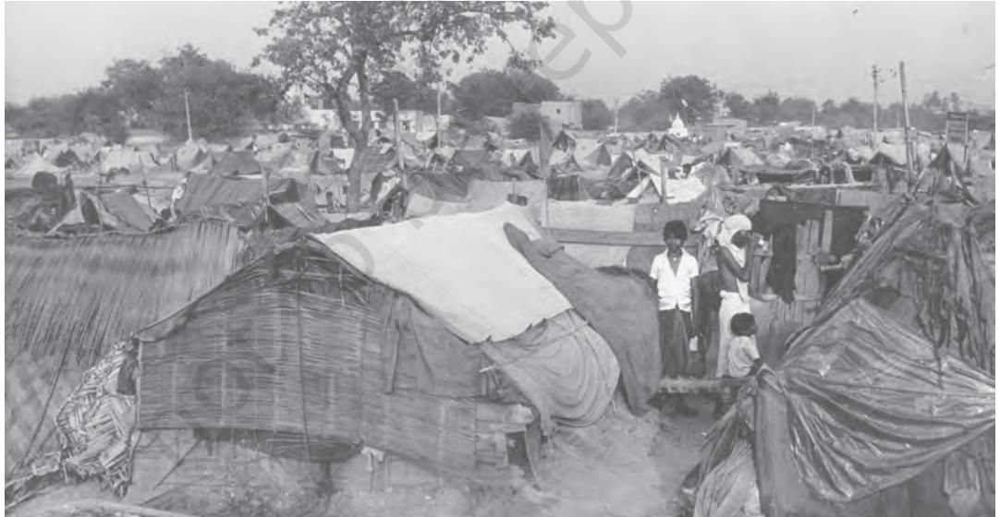
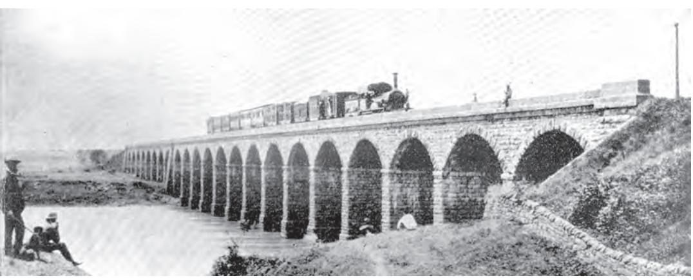

*The two chapters in this unit give us an overview of the state of the Indian economy as it was at the eve of independence till after four decades of planned development, which was a path that India chose. This meant that the Government of India had to take a series of steps such as the establishment of the Planning Commission and announcement of five year plans. An overview of the goals of five year plans and a critical appraisal of the merits and limitations of planned development has been covered in this unit.*

1

# **INDIAN ECONOMY ON THE EVE OF INDEPENDENCE**

## **After studying this chapter, the learners will**

- become familiar with the state of the Indian economy in 1947, the year of India's Independence
- understand the factors that led to the underdevelopment and stagnation of the Indian economy.

**"India is the pivot of our Empire... If the Empire loses any other part of its Dominion we can survive, but if we lose India, the sun of our Empire will have set."**

> **Victor Alexander Vruce, the Viceroy of British India in 1894**

## **1.1 INTRODUCTION**

The primary objective of this book, *Indian Economic Development*, is to familiarise you with the basic features of the Indian economy, and its development, as it is today, in the aftermath of Independence. However, it is equally important to know something about the country's economic past even as you learn about its present state and future prospects. So, let us first look at the state of India's economy prior to the country's independence and form an idea of the various considerations that shaped India's post-independence development strategy.

The structure of India's presentday economy is not just of current making; it has its roots steeped in history, particularly in the period when India was under British rule which lasted for almost two centuries before India finally won its independence on 15 August 1947. The sole purpose of the British colonial rule in India was to reduce the country to being a raw material supplier for Great Britain's own rapidly expanding modern industrial base. An understanding of the exploitative nature of this relationship is essential for any assessment of the kind and level of development which the Indian economy has been able to attain over the last seven and half decades. 1.2

## **1.2 LOW LEVEL OF ECONOMIC DEVELOPMENT UNDER THE COLONIAL RULE**

India had an independent economy before the advent of the British rule. Though agriculture was the main source of livelihood for most people, yet, the country's economy was characterised by various kinds of manufacturing activities. India was particularly well known for its handicraft industries in the fields of cotton and silk textiles, metal and precious stone works etc. These products enjoyed a worldwide market based on the reputation of the fine quality of material used and the high standards of craftsmanship seen in all imports from India (See Box 1.1).

#### **Box 1.1: Textile Industry in Bengal**

Muslin is a type of cotton textile which had its origin in Bengal, particularly, places in and around Dhaka (spelled during the pre-independence period as Dacca), now the capital city of Bangladesh. 'Daccai Muslin' had gained worldwide fame as an exquisite type of cotton textile. The finest variety of muslin was called *malmal*. Sometimes, foreign travellers also used to refer to it as *malmal shahi* or *malmal khas* implying that it was worn by, or fit for, the royalty.

The economic policies pursued by the colonial government in India were concerned more with the protection and promotion of the economic interests of their home country than with the development of the Indian economy. Such policies brought about a fundamental change in the structure of the Indian economy — transforming the country into supplier of raw materials and consumer of finished industrial products from Britain.

Obviously, the colonial government never made any sincere attempt to estimate India's **national** and **per capita income**. Some individual attempts which were made to measure such incomes yielded conflicting and inconsistent results. Among the notable estimators — Dadabhai Naoroji, William Digby, Findlay Shirras, V.K.R.V. Rao and

#### **Box 1.2: Agriculture During Pre-British India**

The French traveller, Bernier, described seventeenth century Bengal in the following way: "The knowledge I have acquired of Bengal in two visits inclines me to believe that it is richer than Egypt. It exports, in abundance, cottons and silks, rice, sugar and butter. It produces amply — for its own consumption wheat, vegetables, grains, fowls, ducks and geese. It has immense herds of pigs and flocks of sheep and goats. Fish of every kind it has in profusion. From *rajmahal* to the sea is an endless number of canals, cut in bygone ages from the Ganges by immense labour for navigation and irrigation."

R.C. Desai — it was Rao, whose estimates during the colonial period was considered very significant. However, most studies did find that the country's growth of aggregate real output during the first half of the twentieth century was less than two per cent coupled with a meagre half per cent growth in per capita output per year.

## **1.3 AGRICULTURAL SECTOR**

India's economy under the British colonial rule remained fundamentally agrarian — about 85 per cent of the country's population lived mostly in villages and derived livelihood directly or indirectly from agriculture (See Box 1.2). However, despite being the occupation of such a large population, the agricultural

**Fig. 1.1** *India's agricultural stagnation under the British colonial rule*

ÿ Take note of the agricultural prosperity in our country in the seventeenth century. Contrast it with agricultural stagnation around the time when the British left India, around 200 years later.

INDIAN ECONOMY ON THE EVE OF INDEPENDENCE 5

sector continued to experience stagnation and, not infrequently, unusual deterioration. **Agricultural pro-ductivity** became low though, in absolute terms, the sector experienced some growth due to the expansion of the aggregate area under cultivation. This stagnation in the agricultural sector was caused mainly because of the various systems of **land settlement** that were introduced by the colonial government. Particularly, under the *zamindari* system which was implemented in the then Bengal Presidency comprising parts of India's present-day eastern states, the profit accruing out of the agriculture sector went to the *zamindars* instead of the cultivators. However, a considerable number of *zamindars,* and not just the colonial government, did nothing to improve the condition of agriculture. The main interest of the *zamindars* was only to collect rent regardless of the economic condition of the cultivators; this caused immense misery and social tension among the latter. To a very great extent, the terms of the **revenue settlement** were also responsible for the *zamindars* adopting such an attitude; dates for depositing specified sums of revenue were fixed, failing which the *zamindars* were to lose their rights. Besides this, low levels of technology, lack of irrigation facilities and negligible use of fertilisers, all added up to aggravate the plight of the farmers and contributed to the dismal level of agricultural productivity. There was, of course, some evidence of a relatively higher yield of cash crops in certain areas of the country due to **commercialisation of agriculture**.

## **Work These Out**

- ÿ Compare the map of British India with that of independent India and find out the areas that became parts of Pakistan. Why were those parts so important to India from the economic point of view? (Refer, to your advantage, Dr Rajendra Prasad's book, *India Divided)*.
- ÿ What were the various forms of revenue settlement adopted by the British in India? Where did they implement them and to what effect? How far do you think those settlements have a bearing on the current agricultural scenario in India? (In your attempt to find answers to these questions, you may refer to Ramesh Chandra Dutt's *Economic History of India,* which comes in three volumes, and B.H. Baden-Powell's *The Land Systems of British India*, also in two volumes. For better comprehension of the subject, you can also try and develop an illustrated agrarian map of British India either by hand or with the help of your school computer. Remember, nothing helps better than an illustrated map to understand the subject at hand).

But this could hardly help farmers in improving their economic condition as, instead of producing food crops, now they were producing cash crops which were to be ultimately used by British industries back home. Despite some progress made in irrigation, India's agriculture was starved of investment in terracing, flood-control, drainage and desalinisation of soil. While a small section of farmers changed their cropping pattern from food crops to commercial crops, a large section of tenants, small farmers and sharecroppers neither had resources and technology nor had incentive to invest in agriculure.

#### **1.4 INDUSTRIAL SECTOR**

As in the case of agriculture, so also in manufacturing, India could not develop a sound industrial base under the colonial rule. Even as the country's world famous handicraft industries declined, no corresponding modern industrial base was allowed to come up to take pride of place so long enjoyed by the former. The primary motive of the colonial government behind this policy of systematically deindustrialising India was two-fold. The intention was, first, to reduce India to the status of a mere exporter of important raw materials for the upcoming modern industries in Britain and, second, to turn India into a sprawling market for the finished products of those industries so that their continued expansion could be ensured to the maximum advantage of their home country — Britain. In the unfolding economic scenario, the decline of the indigenous handicraft industries created not only massive unemployment in India but also a new demand in the Indian consumer market, which was now deprived of the supply of locally made goods. This demand was profitably met by the increasing imports of cheap manufactured goods from Britain.

During the second half of the nineteenth century, modern industry began to take root in India but its progress remained very slow. Initially, this development was confined to the setting up of cotton and jute textile mills. The cotton textile mills, mainly dominated by Indians, were located in the western parts of the country, namely, Maharashtra and Gujarat, while the jute mills dominated by the foreigners were mainly concentrated in Bengal. Subsequently, the iron and steel industries began coming up in the beginning of the twentieth century. The Tata Iron and Steel Company (TISCO) was incorporated in 1907. A few other industries in the fields of sugar, cement, paper etc. came up after the Second World War.

However, there was hardly any **capital goods industry** to help promote further industrialisation in India. Capital goods industry means industries which can produce machine tools which are, in turn, used for producing articles for current consumption. The establishment of a few manufacturing units here and

#### **Work These Out**

- ÿPrepare a list showing where and when other modern industries of India were first set up. Can you also find out what the basic requirements are for setting up any modern industry? What, for example, might have been the reasons for the setting up of the Tata Iron and Steel Company at Jamshedpur, which is now in the state of Jharkhand?
- ÿ How many iron and steel factories are there in India at present? Are these iron and steel factories among the best in the world or do you think that these factories need restructuring and upgradation? If yes, how can this be done? There is an argument that industries which are not strategic in nature should not continue to be in the public sector. What is your view?
- ÿ On a map of India, mark the cotton textiles, jute mills and textile mills that existed at the time of independence.

there was no substitute to the near wholesale displacement of the country's traditional handicraft industries. Furthermore, the growth rate of the new industrial sector and its contribution to the **Gross Domestic Product (GDP)** or **Gross Value Added** remained very small. Another significant drawback of the new industrial sector was the very limited area of operation of the public sector. This sector remained confined only to the railways, power generation, communications, ports and some other departmental undertakings.

## **1.5 FOREIGN TRADE**

India has been an important trading nation since ancient times. But the restrictive policies of commodity production, trade and tariff pursued by the colonial government adversely affected the structure, composition and volume of India's foreign trade. Consequently, India became an exporter of primary products such as raw silk, cotton, wool, sugar, indigo, jute etc. and an importer of finished consumer goods like cotton, silk and woollen clothes and capital goods like light machinery produced in the factories of Britain. For all practical purposes, Britain maintained a monopoly control over India's exports and imports. As a result, more than half of India's foreign trade was restricted to Britain while the rest was allowed with a few other countries like China, Ceylon (Sri Lanka) and Persia (Iran). The opening of the Suez Canal further intensified British control over India's foreign trade (see Box 1.3).

The most important characteristic of India's foreign trade throughout the colonial period was the generation of a large export surplus. But this surplus came at a huge cost to the country's economy. Several essential commodities—food grains, clothes,

#### **Work These Out**

- ÿ Prepare a list of items that were exported from and imported into India during the British rule.
- ÿ Collect information from the *Economic Survey* for various years published by the Ministry of Finance, Government of India, on various items of export from India and its imports. Compare these with imports and exports from the pre-independence era. Also find out the names of prominent ports which now handle the bulk of India's foreign trade.

kerosene etc. — were scarcely available in the domestic market. Furthermore, this export surplus did not result in any flow of gold or silver into India. Rather, this was used to make payments for the expenses incurred by an office set up by the colonial government in Britain, expenses on war, again fought by the British government, and the import of invisible items, all of which led to the drain of Indian wealth.

#### **1.6 DEMOGRAPHIC CONDITION**

Various details about the population of British India were first collected through a census in 1881. Though suffering from certain limitations, it revealed the unevenness in India's population growth. Subsequently,

**Fig.1.2** *Suez Canal: Used as highway between India and Britain*

#### **Box 1.3: Trade Through the Suez Canal**

Suez Canal is an artificial waterway running from north to south across the Isthmus of Suez in north-eastern Egypt. It connects Port Said on the Mediterranean Sea with the Gulf of Suez, an arm of the Red Sea. The canal provides a direct trade route for ships operating between European or American ports and ports located in South Asia, East Africa and Oceania by doing away with the need to sail around Africa. Strategically and economically, it is one of the most important waterways in the world. Its opening in 1869 reduced the cost of transportation and made access to the Indian market easier.

INDIAN ECONOMY ON THE EVE OF INDEPENDENCE 9

every ten years such census operations were carried out. Before 1921, India was in the first stage of **demographic transition**. The second stage of transition began after 1921. However, neither the total population of India nor the rate of population growth at this stage was very high.

The various social development indicators were also not quite encouraging. The overall literacy level was less than 16 per cent. Out of this, the female literacy level was at a negligible low of about seven per cent. Public health facilities were either unavailable to large chunks of population or, when available, were highly inadequate. Consequently, water and air-borne diseases were rampant and took a huge toll on life. No wonder, the overall **mortality rate** was very high and in that, particularly, the **infant mortality rate** was quite alarming—about 218 per thousand in contrast to the present infant mortality rate of 33 per thousand. **Life expectancy** was also very low—32 years in contrast to the present 69 years. In the absence of reliable data, it is difficult to specify the extent of poverty at that time but there is no doubt that extensive poverty prevailed in India during the colonial period which contributed to the worsening profile of India's population of the time.

#### **1.7 OCCUPATIONAL STRUCTURE**

During the colonial period, the occupational structure of India, i.e., distribution of working persons across different industries and sectors, showed little sign of change. The agricultural sector accounted for

**Fig. 1.3** *A large section of India's population did not have basic needs such as housing*

10 INDIAN ECONOMIC DEVELOPMENT

## **Work These Out**

- ÿ Can you find out the reasons behind frequent occurrence of famines in India before independence? You may read from Nobel Laureate Amartya Sen's book, *Poverty and Famines.*
- ÿPrepare a pie chart for the occupational structure in India at the time of independence.

the largest share of workforce, which usually remained at a high of 70-75 per cent while the manufacturing and the services sectors accounted for only 10 and 15-20 per cent respectively. Another striking aspect was the growing regional variation. Parts of the then Madras Presidency (comprising areas of the present-day states of Tamil Nadu, Andhra Pradesh, Kerala and Karnataka), Bombay and Bengal witnessed a decline in the dependence of the workforce on the agricultural sector with a commensurate increase in the manufacturing and the services sectors. However, there had been an increase in the share of workforce in agriculture during the same time in states such as Orissa, Rajasthan and Punjab.

#### **1.8 INFRASTRUCTURE**

Under the colonial regime, basic infrastructure such as railways, ports, water transport, posts and telegraphs did develop. However, the real motive behind this development was not to provide basic amenities to the people but to subserve various colonial interests. Roads constructed in India prior to the advent of the British rule were not fit for modern transport. The roads that were built primarily served the purposes of mobilising the army within India and drawing out raw materials from the countryside to the nearest railway station or the port to send these to far away England or other lucrative foreign destinations. There always remained an acute shortage of allweather roads to reach out to the rural areas during the rainy season. Naturally, therefore, people mostly living in these areas suffered grievously during natural calamities and famines.

The British introduced the railways in India in 1850 and it is considered as one of their most important contributions. The railways affected the structure of the Indian economy in two important ways. On the one hand it enabled people to undertake long distance travel and thereby break geographical and cultural barriers while, on the other hand, it fostered commercialisation of Indian agriculture which adversely affected the self-sufficiency of the village economies in India. The volume of India's exports undoubtedly expanded but its benefits rarely accrued to the Indian people. The social benefits, which the

INDIAN ECONOMY ON THE EVE OF INDEPENDENCE 11

**Fig. 1.4** *First Railway Bridge linking Bombay with Thane, 1854*

Indian people gained owing to the introduction of the railways, were thus outweighed by the country's huge economic loss.

Along with the development of roads and railways, the colonial dispensation also took measures for developing the inland trade and sea lanes. However, these measures were far from satisfactory. The inland waterways, at times, also proved uneconomical as in the case of the Coast Canal on the Orissa coast. Though the canal was built at a huge

**Fig.1.5** *Tata Airlines, a division of Tata and Sons, was established in 1932 inaugurating the aviation sector in India*

**Work This Out** ÿ There is a perception still going around that in many ways the British administration in India was quite beneficial. This perception needs an informed debate. How would you look at this perception? Argue this out in your class —'Was the British Raj good for India'?

cost to the government exchequer, yet, it failed to compete with the railways, which soon traversed the region running parallel to the canal, and had to be ultimately abandoned. The introduction of the expensive system of electric telegraph in India, similarly, served the purpose of maintaining law and order. The postal services, on the other hand, despite serving a useful public purpose, remained all through inadequate.

## **1.9 CONCLUSION**

By the time India won its independence, the impact of the two-century long British colonial rule was already showing on all aspects of the Indian economy. The agricultural sector was already saddled with surplus labour and extremely low productivity. The industrial sector was crying for modernisation, diversification, capacity building and increased public investment. Foreign trade was oriented to feed the Industrial Revolution in Britain. Infrastructure facilities, including the famed railway network, needed upgradation, expansion and public orientation. Prevalence of rampant poverty and unemployment required welfare orientation of public economic policy. In a nutshell, the social and economic challenges before the country were enormous.

**Recap**

- ÿ An understanding of the economy before independence is necessary to know and appreciate the level of development achieved during the postindependence period.
- ÿ Under the colonial dispensation, the economic policies of the government were concerned more with the protection and promotion of British economic interests than with the need to develop the economic condition of the colonised country and its people.
- ÿ The agricultural sector continued to experience stagnation and deterioration despite the fact that the largest section of Indian population depended on it for sustenance.
- ÿ The rule of the British-India government led to the collapse of India's world famous handicraft industries without contributing, in any significant manner, to its replacement by a modern industrial base.
- ÿ Lack of adequate public health facilities, occurrence of frequent natural calamities and famines pauperised the hapless Indian people and resulted in engendering high mortality rates.
- ÿ Some efforts were made by the colonial regime to improve infrastructure facilities but these efforts were spiced with selfish motives. However, the independent Indian government had to built on this base through planning.

**EXERCISES**

- 1. What was the focus of the economic policies pursued by the colonial government in India? What were the impacts of these policies?
- 2. Name some notable economists who estimated India's per capita income during the colonial period.
- 3. What were the main causes of India's agricultural stagnation during the colonial period?
- 4. Name some modern industries which were in operation in our country at the time of independence.
- 5. What was the two-fold motive behind the systematic deindustrialisation effected by the British in pre-independent India?
- 6. The traditional handicrafts industries were ruined under the British rule. Do you agree with this view? Give reasons in support of your answer.
- 7. What objectives did the British intend to achieve through their policies of infrastructure development in India?
- 8. Critically appraise some of the shortfalls of the industrial policy pursued by the British colonial administration.
- 9. What do you understand by the drain of Indian wealth during the colonial period?
- 10. Which is regarded as the defining year to mark the demographic transition from its first to the second decisive stage?
- 11. Give a quantitative appraisal of India's demographic profile during the colonial period.
- 12. Highlight the salient features of India's pre-independence occupational structure.
- 13. Underscore some of India's most crucial economic challenges at the time of independence.
- 14. When was India's first official census operation undertaken?
- 15. Indicate the volume and direction of trade at the time of independence.
- 16. Were there any positive contributions made by the British in India? Discuss.

**SUGGESTED ADDITIONAL ACTIVITIES**

- 1. Prepare a list of goods and services that were available to people in pre-independence India in rural and urban areas. Compare it with the consumption pattern of such goods and services by the people today. Highlight the perceptible difference in the people's standard of living.
- 2. Find pictures of towns/villages, in your vicinity, of the preindependence period and compare these with their present scenario. What changes can you mark? Are such changes for better or for worse? Discuss.
- 3. Rally around your teacher and organise a group discussion on 'Has the *zamindari* system really been abolished in India'? If the consensus is negative, then what measures would you think should be taken to banish it and why?
- 4. Identify the major occupations followed by the people of our country at the time of independence. What major occupations do the people follow today? In the light of reform policies, how would you visualise the occupational scenario in India 15 years from now—say, 2035?

- BADEN-POWELL, B.H. 1892. *The Land Systems of British India,* Vols I, II and III. Oxford Clarendon Press, Oxford.
- BUCHANAN, D.H. 1966. *Development of Capitalist Enterprise in India.* Frank Cass and Co, London.
- CHANDRA, BIPAN. 1993. 'The Colonial Legacy' in Bimal Jalan (Ed.), *The Indian Economy: Problems and Prospects.* Penguin Books, New Delhi.
- DUTT, R.C. 1963. *Economic History of India*, Vols I and II. Ministry of Information and Broadcasting, Government of India, New Delhi.
- KUMAR, D. AND MEGHNAD DESAI (Eds.). 1983. *Cambridge Economic History of India.* Cambridge University Press, Cambridge.
- MILL, JAMES.1972. *History of British India.* Associated Publishing House, New Delhi.

PRASAD, RAJENDRA. 1946. *India Divided.* Hind Kitabs, Bombay.

SEN, AMARTYA. 1999. *Poverty and Famines.* Oxford University Press, New Delhi.

#### **Government Reports**

*Economic Survey (for various years)*. Ministry of Finance, Government of India.

INDIAN ECONOMY ON THE EVE OF INDEPENDENCE 15

