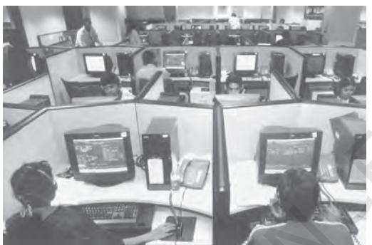

*After forty years of planned development, India has been able to achieve a strong industrial base and became self-sufficient in the production of food grains. Nevertheless, a major segment of the population continues to depend on agriculture for its livelihood. In 1991, a crisis in the balance of payments led to the introduction of economic reforms in the country. This unit is an appraisal of the reform process and its implications for India.*

# **LIBERALISATION, PRIVATISATION AND GLOBALISATION: AN APPRAISAL**

# **After studying this chapter, the learners will**

3

- understand the background of the reform policies introduced in India in 1991
- understand the mechanism through which reform policies were introduced
- comprehend the process of globalisation and its implications for India
- be aware of the impact of the reform process in various sectors.

**There is a consensus in the world today that economic development is not all and the GDP is not necessarily a measure of progress of a society.**

> **K.R. Narayanan, Former President of India**

# **3.1 INTRODUCTION**

You have studied in the previous chapter that, since independence, India followed the mixed economy framework by combining the advantages of the capitalist economic system with those of the socialist economic system. Some scholars argue that, over the years, this policy resulted in the establishment of a variety of rules and laws, which were aimed at controlling and regulating the economy, ended up instead in hampering the process of growth and development. Others state that India, which started its developmental path from near stagnation, has since been able to achieve growth in savings, developed a diversified industrial sector which produces a variety of goods and has experienced sustained expansion of agricultural output which has ensured food security.

In 1991, India met with an economic crisis relating to its external debt — the government was not able to make repayments on its borrowings from abroad; **foreign exchange reserves** , which we generally maintain to import petroleum and other important items, dropped to levels that were not sufficient for even a fortnight. The crisis was further compounded by rising prices of essential goods. All these led the government to introduce a new set of policy measures which changed the direction of our developmental strategies. In this chapter, we will look at the background of the crisis, measures that the government has adopted and their impact on various sectors of the economy.

# **3.2 BACKGROUND**

The origin of the financial crisis can be traced from the inefficient management of the Indian economy in the 1980s. We know that for implementing various policies and its general administration, the government generates funds from various sources such as taxation, running of public sector enterprises etc. When expenditure is more than income, the government borrows to finance the **deficit** from banks and also from people within the country and from international **financial institutions**. When we import goods like petroleum, we pay in dollars which we earn from our exports.

Development policies required that even though the revenues were very low, the government had to overshoot its revenue to meet challenges like unemployment, poverty and population explosion. The continued spending on development programmes of the government did not generate additional revenue. Moreover, the government was not able to generate sufficiently from internal sources such as taxation. When the government was spending a large share of its income on areas which do not provide immediate returns such as the social sector and defence, there was a need to utilise the rest of its revenue in a highly efficient manner. The income from public sector undertakings was also not very high to meet the growing expenditure. At times, our **foreign exchange**, borrowed from other countries and international financial institutions, was spent on meeting consumption needs. Neither was an attempt made to reduce such profligate spending nor sufficient attention was given to boost exports to pay for the growing imports.

In the late 1980s, government expenditure began to exceed its revenue by such large margins that meeting the expenditure through borrowings became unsustainable. Prices of many essential goods rose sharply. Imports grew at a very high rate without matching growth of exports. As pointed out earlier, foreign exchange reserves declined to a level that was not adequate to finance imports for more than two weeks. There was also not sufficient foreign exchange to pay the interest that needed to be paid to international lenders. Also no country or international funder was willing to lend to India.

India approached the **International Bank for Reconstruction and Development (IBRD)**, popularly known as **World Bank** and the **International Monetary Fund (IMF)**, and received $7 billion as loan to manage the crisis. For availing the loan, these international agencies expected India to liberalise and open up the economy by removing restrictions on the private sector, reduce the role of the government in many areas and remove trade restrictions between India and other countries*.*

India agreed to the conditionalities of World Bank and IMF and announced the **New Economic Policy (NEP)**. The NEP consisted of wide ranging economic reforms. The thrust of the policies was towards creating a more competitive environment in the economy and removing the barriers to entry and growth of firms. This set of policies can broadly be classified into two groups: the stabilisation measures and the structural reform measures. Stabilisation measures are shortterm measures, intended to correct some of the weaknesses that have developed in the **balance of payments** and to bring **inflation** under control. In simple words, this means that there was a need to maintain sufficient foreign exchange reserves and keep the rising prices under control. On the other hand, structural reform policies are long-term measures*,* aimed at improving the efficiency of the economy and increasing its international competitiveness by removing the rigidities in various segments of the Indian economy. The government initiated a variety of policies which fall under three heads viz., liberalisation, privatisation and globalisation.

# **3.3 LIBERALISATION**

As pointed out in the beginning, rules and laws which were aimed at regulating the economic activities became major hindrances in growth and development. Liberalisation was introduced to put an end to these restrictions and open various sectors of the economy. Though a few liberalisation measures were introduced in 1980s in areas of industrial licensing, **export-import policy**, technology upgradation, **fiscal policy** and foreign investment, reform policies initiated in 1991 were more comprehensive. Let us study some important areas, such as the industrial sector, financial sector, tax reforms, **foreign exchange markets** and trade and investment sectors which received greater attention in and after 1991.

**Deregulation of Industrial Sector:** In India, regulatory mechanisms were enforced in various ways (i) industrial licensingunder which every entrepreneur had to get permission from government officials to start a firm, close a firm or decide the amount of goods that could be produced (ii) private sector was not allowed in many industries (iii) some goods could be produced only in small-scale industries, and (iv) controls on price fixation and distribution of selected industrial products.

The reform policies introduced in and after 1991 removed many of these restrictions. Industrial licensing was abolished for almost all but product categories — alcohol, cigarettes, hazardous chemicals, industrial explosives, electronics, aerospace and drugs and pharmaceuticals. The only industries which are now reserved for the public sector are a part of atomic energy generation and some core activities in railway transport. Many goods produced by small-scale industries have now been **dereserved**. In most industries, the market has been allowed to determine the prices.

**Financial Sector Reforms:** Financial sector includes financial institutions, such as commercial banks, investment banks, **stock exchange** operations and foreign exchange market. The financial sector in India is regulated by the Reserve Bank of India (RBI). You may be aware that all banks and other financial institutions in India are regulated through various norms and regulations of the RBI. The RBI decides the amount of money that the banks can keep with themselves, fixes interest rates, nature of lending to various sectors, etc. One of the major aims of financial sector reforms is to reduce the role of RBI from regulator to facilitator of financial sector. This means that the financial sector may be allowed to take decisions on many matters without consulting the RBI.

LIBERALISATION, PRIVATISATION AND GLOBALISATION: AN APPRAISAL 41

The reform policies led to the establishment of private sector banks, Indian as well as foreign. Foreign investment limit in banks was raised to around 74 per cent. Those banks which fulfil certain conditions have been given freedom to set up new branches without the approval of the RBI and rationalise their existing branch networks. Though banks have been given permission to generate resources from India and abroad, certain managerial aspects have been retained with the RBI to safeguard the interests of the account-holders and the nation. Foreign Institutional Investors (FII), such as merchant bankers, mutual funds and pension funds, are now allowed to invest in Indian financial markets.

Tax Reforms: Tax reforms are concerned with the reforms in the government's taxation and public expenditure policies, which are collectively known as its fiscal policy. There are two types of taxes: direct and indirect. Direct taxes consist of taxes on incomes of individuals, as well as, profits of business enterprises*.* Since 1991, there has been a continuous reduction in the taxes on individual incomes as it was felt that high rates of income tax were an important reason for tax evasion. It is now widely accepted that moderate rates of income tax encourage savings and voluntary disclosure of income. The rate of corporation tax, which was very high earlier, has been gradually reduced. Efforts have also been made to reform the indirect taxes, taxes levied on commodities, in order to facilitate the establishment of a common national market for goods and commodities.

In the year 2016, Indian constitution was amended to empower state governments and union Government to come out with laws to impose Goods and Services Tax. This has led to introduction of GST in India. This is expected to generate additional revenue for the government, reduce tax evasion and create 'one nation, one tax and one market'. Another component of reform in this area is simplification. In order to encourage better compliance on the part of taxpayers, many procedures have been simplified and the rates also substantially lowered.

Foreign Exchange Reforms: The first important reform in the external sector was made in the foreign exchange market. In 1991, as an immediate measure to resolve the balance of payments crisis, the rupee was devalued against foreign currencies. This led to an increase in the inflow of foreign exchange. It also set the tone to free the determination of rupee value in the foreign exchange market from government control. Now, more often than not, markets determine exchange rates based on the demand and supply of foreign exchange.

Trade and Investment Policy Reforms: Liberalisation of trade and investment regime was initiated to increase international competitiveness of industrial production and also foreign investments and technology into the economy. The aim was also to promote the efficiency of local industries and adoption of modern technologies.

In order to protect domestic industries, India was following a regime of **quantitative restrictions** on imports. This was encouraged through tight control over imports and by keeping the **tariffs** very high. These policies reduced efficiency and competitiveness which led to slow growth of the manufacturing sector. The trade policy reforms aimed at (i) dismantling of quantitative restrictions on imports and exports (ii) reduction of tariff rates and (iii) removal of licensing procedures for imports. **Import licensing** was abolished except in case of hazardous and environmentally sensitive industries. Quantitative restrictions on imports of manufactured consumer goods and agricultural products were also fully removed from April 2001. **Export duties** have been removed to increase the competitive position of Indian goods in the international markets.

#### **Work These Out**

- ÿ Give an example each of nationalised bank, private bank, private foreign bank, FII and a mutual fund.
- ÿ Visit a bank in your locality with your parents. Observe and find out the functions it performs. Discuss the same with your classmates and prepare a chart on it.
- ÿ Find out from your parents if they pay taxes. If yes, why do they do so and how?
- ÿ Do you know that for a very long time countries used to keep silver and gold as reserves to make payments abroad? Find out in what form do we keep our foreign exchange reserves and find out from newspapers, magazines and the Economic Survey how much foreign exchange reserves India had during the last year. Also find the foreign currency of the following countries and its latest rupee exchange rate.

| Country | Currency | Value of 1(one) unit of foreign currency in Indian rupee |
| --- | --- | --- |
| U.S.A. |  |  |
| U.K. |  |  |
| Japan |  |  |
| China |  |  |
| Korea |  |  |
| Singapore |  |  |
| Germany |  |  |

#### **3.4 PRIVATISATION**

It implies shedding of the ownership or management of a government owned enterprise*.* Government companies are converted into private companies in two ways (i) by withdrawal of the government from ownership and management of public sector companies and or (ii) by outright sale of public sector companies.

Privatisation of the public sector enterprises by selling off part of the equity of PSEs to the public is known as **disinvestment**. The purpose of the sale, according to the government, was mainly to improve financial discipline and facilitate modernisation. It was also envisaged that private capital and managerial capabilities could be effectively utilised to improve the performance of the PSUs.

#### **Box 3.1: Navratnas and Public Enterprise Policies**

You must have read in your childhood about the famous *Navratnas* or Nine Jewels in the Imperial Court of King Vikramaditya who were eminent persons of excellence in the fields of art, literature and knowledge. In order to improve efficiency, infuse professionalism and enable them to compete more effectively in the liberalised global environment, the government identifies PSEs and declare them as *maharatnas, navratnas* and *miniratnas.* They were given greater managerial and operational autonomy, in taking various decisions to run the company efficiently and thus increase their profits. Greater operational, financial and managerial autonomy has also been granted to profit-making enterprises referred to as *miniratnas.*

The Central Public Sector Enterprises are designated with different status. A few examples of public enterprises with their status are as follows: (i) *Maharatnas* – (a) Indian Oil Corporation Limited, and (b) Steel Authority of India Limited, (ii) *Navratnas* – (a) Hindustan Aeronautics Limited, (b) Mahanagar Telephone Nigam Limited; and (iii) *Miniratnas* – (a) Bharat Sanchar Nigam Limited; (b) Airport Authority of India and (c) Indian Railway Catering and Tourism Corporation Limited.

Many of these profitable PSEs were originally formed during the 1950s and 1960s when self-reliance was an important element of public policy. They were set up with the intention of providing infrastructure and direct employment to the public so that quality end-product reaches the masses at a nominal cost and the companies themselves were made accountable to all stakeholders.

The granting of status resulted in better performance of these companies. Scholars allege that instead of facilitating public enterprises in their expansion and enabling them to become global players, the government partly privatised them through disinvesment. Of late, the government has decided to retain them in the public sector and enable them to expand themselves in the global markets and raise resources by themselves from financial markets.

# **Work These Out**

- ÿ Some scholars refer to disinvestment as the wave of privatisation spreading all over the world to improve the performance of public sector enterprises whereas others call it as outright sale of public property to the vested interests. What do you think?
- ÿ Prepare a poster which contains 10-15 news clippings which you consider as important and relating to *navaratnas* from newspapers. Also collect the logos and advertisements of these PSEs. Put these on the notice board and discuss them in the classroom.
- ÿ Do you think only loss making companies should be privatised? Why?
- ÿ Losses incurred by public sector enterprises are to be met out of the public budget. Do you agree with this statement? Discuss.

The government envisaged that privatisation could provide strong impetus to the inflow of FDI.

The government has also made attempts to improve the efficiency of PSUs by giving them autonomy in taking managerial decisions. For instance, some PSUs have been granted special status as *maharatnas, navratnas* and *miniratnas* (see Box 3.1).

# **3.5 GLOBALISATION**

Although globalisation is generally understood to mean integration of the economy of the country with the world economy, it is a complex phenomenon. It is an outcome of the set of various policies that are aimed at transforming the world towards greater interdependence and integration. It involves creation of networks and activities transcending economic, social and geographical boundaries. Globalisation attempts to establish links in such a way that the happenings in India can be influenced by events happening miles away. It is turning the world into one whole or creating a borderless world.

**Outsourcing:** This is one of the important outcomes of the globalisation process. In outsourcing, a company hires regular service from external sources, mostly from other countries, which was previously provided internally or from within the country (like legal advice, computer service, advertisement, security each provided by respective departments of the company). As a form of economic activity, outsourcing has intensified, in recent times, because of the growth of fast modes of communication, particularly the growth of Information Technology (IT). Many of the services such as voice-based business processes (popularly known as BPO or call centres), record keeping,

### **Box 3.2: Global Footprint!**

Owing to globalisation, you might find many Indian companies have expanded their wings to many other countries. For example, ONGC Videsh, a subsidiary of the Indian public sector enterprise, Oil and Natural Gas Corporation engaged in oil and gas exploration and production has projects in 16 countries. Tata Steel, a private company established in 1907, is one of the top ten global steel companies in the world which have operations in 26 countries and sell its products in 50 countries. It employs nearly 50,000 persons in other countries. HCL Technologies, one of the top five IT companies in India has offices in 31 countries and employs about 15,000 persons abroad. Dr Reddy's Laboratories, initially was a small company supplying pharmaceutical goods to big Indian companies, today has manufacturing plants and research centres across the world.

**Source**: *www.rediff.com accessed on 14.10.2014.*

accountancy, banking services, music recording, film editing, book transcription, clinical advice or even teaching are being outsourced by companies in developed countries to India. With the help of modern telecommunication links including the Internet, the text, voice and visual data in respect of these services is digitised and transmitted in real time over continents and national boundaries. Most multinational corporations, and even small companies, are outsourcing their services to India where they can

**Fig. 3.1** *Outsourcing: a new employment opportunity in big cities* purpose is also to enlarge

be availed at a cheaper cost with reasonable degree of skill and accuracy. The low wage rates and availability of skilled manpower in India have made it a destination for global outsourcing in the post-reform period.

**World Trade Organisation (WTO):** The WTO was founded in 1995 as the successor organisation to the General Agreement on Trade and Tariff (GATT). GATT was established in 1948 with 23 countries as the

> global trade organisation to administer all **multilateral trade agreements** by providing equal opportunities to all countries in the international market for trading purposes. WTO is expected to establish a rule-based trading regime in which nations cannot place arbitrary restrictions on trade. In addition, its

46 INDIAN ECONOMIC DEVELOPMENT

# **Work These Out**

- ÿ Many scholars argue that globalisation is a threat as it reduces the role of the government in many sectors. Some counter argue that it is an opportunity as it opens up markets to compete in and capture. Debate in the classroom.
- ÿ Prepare a chart consisting of a list of five companies that have BPO services in India, along with their turnover.
- ÿ Did you attend online classes or watched videos of your teachers or any other teacher taking classes during the last year through television, mobile phone or computers due to Covid 19 Pandemic? Share your experiences related to information technology.
- ÿ Is employment in call centres sustainable? What kinds of skills should people working in call centres acquire to get a regular income?
- ÿ If the multinational companies outsource many services to countries like India because of cheap manpower, what will happen to people living in the countries where the companies are located? Discuss.

production and trade of services, to ensure optimum utilisation of world resources and to protect the environment. The WTO agreements cover trade in goods as well as services to facilitate international trade (**bilateral** and multilateral) through removal of tariff as well as **non-tariff barriers** and providing greater market access to all member countries.

 As an important member of WTO, India has been in the forefront of framing fair global rules, regulations and safeguards and advocating the interests of the developing world. India has kept its commitments towards liberalisation of trade, made in the WTO, by removing quantitative restrictions on imports and reducing tariff rates.

| Sector | 1980-91 | 1992-2001 | 2002-07 | 2007-12 | 2012-13 | 2013-14 | 2014-15 |
| --- | --- | --- | --- | --- | --- | --- | --- |
| Agriculture | 3.6 | 3.3 | 2.3 | 3.2 | 1.5 | 4.2 | – 0.2* |
| Industry | 7.1 | 6.5 | 9.4 | 7.4 | 3.6 | 5 | 7.0* |
| Services | 6.7 | 8.2 | 7.8 | 10 | 8.1 | 7.8 | 9.8* |
| Total | 5.6 | 6.4 | 7.8 | 8.2 | 5.6 | 6.6 | 7.4 |

TABLE 3.1 **Growth of GDP and Major Sectors (in %)**

**Source:** *Economic Survey for various years, Ministry of Finance, Government of India.*

**Note:** **Data pertaining to Gross Value Added (GVA). The GVA is estimated from GDP by adding subsidies on production and subtracting indirect taxes.*

LIBERALISATION, PRIVATISATION AND GLOBALISATION: AN APPRAISAL 47

Some scholars question the usefulness of India being a member of the WTO as a major volume of international trade occurs among the developed nations. They also say that while developed countries file complaints over agricultural subsidies given in their countries, developing countries feel cheated as they are forced to open their markets for developed countries but are not allowed access to the markets of developed countries. What do you think?

**Fig. 3.2** *IT industry is seen as a major contributor to India's exports*

# **3.6 INDIAN E CONOMY DURING REFORMS: AN ASSESSMENT**

The reform process has completed three decades since its introduction. Let us now look at the performance of the Indian economy during this period. In economics, the growth of an economy is measured by the Gross Domestic Product. Look at Table 3.1. The post–1991 India witnessed a rapid growth in GDP on a continual basis for two decades. The growth of GDP increased from 5.6 per cent during 1980–91 to 8.2 per cent during 2007–12. During the reform period, the growth of agriculture has declined. While the industrial sector reported fluctuation, the growth of the service sector has gone up. This indicates that GDP growth is mainly driven by growth in the service sector. During 2012-15, there has been a setback in the growth rates of different sectors witnessed post–1991. While agriculture recorded a high growth rate during 2013–14, this sector witnessed negative growth in the subsequent year. While the service sector continued to witness a high level of growth — higher than the overall GDP growth in 2014–15, this sector witnessed the high growth rate of 9.8 per cent. The industrial sector witnessed a steep decline during 2012– 13, in the subsequent years it began to show a continuous positive growth.

 The opening of the economy has led to a rapid increase in foreign direct investment and foreign exchange reserves. The foreign investment, which includes **foreign direct investment (FDI)** and **foreign institutional investment (FII)**, has increased from about US $100 million in 1990-91 to US $ 30 billion in 2017-18. There has been an increase in the foreign exchange reserves from about US $ 6 billion in 1990-91 to about US $ 413 billion in 2018-19. India is one of the largest foreign exchange reserve holders in the world.

 Since 1991, India is seen as a successful exporter of auto parts, pharmaceutical goods engineering goods, IT software and textiles. Rising prices have also been kept under control.

# **Work These Out**

ÿ In the previous chapter, you might have studied about subsidies in various sectors, including agriculture. Some scholars argue that subsidy in agriculture should be removed to make the sector internationally competitive. Do you agree? If so, how can it be done? Discuss in class.

ÿ Read the following passage and discuss in class.

Groundnut is a major oilseed crop in Andhra Pradesh. Mahadeva, who was a farmer in Anantpur district of Andhra Pradesh, used to spend Rs. 10,000 for growing groundnut on his plot of half an acre. The cost included expenditure on raw material (seeds, fertilisers, etc.), labour, bullock power and machinery used. On an average, Mahadeva used to get two quintals of groundnut, and each quintal was sold for Rs. 7,000. Mahadeva, thus, was spending Rs. 10,000 and getting an income of Rs. 14,000. Anantpur district is a drought-prone area. As a result of economic reforms, the government did not undertake any major irrigation project. Recently, groundnut crop in Anantpur is facing problems due to crop disease. Research and extension work has gone down due to lower government expenditure. Mahadeva and his friends brought this matter repeatedly to the notice of the government officials entrusted with this responsibility, but failed. Subsidy was reduced on material (seeds, fertilisers) which increased Mahadeva's cost of cultivation. Moreover, the local markets were flooded with cheap imported edible oils, which was a result of removal of restriction on imports. Mahadeva was not able to sell his groundnut in the market as he was not getting the price to cover his cost.

What could be done to farmers like Mahadeva from incurring losses? Discuss in the class.

On the other hand, the reform process has been widely criticised for not being able to address some of the basic problems facing our economy especially in areas of employment, agriculture, industry, infrastructure development and fiscal management.

**Growth and Employment:** Though the GDP growth rate has increased in the reform period, scholars point out that the reform-led growth has not generated sufficient employment opportunities in the country. You will study the link between different aspects of employment and growth in the next unit.

LIBERALISATION, PRIVATISATION AND GLOBALISATION: AN APPRAISAL 49

**Reforms in Agriculture:** Reforms have not been able to benefit agriculture, where the growth rate has been decelerating.

Since 1991, public investment in agriculture sector especially in infrastructure, which includes irrigation, power, roads, market linkages and research and extension (which played a crucial role in the Green Revolution), has fallen. Further, the partial removal of fertiliser subsidy has led to increase in the cost of production, which has severely affected the small and marginal farmers. This sector has been experiencing a number of policy changes such as reduction in import duties on agricultural products, low minimum support price and lifting of quantitative restrictions on the imports of agricultural products. These have adversely affected Indian farmers as they now have to face increased international competition.

Moreover, because of exportoriented policy strategies in agriculture, there has been a shift from production for the domestic market towards production for the export market focusing on cash crops in lieu of production of food grains. This puts pressure on prices of food grains.

**Reforms in Industry:** Industrial growth has also recorded a slowdown. This is because of decreasing demand of industrial products due to various reasons such as cheaper imports, inadequate investment in infrastructure etc. In a globalised world, developing countries are compelled to open up their economies to greater flow of goods and capital from developed countries and rendering their industries vulnerable to imported goods. Cheaper imports have, thus, replaced the demand for domestic goods. Domestic manufacturers are facing competition from imports. The infrastructure facilities, including power supply, have remained inadequate due to lack of investment. Globalisation is, thus, often seen as creating conditions for the free movement of goods and services from foreign countries that adversely affect the local industries and employment opportunities in developing countries.

Moreover, a developing country like India still does not have the access to developed countries' markets because of high non-tariff barriers. For example, although all quota restrictions on exports of textiles and clothing have been removed in India, USA has not removed their quota restriction on import of textiles from India and China.

**Disinvestment:** Every year, the government fixes a target for disinvestment of PSEs. For instance, in 1991-92, it was targeted to mobilise Rs 2500 crore through disinvestment. The government was able to mobilise ` 3,040 crore more than the target. In 2017–18, the target was about `1,00,000 crore, and the achievement was about ` 1,00,057 crore. Critics point out that the assets of PSEs have been undervalued and sold to the private sector. This means that there has been a substantial loss to the government and the outright sale of public assets! Moreover, the proceeds from disinvestment are used to offset the shortage of government revenues rather than using it for the development of PSEs and building social infrastructure in the country. Do you think selling a part of the properties of government companies is the best way to improve their efficiency?

**Reforms and Fiscal Policies:** Economic reforms have placed limits on the growth of public expenditure, especially in social sectors. The tax reductions in the reform period, aimed at yielding larger revenue and curb tax evasion, have not resulted in increase in tax revenue for the government. Also, the reform policies, involving tariff reduction, have curtailed the scope for raising revenue through custom duties. In order to attract foreign investment, tax incentives are provided to foreign investors which further reduced the scope for raising tax revenues. This has a negative impact on developmental and welfare expenditures.

# **3.7 CONCLUSION**

The process of globalisation through liberalisation and privatisation policies has produced positive, as well as, negative results both for India and other countries. Some scholars argue that globalisation should be seen as an opportunity in terms of greater access to global markets, high technology and increased possibility of large industries of developing countries to become important players in the international arena.

### **Box 3.3: Siricilla Tragedy!**

Power sector reforms in many Indian states led to do away with the supply of electricity at subsidised rates and steep rise in power tariff. This has affected workers engaged in small industries. Powerloom textile industry in Andhra Pradesh is an example. Since the wages of the powerloom workers are linked to the production of cloth, power cut means cut in wages of weavers, who were already suffering from hike in tariff. A few years ago, this led to a crisis in the livelihood of the weavers and 50 powerloom workers committed suicide in a small town called 'Siricilla' in Andhra Pradesh.

- ÿ Do you think the power tariff should not be raised?
- ÿ What would be your suggestions to revive small industries affected by reforms?

On the contrary, the critics argue that globalisation is a strategy of the developed countries to expand their markets in other countries. According to them, it has compromised the welfare and identity of people belonging to poor countries. It has further been pointed out that marketdriven globalisation has widened the economic disparities among nations and people.

Viewed from the Indian context, some studies have stated that the crisis that erupted in the early 1990s was basically an outcome of the deeprooted inequalities in Indian society and the economic reform policies initiated as a response to the crisis by the government, with externally advised policy package, further aggravated the inequalities. Further, it has increased the income and quality of consumption of only highincome groups and the growth has been concentrated only in some select areas in the services sector such as telecommunication, information technology, finance, entertainment, travel and hospitality services, real estate and trade, rather than vital sectors such as agriculture and industry which provide livelihoods to millions of people in the country.

- ÿ The economy was facing problems of declining foreign exchange, growing imports without matching rise in exports and high inflation. India changed its economic policies in 1991 due to a financial crisis and pressure from international organisations like the World Bank and IMF.
- ÿ In the domestic economy, major reforms were undertaken in the industrial and financial sectors. Major external sector reforms included foreign exchange deregulations and import liberalisation.
- ÿ With a view to improving the performance of the public sector, there was a consensus on reducing its role and opening it up to the private sector. This was done through disinvestment and liberalisation measures.
- ÿ Globalisation is the outcome of the policies of liberalisation and privatisation. It means an integration of the economy of the country with the world economy.
- ÿ Outsourcing is emerging as a major activity in industrial and service sectors.
- ÿ The objective of the WTO is to establish a rule based trade regime to ensure optimum utilisation of world resources.
- ÿ During the reforms, growth of agriculture and industry has gone down but the service sector has registered growth.
- ÿ Reforms have not benefited the agriculture sector. There has also been a decline in public investment in this sector.
- ÿ Industrial sector growth has slowed down due to availability of cheaper imports and lower investment.

- 1. Why were reforms introduced in India?
- 2. Why is it necessary to became a member of WTO?
- 3. Why did RBI have to change its role from controller to facilitator of financial sector in India?
- 4. How is RBI controlling the commercial banks?
- 5. What do you understand by devaluation of rupee?
- 6. Distinguish between the following
	- (i) Strategic and Minority sale
	- (ii) Bilateral and Multi-lateral trade
	- (iii) Tariff and Non-tariff barriers.
- 7. Why are tariffs imposed?
- 8. What is the meaning of quantitative restrictions?
- 9. Those public sector undertakings which are making profits should be privatised. Do you agree with this view? Why?
- 10. Do you think outsourcing is good for India? Why are developed countries opposing it?
- 11. India has certain advantages which makes it a favourite outsourcing destination. What are these advantages?
- 12. Do you think the *navaratna* policy of the government helps in improving the performance of public sector undertakings in India? How?
- 13. What are the major factors responsible for the high growth of the service sector?
- 14. Agriculture sector appears to be adversely affected by the reform process. Why?
- 15. Why has the industrial sector performed poorly in the reform period?
- 16. Discuss economic reforms in India in the light of social justice and welfare.

LIBERALISATION, PRIVATISATION AND GLOBALISATION: AN APPRAISAL 53

# **SUGGESTED ADDITIONAL ACTIVITIES**

- 1. The table given below shows the GDP growth rate at 2004-05 prices. You have studied about the techniques of presentation of data in your *Statistics for Economics* course. Draw a time series line graph based on the data given in the table and interpret the same.

| Year | GDP Growth Rate (%) |
| --- | --- |
| 2005-06 | 9.5 |
| 2006-07 | 9.6 |
| 2007-08 | 9.3 |
| 2008-09 | 6.7 |
| 2009-10 | 8.6 |
| 2010-11 | 8.9 |
| 2011-12 | 6.7 |
| 2012-13 | 5.4 |
| 2013-14 | 6.4 |
| 2014-15 | 7.4 |

- 2. Observe around you you will find State Electricity Boards (SEBs), BSES and many public and private organisations supplying electricity in different states and union territories. There are private buses on roads alongside the goverment bus services and so on.
	- (i) What do you think about this dual system of the co-existence of public and private sectors?
	- (ii) What are the merits and demerits of such a dual system? Discuss.
- 3. With the help of your parents and grandparents prepare a list of multinational companies that existed in India at the time of independence. Now put a (¸) mark against those which are still growing and a (**×**) against those which do not exist any more. Are there any companies whose names have changed? Find out the new names, the country of origin, nature of product, logo and prepare charts and display in your class.

- 4. Give appropriate examples for the following:

| Nature of Product | Name of a Foreign Company |
| --- | --- |
| Biscuits |  |
| Shoes |  |
| Computers |  |
| Cars |  |
| TV and Refrigerators |  |
| Stationery |  |

Now, find out if these companies which are mentioned above existed in India before 1991, or came after the New Economic Policy. For this, take the help of your teacher, parents, grandparents and shopkeepers.

- 5. Collect a few relevant newspaper cuttings and from the internet on meetings organised by WTO. Discuss the issues debated in these meetings, and find out how WTO facilitates world trade.
- 6. Was it necessary for India to introduce economic reforms at the behest of World Bank and International Monetary Fund? Was there no alternative for the government to solve the balance of payments crisis? Discuss in the classroom.

#### **Books**

- ACHARYA, S. 2003. *India's Economy: Some Issues and Answers.* Academic Foundation, New Delhi.
- ALTERNATIVE SURVEY GROUP. 2005. *Alternative Economic Survey, India 2004–05, Disequalising Growth.* Daanish Books, Delhi.
- AHLUWALIA, I.J. and I.M.D. LITTLE. 1998. *India's Economic Reforms and Development*. Oxford University Press, New Delhi.
- BARDHAN, PRANAB. 1998. *The Political Economy of Development in India.* Oxford University Press, Delhi.
- BHADURI, AMIT and DEEPAK NAYYAR. 1996. *The Intelligent Person's Guide to Liberalisation.* Penguin, Delhi.
- BHAGWATI, JAGDISH. 1992. *India in Transition: Freeing the Economy.* Oxford University Press, Delhi.

LIBERALISATION, PRIVATISATION AND GLOBALISATION: AN APPRAISAL 55

- BYRES, T ERENCE J. 1997. *The State, Development Planning and Liberalisation in India.* Oxford University Press, Delhi.
- CHADHA, G.K. 1994. *Policy Perspectives in Indian Economic Development.* Har-Anand, Delhi.
- CHELLIAH, RAJA J*.* 1996. *Towards Sustainable Growth: Essays in Fiscal and Financial Sector Reforms in India.* Oxford University Press, New Delhi.
- DEBROY, B. and RAHUL MUKHERJI (Eds.). 2004. *The Political Economy of Reforms.* Bookwell Publication, New Delhi.
- DREZE, JEAN and AMARTYA SEN. 1996. *India: Economic Development and Social Opportunity.* Oxford University Press, New Delhi.
- DUTT, RUDDAR AND K.P.M. SUNDARAM. 2005. *Indian Economy. S.* Chand and Company, New Delhi.
- GUHA, ASHOK (Ed.) 1990. *Economic Liberalisation, Industrial Structure and Growth in India.* Oxford University Press, New Delhi.
- JALAN, BIMAL. 1993. *India's Economic Crisis*: *The Way Ahead.* Oxford University Press, New Delhi.
- JALAN, BIMAL. 1996. *India's Economic Policy: Preparing for the Twenty First Century.* Viking, Delhi.
- JOSHI, VIJAY and I.M.D. LITTLE. 1996. *India's Economic Reforms 1991-2001.* Oxford University Press, New Delhi,
- KAPILA, Uma. 2020. *Indian Economy: Performences and Policies.* Academic Foundation, New Delhi.
- MAHAJAN, V.S. 1994. *Indian Economy Towards 2000 A.D.* Deep & Deep, Delhi.
- PAREKH, KIRIT and RADHAKRISHNA, *2002, India Development Report* 2001-02. Oxford University Press, New Delhi.
- RAO, C.H. HANUMANTHA. and HANS LINNEMANN. 1996. *Economic Reforms and Poverty Alleviation in India*, Sage Publication, Delhi.
- SACHS, JEFFREY D., ASHUTOSH VARSHNEY and NIRUPAM BAJPAI.1999. *India in the Era of Economic Reforms.* Oxford University Press, New Delhi.

#### **Government Reports and Websites**

*Economic Survey* for various years. Ministry of Finance, Government of India. Published by Oxford University Press, New Delhi.

*Tenth Five Year Plan 1997-2002.* Vol. 1. Government of India, Planning Commission, New Delhi.

Appraisal Document of Twelfth Five Year Plan 2012-2017, NITI Aayog, Government of India.

*https://dipam.gov.in*

*Handbook of Statistics on Indian Economy,* Reserve Bank of India for various years, Mumbai.

