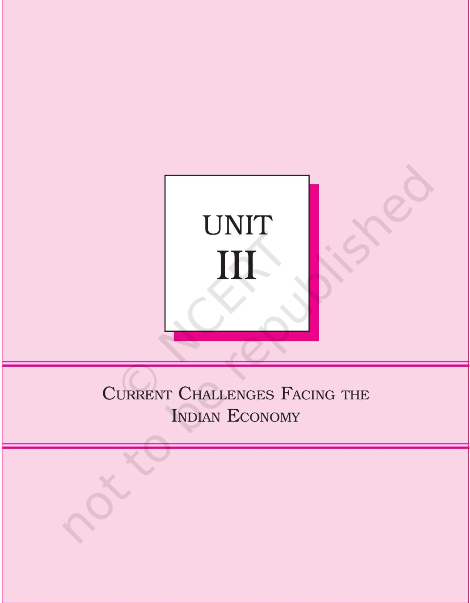
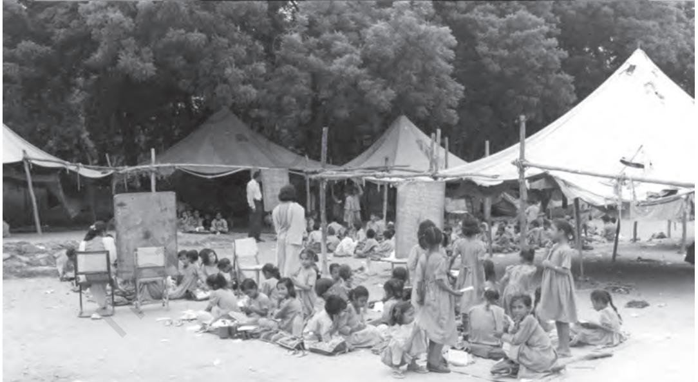
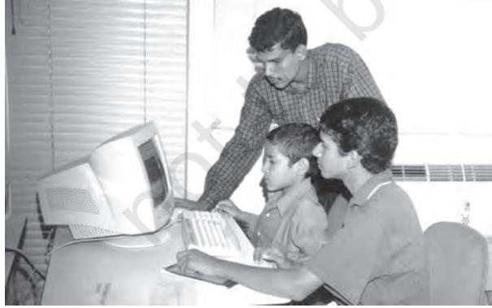
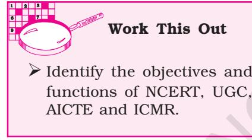

4

# **HUMAN CAPITAL FORMATION IN INDIA**

# **After studying this chapter, the learners will understand**

- the concepts of Human Resource, Human Capital Formation and Human Development
- the links between investment in human capital, economic growth and human development
- the need for government spending on education and health
- the state of India's educational attainment.

**"... the wisdom of expending public and private funds on education is not to be measured by its direct fruits alone. It will be profitable as a mere investment, to give the masses of people much greater opportunities than they can generally avail themselves of. For by this means many, who would have died unknown, are enabled to get the start needed for bringing out their latent abilities".**

> **Alfred Marshall**

# **4.1 INTRODUCTION**

Think of one factor that has made a great difference in the evolution of mankind. Perhaps it is human capacity to store and transmit knowledge which they have been doing through conversation, through songs and through elaborate lectures. But humans soon found out that we need a good deal of training and skill to do things efficiently. We know that the labour skill of an educated person is more than that of an uneducated person and hence the former is able to generate more income than the latter and his or her contribution to economic growth is, consequently, more.

Education is sought not only as it confers higher earning capacity on people but also for its other highly valued benefits: it gives one a better social standing and pride; it enables one to make better choices in life; it provides knowledge to understand the changes taking place in society; it also stimulates innovations. Moreover, the availability of educated labour force facilitates adaptation of new

**Fig. 4.1** *Adequate education and training to farmers can raise productivity in farms*

HUMAN CAPITAL FORMATION IN INDIA 59

technologies. Economists have stressed the need for expanding educational opportunities in a nation as it accelerates the development process.

# **4.2 WHAT IS HUMAN CAPITAL?**

Just as a country can turn physical resources like land into physical capital like factories, similarly, it can also turn human resources like nurses, farmers, teachers, students into human capital like engineers and doctors. Societies need sufficient human capital in the first place—in the form of competent people who have themselves been educated and trained as professors and other professionals. In other words, we need good human capital to produce other human capital (say, nurses, farmers, teachers, doctors, engineers...). This means that we need investment in human capital to produce more human capital out of human resources.

Let us understand a little more of what human capital means by posing the following questions :

- (i) What are the sources of human capital?
- (ii) Is there any relation between human capital and economic growth of a country?
- (iii) Is the formation of human capital linked to people's all-round development or, as it is now called, human development?
- (iv) What role can the government play in human capital formation in India?

# **4.3 SOURCES OF HUMAN CAPITAL**

Investment in education is considered as one of the main sources of human capital. There are several other sources as well. Investments in health, on- thejob training, migration and information are the other sources of human capital formation.

Why do your parents spend money on education? Spending on

> **Work This Out** ÿ Identify and collect the data from three families from different strata (i) very poor (ii) middle class and (iii) affluent. Study the expenditure pattern of the families on education of male and female children.

education by individuals is similar to spending on capital goods by companies with the objective of increasing future profits over a period of time. Likewise, individuals invest in education with the objective of increasing their future income.

Like education, health is also considered as an important input for the development of a nation as much as it is important for the development of an individual.

Who can work better —a sick person or a person with sound health? A sick labourer without access to medical facilities is compelled to abstain from work and there is loss of productivity. Hence, expenditure on health is an important source of human capital formation.

The amount of money spent on preventive medicine (vaccination), **curative medicine** (medical intervention during illness), **social medicine** (spread of health literacy) and provision of clean

drinking water and good sanitation are the various forms of health expenditures. Health expenditure directly increases the supply of healthy labour force and is, thus, a source of

human capital formation. Firms spend on giving **on-thejob-training** to their workers. This may take different forms:

one, the workers may be trained in the firm itself under the supervision of a skilled worker; two, the workers may be sent for off-campus training. In both these cases firms incur some expenses. Firms will, thus, insist that the workers should work for a specific period of time, after their on-the-job training, during which it can recover the benefits of the enhanced productivity owing to the training. Expenditure regarding onthe-job training is a source of human capital formation as the return of such expenditure in the form of enhanced labour productivity is more than the cost of it.

People **migrate** in search of jobs that fetch them higher salaries than what they may get in their native

places. Unemployment is the reason for the rural-urban migration in India. Technically qualified persons, like engineers and doctors, migrate to other countries because of higher salaries that they may get in such countries. Migration in both these cases involves cost of transport, higher cost of living in the migrated places and psychic costs of living in a strange sociocultural setup. The enhanced earnings in the new place outweigh the costs of migration; hence, expenditure on migration is also a source of human capital formation.

People spend to acquire **information** relating to the labour market and other markets like education and health. For example, people want to know the level of salaries associated with various types of jobs, whether the educational institutions provide the right type of employable skills and at what cost. This information is necessary to make decisions regarding investments in human capital as well as for efficient utilisation of the acquired human capital stock. Expenditure incurred for acquiring information relating to the labour market and other markets is also a source of human capital formation.

## **Box 4.1: Physical and Human Capital**

Both the forms of capital formation are outcomes of conscious investment decisions. Decision regarding investment in physical capital is taken on the basis of one's knowledge in this regard. The entrepreneur possesses knowledge to calculate the expected rates of return to a range of investments and then rationally decides which one of the investments should be made. The ownership of physical capital is the outcome of the conscious decision of the owner — the physical capital formation is mainly an economic and technical process. A substantial part of the human capital formation takes place in one's life when she/he is unable to decide whether it would maximise her/his earnings. Children are given different types of school education and health care facilities by their parents and the society. The peers, educators and society influence the decisions regarding human capital investments even at the tertiary level, that is, at the college level. Moreover, the human capital formation at this stage is dependent upon the already formed human capital at the school level. Human capital formation is partly a social process and partly a conscious decision of the possessor of the human capital.

You know that the owner of a physical capital, say a bus, need not be present in the place where it is used; whereas, a bus-driver, who possesses the knowledge and ability to drive the bus, should be present when the bus is used for transportation of people and materials. Physical capital is tangible and can be easily sold in the market like any other commodity. Human capital is intangible; it is endogenously built in the body and mind of its owner. Human capital is not sold in the market; only the services of the human capital are sold and, hence, there arises the necessity of the owner of the human capital to be present in the place of production. The physical capital is separable from its owner, whereas, human capital is inseparable from its owner.

The two forms of capital differ in terms of mobility across space. Physical capital is completely mobile between countries except for some artificial trade restrictions. Human capital is not perfectly mobile between countries as movement is restricted by nationality and culture. Therefore, physical capital formation can be built even through imports, whereas human capital formation is to be done through conscious policy formulations in consonance with the nature of the society and economy and expenditure by the state and the individuals.

Both forms of capital depreciate with time but the nature of depreciation differs between the two. Continuous use of machine leads to depreciation and change of technology makes a machine obsolete. In the case of human capital, depreciation takes place with ageing but can be reduced, to a large extent, through continuous investment in education, health, etc. This investment also facilitates the human capital to cope with change in technology which is not the case with physical capital.

Nature of benefits flowing from human capital are different from that of physical capital. Human capital benefits not only the owner but also the society in general. This is called external benefit. An educated person can effectively take part in a democratic process and contribute to the socio-economic progress of a nation. A healthy person, by maintaining personal hygiene and sanitation, stops the spread of contagious diseases and epidemics. Human capital creates both private and social benefits, whereas physical capital creates only private benefit. That is, benefits from a capital good flow to those who pay the price for the product and services produced by it.

The concept of physical capital is the base for conceptualising human capital. There are some similarities between the two forms of capital; there are some striking dissimilarities as well. See Box 4.1.

**Human Capital and Economic Growth:** Who contributes more to national income — a worker in a factory or a software professional? We know that the labour skill of an educated person is more than that of an uneducated person and that the former generates more income than the latter. Economic growth means the increase in real national income of a country; naturally, the contribution of the educated person to economic growth is more than that of an illiterate person. If a healthy person could provide

uninterrupted labour supply for a longer period of time, then health is also an important factor for economic growth. Thus, both education and health, along with many other factors like on-the-job training, job market information and migration, increase an

have buildings?

**Fig. 4.2** *Creating human capital: a school being run in make shift premises in Delhi*

HUMAN CAPITAL FORMATION IN INDIA 63

individual's income generating capacity.

 This enhanced productivity of human beings or human capital contributes substantially not only towards increasing labour productivity but also stimulates innovations and creates ability to absorb new technologies. Education provides knowledge to understand changes in society and scientific advancements, thus, facilitate inventions and innovations. Similarly, the availability of educated labour force facilitates adaptation to new technologies.

Empirical evidence to prove that increase in human capital causes economic growth is rather nebulous. This may be because of measurement problems. For example, education measured in terms of years of schooling, teacher-pupil ratio and enrolment rates may not reflect the quality of education; health services measured in monetary terms, life expectancy and mortality rates may not reflect the true health status of the people in a country. Using the indicators mentioned above, an analysis of improvement in education and health sectors and growth in real per capita income in both developing and developed countries shows that there is convergence in the measures of human capital but no sign of convergence of per capita real income. In other words, the human capital growth in developing countries has been faster but the growth of per capita real income has not been that fast. There are reasons to believe that the

**Fig. 4.3** *Scientific and technical manpower: a rich ingredient of human capital*

causality between human capital and economic growth flows in either directions. That is, higher income causes building of high level of human capital and vice versa, that is, high level of human capital causes growth of income.

India recognised the importance of human capital in economic growth long ago. The Seventh Five Year Plan says, "Human resources development (read human capital) has necessarily to be assigned a key role in any development strategy, particularly in a country with a large population. Trained and educated on sound lines, a large population can itself become an asset in accelerating economic growth and in ensuring social change in desired directions."

It is difficult to establish a relation of cause and effect from the growth of human capital (education and health) to economic growth but we can see in

## TABLE 4.1

| Particulars |  | 1951 | 1981 | 1991 | 2001 | 2016-17 |
| --- | --- | --- | --- | --- | --- | --- |
| Real Per Capita Income (in Rs) |  | 7,651 | 12,174 | 15,748 | 23,095 | 77,659 |
| Crude Death |  | 25.1 | 12.5 | 9.8 | 8.1 | 6.3 |
| Rate (Per 1,000 Population) |  |  |  |  |  |  |
| Infant Mortality Rate |  | 146 | 110 | 80 | 63 | 33 |
| Life Expectancy | Male | 37.2 | 54.1 | 59.7 | 63.9 | 67 |
| at Birth (in Years) |  |  |  |  |  |  |
| Female |  | 36.2 | 54.7 | 60.9 | 66.9 | 70 |
| Literacy Rate (%) |  | 16.67 | 43.57 | 52.21 | 65.20 | 76 |

## **Select Indicators of Development in Education and Health Sectors**

**Source:** *Economic Survey for various years, Ministry of Finance; National Statistical Office, Ministry of Statistics and Programme Implementation, Government of India.*

Table 4.1 that these sectors have grown simultaneously. Growth in each sector probably has reinforced the growth of every other sector.

The National Education Policy 2020 states that the world is undergoing rapid changes in the knowledge landscape. With various dramatic scientific and technological advances, such as the rise of big data, machine learning, and artificial intelligence, many unskilled jobs worldwide may be taken over by machines, while the need for a skilled

**Fig. 4.4** *Job on hand: transforming India into a knowledge economy*

workforce, particularly involving mathematics, computer science, and data science, in conjunction with multidisciplinary abilities across the sciences and social sciences, and humanities, will be increasingly in greater demand. With climate change, increasing pollution, and depleting natural resources, there will be a sizeable shift in how we meet the world's energy, water, food, and sanitation needs, again resulting in the need for new skilled labour, particularly in biology, chemistry, physics,

agriculture, climate science, and social science. The growing emergence of epidemics and pandemics will also call for collaborative research in infectious disease management and development of vaccines and the resultant social issues heightens the need for multidisciplinary learning. There will be a growing demand for humanities and art, as India moves towards becoming a developed country as well as

HUMAN CAPITAL FORMATION IN INDIA 65

## **Box 4.2: India as a Knowledge Economy**

The Indian software industry has been showing an impressive record over the past two decades. Entrepreneurs, bureaucrats and politicians are now advancing views about how India can transform itself into a knowledge-based economy by using information technology (IT). There have been some instances of villagers using e-mail which are cited as examples of such transformation. Likewise, egovernance is being projected as the way of the future. The value of IT depends greatly on the existing level of economic development. Do you think IT - based services in rural areas will lead to human development? Discuss.

among the three largest economies in the world. This policy vision suggests how human capital formation in India will move its economy to a higher growth trajectory based on knowledge landscape.

# **4.4 HUMAN CAPITAL AND HUMAN DEVELOPMENT**

The two terms sound similar but there is a clear distinction between them. Human capital considers education and health as a means to increase labour productivity. Human development is based on the idea that education and health are integral to human well-being because only when people have the ability to read and write and the ability to lead a long and healthy life, they will be able to make other choices which they value. Human capital treats human beings as a means to an end; the end being the increase in productivity. In this view, any investment in education and health is unproductive if it does not enhance output of goods and services. In the human development perspective, human beings are ends in themselves. Human welfare should be increased through investments in education and health even if such investments do not result in higher labour productivity. Therefore, basic education and basic health are important in themselves, irrespective of their contribution to labour productivity. In such a view, every individual has a right to get basic education and basic health care, that is, every individual has a right to be literate and lead a healthy life.

# **4.5 S TATE OF HUMAN CAPITAL FORMATION IN INDIA**

In this section we are going to analyse human capital formation in India. We have already learnt that human capital formation is the outcome of investments in education, health, on-the-job training, migration and information. Of these education and health are very important sources of human capital formation. We know that India is a federal country with a union government, state governments and local governments (Municipal Corporations, Municipalities and Village Panchayats). The Constitution of India mentions the functions to be carried out by each level of government. Accordingly, expenditures on both education and health are to be carried out simultaneously by all the three tiers of the government. Analysis of health sector is taken up in Chapter 8; hence, we will analyse only the education sector here.

Do you know who takes care of education and health in India? Before we take up the analysis of the education sector in India, we will look into the need for government intervention in education and health sectors. We do understand that education and health care services create both private and social benefits and this is the reason for the existence of both private and public institutions in the education and health service markets. Expenditures on education and health make substantial long-term impact and they cannot be easily reversed; hence, government intervention is essential. For instance, once a child is admitted to a school or health care centre where the required services are not provided, before the decision is taken to shift the child to another institution, substantial amount of damage would have been done. Moreover, individual consumers of these services do not have complete information about the quality of services and their costs. In this situation, the providers of education and health services acquire monopoly power and are involved in exploitation. The role of government in this situation is to ensure that the private providers of these services adhere to the standards stipulated by the government and charge the correct price.

In India, the ministries of education at the union and state level, departments of education and various organisations like National Council of Educational Research and Training (NCERT), University Grants Commission (UGC) and All India Council of Technical Education (AICTE) facilitate institutions which come under the education sector. Similarly, the ministries of health at the union and state level, departments of health and various organisations like National Medical Commission and Indian Council for Medical Research (ICMR) facilitate institutions which come under the health sector.

In a developing country like India, with a large section of the population living below the poverty line, many people cannot afford to access basic education and health care facilities. Moreover, a substantial section of India's population cannot afford

#### HUMAN CAPITAL FORMATION IN INDIA 67

to reach super specialty health care and higher education. Furthermore, when basic education and health care is considered as a right of the citizens, then it is essential that the government should provide education and health services free of cost for the deserving citizens and those from the socially oppressed classes. Both, the union and state governments, have been stepping up expenditures in the education sector over the years in order to fulfil the objective of attaining cent per cent literacy and considerably increase the average educational attainment of Indians.

## **4.6 EDUCATION SECTOR IN INDIA**

**Growth in Government Expenditure on Education:** Do you know how much the government spends on education? This expenditure by the government is expressed in two ways (i) as a percentage of 'total government expenditure' (ii) as a percentage of Gross Domestic Product (GDP).

The percentage of 'education expenditure of total government expenditure' indicates the importance of education in the scheme of things before the government. The percentage of 'education expenditure of GDP' expresses how much of people's income is being committed to the development of education in the country. During 1952-2014, education expenditure as percentage of total government expenditure increased from 7.92 to 15.7 and as percentage of GDP increased from 0.64 to 4.13. Throughout this period the increase in education expenditure has not been uniform and there has been irregular rise and fall. To this if we include the private expenditure incurred by individuals and by philanthropic institutions, the total education expenditure should be much higher.

Elementary education takes a major share of total education expenditure and the share of the higher/tertiary education (institutions of higher learning like colleges, polytechnics and universities) is the least. Though, on an average, the government spends less on tertiary education, 'expenditure per student' in tertiary education is higher than that of elementary. This does not mean that financial resources should be transferred from tertiary education to elementary education. As we expand school education, we need more teachers who are trained in the higher educational institutions; therefore, expenditure on all levels of education should be increased.

In 2014-15, the per capita public expenditure on elementary education differs considerably across states from as high as Rs 34,651 in Himachal Pradesh to as low as Rs 4088 in Bihar. This leads to differences in educational opportunities and attainments across states.

**Fig. 4.5** *Investment in educational infrastructure is inevitable*

One can understand the inadequacy of the expenditure on education if we compare it with the desired level of education expenditure as recommended by the various commissions. The Education Commission (1964–66) had recommended that at least 6 per cent of GDP be spent on education so as to make a noticeable rate of growth in educational achievements. The Tapas Majumdar Committee, appointed by the Government of India in 1999, estimated an expenditure of around Rs 1.37 lakh crore over 10 years (1998-

99 to 2006-07) to bring all Indian children in the age group of 6-14 years under the purview of school education. Compared to this desired level of education expenditure of around 6 per cent of GDP, the current level of a little over 4 per cent has been quite inadequate. In principle, a goal of 6 per cent needs to be reached—this has been accepted as a must for the coming years. In 2009,

the Government of India enacted the Right of Children to Free and Compulsory Education Act to make free education a fundamental right of all children in the age group of 6-14 years.

Government of India has also started levying a 2 per cent 'education cess' on all Union taxes. The revenues from education cess has been earmarked for spending on elementary education. In addition to this, the government sanctions a large outlay for the promotion of higher education and

## **Work These Out**

ÿ Prepare case studies of dropouts at different levels of schooling, say

- (i) Primary dropouts
- (ii) Class VIII dropouts
- (iii) Class X dropouts

Find out the causes and discuss in the class.

- ÿ 'School dropouts are giving way to child labour'. Discuss how this is a loss to human capital.
HUMAN CAPITAL FORMATION IN INDIA 69

| TABLE 4.2 |
| --- |

| Sl.No. | Particulars | 1990 | 2000 | 2011 | 2017-18 |
| --- | --- | --- | --- | --- | --- |
| 1. | Adult Literacy Rate (per cent of people aged 15+) |  |  |  |  |
|  | 1.1 Male | 61.9 | 68.4 | 79 | 82 |
|  | 1.2 Female | 37.9 | 45.4 | 59 | 66 |
| 2. | Primary completion rate (per cent of relevant age group) |  |  |  |  |
|  | 2.1 Male | 78 | 85 | 92 | 93 |
|  | 2.2 Female | 61 | 69 | 94 | 96 |
| 3. | Youth literacy rate (per cent of people aged 15+ to 24) |  |  |  |  |
|  | 3.1 Male | 76.6 | 79.7 | 90 | 93 |
|  | 3.2 Female | 54.2 | 64.8 | 82 | 90 |

## **Educational Attainment in India**

new loan schemes for students to pursue higher education.

**Educational Achievements in India:** Generally, educational achievements in a country are indicated in terms of adult literacy level, primary education completion rate and youth literacy rate. These statistics for the last two decades are given above in Table 4.2.

# **4.7 FUTURE PROSPECTS**

**Education for All — Still a Distant Dream:** Though literacy rates for both — adults as well as youth — have increased, still the absolute number of illiterates in India is as much as India's population was at the time of independence. In 1950, when the Constitution of India was passed by the Constituent Assembly, it was noted in the Directive Principles of the

**Fig. 4.6** *School dropouts give way to child labour: a loss to human capital*

70 INDIAN ECONOMIC DEVELOPMENT

Constitution that the government should provide free and compulsory education for all children up to the age of 14 years within 10 years from the commencement of the Constitution. Had we achieved this, we would have cent per cent literacy by now.

## **Gender Equity — Better than Before**:

The differences in literacy rates between males and females are narrowing signifying a positive development in gender equity; still the need to promote education for women in India is imminent for various reasons such as improving economic independence and social status of women and also because women education makes a favourable impact on fertility rate and health care of women and children. Therefore, we cannot be complacent about the upward movement in the literacy rates and we have miles to go in achieving cent per cent adult literacy.

 **Fig. 4.7** *Higher Education: few takers*

**Higher Education — a Few Takers:** The Indian education pyramid is steep, indicating lesser and lesser number of people reaching the higher education level. Moreover, the level of

HUMAN CAPITAL FORMATION IN INDIA 71

unemployment among educated youth is the highest. As per NSSO data, in the year 2011-12, the rate of unemployment among youth males who studied graduation and above in rural areas was 19 per cent. Their urban counterparts had relatively less level of unemployment at 16 per cent. The most severely affected ones were young rural female graduates as nearly 30 per cent of them are unemployed. In contrast to this, only about 3-6 per cent of primary level educated youth in rural and urban areas were unemployed. The situation is yet to improve as indicated by the Periodic Labour Force Survey 2017-18. Therefore, the government should increase allocation for higher education and also improve the standard of higher education institutions, so that students are imparted employable skills in such institutions. When compared to less educated, a large proportion of educated persons are unemployed. Why?

# **4.8 CONCLUSION**

The economic and social benefits of human capital formation and human development are well known. The union and state governments in India have been earmarking substantial financial outlays for development of education and health sectors. The spread of education and health services across different sectors of society should be ensured so as to simultaneously attain economic growth and equity. India has a rich stock of scientific and technical manpower in the world. The need of the hour is to better it qualitatively and provide such conditions so that they are utilised in India.

- ÿ Investments in education convert human beings into human capital; human capital represents enhanced labour productivity, which is an acquired ability and an outcome of deliberate investment decisions with an expectation that it will increase future income sources.
- ÿ Investments in education, on-the-job training, health, migration and information are the sources of human capital formation.
- ÿ The concept of physical capital is the base for conceptualising human capital. There are some similarities as well as dissimilarities between the two forms of capital formation.
- ÿ Investment in human capital formation is considered as efficient and growth enhancing.
- ÿ Human development is based on the idea that education and health are integral to human well-being because only when people have the ability to read and write and the ability to lead a long and healthy life, will they be able to make other choices which they value.
- ÿ The percentage of expenditure on education of the total government expenditure indicates the importance of education in the scheme of things for the government.

- 1. What are the two major sources of human capital in a country?
- 2. What are the indicators of educational achievement in a country?
- 3. Why do we observe regional differences in educational attainment in India?
- 4. Bring out the differences between human capital and human development.
- 5. How is human development a broader term as compared to human capital?
- 6. What factors contribute to human capital formation?
- 7. How government organisations facilitate the functioning of schools and hospitals in India?
- 8. Education is considered to be an important input for the development of a nation. How?
- 9. Discuss the following as a source of human capital formation
	- (i) Health infrastructure
	- (ii) Expenditure on migration.
- 10. Establish the need for acquiring information relating to health and education expenditure for the effective utilisation of human resources.
- 11. How does investment in human capital contribute to growth?
- 12. 'There is a downward trend in inequality world-wide with a rise in the average education levels'. Comment.
- 13. Examine the role of education in the economic development of a nation.
- 14. Explain how investment in education stimulates economic growth.
- 15. Bring out the need for on-the-job-training for a person.
- 16. Trace the relationship between human capital and economic growth.
- 17. Discuss the need for promoting women's education in India.
- 18. Argue in favour of the need for different forms of government intervention in education and health sectors.
- 19. What are the main problems of human capital formation in India?
- 20. In your view, is it essential for the government to regulate the fee structure in education and health care institutions? If so, why?

- 1. Identify how Human Development Index is calculated. What is the position of India in the World Human Development Index?
- 2. Is India going to be a knowledge based economy in the near future? Discuss in the classroom.
- 3. Interpret the data given in Table 4.2.
- 4. As an educated person, what will be your contribution to the cause of education? (Example 'Each one — teach one').

HUMAN CAPITAL FORMATION IN INDIA 73

- 5. Enlist the various sources that provide information regarding education, health and labour.
- 6. Read the annual reports of Union Ministries of Education and Health and Family welfare and make summaries. Read the chapter on social sector in the *Economic Survey*. These can be downloaded from websites of the respective Union Government Ministries.

## **Books**

- BECKER, GARY S. 1964. *Human Capital.* 2nd Edition, Columbia University Press, New York.
- FREEMAN, RICHARD. 1976. *The Overeducated American.* Academic Press, New York.
- SIDDHARTHAN, N.S. AND K. NARAYANAN (Eds.). 2013. *Human Capital and Development — The Indian Experience.* Springer, New Delhi.

## **Government Reports**

- *India Human Development Report 2011: Towards Social Inclusion,* Planning Commission, Government of India.
- *Educational Statistics At a glance,* Ministry of Education (for various years), Government of India.
- Annual Reports, Ministry of Education, Government of India.
- National Education Policy 2020, Ministry of Education, Govt. of India, New Delhi.

## **Websites**

http://epathshala.nic.in www.education.nic.in www.cbse.nic.in www.ugc.ac.in www.aicte.ernet.in www.ncert.nic.in www.finmin.nic.in www.mospi.nic.in http://nroer.gov.in

