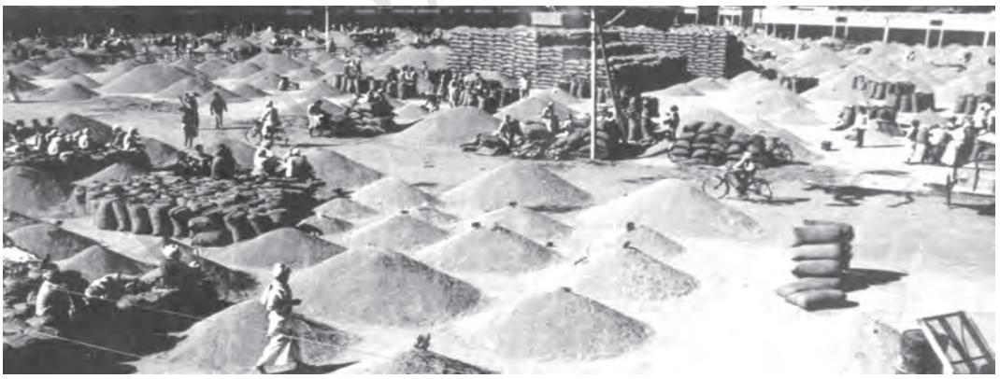
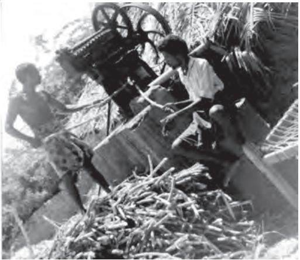
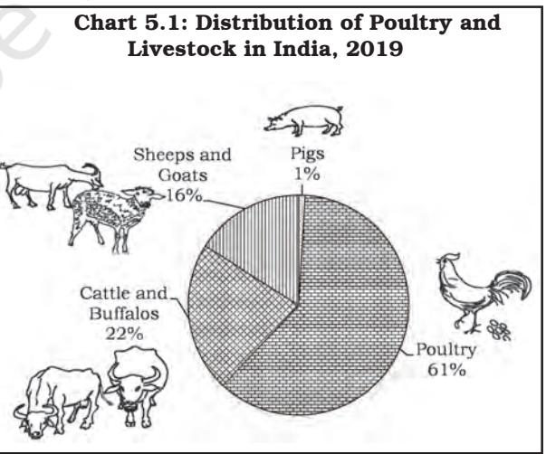
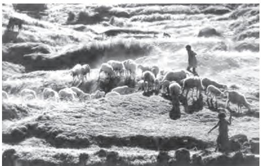
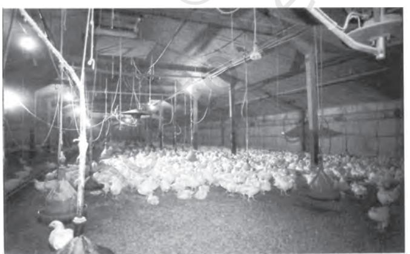
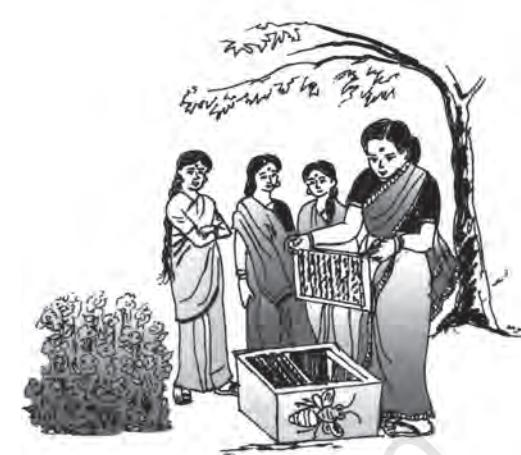

# **RURAL DEVELOPMENT**

# **After studying this chapter, the learners will**

- understand rural development and the major issues associated with it
- appreciate how crucial the development of rural areas is for India's overall development
- understand the critical role of credit and marketing systems in rural development
- learn about the importance of diversification of productive activities to sustain livelihoods
- understand the significance of organic farming in sustainable development.

RURAL DEVELOPMENT 75

**"Only the tillers of the soil live by the right. The rest form their train and eat only the bread of dependence".**

# **5.1 INTRODUCTION**

Previously we have studied how poverty was a major challenge facing India. We also know that the majority of the poor live in rural areas where they do not have access to the basic necessities of life.

Agriculture is the major source of livelihood in the rural sector. Mahatma Gandhi once said that the real progress of India did not mean simply the growth and expansion of industrial urban centres but mainly the development of the villages. This idea of village development being at the centre of the overall development of the nation is relevant even today. Why is this so? Why should we attach such significance to rural development when we see around us fast growing cities with large industries and modern information technology hubs? It is because more than two-third of India's population depends on agriculture that is yet to become productive enough to provide for them; one-fourth of rural India still lives in abject poverty. That is the reason why we have to see a developed rural India if our nation has to realise real progress. What, then, does rural development imply?

# **5.2 WHAT IS RURAL DEVELOPMENT?**

Rural development is a comprehensive term. It essentially focuses on action for the development of areas that are lagging behind in the overall development of the village economy. Some of the areas which are challenging and need fresh initiatives for development in rural India include

- Development of human resources including
	- literacy, more specifically, female literacy, education and skill development
	- health, addressing both sanitation and public health
- Land reforms
- Development of the productive resources of each locality
- Infrastructure development like electricity, irrigation, credit, marketing, transport facilities including construction of village roads and feeder roads to nearby highways, facilities for agriculture research and extension, and information dissemination
- Special measures for alleviation of poverty and bringing about significant improvement in the living conditions of the weaker sections of the population emphasising access to productive employment opportunities

All this means that people engaged in farm and non-farm activities in rural areas have to be provided with various means that help them increase the productivity. They also need to be given opportunities to diversify into various non-farm productive activities such as food processing. Enabling them better and more affordable access to healthcare, sanitation facilities at workplaces and homes and education for all would also need to be given top priority for rapid rural development.

It was observed in an earlier chapter that although the share of agriculture sector's contribution to GDP was on a decline, the population dependent on this sector did not show any significant change. Further, after the initiation of reforms, the growth rate of agriculture sector decelerated to about 3 per cent per annum during the 1991-2012, which was lower than the earlier years. In recent years, this sector has become volatile. During 2014-15, the GVA growth rate of agriculture and its allied sectors was less than one per cent. Scholars identify decline in public investment since 1991 as the major

#### Work These Out

- ÿ On a monthly basis, go through the newspapers of your region and identify the problems raised by them in relation to rural areas and the solutions offered. You could also visit a nearby village and identify the problems faced by people there. Discuss this in the classroom.
ÿ Prepare a list of recent schemes and their objectives from the government website https:// www.rural.nic.in. Collect the details of how anyone of these schemes implemented in your region/rural neighbourhood areas. Discuss your observations in class.

reason for this. They also argue that inadequate infrastructure, lack of alternate employment opportunities in the industry or service sector, increasing casualisation of employment etc., further impede rural development. The impact of this phenomenon can be seen from the growing distress witnessed among farmers across different parts of India. Against this background, we will critically look at some of the crucial aspects of rural India like credit and marketing systems, agricultural diversification and the role of organic farming in promoting sustainable development.

# 5.3 CREDIT AND MARKETING IN RURAL AREAS

Credit: Growth of rural economy depends primarily on infusion of capital, from time to time, to realise higher productivity in agriculture and non-agriculture sectors. As the time of gestation period between crop sowing and realisation of income after production is quite long, farmers borrow from various sources to meet their initial investment on seeds, fertilisers, implements and other family expenses of marriage, death, religious ceremonies etc.

At the time of independence, moneylenders and traders exploited small and marginal farmers and landless labourers by lending to them on high interest rates and by manipulating the accounts to keep them in a debt-trap. A major change occurred after 1969 when India adopted social banking and multiagency approach to adequately meet the needs of rural credit. Later, the

RURAL DEVELOPMENT 77

#### **Box 5.1: The Poor Women's Bank**

'Kudumbashree' is a women-oriented community-based poverty reduction programme being implemented in Kerala. In 1995, a thrift and credit society was started as a small savings bank for poor women with the objective to encourage savings. The thrift and credit society mobilised Rs 1 crore as thrift savings. These societies have been acclaimed as the largest informal banks in Asia in terms of participation and savings mobilised.

**Source**: *www.kudumbashree.org. Visit this website and explore various other initiatives undertaken by this organisation. Identify some factors which contributed to their successes and discuss in the class.*

National Bank for Agriculture and Rural Development (NABARD) was set up in 1982 as an apex body to coordinate the activities of all institutions involved in the rural financing system. The Green Revolution was a harbinger of major changes in the credit system as it led to the diversification of the portfolio of rural credit towards productionoriented lending.

The institutional structure of rural banking today consists of a set of multi-agency institutions, namely, commercial banks, regional rural banks (RRBs), cooperatives and land development banks. They are expected to dispense adequate credit at cheaper rates. Recently, Self-Help Groups (henceforth SHGs) have emerged to fill the gap in the formal credit system because the formal credit delivery mechanism has not only proven inadequate but has also not been fully integrated into the overall rural social and community development. Since some kind of collateral is required, vast proportion of poor rural households were automatically out of the credit network. The SHGs promote thrift in small proportions by a minimum contribution from each member. From the pooled money, credit is given to the needy members to be repayable in small instalments at reasonable interest rates. By May 2019, nearly 6 crore

# **Work These Out**

- ÿ In your locality/neighbourhood, you might notice self-help groups providing credit. Attend few meetings of such self-help groups. Write a report on the profile of a self-help group. The profile may include — when it was started, the number of members, amount of savings and type of credit they provide and how borrowers use the loan.
- ÿ You might also find that those who take a loan for starting self-employment activities but use it for other purposes. Interact with few such borrowers. Identify the reasons for not starting self employment activities and discuss in the classroom.

women in India have become member in 54 lakh women SHGs. About ` 10- 15,000 per SHG and another `2.5 lakhs per SHG as a Community Investment Support Fund (CISF) are provided as part of renovating fund to take up self employement for income generation. Such credit provisions are generally referred to as micro-credit programmes. SHGs have helped in the empowerment of women. It is alleged that the borrowings are mainly confined to consumption purposes. Why are borrowers not spending for productive purposes?

#### Rural Banking — a Critical Appraisal:

Rapid expansion of the banking system had a positive effect on rural farm and non-farm output, income and employment, especially after the green revolution — it helped farmers to avail services and credit facilities and a variety of loans for meeting their prodution needs. Famines became events of the past; we have now achieved food security which is reflected in the abundant buffer stocks of grains. However, all is not well with our banking system.

With the possible exception of the commercial banks, other formal institutions have failed to develop a culture of deposit mobilisation lending to worthwhile borrowers and effective loan recovery. Agriculture loan default rates have been chronically high. Why farmers failed to pay back loans? It is alleged that farmers are deliberately refusing to pay back loans. What could be the reasons?

Thus, the expansion and promotion of the rural banking sector has taken a backseat after reforms. To improve the situation, In recent years, all the adults are encouraged to open bank accounts as a part of a scheme known as Jan-Dhan Yojana. Those bank account holders can get Rs. 1-2 lakh accidental insurance coverage and overdraft facilities for Rs. 10,000 and get their wages if they get any government-related jobs and works under MNREGA; old age pension and other social security payments of thegovernmentare

# Work These Out

- ÿ In the last few years, you might have taken note in your neighbourhood if you are living in rural areas or read in the newspapers or seen on TV — of farmers commiting suicides. Many such farmers had borrowed money for farming and other purposes. It was found that when they were unable to pay back due to crop failure, insufficient income and employment opportunities, they took such steps. Collect information relating to such cases and discuss in the classroom.
- ÿ Visit banks that cater to rural areas. They may be primary agricultural cooperative banks, land development banks, regional rural banks or district cooperative banks. Collect details such as how many rural households borrowed from them, amount generally borrowed, kinds of collateral used, interest rates and dues.
- ÿ If farmers who borrowed from cooperative banks could not pay back due to crop failure and other reasons, their loans should be waived otherwise they may take drastic decisions like committing suicides. Do you agree?

transferred to bank accounts. There is no need to keep minimum bank balance. This has led to more than 50 crore people opening bank accounts; indirectly it has promoted thrift habit and efficient allocation of financial resources particularly in rural areas. Banks also could mobile funds of more than Rs. 2,00,000 crores through these accounts.

# 5.4 AGRICULTURAL MARKET SYSTEM

Have you ever asked yourself how food grains, vegetables and fruits that we consume daily come from different parts of the country? The mechanism through which these goods reach different places depends on the market channels. Agricultural marketing is a process that involves the assembling, storage, processing, transportation, packaging, grading and distribution of different agricultural commodities across the country.

Prior to independence, farmers, while selling their produce to traders, suffered from faulty weighing and manipulation of accounts. Farmers who did not have the required information on prices prevailing in markets were often forced to sell at low prices. They also did not have proper storage facilities to keep back their produce for selling later at a better price. Do you know that even today, more than 10 per cent of goods produced in farms are wasted due to lack of storage? Therefore, government intervention became necessary to regulate the activities of the private traders.

Let us discuss four such measures that were initiated to improve the marketing aspect. The first step was regulation of markets to create orderly and transparent marketing conditions. By and large, this policy benefited farmers as well as consumers. However, there is still a need to develop about 27,000 rural periodic markets as regulated market places to realise the full potential of rural markets. Second component is provision of physical infrastructure facilities like roads, railways, warehouses, godowns, cold storages and processing units. The current infrastructure facilities are quite inadequate to meet the growing demand and need to be improved. Cooperative

Fig. 5.1 *Regulated market yards benefit farmers as well as consumers*

80 INDIAN ECONOMIC DEVELOPMENT

#### **Work These Out**

- ÿ Visit a nearby vegetable and fruit market. Observe and identify different characteristics of the market. Identify the place of origin of at least ten different fruits and vegetables and distance travelled to reach the market. Further, look at the modes of transport and its implication on prices.
- ÿ Most small towns have regulated market yards. Farmers can go to these markets and sell their produce. They can also store their goods in the yard. Visit one regulated market yard; collect the details of its functioning, kind of goods coming to the yard and how prices are fixed. Prepare a detailed report and discuss in the class.

marketing, in realising fair prices for farmers' products, is the third aspect of government initiative. The success of milk cooperatives in transforming the social and economic landscape of Gujarat and some other parts of the country is testimony to the role of cooperatives. However cooperatives have received a setback during the recent past due to inadequate coverage of farmer members, lack of appropriate link between marketing and processing cooperatives and inefficient financial management. The fourth element is the policy instruments like (i) assurance of minimum support prices (MSP) for agricultural products (ii) maintenance of buffer stocks of wheat and rice by Food Corporation of India and (iii) distribution of food grains and sugar through PDS. These instruments are aimed at protecting the income of the farmers and providing foodgrains at a subsidised rate to the poor. However, despite government intervention, private trade (by moneylenders, rural political elites, big merchants and rich farmers) predominates agricultural markets. The need for government intervention is imminent particularly when a large share of agricultural products, is handled by the private sector.

Agricultural marketing has come a long way with the intervention of the government in various forms. Some scholars argue that commercialisation of agriculture offers tremendous scope for farmers to earn higher incomes provided the government intervention is restricted. What do you think about this view?

**Emerging Alternate Marketing Channels:** It has been realised that if farmers directly sell their produce to consumers, it increases their incomes. Some examples of these channels are *Apni Mandi* (Punjab, Haryana and Rajasthan); *Hadaspar Mandi* (Pune); *Rythu Bazars* (vegetable and fruit markets in Andhra Pradesh and Telangana) and *Uzhavar Sandies* (farmers markets in Tamil Nadu). Further, several national and multinational fast food chains are increasingly entering into contracts/ alliances with farmers to encourage

#### RURAL DEVELOPMENT 81

them to cultivate farm products (vegetables, fruits, etc.) of the desired quality by providing them with not only seeds and other inputs but also assured procurement of the produce at predecided prices. It is argued that such arrangements will help in reducing the price risks of farmers and would also expand the markets for farm products. Do you think such arrangements raise incomes of small farmers.

#### **Work This Out**

ÿVisit one such alternative marketing system which farmers in your locality, or in the neighbourhood rural areas, use. How are they different from regulated market yards? Should they be encouraged and supported by the government? Why and how? Discuss.

In 2020, Indian Parliament passed three laws to reform agriculture marketing system. While some section of farmers support these reforms, the rest of the farmers oppose and these Acts are still being debated. Collect the details of these laws, debate and discuss in the class.

# **5.5 DIVERSIFICATION INTO PRODUCTIVE ACTIVITIES**

Diversification includes two aspects one relates to change in cropping pattern and the other relates to a shift of workforce from agriculture to other allied activities (livestock, poultry, fisheries etc.) and non-agriculture sector. The need for diversification arises from the fact that there is **Fig. 5.2** *Jaggery making is an allied activity*

greater risk in depending exclusively on farming for livelihood. Diversification towards new areas is necessary not only to reduce the risk from agriculture sector but also to provide productive sustainable livelihood options to rural people. Much of the agricultural employment activities are concentrated in the Kharif season. But during the Rabi season, in areas where there are inadequate irrigation facilities, it becomes difficult to find gainful employment. Therefore expansion into other sectors is essential to provide supplementary gainful employment and in realising higher levels of income for rural people to overcome poverty and other tribulations. Hence, there is a need to focus on allied activities, non-farm employment and other emerging alternatives of livelihood, though there are many other options available for providing sustainable livelihoods in rural areas.

*of the farming sector*

82 INDIAN ECONOMIC DEVELOPMENT

#### **Box 5.2: Tamil Nadu Women in Agriculture (TANWA)**

Tamil Nadu Women in Agriculture (TANWA) was a project initiated in the late 1980s in Tamil Nadu to train women in latest agricultural techniques and in organic farming. It encouraged women to actively participate in raising agricultural productivity and family income. At a Farm Women's Group in Thiruchirapalli, run by Anthoniammal, trained women are successfully making and selling vermicompost and earning money from this venture. Many other Farm Women's Groups are creating savings in their group by functioning like mini banks through a micro-credit system. With the accumulated savings, they promote small-scale household activities like mushroom cultivation, soap manufacture, doll making or other income-generating activities. There could be similar initiatives in your area or your neighborhood rural areas. Talk to organisation or women entrepreneurs and discuss the details in the class.

As agriculture is already overcrowded, a major proportion of the increasing labour force needs to find alternate employment opportunities in other non-farm sectors. Non-farm economy has several segments in it; some possess dynamic linkages that permit healthy growth while others are in subsistence, low productivity propositions. The dynamic sub-sectors include **agro-processing industries,** food processing industries, leather industry, tourism, etc. Those sectors which have the potential but seriously

lack infrastructure and other support include traditional home-based industries like pottery, crafts, handlooms etc. Majority of rural women find employment in agriculture while men generally look for non-farm employment. In recent times, women have also begun looking for non-farm jobs (see Box 5.2).

**Animal Husbandry:** In India, the farming community uses the mixed crop-livestock farming system —cattle, goats, fowl are the widely held species. Livestock production provides increased stability in income, food security, transport, fuel and nutrition for the family without disrupting other food-producing activities. Today, livestock sector alone provides alternate livelihood options to over 70 million small and marginal farmers including landless labourers. A significant number of women also find employment in the livestock sector.

Chart 5.1 shows the distribution of livestock in India. Poultry accounts for the largest share with 61 per cent

RURAL DEVELOPMENT 83

**Fig. 5.3** *Sheep rearing — an important income augmenting activity in rural areas*

followed by others. Other animals which include camels, asses, horses, ponies and mules are in the lowest rung. India had about 303 million cattle, including 110 million buffaloes in 2019. Performance of the Indian dairy sector over the last three decades has been quite impressive. Milk production in the country has increased by about ten times between 1951-2016. This can be attributed mainly to the successful implementation of 'Operation Flood'. It is a system whereby all the farmers can pool their milk produced according to different grading (based on quality), processed and marketed to urban centres through cooperatives. In this system the farmers are assured of a fair price and income from the supply of milk to urban markets. As pointed out earlier Gujarat state is held as a success story in the efficient implementation of milk cooperatives which has been emulated by many states. Gujarat, Madhya Pradesh, Uttar Pradesh, Andhra Pradesh, Maharashtra, Punjab and Rajasthan, are major milk producing states. Meat, eggs, wool and other by- products are also emerging as important productive sectors for diversification.

**Fisheries:** The fishing community regards the water body as 'mother' or 'provider'. The water bodies consisting of sea, oceans, rivers, lakes, natural aquatic ponds, streams etc. are, therefore, an integral and life-giving source for the fishing community. In India, after progressive increase in budgetary allocations and introduction of new technologies in fisheries and aquaculture, the development of fisheries has come a long way. Presently, fish production from inland sources contributes about 65 per cent to the total value of fish production and the balance 35 per cent comes from the marine sector (sea and oceans). Today total fish production accounts for 0.9 per cent of the total GDP. In India, West Bengal, Andhra Pradesh, Kerala, Gujarat, Maharashtra and Tamil Nadu are major fish producing states. A large share of fishworker families are poor. Rampant underemployment, low per capita earnings, absence of mobility of labour to other sectors and a high rate of illiteracy and indebtedness are some of the major problems fishing community face today. Even though women are not involved in active fishing, about 60 per cent of the workforce in export marketing and 40 per cent in internal marketing are women. There is a need to increase credit facilities through cooperatives and SHGs for fisherwomen to meet the

working capital requirements for marketing.

**Horticulture:** Blessed with a varying climate and soil conditions, India has adopted growing of diverse horticultural crops such as fruits, vegetables, tuber crops, flowers, medicinal and aromatic plants, spices and plantation crops. These crops play a vital role in providing food and nutrition, besides addressing employment concerns. Horticulture sector contributes nearly one-third of the value of agriculture output and six per cent of Gross Domestic Product of India. India has emerged as a world leader in producing a variety of fruits like mangoes, bananas, coconuts, cashew nuts and a number of spices and is the second largest producer of fruits and vegetables. Economic condition of many farmers engaged in horticulture has improved and it has become a means of improving livelihood for many unprivileged classes. Flower harvesting, nursery

**Fig. 5.5** *Women in rural households take up beekeeping as an entrepreneurial activity*

maintenance, hybrid seed production and tissue culture, propagation of fruits and flowers and food processing are highly remunerative employment options for women in rural areas.

Though, in terms of numbers, our livestock population is quite impressive but its productivity is quite low as compared to other countries. It requires improved technology and promotion of good breeds of animals to enhance productivity. Improved

> veterinary care and credit facilities to small and marginal farmers and landless labourers would enhance sustainable livelihood options through livestock production. Production of fisheries has already increased substantially.

> However problems related to over- fishing and pollution need to be regulated

**Fig. 5.4** *Poultry has the largest share of total livestock in India*

RURAL DEVELOPMENT 85

and controlled. Welfare programmes for the fishing community have to be reoriented in a manner which can provide long-term gains and sustenance of livelihoods. Horticulture has emerged as a successful sustainable livelihood option and needs to be encouraged significantly. Enhancing its role requires investment in infrastructure like electricity, cold storage systems, marketing linkages, small-scale processing units and technology improvement and dissemination.

### **Other Alternate Livelihood Options:**

The IT has revolutionised many sectors in the Indian economy. There is broad consensus that IT can play a critical role in achieving sustainable development and food security in the twenty-first century. Governments can predict areas of food insecurity and vulnerability using appropriate information and software tools so that action can be taken to prevent or reduce the likelihood of an emergency. It also has a positive impact on the agriculture sector as it can disseminate information regarding emerging technologies and its applications, prices, weather and soil conditions for growing different crops etc. Though IT is, by itself, no catalyst of change but it can act as a tool for releasing the creative potential and knowledge embedded in the society. It also has potential of employment generation in rural areas. Experiments with IT and its application to rural development are carried out in different parts of India.

# **5.6 SUSTAINABLE DEVELOPMENT AND ORGANIC FARMING**

In recent years, awareness of the harmful effect of chemical-based fertilisers and pesticides on our health is on a rise. Conventional agriculture relies heavily on chemical fertilisers and toxic pesticides etc., which enter the food supply, penetrate the water sources, harm the livestock, deplete the soil and devastate natural eco-systems. Efforts in evolving technologies which are eco-friendly are essential for sustainable development and one such technology which is eco-friendly is organic farming. In short, organic agriculture is a whole system of

#### **Box 5.3: Adoption of Village by Parliamentarians**

In October, 2014, The Government of India introduced a new scheme called Saansad Adarsh Gram Yojana (SAGY). Under this scheme, Members of India's Parliament need to identify and develop one village from their constituencies. To begin with, MPs can develop one village as a model village by 2016, and two more by 2019, covering over 2,500 villages in India. According to the scheme, the village can have a population of 3,000-5,000 in the plains and 1,000-3,000 in the hills and should not be MPs' own or their spouse's village. MPs are expected to facilitate a village development plan, motivate villagers to take up activities and built infrastructure in the areas of health, nutrition and education. **Source:** *www.pib.nic.in accessed on 24 October 2014.*

### **Box 5.4: Organic Food**

Organic food is growing in popularity across the world. Many countries have around 10 per cent of their food system under organic farming. There are many retail chains and supermarkets which are accorded with **green status** to sell organic food. Moreover, organic foods command higher price of around 10-100 per cent than conventional ones.

farming that restores, maintains and enhances the ecological balance. There is an increasing demand for organically grown food to enhance food safety throughout the world (see Box 5.4).

**Benefits of Organic Farming:** Organic agriculture offers a means to substitute costlier agricultural inputs (such as HYV seeds, chemical fertilisers, pesticides etc.) with locally produced organic inputs that are cheaper and thereby generate good returns on investment. Organic agriculture also generates income through exports as the demand for organically grown crops is on a rise. Studies across countries have shown that organically grown food has more nutritional value than chemical farming thus providing us with healthy foods. Since organic farming requires more labour input than conventional farming, India will find organic farming an attractive proposition. Finally, the produce is pesticide-free and produced in an environmentally sustainable way (see Box 5.5).

Popularising organic farming requires awareness and willingness on the part of farmers to adapt to new technology. Inadequate infrastructure and the problem of marketing the products are major concerns which need to be addressed apart from an

# **Box 5.5: Organically Produced Cotton in Maharashtra**

In 1995, when Kisan Mehta of *Prakruti* (an NGO) first suggested that cotton, the biggest user of chemical pesticides, could be grown organically, the then Director of the Central Institute for Cotton Research, Nagpur, famously remarked, "Do you want India to go naked?" At present, as many as 130 farmers have committed 1,200 hectares of land to grow cotton organically on the International Federation of Organic Agriculture Movement's standards. The produce was later tested by the German Accredited Agency, AGRECO, and found to be of high quality. Kisan Mehta feels that about 78 per cent of Indian farmers are marginal farmers owning about less than 0.8 hectare but accounting for 20 per cent of India's cultivable land. For such farmers, organic agriculture is more profitable in terms of money and soil conservation in the long run. Visit a farm in your locality which uses organic manure and discuss the uses associated with the farming practices. Present the report in your class.

**Source:** *Lyla Bavadam, A Green Alternative, Frontline, 29 July 2005.*

appropriate agriculture policy to promote organic farming. It has been observed that the yields from organic farming are less than modern agricultural farming in the initial years. Therefore, small and marginal farmers may find it difficult to adapt to largescale production. Organic produce may also have more blemishes and a shorter shelf life than sprayed produce. Moreover choice in production of off-season crops is quite limited in organic farming. Nevertheless, organic farming helps in sustainable development of agriculture and India has a clear advantage in producing organic products for both domestic and international markets. Do you think food and non-food items cultivated using organic farming methods will be cheaper?

# **5.7 CONCLUSION**

It is clear that until and unless some spectacular changes occur, the rural sector might continue to remain backward. There is a greater need today to make rural areas more vibrant through diversification into dairying, poultry, fisheries, vegetables and fruits and linking up the rural production centres with the urban and foreign (export) markets to realise higher returns on the investments for the products. Moreover, infrastructure elements like credit and marketing, farmerfriendly agricultural policies and a constant appraisal and dialogue between farmers' groups and state agricultural departments are essential to realise the full potential of the sector.

Today we cannot look at the environment and rural development as two distinct subjects. There is need to invent or procure alternate sets of ecofriendly technologies that lead to sustainable development in different circumstances. From these, each rural

#### **Work These Out**

ÿ Make a list of five popular items that are organically produced in India.

ÿ Visit a nearby super market, vegetable shop and/or a departmental shop. Identify a few products. Prepare a chart comparing a few goods that are produced organically and in the normal way on the basis of their prices, shelf life, quality and the kind of advertisement through which they are popularised.

ÿ Visit a horticultural farm in the nearby locality. Collect the details of goods that they cultivate on the farm. They could have diversified their cropping patterns. Discuss with them the merits and demerits of the diversification.

community can choose whatever will suit its purpose. We need to learn from, and also try out when found relevant, practices from the available set of 'best practice' illustrations (which means success stories of rural development experiments that have already been carried out in similar conditions in different parts of India), to speed up this process of 'learning by doing'.

- ÿRural development is quite a comprehensive term but it essentially means a plan of action for the development of rural areas which are lagging behind in socio-economic development.
- ÿThere is a need for improving the quantity and quality of infrastructure in rural areas such as banking, marketing, storage, transport and communications etc. to realise its true potential.
- ÿ Diversification towards new areas such as livestock, fisheries and other non-agricultural activities is necessary not only to reduce the risk from agriculture sector but also to provide productive sustainable livelihood options to our rural people.
- ÿThe importance of organic farming as an environmentally sustainable production process is on a rise and needs to be promoted.

### **EXERCISES**

- 1. What do you mean by rural development? Bring out the key issues in rural development.
- 2. Discuss the importance of credit in rural development.
- 3. Explain the role of micro-credit in meeting credit requirements of the poor.
- 4. Explain the steps taken by the government in developing rural markets.
- 5. Why is agricultural diversification essential for sustainable livelihoods?
- 6. Critically evaluate the role of the rural banking system in the process of rural development in India.

RURAL DEVELOPMENT 89

- 7. What do you mean by agricultural marketing?
- 8. Mention some obstacles that hinder the mechanism of agricultural marketing.
- 9. What are the alternative channels available for agricultural marketing? Give some examples.
- 10. Distinguish between 'Green Revolution' and 'Golden Revolution'.
- 11. Do you think various measures taken by the government to improve agricultural marketing are sufficient? Discuss.
- 12. Explain the role of non-farm employment in promoting rural diversification.
- 13. Bring out the importance of animal husbandry, fisheries and horticulture as a source of diversification.
- 14. 'Information technology plays a very significant role in achieving sustainable development and food security' — comment.
- 15. What is organic farming and how does it promote sustainable development?
- 16. Identify the benefits and limitations of organic farming.
- 17. Enlist some problems faced by farmers during the initial years of organic farming.
- 18. "Jan-Dhan-Yojna helps in the rural development." Do you agree with this statement? Explain.

- ACHARYA, S.S. 2004. *Agricultural Marketing, State of the Indian Farmer, a Millennium Study*. Academic Foundation, New Delhi.
- ALAGH, Y.K. 2004. *State of the Indian Farmer, a Millennium Study an Overview.* Academic Foundation, New Delhi.
- CHAWLA, N.K., M.P.G. KURUP and V. P. SHARMA. 2004. *Animal Husbandry, State of the Indian Farmer, a Millennium Study.* Academic Foundation, New Delhi.
- DEHADRAI, P.V. and Y.S. YADAV. 2004. *Fisheries Development, State of the Indian Farmer, a Millennium Study.* Academic Foundation, New Delhi.
- JALAN, BIMAL. (Ed.). 1992. *The Indian Economy: Problems and Perspectives.* Penguin Publication, New Delhi.
- NARAYANAN, S. 2005. *Organic Farming in India.* NABARD Occasional Paper No: 38, Department of Agriculture and Rural Development, Mumbai.
- SINGH, H.P., P.P. DUTTA and M. SUDHA. 2004. *Horticulture Development, State of the Indian Farmer, a Millennium Study.* Academic Foundation, New Delhi.
- SINGH, SURJIT and VIDYA SAGAR. 2004. *Agricultural Credit in India: State of the Indian Farmer, a Millennium Study.* Academic Foundation, New Delhi.
- SINHA, V.K. 1998. *Challenges in Rural Development.* Discovery Publishing House, New Delhi.
- TODARO, MICHAEL P. 1987. *Economic Development in the Third World.* Orient Longman Ltd, Hyderabad.
- TOPPO, E. 2004. *Organic Vegetable Gardening: Grow Your Own Vegetables.* Unit for Labour Studies, Tata Institute of Social Sciences, Mumbai.

#### **Government Reports**

- *Successful Governance Initiatives and Best Practices: Experiences from Indian States,* Government of India in Coordination with Human Resource Development Centre and UNDP, Planning Commission, Delhi, 2002.
- *Annual Reports*, Ministry of Rural Development, Government of India, New Delhi.
- *Basic Animal Husbandry and Fisheries Statistics ( for various years)*, Ministry of Agriculture and Farmers' Welfare, Government of India.

#### **Websites**

www.dahd.nic.in

www.saanjhi.gov.in

www.ruralindiaonline.org

