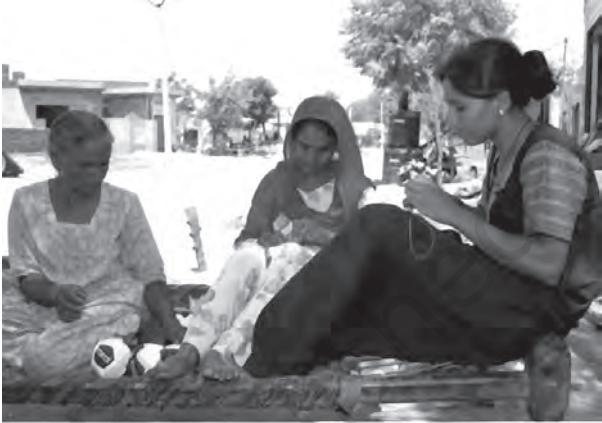
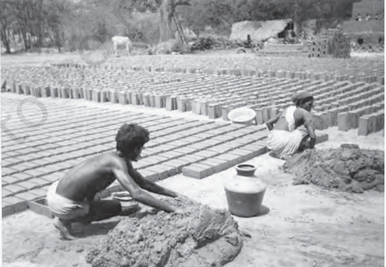
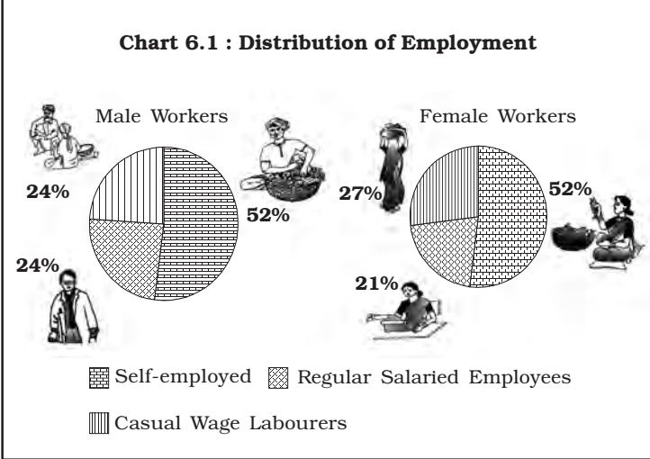
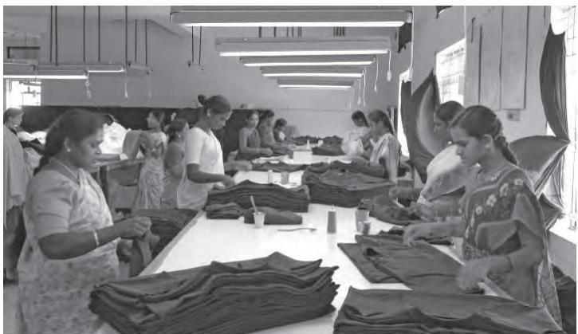
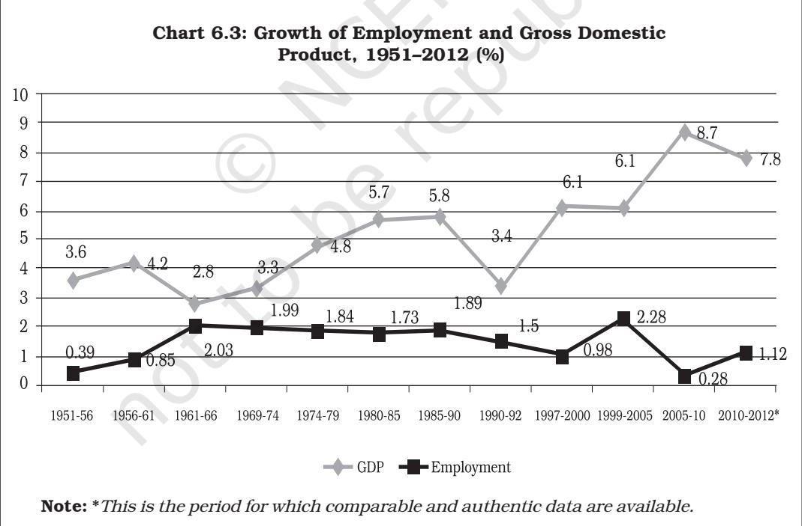
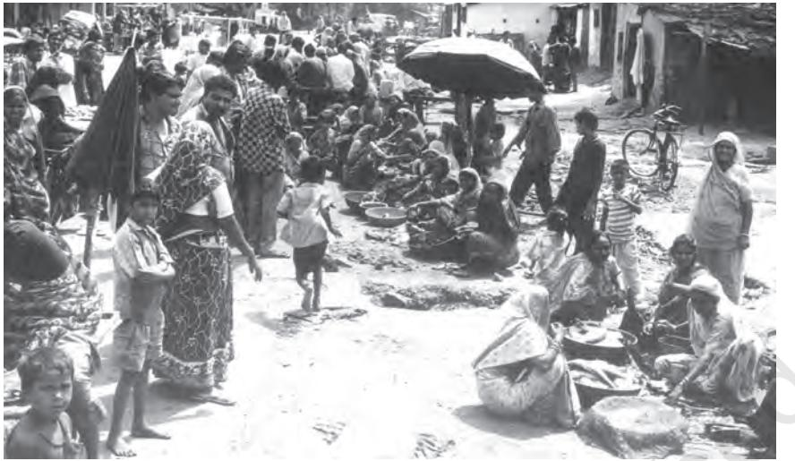
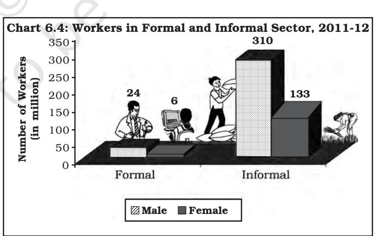
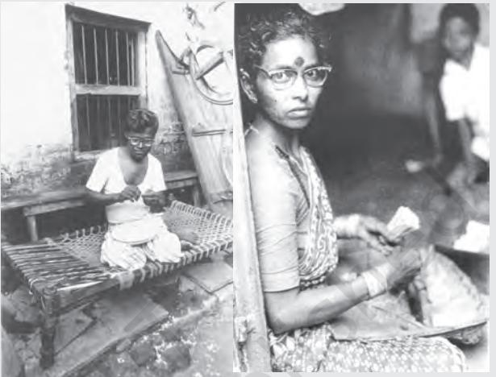

# **EMPLOYMENT : GROWTH, INFORMALISATION AND OTHER ISSUES**

# **After studying this chapter, the learners will**

6

- understand a few basic concepts relating to employment such as economic activity, worker, workforce and unemployment
- understand the nature of participation of men and women in various economic activities in various sectors
- know the nature and extent of unemployment
- assess the initiatives taken by the government in generating employment opportunities in various sectors and regions.

92 INDIAN ECONOMIC DEVELOPMENT

**What I object to, is the 'craze' for machinery, not machinery as such. The craze is for what they call labour-saving machinery. Men go on 'saving labour' till thousands are without work and thrown on the open streets to die of starvation...**

> **Mahatma Gandhi**

# **6.1 INTRODUCTION**

People do a variety of work. Some work on farms, in factories, banks, shops and many other workplaces; yet a few others work at home. Work at home includes not only traditional work like weaving, lace making or variety of handicrafts but also modern jobs like programming work in the IT industry. Earlier factory work meant working in factories located in cities whereas now technology has enabled people to produce those factory-based goods at home in villages. During Covid-19 pandemic in 2020–21, millions of workers delivered their products and services through work-from-home.

Why do people work? Work plays an important role in our lives as individuals and as members of society. People work for 'earning' a living. Some people get, or have, money by inheriting it, not working for it. This does not completely satisfy anybody. Being employed in work gives us a sense of self-worth and enables us to relate ourselves meaningfully with others. Every working person is actively contributing to national income and hence, the development of the country by engaging in various economic activities — that is the real meaning of 'earning' a living. We do not work only

**Fig. 6.1** *Multinational companies sell footballs made in the houses of Jalandhar, Punjab*

for ourselves; we also have a sense of accomplishment when we work to meet the requirements of those who are dependent on us. Having recognised the importance of work, Mahatma Gandhi insisted upon education and training through a variety of works including craft.

Studying about working people gives us insights into the quality and nature of employment in a country and helps in understanding and planning our human resources. It helps us to analyse the contribution made by different industries and sectors towards national income. It also helps us to address many social issues such as exploitation of marginalised sections of the society, child labour, etc.

### **6.2 WORKERS AND EMPLOYMENT**

What is employment? Who is a worker? When a farmer works on fields, he or she produces food grains and raw materials for industries. Cotton becomes cloth in textile mills and in powerlooms. Lorries transport goods from one place to another. We know that the total money value of all such final goods and services produced in a country in a year is called its gross domestic product for that year. When we also consider what we pay for our imports and get from our exports we find that there is a net earning for the country which may be positive (if we have exported more in value terms than imported) or negative (if imports exceeded exports in value terms) or zero (if exports and imports were of the same value). When we add this earning (plus or minus) from foreign transactions, what we get is called the country's gross national product for that year.

Those activities which contribute to the gross national product are called economic activities. All those who are engaged in economic activities, in whatever capacity — high or low, are workers. Even if some of them temporarily abstain from work due to illness, injury or other physical disability, bad weather, festivals, social or religious functions, they are also workers. Workers also include all those who help the main workers in these activities. We generally think of only those who are paid by an employer for their work as workers. This is not so. Those who are self-employed are also workers.

The nature of employment in India is multifaceted. Some get employment throughout the year; some others get employed for only a few months in a year. Many workers do not get fair wages for their work. While estimating the number of workers, all those who are engaged in economic activities are included as employed. You might be interested in knowing the number of people actively engaged in various economic activities. During 2017-18, India had about a 471 million strong workforce. Since majority of our people reside in rural areas, the proportion of workforce residing there is higher. The

> ÿ In your house or neighbourhood, you might come across many women who, even though they have technical degrees and diplomas and also free time to go to work, do not go to work. Ask them the reasons for not going to work. List all of them and discuss in the classroom whether they should go for work and why, and also ways by which they could be sent for work. Some social scientists argue that housewives working at home without getting paid for that work must also be regarded as contributing to the gross national product and therefore, as engaged in an economic activity. Would you agree?

**Work This Out**

94 INDIAN ECONOMIC DEVELOPMENT

rural workers constitute about twothirds of this 471 million. Men form the majority of workforce in India. About 77 per cent of the workers are men and the rest are women(men and women include child labourers in respective sexes). Women workers account for one-fourth of the rural workforce whereas in urban areas, they are just one-fifth of the workforce. Women carry out works like cooking, fetching water and fuelwood and participate in farm labour. They are not paid wages in cash or in the form of grains; at times they are not paid at all. For this reason, these women are not categorised as workers. Economists argue that these women should also be called workers. What do you think?

# **6.3 PARTICIPATION OF PEOPLE IN EMPLOYMENT**

Worker-population ratio is an indicator which is used for analysing the employment situation in the country. This ratio is useful in knowing the proportion of population that is actively contributing to the production of goods and services of a country. If the ratio is higher, it means that the engagement of people is greater; if the ratio for a country is medium, or low, it means that a very high proportion of its population is not involved directly in economic activities.

You might have already studied, in lower classes, the meaning of the term 'population'. Population is defined as the total number of people who reside in a particular locality at a particular point of time. If you want to know the worker-population ratio for India, divide the total number of workers in India by the population in India and multiply it by 100, you will get the worker-population ratio for India.

If you look at Table 6.1, it shows the different levels of participation of people in economic activities. For every 100 persons, about 35 (by rounding off 34.7) are workers in India. In urban areas, the proportion is about 34, whereas in rural India, the ratio is about 35. Why is there such a difference? People in rural areas have limited resources to earn a higher income and participate more in the employment market. Many do not go to schools, colleges and other training institutions. Even if some go, they discontinue in the middle to join the workforce; whereas, in urban areas, a considerable section is able to study in various educational institutions. Urban people have a variety of employment opportunities. They look for the appropriate job to suit their qualifications and skills. In rural areas, people cannot stay at home as their economic condition may not allow them to do so.

#### TABLE 6.1

**Worker-Population Ratio in India, 2017-2018**

| Sex |  | Worker-Population Ratio |  |
| --- | --- | --- | --- |
|  | Total | Rural | Urban |
| Men | 52.1 | 51.7 | 53.0 |
| Women | 16.5 | 17.5 | 14.2 |
| Total | 34.7 | 35.0 | 33.9 |

# **Work These Out** ÿ Any study of employment

- must start with a review of the worker -population ratios — why?
- ÿ In some communities, you might have noticed that even if the males do not earn a high income, they do not send women to work. Why?

Compared to females, more males are found to be working. The difference in participation rates is very large in urban areas: for every 100 urban females, only about 14 are engaged in some economic activities. In rural areas, for every 100 rural women about 18 participate in the employment market. Why are women, in general, and urban women, in

particular, not working? It is common to find that where men are able to earn high incomes, families discourage female members from taking up jobs.

Going back to what has already been mentioned above, many household activities done by women are not recognised as productive work. This narrow definition of work leads to non-recognition of women's work and, therefore, to the underestimation of the number of women workers in the country. Think of the women actively engaged in many activities within the house and at family farms who are not paid for such work. As they certainly contribute to the maintenance of the household and farms, do you think that their number should be added to the number of women workers?

# **6.4 SELF-EMPLOYED AND HIRED WORKERS**

Does the worker-population ratio say anything about workers' status in society or about the working conditions? By knowing the status with which a worker is placed in an enterprise, it may be possible to know one dimension — quality of employment in a country. It also

**Fig. 6.2** *Brick-making: a form of casual work*

96 INDIAN ECONOMIC DEVELOPMENT

enables us to know the attachment a worker has with his or her job and the authority she or he has over the enterprise and over other co-workers.

Let us take three workers from the construction industry — a cement shop owner, a construction worker and a civil engineer of a construction company. Since the status of each one

of them is different from another, they are also called differently. Workers who own and operate an enterprise to earn their livelihood are known as **self-employed**. Thus the cement shop owner is self-employed. About 52 per cent workforce in India belongs to this category. The construction workers are known as **casual wage labourers**; they account for about 25 per cent of India's

**Chart 6.2 : Distribution of Employment by Region**  Urban Workers Rural Workers Casual Wage Labourers Regular Salaried Employees Self-employed **38% 15% 47% 58% 29% 13%**

EMPLOYMENT : GROWTH, INFORMALISATION AND OTHER ISSUES 97

workforce. Such labourers are casually engaged in others' farms and, in return, get a remuneration for the work done. Workers like the civil engineer working in the construction company account for 23 per cent of India's workforce. When a worker is engaged by someone or an enterprise and paid his or her wages on a regular basis, they are known as **regular**

**salaried employees** (see table 6.3).

Look at Chart 6.1 you will notice that self-employment is a major source of livelihood for both men and women as this category accounts for more than 50 per cent of the workforce. Casual wage work is the second major source for both men and women, a little more so for the latter (24-27 per cent). When it comes to regular salaried employment, both women and men are found to be so engaged in greater proportion. Men form 23 per cent whereas women form 21 per cent. The gap between men and women is very less.

When we compare the distribution of workforce in rural and urban areas in Chart 6.2 you will notice that the selfemployed and casual wage labourers are found more in rural areas than in urban areas. In the latter, both selfemployment and regular wage salaried jobs are greater. In the former, since majority of those depending on farming own plots of land and cultivate independently, the share of selfemployed is greater.

The nature of work in urban areas is different. Obviously everyone cannot run factories, shops and offices of various types. Moreover enterprises in urban areas require workers on a regular basis.

**Work These Out**

- ÿ We generally think that only those who are doing paid work regularly or casually such as agricultural labourers, factory workers, those who work in banks and other offices as assistants and clerks are workers. From the above discussion, you must have understood that those who are self- employed such as pavement vegetable vendors, professionals such as lawyers, doctors and engineers are also workers. Mark (a), (b) and (c) against self-employed, regular salaried employees and casual wage labourers respectively:
	- 1. Owner of a saloon
	- 2. Worker in a rice mill who is paid on daily basis but employed regularly
	- 3. Cashier in State Bank of India
	- 4. Typist working in a state government office on a daily wage basis but paid monthly
	- 5. A handloom weaver
	- 6. Loading worker in wholesale vegetable shop
	- 7. Owner of a cold drinks shop which sells Pepsi, Coca Cola and Mirinda
	- 8. Nurse in a private hospital who gets monthly salary and has been working regularly for the past 5 years.
- ÿ Economists point out that casual wage labourers are the most vulnerable among the three categories. Could you locate who these workers are and where they are found and why?
- ÿ Can we say that the self-employed earn more than the casual wage labourers or regular salaried employees? Identify a few other indicators of quality of employment.

# **6.5 EMPLOYMENT IN FIRMS, FACTORIES AND OFFICES**

In the course of economic development of a country, labour flows from agriculture and other related activities to industry and services. In this process, workers migrate from rural to urban areas. Eventually, at a much

later stage, the industrial sector begins to lose its share of total employment as the service sector enters a period of rapid expansion. This shift can be understood by looking at the distribution of workers by industry. Generally, we divide all economic activities into eight different industrial divisions. They are (i) Agriculture (ii) Mining and Quarrying (iii) Manufacturing (iv) Electricity, Gas and Water Supply (v) Construction (vi) Trade (vii) Transport and Storage and

**Fig. 6.3** *Garment workers: upcoming factory employment for women*

(viii) Services. For simplicity, all the working persons engaged in these divisions can be clubbed into three major sectors viz., (a) primary sector which includes (i) and (ii), (b) secondary sector which includes (iii), (iv) and (v) and (c) service sector which includes divisions (vi), (vii) and (viii). Table 6.2 shows the distribution of working persons in different industries during the year 2017-18.

Primary sector is the main source of employment for majority of workers

| Industrial Category |  | Place of Residence | Sex |  | Total |
| --- | --- | --- | --- | --- | --- |
|  | Rural | Urban | Men | Female |  |
| Primary Sector | 59.8 | 6.6 | 40.7 | 57.1 | 44.6 |
| Secondary Sector | 20.4 | 34.3 | 26.5 | 17.7 | 24.4 |
| Tertiary/ Service Sector | 19.8 | 59.1 | 32.8 | 25.2 | 31.0 |
| Total | 100.0 | 100.0 | 100.0 | 100.0 | 100.0 |

TABLE 6.2

**Distribution of Workforce by Industry, 2017-2018**

EMPLOYMENT : GROWTH, INFORMALISATION AND OTHER ISSUES 99

# **Work This Out**

ÿ All newspapers have one section meant for job opportunities. Some also devote an entire supplement in a day or every week like **Opportunities** in *The Hindu* or **Ascent** in The *Times of India*. Many companies advertise vacancies for various positions. Cut those sections. Develop a table which contains four columns: whether the company is private or public, name of the post, number of posts, sector — primary, secondary or tertiary — and qualification required. Analyse the table in the classroom about jobs advertised in the newspapers.

in India. Secondary sector provides employment to only about 24 per cent of workforce. About 31 per cent of workers are in the service sector. Table 6.2 also shows that about 60 per cent of the workforce in rural India depends on agriculture, forestry and fishing. About 20 per cent of rural workers are working in manufacturing industries, construction and other industrial activities. Service sector provides employment to about 20 per cent of rural workers. Agriculture is not a major source of employment in urban areas where people are mainly engaged in the service sector. About 60 per cent of urban workers are in the service sector. The secondary sector gives employment to about one-third of urban workforce.

Though both men and women workers are concentrated in the primary sector, women workers' concentration is very high there. About 57 per cent of the female workforce is employed in the primary sector whereas less than half of males work in that sector. Men get opportunities in both secondary and service sectors.

#### **6.6 GROWTH AND CHANGING STRUCTURE OF EMPLOYMENT**

In Chapters 2 and 3, you might have studied about the planning strategies in detail. Here we will look at two developmental indicators — growth of employment and GDP. Nearly seventy years of planned development have been aimed at expansion of the economy through increase in national output and employment.

During the period 1950–2010, Gross Domestic Product (GDP) of India grew positively and was higher than the employment growth. However, there was always fluctuation in the growth of GDP. During this period, employment grew at the rate of not more than 2 per cent.

Chart 6.3 also points at another disheartening development in the late 1990s: employment growth started declining and reached the level of growth that India had in the early stages of planning. During these years, we also find a widening gap between the growth of GDP and employment. This means that in the Indian economy, without generating employment, we have been able to

produce more goods and services. Scholars refer to this phenomenon as jobless growth.

So far we have seen how employment has grown in comparison to GDP. Now it is necessary to know how the growth pattern of employment and GDP affected different sections of workforce. From this we will also be able to understand what types of employment are generated in our country.

Let us look at two indicators that we have seen in the preceding sections — employment of people in various industries and their status. We know that India is an agrarian nation; a major section of population lives in rural areas and is dependent on agriculture as their main livelihood. Developmental strategies in many countries, including India, have aimed at reducing the proportion of people depending on agriculture.

Distribution of workforce by industrial sectors shows substantial shift from farm work to non-farm work (see Table 6.3). In 1972-73, about 74 per cent of workforce was engaged in primary sector and in 2011-12, this proportion has declined to about 50 per cent. Secondary and service sectors are showing promising future for the Indian workforce. You may notice that the shares of these sectors have increased from 11 to 24 per cent and 15 to 27 per cent, respectively.

The distribution of workforce in different status indicates that over the

EMPLOYMENT : GROWTH, INFORMALISATION AND OTHER ISSUES 101

#### TABLE 6.3

**Trends in Employment Pattern (Sector-wise and Status-wise), 1972-2018 (in %)**

| Item | 1972-73 | 1983 | 1993-94 |  | 2011-2012 2017-2018 |
| --- | --- | --- | --- | --- | --- |
| Sector |  |  |  |  |  |
| Primary | 74.3 | 68.6 | 64 | 48.9 | 44.6 |
| Secondary | 10.9 | 11.5 | 16 | 24.3 | 24.4 |
| Services | 14.8 | 16.9 | 20 | 26.8 | 31.0 |
| Total | 100.0 | 100.0 | 100.0 | 100.0 | 100.0 |
| Status |  |  |  |  |  |
| Self-employed | 61.4 | 57.3 | 54.6 | 52.0 | 52.2 |
| Regular Salaried Employees | 15.4 | 13.8 | 13.6 | 18.0 | 22.8 |
| Casual Wage Labourers | 23.2 | 28.9 | 31.8 | 30.0 | 25.0 |
| Total | 100.0 | 100.0 | 100.0 | 100.0 | 100.0 |

last five decades (1972-2018), people have moved from self-employment and regular salaried employment to casual wage work. Yet self-employment continues to be the major employment provider. Look at the last column of table 6.3. How do you understand the stagnation of secondary sector and moderate rise in self-employement during 2011-18? Discuss in the class. Scholars call the process of moving from self-employment and regular salaried employment to casual wage work noticed during 1972-94 as **casualisation of workforce**. This makes the workers highly vulnerable. How? Look at the case study of Ahmedabad in the preceding section.

In the mean time you also notice in 2017-18 a moderate rise in the share of regular salaried employees. How do you explain this phenomenon?

#### **Work These Out**

ÿDo you know that maintaining employment growth at 2 per cent for a country like India is not an easy thing? Why?

- ÿ What will happen if there is no additional employment generated in the economy even though we are able to produce goods and services in the economy? How could jobless growth happen?
- ÿ Economists say that if casualisation increases the earning of the people, such phenomenon should be welcomed. Suppose a marginal farmer becomes a full-time agricultural labourer, do you think he will be happy even if he earns more in his daily wage work? Or will a permanent and regular worker of the pharmaceutical industry be happy if he becomes a daily wage labourer, even if his or her overall earnings increase? Discuss in the classroom.

# **6.7 INFORMALISATION OF INDIAN WORKFORCE**

In the previous section we have found that the proportion of hired work jobs working for others has been increasing. One of the objectives of development planning in India, since India's independence, has been to provide decent livelihood to its people. It has been envisaged that the industrialisation strategy would bring surplus workers from agriculture to industry with better standard of living as in developed countries. We have seen in the preceding section, that even after 70 years of planned development, more than half of the Indian workforce depends on farming as the major source of livelihood.

Economists argue that, over the years, the quality of employment has been deteriorating. Even after working for more than 10-20 years, why do some workers not get maternity benefit, provident fund, gratuity and pension? Why does a person working in the private sector get a lower salary as compared to another person doing the same work but in the public sector?

You may find that a small section of Indian workforce is getting regular income. The government, through its **labour laws**, enable them to protect their rights in various ways. This section of the workforce forms **trade unions**, bargains with employers for better wages and other **social security** measures. Who are they? To know this we classify workforce into two categories: workers in formal and informal sectors, which are also referred to as organised and unorganised sectors. All the **public sector establishments** and those **private sector establishments** which employ 10 hired workers or more are called formal sector establishments and those who work in such establishments are formal sector workers. All other enterprises and workers working in those enterprises form the informal sector. Thus, informal sector includes millions of farmers, agricultural labourers, owners of small enterprises and people working in those enterprises as also the self-employed who do not have any hired workers. It also includes all nonfarm casual wage labourers who work for more than one employer such as construction workers and headload workers. You may note that this is one of the ways of classifying workers. There could be other ways of classification as well. Discuss the possible ways in the class.

#### **Box 6.1: Formal Sector Employment**

The information relating to employment in the formal sector is collected by the Union Ministry of Labour through employment exchanges located in different parts of the country. Do you know who is the major employer in the formal sector in India? In 2012, out of about 30 million formal sector workers, about 18 million workers were employed by the public sector. Here also men form the majority, as women constitute only about one-sixth of the formal sector workforce. Economists point out that the reform process initiated in the early 1990s resulted in a decline in the number of workers employed in the formal sector. What do you think?

**Fig. 6.4** *Road side vending: an increasing variety of informal sector employment*

Those who are working in the formal sector enjoy social security benefits. They earn more than those in the informal sector. Developmental planning envisaged that as the economy grows, more and more workers would become formal sector workers and the proportion of workers engaged in the informal sector would dwindle. But

what has happened in India? Look at the following chart which gives the distribution of workforce in formal and informal sectors.

We learnt that in 2011-12 there were about 473 million workers in India. There were about 30 million workers in the formal sector. Can you estimate the percentage of people employed in

#### 104 INDIAN ECONOMIC DEVELOPMENT

the formal sectors in the country? About only six per cent (30/473×100)! Thus, the rest 94 per cent are in the informal sector. In 2011-12, the year for which gender wise data on formal-informal sector employment is available (Chart 6.4), about 20 per cent of formal sector and 30 per cent of informal sector workers are women.

#### **Box 6.2: Informalisation in Ahmedabad**

Ahmedabad is a prosperous city with its wealth based on the produce of more than 60 textile mills with a labour force of 1,50,000 workers employed in them. These workers had, over the course of the century, acquired a certain degree

of income security. They had secure jobs with a living wage; they were covered by social security schemes protecting their health and old age. They had a strong trade union which not only represented them in disputes but also ran activities for the welfare of workers and their families. In the early 1980s, textile mills all over the country began to close down. In some places, such as Mumbai, the mills closed rapidly. In Ahmedabad, the process of closure was long drawn out and spread over 10 years.

*Change in the balance of power in a house: an unemployed mill worker peeling garlic whereas his wife has a new job of beedi rolling.*

Over this period, approximately over 80,000 permanent workers and over 50,000 non-permanent workers lost their jobs and were driven to the informal sector. The city experienced an economic recession and public disturbances, especially communal riots. A whole class of workers was thrown back from the middle class into the informal sector, into poverty. There was widespread alcoholism and suicides, children were withdrawn from school and sent to work.

**Source:** *Renana Jhabvala, Ratna M. Sudarshan and Jeemol Unni (Ed.) Informal Economy at Centre Stage: New Structures of Employment, Sage Publications, New Delhi, 2003, pp.265.*

Since the late 1970s, many developing countries, including India, started paying attention to enterprises and workers in the informal sector as employment in the formal sector is not growing. Workers and enterprises in the informal sector do not get regular income; they do not have any protection or regulation from the government. Workers are dismissed without any compensation. Technology used in the informal sector enterprises is outdated; they also do not maintain any accounts. Workers of this sector live in slums and are squatters. Of late, owing to the efforts of the International Labour Organisation (ILO), the Indian government has

EMPLOYMENT : GROWTH, INFORMALISATION AND OTHER ISSUES 105

# **Work These Out**

Tick (¸) mark against those which are in the informal sector

- ÿ Worker in a hotel which has seven hired workers and three family workers
- ÿ A private school teacher in a school which has 25 teachers
- ÿ A police constable
- ÿ Nurse in a government hospital
- ÿ Cycle-rickshaw puller
- ÿ The owner of a textile shop employing nine workers
- ÿ Driver of a bus company which has more than 10 buses with 20 drivers, conductors and other workers
- ÿ Civil engineer working in a construction company which has 10 workers
- ÿ Computer operator in the state government office working on a temporary basis
- ÿ A clerk in the electricity office.

initiated the modernisation of informal sector enterprises and provision of social security measures to informal sector workers.

any vacancy in their factory or office. Many in the rural areas do not go out and ask for a job but stay home when there is no work. Some go to

# **6.8 UNEMPLOYMENT**

You might have seen people looking for jobs in newspapers. Some look for a job through friends and relatives. In many cities, you might find people standing in some select areas looking for people to employ them for that day's work. Some go to factories and offices and give their bio-data and ask whether there is

**Fig. 6.5** *Unemployed mill workers waiting for casual jobs*

106 INDIAN ECONOMIC DEVELOPMENT

**Fig. 6.6** *Sugar cane cutters: disguised unemployment is common in farm works*

employment exchanges and register themselves for vacancies notified through employment exchanges. The National Statistical Office (Previously it was known as National Sample Survey Organisation) defines unemployment as a situation in which all those who, owing to lack of work, are not working but either seek work through employment exchanges, intermediaries, friends or relatives or by making applications to prospective employers or express their willingness or availability for work under the prevailing condition of work and remunerations. There are a variety of ways by which an unemployed person is identified. Economists define unemployed person as one who is not able to get employment of even one hour in half a day.

There are three sources of data on unemployment : Reports of Census of India, National Statistical Office's Reports of Employment and Unemployment Situation, Annual Reports of Periodic Labour Force Survey, and Directorate General of

Employment and Training data of Registration with Employment Exchanges. Though they provide different estimates of unemployment, they do provide us with the attributes of the unemployed and the variety of unemployment prevailing in our country.

Do we have different types of unemployment in our economy? The situation described in the first

paragraph of this section is called open unemployment. Economists call unemployment prevailing in Indian farms as disguised unemployment. What is disguised unemployment? Suppose a farmer has four acres of land and he actually needs only two workers and himself to carry out various operations on his farm in a year, but if he employs five workers and his family members such as his wife and children, this situation is known as disguised unemployment. One study conducted in the late 1950s showed about one-third of agriculture workers in India as disguisedly unemployed.

You may have noticed that many people migrate to an urban area, pick up a job and stay there for some time, but come back to their home villages as soon as the rainy season begins. Why do they do so? This is because work in agriculture is seasonal; there are no employment opportunities in the village for all months in the year. When there is no work to do on farms, people go to urban areas and look for jobs.

EMPLOYMENT : GROWTH, INFORMALISATION AND OTHER ISSUES 107

**Fig. 6.7** *Dam construction work is a direct way of employment generation by the government*

This kind of unemployment is known as seasonal unemployment. This is also a common form of unemployment prevailing in India.

Though we have witnessed slow growth of employment, have you seen people being unemployed over a very long time? Scholars say that in India, people cannot remain completely unemployed for very long because their desperate economic condition would not allow them to be so. You will rather find them being forced to accept jobs that nobody else would do, unpleasant or even dangerous jobs in unclean, or unhealthy surroundings. The Central and State governments take initiatives and generate employment to facilitate a decent living for low income families through various measures. These will be discussed in the following section.

# **6.9 GOVERNMENT AND EMPLOYMENT GENERATION**

You may recall about the Mahatma Gandhi National Rural Employment Guarantee Act 2005. It promises 100 days of guaranteed wage employment to all rural households who volunteer to do unskilled manual work. The scheme based on this Act is one of the many measures the government has implemented to generate employment for those who are in need of jobs in rural areas.

Since Independence, the Union and State governments

have played an important role in generating employment or creating opportunities for employment generation. Their efforts can be broadly categorised into two — direct and indirect. In the first category, as you have seen in the preceding section, the government employs people in various departments for administrative purposes. It also runs industries, hotels and transport companies, and hence, provides employment directly to workers. When the output of goods and services from government enterprises increases, then private enterprises which receive raw materials from government enterprises will also raise their output and hence increase the number of employment opportunities in the economy. For example, when a government owned

108 INDIAN ECONOMIC DEVELOPMENT

steel company increases its output, it will result in direct increase in employment in that government company. Simultaneously, private companies, which purchase steel from it, will also increase their output and thus employment. This is the indirect generation of employment opportunities by the government initiatives in the economy.

Many programmes that the governments implement, aimed at alleviating poverty, are through employment generation. They are also known as employment generation programmes. All these programmes aim at providing not only employment but also services in areas such as primary health, primary education, rural drinking water, nutrition, assistance for people to buy income and employment generating assets, development of community assets by generating wage employment, construction of houses and sanitation, assistance for constructing houses, laying of rural roads, development of wastelands/ degraded lands.

# **6.10 CONCLUSION**

There has been a change in the structure of workforce in India. Newly emerging jobs are found mostly in the service sector. The expansion of the service sector and the advent of high technology now frequently permit a highly competitive existence for efficient small scale and often individual enterprises or specialist workers side by side with the multinationals. Outsourcing of work is becoming a common practice. It means that a big firm finds it profitable to close down some of its specialist departments (for example, legal or computer programming or customer service sections) and hand over a large number of small piecemeal jobs to very small enterprises or specialist individuals, sometimes situated even in other countries. The traditional notion of the modern factory or office, as a result, has been altered in such a manner that for many the home is becoming the workplace. All of this change has not gone in favour of the individual worker. The nature of employment has become more informal with only limited availability of social security measures to the workers.

In the last few decades, there has been rapid growth in the gross domestic product, but without simultaneous increase in employment opportunities. This has forced the government to take up initiatives in generating employment opportunities particularly in the rural areas.

- ÿ All those persons who are engaged in various economic activities and hence contribute to gross national product are workers.
- ÿ About two-fifth of the total population in the country is engaged in various economic activities.
- ÿ Men particularly rural men, form the major section of workforce in India.
- ÿ Majority of workers in India are self-employed. Casual wage labourers and regular salaried employees together account for less than half the proportion of India's workforce.
- ÿ About three-fifth of India's workforce depends on agriculture and other allied activities as the major source of livelihood.
- ÿ In recent years, the growth of employment has decelerated.
- ÿ During post-reform period, India has been witness to employment opportunities in the service sector. These new jobs are found mostly in the informal sector and the nature of jobs is also mostly casual.
- ÿ Government is the major formal sector employer in the country.
- ÿ Disguised unemployment is a common form of unemployment in rural India.
- ÿ There has been a change in the structure of the workforce in India.
- ÿ Through various schemes and policies, the government takes initiatives to generate employment directly and indirectly.

**EXERCISES**

- 1. Who is a worker?
- 2. Define worker-population ratio.
- 3. Are the following workers a beggar, a thief, a smuggler, a gambler? Why?
- 4. Find the odd man out (i) owner of a saloon (ii) a cobbler (iii) a cashier in Mother Dairy or Milk Cooperative Society of your area (iv) a tuition master (v) transport operator (vi) construction worker.
- 5. The newly emerging jobs are found mostly in the sector (service/manufacturing).
- 6. An establishement with four hired workers is known as (formal/informal) sector establishment.
- 7. Raj is going to school. When he is not in school, you will find him working in his farm. Can you consider him as a worker? Why?
- 8. Compared to urban women, more rural women are found working. Why?
- 9. Meena is a housewife. Besides taking care of household chores, she works in the cloth shop which is owned and operated by her husband. Can she be considered as a worker? Why?
- 10. Find the odd man out (i) rickshaw puller who works under a rickshaw owner (ii) mason (iii) mechanic shop worker (iv) shoeshine boy.
- 11. The following table shows distribution of workforce in India for the year 1972-73. Analyse it and give reasons for the nature of workforce distribution. You will notice that the data is pertaining to the situation in India about 50 years ago!

| Place of Residence |  | Workforce (in millions) |  |
| --- | --- | --- | --- |
|  | Male | Female | Total |
| Rural | 125 | 69 | 195 |
| Urban | 32 | 7 | 39 |

- 12. The following table shows the population and worker population ratio for India in 1999-2000. Can you estimate the workforce (urban and total) for India?

| Region | Estimates of | Worker | Estimated |
| --- | --- | --- | --- |
|  | Population | Population | No. of Workers |
|  | (in crores) | Ratio | (in crores) |
| Rural | 71.88 | 41.9 | 71.88 × 41.9 = 30.12 |
|  |  |  | 100 |
| Urban | 28.52 | 33.7 | ? |
| Total | 100.40 | 39.5 | ? |

- 13. Why are regular salaried employees more in urban areas than in rural areas?
- 14. Why are less women found in regular salaried employment?
- 15. Analyse the recent trends in sectoral distribution of workforce in India.
- 16. Compared to the 1970s, there has hardly been any change in the distribution of workforce across various industries. Comment.
- 17. Do you think that during 1950-2010 employment generated in the country is commensurate with the growth of GDP in India? How?
- 18.Is it necessary to generate employment in the formal sector rather than in the informal sector? Why?
- 19. Victor is able to get work only for two hours in a day. Rest of the day, he is looking for work. Is he unemployed? Why? What kind of jobs could persons like Victor be doing?
- 20. You are residing in a village. If you are asked to advice the village panchayat, what kinds of activities would you suggest for the improvement of your village which would also generate employment.
- 21. Who is a casual wage labourer?
- 22. How will you know whether a worker is working in the informal sector?

- 1. Select a region, say a street or colony, and divide it into 3-4 sub-regions. Conduct a survey by which you can collect the details of activity each person living there is engaged in. Derive the worker-population ratio for all the regions. Interpret the results for differences in worker-population ratio for the different sub-regions.
- 2. Suppose 3-4 groups of students are given different regions of a state. One region is mainly engaged in cultivation of paddy. In another region, coconut is the main plantation. The third region is a coastal region where fishing is the main activity. The fourth region has a river nearby with a lot of livestock rearing activities. Ask all the four groups to develop a report on what kind of employment could be generated in the four regions.
- 3. Visit the local library and ask for *Employment News,* a weekly published by the Government of India. Go through each issue for the last two months. There will be seven issues. Select 25 advertisements and

fill in the following table (expand the table as needed). Discuss the nature of jobs in the classroom.

|  | Items | Advertisement 1 | Advertisement 2 |
| --- | --- | --- | --- |
| 1. | Name of Office |  |  |
| 2. | Department/company |  |  |
| 3. | Private/public/joint venture |  |  |
| 4. | Name of the post |  |  |
| 5. | Sector—primary/seconday/ |  |  |
|  | service |  |  |
| 6. | Number of posts/vacancies |  |  |
| 7. | Qualification required |  |  |

- 4. You might notice, in your locality, a variety of works being done by the government, for example laying of roads, desilting of tanks, construction of school buildings, hospital and other government offices, construction of check dams and houses for the poor etc. Prepare a critical assessment report on one such activity. The issues covered could be the following (i) how the work was identified (ii) amount sanctioned (iii) contribution of local people, if any (iv) number of persons involved — both men and women (v) wages paid (vi) is it really required in that area and other critical comments on the implementation of the scheme under which the work is being carried out.
- 5. In recent years, you may have noticed that many voluntary organisations also take initiatives to generate employment in hilly and dry land regions. If you find such initiatives in your locality, visit and prepare a report.

- CHADHA, G.K. and P.P. SAHU, 2002. 'Post-reform Setbacks in Rural Employment: Issues that need further scrutiny.' *Economic and Political Weekly*, May 25, pp.1998-2026.
- DESAI, S and M.B.DAS. 2004. 'Is Employment Driving India's Growth Surge', *Economic and Political Weekly*, July 3, pp. 3045-3051.
- GHOSE, AJIT K. 1999. 'Current Issues of Employment Policy in India.' *Economic and Political Weekly*, September 4, pp. 2592-2608.
- HIRWAY, INDIRA. 2002. 'Employment and Unemployment Situation in 1990s: How Good are NSS Data.' *Economic and Political Weekly*, May 25, pp. 2027-2036.
- JACOB, PAUL. 1986. 'Concept of 'work' and estimates of 'workforce' An appraisal of the treatment of activities relating to non-marketed output,' *Sarvekshana*, Vol.IX, No.4, April.
- KULSHRESHTHA, A.C., GULAB SINGH, ALOK KAR and R.L. MISHRA. 2000. 'Workforce in the Indian National Accounts Statistics,' *The Journal of Income and Wealth*, Vol.22, No.2, July, pp. 3-39.
- PRADHAN, B.K. and M.R.SALUJA. 1996. 'Labour Statistics in India: A Review.' *Margin*, July- September, Vol.28, Number 4, pp. 319-347.
- RATH, NILAKANTHA. 2001. 'Data on Employment, Unemployment and Education: Where to go from here?' *Economic and Political Weekly*, June 9, pp. 2081-2087.
- SUNDARAM, K. 2001. 'Employment-Unemployment Situation in the Nineties: Some Results from NSS 55th Round Survey', *Economic and Political Weekly*, March 17, pp. 931-940.
- SUNDARAM, K. 2001. 'Employment and Poverty in 1990s: Further Results from NSS 55th Round Employment-Unemployment Survey, 1999-2000,' *Economic and Political Weekly*, August 11, pp. 3039-3049.
- VISARIA, PRAVIN. 1996. 'Structure of the Indian Workforce, 1961-1994,' *The Indian Journal of Labour Economics*, Vol.39, No.4, pp. 725-740.

#### **Government Reports**

Annual Reports, Ministry of Labour, Government of India, Delhi.

- Census of India 2011, Primary Census Abstract, Registrar General of Census Operations, Ministry of Home Affairs, Government of India, Delhi.
- *Economic Survey*, Ministry of Finance, Government of India.
- *Reports on Employment and Unemployment Situation in India*, Ministry of Statistics and Planning, Government of India.
- Annual Report of Periodic Labour Force Survey 2017-18, National Statistical Office, Ministry of Statistics and Programme Implementation, Government of India, New Delhi.

#### **Websites**

www.censusofindia.nic.in www.mospi.nic.in

