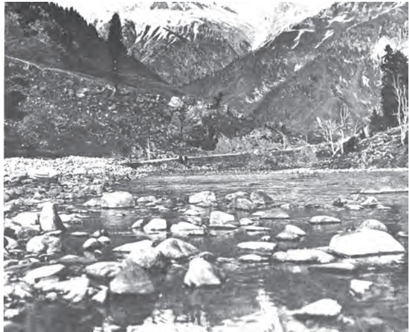

# **ENVIRONMENT AND SUSTAINABLE DEVELOPMENT**

# **After studying this chapter, the learners will**

7

- understand the concept of environment
- analyse the causes and effects of 'environmental degradation' and 'resource depletion'
- understand the nature of environmental challenges facing India
- relate environmental issues to the larger context of sustainable development.

ENVIRONMENT AND SUSTAINABLE DEVELOPMENT 115

**The environment, left to itself, can continue to support life for millions of years. The single most unstable and potentially disruptive element in the scheme is the human species. Human beings, with modern technology, have the capacity to bring about, intentionally or unintentionally, far-reaching and irreversible changes in the enviornment.**

> **Anonymous**

# **7.1 INTRODUCTION**

In the earlier chapters we have discussed the main economic issues faced by the Indian economy. The economic development that we have achieved so far has come at a very heavy price — at the cost of environmental quality. As we step into an era of globalisation that promises higher economic growth, we have to bear in mind the adverse consequences of the past developmental path on our environment and consciously choose a path of sustainable development. To understand the unsustainable path of development that we have taken and the challenges of sustainable development, we have to first understand the significance and contribution of environment to economic development. With this in mind, this chapter is divided into three sections. The first part deals with the functions and role of environment. The second section discusses the state of India's environment and the third section deals with steps and strategies to achieve sustainable development.

# **7.2 ENVIRONMENT — DEFINITION AND FUNCTIONS**

Environment is defined as the total planetary inheritance and the totality of all resources. It includes all the biotic and abiotic factors that influence each other. While all living elements—the birds, animals and plants, forests, fisheries etc.—are biotic elements, abiotic elements include air, water, land etc. Rocks and sunlight are examples of abiotic elements of the environment. A study of the environment then calls for a study of the inter-relationship between these biotic and abiotic components of the environment.

**Functions of the Environment:** The environment performs four vital functions (i) it supplies resources: resources here include both renewable and non-renewable resources. Renewable resources are those which can be used without the possibility of the resource becoming depleted or exhausted. That is, a continuous supply of the resource remains available. Examples of renewable resources are the trees in the forests and the fishes in the ocean. Non-renewable resources, on the other hand, are those which get exhausted with extraction and use, for example, fossil fuel (ii) it assimilates waste (iii) it sustains life by providing genetic and bio diversity and (iv) it also provides aesthetic services like scenery etc.

The environment is able to perform these functions without any interruption as long as the demand on these

**Fig. 7.1** *Water bodies: small, snow-fed Himalayan streams are the few fresh-water sources that remain unpolluted.*

functions is within its **carrying capacity**. This implies that the resource extraction is not above the rate of regeneration of the resource and the wastes generated are within the assimilating capacity of the environment. When this is not so, the environment fails to perform its third and vital function of life sustenance and this results in an environmental crisis. This is the situation today all over the world. The rising population of the developing countries and the affluent consumption and production standards of the developed world have placed a huge stress on the environment in terms of its first two functions. Many resources have become extinct and the wastes generated are beyond the absorptive capacity of the environment. **Absorptive capacity** means the ability of the environment to

absorb degradation. The result — we are today at the threshold of environmental crisis. The past development has polluted and dried up rivers and other aquifers making water an economic good. Besides, the intensive and extensive extraction of both renewable and non-renewable resources has exhausted some of these

# **Work These Out**

ÿ Why has water become an economic commodity? Discuss.

- ÿ Fill in the following table with some common types of diseases and illnesses that are caused due to air, water and noise pollution.

| Air Pollution | Water Pollution | Noise Pollution |
| --- | --- | --- |
| Asthma | Cholera |  |

#### **Box 7.1: Global Warming**

**Global warming** is a gradual increase in the average temperature of the earth's lower atmosphere as a result of the increase in greenhouse gases since the **Industrial Revolution**. Much of the recent observed and projected global warming is human-induced. It is caused by man-made increases in carbon dioxide and other **greenhouse gases** through the burning of **fossil fuels** and **deforestation***.* Adding carbon dioxide, methane and such other gases (that have the potential to absorb heat) to the atmosphere with no other changes will make our planet's surface warmer. The atmospheric concentrations of carbon dioxide and CH4 have increased by 31 per cent and 149 per cent respectively above pre-industrial levels since 1750. During the past century, the atmospheric temperature has risen by 1.1°F (0.6°C) and sea level has risen several inches. Some of the longer-term results of global warming are melting of polar ice with a resulting rise in sea level and coastal flooding; disruption of drinking water supplies dependent on snow melts; extinction of species as ecological niches disappear; more frequent tropical storms; and an increased incidence of tropical diseases.

Among factors that may be contributing to global warming are the burning of coal and petroleum products (sources of carbon dioxide, methane, nitrous oxide, ozone); deforestation, which increases the amount of carbon dioxide in the atmosphere; methane gas released in animal waste; and increased cattle production, which contributes to deforestation, methane production, and use of fossil fuels. A UN Conference on Climate Change, held in Kyoto, Japan, in 1997, resulted in an international agreement to fight global warming which called for reductions in emissions of greenhouse gases by industrialised nations.

**Source:** *www.wikipedia.org*

vital resources and we are compelled to spend huge amounts on technology and research to explore new resources. Added to these are the health costs of degraded environmental quality decline in air and water quality (seventy per cent of water in India is polluted) have resulted in increased incidence of respiratory and water-borne diseases. Hence the expenditure on health is also rising. To make matters worse, global environmental issues such as **global warming** and **ozone depletion** also contribute to increased financial commitments for the government. Thus, it is clear that the **opportunity costs** of negative environmental impacts are high.

The biggest question that arises is: are environmental problems new to this century? If so, why? The answer to this question requires some elaboration. In the early days when civilisation just began, or before this phenomenal increase in population, and before countries took to industrialisation, the demand for environmental resources and services was much less than their supply. This meant that pollution was within the absorptive capacity of the

### **Box 7.2: Ozone Depletion**

Ozone depletion refers to the phenomenon of reductions in the amount of ozone in the **stratosphere**. The problem of ozone depletion is caused by high levels of chlorine and bromine compounds in the stratosphere. The origins of these compounds are chlorofluorocarbons (CFC), used as cooling substances in airconditioners and refrigerators, or as aerosol propellants, and bromofluorocarbons (halons), used in fire extinguishers. As a result of depletion of the ozone layer, more ultraviolet (UV) radiation comes to Earth and causes damage to living organisms. UV radiation seems responsible for skin cancer in humans; it also lowers production of phytoplankton and thus affects other aquatic organisms. It can also influence the growth of terrestrial plants. A reduction of approximately 5 per cent in the ozone layer was detected from 1979 to 1990. Since the **ozone layer** prevents most harmful wavelengths of ultraviolet light from passing through the **Earth's atmosphere**, observed and projected decreases in ozone have generated worldwide concern. This led to the adoption of the **Montreal Protocol** banning the use of chlorofluorocarbon (CFC) compounds, as well as other ozone depleting chemicals such as carbon tetrachloride, trichloroethane (also known as methyl chloroform), and bromine compounds known as **halons.**

**Source:** *www.ceu.hu*

environment and the rate of resource extraction was less than the rate of regeneration of these resources. Hence environmental problems did not arise.

**Fig. 7.2** *Damodar Valley is one of India's most industrialised regions. Pollutants from the heavy industries along the banks of the Damodar river are converting it into an ecological disaster*

But with population explosion and with the advent of industrial revolution to meet the growing needs of the expanding population, things

changed. The result was that the demand for resources for both production and consumption went beyond the rate of regeneration of the resources; the pressure on the absorptive capacity of the environment increased tremendously — this trend continues even today. Thus what has happened is a reversal of supply-demand relationship for environmental quality — we are now faced with increased demand for environmental resources and services but their supply is limited due to overuse

ENVIRONMENT AND SUSTAINABLE DEVELOPMENT 119

and misuse. Hence the environmental issues of waste generation and pollution have become critical today.

# **7.3 STATE OF INDIA'S ENVIRONMENT**

India has abundant natural resources in terms of rich quality of soil, hundreds of rivers and tributaries, lush green forests, plenty of mineral

**Fig. 7.3** *Deforestation leads to land degradation, biodiversity loss and air pollution*

deposits beneath the land surface, vast stretch of the Indian Ocean, ranges of mountains, etc. The black soil of the Deccan Plateau is particularly suitable for cultivation of cotton, leading to concentration of textile industries in this region. The Indo-Gangetic plains spread from the Arabian Sea to the Bay of Bengal — are one of the most fertile, intensively cultivated and densely populated regions in the world. India's forests, though unevenly distributed, provide green cover for a majority of its population and natural cover for its wildlife. Large deposits of iron-ore, coal and natural gas are found in the country. India accounts for nearly 8 per cent of the world's total iron-ore reserves. Bauxite, copper, chromate, diamonds, gold, lead, lignite, manganese, zinc, uranium, etc. are also available in different parts of the country. However, the developmental activities in India have resulted in

pressure on its finite natural resources, besides creating impacts on human health and well-being. The threat to India's environment poses a dichotomy—threat of poverty-induced environmental degradation and, at the same time, threat of pollution from affluence and a rapidly growing industrial sector. Air pollution, water contamination, soil erosion, deforestation and wildlife extinction are some of the most pressing environmental concerns of India. The priority issues identified are (i) land degradation (ii) biodiversity loss (iii) air pollution with special reference to vehicular pollution in urban cities (iv) management of fresh water and (v) solid waste management. Land in India suffers from varying degrees and types of degradation stemming mainly from unstable use and inappropriate management practices.

#### 120 INDIAN ECONOMIC DEVELOPMENT

#### **Box. 7.3: Chipko or Appiko — What's in a Name?**

You may be aware of the Chipko Movement, which aimed at protecting forests in the Himalayas. In Karnataka, a similar movement took a different name, 'Appiko', which means to hug. On 8 September 1983, when the felling of trees

was started in Salkani forest in Sirsi district, 160 men, women and children hugged the trees and forced the woodcutters to leave. They kept vigil in the forest over the next six weeks. Only after the forest officials assured the volunteers that the trees will be cut scientifically and in accordance with the working plan of the district, did they leave the trees.

When commercial felling by contractors damaged a large number of natural forests, the idea of hugging the trees gave the people hope and confidence that they can protect the forests. On that particular incident, with the felling discontinued, the people saved 12,000 trees. Within months, this movement spread to many adjoining districts.

Indiscriminate felling of trees for

fuelwood and for industrial use has led to many environmental problems. Twelve years after setting up of a paper mill in Uttar Kanara area, bamboo has been wiped out from that area. "Broad-leaved trees which protected the soil from the direct onslaught of rain have been removed, the soil washed away, and bare laterite soil left behind. Now nothing grows but a weed", says a farmer. Farmers also complain that rivers and rivulets dry up quicker, and that rainfall is becoming erratic. Diseases and insects earlier unknown are now attacking the crops.

Appiko volunteers want the contractors and forest officials to follow certain rules and restrictions. For instance, local people should be consulted when trees are marked for felling and trees within 100 metres of a water source and on a slope of 30 degrees or above should not be felled.

Do you know that the government allocates forestlands to industries to use forest materials as industrial raw material? Even if a paper mill employs 10,000 workers and a plywood factory employs 800 people but if they deprive the daily needs of a million people, is it acceptable? What do you think?

**Source**: *Excerpts from 'State of India's Environment 2: The Second Citizens' Report 1984-85', Centre for Science and Environment, 1996, New Delhi.*

Some of the factors responsible for land degradation are (i) loss of vegetation occuring due to deforestation (ii) unsustainable fuel wood and fodder extraction (iii) shifting cultivation (iv) encroachment into forest lands (v) forest fires and over grazing (vi) non-adoption of adequate soil conservation measures (vii) improper crop rotation (viii) indiscriminate use of agro-chemicals such as fertilisers and pesticides (ix) improper planning and management of irrigation systems (x) extraction of ground water in the competing uses of land for forestry, agriculture, pastures, human settlements and industries exert an enormous pressure on the country's finite land resources.

The per capita forest land in the country is only 0.06 hectare against the requirement of 0.47 hectare to meet basic needs, resulting in an excess felling of about 15 million cubic metre forests over the permissible limit.

Estimates of soil erosion show that soil is being eroded at a rate of 5.3 billion tonnes a year for the entire

**Work These Out** ÿ In order to enable the students to appreciate the contribution of environment to economic development, the following game can be introduced. One student may name a product used by any enterprise and the other student may trace out its roots to nature and earth. trucks steel and rubber steel iron mineral earth rubber trees forests earth books paper trees forest earth cloth cotton plant nature petrol earth machinery iron mineral earth

ÿ A truck driver had to pay Rs 10,000 as challan as his truck was emitting black soot. Why do you think he was penalised? Was it justified? Discuss.

excess of the recharge capacity (xi) open access resource and (xii) poverty of the agriculture-dependent people.

India supports approximately 17 per cent of the world's human and 20 per cent of livestock population on a mere 2.5 per cent of the world's geographical area. The high density of population and livestock and country as a result of which the country loses 0.8 million tonnes of nitrogen, 1.8 million tonnes of phosphorus and 26.3 million tonnes of potassium every year. According to the Government of India, the quantity of nutrients lost due to erosion each year ranges from 5.8 to 8.4 million tonnes.

#### **Box 7.4 : Pollution Control Boards**

In order to address two major environmental concerns in India, viz. water and air pollution, the government set up the Central Pollution Control Board (CPCB) in 1974. This was followed by states establishing their own state level boards to address all the environmental concerns. They investigate, collect and disseminate information relating to water, air and land pollution, lay down standards for sewage/trade effluent and emissions. These boards provide technical assistance to governments in promoting cleanliness of streams and wells by prevention, control and abatement of water pollution, and improve the quality of air and to prevent, control or abate air pollution in the country.

These boards also carry out and sponsor investigation and research relating to problems of water and air pollution and for their prevention, control or abatement. They organise, through mass media, a comprehensive mass awareness programme for the same. The PCBs prepare manuals, codes and guidelines relating to treatment and disposal of sewage and trade effluents.

They assess the air quality through regulation of industries. In fact, state boards, through their district level officials, periodically inspect every industry under their jurisdiction to assess the adequacy of treatment measures provided to treat the effluent and gaseous emissions. It also provides background air quality data needed for industrial siting and town planning.

The pollution control boards collect, collate and disseminate technical and statistical data relating to water pollution. They monitor the quality of water in 125 rivers (including the tributaries), wells, lakes, creeks, ponds, tanks, drains and canals.

- ÿ Visit a nearby factory/irrigation department and collect the details of measures that they adopt to control water and air pollution.
- ÿ You might be seeing advertisements in newspapers, radio and television or billboards in your locality on awareness programmes relating to water and air pollution. Collect a few news-clippings, pamphlets and other information and discuss them in the classroom.

In India, air pollution is widespread in urban areas where vehicles are the major contributors and in a few other areas which have a high concentration of industries and thermal power plants. Vehicular emissions are of particular concern since these are ground level sources and, thus, have the maximum impact on the general population. The number of motor vehicles has increased from about 3 lakh in 1951 to 30 crores in 2019. In 2016, personal transport vehicles (two-wheeled vehicles and cars only) constituted about 85 per cent of the total number of registered vehicles thus contributing significantly to total air pollution load.

India is one of the ten most industrialised nations of the world. But this status has brought with it unwanted and unanticipated consequences such as unplanned urbanisation, pollution and the risk of accidents. The CPCB (Central Pollution

ENVIRONMENT AND SUSTAINABLE DEVELOPMENT 123

Control Board) has identified seventeen categories of industries (large and medium scale) as significantly polluting (See Box 7.4).

**Work This Out** ÿ You can see a column on the measure of air pollution in any national daily. Cut out the news item a week before Diwali, on the day of Diwali and two days after Diwali. Do you observe a significant difference in the value? Discuss in your class.

The above points highlight the challenges to India's environment. The various measures adopted by the Ministry of Environment and the central and state pollution control boards may not yield reward unless we consciously adopt a path of sustainable development. The concern for future generations alone can make development last forever. Development to enhance our current living styles, without concern for posterity, will deplete resources and degrade environment at a pace that is bound to result in both environmental and economic crisis.

# **7.4 SUSTAINABLE DEVELOPMENT**

Environment and economy are interdependent and need each other. Hence, development that ignores its repercussions on the environment will destroy the environment that sustains life forms. What is needed is sustainable development: development that will allow all future generations to have a potential average quality of life that is at least as high as that which is being enjoyed by the current generation. The concept of sustainable development was emphasised by the United Nations Conference on Environment and Development (UNCED), which defined it as: 'Development that meets the need of the present generation without compromising the ability of the future generation to meet their own needs'.

Read the definition again. You will notice that the term 'need' and the phrase 'future generations' in the definition are the catch phrases. The use of the concept 'needs' in the definition is linked to distribution of resources. The seminal report —**Our Common Future**—that gave the above definition explained sustainable development as 'meeting the basic needs of all and extending to all the opportunity to satisfy their aspirations for a better life'. Meeting the needs of all requires redistributing resources and is hence a moral issue. Edward Barbier defined sustainable development as one which is directly concerned with increasing the material standard of living of the poor at the grass root level — this can be quantitatively measured in terms of increased income, real income, educational services, health care, sanitation, water supply etc. In more specific terms, sustainable development aims at decreasing the absolute poverty of the poor by providing lasting and secure livelihoods that minimise resource depletion, environmental

#### 124 INDIAN ECONOMIC DEVELOPMENT

degradation, cultural disruption and social instability. Sustainable development is, in this sense, a development that meets the basic needs of all, particularly the poor majority, for employment, food, energy, water, housing, and ensures growth of agriculture, manufacturing, power and services to meet these needs.

The **Brundtland Commission** emphasises on protecting the future generation. This is in line with the argument of the environmentalists who emphasise that we have a moral obligation to hand over the planet earth in good order to the future generation; that is, the present generation should bequeath a better environment to the future generation. At least we should leave to the next generation a stock of 'quality of life' assets no less than what we have inherited.

The present generation can promote development that enhances the natural and built environment in ways that are compatible with (i) conservation of natural assets (ii) preservation of the regenerative capacity of the world's natural ecological system (iii) avoiding the imposition of added costs or risks on future generations.

According to Herman Daly, a leading environmental economist, to achieve sustainable development, the following needs to be done (i) limiting the human population to a level within the carrying capacity of the environment. The carrying capacity of the environment is like a'plimsoll line' of the ship which is its load limit mark. In the absence of the plimsoll line for the economy, human scale grows beyond the carrying capacity of the earth and deviates from sustainable development (ii) technological progress should be input efficient and not input consuming (iii) renewable resources should be extracted on a sustainable basis, that is, rate of extraction should not exceed rate of regeneration (iv) for non-renewable resources rate of depletion should not exceed the rate of creation of renewable substitutes and (v) inefficiencies arising from pollution should be corrected. In 2015, the UN formulated 17 Sustainable Development Goals (SDGs) intended to be achieved by the year 2030. Collect the details of those goals and discuss them in the context of India.

# **7.5 STRATEGIES FOR SUSTAINABLE DEVELOPMENT**

**Use of Non-conventional Sources of Energy:** India, as you know, is hugely dependent on thermal and hydro power plants to meet its power needs. Both of these have adverse environmental impacts. Thermal power plants emit large quantities of carbon dioxide which is a green house gas. It also produces fly ash which, if not used properly, can cause pollution of water bodies, land and other components of the environment. Hydroelectric projects inundate forests and interfere with the natural flow of water in catchment areas and the river basins. Wind power and solar rays are good examples of conventional sources of energy. In recent years, some efforts are being taken to tap these energy resources. Collect the details of one such unit set up in your area if any, and discuss in the class.

**LPG, Gobar Gas in Rural Areas:** Households in rural areas generally use wood, dung cake or other biomass as fuel. This practice has several adverse implications like deforestation, reduction in green cover, wastage of cattle dung and air pollution. To rectify the situation, subsidised LPG is being provided. In addition, gobar gas plants are being provided through easy loans and subsidy. As far as liquefied petroleum gas (LPG) is concerned, it is a clean fuel — it reduces household pollution to a large extent. Also, energy wastage is minimised. For the gobar gas plant to function, cattle dung is fed to the plant and gas is produced which is used as fuel while the slurry which is left over is a very good organic fertiliser and soil conditioner.

**CNG in Urban Areas:** In Delhi, the use of Compressed Natural Gas (CNG) as fuel in public transport system has significantly lowered air pollution and the air has become cleaner. In the last

## **Work This Out**

ÿ In Delhi, buses and other public transport vehicles uses CNG as fuel instead of petrol or diesel; some vehicles use convertible engines; solar energy is being used to light up the streets. What do you think about these changes? Delhi also adopted odd/even scheme to restrict the use of vehicles with registration ending with odd/even numbers on alternative days, for specific period in a year. Organise a debate in class on the need for sustainable development practices in India.

few years many other Indian cities also began to use CNG.

**Wind Power:** In areas where speed of wind is usually high, wind mills can provide electricity without any adverse impact on the environment. Wind turbines move with the wind and electricity is generated. No doubt, the initial cost is high. But the benefits are such that the high cost gets easily absorbed.

**Fig.7.4** *Gobar Gas Plant uses cattle dung to produce energy*

126 INDIAN ECONOMIC DEVELOPMENT

**Solar Power through Photovoltaic Cells:** India is naturally endowed with a large quantity of solar energy in the form of sunlight. We use it in different ways. For example, we dry our clothes, grains, other agricultural products as well as various items made for daily use. We also use sunlight to warm ourselves in winter. Plants use solar energy to perform photosynthesis. Now, with the help of photovoltaic cells, solar energy can be converted into electricity. These cells use special kind of materials to capture solar energy and then convert the energy into electricity. This technology is extremely useful for remote areas and for places where supply of power through grid or power lines is either not possible or proves very costly. This technique is also totally free from pollution. In recent years India is taking efforts to increase the power generation through solar. India is also leading an International body called International Solar Alliance (ISA).

**Mini-hydel Plants:** In mountainous regions, streams can be found almost everywhere. A large percentage of such streams are perennial. Mini-hydel plants use the energy of such streams to move small turbines. The turbines generate electricity which can be used locally. Such power plants are more or less environment-friendly as they do not change the land use pattern in areas where they are located; they generate enough power to meet local demands. This means that they can also do away with the need for large scale transmission towers and cables and avoid transmission loss.

**Traditional Knowledge and Practices:** Traditionally, Indian people have been close to their environment. They have been more a component of the environment and not its controller. If we look back at our agriculture system, healthcare system, housing, transport etc., we find that all practices have been environment friendly. Only recently have we drifted away from the traditional systems and caused large scale damage to the environment and also our rural heritage. Now, it is time to go back. One apt example is in healthcare. India is very much privileged to have about 15,000 species of plants which have medicinal properties. About 8,000 of these are in regular use in various systems of treatment including the folk tradition. With the sudden onslaught of the western system of treatment, we ignored our traditional systems such as Ayurveda, Unani, Tibetan and folk systems. These healthcare systems are in great demand again for treating chronic health problems. Now a days every cosmetic produce — hair oil, toothpaste, body lotion, face cream and what not — is herbal in composition. Not only are these products environment friendly, they are relatively free from side effects and do not involve large-scale industrial and chemical processing.

**Biocomposting:** In our quest to increase agricultural production during the last five decades or so, we almost totally neglected the use of compost and completely switched over to chemical fertilisers. The result is that large tracts of productive land have

ENVIRONMENT AND SUSTAINABLE DEVELOPMENT 127

been adversely affected, water bodies including ground water system have suffered due to chemical contamination and demand for irrigation has been going up year after year.

Farmers, in large numbers all over the country, have again started using compost made from organic wastes of different types. In certain parts of the country, cattle are maintained only because they produce dung which is an important fertiliser and soil conditioner.

Earthworms can convert organic matter into compost faster than the normal composting process. This process is now being widely used. Indirectly, the civic authorities are benefited too as they have to dispose reduced quantity of waste.

**Biopest Control:** With the advent of green revolution, the entire country entered into a frenzy to use more and more chemical pesticides for higher yield. Soon, the adverse impacts began to show; food products were contaminated, soil, water bodies and even ground water were polluted with pesticides. Even milk, meat and fishes were found to be contaminated.

To meet this challenge, efforts are on to bring in better methods of pest control. One such step is the use of pesticides based on plant products. Neem trees are proving to be quite useful. Several types of pest controlling chemicals have been isolated from neem and these are being used. Mixed cropping and growing different crops in consecutive years on the same land have also helped farmers.

In addition, awareness is spreading about various animals and birds which help in controlling pests. For example, snakes are one of the prime group of animals which prey upon rats, mice and various other pests. Similarly, large varieties of birds, for example, owls and peacocks, prey upon vermin and pests. If these are allowed to dwell around the agricultural areas, they can clear large varieties of pests including insects. Lizards are also important in this regard. We need to know their value and save them.

Sustainable development has become a catch phrase today. It is 'indeed' a paradigm shift in development thinking. Though it has been interpreted in a number of ways, adherence to this path ensures lasting development and non-declining welfare for all.

# **7.6 CONCLUSION**

Economic development, which aimed at increasing the production of goods and services to meet the needs of a rising population, puts greater pressure on the environment. In the initial stages of development, the demand for environmental resources was less than that of supply. Now the world is faced with increased demand for environmental resources but their supply is limited due to overuse and misuse. Sustainable development aims at promoting the kind of development that minimises environmental problems and meets the needs of the present generation without compromising the ability of the future generation to meet their own needs.

128 INDIAN ECONOMIC DEVELOPMENT

- ÿ Environment performs four functions: supplies resources, assimilates wastes, sustains life by providing genetic and bio diversity and provides aesthetic services.
- ÿ Population explosion, affluent consumption and production have placed a huge stress on the environment.
- ÿ Developmental activities in India have put immense pressure on its finite natural resources, besides creating impact on human health and well-being.
- ÿ The threat to India's environment is of two dimensions —threat of poverty induced environmental degradation and the threat of pollution from affluence and a rapidly growing industrial sector.
- ÿ Though the government, through various measures, attempts to safeguard the environment, it is also necessary to adopt a path of sustainable development.
- ÿ Sustainable development is development that meets the need of the present generation without compromising the ability of the future generation to meet their own needs.
- ÿ Promotion of natural resources, conservation, preserving regenerative capacity of ecological system and avoiding the imposition of environmental risks on future generations would lead to sustainable development.

- 1. What is meant by environment?
- 2. What happens when the rate of resource extraction exceeds that of their regeneration?
- 3. Classify the following into renewable and non-renewable resources (i) trees (ii) fish (iii) petroleum (iv) coal (v) iron-ore (vi) water.
- 4. Two major environmental issues facing the world today are ____________ and _____________.
- 5. How do the following factors contribute to the environmental crisis in India? What problem do they pose for the government?
	- (i) Rising population
	- (ii) Air pollution

#### ENVIRONMENT AND SUSTAINABLE DEVELOPMENT 129

- (iii) Water contamination
- (iv) Affluent consumption standards
- (v) Illiteracy
- (vi) Industrialisation
- (vii) Urbanisation
- (viii) Reduction of forest coverage
- (ix) Poaching, and
- (x) Global warming.
- 6. What are the functions of the environment?
- 7. Identify six factors contributing to land degradation in India.
- 8. Explain how the opportunity costs of negative environmental impact are high.
- 9. Outline the steps involved in attaining sustainable development in India.
- 10. India has abundant natural resources —substantiate the statement.
- 11. Is environmental crisis a recent phenomenon? If so, why?
- 12. Give two instances of
	- (a) Overuse of environmental resources
	- (b) Misuse of environmental resources.
- 13. State any four pressing environmental concerns of India.
- 14. Correction for environmental damages involves opportunity costs — explain.
- 15. Explain how the supply-demand reversal of environmental resources account for the current environmental crisis.
- 16. Highlight any two serious adverse environmental consequences of development in India. India's environmental problems pose a dichotomy — they are poverty induced and, at the same time, due to affluence in living standards — is this true?
- 17. What is sustainable development?
- 18. Keeping in view your locality, describe any four strategies of sustainable development.
- 19. Explain the relevance of intergenerational equity in the definition of sustainable development.

- 2. Make a list of items that can be recycled.
- 3. Prepare a chart on the causes and remedies of soil erosion in India.
- 4. How does population explosion contribute to the environmental crisis? Debate in the classroom.
- 5. The nation has to pay heavily for correcting environmental damages discuss.
- 6. A paper factory is to be set up in your village. Arrange a role play consisting of an activist, an industrialist and a group of villagers.

#### **BOOKS**

AGARWAL, ANIL and SUNITA NARAIN. 1996. *Global Warming in an Unequal World.* Centre for Science and Environment, Reprint Edition, New Delhi.

- BHARUCHA, E. 2005. *Textbook of Environmental Studies for Undergraduate Courses*, Universities Press (India) Pvt Ltd.
- CENTRE FOR SCIENCE AND ENVIRONMENT. 1996. *State of India's Environment* 1: *The First Citizens' Report 1982.* Reprint Edition, New Delhi.
- CENTRE FOR SCIENCE AND ENVIRONMENT. 1996. *State of India's Environment* 2: *The Second Citizens' Report 1985*, Reprint Edition, New Delhi.
- KARPAGAM, M. 2001.*Environmental Economics: A Textbook.* Sterling Publishers, New Delhi.
- RAJAGOPALAN, R. 2005. *Environmental Studies: From Crisis to Cure.* Oxford University Press, New Delhi.

SCHUMACHER, E.F. *Small is Beautiful*. Abacus Publishers, New York.

#### **Reports**

*State of India's Environment (for various years), Centre for Science and Environment, New Delhi*.

#### **Journals**

*Scientific American, India,* Special Issue, September 2005 *Down to Earth,* Centre for Science and Environment, New Delhi.

#### **Websites**

http://envfor.nic.in http://cpcb.nic.in http://www.cseindia.org

ENVIRONMENT AND SUSTAINABLE DEVELOPMENT 131

