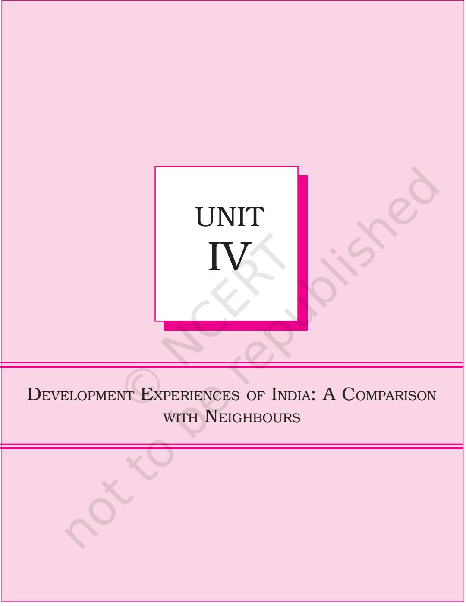
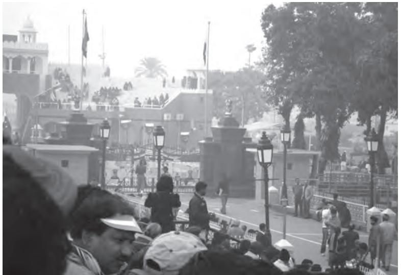
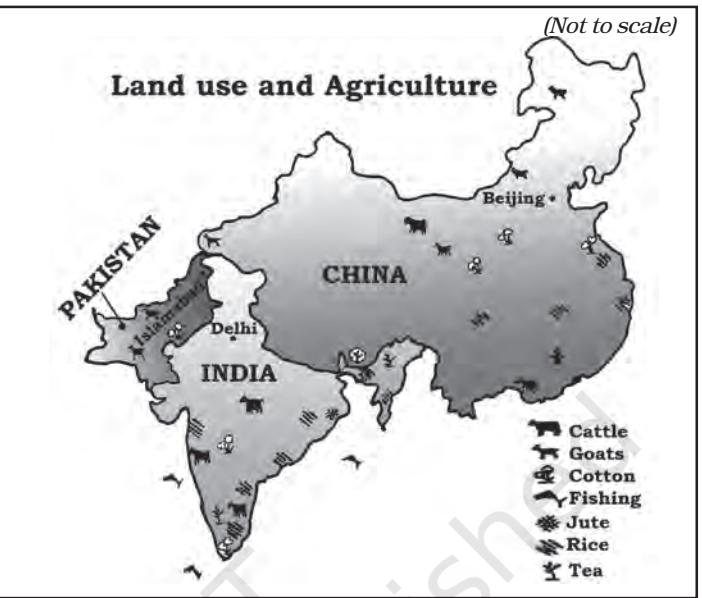
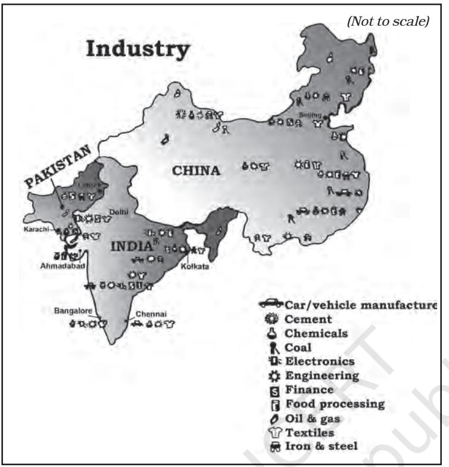

*In today's globalised world, where geographical boundaries are slowly becoming meaningless, it is important for neighbouring countries in the developing world to understand the development strategies being pursued by their neighbours. This is more so because they share the relatively limited economic space in world markets. In this unit, we will compare India's developmental experiences with two of its important and strategic neighbours — Pakistan and China.*

# **COMPARATIVE DEVELOPMENT EXPERIENCES OF INDIA AND ITS NEIGHBOURS**

## **After studying this chapter, the learners will**

- figure out comparative trends in various economic and human development indicators of India and its neighbours, China and Pakistan
- assess the strategies that these countries have adopted to reach their present state of development.

134 INDIAN ECONOMIC DEVELOPMENT

**Geography has made us neighbours. History has made us friends. Economics has made us partners, and necessity has made us allies. Those whom God has so joined together, let no man put asunder.**

**John F. Kennedy**

## **8.1 INTRODUCTION**

In the preceding units we studied the developmental experience of India in detail. We also studied the kind of policies India adopted, which had varying impacts in different sectors. Over the last two decades or so, the economic transformation that is taking place in different countries across the world, partly because of the process of globalisation, has both short as well as long-term implications for each country, including India. Nations have been primarily trying to adopt various means which will strengthen their own domestic economies. To this effect, they are forming regional and global economic groupings such as the **SAARC, European Union, ASEAN, G-8, G-20, BRICS** etc. In addition, there is also an increasing eagerness on the parts of various nations to try and understand the developmental processes pursued by their neighbouring nations as it allows them to better comprehend their own strengths and weaknesses vis-à-vis their neighbours. In the unfolding process of globalisation, this is particularly considered essential by developing countries as they face competition not only from developed nations but also amongst themselves in the relatively limited economic space enjoyed by the developing world. Besides, an understanding of the other economies in our neighbourhood is also required as all major common economic activities in the region impinge on overall human development in a shared environment.

In this chapter we will compare the developmental strategies pursued by India and the largest two of its neighbouring economies—Pakistan and China. It has to be remembered that despite being endowed with vast natural resources, there is little similarity between the political power setup of India - the largest democracy of the world which is wedded to a secular and deeply liberal Constitution for more than half a century, and the militarist political power structure of Pakistan or the command economy of China that has only recently started moving towards a democratic system and more liberal economic restructuring respectively.

## **8.2 DEVELOPMENTAL PATH—A SNAPSHOT VIEW**

Do you know that India, Pakistan and China have many similarities in their developmental strategies? All the three nations have started towards their developmental path at the same time. While India and Pakistan became independent nations in 1947, People's Republic of China was established in 1949. In a speech at that time, Jawaharlal Nehru had said, "These new and revolutionary changes in China and India, even though they differ in content, symbolise the new spirit of Asia and new vitality which is finding expression in the countries in Asia."

All three countries had started planning their development strategies in similar ways. While India announced its first Five Year Plan for 1951–56, Pakistan announced its first five year plan, now called the Medium Term Development Plan, in 1956. China announced its First Five Year Plan in 1953. Since 2018, Pakistan is working on the basis of 12th Five Year Development Plan (2018–23), whereas, China is working on 14th Five Year Plan (2021–25). Until March 2017, India has been following Five Year Plan- based development model. India and Pakistan adopted similar strategies, such as creating a large public sector and raising public expenditure on social development. Till the 1980s, all the three countries had similar growth rates and per capita incomes. Where do they stand today in comparison to one another? Before we answer this question, let us trace the historical path of developmental policies in China and Pakistan. After studying the last three units, we already know what policies India has been adopting since its Independence.

**China:** After the establishment of People's Republic of China under oneparty rule, all critical sectors of the economy, enterprises and lands owned and operated by individuals were brought under government control. The **Great Leap Forward (GLF)** campaign initiated in 1958 aimed at industrialising the country on a massive scale. People were encouraged to set up industries in their backyards. In rural areas, communes were started. Under the **Commune** system, people collectively cultivated lands. In 1958, there were 26,000 communes covering almost all the farm population.

GLF campaign met with many problems. A severe drought caused havoc in China killing about 30 million people. When Russia had conflicts with China, it withdrew its professionals who had earlier been sent to China to help in the industrialisation process. In 1965, Mao introduced the **Great Proletarian Cultural Revolution** (1966–76) under which students and professionals were sent to work and learn from the countryside.

The present day fast industrial growth in China can be traced back to the reforms introduced in 1978. China introduced reforms in phases. In the initial phase, reforms were initiated in agriculture, foreign trade and investment sectors. In agriculture, for instance, commune lands were divided into small plots, which were allocated (for use not ownership) to individual households. They were allowed to keep all income from the land after paying stipulated taxes. In the later phase, reforms were initiated in the industrial sector. Private sector firms, in general, and township and village enterprises, i.e., those enterprises which were owned and operated by local collectives, in particular, were allowed to produce

#### 136 INDIAN ECONOMIC DEVELOPMENT

**Fig. 8.1** *Wagah Border is not only a tourist place but also used for trade between India and Pakistan*

goods. At this stage, enterprises owned by government (known as State Owned Enterprises—SOEs), which we, in India, call public sector enterprises, were made to face competition. The reform process also involved dual pricing. This means fixing the prices in two ways; farmers and industrial units were required to buy and sell fixed quantities of inputs and outputs on the basis of prices fixed by the government and the rest were purchased and sold at market prices. Over the years, as production increased, the proportion of goods or inputs transacted in the market also increased. In order to attract foreign investors, **special economic zones** were set up.

**Pakistan:** While looking at various economic policies that Pakistan adopted, you will notice many similarities with India. Pakistan also follows the mixed economy model with co-existence of public and private sectors. In the late 1950s and 1960s, Pakistan introduced a variety of regulated policy framework (for import substitution-based industrialisation). The policy combined tariff protection for manufacturing of consumer goods together with direct import controls on competing imports. The introduction of Green Revolution led to mechanisation and increase in public investment in infrastructure in select areas, which finally led to a rise in the production of foodgrains. This changed the agrarian structure dramatically. In the 1970s, **nationalisation** of capital goods industries took place. Pakistan then shifted its policy orientation in the late 1970s and 1980s when the major thrust areas were denationalisation and encouragement of private sector. During this period, Pakistan also received financial support from western nations and remittances from continuously increasing outflow of emigrants to the Middle-east. This helped the country in stimulating economic growth. The then government also offered incentives to the private sector. All this created a conducive climate for new investments. In 1988, reforms were initiated in the country.

Having studied a brief outline of the developmental strategies of China and Pakistan, let us now compare some of the developmental indicators of India, China and Pakistan.

## **8.3 DEMOGRAPHIC INDICATORS**

If we look at the global population, out of every six persons living in this world, one is an Indian and another a Chinese. We shall compare some demographic indicators of India, China and Pakistan. The population of Pakistan is very small and accounts for roughly about one-tenth of China or India.

Though China is the largest nation and geographically occupies the largest area among the three nations, its density is the lowest. Table 8.1 shows the population growth as being the highest in Pakistan, followed by India and China. Scholars point out the onechild norm introduced in China in the late 1970s as the major reason for low population growth. They also state that this measure led to a decline in the sex ratio, the proportion of females per 1000 males. However, from the table, you will notice that the sex ratio is low and biased against females in all three countries. Scholars cite son preference prevailing in all these countries as the reason. In recent times, all three countries are adopting various measures to improve the situation. Onechild norm and the resultant arrest in the growth of population also have other implications. For instance, after a few decades, in China, there will be more elderly people in proportion to young people. This led China to allow couples to have two children.

The fertility rate is also low in China and very high in Pakistan. Urbanisation is high in China with India having 34 per cent of its people living in urban areas.

| TABLE 8.1 |
| --- |

#### **Select Demographic Indicators, 2017-18**

| Country | Estimated | Annual | Density | Sex | Fertility | Urbanisation |
| --- | --- | --- | --- | --- | --- | --- |
|  | Population (in million) | Growth of Population | (per sq. km) | Ratio | Rate |  |
| India | 1352 | 1.03 | 455 | 924 | 2.2 | 34 |
| China | 1393 | 0.46 | 148 | 949 | 1.7 | 59 |
| Pakistan | 212 | 2.05 | 275 | 943 | 3.6 | 37 |

**Source:** *World Development Indicators 2019, www.worldbank.org*

138 INDIAN ECONOMIC DEVELOPMENT

## **8.4 GROSS DOMESTIC PRODUCT AND SECTORS**

One of the much-talked issues around the world about China is its growth of Gross Domestic Product. China has the second largest GDP (PPP) of $22.5 trillion in the world, whereas, India's GDP (PPP) is $9.03 trillion and Pakistan's GDP is $ 0.94 trillion, roughly about 11 per cent of India's GDP. India's GDP is about 41 per cent of China's GDP.

When many developed countries were finding it difficult to maintain a growth rate of even 5 per cent, China was able to maintain near double-digit growth during 1980s as can be seen from Table 8.2. Also, notice that in the 1980s, Pakistan was ahead of India; China was having double-digit growth and India was at the bottom. In 2015–17, there has been a decline in Pakistan

**Fig. 8.2** *Land use and agriculture in India, China and Pakistan*

TABLE 8.2

**Annual Growth of Gross Domestic Product (%), 1980–2017**

| Country | 1980–90 | 2015–2017 |
| --- | --- | --- |
| India | 5.7 | 7.3 |
| China | 10.3 | 6.8 |
| Pakistan | 6.3 | 5.3 |

**Source:** *Key Indicators for Asia and Pacific 2016, Asian Development Bank, Philippines; World Development Indicators 2018*

## **Work These Out**

ÿ Does India follow any population stabilisation measures? If so, collect the details and discuss in the classroom. You may refer to the latest Economic Survey, annual reports or website of the Ministry of Health and Family Welfare (http://mohfw.nic.in).

ÿ Scholars find son preference as a common phenomenon in many developing countries, including India, China and Pakistan. Do you find this phenomenon in your family or neighbourhood? Why do people practise discrimination between male and female children? What do you think about it? Discuss it in the classroom.

**Fig. 8.3** *Industry in India, China and Pakistan*

and China's growth rates, whereas, India met with moderate increase in growth rates. Some scholars hold the reform processes introduced in Pakistan and political instability over a long period as reasons behind the declining growth rate in Pakistan. We will study in a later section which sector contributed to different growth rates in these countries.

First, look at how people engaged in different sectors contribute to the Gross Domestic Product now called as Gross Value Added. It was pointed out in the previous section that China and Pakistan have more proportion of urban population than India. In China, due to topographic and climatic conditions, the area suitable for cultivation is relatively small — only about 10 per cent of its total land area. The total cultivable area in China accounts for 40 per cent of the cultivable area in India. Until the 1980s, more than 80 per cent of the people in China were dependent on farming as their sole source of livelihood. Since then, the government encouraged people to leave their fields and pursue other activities such as handicrafts, commerce and transport. In 2018–

19, with 26 per cent of its workforce engaged in agriculture, its contribution to the GVA in China is 7 per cent (see Table 8.3).

In both India and Pakistan, the contribution of agriculture to GVA were 16 and 24 per cent, respectively, but the proportion of workforce that works in this sector is more in India. In Pakistan, about 41 per cent of people work in agriculture, whereas, in India, it is 43 per cent. Twenty four per cent of Pakistan workforce is engaged in industry but it produces 19 per cent of GVA. In India, industry workforce

#### TABLE 8.3

| Sector |  | Contribution to GVA |  |  | Distribution of Workforce |  |
| --- | --- | --- | --- | --- | --- | --- |
|  | India | China | Pakistan | India | China | Pakistan |
| Agriculture | 16 | 7 | 24 | 43 | 26 | 41 |
| Industry | 30 | 41 | 19 | 25 | 28 | 24 |
| Services | 54 | 52 | 57 | 32 | 46 | 35 |
| Total | 100 | 100 | 100 | 100 | 100 | 100 |

#### **Sectoral Share of Employment and GVA (%) in 2018–2019**

**Source:** *Human Development Report 2019 ; Key Indicators of Asia and Pacific 2019.*

account for 25 per cent but produces goods worth 30 per cent of GVA. In China, industries contribute to GVA at 41, and employ 28 per cent of workforce. In all the three countries, service sector contributes highest share of GVA.

In the normal course of development, countries first shift their employment and output from agriculture to Industry and then to services. This is what is happening in China as can be seen from Table 8.3. The proportion of workforce engaged in industry in India and Pakistan were low at 25 per cent and 24 per cent respectively. The contribution of industries to GVA is at 30 per cent in India and 19 per cent in Pakistan. In these countries, the shift is taking place directly to the service sector.

Thus, in all the three countries the service sector is emerging as a major player of development. It contributes more to GVA and, at the same time, emerges as a prospective employer. If we look at the proportion of workforce in the1980s, Pakistan was faster in shifting its workforce to service sector than India and China. In the 1980s, India, China and Pakistan employed 17, 12 and 27 per cent of its workforce in the service sector respectively. In 2019, it has reached the level of 32, 46 and 35 per cent, respectively.

In the last five decades, the growth of agriculture sector, which employs the largest proportion of workforce in all the three countries, has declined. In the industrial sector, China has maintained a near double-digit growth rate in 1980s but began showing decline in recent years,

## **Work These Out** ÿ Do you think it is necessary

- for India and Pakistan to concentrate on the manufacturing sector as China does? Why?
- ÿ Scholars argue that the service sector should not be considered as an engine of growth whereas India and Pakistan have raised their share of output mainly in this sector only. What do you think?

COMPARATIVE DEVELOPMENT EXPERIENCES OF INDIA AND ITS NEIGHBOURS 141

#### TABLE 8.4

| Country | 1980–90 |  |  | 2014–18 |  |  |
| --- | --- | --- | --- | --- | --- | --- |
|  | Agriculture | Industry | Service | Agriculture Industry |  | Service |
| India | 3.1 | 7.4 | 6.9 | 3.1 | 6.9 | 7.6 |
| China | 5.9 | 10.8 | 13.5 | 3.1 | 5.3 | 7.1 |
| Pakistan | 4 | 7.7 | 6.8 | 1.7 | 4.8 | 5.0 |

#### **Trends in Output Growth in Different Sectors, 1980–2015**

whereas, for India and Pakistan growth rate has declined. In case of service sector, China was able to maintain its rate of growth during 1980–1990,while there was a positive and increasing growth of India's service sector output. Thus, China's growth is contributed by the manufacturing and service sectors and India's growth by the service sector. During this period, Pakistan has shown deceleration in all three sectors.

## **8.5 INDICATORS OF HUMAN DEVELOPMENT**

You might have studied about the importance of human development indicators in the lower classes and the position of many developed and developing countries. Let us look how India, China and Pakistan have performed in some of the select indicators of human development. Look at Table 8.5.

#### TABLE 8.5

| Some Selected Indicators of Human Development, 2017-2019 |
| --- |

| Item | India | China | Pakistan |
| --- | --- | --- | --- |
| Human Development Index (Value) | 0.645 | 0.761 | 0.557 |
| Rank (based on HDI) | 130 | 87 | 154 |
| Life Expectancy at Birth (years) | 69.7 | 76.9 | 67.3 |
| Mean years of Schooling (% aged 15 and above) | 6.5 | 8.1 | 5.2 |
| Gross National Income per capita (PPP US$) | 6,681 | 16,057 | 5,005 |
| Percentage of People living Below Poverty Line (National) | 21.9* | 1.7** | 24.3* |
| Infant Mortality Rate (per 1000 live births) | 29.9 | 7.4 | 57.2 |
| Maternal Mortality Rate (per 1 lakh births) | 133 | 29 | 140 |
| Population using at least basic Sanitation (%) | 60 | 75 | 60 |
| Population using at least basic drinking | 93 | 96 | 91 |
| Water Source (%) |  |  |  |
| Percentage of Undernourished Children | 37.9 | 8.1 | 37.6 |

**Note: *** *for the year 2011; for the years 2015.*

**Sources:** *Human Development Report 2019 and 2020 and World Development Indicators (www.worldbank.org); Key indicators for Asia and the Pacific 2019, Asian Development Bank (ADB).*

#### 142 INDIAN ECONOMIC DEVELOPMENT

Table 8.5 shows that China is moving ahead of India and Pakistan. This is true for many indicators income indicator such as GDP per capita, or proportion of population below poverty line or health indicators such as mortality rates, access to sanitation, literacy, life expectancy or malnourishment. China and Pakistan are ahead of India in reducing proportion of people below the poverty line and also their performance in sanitation. But India and Pakistan have not been able to save women from maternal mortality. In China, for one lakh births, only 29 women die whereas in India and Pakistan, about 133 and 140 women die respectively. Surprisingly all the three countries report providing improved drinking water sources for most of its population. China has the smallest share of poor among the three countries. Find out for yourself how these differences occur.

In dealing with or making judgements on such questions, however, we should also note a problem while using the human development indicators given above with conviction. This occurs because these are all extremely important indicators; but these are not sufficient. Along with these, we also need what may be called 'liberty indicators'. One such indicator has actually been added as a measure of 'the extent of democratic participation in social and political decision-making*'* but it has not been given any extra weight. Some obvious 'liberty indicators' like measures of *'*the extent of Constitutional protection given to rights of citizens' or 'the extent of constitutional protection of the Independence of the Judiciary and the Rule of Law' have not even been introduced so far. Without including these (and perhaps some more) and giving them overriding importance in the list, the construction of a human development index may be said to be incomplete and its usefulness limited.

## **8.6 DEVELOPMENT STRATEGIES — AN APPRAISAL**

It is common to find developmental strategies of a country as a model to others for lessons and guidance for their own development. It is particularly evident after the introduction of the reform process in different parts of the world. In order to learn from economic performance of our neighbouring countries, it is necessary to have an understanding of the roots of their successes and failures. It is also necessary to distinguish between, and contrast, the different phases of their strategies. Though countries go through their development phases differently, let us take the initiation of reforms as a point of reference. We know that reforms were initiated in China in 1978, Pakistan in 1988 and India in 1991. Let us briefly assess their achievements and failures in pre- and post-reform periods.

Why did China introduce structural reforms in 1978? China did not have any compulsion to introduce reforms as dictated by the World Bank and International Monetary Fund to India and Pakistan. The new leadership at that time in China was not happy with the slow pace of growth and lack of modernisation in the Chinese economy under the Maoist rule. They felt that Maoist vision of economic development based on decentralisation, self sufficiency and shunning of foreign technology, goods and capital had failed. Despite extensive land reforms, collectivisation, the Great Leap Forward and other initiatives, the per capita grain output in 1978 was the same as it was in the mid-1950s.

It was found that establishment of infrastructure in the areas of education and health, land reforms, long existence of decentralised planning and existence of small enterprises had helped positively in improving the social and income indicators in the post reform period. Before the introduction of reforms, there had already been massive extension of basic health services in rural areas. Through the commune system, there was more equitable distribution of food grains. Experts also point out that each reform measure was first implemented at a smaller level and then extended on a massive scale. The experimentation under decentralised government enabled to assess the economic, social and political costs of success or failure. For instance, when reforms were made in agriculture, as pointed out earlier by handing over plots of land to individuals for cultivation, it brought prosperity to a vast number of poor people. It created conditions for the subsequent phenomenal growth in rural industries and built up a strong support base for more reforms. Scholars quote many such examples on how reform measures led to rapid growth in China.

 Scholars argue that in Pakistan the reform process led to worsening of all the economic indicators. We have seen in an earlier section that compared to 1980s, the growth rate of GDP and its sectoral constituents have not yet improved.

Though the data on international poverty line for Pakistan is quite healthy, scholars using the official data of Pakistan indicate rising poverty there. The proportion of poor in 1960s was more than 40 per cent which declined to 25 per cent in 1980s and started rising again in the recent decades. The reasons for the slowdown of growth and re-emergence of poverty in Pakistan's economy, as scholars put it, are agricultural growth and food supply situation were based not on an institutionalised process of technical change but on good harvest. When there was a good harvest, the economy was in good condition, when it was not, the economic indicators showed stagnation or negative trends. You will recall that India had to borrow from the IMF and World Bank to set right its balance of payments crisis; foreign exchange is an essential component for any country and it is

#### 144 INDIAN ECONOMIC DEVELOPMENT

#### **Work These Out**

- ÿ While India has performed relatively well vis-à-vis other developing countries (including its Asian neighbours) in terms of economic growth, India is yet to show the world that there is considerable progress in terms of human development indicators. Where India went wrong ? Why did we not take care of our human resources? Discuss in the classroom.
- ÿ There is a general perception going around in India that there is sudden increase in dumping of Chinese goods into India which have implications for manufacturing sector in India and also that we do not engage ourselves in trading with our neighbouring nations. Look at the following table, which shows exports from India to, and imports from, Pakistan and China. From newspapers and websites and listening to news, collect the details of goods and services transacted in trading with our neighbours. In order to get detailed information relating to international trade, you can log on to the website: http:/dgft.gov.in.

| Imports to India (Rs in crore) | Country | Exports from India ( Rs in crore) |  |  |  |  |
| --- | --- | --- | --- | --- | --- | --- |
| Annual | 2004-2005 | 2018-2019 | Annual Rate of | 2004-2005 2018-2019 |  | Rate of |
| Growth (%) |  |  | Growth (%) |  |  |  |
| 5.1 | Pakistan 2,341 | 14,426 | 3.7 | 427 | 3476 |  |
| 10.3 | China 25,232 | 1,17,289 | 2.6 | 31,892 | 4,92,079 |  |

- ÿ Calculate exports as a % of imports for both the years and discuss the probable reasons for the trend in the class.
important to know how it can be earned. If a country is able to build up its foreign exchange earnings by sustainable export of manufactured goods, it need not worry. In Pakistan most foreign exchange earnings came from remittances from Pakistani workers in the Middle-east and the exports of highly volatile agricultural products; there was also growing dependence on foreign loans on the one hand and increasing difficulty in paying back the loans on the other.

However, during the last few years, Pakistan has recovered its economic growth and has been sustaining. In 2017-18, the Annual Plan 2019-20 reports that, the GDP registered a growth of 5.5 per cent, highest when compared to the previous decade. While agriculture recorded growth rate far from satisfactory level, industrial and service sectors grew at 4.9 and 6.2 per cent respectively. Many macroeconomic indicators also began to show stable and positive trends.

## **8.7 CONCLUSION**

What are we learning from the developmental experiences of our neighbours? India, China and Pakistan have travelled seven decades of developmental path with varied results. Till the late 1970s, all of them were maintaining the same level of low development. The last three decades have taken these countries to different levels. India, with democratic institutions, performed moderately, but a majority of its people still depend on agriculture. India has taken many initiatives to develop the infrastructure and improve the standard of living. Scholars are of the opinion that political instability, over-dependence on remittances and foreign aid along with volatile performance of agriculture sector are the reasons for the slowdown of the Pakistan economy. Yet, last five years, many macroeconomic indicators began showing positive and moderate growth rates reflecting the economic recovery. In China, the lack of political freedom and its implications for human rights are major concerns; yet, in the last four decades, it used the 'market system without losing political commitment' and succeeded in raising the level of growth alongwith alleviation of poverty. You will also notice that unlike India and Pakistan, which are attempting to privatise their public sector enterprises, China has used the market mechanism to 'create additional social and economic opportunities'. By retaining collective ownership of land and allowing individuals to cultivate lands, China has ensured social security in rural areas. Public intervention in providing social infrastructure even prior to reforms has brought about positive results in human development indicators in China.

- ÿ With the unfolding of the globalisation process, developing countries are keen to understand the developmental processes pursued by their neighbours as they face competition from developed nations as also amongst themselves.
- ÿ India, Pakistan and China have similar physical endowments but totally different political systems.
- ÿ All the three countries follow the similar planned pattern of development. However, the structures established to implement developmental policies are quite different.
- ÿ Till the early 1980s, the developmental indicators of all the three countries, such as growth rates and sectoral contribution towards national income, were similar.
- ÿ Reforms were introduced in 1978 in China, in 1988 in Pakistan and in 1991 in India.
- ÿ China introduced structural reforms on its own initiative while they were forced upon India and Pakistan by international agencies.
- ÿ The impact of policy measures were different in these countries for instance, one-child norm has arrested the population growth in China whereas in India and Pakistan, a major change is yet to take place.
- ÿ Even after seventy years of planned development, majority of the workforce in all the countries depends on agriculture. The dependency is greater in India.
- ÿ Though China has followed the classical development pattern of gradual shift from agriculture to manufacturing and then to services, India and Pakistan's shift has been directly from agriculture to service sector.
- ÿ China's industrial sector has maintained a high growth rate while it is not so in both India and Pakistan. This led to rapid increase of the GDP per capita in China than in India and Pakistan.
- ÿ China is ahead of India and Pakistan on many human development indicators. However these improvements were attributed not to the reform process but the strategies that China adopted in the pre-reform period.
- ÿ While assessing the developmental indicators, one also has to consider the liberty indicators.

- 1. Why are regional and economic groupings formed?
- 2. What are the various means by which countries are trying to strengthen their own domestic economies?
- 3. What similar developmental strategies have India and Pakistan followed for their respective developmental paths?
- 4. Explain the Great Leap Forward campaign of China as initiated in 1958.
- 5. China's rapid industrial growth can be traced back to its reforms in 1978. Do you agree? Elucidate.
- 6. Describe the path of developmental initiatives taken by Pakistan for its economic development.
- 7. What is the important implication of the 'one child norm' in China?
- 8. Mention the salient demographic indicators of China, Pakistan and India.
- 9. Compare and contrast India and China's sectoral contribution towards GVA/GDP. What does it indicate?
- 10. Mention the various indicators of human development.
- 11. Define the liberty indicator. Give some examples of liberty indicators.
- 12. Evaluate the various factors that led to the rapid growth in economic development in China.
- 13. Group the following features pertaining to the economies of India, China and Pakistan under three heads
	- One-child norm
	- Low fertility rate
	- High degree of urbanisation
	- Mixed economy
	- Very high fertility rate
	- Large population
	- High density of population
	- Growth due to manufacturing sector
	- Growth due to service sector.
- 14. Give reasons for the slow growth and re-emergence of poverty in Pakistan.
- 15. Compare and contrast the development of India, China and Pakistan with respect to some salient human development indicators.
- 16. Comment on the growth rate trends witnessed in China and India in the last two decades.
- 17. Fill in the blanks
	- (a) First Five Year Plan of ________________ commenced in the year 1956. (Pakistan/China)
	- (b) Maternal mortality rate is high in _____________. (China/ Pakistan)
	- (c) Proportion of people below poverty line is more in __________. (India/Pakistan)
	- (d) Reforms in ______________ were introduced in 1978. (China/ Pakistan)

- 1. Organise a class debate on the issue of free trade between India and China and India and Pakistan.
- 2. You are aware that cheap Chinese goods are available in the market, for example, toys, electronic goods, clothes, batteries etc. Do you think that these products are comparable in quality and price with their Indian counterparts? Do they create a threat to our domestic producers? Discuss.
- 3. Do you think India can introduce the one-child norm like China to reduce population growth? Organise a debate on the policies that India can follow to reduce population growth.
- 4. China's growth is mainly contributed by the manufacturing sector and India's growth by the service sector —prepare a chart showing the relevance of this statement with respect to the structural changes in the last decade in the respective countries.
- 5. How is China able to lead in all the Human Development Indicators? Discuss in the classroom. Use Human Development Report of the latest year.

#### **Books**

DREZE, JEAN AND AMARTYA SEN. 1996. *India: Economic Development and Social Opportunity.* Oxford University Press, New Delhi.

#### **Articles**

- RAY, ALOK. 2002. 'The Chinese Economic Miracle: Lessons to be Learnt.' *Economic and Political Weekly,* September 14, pp. 3835-3848.
- ZAIDI, S. AKBAR. 1999. 'Is Poverty now a Permanent Phenomenon in Pakistan?' *Economic and Political Weekly,* October 9, pp. 2943-2951.

#### **Government Reports**

*Annual Plan 2016-17,* Ministry of Planning, Development & Reform, Government of Pakistan accessed from http://pc.gov.pk on 02 January 2017.

*Economic Survey,* Ministry of Finance, Government of India (for various years).

*Human Development Report 2005,* United Nations Development Programme, Oxford University Press, Oxford.

*Labour Market Indicators, 3rd Edition,* International Labour Organisation, Geneva.

*Pakistan: National Human Development Report 2003,* United Nations Development Programme, Second Impression 2004.

*World Development Report 2005,* The World Bank, Oxford University Press, New York.

*World Development Indicators for various years,* World Bank Washington.

*Human Development Report for various years*, United Nations Development Programme Geneva.

*Key Indicators of Asia and Pacific 2016*, Asian Development Bank, Philippines.

#### **Websites**

www.stats.gov.cn www.statpak.gov.pk www.un.org www.ilo.org www.planningcommission.nic.in www.dgft.delhi.nic.in

