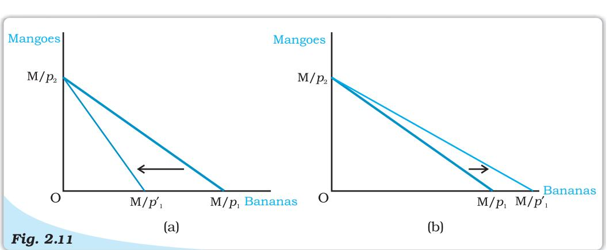

# Chapter 2

## Theory of Consumer Behaviour

In this chapter, we will study the behaviour of an individual consumer. The consumer has to decide how to spend her income on different goods1 . Economists call this the problem of choice. Most naturally, any consumer will want to get a combination of goods that gives her maximum satisfaction. What will be this 'best' combination? This depends on the likes of the consumer and what the consumer can afford to buy. The 'likes' of the consumer are also called 'preferences'. And what the consumer can afford to buy, depends on prices of the goods and the income of the consumer. This chapter presents two different approaches that explain consumer behaviour (i) Cardinal Utility Analysis and (ii) Ordinal Utility Analysis.

## Preliminary Notations and Assumptions

A consumer, in general, consumes many goods; but for simplicity, we shall consider the consumer's choice problem in a situation where there are only two goods2 : bananas and mangoes. Any combination of the amount of the two goods will be called a consumption bundle or, in short, a bundle. In general, we shall use the variable *x1* to denote the quantity of bananas and *x2* to denote the quantity of mangoes. *x1* and *x2* can be positive or zero. (*x1*, *x2* ) would mean the bundle consisting of *x1* quantity of bananas and *x2* quantity of mangoes. For particular values of *x1* and *x2* , (*x1 , x2* ), would give us a particular bundle. For example, the bundle (5,10) consists of 5 bananas and 10 mangoes; the bundle (10, 5) consists of 10 bananas and 5 mangoes.

## 2.1 UTILITY

A consumer usually decides his demand for a commodity on the basis of utility (or satisfaction) that he derives from it. What is utility? Utility of a commodity is its want-satisfying capacity. The more the need of a commodity or the stronger the desire to have it, the greater is the utility derived from the commodity.

Utility is subjective. Different individuals can get different levels of utility from the same commodity. For example, some one who

1We shall use the term goods to mean goods as well as services.

2The assumption that there are only two goods simplifies the analysis considerably and allows us to understand some important concepts by using simple diagrams.

likes chocolates will get much higher utility from a chocolate than some one who is not so fond of chocolates, Also, utility that one individual gets from the commodity can change with change in place and time. For example, utility from the use of a room heater will depend upon whether the individual is in Ladakh or Chennai (place) or whether it is summer or winter (time).

## 2.1.1 Cardinal Utility Analysis

Cardinal utility analysis assumes that level of utility can be expressed in numbers. For example, we can measure the utility derived from a shirt and say, this shirt gives me 50 units of utility. Before discussing further, it will be useful to have a look at two important measures of utility.

## *Measures of Utility*

Total Utility: Total utility of a fixed quantity of a commodity (TU) is the total satisfaction derived from consuming the given amount of some commodity *x*. More of commodity *x* provides more satisfaction to the consumer. TU depends on the quantity of the commodity consumed. Therefore, TUn refers to total utility derived from consuming *n* units of a commodity *x*.

Marginal Utility: Marginal utility (MU) is the change in total utility due to consumption of one additional unit of a commodity. For example, suppose 4 bananas give us 28 units of total utility and 5 bananas give us 30 units of total utility. Clearly, consumption of the 5th banana has caused total utility to increase by 2 units (30 units minus 28 units). Therefore, marginal utility of the 5th banana is 2 units.

MU5 = TU5 – TU4 = 30 – 28 = 2

In general, MU*n* = TU*n* – TU*n*-1, where subscript *n* refers to the *n th* unit of the commodity

Total utility and marginal utility can also be related in the following way. TUn = MU1 + MU2 + … + MU*n*-1 + MU*n*

This simply means that TU derived from consuming *n* units of bananas is the sum total of marginal utility of first banana (MU1 ), marginal utility of second banana (MU2 ), and so on, till the marginal utility of the *n th* unit.

Table No. 2.1 and Figure 2.1 show an imaginary example of the values of marginal and total utility derived from consumption of various amounts of a commodity. Usually, it is seen that the marginal utility diminishes with increase in consumption of the commodity. This happens because having obtained some amount of the commodity, the desire of the consumer to have still more of it becomes weaker. The same is also shown in the table and graph.

## Table 2.1: Values of marginal and total utility derived from consumption of various amounts of a commodity

| Units | Total Utility | Marginal Utility |
| --- | --- | --- |
| 1 | 12 | 12 |
| 2 | 18 | 6 |
| 3 | 22 | 4 |
| 4 | 24 | 2 |
| 5 | 24 | 0 |
| 6 | 22 | -2 |

9Theory of Consumer Behaviour

Notice that MU*3* is less than MU*2* . You may also notice that total utility increases but at a diminishing rate: The rate of change in total utility due to change in quantity of commodity consumed is a measure of marginal utility. This marginal utility diminishes with increase in consumption of the commodity from 12 to 6, 6 to 4 and so on. This follows from the law of diminishing marginal utility. Law of Diminishing Marginal Utility states that

*The values of marginal and total utility derived from consumption of various amounts of a commodity. The marginal utility diminishes with increase in consumption of the commodity.*

marginal utility from consuming each additional unit of a commodity declines as its consumption increases, while keeping consumption of other commodities constant.

MU becomes zero at a level when TU remains constant. In the example, TU does not change at 5th unit of consumption and therefore MU5 = 0. Thereafter, TU starts falling and MU becomes negative.

## *Derivation of Demand Curve in the Case of a Single Commodity (Law of Diminishing Marginal Utility)*

Cardinal utility analysis can be used to derive demand curve for a commodity. What is demand and what is demand curve? The quantity of a commodity that a consumer is willing to buy and is able to afford, given prices of goods and income of the consumer, is called demand for that commodity. Demand for a commodity *x*, apart from the price of *x* itself, depends on factors such as prices of other commodities (see substitutes and complements 2.4.4), income of the consumer and tastes and preferences of the consumers. Demand curve is a graphic presentation of various quantities of a commodity that a consumer is willing to buy at different prices of the same commodity, while holding constant

prices of other related commodities and income of the consumer.

Figure 2.2 presents hypothetical demand curve of an individual for commodity *x* at its different prices. Quantity is measured along the horizontal axis and price is measured along the vertical axis.

The downward sloping demand curve shows that at lower prices, the individual is willing to buy more of commodity *x*; at higher prices, she is willing to buy less of commodity *x*. Therefore, there is a negative

relationship between price of a

*Demand curve of an individual for commodity x*

commodity and quantity demanded which is referred to as the Law of Demand.

An explaination for a downward sloping demand curve rests on the notion of diminishing marginal utility. The law of diminishing marginal utility states that each successive unit of a commodity provides lower marginal utility.

Therefore the individual will not be willing to pay as much for each additional unit and this results in a downward sloping demand curve. At a price of Rs. 40 per unit *x*, individual's demand for *x* was 5 units. The 6th unit of commodity *x* will be worth less than the 5th unit. The individual will be willing to buy the 6th unit only when the price drops below Rs. 40 per unit. Hence, the law of diminishing marginal utility explains why demand curves have a negative slope.

## 2.1.2 Ordinal Utility Analysis

Cardinal utility analysis is simple to understand, but suffers from a major drawback in the form of quantification of utility in numbers. In real life, we never express utility in the form of numbers. At the most, we can rank various alternative combinations in terms of having more or less utility. In other words, the consumer does not measure utility in numbers, though she often ranks various consumption bundles. This forms the starting point of this topic – Ordinal Utility Analysis.

A consumer's preferences over the set of available bundles can often be

represented diagrammatically. We have already seen that the bundles available to the consumer can be plotted as points in a twodimensional diagram. The points representing bundles which give the consumer equal utility can generally be joined to obtain a curve like the one in Figure 2.3. The consumer is said to be indifferent on the different bundles because each point of the bundles give the consumer equal utility. Such a curve joining all points representing bundles among which the consumer is indifferent is called an indifference curve. All the points such as A, B, C and D lying on an

*Indifference curve. An indifference curve joins all points representing bundles which are considered indifferent by the consumer.*

indifference curve provide the consumer with the same level of satisfaction.

It is clear that when a consumer gets one more banana, he has to forego some mangoes, so that her total utility level remains the same and she remains on the same indifference curve. Therefore, indifference curve slopes downward. The amount of mangoes that the consumer has to forego, in order to get an additional banana, her total utility level being the same, is called marginal rate of substitution (MRS). In other words, MRS is simply the rate at which the consumer will substitute bananas for mangoes, so that her total utility remains

constant. So, *MRS Y X* =| ∆ ∆ | / 3 .

One can notice that, in the table 2.2, as we increase the quantity of bananas, the quantity of mangoes sacrificed for each additional banana declines. In other words, MRS diminishes with increase in the number of bananas. As the number

*MRS Y X* =| ∆ ∆ | / means that MRS equals only the magnitude of the expression ∆ ∆ *Y X* / . If ∆ ∆ = − *Y X* / 3 /1 it means MRS=3.

3 | ∆ ∆ |= ∆ ∆ ∆ ∆ ≥ <i>Y X Y X if Y X / / ( / ) 0

= −∆ ∆ ∆ ∆ &lt; *Y X if Y X* / ( / ) 0

|  | Combination Quantity of bananas (Qx) Quantity of Mangoes (Qy) |  | MRS |
| --- | --- | --- | --- |
| A | 1 | 15 | - |
| B | 2 | 12 | 3:1 |
| C | 3 | 10 | 2:1 |
| D | 4 | 9 | 1:1 |

Table 2.2: Representation of Law of Diminishing Marginal Rate of Substitution

of bananas with the consumer increases, the MU derived from each additional banana falls. Similarly, with the fall in quantity of mangoes, the marginal utility derived from mangoes increases. So, with increase in the number of bananas, the consumer will feel the inclination to sacrifice small and smaller amounts of mangoes. This tendency for the MRS to fall with increase in quantity of bananas is known as Law of Diminishing Marginal Rate of Substitution. This can be seen from figure 2.3 also. Going from point A to point B, the consumer sacrifices 3 mangoes for 1 banana, going from point B to point C, the consumer sacrifices 2 mangoes for 1 banana, and going from point C to point D, the consumer sacrifices just 1 mango for 1 banana. Thus, it is clear that the consumer sacrifices smaller and smaller quantities of mangoes for each additional banana.

#### *Shape of an Indifference Curve*

It may be mentioned that the law of Diminishing Marginal Rate of Substitution causes an indifference curve to be convex to the origin. This is the most common shape of an indifference curve. But in case of goods being perfect substitutes4 , the marginal rate of substitution does not diminish. It remains the same. Let's take an example.

| Combination | Quantity of five | Quantity of five | MRS |
| --- | --- | --- | --- |
|  | Rupees notes (Qx) | Rupees coins (Qy) |  |
| A | 1 | 8 | - |
| B | 2 | 7 | 1:1 |
| C | 3 | 6 | 1:1 |
| D | 4 | 5 | 1:1 |

#### Table 2.3: Representation of Law of Diminishing Marginal Rate of Substitution

Here, the consumer is indifferent for all these combinations as long as the total of five rupee coins and five rupee notes remains the same. For the consumer, it hardly matters whether she gets a five rupee coin or a five rupee note. So, irrespective of how many five rupee notes she has, the consumer will sacrifice only one five rupee coin for a five rupee note. So these two commodities are perfect substitutes for the consumer and indifference curve depicting these will be a straight line.

In the figure.2.4, it can be seen that consumer sacrifices the same number of five-rupee coins each time he has an additional five-rupee note.

4 Perfect Substitutes are the goods which can be used in place of each other, and provide exactly the same level of utility to the consumer.

## *Monotonic Preferences*

Consumer's preferences are assumed to be such that between any two bundles (*x*1 *, x*2 ) and (*y*1 *, y*2 ), if (*x*1 *, x*2 ) has more of at least one of the goods and no less of the other good compared to (*y*1 *, y*2 ), then the consumer prefers (*x*1 *, x*2 ) to (*y*1 *, y*2 ). Preferences of this kind are called monotonic preferences. Thus, a consumer's preferences are monotonic if and only if between any two bundles, the consumer prefers the bundle which has more of at least one of the goods and no less of the other good as compared to the other bundle.

## *Indifference Map*

The consumer's preferences over all the bundles can be represented by a family of indifference curves as shown in Figure 2.5. This is called an indifference map of the consumer. All points on an indifference curve represent bundles which are considered indifferent by the consumer. Monotonicity of preferences imply that between any two indifference curves, the bundles on the one which lies above are preferred to the bundles on the one which lies below.

#### *Features of Indifference Curve*

#### 1. Indifference curve slopes downwards from left to right:

An indifference curve slopes downwards from left to right, which means that in order to have more of bananas, the consumer has to forego some mangoes. If the consumer does not forego some mangoes with an increase in number of bananas, it will mean consumer having more of bananas with same number of mangoes, taking her to a higher indifference curve. Thus, as long as the consumer is on the same indifference curve, an increase in bananas must be compensated by a fall in quantity of mangoes.

*Indif ference Curve for per fect substitutes. Indifference curve depicting two commodities which are perfect substitutes is a straight line.*

*Indifference Map. A family of indifference curves. The arrow indicates that bundles on higher indifference curves are preferred by the consumer to the bundles on lower indifference curves.*

*Slope of the Indifference Curve*. *The indifference curve slopes downward. An increase in the amount of bananas along the indifference curve is associated with a decrease in the amount of mangoes. If* ∆ *x1*

*> 0 then* ∆ *x2 < 0.*

#### 2.Higher indifference curve gives greater level of utility:

As long as marginal utility of a commodity is positive, an individual will always prefer more of that commodity, as more of the commodity will increase the level of satisfaction.

Table 2.4: Representation of different level of utilities from different combination of goods

| Combination | Quantity of bananas | Quantity of Mangoes |
| --- | --- | --- |
| A | 1 | 10 |
| B | 2 | 10 |
| C | 3 | 10 |

 Consider the different combination of bananas and mangoes, A, B and C depicted in table 2.4 and figure 2.7. Combinations A, B and C consist of same quantity of mangoes but different quantities of bananas. Since combination B

has more bananas than A, B will provide the individual a higher level of satisfaction than A. Therefore, B will lie on a higher indifference curve than A, depicting higher satisfaction. Likewise, C has more bananas than B (quantity of mangoes is the same in both B and C). Therefore, C will provide higher level of satisfaction than B, and also lie on a higher indifference curve than B.

A higher indifference curve consisting of combinations with more of mangoes, or more of bananas, or more of both, will

*Higher indifference curves give greater level of utility.*

represent combinations that give higher level of satisfaction.

#### 3.Two indifference curves never intersect each other:

Two indifference curves intersecting each other will lead to conflicting results. To explain this, let us allow two indifference curves to intersect each other as shown in the figure 2.8. As points A and B lie on the same indifference curve IC1 , utilities derived from combination A and combination B will give the same level of satisfaction. Similarly, as points A and C lie on the same indifference curve IC2 , utility derived from combination A and from combination C will give the same level of satisfaction.

*Two indifference curves never intersect each other*

From this, it follows that utility from point B and from point C will also be the same. But this is clearly an absurd result, as on point B, the consumer gets a greater number of mangoes with the same quantity of bananas. So consumer is better off at point B than at point C. Thus, it is clear that intersecting indifference curves will lead to conflicting results. Thus, two indifference curves cannot intersect each other.

## 2.2 THE CONSUMER'S BUDGET

Let us consider a consumer who has only a fixed amount of money (income) to spend on two goods. The prices of the goods are given in the market. The consumer cannot buy any and every combination of the two goods that she may want to consume. The consumption bundles that are available to the consumer depend on the prices of the two goods and the income of the consumer. Given her fixed income and the prices of the two goods, the consumer can afford to buy only those bundles which cost her less than or equal to her income.

## 2.2.1 Budget Set and Budget Line

Suppose the income of the consumer is *M* and the prices of bananas and mangoes are *p*1 and *p*2 respectively5 . If the consumer wants to buy *x1* quantities of bananas, she will have to spend *p*1 *x1* amount of money. Similarly, if the consumer wants to buy *x2* quantities of mangoes, she will have to spend *p*2 *x2* amount of money. Therefore, if the consumer wants to buy the bundle consisting of *x1* quantities of bananas and *x2* quantities of mangoes, she will have to spend *p*1 *x1* + *p*2 *x2* amount of money. She can buy this bundle only if she has at least *p*1 *x1* + *p*2 *x2* amount of money. Given the prices of the goods and the income of a consumer, she can choose any bundle as long as it costs less than or equal to the income she has. In other words, the consumer can buy any bundle (*x1 , x2* ) such that

$p_{1}x_{1}+p_{2}x_{2}\leq M$

The inequality (2.1) is called the consumer's budget constraint. The set of bundles available to the consumer is called the budget set. The budget set is thus the collection of all bundles that the consumer can buy with her income at the prevailing market prices.

## EXAMPLE 2.1

Consider, for example, a consumer who has Rs 20, and suppose, both the goods are priced at Rs 5 and are available only in integral units. The bundles that this consumer can afford to buy are: (0, 0), (0, 1), (0, 2), (0, 3), (0, 4), (1, 0), (1, 1), (1, 2), (1, 3), (2, 0), (2, 1), (2, 2), (3, 0), (3, 1) and (4, 0). Among these bundles, (0, 4), (1,3), (2, 2), (3, 1) and (4, 0) cost exactly Rs 20 and all the other bundles cost less than Rs 20. The consumer cannot afford to buy bundles like (3, 3) and (4, 5) because they cost more than Rs 20 at the prevailing prices.

5 Price of a good is the amount of money that the consumer has to pay per unit of the good she wants to buy. If rupee is the unit of money and quantity of the good is measured in kilograms, the price of banana being *p*1 means the consumer has to pay *p1 rupees per kilograms of banana that she wants to buy.*

If both the goods are perfectly divisible6 , the consumer's budget set would consist of all bundles (*x*1 *, x*2 ) such that *x*1 and *x*2 are any numbers greater than or equal to 0 and *p*1 *x*1 + *p*2 *x*2 ≤ *M*. The budget set can be represented in a diagram as in Figure 2.9.

All bundles in the positive quadrant which are on or below the line are included in the budget set. The equation of the line is

$$P_{1}\bf{x}_{1}\bf{+}P_{2}\bf{x}_{2}\bf{=}\bf{M} (2.2)$$

The line consists of all bundles which cost exactly equal to *M*. This line is called the budget line. Points below the budget line represent bundles which cost strictly less than *M*.

The equation (2.2) can also be written as7

*Budget Set. Quantity of bananas is measured along the horizontal axis and quantity of mangoes is measured along the vertical axis. Any point in the diagram represents a bundle of the two goods. The budget set consists of all points on or below the straight line having the equation p1 x1 + p2 x2 =* M*.*

$$\chi_{2}=\frac{M}{P_{2}}-\frac{P_{1}}{P_{2}}\chi_{1}\tag{2.3}$$

The budget line is a straight line with horizontal intercept 1 *M p* and vertical

intercept 2 *M p* . The horizontal intercept represents the bundle that the consumer can buy if she spends her entire income on bananas. Similarly, the vertical intercept represents the bundle that the consumer can buy if she spends her

entire income on mangoes. The slope of the budget line is 1 2 – *p p* .

#### *Price Ratio and the Slope of the Budget Line*

Think of any point on the budget line. Such a point represents a bundle which costs the consumer her entire budget. Now suppose the consumer wants to have one more banana. She can do it only if she gives up some amount of the other good. How many mangoes does she have to give up if she wants to have an extra quantity of bananas? It would depend on the prices of the two goods. A quantity of banana costs *p*1 . Therefore, she will have to reduce her expenditure on mangoes by *p*1 amount, if she wants one more quantity of banana. With *p*1 ,

she could buy 1 2 *p p* quantities of mangoes. Therefore, if the consumer wants to

have an extra quantity of bananas when she is spending all her money, she will

have to give up 1 2 *p p* quantities of mangoes. In other words, in the given market

<i>6The goods considered in Example 2.1 were not divisible and were available only in integer units. There are many goods which are divisible in the sense that they are available in non-integer units also. It is not possible to buy half an orange or one-fourth of a banana, but it is certainly possible to buy half a kilogram of rice or one-fourth of a litre of milk.

7 In school mathematics, you have learnt the equation of a straight line as *y* = *c* + *mx* where *c* is the vertical intercept and m is the slope of the straight line. Note that equation (2.3) has the same form.

Derivation of the Slope of the Budget Line

The slope of the budget line measures the amount of change in mangoes required per unit of change in bananas along the budget line. Consider any two points (*x*1 *, x*2 ) and (*x*1 + ∆*x*1 *, x*2 + ∆*x*2 ) on the budget line.*a* It must be the case that

> *p*1 *x*1 + *p*2 *x*2 = *M* (2.4)

and, *p*1 (*x*1 + ∆*x*1 ) + *p*2 (*x*2 + ∆*x*2

Subtracting (2.4) from (2.5), we obtain

$$p_{1}\Delta x_{1}+p_{2}\Delta x_{2}=0$$

By rearranging terms in (2.6), we obtain

∆ = − ∆ 2 1 1 2 *x p x p*

= 0 (2.6)

(2.7)

a∆ (delta) is a Greek letter. In mathematics, ∆ is sometimes used to denote 'a change'. Thus, ∆*x*1 stands for a change in *x*1 and ∆*x*2 stands for a change in *x*2 .

conditions, the consumer can substitute bananas for mangoes at the rate 1 2 *p p* .

The absolute value8 of the slope of the budget line measures the rate at which the consumer is able to substitute bananas for mangoes when she spends her entire budget.

#### 2.2.2 Changes in the Budget Set

The set of available bundles depends on the prices of the two goods and the income of the consumer. When the price of either of the goods or the consumer's income changes, the set of available bundles is also likely to change. Suppose the consumer's income changes from *M* to *M*′ but the prices of the two goods remain unchanged. With the new income, the consumer can afford to buy all bundles (*x*1 *, x*2 ) such that *p*1 *x*1 + *p*2 *x*2 ≤ *M*′. Now the equation of the budget line is

$P_{1}x_{1}+P_{2}x_{2}=M^{\prime}$ (2.8)

Equation (2.8) can also be written as

$$\chi_{2}=\frac{M^{\prime}}{P_{2}}-\frac{P_{1}}{P_{2}}\chi_{1}\tag{2.9}$$

Note that the slope of the new budget line is the same as the slope of the budget line prior to the change in the consumer's income. However, the vertical intercept has changed after the change in income. If there is an increase in the

8The absolute value of a number *x* is equal to *x* if *x* ≥ *0* and is equal to – *x* if *x* < 0. The absolute value of *x* is usually denoted by |*x*|.

17

income, i.e. if *M' > M,* the vertical as well as horizontal intercepts increase, there is a parallel outward shift of the budget line. If the income increases, the consumer can buy more of the goods at the prevailing market prices. Similarly, if the income goes down, i.e. if *M' < M*, both intercepts decrease, and hence, there is a parallel inward shift of the budget line. If income goes down, the availability of goods goes down. Changes in the set of available bundles resulting from changes in consumer's income when the prices of the two goods remain unchanged are shown in Figure 2.10.

*Changes in the Set of Available Bundles of Goods Resulting from Changes in the Consumer's Income. A decrease in income causes a parallel inward shift of the budget line as in panel (a). An increase in income causes a parallel outward shift of the budget line as in panel (b).*

Now suppose the price of bananas change from *p*1 to *p'*1 but the price of mangoes and the consumer's income remain unchanged. At the new price of bananas, the consumer can afford to buy all bundles (*x*1 *,x*2 ) such that *p'*1 *x*1 + *p*2 *x*2 ≤ *M*. The equation of the budget line is

$P^{{}^{\prime}}_{1}X_{1}+P_{2}X_{2}=M$ (2.10)

Equation (2.10) can also be written as

$\chi_{2}=\frac{M}{P_{2}}-\frac{P_{1}^{\prime}}{P_{2}}\,\chi_{1}$ (2.11)

Note that the vertical intercept of the new budget line is the same as the vertical intercept of the budget line prior to the change in the price of bananas. However, the slope of the budget line and horizontal intercept have changed after the price change. If the price of bananas increases, ie if *p'*1 *> p*1 , the absolute value of the slope of the budget line increases, and the budget line becomes steeper (it pivots inwards around the vertical intercept and horizontal intercept decreases). If the price of bananas decreases, i.e., *p'*1 *< p*1 , the absolute value of the slope of the budget line decreases and hence, the budget line becomes flatter (it pivots outwards around the vertical intercept and horizontal intercept increases). Figure 2.11 shows change in the budget set when the price of only one commodity changes while the price of the other commodity as well as income of the consumer are constant.

A change in price of mangoes, when price of bananas and the consumer's income remain unchanged, will bring about similar changes in the budget set of the consumer.

*Changes in the Set of Available Bundles of Goods Resulting from Changes in the Price of bananas. An increase in the price of bananas makes the budget line steeper as in panel (a). A decrease in the price of bananas makes the budget line flatter as in panel (b).*

## 2.3 OPTIMAL CHOICE OF THE CONSUMER

The budget set consists of all bundles that are available to the consumer. The consumer can choose her consumption bundle from the budget set. But on what basis does she choose her consumption bundle from the ones that are available to her? In economics, it is assumed that the consumer chooses her consumption bundle on the basis of her tatse and preferences over the bundles in the budget set. It is generally assumed that the consumer has well defined preferences over the set of all possible bundles. She can compare any two bundles. In other words, between any two bundles, she either prefers one to the other or she is indifferent between the two.

Equality of the Marginal Rate of Substitution and the Ratio of the Prices

The optimum bundle of the consumer is located at the point where the budget line is tangent to one of the indifference curves. If the budget line is tangent to an indifference curve at a point, the absolute value of the slope of the indifference curve (MRS) and that of the budget line (price ratio) are same at that point. Recall from our earlier discussion that the slope of the indifference curve is the rate at which the consumer is willing to substitute one good for the other. The slope of the budget line is the rate at which the consumer is able to substitute one good for the other in the market. At the optimum, the two rates should be the same. To see why, consider a point where this is not so. Suppose the MRS at such a point is 2 and suppose the two goods have the same price. At this point, the consumer is willing to give up 2 mangoes if she is given an extra banana. But in the market, she can buy an extra banana if she gives up just 1 mango. Therefore, if she buys an extra banana, she can have more of both the goods compared to the bundle represented by the point, and hence, move to a preferred bundle. Thus, a point at which the MRS is greater, the price ratio cannot be the optimum. A similar argument holds for any point at which the MRS is less than the price ratio.

In economics, it is generally assumed that the consumer is a rational individual. A rational individual clearly knows what is good or what is bad for her, and in any given situation, she always tries to achieve the best for herself. Thus, not only does a consumer have well-defined preferences over the set of available bundles, she also acts according to her preferences. From the bundles which are available to her, a rational consumer always chooses the one which gives her maximum satisfaction.

In the earlier sections, it was observed that the budget set describes the bundles that are available to the consumer and her preferences over the available bundles can usually be represented by an indifference map. Therefore, the consumer's problem can also be stated as follows: The rational consumer's problem is to move to a point on the highest possible indifference curve given her budget set.

If such a point exists, where would it be located? *The optimum point would be located on the budget line.* A point below the budget line cannot be the optimum. Compared to a point below the budget line, there is always some point on the budget line which contains more of at least one of the goods and no less of the other, and is, therefore, preferred by a consumer whose preferences are monotonic. Therefore, if the consumer's preferences are monotonic, for any point below the budget line, there is some point on the budget line which is preferred by the consumer. Points above the budget line are not available to the consumer. Therefore, the optimum (most preferred) bundle of the consumer would be on the budget line.

Where on the budget line will the optimum bundle be located? *The point at which the budget line just touches (is tangent to), one of the indifference curves would be the optimum.*9 To see why this is so, note that any point on the budget line other than the point at which it touches the indifference curve lies on a lower indifference curve and hence is inferior. Therefore, such a point cannot be the consumer's optimum. The optimum bundle is located on the budget line at the point where the budget line is tangent to an indifference curve.

Figure 2.12 illustrates the consumer's optimum. At * * 1 2 ( , ) *x x* , the budget line is tangent to the black coloured indifference curve. The first thing to note is that the indifference curve just touching the budget line is the highest possible indifference curve given the consumer's budget set. Bundles on the indifference curves above this, like the grey one, are not affordable. Points on the indifference curves below this, like the blue one, are certainly inferior to the points on the indifference curve, just touching the budget line. Any other

*Consumer's Optimum. The point (x* ∗ *1* , *x* ∗ *2 ), at which the budget line is tangent to an indifference curve represents the consumers*

point on the budget line lies on a lower indifference curve and hence, is inferior to * * 1 2 ( , ) *x x* . Therefore, * * 1 2 ( , ) *x x* is the consumer's optimum bundle.

9 To be more precise, if the situation is as depicted in Figure 2.12 then the optimum would be located at the point where the budget line is tangent to one of the indifference curves. However, there are other situations in which the optimum is at a point where the consumer spends her entire income on one of the goods only.

## 2.4 DEMAND

In the previous section, we studied the choice problem of the consumer and derived the consumer's optimum bundle given the prices of the goods, the consumer's income and her preferences. It was observed that the amount of a good that the consumer chooses optimally, depends on the price of the good itself, the prices of other goods, the consumer's income and her tastes and preferences. The quantity of a commodity that a consumer is willing to buy and is able to afford, given prices of goods and consumer's tastes and preferences is called demand for the commodity. Whenever one or more of these variables

change, the quantity of the good chosen by the consumer is likely to change as well. Here we shall change one of these variables at a time and study how the amount of the good chosen by the consumer is related to that variable.

## 2.4.1 Demand Curve and the Law of Demand

If the prices of other goods, the consumer's income and her tastes and preferences remain unchanged, the amount of a good that the consumer optimally chooses, becomes entirely dependent on its price. The relation between the consumer's optimal choice of the quantity of a good and its price is very important and this relation is called the demand function. Thus, the consumer's demand function for a good

*Demand Curve. The demand curve is a relation between the quantity of the good chosen by a consumer and the price of the good. The independent variable (price) is measured along the vertical axis and dependent variable (quantity) is measured along the horizontal axis. The demand curve gives the quantity demanded by the consumer at each price.*

#### Functions

Consider any two variables *x* and *y*. A function

*y* = *f* (*x*)

is a relation between the two variables *x* and *y* such that for each value of *x,* there is an unique value of the variable *y*. In other words, *f* (*x*) is a rule which assigns an unique value *y* for each value of *x*. As the value of *y* depends on the value of *x*, *y* is called the dependent variable and *x* is called the independent variable.

## EXAMPLE 1

Consider, for example, a situation where *x* can take the values 0, 1, 2, 3 and suppose corresponding values of *y* are 10, 15, 18 and 20, respectively. Here *y* and *x* are related by the function *y* = *f* (*x*) which is defined as follows: *f* (0) = 10*; f* (1) = 15*; f* (2) = 18 and *f* (3) = 20.

#### EXAMPLE 2

Consider another situation where *x* can take the values 0, 5, 10 and 20. And suppose corresponding values of *y* are 100, 90, 70 and 40, respectively.

Here, *y* and *x* are related by the function *y* = *f* (*x*) which is defined as follows: *f* (0) = 100; *f* (10) = 90; *f* (15) = 70 and *f* (20) = 40.

Very often a functional relation between the two variables can be expressed in algebraic form like

$$y=5+x\,{\mathrm{and}}\,\,y=50-x$$

A function *y* = *f* (*x*) is an increasing function if the value of *y* does not decrease with increase in the value of *x*. It is a decreasing function if the value of *y* does not increase with increase in the value of *x*. The function in Example 1 is an increasing function. So is the function *y* = *x* + 5. The function in Example 2 is a decreasing function. The function *y* = 50 – *x* is also decreasing.

Graphical Representation of a Function

A graph of a function *y* = *f* (*x*) is a diagrammatic representation of the function. Following are the graphs of the functions in the examples given above.

Usually, in a graph, the independent variable is measured along the horizontal axis and the dependent variable is measured along the vertical axis. However, in economics, often the opposite is done. The demand curve, for example, is drawn by taking the independent variable (price) along the vertical axis and the dependent variable (quantity) along the horizontal axis. The graph of an increasing function is upward sloping or and the graph of a decreasing function is downward sloping. As we can see from the diagrams above, the graph of *y* = 5 + *x* is upward sloping and that of *y* = 50 – *x,* is downward sloping.

gives the amount of the good that the consumer chooses at different levels of its price when the other things remain unchanged. The consumer's demand for a good as a function of its price can be written as

  
  
**X = $f$(P)**

where X denotes the quantity and P denotes the price of the good.

The demand function can also be represented graphically as in Figure 2.13. The graphical representation of the demand function is called the demand curve. The relation between the consumer's demand for a good and the price of the good is likely to be negative in general. In other words, the amount of a good that a consumer would optimally choose is likely to increase when the price of the good falls and it is likely to decrease with a rise in the price of the good.

## 2.4.2 Deriving a Demand Curve from Indifference Curves and Budget Constraints

Consider an individual consuming bananas (X1 )and mangoes (X2 ), whose income is M and market prices of X1 and X2 are P'1 and P '2 respectively. Figure (a) depicts her consumption equilibrium at point C, where she buys X '1 and X '2 quantities of bananas and mangoes respectively. In panel (b) of figure 2.14, we plot P '1 against X '1 which is the first point on the demand curve for X1 .

*Deriving a demand curve from indifference curves and budget constraints*

Suppose the price of X1 drops to P1 with P '2 and M remaining constant. The budget set in panel (a), expands and new consumption equilibrium is on a higher indifference curve at point D, where she buys more of bananas ( X X ' 1 1 > ). Thus, demand for bananas increases as its price drops. We plot P1 against X1 in panel (b) of figure 2.14 to get the second point on the demand curve for X1 . Likewise the price of bananas can be dropped further to ∧ P1 , resulting in further increase in consumption of bananas to ∧ X1 . ∧ P1 plotted against ∧ X1 gives us the third point on the demand curve. Therefore, we observe that a drop in price of bananas results in an increase in quality of bananas purchased by an individual who maximises his utility. The demand curve for bananas is thus negatively sloped.

The negative slope of the demand curve can also be explained in terms of the two effects namely, substitution effect and income effect that come into play when price of a commodity changes. When bananas become cheaper, the consumer maximises his utility by substituting bananas for mangoes in order to derive the same level of satisfaction of a price change, resulting in an increase in demand for bananas.

23Theory of Consumer Behaviour

Moreover, as price of bananas drops, consumer's purchasing power increases, which further increases demand for bananas (and mangoes). This is the income effect of a price change, resulting in further increase in demand for bananas.

*Law of Demand: Law of Demand states that other things being equal, there is a negative relation between demand for a commodity and its price. In other words, when price of the commodity increases, demand for it falls and when price of the commodity decreases, demand for it rises, other factors remaining the same.*

*Linear Demand*

A linear demand curve can be written as

$$d(p)=a-b p;\,0\,{\stackrel{.}{\leq}}\,p\,{\stackrel{.}{\leq}}\,{\frac{a}{b}}$$

$$=0;\,p>{\frac{a}{b}}\qquad\qquad(2.13)$$

where *a* is the vertical intercept, *–b* is the slope of the demand curve. At price 0, the demand is *a,* and at price

equal to *a b ,* the demand is 0. The slope of the demand curve measures

the rate at which demand changes with respect to its price. For a unit increase in the price of the good, the demand falls by *b* units. Figure 2.15 depicts a linear demand curve.

#### 2.4.3 Normal and Inferior Goods

The demand function is a relation between the consumer's demand for a good and its price when other things are given. Instead of studying the relation between the demand for a good and its price, we can also study the relation between the consumer's demand for the good and the income of the consumer.

The quantity of a good that the consumer demands can increase or decrease with the rise in income depending on the nature of the good. For most goods, the quantity that a consumer chooses, increases as the consumer's income increases and decreases as the consumer's income decreases. Such goods are called normal goods. Thus, a consumer's demand for a normal good moves in the same direction as the income of the consumer. However, there are some goods the demands for which move in the opposite direction of the income of the consumer. Such goods are called inferior goods. As the income of the consumer increases, the demand for an inferior good falls, and as the income decreases, the demand for an inferior

A rise in the purchasing power (income) of the consumer can sometimes induce the consumer to reduce the consumption of a good. In such a case, the substitution effect and the income effect will work in opposite directions. The demand for such a good can be inversely or positively related to its price depending on the relative strengths of these two opposing effects. If the substitution effect is stronger than the income effect, the demand for the good and the price of the good would still be inversely related. However, if the income effect is stronger than the substitution effect, the demand for the good would be positively related to its price. Such a good is called a Giffen good.

good rises. Examples of inferior goods include low quality food items like coarse cereals.

A good can be a normal good for the consumer at some levels of income and an inferior good for her at other levels of income. At very low levels of income, a consumer's demand for low quality cereals can increase with income. But, beyond a level, any increase in income of the consumer is likely to reduce her consumption of such food items as she switches to better quality cereals.

## 2.4.4 Substitutes and Complements

We can also study the relation between the quantity of a good that a consumer chooses and the price of a related good. The quantity of a good that the consumer chooses can increase or decrease with the rise in the price of a related good depending on whether the two goods are substitutes or complementary to each other. Goods which are consumed together are called complementary goods. Examples of goods which are complement to each other include tea and sugar, shoes and socks, pen and ink, etc. Since tea and sugar are used together, an increase in the price of sugar is likely to decrease the demand for tea and a decrease in the price of sugar is likely to increase the demand for tea. Similar is the case with other complements. In general, the demand for a good moves in the opposite direction of the price of its complementary goods.

In contrast to complements, goods like tea and coffee are not consumed together. In fact, they are substitutes for each other. Since tea is a substitute for coffee, if the price of coffee increases, the consumers can shift to tea, and hence, the consumption of tea is likely to go up. On the other hand, if the price of coffee decreases, the consumption of tea is likely to go down. The demand for a good usually moves in the direction of the price of its substitutes.

## 2.4.5 Shifts in the Demand Curve

The demand curve was drawn under the assumption that the consumer's income, the prices of other goods and the preferences of the consumer are given. What happens to the demand curve when any of these things changes?

25

Theory of Consumer

Behaviour

Given the prices of other goods and the preferences of a consumer, if the income increases, the demand for the good at each price changes, and hence, there is a shift in the demand curve. For normal goods, the demand curve shifts rightward and for inferior goods, the demand curve shifts leftward.

Given the consumer's income and her preferences, if the price of a related good changes, the demand for a good at each level of its price changes, and hence, there is a shift in the demand curve. If there is an increase in the price of a substitute good, the demand curve shifts rightward. On the other hand, if there is an increase in the price of a complementary good, the demand curve shifts leftward.

The demand curve can also shift due to a change in the tastes and preferences of the consumer. If the consumer's preferences change in favour of a good, the demand curve for such a good shifts rightward. On the other hand, the demand curve shifts leftward due to an unfavourable change in the preferences of the consumer. The demand curve for ice-creams, for example, is likely to shift rightward in the summer because of preference for ice-creams goes up in summer. Revelation of the fact that cold-drinks might be injurious to health can adversely affect preferences for cold-drinks. This is likely to result in a leftward shift in the demand curve for cold-drinks.

*Shifts in Demand. The demand curve in panel (a) shifts leftward and that in panel (b) shifts rightward.*

Shifts in the demand curve are depicted in Figure 2.16. It may be mentioned that shift in demand curve takes place when there is a change in some factor, other than the price of the commodity.

## 2.4.6 Movements along the Demand Curve and Shifts in the Demand Curve

As it has been noted earlier, the amount of a good that the consumer chooses depends on the price of the good, the prices of other goods, income of the consumer and her tastes and preferences. The demand function is a relation between the amount of the good and its price when other things remain unchanged. The demand curve is a graphical representation of the demand function. At higher prices, the demand is less, and at lower prices, the demand is more. Thus, any change in the price leads to movements along the demand curve. On the other hand, changes in any of the other things lead to a shift in the demand curve. Figure 2.17 illustrates a movement along the demand curve and a shift in the demand curve.

*Movement along a Demand Curve and Shift of a Demand Curve. Panel (a) depicts a movement along the demand curve and panel (b) depicts a shift of the demand curve.*

## 2.5 MARKET DEMAND

In the last section, we studied the choice problem of the individual consumer and derived the demand curve of the consumer. However, in the market for a

good, there are many consumers. It is important to find out the market demand for the good. The market demand for a good at a particular price is the total demand of all consumers taken together. The market demand for a good can be derived from the individual demand curves. Suppose there are only two

*Derivation of the Market Demand Curve. The market demand curve can be derived as a horizontal summation of the individual demand curves.*

consumers in the market for a good. Suppose at price *p*′, the demand of consumer 1 is *q*′ 1 and that of consumer 2 is *q*′ 2 . Then, the market demand of the good at *p*′ is *q*′ 1 + *q*′ 2 . Similarly, at price *p*ˆ *,* if the demand of consumer 1 is 1 *q*ˆ and that of consumer 2 is 2 *q*ˆ *,* the market demand of the good at *p*ˆ is 1 2 *q q* ˆ ˆ + . Thus, the market demand for the good at each price can be derived by adding up the demands of the two consumers at that price. If there are more than two consumers in the market for a good, the market demand can be derived similarly.

The market demand curve of a good can also be derived from the individual demand curves graphically by adding up the individual demand curves horizontally as shown in Figure 2.18. This method of adding two curves is called horizontal summation.

## *Adding up Two Linear Demand Curves*

Consider, for example, a market where there are two consumers and the demand curves of the two consumers are given as

$d_{1}(p)=10-p$ (2.14)

and $d_{2}(p)=15-p$ (2.15)

Furthermore, at any price greater than 10, the consumer 1 demands 0 unit of the good, and similarly, at any price greater than 15, the consumer 2 demands 0 unit of the good. The market demand can be derived by adding equations (2.14) and (2.15). At any price less than or equal to 10, the market demand is given by 25 *–* 2*p*, for any price greater than 10, and less than or equal to 15, market demand is 15 *– p,* and at any price greater than 15, the market demand is 0.

## 2.6 ELASTICITY OF DEMAND

The demand for a good moves in the opposite direction of its price. But the impact of the price change is always not the same. Sometimes, the demand for a good changes considerably even for small price changes. On the other hand, there are some goods for which the demand is not affected much by price changes.

Demands for some goods are very responsive to price changes while demands for certain others are not so responsive to price changes. Price elasticity of demand is a measure of the responsiveness of the demand for a good to changes in its price. Price elasticity of demand for a good is defined as the percentage change in demand for the good divided by the percentage change in its price. Priceelasticity of demand for a good

$e_{D}=\frac{\text{percentage change in demand for the good}}{\text{percentage change in the price of the good}}$ (2.16a)  
  

$$\begin{split}&\cdot\frac{\Delta\theta}{Q}\times100\\ &=\frac{\Delta P}{\Delta P}\times100\\ &=\left(\frac{\Delta Q}{Q}\right)\times\left(\frac{P}{\Delta P}\right)\end{split}\tag{2.16b}$$

Where, ∆*P* is the change in price of the good and ∆*Q* is the change in quantity of the good.

## EXAMPLE 2.2

Suppose an individual buy 15 bananas when its price is Rs. 5 per banana. when the price increases to Rs. 7 per banana, she reduces his demand to 12 bananas.

| Price Per banana (Rs.) : P |  |  | Quantity of bananas demanded : Q |  |
| --- | --- | --- | --- | --- |
| Old Price | : P1 | = 5 | Old quantity : Q1 | = 15 |
| New Price | : P2 | = 7 | New quantity: Q2 | = 12 |

In order to find her elasticity demand for bananas, we find the percentage change in quantity demanded and its price, using the information summarized in table.

Note that the price elasticity of demand is a negative number since the demand for a good is negatively related to the price of a good. However, for simplicity, we will always refer to the absolute value of the elasticity.

Percentage change in quantity demanded = 1 100 *Q Q* ∆ ×

$$={\dot{\left({\frac{\mathcal{Q}_{2}-\mathcal{Q}_{1}}{\mathcal{Q}_{1}}}\right)}}\times100$$
  

$$={\frac{12-15}{15}}\times100=-200$$

Percentage change in Market price = 1 100 *P P* ∆ ×

$$={\overset{.}{\left({\frac{P_{2}-P_{1}}{P_{1}}}\right)}}\times100$$
  

$$={\frac{7-5}{5}}\times100=40$$

28Introductory Microeconomics

Therefore, in our example, as price of bananas increases by 40 percent, demand for bananas drops by 20 percent. Price elasticity of demand = = 20 0.5 40 *eD* . Clearly, the demand for bananas is not very responsive to a change in price of

bananas. When the percentage change in quantity demanded is less than the percentage change in market price, *eD* is estimated to be less than one and the demand for the good is said to be inelastic at that price. Demand for essential goods is often found to be inelastic.

When the percentage change in quantity demanded is more than the percentage change in market price, the demand is said to be highly responsive to changes in market price and the estimated *eD* is more than one. The demand for the good is said to be elastic at that price. Demand for luxury goods is seen to be highly responsive to changes in their market prices and *eD* >1.

When the percentage change in quantity demanded equals the percentage change in its market price, *eD* is estimated to be equal to one and the demand for the good is said to be Unitary-elastic at that price. Note that the demand for certain goods may be elastic, unitary elastic and inelastic at different prices. In fact, in the next section, elasticity along a linear demand curve is estimated at different prices and shown to vary at each point on a downward sloping demand curve.

## 2.6.1 Elasticity along a Linear Demand Curve

Let us consider a linear demand curve *q* = *a – bp*. Note that at any point on the

demand curve, the change in demand per unit change in the price *q p* ∆ ∆ = *–b*.

Substituting the value of *q p* ∆ ∆ in (2.16b),

we obtain, *eD* = – *b p q*

puting the value of *q*,

$$\epsilon_{D}=-\frac{bp}{a-bp} (2.17)$$

From (2.17), it is clear that the elasticity of demand is different at different points on a linear demand curve. At *p* = 0, the elasticity is 0, at *q* =

0, elasticity is ∞. At *p* = 2 *a b ,* the elasticity is 1, at any price greater than 0 and less

29

Theory of Consumer

Behaviour

*Elasticity along a Linear Demand Curve. Price elasticity of demand is different at different points on the linear demand curve.*

than 2 *a b ,* elasticity is less than 1, and at any price greater than 2 *a b ,* elasticity is greater than 1. The price elasticities of demand along the linear demand curve given by equation (2.17) are depicted in Figure 2.19.

#### Geometric Measure of Elasticity along a Linear Demand Curve

The elasticity of a linear demand curve can easily be measured geometrically. The elasticity of demand at any point on a straight line demand curve is given by the ratio of the lower segment and the upper segment of the demand curve at that point. To see why this is the case, consider the following figure which depicts a straight line demand curve, *q* = *a – bp*. 0

1

, and at that price,

 *=* 

*o o Oq p B*

0 0

Suppose at price *p* , the demand for the good is *q* 0 . Now consider a small change in the price. The new price is *p*

1

demand for the good is *q* . ∆*q* = *q* 1*q* 0 = *CD* and ∆*p* = *p* 1*p* 0 = *CE*.

Therefore, $e_{D}=\frac{\Delta q/q^{0}}{\Delta p/p^{0}}=\frac{\Delta q}{\Delta p}\times\frac{p^{0}}{q^{0}}=\frac{q^{1}q^{0}}{p^{1}p^{0}}\times\frac{Qp^{0}}{Qq^{0}}=\frac{CD}{CE}\times\frac{Qp^{0}}{Qq^{0}}$

Since *ECD* and *Bp*0*D* are similar triangles, *CD CE =*  0 0 *p D p B . But p D p B*

$$e_{_D}=\frac{\stackrel{\cdot}{o p^{0}}}{P^{0}B}\,=\frac{\stackrel{\cdot}{q^{0}}D}{P^{0}B}\,.$$

Since, *Bp*0*D* and *BOA* are similar triangles, 0 0 *q D p B = DA DB*

Thus, *eD* = *DA DB .*

The elasticity of demand at different points on a straight line demand curve can be derived by this method. Elasticity is 0 at the point where the demand curve meets the horizontal axis and it is ∝ at the point where the demand curve meets the vertical axis. At the midpoint of the demand curve, the elasticity is 1, at any point to the left of the midpoint, it is greater than 1 and at any point to the right, it is less than 1.

Note that along the horizontal axis *p* = 0, along the vertical axis *q* = 0 and

at the midpoint of the demand curve *p* = 2 *a b* .

#### *Constant Elasticity Demand Curve*

The elasticity of demand on different points on a linear demand curve is different varying from 0 to ∞. But sometimes, the demand curves can be such that the elasticity of demand remains constant throughout. Consider, for example, a vertical demand curve as the one depicted in Figure 2.20(a). Whatever be the price, the demand is given at the level *q* . A price never leads to a change in the demand for such a demand curve and *|eD |* is always 0. Therefore, a vertical demand curve is perfectly inelastic.

Figure 2.20 (b) depics a horizontal demand curve, where market price remains constant at P , whatever be the level of demand for the commodity. At any other price, quantity demanded drops to zero and therefore *ed* = ∞ . A horizontal demand curve is perfectly elastic.

*Constant Elasticity Demand Curves. Elasticity of demand at all points along the vertical demand curve, as shown in panel (a), is 0. Elasticity of demand at all point along the horizontal demand curve, as shown in panel (b) is* ∞ *. Elasticity at all points on the demand curve in panel (c) is 1.*

Figure 2.20(c) depicts a demand curve which has the shape of a rectangular hyperbola. This demand curve has a property that a percentage change in price along the demand curve always leads to equal percentage change in quantity. Therefore, *|eD |* = 1 at every point on this demand curve. This demand curve is called the unitary elastic demand curve.

## 2.6.2 Factors Determining Price Elasticity of Demand for a Good

The price elasticity of demand for a good depends on the nature of the good and the availability of close substitutes of the good. Consider, for example, necessities like food. Such goods are essential for life and the demands for such goods do not change much in response to changes in their prices. Demand for food does not change much even if food prices go up. On the other hand, demand for luxuries can be very responsive to price changes. In general, demand for a necessity is likely to be price inelastic while demand for a luxury good is likely to be price elastic.

Though demand for food is inelastic, the demands for specific food items are likely to be more elastic. For example, think of a particular variety of pulses. If the price of this variety of pulses goes up, people can shift to some other variety of pulses which is a close substitute. The demand for a good is likely to be elastic if close substitutes are easily available. On the other hand, if close substitutes are not available easily, the demand for a good is likely to be inelastic.

## 2.6.3 Elasticity and Expenditure

The expenditure on a good is equal to the demand for the good times its price. Often it is important to know how the expenditure on a good changes as a result of a price change. The price of a good and the demand for the good are inversely related to each other. Whether the expenditure on the good goes up or down as a result of an increase in its price depends on how responsive the demand for the good is to the price change.

Consider an increase in the price of a good. If the percentage decline in quantity is greater than the percentage increase in the price, the expenditure on the good will go down. For example, see row 2 in table 2.5 which shows that as price of a commodity increases by 10%, its demand drops by 12%, resulting in a decline in expenditure on the good. On the other hand, if the percentage decline in quantity is less than the percentage increase in the price, the expenditure on

the good will go up (See row 1 in table 2.5). And if the percentage decline in quantity is equal to the percentage increase in the price, the expenditure on the good will remain unchanged (see row 3 in table 2.5).

Now consider a decline in the price of the good. If the percentage increase in quantity is greater than the percentage decline in the price, the expenditure on the good will go up(see row 4 in table 2.5). On the other hand, if the percentage increase in quantity is less than the percentage decline in the price, the expenditure on the good will go down(see row 5 in table 2.5). And if the percentage increase in quantity is equal to the percentage decline in the price, the expenditure on the good will remain unchanged (see row 6 in table 2.5).

The expenditure on the good would change in the opposite direction as the price change if and only if the percentage change in quantity is greater than the percentage change in price, ie if the good is price-elastic (see rows 2 and 4 in table 2.5). The expenditure on the good would change in the same direction as the price change if and only if the percentage change in quantity is less than the percentage change in price, i.e., if the good is price inelastic (see rows 1 and 5 in table 2.5). The expenditure on the good would remain unchanged if and only if the percentage change in quantity is equal to the percentage change in price, i.e., if the good is unit-elastic (see rows 3 and 6 in table 2.5).

Table 2.5: For hypothetic cases of price rise and drop, the following table summarises the relationship between elasticity and change in expenditure of a commodity

|  | Change Change in |  |  | % Change % Change | Impact on | Nature of price |
| --- | --- | --- | --- | --- | --- | --- |
|  | in Price Quantity |  | in price | in quantity Expenditure |  | Elasticity of |
|  | (P) | demand (Q) demand |  |  | = P×Q | demand ed |
| 1 | ↑ | ↓ | +10 | -8 | ↑ | Price Inelastic |
| 2 | ↑ | ↓ | +10 | -12 | ↓ | Price Elastic |
| 3 | ↑ | ↓ | +10 | -10 | No Change | Unit Elastic |
| 4 | ↓ | ↑ | -10 | +15 | ↑ | Price Elastic |
| 5 | ↓ | ↑ | -10 | +7 | ↓ | Price Inelastic |
| 6 | ↓ | ↑ | -10 | +10 | No Change | Unit Elastic |

Rectangular Hyperbola

An equation of the form

*xy* = *c*

where *x* and *y* are two variables and *c* is a constant, giving us a curve called rectangular hyperbola. It is a downward sloping curve in the *x*-*y* plane as shown in the diagram. For any two points *p* and *q* on the curve, the areas of the two rectangles *Oy*1 *px*1 and *Oy*2 *qx*2 are same and equal to *c*.

If the equation of a demand curve takes the form *pq* = *e*, where *e* is a constant, it will be a rectangular hyperbola, where price (*p*) times quantity (*q*) is a constant. With such a demand curve, no matter at what point the consumer consumes, her expenditures are always the same and equal to *e*.

Relationship between Elasticity and change in Expenditure on a Good

Suppose at price *p*, the demand for a good is *q*, and at price *p* + ∆*p*, the demand for the good is *q* + ∆*q*.

At price *p*, the total expenditure on the good is *pq*, and at price *p* + ∆*p*, the total expenditure on the good is (*p* + ∆*p*)(*q* + ∆*q*).

If price changes from *p* to (*p* + ∆*p*), the change in the expenditure on the good is, (*p* + ∆*p*)(*q* + ∆*q*) *– pq* = *q*∆*p* + *p*∆*q* + ∆*p*∆*q*.

For small values of ∆*p* and ∆*q,* the value of the term ∆*p*∆*q* is negligible, and in that case, the change in the expenditure on the good is approximately given by *q*∆*p* + *p*∆*q*.

Approximate change in expenditure = ∆*E* = *q*∆*p* + *p*∆*q* = ∆*p*(*q* + *p q p* ∆ ∆ )

$$=\Delta p[q(1+\frac{\Delta q}{\Delta p}\frac{p}{q})]=\Delta p[q(1+e_{p})].$$

Note that

if *eD < –*1, then *q* (1 + *eD* ) *<* 0, and hence, ∆*E* has the opposite sign as ∆*p*, if *eD > –*1, then *q* (1 + *eD* ) *>* 0, and hence, ∆*E* has the same sign as ∆*p*, if *eD* = *–*1, then *q* (1 + *eD* ) = 0, and hence, ∆*E* = 0.

- *•* The budget set is the collection of all bundles of goods that a consumer can buy with her income at the prevailing market prices.
- *•* The budget line represents all bundles which cost the consumer her entire income. The budget line is negatively sloping.
- *•* The budget set changes if either of the two prices or the income changes.
- *•* The consumer has well-defined preferences over the collection of all possible bundles. She can rank the available bundles according to her preferences over them.
- *•* The consumer's preferences are assumed to be monotonic.
- *•* An indifference curve is a locus of all points representing bundles among which the consumer is indifferent.
- *•* Monotonicity of preferences implies that the indifference curve is downward sloping.
- *•* A consumer's preferences, in general, can be represented by an indifference map.
- *•* A consumer's preferences, in general, can also be represented by a utility function.
- *•* A rational consumer always chooses her most preferred bundle from the budget set.
- *•* The consumer's optimum bundle is located at the point of tangency between the budget line and an indifference curve.
- *•* The consumer's demand curve gives the amount of the good that a consumer chooses at different levels of its price when the price of other goods, the consumer's income and her tastes and preferences remain unchanged.
- *•* The demand curve is generally downward sloping.
- *•* The demand for a normal good increases (decreases) with increase (decrease) in the consumer's income.
- *•* The demand for an inferior good decreases (increases) as the income of the consumer increases (decreases).
- *•* The market demand curve represents the demand of all consumers in the market

taken together at different levels of the price of the good.

- *•* The price elasticity of demand for a good is defined as the percentage change in demand for the good divided by the percentage change in its price.
- *•* The elasticity of demand is a pure number.
- *•* Elasticity of demand for a good and total expenditure on the good are closely related.
- 

Budget set Budget line Preference Indifference Indifference curve Marginal Rate of substitution Monotonic preferences Diminishing rate of substitution Indifference map,Utility function Consumer's optimum Demand Law of demand Demand curve Substitution effect Income effect Normal good Inferior good Substitute Complement Price elasticity of demand

- Exercises ExercisesExercises
Key Concepts

34

Introductory

Microeconomics

- 1. What do you mean by the budget set of a consumer?
- 2. What is budget line?
- 3. Explain why the budget line is downward sloping.
- 4. A consumer wants to consume two goods. The prices of the two goods are Rs 4 and Rs 5 respectively. The consumer's income is Rs 20.
	- (i) Write down the equation of the budget line.
	- (ii) How much of good 1 can the consumer consume if she spends her entire income on that good?
	- (iii) How much of good 2 can she consume if she spends her entire income on that good?
	- (iv) What is the slope of the budget line?
	- Questions 5, 6 and 7 are related to question 4.
- 5. How does the budget line change if the consumer's income increases to Rs 40 but the prices remain unchanged?
- 6. How does the budget line change if the price of good 2 decreases by a rupee but the price of good 1 and the consumer's income remain unchanged?
- 7. What happens to the budget set if both the prices as well as the income double?
- 8. Suppose a consumer can afford to buy 6 units of good 1 and 8 units of good 2 if she spends her entire income. The prices of the two goods are Rs 6 and Rs 8 respectively. How much is the consumer's income?
- 9. Suppose a consumer wants to consume two goods which are available only in integer units. The two goods are equally priced at Rs 10 and the consumer's income is Rs 40.
	- (i) Write down all the bundles that are available to the consumer.
	- (ii) Among the bundles that are available to the consumer, identify those which cost her exactly Rs 40.
- 10. What do you mean by 'monotonic preferences'?
- 11. If a consumer has monotonic preferences, can she be indifferent between the bundles (10, 8) and (8, 6)?
- 12. Suppose a consumer's preferences are monotonic. What can you say about her preference ranking over the bundles (10, 10), (10, 9) and (9, 9)?
- 13. Suppose your friend is indifferent to the bundles (5, 6) and (6, 6). Are the preferences of your friend monotonic?
	- 14. Suppose there are two consumers in the market for a good and their demand functions are as follows:

*d*1 (*p*) = 20 *– p* for any price less than or equal to 20, and *d*1 (*p*) = 0 at any price greater than 20.

*d*2 (*p*) = 30 *–* 2*p* for any price less than or equal to 15 and *d*1 (*p*) = 0 at any price greater than 15.

Find out the market demand function.

- 15. Suppose there are 20 consumers for a good and they have identical demand functions:
*d*(*p*) = 10 *–* 3*p* for any price less than or equal to 10 3 and *d*1 (*p*) = 0 at any price

greater than 10 3 .

What is the market demand function?

- 16. Consider a market where there are just two consumers and suppose their demands for the good are given as follows:
Calculate the market demand for the good.

| d2 | 24 | 20 | 18 | 16 | 14 | 12 |
| --- | --- | --- | --- | --- | --- | --- |
| d1 | 9 | 8 | 7 | 6 | 5 | 4 |
| p | 1 | 2 | 3 | 4 | 5 | 6 |

- 17. What do you mean by a normal good?
- 18. What do you mean by an 'inferior good'? Give some examples.
- 19. What do you mean by substitutes? Give examples of two goods which are substitutes of each other.
- 20. What do you mean by complements? Give examples of two goods which are complements of each other.
- 21. Explain price elasticity of demand.
- 22. Consider the demand for a good. At price Rs 4, the demand for the good is 25 units. Suppose price of the good increases to Rs 5, and as a result, the demand for the good falls to 20 units. Calculate the price elasticity .
- 23. Consider the demand curve *D* (*p*) = 10 3*p*. What is the elasticity at price 5 3 ?
- 24. Suppose the price elasticity of demand for a good is *–* 0*.*2. If there is a 5 % increase in the price of the good, by what percentage will the demand for the good go down?
- 25. Suppose the price elasticity of demand for a good is *–* 0*.*2. How will the expenditure on the good be affected if there is a 10 % increase in the price of the good?
- 27. Suppose there was a 4 % decrease in the price of a good, and as a result, the expenditure on the good increased by 2 %. What can you say about the elasticity of demand?

