# Chapter 3

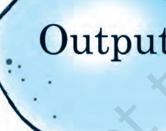

*A Firm Effort*

# Production and Costs

In the previous chapter, we have discussed the behaviour of the consumers. In this chapter as well as in the next, we shall examine the behaviour of a producer. Production is the process by which inputs are transformed into 'output'. Production is carried out by producers or firms. A firm acquires different inputs like labour, machines, land, raw materials etc. It uses these inputs to produce output. This output can be consumed by consumers, or used by other firms for further production. For example, a tailor uses a sewing machine, cloth, thread and his own labour to 'produce' shirts. A farmer uses his land, labour, a tractor, seed, fertilizer, water etc to produce wheat. A car manufacturer uses land for a factory, machinery, labour, and various other inputs (steel, aluminium, rubber etc) to produce cars. A rickshaw puller uses a rickshaw and his own labour to 'produce' rickshaw rides. A domestic helper uses her labour to produce 'cleaning services'.

We make certain simplifying assumptions to start with. Production is instantaneous: in our very simple model of production no

time elapses between the combination of the inputs and the production of the output. We also tend to use the terms production and supply synonymously and often interchangeably.

In order to acquire inputs a firm has to pay for them. This is called the cost of production. Once output has been produced, the firm sell it in the market and earns revenue. The difference between the revenue and cost is called the firm's profit. We assume that the objective of a firm is to earn the maximum profit that it can.

In this chapter, we discuss the relationship between inputs and output. Then we look at the cost structure of the firm. We do this to be able to identifiy the output at which firms profits are maximum.

## 3.1 PRODUCTION FUNCTION

The production function of a firm is a relationship between inputs used and output produced by the firm. For various quantities of inputs used, it gives the maximum quantity of output that can be produced.

Consider the farmer we mentioned above. For simplicity, we assume that the farmer uses only two inputs to produce wheat: land and labour. A production function tells us the maximum amount of wheat he can produce for a given amount of land that he uses, and a given number of hours of labour that he performs. Suppose that he uses 2 hours of labour/ day and 1 hectare of land to produce a maximum of 2 tonnes of wheat. Then, a function that describes this relation is called a production function.

One possible example of the form this could take is:

q = K × L,

Where, q is the amount of wheat produced, K is the area of land in hectares, L is the number of hours of work done in a day.

Describing a production function in this manner tells us the exact relation between inputs and output. If either K or L increase, q will also increase. For any L and any K, there will be only one q. Since by definition we are taking the maximum output for any level of inputs, a production function deals only with the efficient use of inputs. Efficiency implies that it is not possible to get any more output from the same level of inputs.

A production function is defined for a given technology. It is the technological knowledge that determines the maximum levels of output that can be produced using different combinations of inputs. If the technology improves, the maximum levels of output obtainable for different input combinations increase. We then have a new production function.

The inputs that a firm uses in the production process are called factors of production. In order to produce output, a firm may require any number of different inputs. However, for the time being, here we consider a firm that produces output using only two factors of production – labour and capital. Our production function, therefore, tells us the maximum quantity of output (q) that can be produced by using different combinations of these two factors of productions-Labour (L) and Capital (K).

We may write the production function as

*q* = *f*(*L*,K) (3.1)

where, L is labour and K is capital and q is the maximum output that can be produced.

37

Production and Costs

| Factor |  |  |  |  | Capital |  |  |  |
| --- | --- | --- | --- | --- | --- | --- | --- | --- |
|  |  | 0 | 1 | 2 | 3 | 4 | 5 | 6 |
|  | 0 | 0 | 0 | 0 | 0 | 0 | 0 | 0 |
|  | 1 | 0 | 1 | 3 | 7 | 10 | 12 | 13 |
|  | 2 | 0 | 3 | 10 | 18 | 24 | 29 | 33 |
| Labour | 3 | 0 | 7 | 18 | 30 | 40 | 46 | 50 |
|  | 4 | 0 | 10 | 24 | 40 | 50 | 56 | 57 |
|  | 5 | 0 | 12 | 29 | 46 | 56 | 58 | 59 |
|  | 6 | 0 | 13 | 33 | 50 | 57 | 59 | 60 |

Table 3.1: Production Function

A numerical example of production function is given in Table 3.1. The left column shows the amount of labour and the top row shows the amount of capital. As we move to the right along any row, capital increases and as we move down along any column, labour increases. For different values of the two factors,

#### Isoquant

In Chapter 2, we have learnt about indifference curves. Here, we introduce a similar concept known as isoquant. It is just an alternative way of representing the production function. Consider a production function with

two inputs labour and capital. An isoquant is the set of all possible combinations of the two inputs that yield the same maximum possible level of output. Each isoquant represents a particular level of output and is labelled with that amount of output.

Let us return to table 3.1 notice that the output of 10 units can be produced in 3 ways (4L, 1K), (2L, 2K), (1L, 4K). All these combination of L, K lie on the

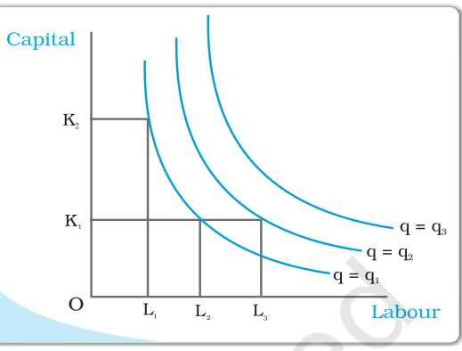

same isoquant, which represents the level of output 10. Can you identify the sets of inputs that will lie on the isoquant q = 50?

The diagram here generalizes this concept. We place L on the X axis and K on the Y axis. We have three isoquants for the three output levels, namely *q* = *q*1 , *q* = *q*2 and *q* = *q*3 . Two input combinations (L1 , K2 ) and (L2 , K1 ) give us the same level of output *q*1 . If we fix capital at K1 and increase labour to L3 , output increases and we reach a higher isoquant, *q* = *q*2 . When marginal products are positive, with greater amount of one input, the same level of output can be produced only using lesser amount of the other. Therefore, isoquants are negatively sloped.

the table shows the corresponding output levels. For example, with 1 unit of labour and 1 unit of capital, the firm can produce at most 1 unit of output; with 2 units of labour and 2 units of capital, it can produce at most 10 units of output; with 3 units of labour and 2 units of capital, it can produce at most 18 units of output and so on.

In our example, both the inputs are necessary for the production. If any of the inputs becomes zero, there will be no production. With both inputs positive, output will be positive. As we increase the amount of any input, output increases.

## 3.2 THE SHORT RUN AND THE LONG RUN

Before we begin with any further analysis, it is important to discuss two concepts– the short run and the long run.

In the short run, at least one of the factor – labour or capital – cannot be varied, and therefore, remains fixed. In order to vary the output level, the firm can vary only the other factor. The factor that remains fixed is called the fixed factor whereas the other factor which the firm can vary is called the variable factor.

Consider the example represented through Table 3.1. Suppose, in the short run, capital remains fixed at 4 units. Then the corresponding column shows the different levels of output that the firm may produce using different quantities of labour in the short run.

In the long run, all factors of production can be varied. A firm in order to produce different levels of output in the long run may vary both the inputs simultaneously. So, in the long run, there is no fixed factor.

For any particular production process, long run generally refers to a longer time period than the short run. For different production processes, the long run periods may be different. It is not advisable to define short run and long run in terms of say, days, months or years. We define a period as long run or short run simply by looking at whether all the inputs can be varied or not.

## 3.3 TOTAL PRODUCT, AVERAGE PRODUCT AND MARGINAL PRODUCT

## 3.3.1 Total Product

Suppose we vary a single input and keep all other inputs constant. Then for different levels of that input, we get different levels of output. This relationship between the variable input and output, keeping all other inputs constant, is often referred to as Total Product (TP) of the variable input.

Let us again look at Table 3.1. Suppose capital is fixed at 4 units. Now in the Table 3.1, we look at the column where capital takes the value 4. As we move down along the column, we get the output values for different values of labour. This is the total product of labour schedule with *K*2 = 4. This is also sometimes called total return to or total physical product of the variable input. This is shown again in the second column of table in 3.2

Once we have defined total product, it will be useful to define the concepts of average product (AP) and marginal product (MP). They are useful in order to describe the contribution of the variable input to the production process.

### 3.3.2 Average Product

Average product is defined as the output per unit of variable input. We calculate it as

$\left(\begin{array}{c}\mbox{\small$\Delta$}P_{L}=\frac{TP_{L}}{L}\\ \mbox{\small$\Delta$}P_{L}=\frac{TP_{L}}{L}\end{array}\right)$

The last column of table 3.2 gives us a numerical example of average product of labour (with capital fixed at 4) for the production function described in table 3.1. Values in this column are obtained by dividing TP (column 2) by L (Column 1).

### 3.3.3 Marginal Product

Marginal product of an input is defined as the change in output per unit of change in the input when all other inputs are held constant. When capital is held constant, the marginal product of labour is

$$\begin{array}{c}{{M P_{L}=\frac{C h a n g e\,i n\,o u t p u t}{C h a n g e\,i n\,p u t}}}\\ {{.}}\\ {{=\frac{\Delta T P_{L}}{\Delta L}}}\end{array}$$

(3.3)

39

Production and Costs

where ∆ represents the change of the variable.

The third column of table 3.2 gives us a numerical example of Marginal Product of labour (with capital fixed at 4) for the production function described in table 3.1. Values in this column are obtained by dividing change in TP by

change in L. For example, when L changes from 1 to 2, TP changes from 10 to 24.

MP${}_{\rm L}$= (TP at $L$ units) - (TP at $L$ - 1 unit) (3.4)

Here, Change in TP = 24 -10 = 14

Change in L = 1

Marginal product of the 2nd unit of labour = 14/1 = 14

Since inputs cannot take negative values, marginal product is undefined at zero level of input employment. For any level of an input, the sum of marginal products of every preceeding unit of that input gives the total product. So total product is the sum of marginal products.

| Labour | TP | MPL | APL |
| --- | --- | --- | --- |
| 0 | 0 | - | - |
| 1 | 10 | 10 | 10 |
| 2 | 24 | 14 | 12 |
| 3 | 40 | 16 | 13.33 |
| 4 | 50 | 10 | 12.5 |
| 5 | 56 | 6 | 11.2 |
| 6 | 57 | 1 | 9.5 |

Table 3.2: Total Product, Marginal product and Average product

Average product of an input at any level of employment is the average of all marginal products up to that level. Average and marginal products are often referred to as average and marginal returns, respectively, to the variable input.

## 3.4 THE LAW OF DIMINISHING MARGINAL PRODUCT AND THE LAW OF VARIABLE PROPORTIONS

If we plot the data in table 3.2 on graph paper, placing labour on the X-axis and output on the Y-axis, we get the curves shown in the diagram below. Let us examine what is happening to TP. Notice that TP increases as labour input increases. But the rate at which it increases is not constant. An increase in labour from 1 to 2 increases TP by 10 units. An increase in labour from 2 to 3 increases TP by 12. The rate at which TP increases, as explained above, is shown by the MP. Notice that the MP first increases (upto 3 units of labour) and then begins to

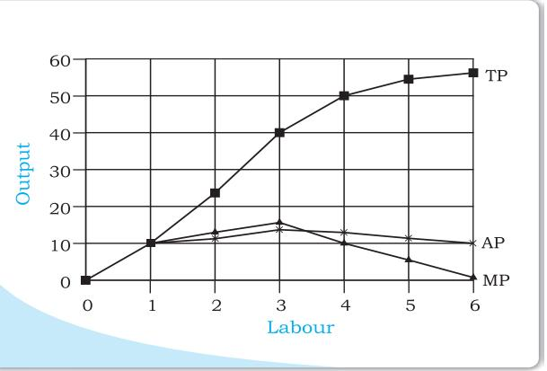

fall. This tendency of the MP to first increase and then fall is called the law of variable proportions or the law of diminishing marginal product. Law of variable proportions say that the marginal product of a factor input initially rises with its employment level. But after reaching a certain level of employment, it starts falling.

Why does this happen? In order to understand this, we first define the concept of factor proportions. Factor proportions represent the ratio in which the two inputs are combined to produce output.

As we hold one factor fixed and keep increasing the other, the factor proportions change. Initially, as we increase the amount of the variable input, the factor proportions become more and more suitable for the production and marginal product increases. But after a certain level of employment, the production process becomes too crowded with the variable input.

Suppose table 3.2 describes the output of a farmer who has 4 hectares of land, and can choose how much labour he wants to use. If he uses only 1 worker, he has too much land for the worker to cultivate alone. As he increases the number of workers, the amount of labour per unit land increases, and each worker adds proportionally more and more to the total output. Marginal product increases in this phase. When the fourth worker is hired, the land begins to get 'crowded'. Each worker now has insufficient land to work efficiently. So the output added by each additional worker is now proportionally less. The marginal product begins to fall.

We can use these observations to describe the general shapes of the TP, MP and AP curves as below.

## 3.5 SHAPES OF TOTAL PRODUCT, MARGINAL PRODUCT AND AVERAGE PRODUCT CURVES

An increase in the amount of one of the inputs keeping all other inputs constant results in an increase in output. Table 3.2 shows how the total product changes as the amount of labour increases. The total product curve in the input-output plane is a positively sloped curve. Figure 3.1 shows the shape of the total product curve for a typical firm.

We measure units of labour along the horizontal axis and output along the vertical axis. With *L* units of labour, the firm can at most produce *q*1 units of output.

According to the law of variable proportions, the marginal product of an input initially rises and then after a certain level of employment, it starts falling. The MP curve therefore, looks like an inverse 'U'-shaped curve as in figure 3.2.

Let us now see what the AP curve looks like. For the first unit of the variable input, one can easily check that the MP and the

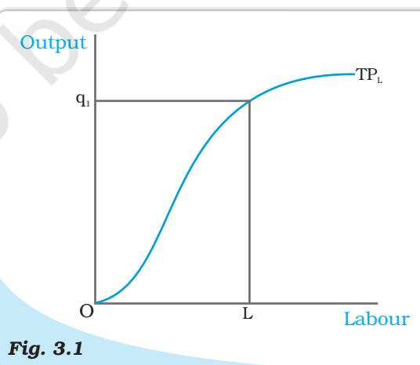

*Total Product. This is a total product curve for labour. When all other inputs are held constant, it shows the different output levels obtainable from different units of labour.*

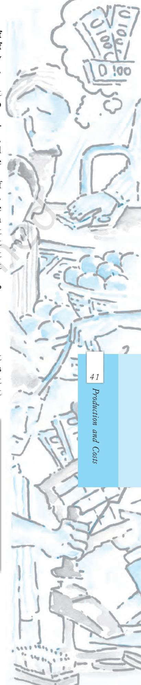

AP are same. Now as we increase the amount of input, the MP rises. AP being the average of marginal products, also rises, but rises less than MP. Then, after a point, the MP starts falling. However, as long as the value of MP remains higher than the value of the AP, the AP continues to rise. Once MP has fallen sufficiently, its value becomes less than the AP and the AP also starts falling. So AP curve is also inverse 'U'-shaped.

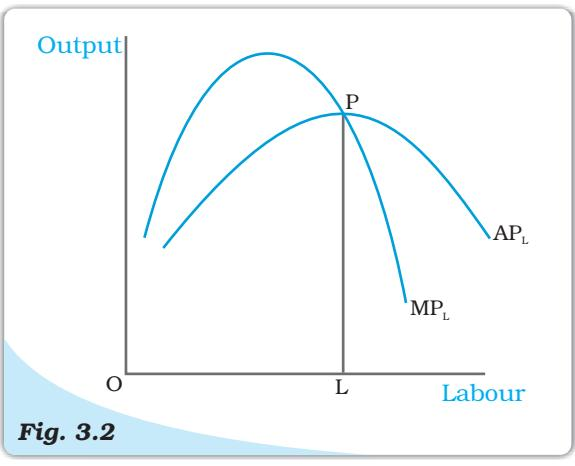

As long as the AP increases, it must be the case that MP is greater than AP. Otherwise, AP cannot rise.

*Average and Marginal Product. These are average and marginal product curves of labour.*

Similarly, when AP falls, MP has to be less than AP. It, follows that MP curve cuts AP curve from above at its maximum.

Figure 3.2 shows the shapes of AP and MP curves for a typical firm.

The AP of factor 1 is maximum at *L*. To the left of *L*, AP is rising and MP is greater than AP. To the right of *L*, AP is falling and MP is less than AP.

## 3.6 RETURNS TO SCALE

The law of variable proportions arises because factor proportions change as long as one factor is held constant and the other is increased. What if both factors can change? Remember that this can happen only in the long run. One special case in the long run occurs when both factors are increased by the *same proportion*, or factors are scaled up.

When a proportional increase in all inputs results in an increase in output by the same proportion, the production function is said to display Constant returns to scale (CRS).

When a proportional increase in all inputs results in an increase in output by a larger proportion, the production function is said to display Increasing Returns to Scale (IRS)

Decreasing Returns to Scale (DRS) holds when a proportional increase in all inputs results in an increase in output by a smaller proportion.

For example, suppose in a production process, all inputs get doubled. As a result, if the output gets doubled, the production function exhibits CRS. If output is less than doubled, then DRS holds, and if it is more than doubled, then IRS holds.

Returns to Scale

Consider a production function

*q* = *f* (*x*1 *, x*2 )

where the firm produces *q* amount of output using *x*1 amount of factor 1 and *x*2 amount of factor 2. Now suppose the firm decides to increase the employment level of both the factors *t* (*t >* 1) times. Mathematically, we can say that the production function exhibits constant returns to scale if we have,

> *f* (*tx*1 *, tx*2 ) = *t.f* (*x*1 *, x*2 )

ie the new output level *f* (*tx*1 *, tx*2 ) is exactly *t* times the previous output level *f* (*x*1 *, x*2 ).

Similarly, the production function exhibits increasing returns to scale if,

*f* (*tx*1 *, tx*2 ) *> t.f* (*x*1 *, x*2 )*.*

It exhibits decreasing returns to scale if,

*f* (*tx*1 *, tx*2 ) *< t.f* (*x*1 *, x*2 )*.*

# 3.7 COSTS

In order to produce output, the firm needs to employ inputs. But a given level of output, typically, can be produced in many ways. There can be more than one input combinations with which a firm can produce a desired level of output. In Table 3.1, we can see that 50 units of output can be produced by three different input combinations (*L* = 6, *K* = 3), (*L* = 4, *K* = 4) and (*L* = 3, *K* = 6). The question is which input combination will the firm choose? With the input prices given, it will choose that combination of inputs which is least expensive. So, for every level of output, the firm chooses the least cost input combination. Thus the cost function describes the least cost of producing each level of output given prices of factors of production and technology.

Cobb-Douglas Production Function

Consider a production function

$$q={\chi_{_1}}^{\alpha}{\chi_{_2}}^{\beta}$$

where α and β are constants. The firm produces *q* amount of output using *x*1 amount of factor 1 and *x*2 amount of factor 2. This is called a Cobb-Douglas production function. Suppose with *x*1 = *x*1 and *x*2 = *x* 2 *,* we have *q*0 units of output, i.e.

$$q_{0}={\dot{\overline{{X}}}}_{1}{}^{\alpha}{\dot{\overline{{X}}}}_{2}{}^{\beta}$$

If we increase both the inputs *t* (*t >* 1) times, we get the new output

$$\begin{array}{c}{{q_{1}=(t\,\overline{{{x}}}_{1})^{\alpha}(t\,\overline{{{x}}}_{2}\,)^{\beta}}}\\ {{=t^{\alpha\,*\,\beta}\,\,\overline{{{x}}}_{1}\,^{\alpha}\,\,\overline{{{x}}}_{2}\,^{\beta}}}\end{array}$$

When α + β = 1, we have *q*1 = *tq*0 . That is, the output increases *t* times. So the production function exhibits CRS. Similarly, when α + β *>* 1, the production function exhibits IRS. When α + β *<* 1 the production function exhibits DRS.

## 3.7.1 Short Run Costs

We have previously discussed the short run and the long run. In the short run, some of the factors of production cannot be varied, and therefore, remain fixed. The cost that a firm incurs to employ these fixed inputs is called the total fixed cost (TFC). Whatever amount of output the firm

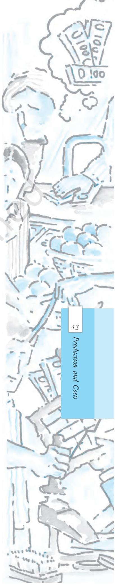

produces, this cost remains fixed for the firm. To produce any required level of output, the firm, in the short run, can adjust only variable inputs. Accordingly, the cost that a firm incurs to employ these variable inputs is called the total variable cost (TVC). Adding the fixed and the variable costs, we get the total cost (TC) of a firm

TC = TVC + TFC

In order to increase the production of output, the firm must employ more of the variable inputs. As a result, total variable cost and total cost will increase. Therefore, as output increases, total variable cost and total cost increase.

In Table 3.3, we have an example of cost function of a typical firm. The first column shows different levels of output. For all levels of output, the total fixed cost is Rs 20. Total variable cost increases as output increases. With output zero, TVC is zero. For 1 unit of output, TVC is Rs 10; for 2 units of output, TVC is Rs 18 and so on. In the fourth column, we obtain the total cost (TC) as the sum of the corresponding values in second column (TFC) and third column (TVC). At zero level of output, TC is just the fixed cost, and hence, equal to Rs 20. For 1 unit of output, total cost is Rs 30; for 2 units of output, the TC is Rs 38 and so on.

The short run average cost (SAC) incurred by the firm is defined as the total cost per unit of output. We calculate it as

$\begin{array}{c}\mbox{\rm SAC}=\frac{TC}{q}\end{array}$ (3.7)

In Table 3.3, we get the SAC-column by dividing the values of the fourth column by the corresponding values of the first column. At zero output, SAC is undefined. For the first unit, SAC is Rs 30; for 2 units of output, SAC is Rs 19 and so on.

Similarly, the average variable cost (AVC) is defined as the total variable cost per unit of output. We calculate it as

*AVC* = *TVC q* (3.8)

Also, average fixed cost (AFC) is

$\begin{array}{l}\mbox{\rm{\small$AFC=\frac{TFC}{q}$}}\\ \mbox{\rm{\small$q$}}\end{array}$ (3.9)

Clearly,

$\mathbf{S}AC=AVC+AFC$ (3.10)

In Table 3.3, we get the AFC-column by dividing the values of the second column by the corresponding values of the first column. Similarly, we get the AVC-column by dividing the values of the third column by the corresponding values of the first column. At zero level of output, both AFC and AVC are undefined. For the first unit of output, AFC is Rs 20 and AVC is Rs 10. Adding them, we get the SAC equal to Rs 30.

The short run marginal cost (SMC) is defined as the change in total cost per unit of change in output

$$\text{SMC}=\frac{\text{change in total cost}t}{\text{change in output}}=\frac{\Delta\text{TC}}{\Delta q}\tag{3.11}$$

where ∆ represents the change in the value of the variable.

The last column in table 3.3 gives a numerical example for the calculation of SMC. Values in this column are obtained by dividing the change in TC by the change in output, at each level of output.

Thus at q=5, Change in TC = (TC at q=5) - (TC at q=4) (3.12) = (53) – (49) = 4

Change in q = 1 SMC = 4/1 = 4

| Output | TFC | TVC | TC | AFC | AVC | SAC | SMC |
| --- | --- | --- | --- | --- | --- | --- | --- |
| (units) (q) | (Rs) | (Rs) | (Rs) | (Rs) | (Rs) | (Rs) | (Rs) |
| 0 | 20 | 0 | 20 | – | – | – | – |
| 1 | 20 | 10 | 30 | 20 | 10 | 30 | 10 |
| 2 | 20 | 18 | 38 | 10 | 9 | 19 | 8 |
| 3 | 20 | 24 | 44 | 6.67 | 8 | 14.67 | 6 |
| 4 | 20 | 29 | 49 | 5 | 7.25 | 12.25 | 5 |
| 5 | 20 | 33 | 53 | 4 | 6.6 | 10.6 | 4 |
| 6 | 20 | 39 | 59 | 3.33 | 6.5 | 9.83 | 6 |
| 7 | 20 | 47 | 67 | 2.86 | 6.7 | 9.57 | 8 |
| 8 | 20 | 60 | 80 | 2.5 | 7.5 | 10 | 13 |
| 9 | 20 | 75 | 95 | 2.22 | 8.33 | 10.55 | 15 |
| 10 | 20 | 95 | 115 | 2 | 9.5 | 11.5 | 20 |

Table 3.3: Various Concepts of Costs

Just like the case of marginal product, marginal cost also is undefined at zero level of output. It is important to note here that in the short run, fixed cost cannot be changed. When we change the level of output, whatever change occurs to total cost is entirely due to the change in total variable cost. So in the short run, marginal cost is the increase in TVC due to increase in production of one extra unit of output. For any level of output, the sum of marginal costs up to that level gives us the total variable cost at that level. One may wish to check this

from the example represented through Table 3.3. Average variable cost at some level of output is therefore, the average of all marginal costs up to that level. In Table 3.3, we see that when the output is zero, SMC is undefined. For the first unit of output, SMC is Rs 10; for the second unit, the SMC is Rs 8 and so on.

### *Shapes of the Short Run Cost Curves*

Now let us see what these short run cost curves look like. You could plot the data from in table 3.3 by placing output on the x-axis and costs on the y-axis.

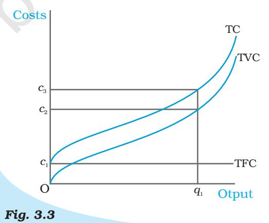

*Costs. These are total fixed cost (TFC), total variable cost (TVC) and total cost (TC) curves for a firm. Total cost is the vertical sum of total fixed cost and total variable cost.*

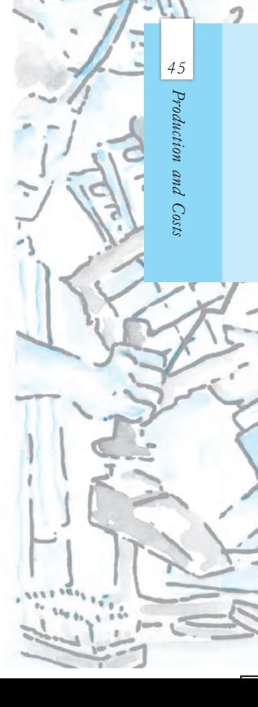

Previously, we have discussed that in order to increase the production of output the firm needs to employ more of the variable inputs. This results in an increase in total variable cost, and hence, an increase in total cost. Therefore, as output increases, total variable cost and total cost increase. Total fixed cost, however, is independent of the amount of output produced and remains constant for all levels of production.

Figure 3.3 illustrates the shapes of total fixed cost, total variable cost and total cost curves for a typical firm. We place output on the x-axis and costs on the y-axis. TFC is a constant which takes the value *c*1

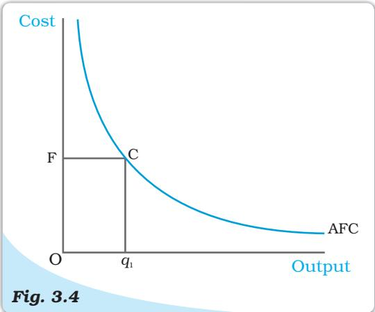

*Average Fixed Cost. The average fixed cost curve is a rectangular hyperbola. The area of the rectangle* OFC*q1 gives us the total fixed cost.*

and does not change with the change in output. It is, therefore, a horizontal straight line cutting the cost axis at the point *c*1 . At *q*1 , TVC is *c*2 and TC is *c*3 .

AFC is the ratio of TFC to *q*. TFC is a constant. Therefore, as *q* increases, AFC decreases. When output is very close to zero, AFC is arbitrarily large, and as output moves towards infinity, AFC moves towards zero. AFC curve is, in fact, a rectangular hyperbola. If we multiply any value *q* of output with its corresponding AFC, we always get a constant, namely TFC.

Figure 3.4 shows the shape of average fixed cost curve for a typical firm. We measure output along the horizontal axis and AFC along the vertical axis. At *q*1 level of output, we get the corresponding average fixed cost at *F*. The TFC can be calculated as

TFC = AFC x quantity = OF x $Oq_{1}$ = the area of the rectangle OFCq${}_{1}$

We can also calculate AFC from TFC curve. In Figure 3.5, the horizontal straight line cutting the vertical axis at *F* is the TFC curve. At *q*0 level of output, total fixed cost is equal to *OF*. At *q*0 , the corresponding point on the TFC curve is *A*. Let the angle ∠*AOq*0 be θ. The AFC at *q*0 is

*AFC* = *TFC quantity* = 0 0 *Aq Oq* = tanθ

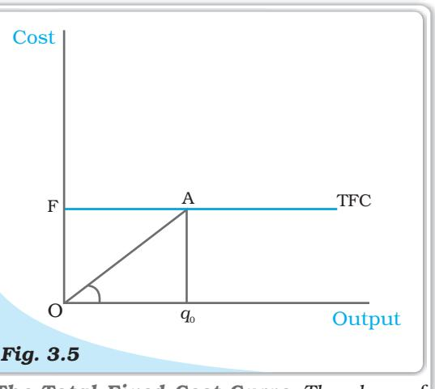

*The Total Fixed Cost Curve. The slope of the angle* ∠AOq*0 gives us the average fixed cost at* q*0 .*

Let us now look at the SMC curve. Marginal cost is the additional cost that a firm incurs to produce one extra unit of output. According to the law of variable proportions, initially, the marginal product of a factor increases as employment increases, and then after a certain point, it decreases. This means initially to produce every extra unit of output, the requirement of the factor becomes less and less, and then after a certain point, it becomes greater and greater. As a result, with the factor price given, initially the SMC falls, and then after a certain point, it rises. SMC curve is, therefore, 'U'-shaped.

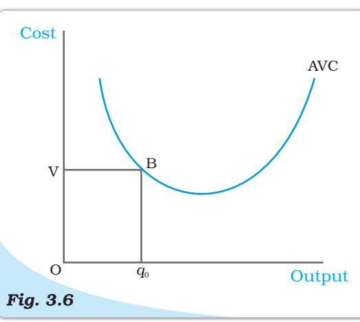

*The Average Variable Cost Curve. The area of the rectangle OVBq0 gives us the total variable cost at q0 .*

At zero level of output, SMC is undefined. The TVC at a particular level of output is given by the area under the SMC curve up to that level.

Now, what does the AVC curve look like? For the first unit of output, it is easy to check that SMC and AVC are the same. So both SMC and AVC curves start from the same point. Then, as output increases, SMC falls. AVC being the average of marginal costs, also falls, but falls less than SMC. Then, after a point, SMC starts rising. AVC, however, continues to fall as long as the value of SMC remains less than the prevailing value of AVC. Once the SMC has risen sufficiently, its value becomes greater than the value of AVC. The AVC then starts rising. The AVC curve is therefore 'U'-shaped.

As long as AVC is falling, SMC must be less than the AVC. As AVC rises, SMC must be greater than the AVC. So the SMC curve cuts the AVC curve from below at the minimum point of AVC.

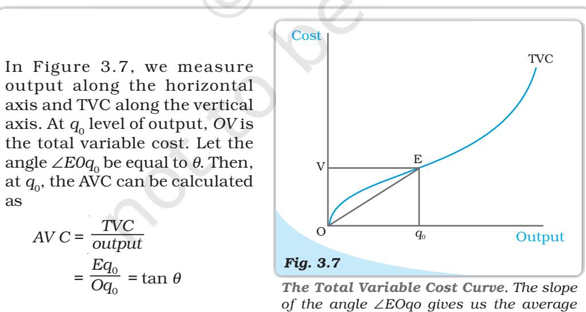

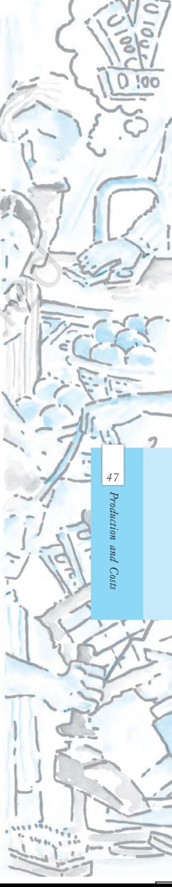

*variable cost at qo.*

In Figure 3.6 we measure output along the horizontal axis and AVC along the vertical axis. At *q*0 level of output, AVC is equal to *OV* . The total variable cost at *q*0 is

- *TVC* = *AVC ×* quantity
	- = *OV × Oq*0
	- = the area of the rectangle *OV Bq*0

*.*

Let us now look at SAC. SAC is the sum of AVC and AFC. Initially, both AVC and AFC decrease as output increases. Therefore, SAC initially falls. After a certain level of output production, AVC starts rising, but AFC continuous to fall. Initially the fall in AFC is greater than the rise in AVC and SAC is still falling. But, after a certain level of production, rise in AVC becomes larger than the fall in AFC. From this point onwards, SAC is rising. SAC curve is therefore 'U'-shaped.

It lies above the AVC curve with the vertical difference being equal to the value of AFC. The minimum point of SAC curve lies to the right of the minimum point of AVC curve.

Similar to the case of AVC and SMC, as long as SAC is falling, SMC is less than the SAC. When SAC is rising, SMC is greater than the SAC. SMC curve cuts the SAC curve from below at the minimum point of SAC.

Figure 3.8 shows the shapes of

short run marginal cost, average variable cost and short run average cost curves for a typical firm. AVC reaches its minimum at *q*1 units of output. To the left of *q*1 , AVC is falling and SMC is less than AVC. To the right of *q*1 , AVC is rising and SMC is greater than AVC. SMC curve cuts the AVC curve at '*P* ' which is the minimum point of AVC curve. The minimum point of SAC curve is '*S*' which corresponds to the output *q*2 . It is the intersection point between SMC and SAC curves. To the left of *q*2 , SAC is falling and SMC is less than SAC. To the right of *q*2 , SAC is rising and SMC is greater than SAC.

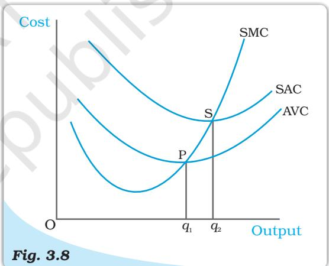

*Short Run Costs. Short run marginal cost, average variable cost and average cost curves.*

#### 3.7.2 Long Run Costs

48

Introductory

Microeconomics

In the long run, all inputs are variable. There are no fixed costs. The total cost and the total variable cost therefore, coincide in the long run. Long run average cost (LRAC) is defined as cost per unit of output, i.e.

$L$RAC = $\frac{TC}{q}$ (3.13)

Long run marginal cost (LRMC) is the change in total cost per unit of change in output. When output changes in discrete units, then, if we increase production from *q*1 –1 to *q*1 units of output, the marginal cost of producing *q*1 th unit will be measured as

LRMC = (TC at $q_{1}$ units) - (TC at $q_{1}$ - 1 units) (3.14)

Just like the short run, in the long run, the sum of all marginal costs up to some output level gives us the total cost at that level.

#### *Shapes of the Long Run Cost Curves*

We have previously discussed the returns to scales. Now let us see their implications for the shape of LRAC.

IRS implies that if we increase all the inputs by a certain proportion, output increases by more than that proportion. In other words, to increase output by a certain proportion, inputs need to be increased by less than that proportion. With the input prices given, cost also increases by a lesser proportion. For example, suppose we want to double the output. To do that, inputs need to be increased, but less than double. The cost that the firm incurs to hire those inputs therefore also need to be increased by less than double. What is happening to the average cost here? It must be the case that as long as IRS operates, average cost falls as the firm increases output.

DRS implies that if we want to increase the output by a certain proportion, inputs need to be increased by more than that proportion. As a result, cost also increases by more than that proportion. So, as long as DRS operates, the average cost must be rising as the firm increases output.

CRS implies a proportional increase in inputs resulting in a proportional increase in output. So the average cost remains constant as long as CRS operates.

It is argued that in a typical firm IRS is observed at the initial level of production. This is then followed by the CRS and then by the DRS. Accordingly, the LRAC curve is a 'U'-shaped curve. Its downward sloping part corresponds to IRS and upward rising part corresponds to DRS. At the minimum point of the LRAC curve, CRS is observed.

Let us check how the LRMC curve looks like. For the first unit of output, both LRMC and LRAC are the same. Then, as output increases, LRAC initially falls, and then, after a certain point, it rises. As long as average cost is falling,

marginal cost must be less than the average cost. When the average cost is rising, marginal cost must be greater than the average cost. LRMC curve is therefore a 'U'-shaped curve. It cuts the LRAC curve from below at the minimum point of the LRAC. Figure 3.9 shows the shapes of the long run marginal cost and the long run average cost curves for a typical firm.

LRAC reaches its minimum at *q*1 . To the left of *q*1 , LRAC is falling and LRMC is less than the LRAC curve. To the right of *q*1 , LRAC is rising and LRMC is higher than LRAC.

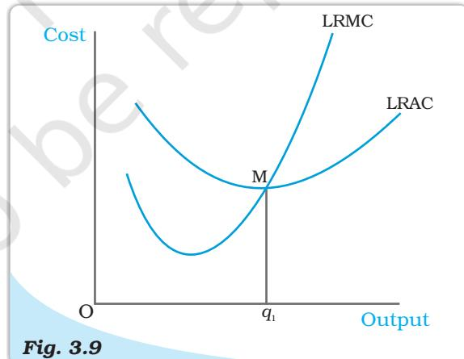

*Long Run Costs. Long run marginal cost and average cost curves.*

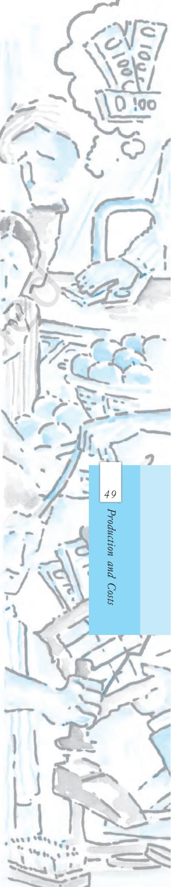

- *•* For different combinations of inputs, the production function shows the maximum quantity of output that can be produced.
- *•* In the short run, some inputs cannot be varied. In the long run, all inputs can be varied.
- *•* Total product is the relationship between a variable input and output when all other inputs are held constant.
- *•* For any level of employment of an input, the sum of marginal products of every unit of that input up to that level gives the total product of that input at that employment level.
- *•* Both the marginal product and the average product curves are inverse 'U'-shaped. The marginal product curve cuts the average product curve from above at the maximum point of average product curve.
- *•* In order to produce output, the firm chooses least cost input combinations.
- *•* Total cost is the sum of total variable cost and the total fixed cost.
- *•* Average cost is the sum of average variable cost and average fixed cost.
- *•* Average fixed cost curve is downward sloping.
- *•* Short run marginal cost, average variable cost and short run average cost curves are 'U'-shaped.
- *•* SMC curve cuts the AVC curve from below at the minimum point of AVC.
- *•* SMC curve cuts the SAC curve from below at the minimum point of SAC.
- *•* In the short run, for any level of output, sum of marginal costs up to that level gives us the total variable cost. The area under the SMC curve up to any level of output gives us the total variable cost up to that level.
- *•* Both LRAC and LRMC curves are 'U' shaped.
- *•* LRMC curve cuts the LRAC curve from below at the minimum point of LRAC.

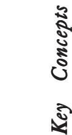

Exercises

ExercisesExercises

50

Introductory

Microeconomics

Production function Short run Long run Total product Marginal product Average product Law of diminishing marginal product Law of variable proportions

Returns to scale Cost function Marginal cost, Average cost

1. Explain the concept of a production function.

- 2. What is the total product of an input?
- 3. What is the average product of an input?
	- 4. What is the marginal product of an input?
	- 5. Explain the relationship between the marginal products and the total product of an input.
	- 6. Explain the concepts of the short run and the long run.
	- 7. What is the law of diminishing marginal product?
	- 8. What is the law of variable proportions?
	- 9. When does a production function satisfy constant returns to scale?
- 10. When does a production function satisfy increasing returns to scale?

- 11. When does a production function satisfy decreasing returns to scale?
- 12. Briefly explain the concept of the cost function.
- 13. What are the total fixed cost, total variable cost and total cost of a firm? How are they related?
- 14. What are the average fixed cost, average variable cost and average cost of a firm? How are they related?
- 15. Can there be some fixed cost in the long run? If not, why?
- 16. What does the average fixed cost curve look like? Why does it look so?
- 17. What do the short run marginal cost, average variable cost and short run average cost curves look like?
- 18. Why does the SMC curve cut the AVC curve at the minimum point of the AVC curve?
- 19. At which point does the SMC curve cut the SAC curve? Give reason in support of your answer.
- 20. Why is the short run marginal cost curve 'U'-shaped?
- 21. What do the long run marginal cost and the average cost curves look like?
- 22. The following table gives the total product schedule of labour. Find the corresponding average product and marginal product schedules of labour.

| TPL | 0 | 15 | 35 | 50 | 40 | 48 |
| --- | --- | --- | --- | --- | --- | --- |
| L | 0 | 1 | 2 | 3 | 4 | 5 |

- 23. The following table gives the average product schedule of labour. Find the total product and marginal product schedules. It is given that the total product is zero at zero level of labour employment.

| L | APL |
| --- | --- |
| 1 | 2 |
| 2 | 3 |
| 3 | 4 |
| 4 | 4.25 |
| 5 | 4 |
| 6 | 3.5 |

- 24. The following table gives the marginal product schedule of labour. It is also given that total product of labour is zero at zero level of employment. Calculate the total and average product schedules of labour.

|  | 5 3 | 4 5 | 3 7 | 2 5 | 1 3 | L MPL |
| --- | --- | --- | --- | --- | --- | --- |
| 6 1 |  |  |  |  |  |  |

- 25. The following table shows the total cost schedule of a firm. What is the total fixed cost schedule of this firm? Calculate the TVC, AFC, AVC, SAC and SMC schedules of the firm.

|
|  |

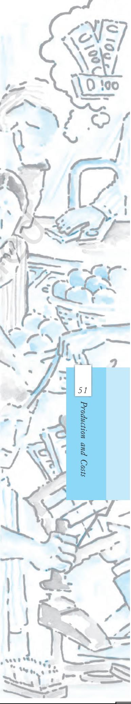

- 26. The following table gives the total cost schedule of a firm. It is also given that the average fixed cost at 4 units of output is Rs 5. Find the TVC, TFC, AVC, AFC, SAC and SMC schedules of the firm for the corresponding values of output.

| 6 | 5 | 4 | 3 | 2 | 1 | Q |
| --- | --- | --- | --- | --- | --- | --- |
| 185 | 130 | 95 | 75 | 65 | 50 | TC |

- 27. A firm's SMC schedule is shown in the following table. The total fixed cost of the firm is Rs 100. Find the TVC, TC, AVC and SAC schedules of the firm.

| Q | TC |
| --- | --- |
| 0 | - |
| 1 | 500 |
| 2 | 300 |
| 3 | 200 |
| 4 | 300 |
| 5 | 500 |
| 6 | 800 |

28. Let the production function of a firm be

$$Q=5\,L^{\frac{1}{2}}\ K^{\frac{1}{2}}$$

Find out the maximum possible output that the firm can produce with 100 units of *L* and 100 units of *K*.

- 29. Let the production function of a firm be
*Q* = 2*L* 2*K*2

Find out the maximum possible output that the firm can produce with 5 units of *L* and 2 units of *K*. What is the maximum possible output that the firm can produce with zero unit of *L* and 10 units of *K*?

- 30. Find out the maximum possible output for a firm with zero unit of *L* and 10 units of *K* when its production function is

$$Q=5L+2K$$

