#### The Theor The TheorThe Theory of the F y of the Fy of the Firm under P under Perfect Competition

In the previous chapter, we studied concepts related to a firm's production function and cost curves. The focus of this chapter is different. Here we ask : how does a firm decide how much to produce? Our answer to this question is by no means simple or uncontroversial. We base our answer on a *critical*, if somewhat unreasonable, assumption about firm behaviour – a firm, we maintain, is a ruthless profit maximiser. So, the amount that a firm produces and sells in the market is that which maximises its profit. Here, we also assume that the firm sells whatever it produces so that 'output' and quantity sold are often used interchangebly.

The structure of this chapter is as follows. We first set up and examine in detail the profit maximisation problem of a firm. Then,0 we derive a firm's supply curve. The supply curve shows the levels of output that a firm chooses to produce at different market prices. Finally, we study how to aggregate the supply curves of individual firms and obtain the market supply curve.

# 4.1 PERFECT COMPETITION: DEFINING FEATURES

In order to analyse a firm's profit maximisation problem, we must first specify the market environment in which the firm functions. In this chapter, we study a market environment called perfect competition. A perfectly competitive market has the following defining features:

- 1. The market consists of a large number of buyers and sellers
- 2. Each firm produces and sells a homogenous product. i.e., the product of one firm cannot be differentiated from the product of any other firm.
- 3. Entry into the market as well as exit from the market are free for firms.
- 4. Information is perfect.

The existence of a large number of buyers and sellers means that each individual buyer and seller is very small compared to the size of the market. This means that no individual buyer or seller can influence the market by their size. Homogenous products further mean that the product of each firm is identical. So a buyer can choose to buy from any firm in the market, and she gets the same product. Free entry and exit mean that it is easy for firms to enter the market, as well as to leave it. This condition is essential

# Chapter 4

for the large numbers of firms to exist. If entry was difficult, or restricted, then the number of firms in the market could be small. Perfect information implies that all buyers and all sellers are completely informed about the price, quality and other relevant details about the product, as well as the market.

These features result in the single most distinguishing characteristic of perfect competition: price taking behaviour. From the viewpoint of a firm, what does price-taking entail? A price-taking firm believes that if it sets a price above the market price, it will be unable to sell any quantity of the good that it produces. On the other hand, should the set price be less than or equal to the market price, the firm can sell as many units of the good as it wants to sell. From the viewpoint of a buyer, what does price-taking entail? A buyer would obviously like to buy the good at the lowest possible price. However, a price-taking buyer believes that if she asks for a price below the market price, no firm will be willing to sell to her. On the other hand, should the price asked be greater than or equal to the market price, the buyer can obtain as many units of the good as she desires to buy.

Price-taking is often thought to be a reasonable assumption when the market has many firms and buyers have perfect information about the price prevailing in the market. Why? Let us start with a situation where each firm in the market charges the same (market) price. Suppose, now, that a certain firm raises its price above the market price. Observe that since all firms produce the same good and all buyers are aware of the market price, the firm in question loses all its buyers. Furthermore, as these buyers switch their purchases to other firms, no "adjustment" problems arise; their demand is readily accommodated when there are so many other firms in the market. Recall, now, that an individual firm's inability to sell any amount of the good at a price exceeding the market price is precisely what the price-taking assumption stipulates.

# 4.2 REVENUE

We have indicated that in a perfectly competitive market, a firm believes that it can sell as many units of the good as *it* wants by setting a price less than or equal to the market price. But, if this is the case, surely there is no reason to set a price lower than the market price. In other words, should the firm desire to sell some amount of the good, the price that it sets is exactly equal to the market price.

A firm earns revenue by selling the good that it produces in the market. Let the market price of a unit of the good be *p*. Let *q* be the quantity of the good produced, and therefore sold, by the firm at price *p*. Then, total revenue (TR) of the firm is defined as the market price of the good (*p*) multiplied by the firm's output (*q*). Hence,

*TR* = *p × q*

To make matters concrete, consider the following numerical example. Let the market for candles be perfectly competitive and let the market price of a box of

candles be Rs 10. For a candle manufacturer, Table 4.1 shows how total revenue is related to output. Notice that when no box is sold, TR is equal to zero; if one box of candles is sold, TR is equal to 1*×*Rs 10= Rs 10; if two boxes of candles are produced, TR is equal to 2 *×* Rs 10 = Rs 20; and so on.

We can depict how the total revenue changes as the quantity sold changes through a Total Revenue Curve. A total revenue curve plots Table 4.1: Total Revenue

| Boxes sold | TR (in Rs) |
| --- | --- |
| 0 | 0 |
| 1 | 10 |
| 2 | 20 |
| 3 | 30 |
| 4 | 40 |
| 5 | 50 |

the quantity sold or output on the X-axis and the Revenue earned on the Y-axis. Figure 4.1 shows the total revenue curve of a firm. Three observations are relevant here. First, when the output is zero, the total revenue of the firm is also zero. Therefore, the TR curve passes through point *O*. Second, the total revenue increases as the output goes up. Moreover, the equation '*TR* = *p × q*' is that of a straight line because *p* is constant. This means that the TR curve is an upward rising straight line. Third, consider the slope of this straight line. When the output is one unit (horizontal distance *Oq*1 in Figure 4.1), the total revenue (vertical height *Aq*1 in Figure 4.1) is *p ×* 1 = *p.* Therefore, the slope of the straight line is *Aq*1 */Oq*1 = *p*.

The average revenue ( AR ) of a firm is defined as total revenue per unit of output. Recall that if a firm's output is *q* and the market price is *p*, then TR equals *p × q*. Hence

*AR* = *TR q* = *p q q* × = *p*

In other words, for a price-taking firm, average revenue equals the market price.

Now consider Figure 4.2. Here, we plot the average revenue or market price (*y*-axis) for different values of a firm's output (*x*-axis). Since the market price is

fixed at *p*, we obtain a horizontal straight line that cuts the *y*-axis at a height equal to *p*. This horizontal straight line is called the price line. It is also the firm's AR curve under perfect competition The price line also depicts the demand curve facing a firm. Observe that the demand curve is perfectly elastic. This means that a firm can sell as many units of the good as it wants to sell at price *p*.

The marginal revenue (MR) of a firm is defined as the increase in total revenue for a unit increase in the firm's output. Consider table 4.1 again. Total revenue from the sale of 2 boxes of candles is Rs.20. Total revenue from the sale of 3 boxes of candles is Rs.30.

Marginal Revenue (MR) = $\dfrac{\text{Changein total revenue}}{\text{Changein quantity}}=\dfrac{30\cdot20}{3\cdot2}=10$

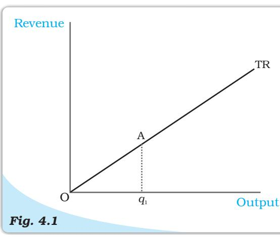

*Total Revenue curve. The total revenue curve of a firm shows the relationship between the total revenue that the firm earns and the output level of the firm. The slope of the curve, Aq1 /Oq1 , is the market price.*

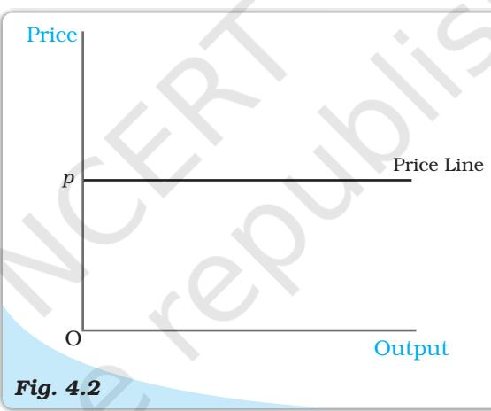

*Price Line. The price line shows the relationship between the market price and a firm's output level. The vertical height of the price line is equal to the market price, p.*

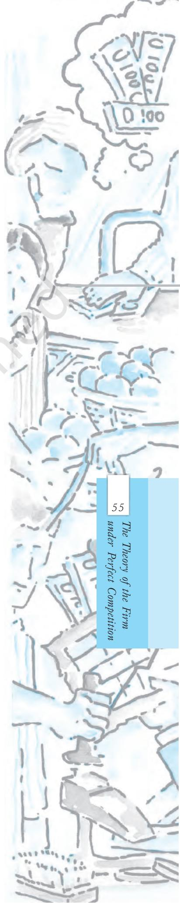

Is it a coincidence that this is the same as the price? Actually it is not. Consider the situation when the firm's output changes from q1 to q2 . Given the market price p,

MR = (pq2 –pq1 )/ (q2 –q1 ) = [p (q2 –q1 )]/ (q2 –q1 ) = p

Thus, for the perfectly competitive firm, MR=AR=p

In other words, for a price-taking firm, marginal revenue equals the market price.

Setting the algebra aside, the intuition for this result is quite simple. When a firm increases its output by one unit, this extra unit is sold at the market price. Hence, the firm's increase in total revenue from the one-unit output expansion – that is, MR – is precisely the market price.

# 4.3 PROFIT MAXIMISATION

A firm produces and sells a certain amount of a good. The firm's profit, denoted by π 1 , is defined to be the difference between its total revenue (TR) and its total cost of production (TC ). In other words

π = *TR – TC*

Clearly, the gap between TR and TC is the firm's earnings net of costs.

A firm wishes to maximise its profit. The firm would like to identify the quantity q0 at which its profits are maximum. By definition, then, at any quantity other than q0 , the firm's profits are less than at q0 . The critical question is: how do we identify q0 ?

For profits to be maximum, three conditions must hold at q0 :

- 1. The price, p, must equal MC
- 2. Marginal cost must be non-decreasing at q0
- 3. For the firm to continue to produce, in the short run, price must be greater than the average variable cost (p > AVC); in the long run, price must be greater than the average cost (p > AC).

### 4.3.1 Condition 1

Profits are the difference between total revenue and total cost. Both total revenue and total cost increase as output increases. Notice that as long as the change in total revenue is greater than the change in total cost, profits will continue to increase. Recall that change in total revenue per unit increase in output is the marginal revenue; and the change in total cost per unit increase in output is the marginal cost. Therefore, we can conclude that as long as marginal revenue is greater than marginal cost, profits are increasing. By the same logic, as long as marginal revenue is less than marginal cost, profits will fall. It follows that for profits to be maximum, marginal revenue should equal marginal cost.

In other words, profits are maximum at the level of output (which we have called q0 ) for which MR = MC

For the perfectly competitive firm, we have established that the MR = P. So the firm's profit maximizing output becomes the level of output at which P=MC.

#### 4.3.2 Condition 2

Consider the second condition that must hold when the profit-maximising output level is positive. Why is it the case that the marginal cost curve cannot slope

1 It is a convention in economics to denote profit with the Greek letter π .

downwards at the profitmaximising output level? To answer this question, refer once again to Figure 4.3. Note that at output levels q1 and q4 , the market price is equal to the marginal cost. However, at the output level q1 , the marginal cost curve is downward sloping. We claim that *q*1 cannot be a profit-maximising output level. Why?

Observe that for *all* output levels slightly to the left of *q*1 , the market price is lower than the marginal cost. But, the argument outlined in section 4.3.1 immediately implies that the firm's profit at an output level slightly smaller than *q*1 exceeds that corresponding to

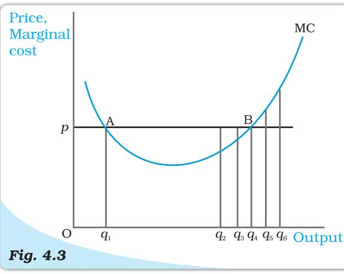

*Conditions 1 and 2 for profit maximisation. The figure is used to demonstrate that when the market price is p, the output level of a profitmaximising firm cannot be q1 (marginal cost curve, MC, is downward sloping), q2 and q3 (market price exceeds marginal cost), or q5 and q6 (marginal cost exceeds market price).*

the output level *q*1 . This being the case, *q*1 cannot be a profit-maximising output level.

# 4.3.3 Condition 3

Consider the third condition that must hold when the profitmaximising output level is positive. Notice that the third condition has two parts: one part applies in the short run while the other applies in the long run.

*Case 1: Price must be greater than or equal to AVC in the short run*

We will show that the statement of Case 1 (see above) is true by arguing that a profitmaximising firm, in the short run, will *not* produce at an output level wherein the market price is lower than the AVC.

Let us turn to Figure 4.4. Observe that at the output level *q*1 , the market price *p* is lower than

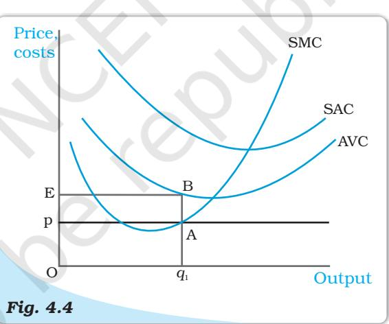

*Price-AVC Relationship with Profit Maximisation (Short Run). The figure is used to demonstrate that a profit-maximising firm produces zero output in the short run when the market price, p, is less than the minimum of its average variable cost (AVC). If the firm's output level is q1 , the firm's total variable cost exceeds its revenue by an amount equal to the area of rectangle p*EBA*.*

the AVC. We claim that *q*1 cannot be a profit-maximising output level. Why? Notice that the firm's total revenue at *q*1 is as follows

- TR = Price *×* Quantity
	- = Vertical height *Op ×* width *Oq*1
	- = The area of rectangle *OpAq*1

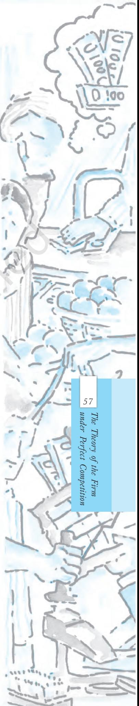

#### Similarly, the firm's total variable cost at *q*1 is as follows TVC = Average variable cost *×* Quantity

- = Vertical height *OE ×* Width *Oq*1 = The area of rectangle *OEBq*1
Now recall that the firm's profit at *q*1 is TR – (TVC + TFC); that is, [the area of rectangle *OpAq*1 ] – [the area of rectangle *OEBq*1 ] – TFC. What happens if the firm produces zero output? Since output is zero, TR and TVC are zero as well. Hence, the firm's profit at zero output is equal to – TFC. But, the area of rectangle *OpAq*1 is strictly less than the area of rectangle *OEBq*1 . Hence, the firm's profit at *q*1 is [(area EBA*p*)-TFC], which is strictly less than what it obtains by not producing at

all. So, the firm will choose not to produce at all, and exit from the market.

*Case 2: Price must be greater than or equal to AC in the long run*

We will show that the statement of Case 2 (see above) is true by arguing that a profit-maximising firm, in the long run, will *not* produce at an output level wherein the market price is lower than the AC.

Let us turn to Figure 4.5. Observe that at the output level *q*1 , the market price *p* is lower than the (long run) AC. We claim that *q*1 cannot be a profit-maximising output level. Why?

Notice that the firm's total revenue, TR, at *q*1 is the area of the rectangle *OpAq*1 (the product of price and quantity) while the firm's total cost, TC , is the area of the rectangle *OEBq*1 (the product of average cost and quantity). Since the area of rectangle *OEBq*1 is larger than the area of rectangle *OpAq*1 , the firm incurs a loss at the output level *q*1 . But, in the long run set-up, a firm that shuts down production has a profit of zero. Again, the firm chooses to exit in this case.

## 4.3.4 The Profit Maximisation Problem: Graphical Representation

Using the material in sections 3.1, 3.2 and 3.3, let us graphically represent a firm's profit

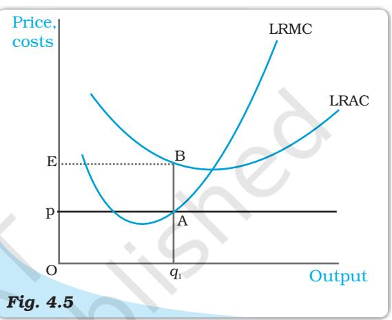

*Price-AC Relationship with Profit Maximisation (Long Run)*. *The figure is used to demonstrate that a profit-maximising firm produces zero output in the long run when the market price, p, is less than the minimum of its long run average cost (LRAC). If the firm's output level is q1 , the firm's total cost exceeds its revenue by an amount equal to the area of rectangle p*EBA*.*

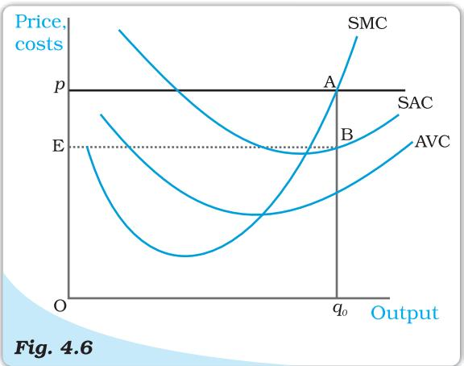

*Geometric Representation of Profit Maximisation (Short Run). Given market price* p*, the output level of a profit-maximising firm is q0 . At q0 , the firm's profit is equal to the area of rectangle* E*p*AB*.*

maximisation problem in the short run. Consider Figure 4.6. Notice that the market price is *p*. Equating the market price with the (short run) marginal cost, we obtain the output level *q*0 . At *q*0 , observe that SMC slopes upwards and *p* exceeds AVC. Since the three conditions discussed in sections 3.1-3.3 are satisfied at *q*0 , we maintain that the profit-maximising output level of the firm is *q*0 .

What happens at *q*0 ? The total revenue of the firm at *q*0 is the area of rectangle *OpAq*0 (the product of price and quantity) while the total cost at *q*0 is the area of rectangle *OEBq*0 (the product of short run average cost and quantity). So, at *q*0 , the firm earns a profit equal to the area of the rectangle *EpAB*.

# 4.4 SUPPLY CURVE OF A FIRM

A firm's 'supply' is the quantity that it chooses to sell at a given price, given technology, and given the prices of factors of production. A table describing the quantities sold by a firm at various prices, technology and prices of factors remaining unchanged, is called a supply schedule. We may also represent the information as a graph, called a supply curve. The supply curve of a firm shows the levels of output (plotted on the *x*-axis) that the firm chooses to produce corresponding to different values of the market price (plotted on the *y*-axis), again keeping technology and prices of factors of production unchanged. We distinguish between the short run supply curve and the long run supply curve.

# 4.4.1 Short Run Supply Curve of a Firm

Let us turn to Figure 4.7 and derive a firm's short run supply curve. We shall split this derivation into two parts. We first determine a firm's profit-maximising output level when the market price is greater than or equal to the minimum AVC. This done, we determine the firm's profit-maximising output level when the market price is less than the minimum AVC.

# *Case 1: Price is greater than or equal to the minimum AVC*

Suppose the market price is *p*1 , which exceeds the minimum AVC. We start out by equating *p*1 with SMC on the rising part of the SMC curve; this leads to the output level *q*1 . Note also that the AVC at *q*1 does not exceed the market price, *p*1 . Thus, all three conditions highlighted in section 3 are satisfied at *q*1 . Hence, when the market price is *p*1 , the firm's output level in the short run is equal to *q*1 .

# *Case 2: Price is less than the minimum AVC*

Suppose the market price is *p*2 , which is less than the minimum AVC. We have argued (see

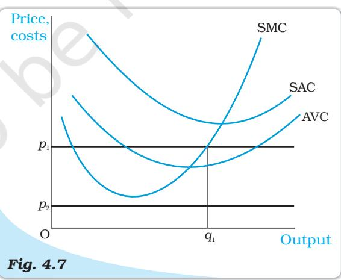

*Market Price Values. The figure shows the output levels chosen by a profit-maximising firm in the short run for two values of the market price: p1 and p2 . When the market price is p1 , the output level of the firm is q1 ; when the market price is p2 , the firm produces zero output.*

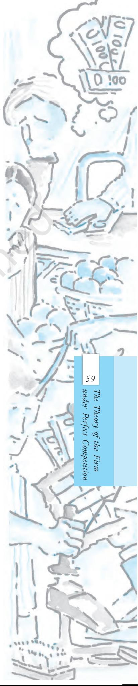

condition 3 in section 3) that if a profit-maximising firm produces a positive output in the short run, then the market price, *p*2 , *must* be greater than or equal to the AVC at that output level. But notice from Figure 4.7 that for *all* positive output levels, AVC strictly exceeds *p*2 . In other words, it cannot be the case that the firm supplies a positive output. So, if the market price is *p*2 , the firm produces zero output.

Combining cases 1 and 2, we reach an important conclusion. A firm's short run supply curve is the rising part of the SMC curve from and above the minimum AVC

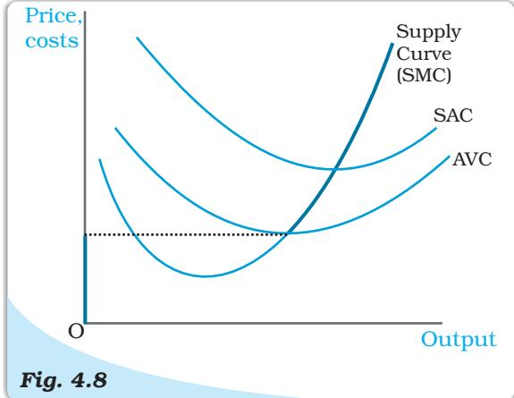

*The Short Run Supply Curve of a Firm*. *The short run supply curve of a firm, which is based on its short run marginal cost curve (SMC) and average variable cost curve (AVC), is represented by the bold line.*

together with zero output for all prices strictly less than the minimum AVC. In figure 4.8, the bold line represents the short run supply curve of the firm.

#### 4.4.2 Long Run Supply Curve of a Firm

Let us turn to Figure 4.9 and derive the firm's long run supply curve. As in the short run case, we split the derivation into two parts. We first determine the firm's profit-maximising output level when the market price is greater than or equal to the minimum (long run) AC. This done, we determine the firm's profitmaximising output level when the market price is less than the minimum (long run) AC.

#### *Case 1: Price greater than or equal to the minimum LRAC*

Suppose the market price is *p*1 , which exceeds the minimum LRAC. Upon equating *p*1 with LRMC on the rising part of the LRMC curve, we obtain output level *q*1 . Note also that the LRAC

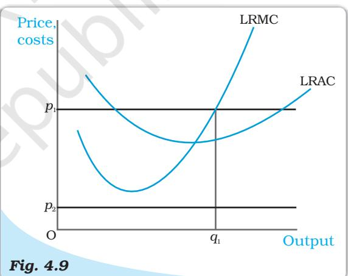

*Profit maximisation in the Long Run for Different Market Price Values*. *The figure shows the output levels chosen by a profitmaximising firm in the long run for two values of the market price: p1 and p2 . When the market price is p1 , the output level of the firm is q1 ; when the market price is p2 , the firm produces zero output.*

at *q*1 does not exceed the market price, *p*1 . Thus, all three conditions highlighted in section 3 are satisfied at *q*1 . Hence, when the market price is *p*1 , the firm's supplies in the long run become an output equal to *q*1 .

*Case 2: Price less than the minimum LRAC*

Suppose the market price is *p*2 , which is less than the minimum LRAC. We have argued (see condition 3 in section 3) that if a profit-maximising firm produces a positive output in the long run, the market price, *p*2 , *must* be greater than or equal to the LRAC at that output level. But notice from Figure 4.9 that for *all* positive output levels, LRAC strictly exceeds *p*2 . In other words, it cannot be the case that the firm supplies a positive output. So, when the market price is *p*2 , the firm produces zero output.

Combining cases 1 and 2, we reach an important conclusion. A firm's long run supply curve is the rising part of the LRMC curve from and above the minimum LRAC together with zero output for all

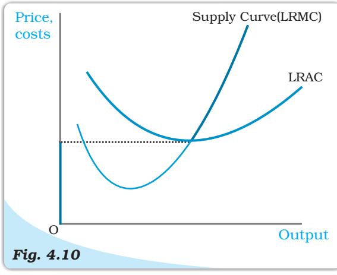

*The Long Run Supply Curve of a Firm*. *The long run supply curve of a firm, which is based on its long run marginal cost curve (LRMC) and long run average cost curve (LRAC), is represented by the bold line.*

prices less than the minimum LRAC. In Figure 4.10, the bold line represents the long run supply curve of the firm.

## 4.4.3 The Shut Down Point

Previously, while deriving the supply curve, we have discussed that in the short run the firm continues to produce as long as the price remains greater than or equal to the minimum of AVC. Therefore, along the supply curve as we move down, the last price-output combination at which the firm produces positive output is the point of minimum AVC where the SMC curve cuts the AVC curve. Below this, there will be no production. This point is called the short run shut down point of the firm. In the long run, however, the shut down point is the minimum of LRAC curve.

#### 4.4.4 The Normal Profit and Break-even Point

The minimum level of profit that is needed to keep a firm in the existing business is defined as normal profit. A firm that does not make normal profits is not going to continue in business. Normal profits are therefore a part of the firm's total costs. It may be useful to think of them as an opportunity cost for entrepreneurship. Profit that a firm earns over and above the normal profit is called the super-normal profit. In the long run, a firm does not produce if it earns anything less than the normal profit. In the short run, however, it may produce even if the profit is less than this level. The point on the supply curve at which a firm earns only normal profit is called the break-even point of the firm. The point of minimum average cost at which the supply curve cuts the LRAC curve (in short run, SAC curve) is therefore the break-even point of a firm.

#### Opportunity cost

In economics, one often encounters the concept of opportunity cost. Opportunity cost of some activity is the gain foregone from the second best activity. Suppose you have Rs 1,000 which you decide to invest in your family business. What is the opportunity cost of your action? If you do not invest

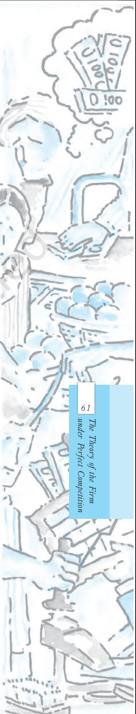

this money, you can either keep it in the house-safe which will give you zero return or you can deposit it in either bank-1 or bank-2 in which case you get an interest at the rate of 10 per cent or 5 per cent respectively. So the maximum benefit that you may get from other alternative activities is the interest from the bank-1. But this opportunity will no longer be there once you invest the money in your family business. The opportunity cost of investing the money in your family business is therefore the amount of forgone interest from the bank-1.

# 4.5 DETERMINANTS OF A FIRM'S SUPPLY CURVE

In the previous section, we have seen that a firm's supply curve is a part of its marginal cost curve. Thus, *any* factor that affects a firm's marginal cost curve is of course a determinant of its supply curve. In this section, we discuss two such factors.

# 4.5.1 Technological Progress

Suppose a firm uses two factors of production – say, capital and labour – to produce a certain good. Subsequent to an organisational innovation by the firm, the same levels of capital and labour now produce more units of output. Put differently, to produce a given level of output, the organisational innovation allows the firm to use fewer units of inputs. It is expected that this will lower the firm's marginal cost at any level of output; that is, there is a rightward (or downward) shift of the MC curve. As the firm's supply curve is essentially a segment of the MC curve, technological progress shifts the supply curve of the firm to the right. At any given market price, the firm now supplies more units of output.

# 4.5.2 Input Prices

A change in input prices also affects a firm's supply curve. If the price of an input (say, the wage rate of labour) increases, the cost of production rises. The consequent increase in the firm's average cost at any level of output is usually accompanied by an increase in the firm's marginal cost at any level of output; that is, there is a leftward (or upward) shift of the MC curve. This means that the firm's supply curve shifts to the left: at any given market price, the firm now supplies fewer units of output.

## Impact of a unit tax on supply

A unit tax is a tax that the government imposes per unit sale of output. For example, suppose that the unit tax imposed by the government is Rs 2. Then, if the firm produces and sells 10 units of the good, the total tax that the firm must pay to the government is 10 *×* Rs 2 = Rs 20.

How does the long run supply curve of a firm change when a unit tax is imposed? Let us turn to figure 4.11. Before the unit tax is imposed, LRMC0 and LRAC0 are, respectively, the long run marginal cost curve and the long run average cost curve of the firm. Now, suppose the government puts in place a unit tax of Rs *t*. Since the firm must pay an extra Rs *t* for each unit of the good produced, the firm's long run average cost and long run marginal cost at any level of output increases by Rs *t*. In Figure 4.11, LRMC1 and LRAC1 are, respectively, the long run marginal cost curve and the long run average cost curve of the firm upon imposition of the unit tax.

Recall that the long run supply curve of a firm is the rising part of the LRMC curve from and above the minimum LRAC together with zero output for all prices less than the minimum LRAC. Using this observation in Figure 4.12, it is immediate that S0 and S1 are, respectively, the long run supply curve of the firm before and after the imposition of the unit tax. Notice that the unit tax shifts the firm's long run supply curve to the left: at any given market price, the firm now supplies fewer units of output.

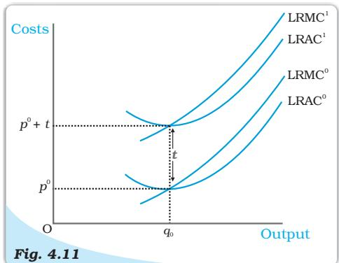

*Cost Curves and the Unit Tax. LRAC0 and LRMC0 are, respectively, the long run average cost curve and the long run marginal cost curve of a firm before a unit tax is imposed. LRAC1 and LRMC1 are, respectively, the long run average cost curve and the long run marginal cost curve of a firm after a unit tax of Rs t is imposed.*

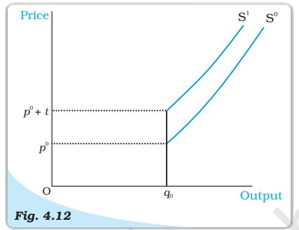

*Supply Curves and Unit Tax. S0 is the supply curve of a firm before a unit tax is imposed. After a unit tax of Rs t is imposed, S1 represents the supply curve of the firm.*

# 4.6 MARKET SUPPLY CURVE

The market supply curve shows the output levels (plotted on the *x*-axis) that firms in the market produce in aggregate corresponding to different values of the market price (plotted on the *y*-axis).

How is the market supply curve derived? Consider a market with *n* firms: firm 1, firm 2, firm 3, and so on. Suppose the market price is fixed at *p*. Then, the output produced by the *n* firms in aggregate is [supply of firm 1 at price *p*] + [supply of firm 2 at price *p*] + *...* + [supply of firm *n* at price *p*]. In other words, the market supply at price *p* is the summation of the supplies of individual firms at that price.

Let us now construct the market supply curve geometrically with just two firms in the market: firm 1 and firm 2. The two firms have different cost structures. Firm 1 will not produce anything if the market price is less than *p*1 while firm 2 will not produce anything if the market price is less than *p*2 . Assume also that *p*2 is greater than *p*1 .

In panel (a) of Figure 4.13 we have the supply curve of firm 1, denoted by S1 ; in panel (b), we have the supply curve of firm 2, denoted by S2 . Panel (c) of Figure 4.13 shows the market supply curve, denoted by S*m*. When the market price is strictly below *p*1 , both firms choose not to produce any amount of the good; hence, market supply will also be zero for all such prices. For a market

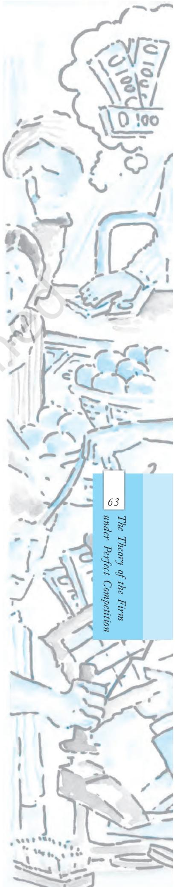

price greater than or equal to *p*1 but strictly less than *p*2 , only firm 1 will produce a positive amount of the good. Therefore, in this range, the market supply curve coincides with the supply curve of firm 1. For a market price greater than or equal to *p*2 , both firms will have positive output levels. For example, consider a situation wherein the market price assumes the value *p*3 (observe that *p*3 exceeds *p*2 ). Given *p*3 , firm 1 supplies *q*3 units of output while firm 2 supplies *q*4 units of output. So, the market supply at price *p*3 is *q*5 , where *q*5 = *q*3 + *q*4 . Notice how the market supply curve, S*m* , in panel (c) is being constructed: we obtain S*m* by taking a horizontal summation of the supply curves of the two firms in the market, S1 and S2 .

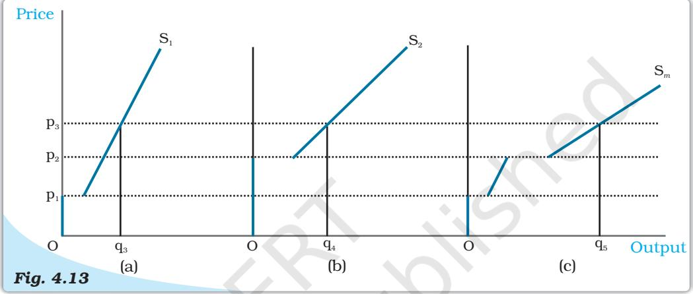

*The Market Supply Curve Panel. (a) shows the supply curve of firm 1. Panel (b) shows the supply curve of firm 2. Panel (c) shows the market supply curve, which is obtained by taking a horizontal summation of the supply curves of the two firms.*

It should be noted that the market supply curve has been derived for a fixed number of firms in the market. As the number of firms changes, the market supply curve shifts as well. Specifically, if the number of firms in the market increases (decreases), the market supply curve shifts to the right (left).

We now supplement the graphical analysis given above with a related numerical example. Consider a market with two firms: firm 1 and firm 2. Let the supply curve of firm 1 be as follows

$$\mathbf{S}_{1}(p)={\begin{cases}0&:p<10\\ p\,-\,10:p\geq10\end{cases}}$$

Notice that S1 (*p*) indicates that (1) firm 1 produces an output of 0 if the market price, *p*, is strictly less than 10, and (2) firm 1 produces an output of (*p –* 10) if the market price, *p*, is greater than or equal to 10. Let the supply curve of firm 2 be as follows

$$\mathbf{S}_{2}(p)={\begin{cases}0&:p<15\\ p-15:p\geq15\end{cases}}$$

The interpretation of S2 (*p*) is identical to that of S1 (*p*), and is, hence, omitted. Now, the market supply curve, S*m* (*p*), simply sums up the supply curves of the two firms; in other words

$${\bf S}_{m}(p)={\bf S}_{1}(p)+{\bf S}_{2}(p)$$

But, this means that *Sm* (*p*) is as follows

$$S_{m}(p)={\begin{cases}0&:p<10\\ p-10&:p\geq10\ a n d\ p<15\\ (p-10)+(p-15)=2p-25&:p\geq15\end{cases}}$$

# 4.7 PRICE ELASTICITY OF SUPPLY

The price elasticity of supply of a good measures the responsiveness of quantity supplied to changes in the price of the good. More specifically, the price elasticity of supply, denoted by *eS* , is defined as follows

Price elasticity of supply, *eS* = Percentage change in quantity supplied Percentage change in price

$$={\frac{{\frac{\Delta Q}{Q}}\times100}{{\frac{\Delta P}{P}}\times100}}={\frac{\Delta Q}{Q}}\times{\frac{P}{\Delta P}}$$

Where ∆*Q* is the change in quantity of the good supplied to the market as market price changes by ∆*P* .

To make matters concrete, consider the following numerical example. Suppose the market for cricket balls is perfectly competitive. When the price of a cricket ball is Rs10, let us assume that 200 cricket balls are produced in aggregate by the firms in the market. When the price of a cricket ball rises to Rs 30, let us assume that 1,000 cricket balls are produced in aggregate by the firms in the market.

The percentage change in quantity supplied and market price can be estimated using the information summarised in the table below:

65

The Theory of the Firm

under Perfect Competition

| Price of Cricket balls (P) | Quantity of Cricket balls produced and sold (Q) |
| --- | --- |
| Old price : P1 = 10 | Old quantity : Q1 = 200 |
| = 30 New price : P2 | = 1000 New quantity: Q2 |

Percentage change in quantity supplied= 1 100 *Q Q* ∆ ×

2 1 1 100 1000 200 100 200 *Q Q Q* − = × − = × = 400

Percentage change in market price = 1 100 *P P* ∆ ×

$$=\frac{P_{2}-P_{1}}{P_{1}}\times100$$
 
$$=\frac{30-10}{10}\times100$$
 
$$=200$$
  
  
Therefore, price elasticity of supply, $e_{S}=\frac{400}{200}=2$

When the supply curve is vertical, supply is completely insensitive to price and the elasticity of supply is zero. In other cases, when supply curve is positively sloped, with a rise in price, supply rises and hence, the elasticity of supply is positive. Like the price elasticity of demand, the price elasticity of supply is also independent of units.

#### The Geometric Method

Consider the Figure 4.14. Panel (a) shows a straight line supply curve. *S* is a point on the supply curve. It cuts the price-axis at its positive range and as we extend the straight line, it cuts the quantity-axis at *M* which is at its negative range. The price elasticity of this supply curve at the point *S* is given by the ratio, *Mq*0 /*Oq*0 . For any point *S* on such a supply curve, we see that *Mq*0 *> Oq*0 . The elasticity at any point on such a supply curve, therefore, will be greater than 1.

In panel (c) we consider a straight line supply curve and *S* is a point on it. It cuts the quantity-axis at *M* which is at its positive range. Again the price elasticity of this supply curve at the point *S* is given by the ratio, *Mq*0 /*Oq*0 . Now, *Mq*0 *< Oq*0 and hence, *eS <* 1. *S* can be any point on the supply curve, and therefore at all points on such a supply curve *eS <* 1.

Now we come to panel (b). Here the supply curve goes through the origin. One can imagine that the point *M* has coincided with the origin here, i.e., *Mq*0 has become equal to *Oq*0 . The price elasticity of this supply curve at the point *S* is given by the ratio, *Oq*0 /*Oq*0 which is equal to 1. At any point on a straight line, supply curve going through the origin price elasticity will be one.

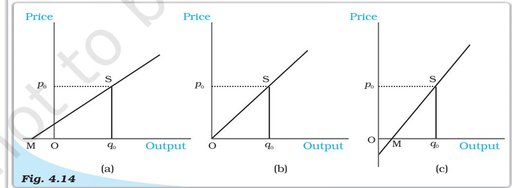

*Price Elasticity Associated with Straight Line Supply Curves. In panel (a), price elasticity (*eS *) at* S *is greater than 1. In panel (b), price elasticity (*eS *) at* S *is equal to 1. In panel (c), price elasticity (*eS *) at* S *is less than 1.*

- SummarySummary
- *•* In a perfectly competitive market, firms are price-takers.
- *•* The total revenue of a firm is the market price of the good multiplied by the firm's output of the good.
- *•* For a price-taking firm, average revenue is equal to market price.
- *•* For a price-taking firm, marginal revenue is equal to market price.
- *•* The demand curve that a firm faces in a perfectly competitive market is perfectly elastic; it is a horizontal straight line at the market price.
- *•* The profit of a firm is the difference between total revenue earned and total cost incurred.
- *•* If there is a positive level of output at which a firm's profit is maximised in the short run, three conditions must hold at that output level
	- (i) *p* = *SMC*
	- (ii) *SMC* is non-decreasing
	- (iii) *p* ≥ *AV C*.
- *•* If there is a positive level of output at which a firm's profit is maximised in the long run, three conditions must hold at that output level
	- (i) *p* = *LRMC*
	- (ii) *LRMC* is non-decreasing
	- (iii) *p* ≥ *LRAC*.
- *•* The short run supply curve of a firm is the rising part of the *SMC* curve from and above minimum *AVC* together with 0 output for all prices less than the minimum *AVC*.
- *•* The long run supply curve of a firm is the rising part of the *LRMC* curve from and above minimum *LRAC* together with 0 output for all prices less than the minimum *LRAC*.
- *•* Technological progress is expected to shift the supply curve of a firm to the right.
- *•* An increase (decrease) in input prices is expected to shift the supply curve of a firm to the left (right).
- *•* The imposition of a unit tax shifts the supply curve of a firm to the left.
- *•* The market supply curve is obtained by the horizontal summation of the supply curves of individual firms.
- *•* The price elasticity of supply of a good is the percentage change in quantity supplied due to one per cent change in the market price of the good.

Perfect competition Revenue, Profit Profit maximisation Firms supply curve

Market supply curve Price elasticity of supply

- 1. What are the characteristics of a perfectly competitive market?
- 2. How are the total revenue of a firm, market price, and the quantity sold by the firm related to each other?
- 3. What is the 'price line'?

Exercises

ExercisesExercises

?

?

Key Concepts

- 4. Why is the total revenue curve of a price-taking firm an upward-sloping straight line? Why does the curve pass through the origin?

- 5. What is the relation between market price and average revenue of a pricetaking firm?
- 6. What is the relation between market price and marginal revenue of a pricetaking firm?
- 7. What conditions must hold if a profit-maximising firm produces positive output in a competitive market?
- 8. Can there be a positive level of output that a profit-maximising firm produces in a competitive market at which market price is not equal to marginal cost? Give an explanation.
- 9. Will a profit-maximising firm in a competitive market ever produce a positive level of output in the range where the marginal cost is falling? Give an explanation.
- 10. Will a profit-maximising firm in a competitive market produce a positive level of output in the short run if the market price is less than the minimum of *AVC*? Give an explanation.
- 11. Will a profit-maximising firm in a competitive market produce a positive level of output in the long run if the market price is less than the minimum of *AC*? Give an explanation.
- 12. What is the supply curve of a firm in the short run?
- 13. What is the supply curve of a firm in the long run?
- 14. How does technological progress affect the supply curve of a firm?
- 15. How does the imposition of a unit tax affect the supply curve of a firm?
- 16. How does an increase in the price of an input affect the supply curve of a firm?
- 17. How does an increase in the number of firms in a market affect the market supply curve?
- 18. What does the price elasticity of supply mean? How do we measure it?

| 19. Compute the total revenue, marginal | revenue and average revenue schedules |
| --- | --- |
| in the following table. Market price of each | unit of the good is Rs 10. |

| Quantity Sold | TR | MR | AR |
| --- | --- | --- | --- |
| 0 |  |  |  |
| 1 |  |  |  |
| 2 |  |  |  |
| 3 |  |  |  |
| 4 |  |  |  |
| 5 |  |  |  |
| 6 |  |  |  |

- 20. The following table shows the total revenue and total cost schedules of a competitive firm. Calculate the profit at each output level. Determine also the market price of the good.

| Quantity Sold | TR (Rs) | TC (Rs) | Profit |
| --- | --- | --- | --- |
| 0 | 0 | 5 |  |
| 1 | 5 | 7 |  |
| 2 | 10 | 10 |  |
| 3 | 15 | 12 |  |
| 4 | 20 | 15 |  |
| 5 | 25 | 23 |  |
| 6 | 30 | 33 |  |
| 7 | 35 | 40 |  |

68Introductory Microeconomics

- 21. The following table shows the total cost schedule of a competitive firm. It is given that the price of the good is Rs 10. Calculate the profit at each output level. Find the profit maximising level of output.

| Output | TC (Rs) |
| --- | --- |
| 0 | 5 |
| 1 | 15 |
| 2 | 22 |
| 3 | 27 |
| 4 | 31 |
| 5 | 38 |
| 6 | 49 |
| 7 | 63 |
| 8 | 81 |
| 9 | 101 |
| 10 | 123 |

 *(units) SS2*

0 0 0 1 0 0 2 0 0 3 1 1 4 2 2

 *(units)*

- 22. Consider a market with two firms. The following table shows the supply schedules of the two firms: the *SS*1 column gives the supply schedule of firm 1 and the *SS*2 column gives the supply schedule of firm 2. Compute the market supply schedule.
- 23. Consider a market with two firms. In the following table, columns labelled as *SS*1 and *SS*2 give the supply schedules of firm 1 and firm 2 respectively. Compute the market supply schedule.

| 5 | 3 | 3 |
| --- | --- | --- |
| 6 | 4 | 4 |
| Price (Rs) | (kg) SS1 | (kg) SS2 |
| 0 | 0 | 0 |
| 1 | 0 | 0 |
| 2 | 0 | 0 |
| 3 | 1 | 0 |
| 4 | 2 | 0.5 |
| 5 | 3 | 1 |
| 6 | 4 | 1.5 |
| 7 | 5 | 2 |
| 8 | 6 | 2.5 |

*Price (Rs) SS1*

- 24. There are three identical firms in a market. The following table shows the supply schedule of firm 1. Compute the market supply schedule.

| Price (Rs) | SS1 (units) |
| --- | --- |
| 0 | 0 |
| 1 | 0 |
| 2 | 2 |
| 3 | 4 |
| 4 | 6 |
| 5 | 8 |
| 6 | 10 |
| 7 | 12 |
| 8 | 14 |

69

The Theory of the Firm

under Perfect Competition

- 25. A firm earns a revenue of Rs 50 when the market price of a good is Rs 10. The market price increases to Rs 15 and the firm now earns a revenue of Rs 150. What is the price elasticity of the firm's supply curve?
- 26. The market price of a good changes from Rs 5 to Rs 20. As a result, the quantity supplied by a firm increases by 15 units. The price elasticity of the firm's supply curve is 0.5. Find the initial and final output levels of the firm.
- 27. At the market price of Rs 10, a firm supplies 4 units of output. The market price increases to Rs 30. The price elasticity of the firm's supply is 1.25. What quantity will the firm supply at the new price?

?

?

