## Market Equilibrium

This chapter will be built on the foundation laid down in Chapters 2 and 4 where we studied the consumer and firm behaviour when they are price takers. In Chapter 2, we have seen that an individual's demand curve for a commodity tells us what quantity a consumer is willing to buy at different prices when he takes price as *given*. The market demand curve in turn tells us how much of the commodity all the consumers taken together are willing to purchase at different prices when everyone takes price as *given*. In Chapter 4, we have seen that an individual firm's supply curve tells us the quantity of the commodity that a profit-maximising firm would wish to sell at different prices when it takes price as *given* and the market supply curve tells us how much of the commodity all the firms taken together would wish to supply at different prices when each firm takes price as *given*.

In this chapter, we combine both consumers' and firms' behaviour to study market equilibrium through demand-supply analysis and determine at what price equilibrium will be attained. We also examine the effects of demand and supply shifts on equilibrium. At the end of the chapter, we will look at some of the applications of demand-supply analysis.

#### 5.1 EQUILIBRIUM, EXCESS DEMAND, EXCESS SUPPLY

A perfectly competitive market consists of buyers and sellers who are driven by their self-interested objectives. Recall from Chapters 2 and 4 that objectives of the consumers are to maximise their respective preference and that of the firms are to maximise their respective profits. Both the consumers' and firms' objectives are compatible in the equilibrium.

An equilibrium is defined as a situation where the plans of all consumers and firms in the market match and the market clears. In equilibrium, the aggregate quantity that all firms wish to sell equals the quantity that all the consumers in the market wish to buy; in other words, market supply equals market demand. The price at which equilibrium is reached is called equilibrium price and the quantity bought and sold at this price is called equilibrium quantity. Therefore, (*p* * *, q** ) is an equilibrium if

$$q^{D}(p^{*})=q^{S}(p^{*})$$

# Chapter 5

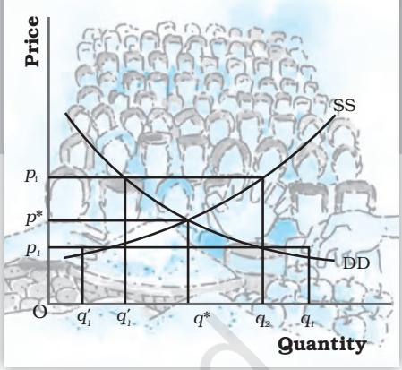

where *p* ∗ denotes the equilibrium price and *q D* (*p* ∗ ) and *q S* (*p* ∗ ) denote the market demand and market supply of the commodity respectively at price *p* ∗ .

If at a price, market supply is greater than market demand, we say that there is an excess supply in the market at that price and if market demand exceeds market supply at a price, it is said that excess demand exists in the market at that price. Therefore, equilibrium in a perfectly competitive market can be defined alternatively as zero excess demand-zero excess supply situation. Whenever market supply is not equal to market demand, and hence the market is not in equilibrium, there will be a tendency for the price to change. In the next two sections, we will try to understand what drives this change.

Out-of-equilibrium Behaviour

From the time of Adam Smith (1723-1790), it has been maintained that in a perfectly competitive market an 'Invisible Hand' is at play which changes price whenever there is imbalance in the market. Our intuition also tells us that this 'Invisible Hand' should raise the prices in case of 'excess demand' and lower the prices in case of 'excess supply'. Throughout our analysis we shall maintain that the 'Invisible Hand' plays this very important role. Moreover, we shall take it that the 'Invisible Hand' by following this process is able to reach the equilibrium. This assumption will be taken to hold in all that we discuss in the text.

#### 5.1.1 Market Equilibrium: Fixed Number of Firms

Recall that in Chapter 2 we have derived the market demand curve for pricetaking consumers, and for price-taking firms the market supply curve was derived in Chapter 4 under the assumption of a fixed number of firms. In this section with the help of these two curves we will look at how supply and demand forces work together to determine where the market will be in equilibrium when the number of firms is fixed. We will also study how the equilibrium price and quantity change due to shifts in demand and supply curves.

Figure 5.1 illustrates equilibrium for a perfectly competitive market with a fixed number of firms. Here SS denotes the market supply curve and DD denotes the market demand curve for a commodity. The market supply curve SS shows how much of the commodity, firms would wish to supply at different prices, and the demand curve DD tells us how much of the commodity, the consumers would be willing to purchase at different prices. Graphically, an equilibrium is a point where the market supply curve intersects the market demand curve because this is where the market demand equals market supply. At any other point, either there is excess supply or

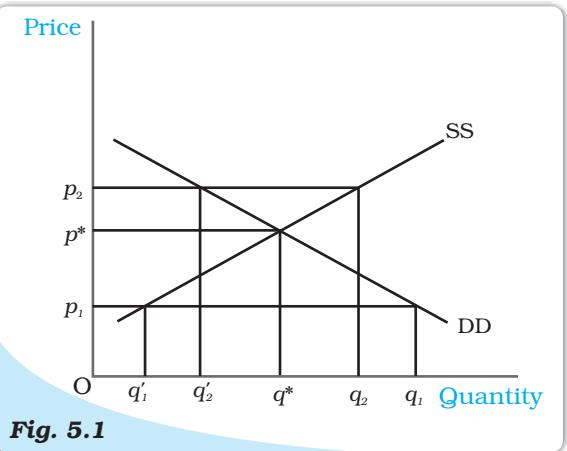

*Market Equilibrium with Fixed Number of Firms. Equilibrium occurs at the intersection of the market demand curve DD and market supply curve SS. The equilibrium quantity is q** *and the equilibrium price is p***. At a price greater than p**, *there will be excess supply, and at a price below p**, *there will be excess demand.*

there is excess demand. To see what happens when market demand does not equal market supply, let us look in figure 5.1 again.

In Figure 5.1, if the prevailing price is *p*1 , the market demand is *q*1 whereas the market supply is *q'*1 . Therefore, there is excess demand in the market equal to *q'*1 *q*1 . Some consumers who are either unable to obtain the commodity at all or obtain it in insufficient quantity will be willing to pay more than *p*1 . The market price would tend to increase. All other things remaining the same as price rises, quantity demanded falls and quantity supplied increases. The market moves towards the point where the quantity that the firms want to sell is equal to the quantity that the consumers want to buy. This happens when price is *p ** , the supply decisions of the firms only match with the demand decisions of the consumers.

Similarly, if the prevailing price is *p*2 , the market supply (*q*2 ) will exceed the market demand ( *q '*2 ) at that price giving rise to excess supply equal to *q '*2 *q*2 . Some firms will not be then able to sell quantity they want to sell; so, they will lower their price. All other things remaining the same as price falls, quantity demanded rises, quantity supplied falls, and at *p* * , the firms are able to sell their desired output since market demand equals market supply at that price. Therefore, *p* * is the equilibrium price and the corresponding quantity *q* * is the equilibrium quantity.

To understand the equilibrium price and quantity determination more clearly, let us explain it through an example.

#### EXAMPLE 5.1

Let us consider the example of a market consisting of identical1 farms producing same quality of wheat. Suppose the market demand curve and the market supply curve for wheat are given by:

$q^{D}=200-p$ for $0\leq p\leq200$  
  
$=0$ for $p\geq200$  
  
$q^{S}=120+p$ for $p\geq10$  
  
$=0$ for $0\leq p\leq10$

where *q D* and *q S* denote the demand for and supply of wheat (in kg) respectively and *p* denotes the price of wheat per kg in rupees.

Since at equilibrium price market clears, we find the equilibrium price (denoted by *p* * ) by equating market demand and supply and solve for *p* * .

*q D*(*p* * ) = *q S* (*p* * ) 200 *– p** = 120 + *p* *

Rearranging terms,

$$\begin{array}{c}{{2p^{*}=80}}\\ {{p^{*}=40}}\end{array}$$

Therefore, the equilibrium price of wheat is Rs 40 per kg. The equilibrium quantity (denoted by *q* * ) is obtained by substituting the equilibrium price into either the demand or the supply curve's equation since in equilibrium quantity demanded and supplied are equal.

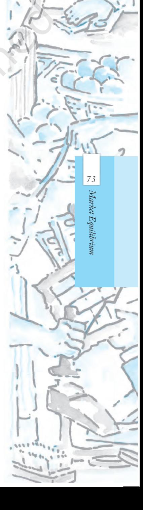

1Here, by identical we mean that all farms have same cost structure.

$$q^{P}=q^{*}=200-40=160$$

Alternatively,

$$q^{s}=q^{*}=120+40=160$$

Thus, the equilibrium quantity is 160 kg.

At a price less than *p* * , say *p* 1 = 25

$$\begin{array}{l}{{q^{D}=200-25=175}}\\ {{q^{S}=120+25=145}}\end{array}$$

Therefore, at *p*1 = 25, *q D > qS* which implies that there is excess demand at this price.

Algebraically, excess demand (ED) can be expressed as

$$\begin{array}{r l}{E D(p)}&{{}=q^{D}-q^{S}}\\ {}&{{}=200-p-(120+p)}\\ {}&{{}=80-2p}\end{array}$$

Notice from the above expression that for any price less than *p* * (= 40), excess demand will be positive.

Similarly, at a price greater than *p* * , say *p*2 = 45

$$q^{D}=200\,-45=155$$
  

$$q^{S}=120\,+45=165$$

Therefore, there is excess supply at this price since *q S > qD*. Algebraically, excess supply (ES) can be expressed as

  
  
## 6 Conclusion  
  
In this paper we have presented a new method for computing the $\alpha$-function of the \(\

Notice from the above expression that for any price greater than *p ** (= 40), excess supply will be positive.

Therefore, at any price greater than *p * ,* there will be excess supply, and at any price lower than *p ** ,there will be excess demand.

Wage Determination in Labour Market

Here we will briefly discuss the theory of wage determination under a perfectly competitive market structure using the demand-supply analysis. The basic difference between a labour market and a market for goods is with respect to the source of supply and demand. In the labour market, households are the suppliers of labour and the demand for labour comes from firms whereas in the market for goods, it is the opposite. Here, it is important to point out that by labour, we mean the hours of work provided by labourers and not the number of labourers. The wage rate is determined at the intersection of the demand and supply curves of labour where the demand for and supply of labour balance. We shall now see what the demand and supply curves of labour look like.

To examine the demand for labour by a single firm, we assume that the labour is the only variable factor of production and the labour market is perfectly competitive, which in turn, implies that each firm takes wage rate as *given*. Also, the firm we are concerned with, is perfectly competitive in nature and carries out production with the goal of profit maximisation. We also assume that given the technology of the firm, the law of diminishing marginal product holds.

The firm being a profit maximiser will always employ labour upto the point where the extra cost she incurs for employing the last unit of labour is equal to the additional benefit she earns from that unit. The extra cost of hiring one more unit of labour is the wage rate ( *w*). The extra output produced by one more unit of labour is its marginal product (MP *L*) and by selling each extra unit of output , the additional earning of the firm is the marginal revenue (MR) she gets from that unit. Therefore, for each extra unit of labour, she gets an addit ional benefit equal to marginal revenue times marginal product which is called Marginal Revenue P roduct of Labour (MRP *L* ). Thus, while hiring labour , the fir m employs labour up to the point where

#### *w* = *MRPL* and *MRPL* = *MR × MPL*

Since we are dealing with a perfectly competitive firm, marginal revenue is equal to the price of the commodity a and hence marginal revenue product of labour in this case is equal to the value of marginal product of labour (VMP *L* ).

As long as the VMP *L* is greater than the wage rate, the firm will earn more profit by hiring one more unit of labour, and if at any level of labour employment VMP *L* is less than the wage rate, the firm can increase her profit by reducing a unit of labour employed.

Given the assumption of the law of diminishing marginal product, the fact that the firm always produces at *w* = VMP *L* implies that the demand curve for labour is downward sloping. To explain why it is so, let us assume at some wage rate w 1 , demand for labour is l 1 . Now , suppose the wage rate increases to *w* 2 . To maintain the wage-VMP *L* equality, VMP *L* should also increase. The price of the commodity remaining

constant b *,* this is possible only if MP *L* increases which in turn implies that less labour should be employed owing to the diminishing marginal productivity of labour . Hence, at higher wage , less labour is demanded thereby leading to a downward sloping demand , curve. To arrive at the market demand curve from individual firms' demand curve , we simply add up the demand for labour by individual firms at different wages and since each firm demands less labour as wage increases , the

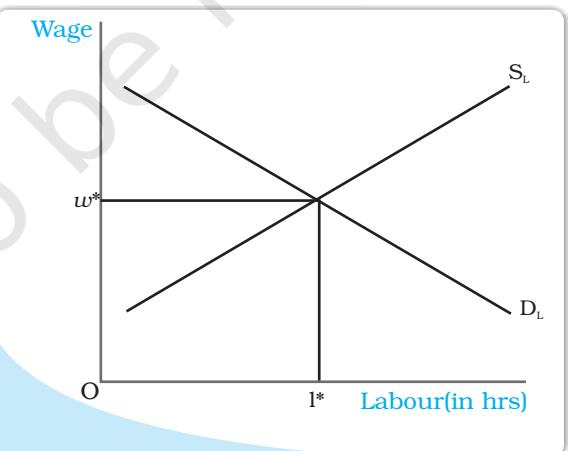

*Wage is determined at the point where the labour demand and supply curves intersect.*

market demand curve is also downward sloping.

aRecall from Chapter 4 that for a perfectly competitive firm, marginal revenue equals price. bSince the firm under consideration is perfectly competitive, it believes it cannot influence the price of the commodity.

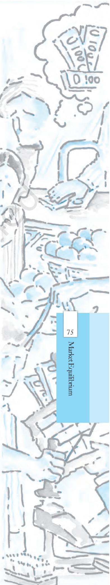

Having explored the demand side, we now turn to the supply side. As already mentioned, it is the households which determine how much labour to supply at a given wage rate. Their supply decision is essentially a choice between income and leisure. On the one hand, individuals enjoy leisure and find work irksome and on the other, they value income for which they must work.

So there is a trade-off between enjoying leisure and spending more hours for work. To derive the labour supply curve for a single individual, let us assume at some wage rate w1 , the individual supplies l1 units of labour. Now suppose the wage rises to w2 . This increase in wage rate will have two effects: First, due to the increase in wage rate, the opportunity cost of leisure increases which makes leisure costlier. Therefore, the individual will want to enjoy less leisure. As a result, they will work for longer hours. Second, because of the increase in wage rate to w2 , the purchasing power of the individual increases. So, she would want to spend more on leisure activities. The final effect of the increase in wage rate will depend on which of the two effects predominates. At low wage rates, the first effect dominates the second and so the individual will be willing to supply more labour with an increase in wage rate. But at high wage rates, the second effect dominates the first and the individual will be willing to supply less labour for every increase in wage rate. Thus, we get a backward bending individual labour supply curve which shows that up to a certain wage rate for every increase in wage rate, there is an increased supply of labour. Beyond this wage rate for every increase in wage rate, labour supply will decrease. Nevertheless, the market supply curve of labour, which we obtain by aggregating individuals' supply at different wages, will be upward sloping because though at higher wages some individuals may be willing to work less, many more individuals will be attracted to supply more labour.

With an upward sloping supply curve and downward sloping demand curve, the equilibrium wage rate is determined at the point where these two curves intersect; in other words, where the labour that the households wish to supply is equal to the labour that the firms wish to hire. This is shown in the diagram.

#### *Shifts in Demand and Supply*

In the above section, we studied market equilibrium under the assumption that tastes and preferences of the consumers, prices of the related commodities, incomes of the consumers, technology, size of the market, prices of the inputs used in production, etc remain constant. However, with changes in one or more of these factors either the supply or the demand curve or both may shift, thereby affecting the equilibrium price and quantity. Here, we first develop the general theory which outlines the impact of these shifts on equilibrium and then discuss the impact of changes in some of the above mentioned factors on equilibrium.

#### *Demand Shift*

Consider Figure 5.2 in which we depict the impact of demand shift when the number of firms is fixed. Here, the initial equilibrium point is E where the market demand curve DD0 and the market supply curve SS0 intersect so that *q*0 and *p*0 are the equilibrium quantity and price respectively.

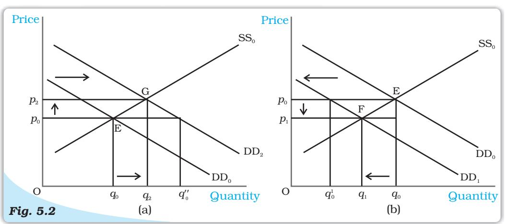

*Shifts in Demand. Initially, the market equilibrium is at E. Due to the shift in demand to the right, the new equilibrium is at G as shown in panel (a) and due to the leftward shift, the new equilibrium is at F, as shown in panel (b). With rightward shift the equilibrium quantity and price increase whereas with leftward shift, equilibrium quantity and price decrease.*

Now suppose the market demand curve shifts rightward to DD2 with supply curve remaining unchanged at SS0 , as shown in panel (a). This shift indicates that at any price the quantity demanded is more than before. Therefore, at price *p*0 now there is excess demand in the market equal to *q q''* 0 0 . In response to this excess demand some individuals will be willing to pay higher price and the price would tend to rise. The new equilibrium is attained at G where the equilibrium quantity *q*2 is greater than *q*0 and the equilibrium price *p*2 is greater than *p*0 .

Similarly if the demand curve shifts leftward to DD1 , as shown in panel (b), at any price the quantity demanded will be less than what it was before the shift. Therefore, at the initial equilibrium price *p*0 now there will be excess supply in the market equal to *q' q*0 0 in response to which some firms will reduce the price of their commodity so that they can sell their desired quantity. The new equilibrium is attained at the point F at which the demand curve DD1 and the supply curve SS0 intersect and the resulting equilibrium price *p*1 is less than *p*0 and quantity *q*1 is less than *q*0 . Notice that *the direction of change in equilibrium price and quantity is same whenever there is a shift in demand curve.*

77

Market Equilibrium

Having developed the general theory, we now consider some examples to understand how demand curve and the equilibrium quantity and price are affected in response to a change in some of the aforementioned factors which are also enlisted in Chapter 2. More specifically, we would analyse the impact of increase in consumers' income and an increase in the number of consumers on equilibrium.

Suppose due to a hike in the salaries of the consumers, their incomes increase. How would it affect equilibrium? With an increase in income, consumers are able to spend more money on some goods. But recall from Chapter 2 that the consumers will spend less on an inferior good with increase in income whereas for a normal good, with prices of all commodities and tastes and preferences of the consumers held constant, we would expect the demand for the good to increase at each price as a result of which the market demand curve will shift rightward. Here we consider the example of a normal good like clothes, the demand for which increases with increase in income of consumers, thereby causing a rightward shift in the demand curve. However, this income increase does not have any impact on

the supply curve, which shifts only due to some changes in the factors relating to technology or cost of production of the firms. Thus, the supply curve remains unchanged. In the Figure 5.2 (a), this is shown by a shift in the demand curve from DD0 to DD2 but the supply curve remains unchanged at SS0 . From the figure, it is clear that at the new equilibrium, the price of clothes is higher and the quantity demanded and sold is also higher.

Now let us turn to another example. Suppose due to some reason, there is increase in the number of consumers in the market for clothes. As the number of consumers increases, other factors remaining unchanged, at each price, more clothes will be demanded. Thus, the demand curve will shift rightwards. But this increase in the number of consumers does not have any impact on the supply curve since the supply curve may shift only due to changes in the parameters relating to firms' behaviour or with an increase in the number of firms, as stated in Chapter 4. This case again can be illustrated through Figure 5.2(a) in which the demand curve DD0 shifts rightward to DD2 , the supply curve remaining unchanged at SS0 . The figure clearly shows that compared to the old equilibrium point E, at point G which is the new equilibrium point, there is an increase in both price and quantity demanded and supplied.

#### *Supply Shift*

In Figure 5.3, we show the impact of a shift in supply curve on the equilibrium price and quantity. Suppose, initially, the market is in equilibrium at point E where the market demand curve DD0 intersects the market supply curve SS0 such that the equilibrium price is *p*0 and the equilibrium quantity is *q*0 .

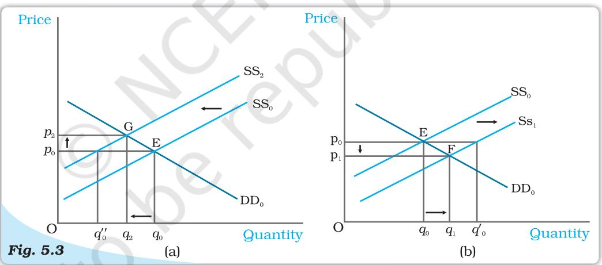

*Shifts in Supply. Initially, the market equilibrium is at E. Due to the shift in supply curve to the left, the new equilibrium point is G as shown in panel (a) and due to the rightward shift the new equilibrium point is F, as shown in panel (b). With rightward shift, the equilibrium quantity increases and price decreases whereas with leftward shift,equilibrium quantity decreases and price increases.*

Now, suppose due to some reason, the market supply curve shifts leftward to SS2 with the demand curve remaining unchanged, as shown in panel (a). Because of the shift, at the prevailing price, *p*0 , there will be excess demand equal to *q''* 0 *qo* in the market. Some consumers who are unable to obtain the good will be willing to pay higher prices and the market price tends to increase. The new equilibrium is attained at point G where the supply curve SS2 intersects the demand curve DD0 such that *q*2 quantity will be bought and sold at price *p*2 . Similarly, when supply curve shifts rightward, as shown in panel (b), at *p*0 there will be supply excess of goods equal to *q0 q '*0 *.* In response to this excess supply, some firms will reduce their price and the new equilibrium will be attained at F where the supply curve SS1 intersects the demand curve DD0 such that the new market price is p1 at which q1 quantity is bought and sold.Notice *the directions of change in price and quantity are opposite whenever there is a shift in supply curve.*

Now with this understanding, we can analyse the behaviour of equilibrium price and quantity when various aspects of the market change. Here, we will consider the effect of an increase in input price and an increase in number of firms on equilibrium.

Let us consider a situation where all other things remaining constant, there is an increase in the price of an input used in the production of a commodity. This will increase the marginal cost of production of the firms using this input. Therefore, at each price, the market supply will be less than before. Hence, the supply curve shifts leftward. In the Figure 5.3(a), this is shown by a shift in the supply curve from SS0 to SS2 . But this increase in input price has no impact on the demand of the consumers since it does not depend on the input prices directly. Therefore, the demand curve remains unchanged. In Figure 5.3(a), this is shown by the demand curve remaining unchanged at DD0 . As a result, compared to the old equilibrium, now the market price rises and quantity produced decreases.

Let us discuss the impact of an increase in the number of firms. Since at each price now more firms will supply the commodity, the supply curve shifts to the right but it does not have any effect on the demand curve. This example can be illustrated by Figure 5.3(b) where the supply curve shifts from SS0 to SS1 whereas the demand curve remains unchanged at DD0 . From the figure, we can say that there will be a decrease in price of the commodity and increase in the quantity produced compared to the initial situation.

#### *Simultaneous Shifts of Demand and Supply*

What happens when both demand and supply curves shift simultaneously? The simultaneous shifts can happen in four possible ways:

- (i) Both supply and demand curves shift rightwards.
- (ii) Both supply and demand curves shift leftwards.
- (iii) Supply curve shifts leftward and demand curve shifts rightward.
- (iv) Supply curve shifts rightward and demand curve shifts leftward.

The impact on equilibrium price and quantity in all the four cases are given in Table 5.1. Each row of the table describes the direction in which the equilibrium price and quantity will change for each possible combination of the simultaneous shifts in demand and supply curves. For instance, from the second row of the table, we see that due to a rightward shift in both demand and supply curves, the equilibrium quantity increases invariably but the equilibrium price may either increase, decrease or remain unchanged. The actual direction in which the price will change will depend on the magnitude of the shifts. Check this yourself by varying the magnitude of shifts for this particular case.

In the first two cases which are shown in the first two rows of the table, the impact on equilibrium quantity is unambiguous but the equilibrium price may change, if at all, in either direction depending on the magnitudes of shifts. In the next two cases, shown in the last two rows of the table, the effect on price is unambiguous whereas effect on quantity depends on the magnitude of shifts in the two curves.

Reprint 2024-25

79

Market Equilibrium

| Shift in Demand | Shift in Supply | Quantity | Price |
| --- | --- | --- | --- |
| Leftward | Leftward | Decreases | May increase, |
|  |  |  | decrease or |
|  |  |  | remain unchanged |
| Rightward | Rightward | Increases | May increase, |
|  |  |  | decrease or |
|  |  |  | remain unchanged |
| Leftward | Rightward | May increase, | Decreases |
|  |  | decrease or |  |
|  |  | remain unchanged |  |
| Rightward | Leftward | May increase, | Increases |
|  |  | decrease or |  |
|  |  | remain unchanged |  |

Table 5.1: Impact of Simultaneous Shifts on Equilibrium

Here we give diagrammatic representations for case (ii) and case (iii) in Figure 5.4 and leave the rest as exercises for the readers.

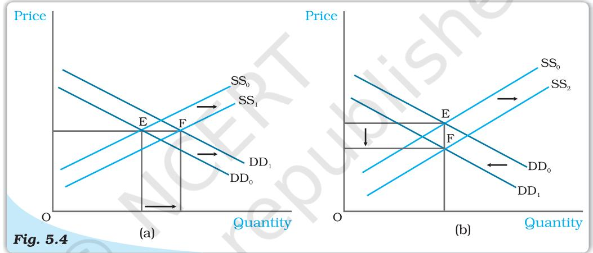

*Simultaneous Shifts in Demand and Supply. Initially, the equilibrium is at E where the demand curve DD0 and supply curve SS0 intersect. In panel (a), both the supply and the demand curves shift rightward leaving price unchanged but a higher equilibrium quantity. In panel (b), the supply curve shifts rightward and demand curve shifts leftward leaving quantity unchanged but a lower equilibrium price.*

In the Figure 5.4(a), it can be seen that due to rightward shifts in both demand and supply curves, the equilibrium quantity increases whereas the equilibrium price remains unchanged, and in Figure 5.4(b), equilibrium quantity remains the same whereas price decreases due to a leftward shift in demand curve and a rightward shift in supply curve.

#### 5.1.2 Market Equilibrium: Free Entry and Exit

In the last section, the market equilibrium was studied under the assumption that there is a fixed number of firms. In this section, we will study market equilibrium when firms can enter and exit the market freely. Here, for simplicity, we assume that all the firms in the market are identical.

What is the implication of the entry and exit assumption? This assumption implies that in equilibrium no firm earns supernormal profit or incurs loss by remaining in production; in other words, the equilibrium price will be equal to the minimum average cost of the firms.

To see why it is so, suppose, at the prevailing market price, each firm is earning supernormal profit. The possibility of earning supernormal profit will attract some new firms. As new firms enter the market supply curve

shifts rightward. However, demand remains unchanged. This causes market price to fall. As prices fall, supernormal profits are eventually wiped out. At this point, with all firms in the market earning normal profit, no more firms will have incentive to enter. Similarly, if the firms are earning less than normal profit at the prevailing price, some firms will exit which will lead to an increase in price, and with sufficient number of firms, the profits of each firm will increase to the level of normal profit. At this point, no more firm will want to leave since they will be earning normal profit here. Thus, with free entry and exit, each firm will always earn normal profit at the prevailing market price.

*Free for all*

Recall from the previous chapter that the firms will earn supernormal profit so long as the price is greater than the minimum average cost and at prices less than minimum average cost, they will earn less than normal profit. Therefore, at prices greater than the minimum average cost, new firms will enter, and at prices below minimum average cost, existing firms will start exiting. At the price level equal to the minimum average cost of the firms, each firm will earn normal profit so that no new firm will be attracted to enter the market. Also the existing firms will not leave the market since they are not incurring any loss by producing at this point. So, this price will prevail in the market.

Therefore, free entry and exit of the firms imply that the market price will always be equal to the minimum average cost, that is

*p* = min *AC*

From the above, it follows that the equilibrium price will be equal to the minimum average cost of the firms. In equilibrium, the quantity supplied will be determined by the market demand at that price so that they are equal. Graphically, this is shown in Figure 5.5 where the market will be in equilibrium at point E at which the demand curve DD intersects the *p*0 = min *AC* line such that the market price is *p*0 and the total quantity demanded and supplied is equal to *q*0 .

At *p*0 = min *AC* each firm supplies same amount of output,

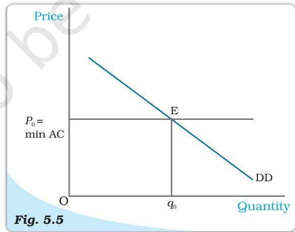

*Price Determination with Free Entry and Exit. With free entry and exit in a perfectly competitive market, the equilibrium price is always equal to min AC and the equilibrium quantity is determined at the intersection of the market demand curve DD with the price line* p *= min* AC*.*

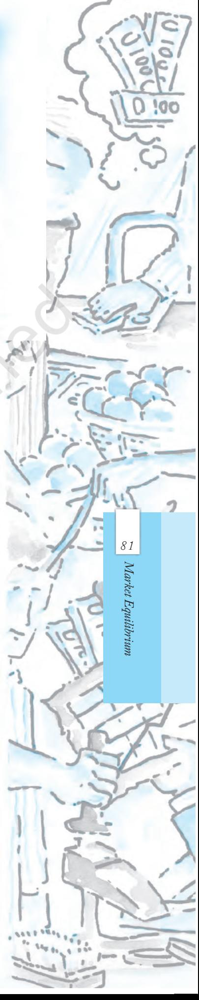

say *q*0*f* . Therefore, the equilibrium number of firms in the market is equal to the number of firms required to supply *q*0 output at *p*0 , each in turn supplying *q*0*f* amount at that price. If we denote the equilibrium number of firms by *n*0 ,then

$$n_{0}={\frac{q_{0}}{q_{0_{f}}}}$$

To understand the equilibrium price and quantity determination more clearly, let us look at the following example.

#### EXAMPLE 5.2

Consider the example of a market for wheat such that the demand curve for wheat is given as follows

$$\begin{array}{r l}{q^{p}=200-p}&{{}{\mathrm{for~}}0\leq p\leq200}\\ {=0}&{}&{{}{\mathrm{for~}}p>200}\end{array}$$

Assume that the market consists of identical firms. The supply curve of a single firm is given by

$$\begin{array}{r l}{q_{f}^{s}=10+p}&{{}{\mathrm{~for~}}p\geq20}\\ {=0}&{{}{\mathrm{~for~}}0\leq p<20}\end{array}$$

The free entry and exit of firms would mean that the firms will never produce below minimum average cost because otherwise they will incur loss from production in which case they will exit the market.

As we know, with free entry and exit, the market will be in equilibrium at a price which equals the minimum average cost of the firms. Therefore, the equilibrium price is

$$P_{0}=20$$

At this price, market will supply that quantity which is equal to the market demand. Therefore, from the demand curve, we get the equilibrium quantity:

* [16] A. A. K.  
  

Also at *p*0 = 20, each firm supplies

$$q_{0f}=10+20=30$$

Therefore, the equilibrium number of firms is

$$n_{_0}={\frac{q_{_0}}{q_{_{0}\;_{f}}}}={\frac{180}{30}}\;=6$$

Thus, with free entry and exit, the equilibrium price, quantity and number of firms are Rs 20, 180 kg and 6 respectively.

#### *Shifts in Demand*

Let us examine the impact of shift in demand on equilibrium price and quantity when the firms can freely enter and exit the market. From the previous section, we know that free entry and exit of the firms would imply that under all circumstances equilibrium price will be equal to the minimum average cost of the existing firms. Under this condition, even if the market demand curve shifts in either direction, at the new equilibrium, the market will supply the desired quantity at the same price.

In Figure 5.6, DD0 is the market demand curve which tells us how much quantity will be demanded by the consumers at different prices and *p*0 denotes

the price which is equal to the minimum average cost of the firms. The initial equilibrium is at point E where the demand curve DD0 cuts the *p*0 = min*AC* line and the total quantity demanded and supplied is *q*0 . The equilibrium number of firms is *n*0 in this situation.

Now suppose the demand curve shifts to the right for some reason. At *p*0 there will be excess demand for the commodity. Some dissatisfied consumers will be willing to pay higher price for the commodity, so the price tends to rise. This gives rise to a possibility of earning supernormal profit which will attract new firms to the market. The entry of these new firms will eventually wipe out the supernormal profit and the price will again reach *p*0 . Now higher quantity will be supplied at the same price. From the panel (a), we can see that the new demand curve DD1 intersects the *p*0 = min*AC* line at point F such that the new equilibrium will be (*p*0 , *q*1 ) where *q*1 is greater than *q*0 . The new equilibrium number of firms *n*1 is greater than *n*0 because of the entry of new firms. Similarly, for a leftward shift of the demand curve to DD2 , there will be

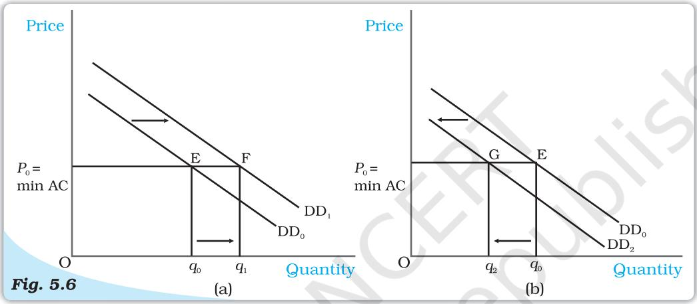

*Shifts in Demand. Initially, the demand curve was DD0 , the equilibrium quantity and price were* q*0 and* p*0 respectively. With rightward shift of the demand curve to DD1 , as shown in panel (a), the equilibrium quantity increases and with leftward shift of the demand curve to DD2 , as shown in panel (b), the equilibrium quantity decreases. In both the cases, the equilibrium price remains unchanged at* p*0 .*

excess supply at the price *p*0 . In response to this excess supply, some firms, which will be unable to sell their desired quantity at *p*0 , will wish to lower their price. The price tends to decrease which will lead to the exit of some of the existing firms and the price will again reach *p*0 . Therefore, in the new equilibrium, less quantity will be supplied which will be equal to the reduced demand at that price. This is shown in panel (b) where due to the shift of demand curve from DD0 to DD2 , quantity demanded and supplied will decrease to *q*2 whereas the price will remain unchanged at *p*0 . Here, the equilibrium number of firms, *n*2 is less than *n*0 due to the exit of some existing firms. Thus, *due to a shift in demand rightwards (leftwards), the equilibrium quantity and number of firms will increase (decrease) whereas the equilibrium price will remain unchanged.*

Here, we should note that with free entry and exit, shift in demand has a larger effect on quantity than it does with the fixed number of firms. But unlike with fixed number of firms, here, we do not have any effect on equilibrium price at all.

83

Market Equilibrium

### 5.2 APPLICATIONS

In this section, we try to understand how the supply-demand analysis can be applied. In particular, we look at two examples of government intervention in the form of price control. Often, it becomes necessary for the government to regulate the prices of certain goods and services when their prices are either too

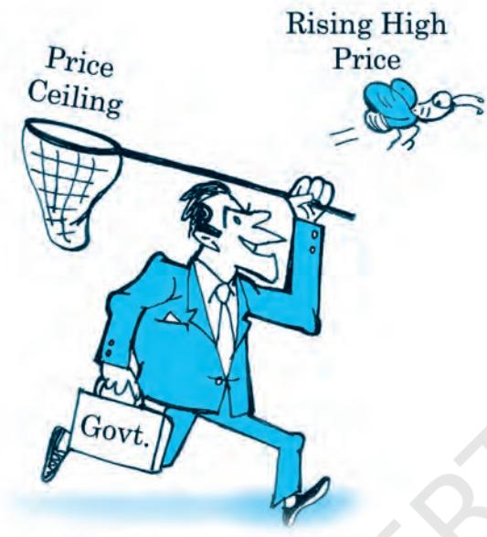

*Price Catcher*

high or too low in comparison to the desired levels. We will analyse these issues within the framework of perfect competition to look at what impact these regulations have on the market for these goods.

#### 5.2.1 Price Ceiling

It is not very uncommon to come across instances where government fixes a maximum allowable price for certain goods. The government-imposed upper limit on the price of a good or service is called price ceiling. Price ceiling is generally imposed on necessary items like wheat, rice, kerosene, sugar and it is fixed below the market-determined price since at the market-determined price some section of the population will not be able to afford these goods.

Let us examine the effects of price ceiling on market equilibrium through the example of market for wheat.

Figure 5.7 shows the market supply curve SS and the market demand curve DD for wheat.

The equilibrium price and quantity of wheat are *p** and *q** respectively. When the government imposes price ceiling

at *c p* which is lower than the equilibrium price level, there will be an excess demand for wheat in the market at that price. The consumers demand *qc* kilograms of wheat whereas the firms

supply *qc* 'kilograms.

Hence, though the intention of the government was to help the

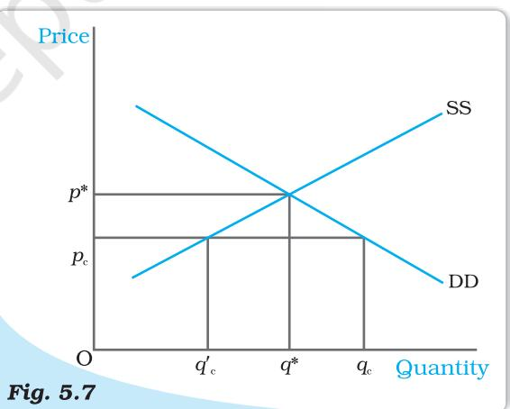

*Effect of Price Ceiling in Wheat Market. The equilibrium price and quantity are* p* *and* q* *respectively. Imposition of price ceiling at* pc *gives rise to excess demand in the wheat market.*

consumers, it could end up creating shortage of wheat. How is the quantity of wheat *(q' c* ) then distributed among the consumers? One way of doing this is to distribute it to everyone, through a system of rationing. Ration coupons are issued to the consumers so that no individual can buy more than a certain amount of wheat and this stipulated amount of wheat is sold through ration shops which are also called fair price shops.

In general, price ceiling accompanied by rationing of the goods may have the following adverse consequences on the consumers: (a) Each consumer has to stand in long queues to buy the good from ration shops. (b) Since all consumers will not be satisfied by the quantity of the goods that they get from the fair price shop, some of them will be willing to pay higher price for it. This may result in the creation of black market.

#### 5.2.2 Price Floor

For certain goods and services, fall in price below a particular level is not desirable and hence the government sets floors or minimum prices for these goods and services. The governmentimposed lower limit on the price that may be charged for a particular good or service is called price floor. Most well-known examples of imposition of price floor are agricultural price support programmes and the minimum wage legislation.

Through an agricultural price support programme, the government imposes a lower limit on the purchase price for some of

the agricultural goods and the floor is normally set at a level higher than the market-determined price for these goods. Similarly, through the minimum wage legislation, the government ensures that the wage rate of the labourers does not fall below a particular level and here again the minimum wage rate is set above the equilibrium wage rate.

Figure 5.8 shows the market supply and the market demand curve for a commodity on which price floor is imposed. The market equilibrium here would occur at price *p* * and quantity *q**. But when the government imposes a floor higher than the equilibrium price at *pf* , the market demand is *qf* whereas the firms want to supply *q* ′*f ,* thereby leading to an excess supply in the market equal to *qf q* ′*f* .

In the case of agricultural support, to prevent price from falling because of excess supply, government needs to buy the surplus at the predetermined price.

- *•* In a perfectly competitive market, equilibrium occurs where market demand equals market supply.
- *•* The equilibrium price and quantity are determined at the intersection of the market demand and market supply curves when there is fixed number of firms.
- *•* Each firm employs labour upto the point where the marginal revenue product of labour equals the wage rate.
- *•* With supply curve remaining unchanged when demand curve shifts rightward (leftward), the equilibrium quantity increases (decreases) and equilibrium price increases (decreases) with fixed number of firms.

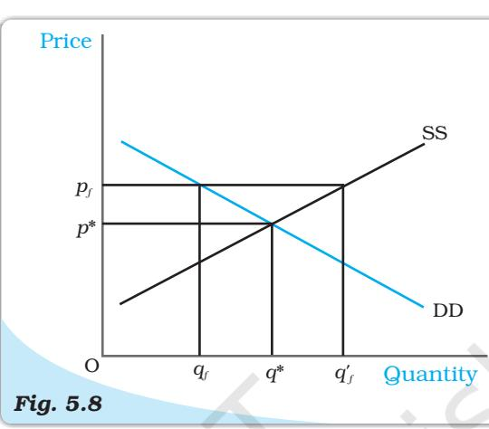

*Effect of Price Floor on the Market for Goods . The market equilibrium is at (p**, *q* **). Imposition of price floor at pf gives rise to an excess supply.*

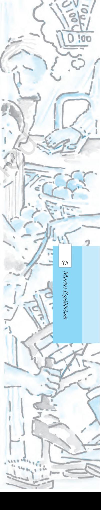

- *•* With demand curve remaining unchanged when supply curve shifts rightward (leftward), the equilibrium quantity increases (decreases) and equilibrium price decreases (increases) with fixed number of firms.
- *•* When both demand and supply curves shift in the same direction, the effect on equilibrium quantity can be unambiguously determined whereas the effect on equilibrium price depends on the magnitude of the shifts.
- *•* When demand and supply curves shift in opposite directions, the effect on equilibrium price can be unambiguously determined whereas the effect on equilibrium quantity depends on the magnitude of the shifts.
- *•* In a perfectly competitive market with identical firms if the firms can enter and exit the market freely, the equilibrium price is always equal to minimum average cost of the firms.
- *•* With free entry and exit, the shift in demand has no impact on equilibrium price but changes the equilibrium quantity and number of firms in the same direction as the change in demand.
- *•* In comparison to a market with fixed number of firms, the impact of a shift in demand curve on equilibrium quantity is more pronounced in a market with free entry and exit.
- *•* Imposition of price ceiling below the equilibrium price leads to an excess demand.
- *•* Imposition of price floor above the equilibrium price leads to an excess supply.

Equilibrium Excess demand

Excess supply

Key Concepts

Exercises

ExercisesExercises

ey Conceptsey Concepts

Marginal revenue product of labour

Value of marginal product of labour

Price ceiling, Price floor

1. Explain market equilibrium.

- 2. When do we say there is excess demand for a commodity in the market?
- 3. When do we say there is excess supply for a commodity in the market?
- 4. What will happen if the price prevailing in the market is
	- (i) above the equilibrium price?
	- (ii) below the equilibrium price?
- 5. Explain how price is determined in a perfectly competitive market with fixed number of firms.
- 6. Suppose the price at which equilibrium is attained in exercise 5 is above the minimum average cost of the firms constituting the market. Now if we allow for free entry and exit of firms, how will the market price adjust to it?
- 7. At what level of price do the firms in a perfectly competitive market supply when free entry and exit is allowed in the market? How is equilibrium quantity determined in such a market?
- 8. How is the equilibrium number of firms determined in a market where entry and exit is permitted?
- 9. How are equilibrium price and quantity affected when income of the consumers (a) increase? (b) decrease?
- 10. Using supply and demand curves, show how an increase in the price of shoes affects the price of a pair of socks and the number of pairs of socks bought and sold.
- 11. How will a change in price of coffee affect the equilibrium price of tea? Explain the effect on equilibrium quantity also through a diagram.
- 12. How do the equilibrium price and quantity of a commodity change when price of input used in its production changes?
- 13.If the price of a substitute(Y) of good X increases, what impact does it have on the equilibrium price and quantity of good X?
- 14. Compare the effect of shift in demand curve on the equilibrium when the number of firms in the market is fixed with the situation when entry-exit is permitted.
- 15. Explain through a diagram the effect of a rightward shift of both the demand and supply curves on equilibrium price and quantity.
- 16. How are the equilibrium price and quantity affected when
	- (a) both demand and supply curves shift in the same direction?
	- (b) demand and supply curves shift in opposite directions?
- 17.In what respect do the supply and demand curves in the labour market differ from those in the goods market?
- 18. How is the optimal amount of labour determined in a perfectly competitive market?
- 19. How is the wage rate determined in a perfectly competitive labour market?
- 20. Can you think of any commodity on which price ceiling is imposed in India? What may be the consequence of price-ceiling?
- 21.A shift in demand curve has a larger effect on price and smaller effect on quantity when the number of firms is fixed compared to the situation when free entry and exit is permitted. Explain.
- 22.Suppose the demand and supply curve of commodity X in a perfectly competitive market are given by:

*q D* = 700 *– p*

$$q^{s}=500+3p{\mathrm{~for~}}p\geq15$$

= 0 for 0 ≤ *p <* 15

Assume that the market consists of identical firms. Identify the reason behind the market supply of commodity X being zero at any price less than Rs 15. What will be the equilibrium price for this commodity? At equilibrium, what quantity of X will be produced?

- 23. Considering the same demand curve as in exercise 22, now let us allow for free entry and exit of the firms producing commodity X. Also assume the market consists of identical firms producing commodity X. Let the supply curve of a single firm be explained as
q S *f* = 8 + 3*p* for *p* ≥ 20

= 0 for 0 ≤ *p <* 20

- (a) What is the significance of *p* = 20?
- (b) At what price will the market for X be in equilibrium? State the reason for your answer.
- (c) Calculate the equilibrium quantity and number of firms.

24.Suppose the demand and supply curves of salt are given by:

*D* = 1,000 *– p q S* = 700 + 2*p*

- (a) Find the equilibrium price and quantity.
- (b) Now suppose that the price of an input used to produce salt has increased so that the new supply curve is

*q S* = 400 + 2*p*

*q*

How does the equilibrium price and quantity change? Does the change conform to your expectation?

- (c) Suppose the government has imposed a tax of Rs 3 per unit of sale of salt. How does it affect the equilibrium price and quantity?
- 25. Suppose the market determined rent for apartments is too high for common people to afford. If the government comes forward to help those seeking apartments on rent by imposing control on rent, what impact will it have on the market for apartments?

88

Introductory Microeconomics

Average cost Total cost per unit of output.

Average fixed cost Total fixed cost per unit of output.

Average product Output per unit of the variable input.

Average revenue Total revenue per unit of output.

Average variable cost Total variable cost per unit of output.

Break-even point is the point on the supply curve at which a firm earns normal profit.

Budget line consists of all bundles which cost exactly equal to the consumer's income.

Budget set is the collection of all bundles that the consumer can buy with her income at the prevailing market prices.

Constant returns to scale is a property of production function that holds when a proportional increase in all inputs results in an increase in output by the same proportion.

Cost function For every level of output, it shows the minimum cost for the firm.

Decreasing returns to scale is a property of production function that holds when a proportional increase in all inputs results in an increase in output by less than the proportion.

Demand curve is a graphical representation of the demand function. It gives the quantity demanded by the consumer at each price.

Demand function A consumer's demand function for a good gives the amount of the good that the consumer chooses at different levels of its price when the other things remain unchanged.

Duopoly is a market with just two firms.

Equilibrium is a situation where the plans of all consumers and firms in the market match.

Excess demand If at a price market, demand exceeds market supply, it is said that excess demand exists in the market at that price.

Excess supply If at a price market, supply is greater than market demand, it is said that there is excess supply in the market at that price.

Firm's supply curve shows the levels of output that a profitmaximising firm will choose to produce at different values of the market price.

Fixed input An input which cannot be varied in the short run is called a fixed input.

Income effect The change in the optimal quantity of a good when the purchasing power changes consequent upon a change in the price of the good is called the income effect.

Increasing returns to scale is a property of production function that holds when a proportional increase in all inputs results in an increase in output by more than the proportion.

Indifference curve is the locus of all points among which the consumer is indifferent.

Inferior good A good for which the demand decreases with increase in the income of the consumer is called an inferior good.

Isoquant is the set of all possible combinations of the two inputs that yield the same maximum possible level of output.

Law of demand If a consumer's demand for a good moves in the same direction as the consumer's income, the consumer's demand for that good must be inversely related to the price of the good.

Law of diminishing marginal product If we keep increasing the employment of an input with other inputs fixed then eventually a point will be reached after which the marginal product of that input will start falling.

Law of variable proportions The marginal product of a factor input initially rises with its employment level when the level of employment of the input is low. But after reaching a certain level of employment, it starts falling.

Long run refers to a time period in which all factors of production can be varied.

Marginal cost Change in total cost per unit of change in output.

Marginal product Change in output per unit of change in the input when all other inputs are held constant.

Marginal revenue Change in total revenue per unit change in sale of output.

Marginal revenue product(MRP) of a factor Marginal Revenue times Marginal Product of the factor.

Market supply curve shows the output levels that firms in the market produce in aggregate corresponding to different values of the market price.

Monopolistic competition is a market structure where there exit a very large number of sellers selling differentiated but substitutable products.

Monopoly A market structure in which there is a single seller and there are sufficient restrictions to prevent any other seller from entering the market.

Monotonic preferences A consumer's preferences are monotonic if and only if between any two bundles, the consumer prefers the bundle which has more of at least one of the goods and no less of the other good as compared to the other bundle.

Normal good A good for which the demand increases with increase in the income of the consumer is called a normal good.

Normal profit The profit level that is just enough to cover the explicit costs and opportunity costs of the firm is called the normal profit.

Oligopoly A market consisting of more than one (but few) sellers is called a oligopoly. Opportunity cost of some activity is the gain foregone from the second best activity. Perfect competition A market environment wherein (i) all firms in the market

produce the same good and (ii) buyers and sellers are price-takers.

Price ceiling The government-imposed upper limit on the price of a good or service is called price ceiling.

Price elasticity of demand for a good is defined as the percentage change in demand for the good divided by the percentage change in its price.

89

Glossary

Price elasticity of supply is the percentage change in quantity supplied due to a one per cent change in the market price of the good.

Price floor The government-imposed lower limit on the price that may be charged for a particular good or service is called price floor.

Price line is a horizontal straight line that shows the relationship between market price and a firm's output level.

Production function shows the maximum quantity of output that can be produced by using different combinations of the inputs.

Profit is the difference between a firm's total revenue and its total cost of production.

Short run refers to a time period in which some factors of production cannot be varied.

Shut down point In the short run, it is the minimum point of AVC curve and in the long run, it is the minimum point of LRAC curve.

Substitution effect The change in the optimal quantity of a good when its price changes and the consumer's income is adjusted so that she can just buy the bundle that she was buying before the price change is called the substitution effect.

Super-normal profit Profit that a firm earns over and above the normal profit is called the super-normal profit.

Total cost is the sum of total fixed cost and total variable cost.

Total fixed cost The cost that a firm incurs to employ fixed inputs is called the total fixed cost.

Total physical product Same as the total product.

Total product If we vary a single input keeping all other inputs constant, then for different levels of employment of that input we get different levels of output from the production function. This relationship between the variable input and output is referred to as total product.

Total return Same as the total product.

Total revenue is equal to the market price of the good multiplied by the quantity of the good sold by a firm.

Total revenue curve shows the relationship between firm's total revenue and firm's output level.

Total variable cost The cost that a firm incurs to employ variable inputs is called the total variable cost.

Value of marginal product (VMP) of a factor Price times Marginal Product of the factor.

Variable input An input the amount of which can be varied.

