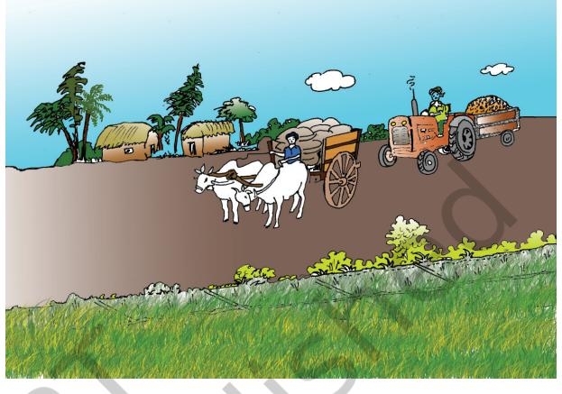
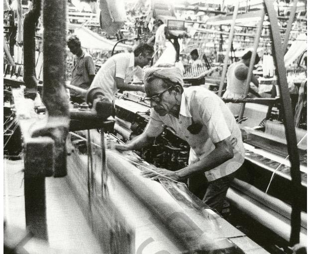
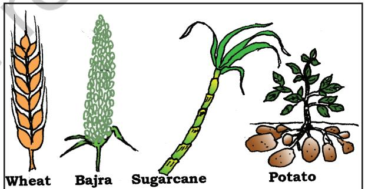
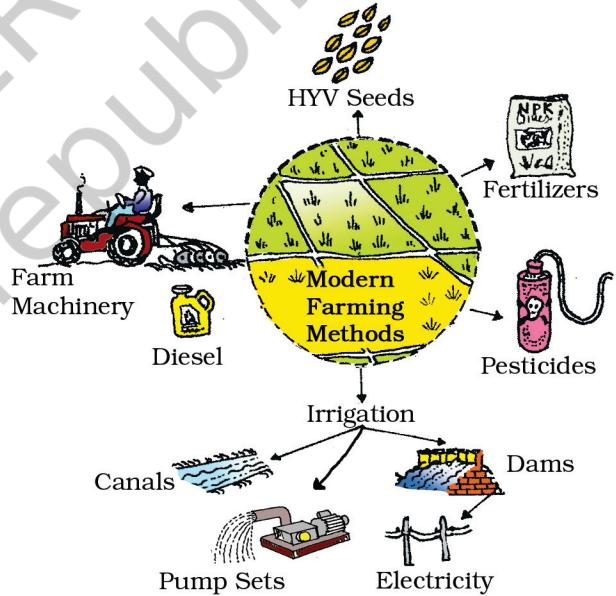
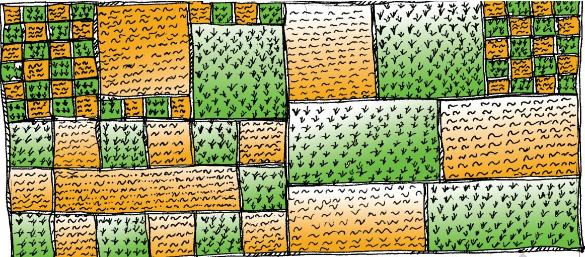
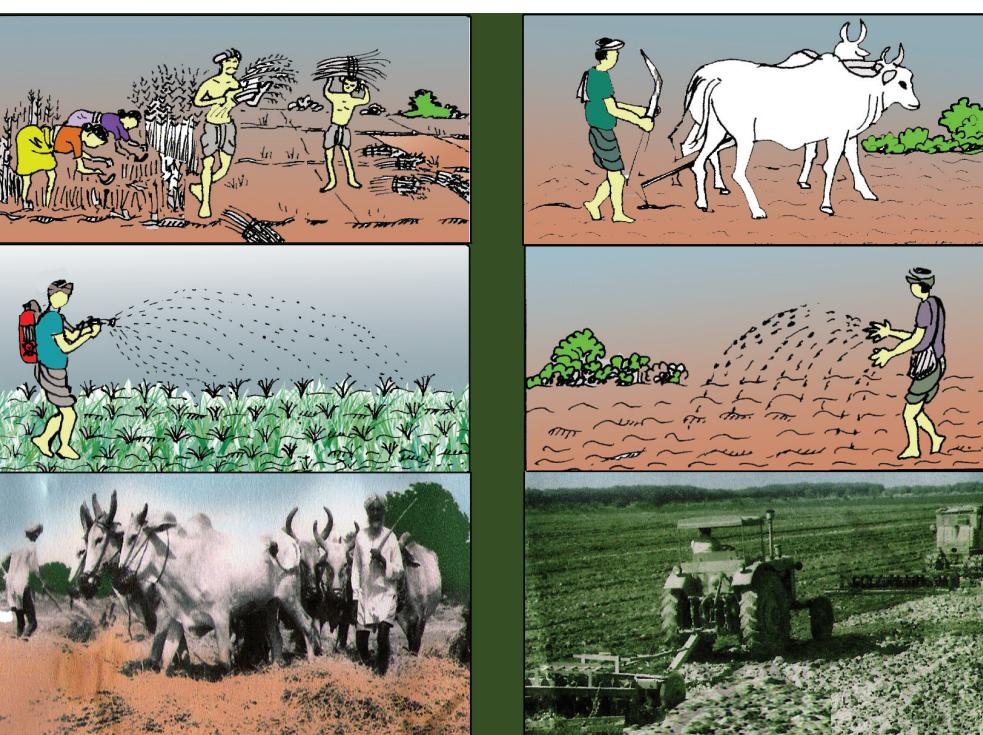
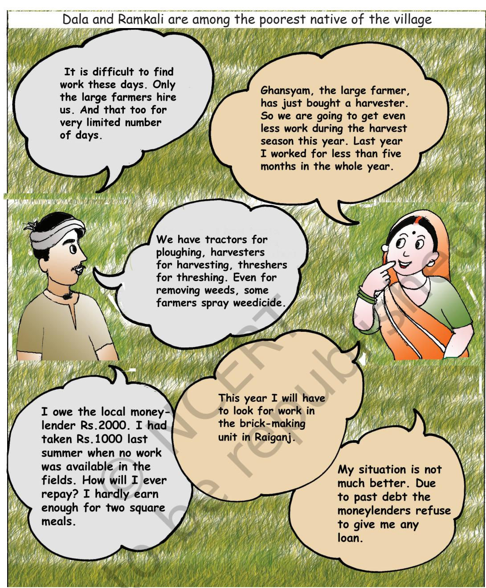

#### Overview

1

Chapter

The purpose of the story is to introduce some basic concepts relating to production and this we do through a story of a hypothetical village called Palampur.*

Farming is the main activity in Palampur, whereas several other activities such as small scale manufacturing, dairy, transport, etc. are carried out on a limited scale. These production activities need various types of resources — natural resources, manmade items, human effort, money, etc. As we read through the story of Palampur, we will learn how various resources combine to produce the desired goods and services in the village.

#### Introduction

Palampur is well-connected with neighbouring villages and towns. Raiganj, a big village, is 3 kms from Palampur. An all weather road connects the village to Raiganj and further on to the nearest small town of Shahpur. Many kinds of transport are visible on this road starting from bullock carts, *tongas*, bogeys (wooden cart drawn by buffalos) loaded with jaggery (*gur*) and other commodities to motor vehicles like motorcycles, jeeps, tractors and trucks.

This village has about 450 families belonging to several different castes. The 80 upper caste families own the majority of land in the village. Their houses, some of them quite large, are made of brick with cement plastering. The SCs (dalits) comprise one third of the population and live in one corner of the village and in much smaller houses some of which are of mud and straw. Most of the houses have

Picture 1.1 *Scene of a village*

electric connections. Electricity powers all the tubewells in the fields and is used in various types of small business. Palampur has two primary schools and one high school. There is a primary health centre run by the government and one private dispensary where the sick are treated.

- The description above shows that Palampur has fairly well-developed system of roads, transport, electricity, irrigation, schools and health centre. Compare these facilities with those in your nearby village.
The story of Palampur, an imaginary village, will take us through the different types of production activities in the village. In villages across India, farming is the main production activity. The other production activities, referred to as nonfarm activities include small manufacturing, transport, shop-keeping, etc. We shall take a look at both these types of activities, after learning a few general things about production.

- 
The Story of Village Palampur 1

* The narrative is partly based on a research study by Gilbert Etienne of a village in Bulandshahr district in Western Uttar Pradesh.

#### Organisation of Production

The aim of production is to produce the goods and services that we want. There are four requirements for production of goods and services.

The first requirement is land, and other natural resources such as water, forests, minerals.

The second requirement is labour, i.e. people who will do the work. Some production activities require highly educated workers to perform the necessary tasks. Other activities require workers who can do manual work. Each worker is providing the labour necessary for production.

The third requirement is physical capital, i.e. the variety of inputs required at every stage during production. What are the items that come under physical capital?

- (a) *Tools, machines, buildings:* Tools and machines range from very simple tools such as a farmer's plough to sophisticated machines such as generators, turbines, computers, etc. Tools, machines, buildings can be used in production over many years, and are called fixed capital.
- (b) *Raw materials and money in hand:* Production requires a variety of raw materials such as the yarn used by the weaver and the clay used by the potter. Also, some money is always required during production to make payments and buy other necessary items. Raw materials and money in hand are called working capital. Unlike tools, machines and buildings, these are used up in production.

There is a fourth requirement too. You will need knowledge and enterprise to be able to put together land, labour and physical capital and produce an output either to use yourself or to sell in the market. This these days is called human capital. We shall learn more about human capital in the next chapter.

- In the picture, identify the land, labour and fixed capital used in production.

Picture 1.2 *A factory, with several labourers and machines*

Every production is organised by combining land, labour, physical capital and human capital, which are known as factors of production. As we read through the story of Palampur, we will learn more about the first three factors of production. For convenience, we will refer to the physical capital as the capital in this chapter.

#### Farming in Palampur

#### 1. Land is fixed

Farming is the main production activity in Palampur. 75 per cent of the people who are working are dependent on farming for their livelihood. They could be farmers or farm labourers. The wellbeing of these people is closely related to production on the farms.

But remember that there is a basic constraint in raising farm production. Land area under cultivation is practically fixed. Since 1960 in Palampur, there has been no expansion in land area under

2 Economics

cultivation. By then, some of the wastelands in the village had been converted to cultivable land. There exists no further scope to increase farm production by bringing new land under cultivation.

The standard unit of measuring land is hectare, though in the villages you may find land area being discussed in local units such as *bigha, guintha* etc. One hectare equals the area of a square with one side measuring 100 metres. Can you compare the area of a 1 hectare field with the area of your school ground?

#### 2. Is there a way one can grow more from the same land?

In the kind of crops grown and facilities available, Palampur would resemble a village of the western part of the state of Uttar Pradesh. All land is cultivated in Palampur. No land is left idle. During the rainy season (kharif) farmers grow jowar and bajra. These plants are used as cattle feed. It is followed by cultivation of potato between October and December. In the winter season (rabi), fields are sown with wheat. From the wheat produced, farmers keep enough wheat for the family's consumption and sell the surplus wheat at the market at Raiganj. A part of the land area is also devoted to sugarcane which is harvested once every year. Sugarcane, in its raw form, or as jaggery, is sold to traders in Shahpur.

The main reason why farmers are able to grow three different crops in a year in Palampur is due to the well-developed system of irrigation. Electricity came early to Palampur. Its major impact was to transform the system of irrigation. Persian wheels were, till then, used by farmers to draw water from the wells and irrigate small fields. People saw that the electric-run tubewells could irrigate much larger areas of land more effectively. The first few tubewells were installed by the government. Soon, however, farmers started setting up private tubewells. As a result, by mid-1970s the entire cultivated area of 200 hectares (ha.) was irrigated.

Not all villages in India have such high levels of irrigation. Apart from the riverine plains, coastal regions in our country are well-irrigated. In contrast, plateau regions such as the Deccan plateau have low levels of irrigation. Of the total cultivated area in the country a little less than 40 per cent is irrigated even today. In the remaining areas, farming is largely dependent on rainfall.

To grow more than one crop on a piece of land during the year is known as multiple cropping. It is the most common way of increasing production on a given piece of land. All farmers in Palampur grow atleast two main crops; many are growing potato as the third crop in the past fifteen to twenty years.

Picture 1.3 *Different crops*

# Let's Discuss

- The following Table1.1 shows the land under cultivation in India in units of million hectares. Plot this on the graph provided. What does the graph show? Discuss in class.

The Story of Village Palampur 3

| Table 1.1: Cultivated area over the years |
| --- |

| Year | Cultivated Area |
| --- | --- |
|  | (in Million ctares) |
| 1950–51 | 132 |
| 1990–91 | 186 |
| 2000–01 | 186 |
| 2010–11 (P) | 198 |
| 2011–12 (P) | 196 |
| 2012–13 (P) | 194 |
| 2013–14 (P) | 201 |
| 2014–15 (P) | 198 |
| 2015–16 (P) | 197 |
| 2016–17 (P) | 200 |

#### (P) - Provisional Data

*Source:* Pocket Book of Agriculture Statistics 2020, Directorate of Economics and Statistics, Department of Agriculture, Cooperation and Farmers Welfare.

Cultivated area (in million hectares)

- Is it important to increase the area under irrigation? Why?
- You have read about the crops grown in Palampur. Fill the following table based on information on the crops grown in your region.

You have seen that one way of increasing production from the same land is by multiple cropping. The other way is to use modern farming methods for higher yield. Yield is measured as crop produced on a given piece of land during a single season. Till the mid-1960s, the seeds used in cultivation were traditional ones with relatively low yields. Traditional seeds needed less irrigation. Farmers used cow-dung and other natural manure as fertilizers. All these were readily available with the farmers who did not have to buy them.

The Green Revolution in the late 1960s introduced the Indian farmer to cultivation of wheat and rice using high yielding varieties (HYVs) of seeds. Compared to the traditional seeds, the HYV seeds promised to produce much greater amounts of grain on a single plant. As a result, the same piece of land would now produce far larger quantities of foodgrains than was possible earlier. HYV seeds, however, needed plenty of water and also chemical fertilizers and pesticides to produce best results.

Picture 1.4 *Modern Farming Methods: HYV seeds, chemical fertilizer etc.*

|
|  |

4 Economics

Higher yields were possible only from a combination of HYV seeds, irrigation, chemical fertilisers, pesticides, etc.

Farmers of Punjab, Haryana and Western Uttar Pradesh were the first to try out the modern farming method in India. The farmers in these regions set up tubewells for irrigation, and made use of HYV seeds, chemical fertilisers and pesticides in farming. Some of them bought farm machinery, like tractors and threshers, which made ploughing and harvesting faster. They were rewarded with high yields of wheat.

In Palampur, the yield of wheat grown from the traditional varieties was 1300 kg per hectare. With HYV seeds, the yield went up to 3200 kg per hectare. There was a large increase in the production of wheat. Farmers now had greater amounts of surplus wheat to sell in the markets.

- *Let's Discuss*
- What is the difference between multiple cropping and modern farming method?
- The following table shows the production of wheat and pulses in India after the Green Revolution in units of million tonnes. Plot this on a graph. Was the Green Revolution equally successful for both the crops? Discuss.
- What is the working capital required by the farmer using modern farming methods?

Table 1.2: Production of pulses and wheat ( in Million Tonnes)

|  | Production | Production |
| --- | --- | --- |
|  | of Pulses | of Wheat |
| 1965 - 66 | 10 | 10 |
| 1970 - 71 | 12 | 24 |
| 1980 - 81 | 11 | 36 |
| 1990 - 91 | 14 | 55 |
| 2000 - 01 | 11 | 70 |
| 2010 - 11 | 18 | 87 |
| 2012 - 13 | 18 | 94 |
| 2013 - 14 | 19 | 96 |
| 2014 - 15 | 17 | 87 |
| 2015 - 16 | 17 | 94 |
| 2016 - 17 | 23 | 99 |
| 2017 - 18 | 25 | 100 |
| 2018 - 19 | 23 | 104 |
| 2019 - 20 | 23 | 108 |
| 2020 - 21 | 25 | 110 |
| 2021 - 22 | 28 | 107 |

*Source: Source:* Pocket book of agricultural Statistics 2022, Directorate of Economics and Statistics, Department of Agriculture, Cooperation and Farmers Welfare.

• Modern farming methods require the farmer to start with more cash than before. Why?

## *Suggested Activity*

- During your field visit talk to some farmers of your region. Find out:
- 1. What kind of farming methods modern or traditional or mixed — do the farmers use? Write a note.
- 2. What are the sources of irrigation?
- 3. How much of the cultivated land is irrigated? (very little/nearly half/ majority/all)
- 4. From where do farmers obtain the inputs that they require?

## 3. Will the land sustain?

Land being a natural resource, it is necessary to be careful in its use. Scientific reports indicate that the modern farming methods have overused the natural resource base.

In many areas, Green Revolution is associated with the loss of soil fertility due to increased use of chemical fertilisers. Also, continuous use of groundwater for tubewell irrigation has led to the depletion of the water-table. Environmental resources, like soil fertility and groundwater, are built up over years. Once destroyed it is very difficult to restore them. We must take care of the environment to ensure future development of agriculture.

#### *Suggested Activity*

- After reading the following reports from newspapers/magazines, write a letter to the Agriculture Minister in your own words telling him how the use of chemical fertilisers can be harmful.
...Chemical fertilisers provide minerals which dissolve in water and are immediately available to plants. But these may not be retained in the

The Story of Village Palampur 5

Picture 1.5 *Palampur village: Distribution of cultivated land*

soil for long. They may escape from the soil and pollute groundwater, rivers and lakes. Chemical fertilizers can also kill bacteria and other microorganisms in the soil. This means some time after their use, the soil will be less fertile than ever before....*(Source:* Down to Earth, New Delhi)

.....The consumption of chemical fertilizers in Punjab is highest in the country. The continuous use of chemical fertilizers has led to degradation of soil health. Punjab farmers are now forced to use more and more chemical fertilizers and other inputs to achieve the same production level. This means cost of cultivation is rising very fast.....*(Source:* The Tribune, Chandigarh)

#### 4. How is land distributed between the farmers of Palampur?

You must have realised how important land is for farming. Unfortunately, not all the people engaged in agriculture have sufficient land for cultivation. In Palampur, about one third of the 450 families are landless, i.e. 150 families, most of them dalits, have no land for cultivation.

Of the remaining families who own

6 Economics

land, 240 families cultivate small plots of land less than 2 hectares in size. Cultivation of such plots doesn't bring adequate income to the farmer family.

In 1960, Gobind was a farmer with 2.25 hectares of largely unirrigated land. With the help of his three sons Gobind cultivated the land. Though they didn't live very comfortably, the family managed to feed itself with a little bit of extra income from one buffalo that the family possessed. Some years after Gobind's death, this land was divided among his three sons. Each one now has a plot of land that is only 0.75 hectare in size. Even with improved irrigation and modern farming method, Gobind's sons are not able to make a living from their land. They have to look for additional work during part of the year.

You can see the large number of small plots scattered around the village in the picture. These are cultivated by the small farmers. On the other hand, more than half the area of the village is covered by plots that are quite large in size. In Palampur, there are 60 families of medium and large farmers who cultivate more than 2 hectares of land. A few of the large farmers have land extending over 10 hectares or more.

Picture 1.6 *Work on the fields: Wheat crop ploughing by bullocks, sowing, spraying of insecticides, cultivation by traditional method, cultivation by modern method, and cutting of crops.*

# Let's Discuss

- In the Picture 1.5, can you shade the land cultivated by the small farmers?
- Why do so many families of farmers cultivate such small plots of land?
- The distribution of farmers in India and the amount of land they cultivate is given in the following Graph 1.1. Discuss in the classroom.

*Source:* Pocket Book of Agriculture Statistics 2020 and State of Indian Agriculture 2020, Department of Agriculture, Cooperation and Farmers Welfare.

## Let's Discuss

- Would you agree that the distribution of cultivated land is unequal in Palampur? Do you find a similar situation for India? Explain.
## 5. Who will provide the labour?

After land, labour is the next necessary factor for production. Farming requires a great deal of hard work. Small farmers along with their families cultivate their own fields. Thus, they provide the labour required for farming themselves. Medium and large farmers hire farm labourers to work on their fields.

## Let's Discuss

- Identify the work being done on the field in the Pictures 1.6 and arrange them in a proper sequence.
Farm labourers come either from landless families or families cultivating small plots of land. Unlike farmers, farm labourers do not have a right over the

The Story of Village Palampur 7

Picture 1.7 *The conversation between Dala and Ramkali*

crops grown on the land. Instead they are paid wages by the farmer for whom they work. Wages can be in cash or in kind e.g. crop. Sometimes labourers get meals also. Wages vary widely from region to region, from crop to crop, from one farm activity to another (like sowing and harvesting). There is also a wide variation in the duration of employment. A farm labourer might be employed on a daily basis, or for one particular farm activity like harvesting, or for the whole year.

Dala is a landless farm labourer who works on daily wages in Palampur. This means he must regularly look for work. The minimum wages for a farm labourer set by the government is Rs 300 per day (March 2019), but Dala gets only Rs 160. There is

8 Economics

heavy competition for work among the farm labourers in Palampur, so people agree to work for lower wages. Dala complains about his situation to Ramkali, who is another farm labourer.

Both Dala and Ramkali are among the poorest people in the village.

## Let's Discuss

- Why are farm labourers like Dala and Ramkali poor?
- Gosaipur and Majauli are two villages in North Bihar. Out of a total of 850 households in the two villages, there are more than 250 men who are employed in rural Punjab and Haryana or in Delhi, Mumbai, Surat, Hyderabad or Nagpur. Such migration is common in most villages across India. Why do people migrate? Can you describe (based on your imagination) the work that the migrants of Gosaipur and Majauli might do at the place of destination?
- 6. The capital needed in farming

You have already seen that the modern farming methods require a great deal of capital, so that the farmer now needs more money than before.

- 1. Most small farmers have to borrow money to arrange for the capital. They borrow from large farmers or the village moneylenders or the traders who supply various inputs for cultivation. The rate of interest on such loans is very high. They are put to great distress to repay the loan.
Savita is a small farmer. She plans to cultivate wheat on her 1 hectare of land. Besides seeds, fertilizers and pesticides, she needs cash to buy water and repair her farm instruments. She estimates that the working capital itself would cost a minimum of Rs 3,000. She doesn't have the money, so she decides to borrow from Tejpal Singh, a large farmer. Tejpal Singh agrees to give Savita the loan at an interest rate of 24 per cent for four months, which is a very high interest rate. Savita also has to promise to work on his field as a farm labourer during the harvest season at Rs 100 per day. As you can tell, this wage is quite low. Savita knows that she will have to work very hard to complete harvesting on her own field, and then work as a farm labourer for Tejpal Singh. The harvest time is a very busy time. As a mother of three children she has a lot of household responsibilities. Savita agrees to these tough conditions as she knows getting a loan is difficult for a small farmer.

- 2. In contrast to the small farmers, the medium and large farmers have their own savings from farming. They are thus able to arrange for the capital needed. How do these farmers have their own savings? You shall find the answer in the next section.
#### Let's discuss the story so far....

We have read about the three factors of production—land, labour and capital and how they are used in farming. Let us fill in the blanks given below.

Among the three factors of production, we found that labour is the most abundant factor of production. There are many people who are willing to work as farm labourers in the villages, whereas the opportunities of work are limited. They belong to either landless families or

. They are paid low wages, and lead a difficult life.

In contrast to labour, is a scarce factor of production. Cultivated land area is . Moreover, even the existing land is distributed *(equally/unequally)* among the people engaged in farming. There are a large number of small farmers who cultivate small plots of land and live in

The Story of Village Palampur 9

conditions not much better than the landless farm labourer. To make the maximum use of the existing land, farmers use and . Both these have led to increase in production of crops.

Modern farming methods require a great deal of . Small farmers usually need to borrow money to arrange for the capital, and are put to great distress to repay the loan. Therefore, capital too is a scarce factor of production, particularly for the small farmers.

Though both land and capital are scarce, there is a basic difference between the two factors of production. is a natural resource, whereas is man-made. It is possible to increase capital, whereas land is fixed. Therefore, it is very important that we take good care of land and other natural resources used in farming.

### 7. Sale of Surplus Farm Products

Let us suppose that the farmers have produced wheat on their lands using the three factors of production. The wheat is harvested and production is complete. What do the farmers do with the wheat? They retain a part of the wheat for the family's consumption and sell the surplus wheat. Small farmers like Savita and Gobind's sons have little surplus wheat because their total production is small and from this a substantial share is kept for their own family needs. So it is the medium and large farmers who supply wheat to the market. In the Picture 1.1, you can see the bullock cart streaming into the market each carrying loads of wheat. The traders at the market buy the wheat and sell it further to shopkeepers in the towns and cities.

Tejpal Singh, the large farmer, has a surplus of 350 quintals of wheat from all his lands! He sells the surplus wheat at the Raiganj market and has good earnings.

What does Tejpal Singh do with his earnings? Last year, Tejpal Singh had put most of the money in his bank account. Later he used the savings for lending to farmers like Savita who were in need of a loan. He also used the savings to arrange for the working capital for farming in the next season. This year Tejpal Singh plans to use his earnings to buy another tractor. Another tractor would increase his fixed capital.

Like Tejpal Singh, other large and medium farmers sell the surplus farm products. A part of the earnings is saved and kept for buying capital for the next season. Thus, they are able to arrange for the capital for farming from their own savings. Some farmers might also use the savings to buy cattle, trucks, or to set up shops. As we shall see, these constitute the capital for non-farm activities.

## Non-Farm Activities in Palampur

We have learnt about farming as the main production activity in Palampur. We shall now take a look at some of the non-farm production activities. Only 25 per cent of the people working in Palampur are engaged in activities other than agriculture.

### 1. Dairy — the other common activity

Dairy is a common activity in many families of Palampur. People feed their buffalos on various kinds of grass and the *jowar* and *bajra* that grows during the rainy season. The milk is sold in Raiganj, the nearby large village. Two traders from Shahpur town have set up collection cum chilling centres at Raiganj from where the milk is transported to far away towns and cities.

10 Economics

## Let's Discuss

- Let us take three farmers. Each has grown wheat on his field though the production is different (see Column 2). The consumption of wheat by each farmer family is the same (Column 3). The whole of surplus wheat this year is used as capital for next year's production. Also suppose, production is twice the capital used in production. Complete the tables.
#### Farmer 1

|  | Production | Consumption | Surplus = | Capital for the |
| --- | --- | --- | --- | --- |
|  |  |  | Production – Consumption | next year |
| Year 1 | 100 | 40 | 60 | 60 |
| Year 2 | 120 | 40 |  |  |
| Year 3 |  | 40 |  |  |

#### Farmer 2

|  | Production |  | Consumption | Surplus | Capital for the |
| --- | --- | --- | --- | --- | --- |
|  |  |  |  |  | next year |
| Year 1 |  | 80 | 40 |  |  |
| Year 2 |  |  | 40 |  |  |
| Year 3 |  |  | 40 |  |  |

#### Farmer 3

|  | Production | Consumption | Surplus | Capital for the next year |
| --- | --- | --- | --- | --- |
| Year 1 | 60 | 40 |  |  |
| Year 2 |  | 40 |  |  |
| Year 3 |  | 40 |  |  |

# Let's Discuss

- Compare the production of wheat by the three farmers over the years.
- What happens to Farmer 3 in Year 3? Can he continue production? What will he have to do to continue production?

### 2. An example of small-scale manufacturing in Palampur

At present, less than fifty people are engaged in manufacturing in Palampur. Unlike the manufacturing that takes place in the big factories in the towns and cities, manufacturing in Palampur involves very simple production methods

and are done on a small scale. They are carried out mostly at home or in the fields with the help of family labour. Rarely are labourers hired.

Mishrilal has purchased a mechanical sugarcane crushing machine run on electricity and has set it up on his field. Sugarcane crushing was earlier done with the help of bullocks, but people prefer to do it by machines these days. Mishrilal also buys sugarcane from other farmers and processes it into jaggery. The jaggery is then sold to traders at Shahpur. In the process, Mishrilal makes a small profit.

## Let's Discuss

- What capital did Mishrilal need to set up his jaggery manufacturing unit?
- Who provides the labour in this case?
- Can you guess why Mishrilal is unable to increase his profit?
- Could you think of any reasons when he might face a loss?
- Why does Mishrilal sell his jaggery to traders in Shahpur and not in his village?

### 3. The shopkeepers of Palampur

People involved in trade (exchange of goods) are not many in Palampur. The traders of Palampur are shopkeepers who buy various goods from wholesale markets in the cities and sell them in the village. You will see small general stores in the village selling a wide range of items like rice, wheat, sugar, tea, oil, biscuits, soap, toothpaste, batteries, candles, notebooks, pen, pencil, even some cloth. A few of the families whose houses are close to the bus stand have used a part of the space to open small shops. They sell eatables.

Kareem has opened a computer class centre in the village. In recent years a large number of students have been attending college in Shahpur town. Kareem found that a number of students from the village are also attending computer classes in the town. There were two women in the village who had a degree in computer applications. He decided to employ them. He bought computers and set up the classes in the front room of their house overlooking the market. High school students have started attending them in good numbers.

Let's Discuss

- In what ways is Kareem's capital and labour different from Mishrilal's?
- Why didn't someone start a computer centre earlier? Discuss the possible reasons.

## 4. Transport: a fast developing sector

There are variety of vehicles on the road connecting Palampur to Raiganj. *Rickshawallahs*, *tongawallahs,* jeep, tractor, truck drivers and people driving the traditional bullock cart and bogey are people in the transport services. They ferry people and goods from one place to another, and in return get paid for it. The number of people involved in transport has grown over the last several years.

Kishora is a farm labourer. Like other such labourers, Kishora found it difficult to meet his family's needs from the wages that he received. A few years back Kishora took a loan from the bank. This was under a government programme which was giving cheap loans to poor landless households. Kishora bought a buffalo with this money. He now sells the buffalo's milk.

12 Economics

Further, he has attached a wooden cart to his buffalo and uses it to transport various items. Once a week, he goes to the river Ganga to bring back clay for the potter. Or sometimes he goes to Shahpur with a load of jaggery or other commodities. Every month he gets some work in transport. As a result, Kishora is able to earn more than what he used to do some years back.

## Let's Discuss

- What is Kishora's fixed capital?
- What do you think would be his working capital?
- In how many production activities is Kishora involved?
- Would you say that K ishora has benefitted from better roads in Palampur?

## Summary

Farming is the main production activity in the village. Over the years there have been many important changes in the way farming is practiced. These have allowed the farmers to produce more crops from the same amount of land. This is an important achievement, since land is fixed and scarce. But in raising production a great deal of pressure has been put on land and other natural resources.

The new ways of farming need less land, but much more of capital. The medium and large farmers are able to use their own savings from production to arrange for capital during the next season. On the other hand, the small farmers who constitute about 80 per cent of total farmers in India, find it difficult to obtain capital. Because of the small size of their plots, their production is not enough. The lack of surplus means that they are unable to obtain capital from their own savings, and have to borrow. Besides the debt, many of the small farmers have to do additional work as farm labourers to feed themselves and their families.

Labour being the most abundant factor of production, it would be ideal if new ways of farming used much more labour. Unfortunately, such a thing has not happened. The use of labour on farms is limited. The labour, looking for opportunities is thus migrating to neighbouring villages, towns and cities. Some labour has entered the non-farm sector in the village.

At present, the non-farm sector in the village is not very large. Out of every 100 workers in the rural areas in India, only 24 are engaged in non-farm activities. Though there is a variety of non-farm activities in the villages (we have only seen a few examples), the number of people employed in each is quite small.

In the future, one would like to see more non-farm production activities in the village. Unlike farming, non-farm activities require little land. People with some amount of capital can set up non-farm activities. How does one obtain this capital? One can either use his own savings, but more often has to take a loan. It is important that loan be available at low rate of interest so that even people without savings can start some non-farm activity. Another thing which is essential for expansion of non-farm activities is to have markets where the goods and services produced can be sold. In Palampur, we saw the neighbouring villages, towns and cities provide the markets for milk, jaggery, wheat, etc. As more villages get connected to towns and cities through good roads, transport and telephone, it is possible that the opportunities for non-farm activities in the village would increase in the coming years.

The Story of Village Palampur 13

- 1. Every village in India is surveyed once in ten years during the Census and some of details are presented in the following format. Fill up the following based on information on Palampur.
	- a. LOCATION:
	- b. TOTAL AREA OF THE VILLAGE:
	- c. LAND USE (in hectares):

| Cultivated Land |  | Land not available for cultivation |
| --- | --- | --- |
| Irrigated | Unirrigated | (Area covering dwellings, roads, |
|  |  | ponds, grazing ground) |
|  |  | 26 hectares |

#### d. FACILITIES:

14 Economics

| Educational |
| --- |
| Medical |
| Market |
| Electricity Supply |
| Communication |
| Nearest Town |

- 2. Modern farming methods require more inputs which are manufactured in industry. Do you agree?
- 3. How did the spread of electricity help farmers in Palampur?
- 4. Is it important to increase the area under irrigation? Why?
- 5. Construct a table on the distribution of land among the 450 families of Palampur.
- 6. Why are the wages for farm labourers in Palampur less than minimum wages?
- 7. In your region, talk to two labourers. Choose either farm labourers or labourers working at construction sites. What wages do they get? Are they paid in cash or kind? Do they get work regularly? Are they in debt?
- 8. What are the different ways of increasing production on the same piece of land? Use examples to explain.
- 9. Describe the work of a farmer with 1 hectare of land.
- 10. How do the medium and large farmers obtain capital for farming? How is it different from the small farmers?
- 11. On what terms did Savita get a loan from Tajpal Singh? Would Savita's condition be different if she could get a loan from the bank at a low rate of interest?
- 12. Talk to some old residents in your region and write a short report on the changes in irrigation and changes in production methods during the last 30 years. (Optional)
- 13. What are the non-farm production activities taking place in your region? Make a short list.
- 14. What can be done so that more non-farm production activities can be started in villages?

- ETIENNE, GILBERT. 1985. *Rural Development in Asia*: *Meetings with Peasants*, Sage Publications, New Delhi.
- ETIENNE, GILBERT. 1988. *Food and Poverty: India's Half Won Battle*, Sage Publications, New Delhi.
- RAJ, K.N. 1991. 'Village India and its Political Economy' in C.T. Kurien (Edited) *Economy, Society and Development*, Sage Publications, New Delhi
- THORNER, DANIEL AND ALICE THORNER. 1962. *Land and Labour in India*, Asia Publishing House, Bombay.
- http://economictimes.indiatimes.com/news/policy/government-hikesminimumwage-for-agriculture-labourer/articleshow/57408252.cms

The Story of Village Palampur 15

