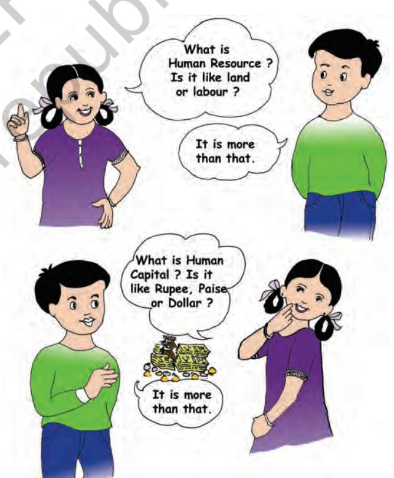
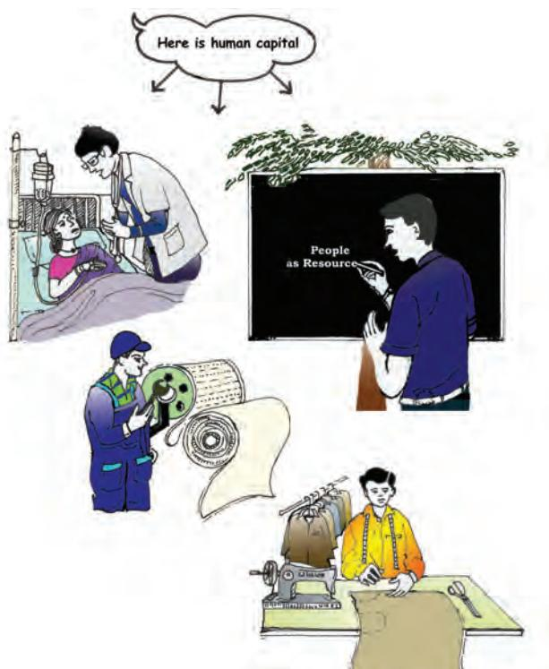
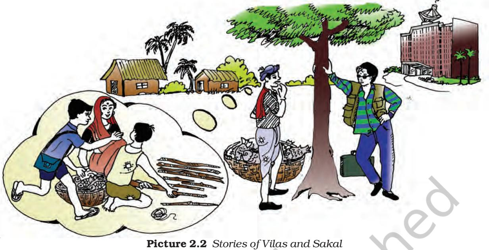
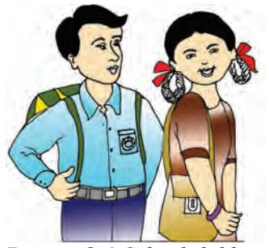
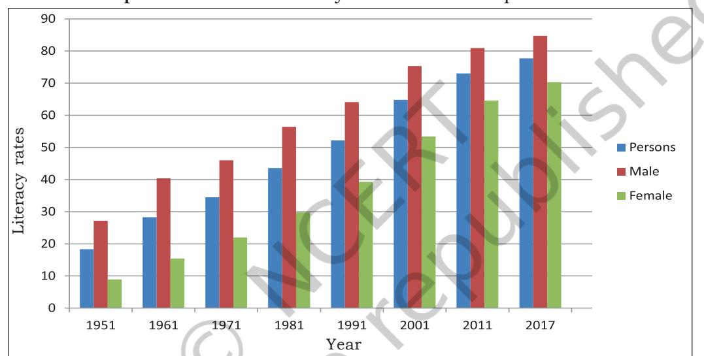
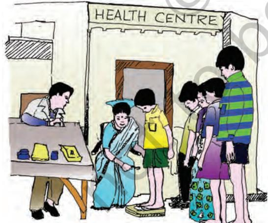
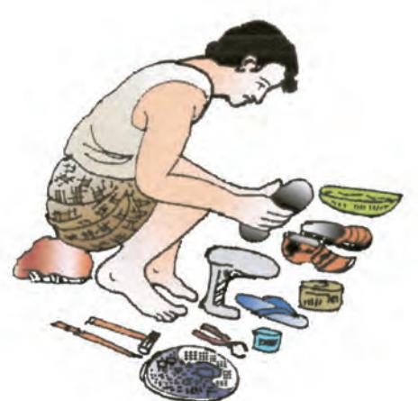

#### People as Resource People as Resource

## Overview

2

2

Chapter

The chapter 'People as Resource' is an effort to explain population as an asset for the economy rather than a liability. Population becomes human capital when there is investment made in the form of education, training and medical care. In fact, human capital is the stock of skill and productive knowledge embodied in them.

'People as Resource' is a way of referring to a country's working people in terms of their existing productive skills and abilities. Looking at the population from this productive aspect emphasises its ability to contribute to the creation of the Gross National Product. Like other resources population also is a resource — a 'human resource'. This is the positive side of a large population that is often overlooked when we look only at the negative side, considering only the problems of providing the population with food, education and access to health facilities. When the existing 'human resource' is further developed by becoming more educated and healthy, we call it 'human capital formation' that adds to the productive power of the country just like 'physical capital formation'.

Investment in human capital (through education, training, medical care) yields a return just like investment in physical capital. This can be seen directly in the form of higher incomes earned because of higher productivity of the more educated or the better trained persons, as well as the higher productivity of healthier people.

India's Green Revolution is a dramatic example of how the input of greater knowledge in the form of improved production technologies can rapidly increase the productivity of scarce land resources. India's IT revolution is a striking instance of how the importance of human capital has come to acquire a higher position than that of material, plant and machinery.

*Source*: Planning Commission, Govt. of India.

- Picture 2.1
# Let's Discuss

- Looking at the photograph can you explain how a doctor, teacher, engineer and a tailor are an asset to the economy?
Not only do the more educated and the healthier people gain through higher incomes, society also gains in other indirect ways because the advantages of a more educated or a healthier population spreads to those also who themselves were not directly educated or given health care. In fact, human capital is in one way superior to other resources like land and physical capital: human resource can make use of land and capital. Land and capital cannot become useful on its own!

For many decades in India, a large population has been considered a liability rather than an asset. But a large population need not be a burden for the economy. It can be turned into a productive asset by investment in human capital (for example, by spending resources on education and health for all, training of industrial and agricultural workers in the use of modern technology, useful scientific researches and so on).

The two following cases illustrate how people can try to become a more productive resource:

#### Story of Sakal

There were two friends Vilas and Sakal living in the same village Semapur. Sakal was a twelve-yearold boy. His mother Sheela looked after domestic chores. His father Buta Chaudhary worked in an agricultural field. Sakal helped his mother in domestic chores. He also looked after his younger brother Jeetu and sister Seetu. His uncle Shyam had passed the matriculation examination, but, was sitting idle in the house as he had no job. Buta and Sheela were eager to teach Sakal. They forced him to join the village school which he soon joined. He started studying and completed his higher secondary examination. His father persuaded him to continue his studies. He raised a loan for Sakal to study a vocational course in computers. Sakal was meritorious and interested in studies from the beginning. With great vigour and enthusiasm he completed his course. After some time he got a job in a private firm. He even designed a new kind of software. This software helped him increase the sale of the firm. His boss acknowledged his services and rewarded him with a promotion.

People as Resource 17

#### Story of Vilas

Vilas was an eleven-year old boy residing in the same village as Sakal. Vilas's father Mahesh was a fisherman. His father passed away when he was only two years old. His mother Geeta sold fish to earn money to feed the family. She bought fish from the landowner's pond and sold it in the nearby *mandi*. She could earn only Rs 150 a day by selling fish. Vilas became a patient of arthritis. His mother could not afford to take him to the doctor. He could not go to school either. He was not interested in studies. He helped his mother in cooking and also looked after his younger brother Mohan. After some time his mother fell sick and there was no one to look after her. There was no one in the family to support them. Vilas, too, was forced to sell fish in the same village. He like his mother earned only a meagre income.

# Let's Discuss

• Do you notice any difference between the two friends? What are those?

#### Activity

Visit a nearby village or a slum area and write down a case study of a boy or girl of your age facing the same condition as Vilas or Sakal.

In the two case studies we saw Sakal went to school and Vilas did not go. Sakal was physically strong and healthy. There was no need for him to visit the doctor frequently. Vilas was a patient of arthritis. He lacked the means to visit the doctor. Sakal acquired a degree in computer programming. Sakal found a job in a private firm while Vilas continued with the same work as his mother. He earned a meagre income like his mother to support a family.

In the case of Sakal, several years of education added to the quality of labour. This enhanced his total productivity. Total productivity adds to the growth of the economy. This in turn pays an

18 Economics

individual through salary or in some other form of his choice. In case of Vilas, there could not be any education or health care in the early part of his life. He spends his life selling fish like his mother. Henceforth, he draws the same salary of unskilled labourer as his mother.

Investment in human resource (via education and medical care) can give high rates of return in future. This investment on people is the same as investment in land and capital.

A child, too, with investments made on her education and health, can yield a high return in future in the form of higher earnings and greater contribution to the society. Educated parents are found to invest more heavily on the education of their child. This is because they have realised the importance of education for themselves. They are also conscious of proper nutrition and hygiene. They accordingly look after their children's needs for education at school and good health. A virtuous cycle is, thus, created in this case. In contrast, a vicious cycle may be created by disadvantaged parents, who themselves uneducated and lacking in hygiene, keep their children in a similarly disadvantaged state.

Countries, like Japan, have invested in human resource. They did not have any natural resource. These countries are developed/rich. They import the natural resource needed in their country. How did they become rich/developed? They have invested on people, especially in the field of education and health. These people have made efficient use of other resources, like land and capital. Efficiency and the technology evolved by people have made these countries rich/developed.

# Economic Activities by Men and Women

Like Vilas and Sakal, people have been engaged in various activities. We saw that Vilas sold fish and Sakal got a job in the firm. The various activities have been classified into three main sectors i.e., primary, secondary and tertiary. Primary sector includes agriculture, forestry, animal husbandry, fishing, poultry farming, mining and quarrying. Manufacturing is included in the secondary sector. Trade, transport, communication, banking, education, health, tourism, services, insurance, etc. are included in the tertiary sector. The activities in this sector result in the production of goods and services. These activities add value to the national income. These activities are called economic activities. Economic activities have two parts — market activities and non-market activities. Market activities involve remuneration to anyone who performs i.e., activity performed for pay or profit. These include production of goods or services, including government service. Non-market activities are the production for self-consumption. These can be

Picture 2.3 *Based on the picture can you classify these activities into three sectors?*

People as Resource 19

consumption and processing of primary product and own account production of fixed assets.

#### Activity

Visit a village or colony located near to your residential area and note down the various activities undertaken by the people of that village or colony.

If this is not possible, ask your neighbour what is their profession? In which of the three sectors will you categorise their work?

Say whether these activities are economic or non-economic activities: Vilas sells fish in the village market. Vilas cooks food for his family. Sakal works in the private firm. Sakal looks after his younger brother and sister.

Due to historical and cultural reasons there is a division of labour between men and women in the family. Women generally look after domestic chores and men work in the fields. Sakal's mother Sheela cooks food, cleans utensils, washes clothes, cleans the house and looks after her children. Sakal's father Buta cultivates the field, sells the produce in the market and earns money for the family.

Sheela is not paid for the services delivered for upbringing of the family. Buta earns money, which he spends on rearing his family. Women are not paid for their service delivered in the family. The household work done by women is not recognised in the National Income.

Geeta, mother of Vilas, earned an income by selling fish. Thus women are paid for their work when they enter the labour market. Their earning like that of their male counterpart is determined on the basis of education and skill. Education helps individual to make better use of the economic opportunities available before him. Education and skill are the major determinants of the earning of any individual in the market. A majority of women have meagre education and low skill formation. Women are paid low compared to men. Most women work where job security is not there. Various activities relating to legal protection is meagre. Employment in this sector is characterised by irregular and low income. In this sector there is an absence of basic facilities like maternity leave, childcare and other social security systems. However, women with high education and skill formation are paid at par with the men. Among the organised sector, teaching and medicine attract them the most. Some women have entered administrative and other services including job, that need high levels of scientific and technological competence. Ask your sister or your classmate what she would like to take up as a career?

# Quality of Population

The quality of population depends upon the literacy rate, health of a person indicated by life expectancy and skill formation acquired by the people of the country. The quality of the poulation ultimately decides the growth rate of the country. Literate and healthy population are an asset.

#### Education

Sakal's education in the initial years of his life bore him the fruits in the later years in terms of a good job and salary. We saw education was an important input for the growth of Sakal. It opened new horizon for him, provided new aspiration and developed values of life. Not only for Sakal, education contributes towards the growth of society also. It enhances the

20 Economics

**Picture 2.4** *School children*

national income, cultural richness and increases the efficiency of governance. There is a provision made for providing universal access, retention and quality in ...human being is a positive asset and a precious national resource which needs to be cherished, nurtured and developed with tenderness and care, coupled with dynamism. Each individual's growth presents a different range of problems and requirements. ... The catalytic action of education in this complex and dynamic growth process needs to be planned meticulously and executed with great sensitivity.

**Source:** National Education Policy, 1986.

**Graph 2.1:** Trends in Literacy Rates In Post-Independent India

**Source:** Census of India, Office of Registrar General, India, (mospi.gov.in)

elementary education with a special emphasis on girls. There is also an establishment of pace setting of schools like Navodaya Vidyalaya in each district. Vocational streams have been developed to equip large number of high school students with occupations related to knowledge and skills. The plan outlay on education has increased from Rs 151 crore in the first plan to Rs 99,300 crore in 2020–21. The expenditure on education as a percentage of GDP rose from 0.64% in 1951–52 to 3.1% in 2019–20 (B.E.) and has remained stagnant around 3% from past few years. The Budgetary Estimate

# *Let's Discuss*

Study the graph and answer the following questions:

- 1. Has the literacy rates of the population increased since 1951?
- 2. In which year India has the highest literacy rates?
- 3. Why literacy rate is high among the males of India?
- 4. Why are women less educated than men?
- 5. How would you calculate literacy rate in India?
- 6. What is your projection about India's literacy rate in 2025?

People as Resource 21

#### Activity

Count the number of boys and girls studying in your school or in your neighbouring co-ed school.

Ask the school administrator to provide you with the data of boys and girls studying in the classroom. Study the difference if any and explain for reasons in the classroom.

as stated in the Budget Documents of Union State Governments, Reserve Bank of India, the expenditure on education as a percentage of GDP has declined to 2.8% in 2020–21 (B.E.) The literacy rates have increased from 18% in 1951 to 85% in 2018. Literacy is not only a right, it is also needed if the citizens are to perform their duties and enjoy their rights properly. However, a vast difference is noticed across different sections of the population. Literacy among males is nearly 16.1% higher than females and it is about 14.2% higher in urban areas as compared to rural areas. As per 2011 census, literacy rates varied from 94% in Kerala to 62% in Bihar. The primary school system (I–V) has expanded to over 7,78,842 lakh in 2019–20. Unfortunately, this huge expansion of schools has been diluted by the poor quality of schooling and high dropout rates. "*Sarva Siksha Abhiyan* is a significant step towards providing elementary education to all children in the age group of 6–14 years by 2010... It is a time-bound initiative of the Central government, in partnership with the States, the local government and the community for achieving the goal of universalisation of elementary education." Along with it, bridge courses and back-toschool camps have been initiated to increase the enrolment in elementary education. Mid-day meal scheme has been implemented to encourage attendance and retention of children and improve their nutritional status. These policies could add to the literate population of India.

The Gross Enrolment Ratio (GER) in higher education in the age group of 18 to 23 years is 27% in 2019–20, which would be broadly in line with world average. The strategy focuses on increasing access, quality, adoption of state-specific curriculum modification, vocationalisation and networking on the use of information technology. There is also focuse on distance education, convergence of formal, non-formal, distance and IT education institutions.

| Year | Number of | Number of | Students | Teachers in Universities |
| --- | --- | --- | --- | --- |
|  | Colleges | Universities |  | & Colleges |
| 1950 – 51 | 750 | 30 | 2,63,000 | 24,000 |
| 1990 – 91 | 7,346 | 177 | 49,25,000 | 2,72,000 |
| 1998 – 99 | 11,089 | 238 | 74,17,000 | 3,42,000 |
| 2010 –11 | 33,023 | 523 | 186,70,050 | 8,16,966 |
| 2012 –13 | 37,204 | 628 | 223,02,938 | 9,25,396 |
| 2014 –15 | 40,760 | 711 | 265,85,437 | 12,61,350 |
| 2015 –16 | 41,435 | 753 | 284,84,741 | 14,38,000 |
| 2016 –17 | 42,338 | 795 | 294,27,158* | 14,70,190* |
| 2017–18 | 41,012 | 851 | 366,42,378 | 12,84,957 |
| 2018–19 | 39,931 | 993 | 37,399,388 | 14,16,299 |
| 2019–20 | 44,374 | 1,236 | 38,275,207 | 12,07,204 |
| 2020-21 | 46,007 | 1,074 (as on 2023) | 39,434,256* | 1,482,890 |

Table 2.1: Number of Institutions of Higher Education, Enrolment and Faculty

*Source*: UGC Annual Report 2019-20 and Selected Educational Statistics, Ministry of HRD. www.ugc.ac.in_Annual Report.2021–22.pdf

* *Provisional Data from All India Survey on Higher Education, 2017–18, 2018–19.*

** Enrolment estimated simple average increase during the last five year.*

- 22 Economics
Over the past 60 years, there has been a significant growth in the number of university and institutions of higher learning in specialised areas. Let us read the table to see the increase in the number of college, universities, enrolment of students and recruitment of teachers from 1951 to 2019–20.

Discuss this table in the classroom and answer the following questions.

- 1. Is the increase in the number of colleges adequate to admit the increasing number of students?
- 2. Do you think we should have more number of universities?
- 3. What is the increase noticed among the teachers in the year 2015–16.
- 4. What is your idea about future colleges and universities?

## Health

Firm maximise profit: Do you think any firm would be induced to employ people who might not work efficiently as healthy workers because of ill health?

The health of a person helps him to realise his/her potential and the ability to fight illness. He/She will not be able

 Picture 2.5 *Children standing in queue for health check-up*

to maximise his/her output to the overall growth of the organisation. Indeed; health is an indispensable basis for realising one's well-being. Henceforth, improvement in the health status of the population has been the priority of the country. Our national policy, too, aims at improving the accessibility of healthcare, family welfare and nutritional service with a special focus on the underprivileged segment of the population. Over the last five decades, India has built a vast healt infrastructure and has also developed the manpower required at primary, secondary and tertiary sector in government, as well as, in the private sector.

These measures, which have been adopted, have increased the life expectancy to over 67.2 years in 2021. *Infant mortality rate (IMR) has come down from 147 in 1951 to 28 in 2020. **Crude birth rates have dropped to 20.0 (2020) and ***death rates to 6 (2020) within the same duration of time. Increase in life expectancy and improvement in childcare are useful in assessing the future progress of the country. Increase in longevity of life is an indicator of good quality of life marked by self-confidence. Reduction in infant mortality involves the protection of children from infection, ensuring the nutrition of both the mother and the child, and childcare.

*Source*: National Health Profile, 2021, 2022 Human Development Report, UNDP mohfw.gov.in (office of Registrar General & Census Commission, India MoHA (accessed on 29.09.2021, 6.02.2024)

# *Let's Discuss*

Study Table 2.2 and answer the following questions.

- 1. What is the percentage increase in dispensaries from 1951 to 2020?
- 2. What is the percentage increase in doctors and nursing personnel from 1951 to 2020?
- * *Infant mortality rate is the death of a child below one year of age.*
- ** *Birth rates is the number of babies born for every 1,000 people during a particular period of time.*

People as Resource 23

|  |  | 2014 | 2015 | 2016 | 2017 | 2018 | 2019 | 2021 |
| --- | --- | --- | --- | --- | --- | --- | --- | --- |
| H | SC/PHC/CHC | 182,709 | 184,359 | 185,933 | 187,505 | 189,784 | 1,78,548 | 1,94,349 |
|  | Dispensaries | 29,715 | 29,957 | 30,044 | 31,641 | 31,733 | 31,986 | 36,068 |
|  | and Hospitals |  |  |  |  |  | (under Ayush | (under Ayush |
|  |  |  |  |  |  |  | Management) | Management) |
|  | Beds (Govt.) | 675,779 | 754,724 | 6,34,879 | 710,761 | 713,986 | 818,396 | 849,206 |
|  | Doctor Registered | 41,070 | 43,929 | 48,076 | 48,747 | 56,417 | 63,809 | – |
|  | with the State |  |  |  |  |  |  |  |
|  | Medical Council |  |  |  |  |  |  |  |
|  | of India |  |  |  |  |  |  |  |
|  | Nursing |  | 2,621,981 2,639,229 2,778,248 |  | 2,878,182 2,966,375 |  | 1,201,393 | 3,514,373 |
|  | Personnel |  |  |  |  |  | (2020) |  |
|  | (ANM+RN& |  |  |  |  |  |  |  |
|  | RM+LHV) |  |  |  |  |  |  |  |

**Table 2.2:** Health infrastructure over the years

**Abbreviation(s):** SC: Sub centre, PHC: Primary Health Centre, CHC: Community Health Centre. ANM: Auxiliary Nurse Hydrides, RN&RM: Registered Nurses & Registered Midwives, LHV: Lady Health Visitors. **Source:** National Health Policy, 2016, 2017, 2018, 2020, 2022, Central Bureau of Health Intelligence, Ministry of Health and Family Welfare.

- 3. Do you think the increase in the number of doctors and nurses is adequate for India? If not, why?
- 4. What other facilities would you like to provide in a hospital?
- 5. Discuss about the hospital you have visited?
- 6. Can you draw a graph using this table.

There are many places in India which do not have even these basic facilities. There are only 542 medical colleges in the country and 313 dental colleges. Just four states, like Andhra Pradesh, Karnataka, Maharastra and Tamil Nadu have the maximum number of medical colleges.

## **Activity**

Visit a nearby hospital, either government or private and note down the following details.

How many beds are there in the hospital you have visited?

How many doctors are there in the hospital?

How many nurses work in that hospital?

Besides, try to gather the following additional information:

How many hospitals are there in your locality?

How many dispensaries are there in your locality?

## Unemployment

Sakal's mother Sheela looked after the domestic chores, children and helped her husband Buta in the field. Sakal's brother, Jeetu, and sister, Seetu, spend their time playing and roaming. Can you call Sheela or Jeetu or Seetu unemployed? If not, why?

Unemployment is said to exist when people who are willing to work at the going wages cannot find jobs. Sheela is not interested in working outside her

24 Economics

domestic domain. Jeetu and Seetu are too small to be counted in the work force population. Neither Jeetu, Seetu or Sheela can be counted as unemployed. The workforce population includes people from 15 years to 59 years. Sakal's brother and sister do not fall within this age group so they cannot be called unemployed. Sakal's mother Sheela works for the family. She is not willing to work outside her domestic domain for payment. She too cannot be called unemployed. Sakal's grandparents (although not mentioned in the story) cannot be called unemployed.

In case of India we have unemployment in rural and urban areas. However, the nature of unemployment differs in rural and urban areas. In case of rural areas, there is seasonal and disguised unemployment. Urban areas have mostly educated unemployment.

Seasonal unemployment happens when people are not able to find jobs during some months of the year. People dependant upon agriculture usually face such kind of problem. There are certain busy seasons when sowing, harvesting, weeding and threshing is done. Certain months do not provide much work to the people dependant on agriculture.

In case of disguised unemployment people appear to be employed. They have agricultural plot where they find work. This usually happens among family members engaged in agricultural activity. The work requires the service of five people but engages eight people. Three people are extra. These three people also work in the same plot as the others. The contribution made by the three extra people does not add to the contribution made by the five people. If three people are removed the productivity of the field will not decline. The field requires the service of five people and the three extra people are disguised unemployed.

In case of urban areas educated unemployment has become a common phenomenon. Many youth with matriculation, graduation and post graduation degrees are not able to find job. A study showed that unemployment of graduate and post-graduate has increased faster than among matriculates. A paradoxical manpower situation is witnessed as surplus of manpower in certain categories coexist with shortage of manpower in others. There is unemployment among technically qualified person on one hand, while there is a dearth of technical skills required for economic growth.

Unemployment leads to wastage of manpower resource. People who are an asset for the economy turn into a liability. There is a feeling of hopelessness and despair among the youth. People do not have enough money to support their family. Inability of educated people who are willing to work to find gainful employment implies a great social waste.

Unemployment tends to increase economic overload. The dependence of the unemployed on the working population increases. The quality of life of an individual as well as of society is adversely affected. When a family has to live on a bare subsistence level there is a general decline in its health status and rising withdrawal from the school system.

Hence, unemployment has detrimental impact on the overall growth of an economy. Increase in unemployment is an indicator of a depressed economy. It also wastes the resource, which could have been gainfully employed. If people cannot be used as a resource they naturally appear as a liability to the economy.

In case of India, statistically, the unemployment rate is low. A large number of people represented with low income and productivity are counted as employed. They appear to work throughout the year but in terms of their potential and income, it is not adequate for them. The work that they are pursuing

People as Resource 25

seems forced upon them. They may therefore want other work of their choice. Poor people cannot afford to sit idle. They tend to engage in any activity irrespective of its earning potential. Their earning keeps them on a bare subsistence level.

Picture 2.6 *Can you remember how much did you pay when you asked him to mend your shoes or slippers?*

Moreover, the employment structure is characterised by self-employment in the primary sector. The whole family contributes in the field even though not everybody is really needed. So there is disguised unemployment in the agriculture sector. But the entire family shares what has been produced. This concept of sharing of work in the field and the produce raised reduces the hardship of unemployment in the rural sector. But this does not reduce the poverty of the family, gradually surplus labour from every household tends to migrate from the village in search of jobs.

Let us discuss about the employment scenario in the three sectors mentioned earlier. Agriculture, is the most labour absorbing sector of the economy. In recent years, there has been a decline in the dependence of population on agriculture partly because of disguised unemployment discussed earlier. Some of the surplus labour in agriculture has moved to either the secondary or the tertiary sector. In the secondary sector, small scale manufacturing is the most labourabsorbing. In case of the tertiary sector, various new services are now appearing like biotechnology, information technology and so on.

Let us read a story to know how people could become an asset for the economy of a village.

#### Story of a Village

There was a village inhabited by several families. Each family produced enough to feed its members. Each family met its needs by the members making their own clothes and teaching their own children. One of the families decided to send one of its sons to an agriculture college. The boy got his admission in the nearby college of agriculture. After some time he became qualified in agroengineering and came back to the village. He proved to be so creative that he could design an improved type of plough, which increased the yield of wheat. Thus a new job of agroengineer was created and filled in the village. The family in the village sold the surplus in a nearby neighbouring village. They earned good profit, which they shared among themselves. Inspired by this success all the families after some time held a meeting in the village. They all wanted to have a better future for their children too. They requested the panchayat to open a school in the village. They assured the panchayat that they would all send their children to school. The panchayat, with the help of government, opened a school. A teacher was recruited from a nearby town. All the children of this village started going to school. After sometime one of the families gave training to his daughter in

26 Economics

tailoring. She started stitching clothes for all the families of the village for everyone now wanted to buy and wear well-tailored clothes. Thus another new job, that of a tailor was created. This had another positive effect. The time of the farmers in going far for buying clothes was saved. As the farmers spent more time in the field, the yield of the farms went up. This was the beginning of prosperity. The farmers had more than what they could consume. Now they could sell what they produced to others who came to their village markets. Over time, this village, which formally had no job opportunities in the beginning, had many like teacher, tailor, agro– engineer and many more. This was the story of a simple village where the rising level of human capital enabled it to evolve into a place rich with complex and modern economic activities.

# Summary

You have seen how inputs like education and health helped in making people an asset for the economy. The chapter also discusses about the economic activities undertaken in the three sectors of the economy. We also study about the problem associated with unemployment. Finally the chapter ends with the story of a village which formally had no job but later had plenty.

- 1. What do you understand by 'people as a resource'?
- 2. How is human resource different from other resources like land and physical capital?
- 3. What is the role of education in human capital formation?
- 4. What is the role of health in human capital formation?
- 5. What part does health play in the individual's working life?
- 6. What are the various activities undertaken in the primary sector, secondary sector and tertiary sector?
- 7. What is the difference between economic activities and non-economic activities?
- 8. Why are women employed in low paid work?
- 9. How will you explain the term unemployment?
- 10. What is the difference between disguised unemployment and seasonal unemployment?
- 11. Why is educated unemployed, a peculiar problem of India?
- 12. In which field do you think India can build the maximum employment opportunity?
- 13. Can you suggest some measures in the education system to mitigate the problem of the educated unemployed?
- 14. Can you imagine some village which initially had no job opportunities but later came up with many?
- 15. Which capital would you consider the best land, labour, physical capital and human capital? Why?

- GARY, S. BECKER. 1966. *Human Capital*: *A Theoretical and Empirical Analysis with Special Reference to Education*, General Series. Number 80. New York. National Bureau of Economic Research.
- THEODORE, W. SCHULTZ. 'Investment in Human Capital'. *American Economic Review.* March 1961.
- *Economic Survey 2015–2016*. Ministry of Finance, Government of India, New Delhi.
- *India Vision 2020*. The Report. Planning Commission. Government of India, New Delhi.
- *Mid-Term Appraisal of the Tenth Five Year Plan (2002–2007)*. Planning Commission, Part II. New Delhi.

*Tenth Five Year Plan ( 2002–2007)*. Planning Commission, New Delhi.

*Twelth Five Year Plan ( 2012–2017)*. Planning Commission, New Delhi.

NCERT. 2016. *Trilingual Dictionary of Economics,* p. 62.

