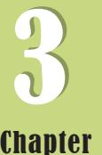
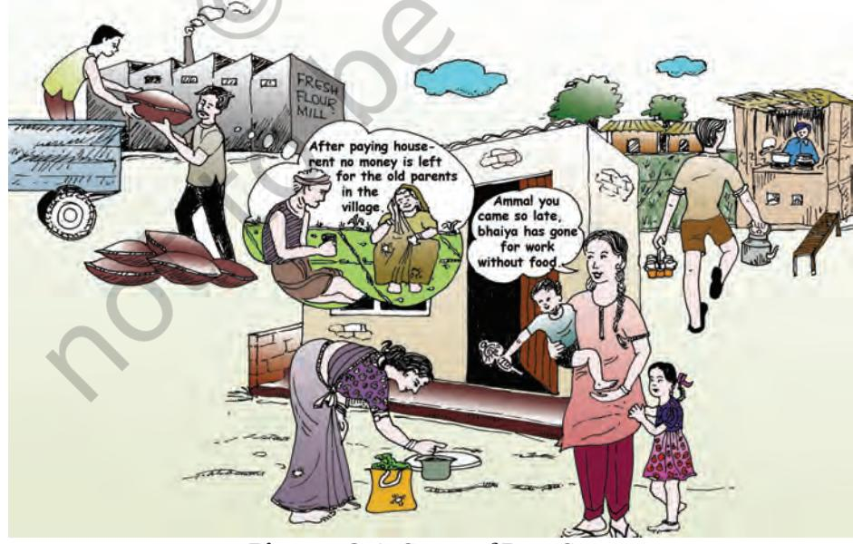
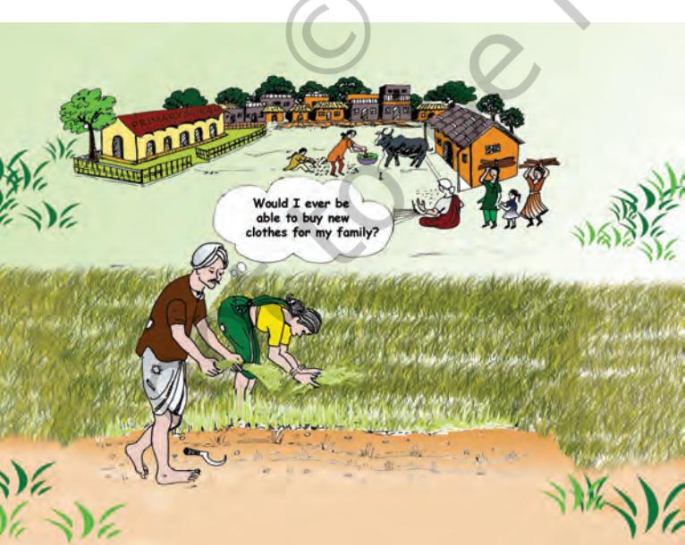
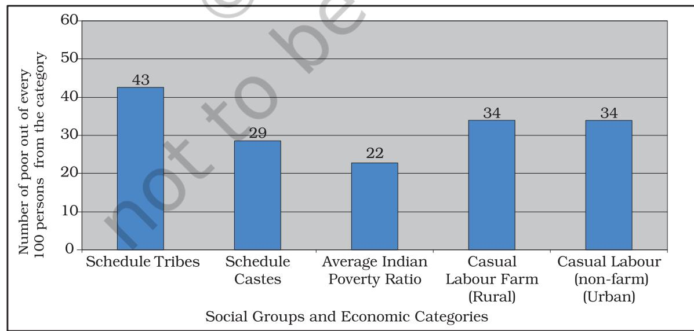
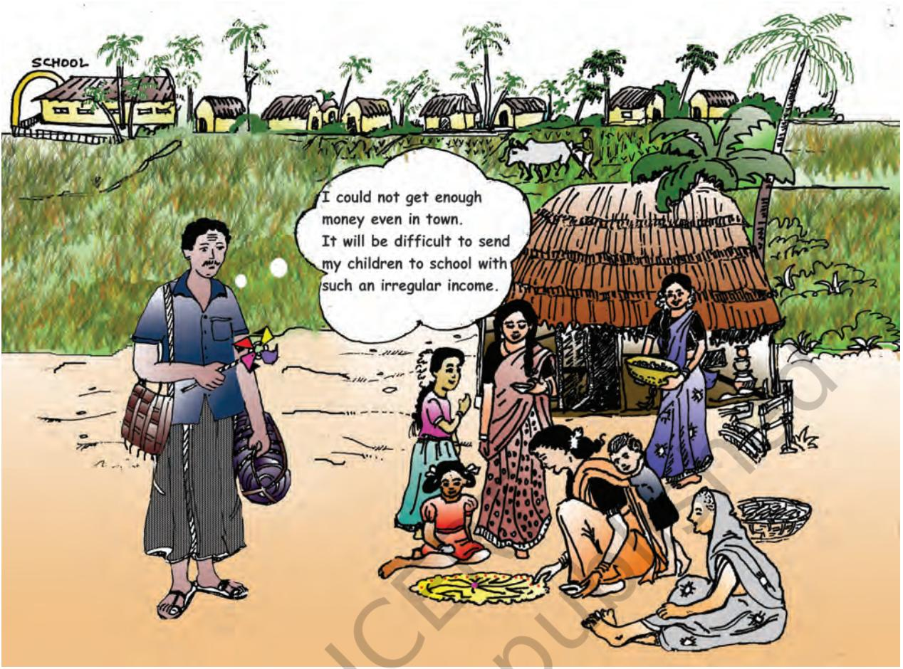
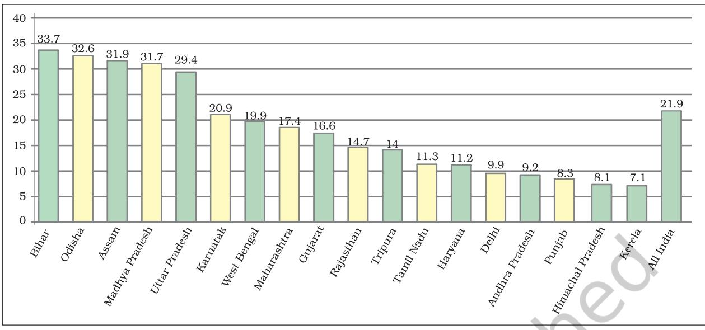
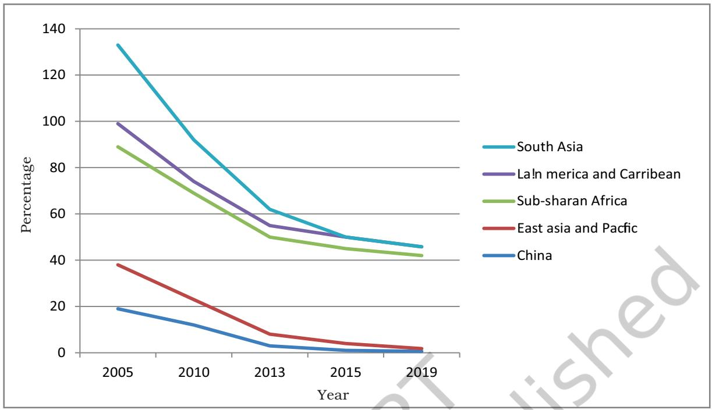
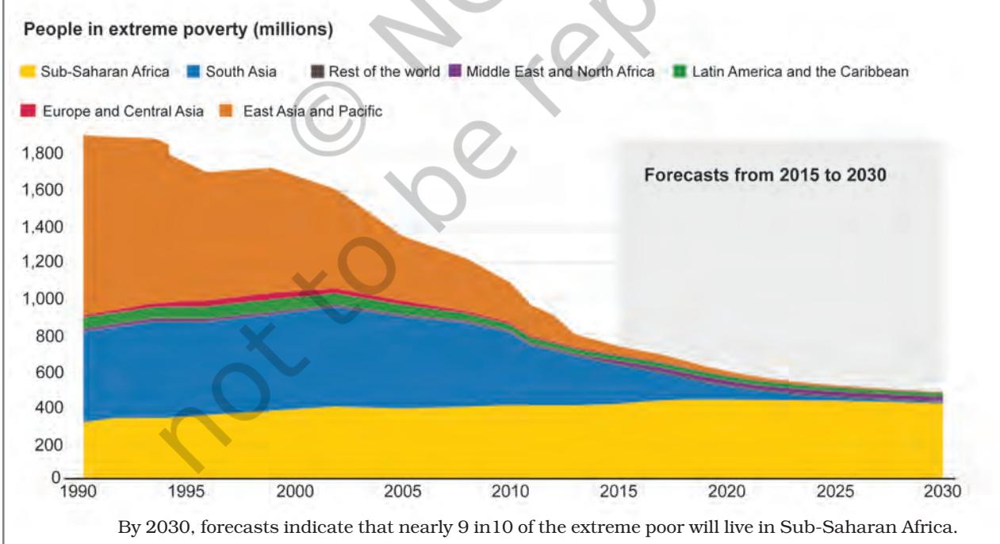

#### Chapter Poverty as a Challenge Poverty as a Challenge

## Overview

This chapter deals with one of the most difficult challenges faced by independent India—poverty. After discussing this multi-dimensional problem through examples, the chapter discusses the way poverty is seen in social sciences. Poverty trends in India and the world are illustrated through the concept of the poverty line. Causes of poverty as well as anti-poverty measures taken by the government are also discussed. The chapter ends with broadening the official concept of poverty into human poverty.

#### Introduction

In our daily life, we come across many people who we think are poor. They could be landless labourers in villages or people living in overcrowded *jhuggis* in cities. They could be daily wage workers at construction sites or child workers in

*dhabas.* They could also be beggars with children in tatters. We see poverty all around us. In fact, every fifth person in India is poor. (This means, roughly 270 million (or 27 crore) people in India live in poverty 2011-12.) This also means that India has the largest single concentration of the poor in the world. This illustrates the seriousness of the challenge.

## Two Typical Cases of Poverty

#### Urban Case

Thirty-three year old Ram Saran works as a daily-wage labourer in a wheat flour mill near Ranchi in Jharkhand. He manages to earn around Rs 1,500 a month when he finds employment, which is not often. The money is not enough to sustain his family of six that includes his wife and four children aged between 12 years to six months.

Picture 3.1 *Story of Ram Saran*

Poverty as a Challenge 29

He has to send money home to his old parents who live in a village near Ramgarh. His father a landless labourer, depends on Ram Saran and his brother who lives in Hazaribagh, for sustenance. Ram Saran lives in a one-room rented house in a crowded basti in the outskirts of the city. It's a temporary shack built of bricks and clay tiles. His wife Santa Devi, works as a part time maid in a few houses and manages to earn another Rs 800. They manage a meagre meal of dal and rice twice a day, but there's never enough for all of them. His elder son works as a helper in a tea shop to supplement the family income and earns another Rs 300, while his 10 year-old daughter takes care of the younger siblings. None of the children go to school. They have only two pairs of hand-me-down clothes each. New ones are bought only when the old clothes become unwearable. Shoes are a luxury. The younger kids are undernourished. They have no access to healthcare when they fall ill.

### Picture 3.2 *Story of Lakha Singh*

30 Economics

#### Rural case

Lakha Singh belongs to a small village near Meerut in Uttar Pradesh. His family doesn't own any land, so they do odd jobs for the big farmers. Work is erratic and so is income. At times they get paid Rs 50 for a hard day's work. But often it's in kind like a few kilograms of wheat or *dal* or even vegetables for toiling in the farm through the day. The family of eight cannot always manage two square meals a day. Lakha lives in a *kuchha* hut on the outskirts of the village. The women of the family spend the day chopping fodder and collecting firewood in the fields. His father a TB patient, passed away two years ago due to lack of medication. His mother now suffers from the same disease and life is slowly ebbing away. Although, the village has a primary school, Lakha never went there. He had to start earning when he was 10 years old. New clothes happen once in a few years. Even soap and oil are a luxury for the family.

> Study the above cases of poverty and discuss the following issues related to poverty:

- Landlessness
- Unemployment
- Size of families
- Illiteracy
- Poor health/malnutrition
- Child labour
- Helplessness

These two typical cases illustrate many dimensions of poverty. They show that poverty means hunger and lack of shelter. It also is a situation in which parents are not able to send their children to school or a situation where sick people cannot afford treatment. Poverty also means lack of clean water and sanitation facilities. It also means lack of a regular job at a minimum decent level. Above all it means living with a sense of helplessness. Poor people are in a situation in which they are ill-treated at almost every place, in farms, factories, government offices, hospitals, railway stations etc. Obviously, nobody would like to live in poverty.

One of the biggest challenges of independent India has been to bring millions of its people out of abject poverty. Mahatama Gandhi always insisted that India would be truly independent only when the poorest of its people become free of human suffering.

# Poverty as seen by social scientists

Since poverty has many facets, social scientists look at it through a variety of indicators. Usually the indicators used relate to the levels of income and consumption. But now poverty is looked through other social indicators like illiteracy level, lack of general resistance due to malnutrition, lack of access to healthcare, lack of job opportunities, lack of access to safe drinking water, sanitation etc. Analysis of poverty based on social exclusion and vulnerability is now becoming very common (see box).

# Social exclusion

According to this concept, poverty must be seen in terms of the poor having to live only in a poor surrounding with other poor people, excluded from enjoying social equality of better-off people in better surroundings. Social exclusion can be both a cause as well as a consequence of poverty in the usual sense. Broadly, it is a process through which individuals or groups are excluded from facilities, benefits and opportunities that others (their "betters") enjoy. A typical example is the working of the caste system in India in which people belonging to certain castes are excluded from equal opportunities. Social exclusion thus may lead to, but can cause more damage than, having a very low income.

## Vulnerability

Vulnerability to poverty is a measure, which describes the greater probability of certain communities (say, members of a backward caste) or individuals (such as a widow or a physically handicapped person) of becoming, or remaining, poor in the coming years. Vulnerability is determined by the options available to different communities for finding an alternative living in terms of assets, education, health and job opportunities. Further, it is analysed on the basis of the greater risks these groups face at the time of natural disasters (earthquakes, tsunami), terrorism etc. Additional analysis is made of their social and economic ability to handle these risks. In fact, vulnerability describes the greater probability of being more adversely affected than other people when bad time comes for everybody, whether a flood or an earthquake or simply a fall in the availability of jobs!

## Poverty Line

At the centre of the discussion on poverty is usually the concept of the "poverty line". A common method used to measure poverty is based on the income or

Poverty as a challenge 31

consumption levels. A person is considered poor if his or her income or consumption level falls below a given "minimum level" necessary to fulfill the basic needs. What is necessary to satisfy the basic needs is different at different times and in different countries. Therefore, poverty line may vary with time and place. Each country uses an imaginary line that is considered appropriate for its existing level of development and its accepted minimum social norms. For example, a person not having a car in the United States may be considered poor. In India, owning of a car is still considered a luxury.

While determining the poverty line in India, a minimum level of food requirement, clothing, footwear, fuel and light, educational and medical requirement, etc., are determined for subsistence. These physical quantities are multiplied by their prices in rupees. The present formula for food requirement while estimating the poverty line is based on the desired calorie requirement. Food items, such as cereals, pulses, vegetable, milk, oil, sugar, etc., together provide these needed calories. The calorie needs vary depending on age, sex and the type of work that a person does. The accepted average calorie requirement in India is 2400 calories per person per day in rural areas and 2100 calories per person per day in urban areas. Since people living in rural areas engage themselves in more physical work, calorie requirements in rural areas are considered to be higher than in urban areas. The monetary expenditure per capita needed for buying these calorie requirements in terms of food grains, etc., is revised periodically taking into consideration the rise in prices.

On the basis of these calculations, for the year 2011–12, the poverty line for a person was fixed at Rs 816 per month for rural areas and Rs 1000 for urban areas. Despite less calorie requirement,the higher amount for urban areas has been fixed because of high prices of many essential products in urban centres. In this way in the year 2011-12, a family of five members living in rural areas and earning less than about Rs 4,080 per month will be below the poverty line. A similar family in the urban areas would need a minimum of Rs 5,000 per month to meet their basic requirements. The poverty line is estimated periodically (normally every five years) by conducting sample surveys. These surveys are carried out by the National Sample Survey Organisation (NSSO). However, for making comparisons between developing countries, many international organisations like the World Bank use a uniform standard for the poverty line: minimum availability of the equivalent of $1.90 per person per day (2011, ppp).

# Let's Discuss

Discuss the following:

- Why do different countries use different poverty lines?
- What do you think would be the "minimum necessary level" in your locality?

# Poverty Estimates

It is clear from Table 3.1 that there is a substantial decline in poverty ratios in India from about 45 per cent in 1993-94 to 37.2 per cent in 2004–05. The proportion of people below poverty line further came down to about 22 per cent in 2011–12. If the trend continues, people below poverty line may come down to less than 20 per cent in the next few years. Although the percentage of people living under poverty declined in the earlier two decades (1973–1993), the number of poor declined from 407 million in 2004–05 to 270 million in 2011–12 with an average annual decline of 2.2 percentage points during 2004–05 to 2011–12.

32 Economics

|  |  | Poverty ratio (%) |  |  | Number of poor (in millions) |  |
| --- | --- | --- | --- | --- | --- | --- |
| Year | Rural | Urban | Total | Rural | Urban | Combined |
| 1993–94 | 50 | 32 | 45 | 329 | 75 | 404 |
| 2004–05 | 42 | 26 | 37 | 326 | 81 | 407 |
| 2009–10 | 34 | 21 | 30 | 278 | 76 | 355 |
| 2011–12 | 26 | 14 | 22 | 217 | 53 | 270 |

Table 3.1: Estimates of Poverty in India (Tendulkar Methodology)

*Source:* India in figures, 2018, Government of India Central Statistics office. niti.gov.in/state-statistics (accessed on Nov. 15, 2021)

Let's Discuss

Study Table 3.1 and answer the following questions:

- Even if poverty ratio declined between 1993–94 and 2004–05, why did the number of poor remain at about 407 million?
- Are the dynamics of poverty reduction the same in rural and urban India?

# Vulnerable Groups

The proportion of people below poverty line is also not same for all social groups and economic categories in India. Social groups, which are most vulnerable to poverty are Scheduled Caste and Scheduled Tribe households. Similarly, among the economic groups, the most vulnerable groups are the rural agricultural labour households and the urban casual labour households. Graph 3.1 shows the percentage of poor people in all these groups. Although the average for people below poverty line for all groups in India is 22, 43 out of 100 people belonging to Scheduled Tribes are not able to meet their basic needs. Similarly, 34 per cent of casual workers in urban areas are below poverty line. About 34 per cent of casual labour farm (in rural areas) and 29 per cent of Scheduled Castes are also poor. The double disadvantage of being a landless casual wage labour household in the socially disadvantaged social groups of the

Graph 3.1: Poverty in India 2011–12: Most Vulnerable Groups

*Source:* www.worldbank.org/2016/India-s-Poverty-Profile (accessed on 29.09.2021)

Poverty as a Challenge 33

Picture 3.3 Story of Sivaraman

scheduled caste or the scheduled tribe population highlights the seriousness of the problem. Some recent studies have shown that except for the scheduled tribe households, all the other three groups (i.e. scheduled castes, rural agricultural labourers and the urban casual labour households) have seen a decline in poverty in the 1990s.

Apart from these social groups, there is also inequality of incomes within a family. In poor families all suffer, but some suffer more than others. In some cases women, elderly people and female infants are denied equal access to resources available to the family.

#### Story of Sivaraman

Sivaraman lives in a small village near Karur town in Tamil Nadu. Karur is famous for its handloom and powerloom fabrics. There are a 100 families in the village. Sivaraman an *Aryunthathiyar* (cobbler) by caste now works as an agricultural labourer for Rs 160 per day. But that's only for five to six months in a year. At other times, he does odd jobs in the town. His wife Sasikala too works with him. But she can rarely find work these days, and even if she does, she's paid Rs 100 per day for the same work that Sivaraman does. There are eight members in the family. Sivaraman's 65 year old widowed mother is ill and

34 Economics

needs to be helped with her daily chores. He has a 25-year -old unmarried sister and four children aged between 1 year to 16 years. Three of them are girls, the youngest is a son. None of the girls go to school. Buying books and other things for school-going girls is a luxury he cannot afford. Also, he has to get them married at some point of time so he doesn't want to spend on their education now. His mother has lost interest in life and is just waiting to die someday. His sister and elder daughter take care of the household. Sivaraman plans to send his son to school when he comes of age. His unmarried sister does not get along with his wife. Sasikala finds her a burden but Sivaraman can't find a suitable groom due to lack of money. Although the family has difficulty in arranging two meals a day, Sivaraman manages to buy milk once in a while, but only for his son.

# *Let's Discuss*

Observe some of the poor families around you and try to find the following:

- Which social and economic group do they belong to?
- Who are the earning members in the family?
- What is the condition of the old people in the family?
- Are all the children (boys and girls) attending schools?

# Inter-State Disparities

Poverty in India also has another aspect or dimension. The proportion of poor people is not the same in every state. Although state level poverty has witnessed a secular decline from the levels of early seventies, the success rate of reducing poverty varies from state to state. Recent estimates show while the all India Head Count Ratio (HCR) was 21.9 per cent in 2011-12 states like Madhya Pradesh, Assam, Uttar Pardesh, Bihar and Odisha had above all India poverty level. As the Graph 3.2 shows, Bihar and Odisha continue to be the two poorest states with poverty ratios of 33.7 and 32.6 per cent respectively. Along with rural poverty, urban poverty is also high in Odisha, Madhya Pradesh, Bihar and Uttar Pradesh.

In comparison, there has been a significant decline in poverty in Kerala, Maharashtra, Andhra Pradesh, Tamil Nadu, Gujarat and West Bengal. States like Punjab and Haryana have traditionally succeeded in reducing poverty with the help of high agricultural growth rates. Kerala has focused more on human resource development. In West Bengal, land reform measures have helped in reducing poverty. In Andhra Pradesh and Tamil Nadu public distribution of food grains could have been responsible for the improvement.

# Global Poverty Scenario

The proportion of people in different countries living in extreme economic poverty— defined by the World Bank as living on less than $2.15 per day—has fallen from 16.27 per cent in 2010 to 9.05 per cent in 2019. Although there has been a substantial reduction in global poverty, it is marked with great regional differences. Poverty declined substantially in China and Southeast Asian countries as a result of rapid economic growth and massive investments in human resource development. Number of poors in China has come down from 2.1 per cent in 2014 to 1.2 per cent in 2015 to 0.1 per cent in 2020. In the countries of *South Asia* (India, Pakistan, Sri Lanka, Nepal, Bangladesh, Bhutan, Afghanistan and Maldives) the decline has also been

Poverty as a challenge 35

#### **Graph 3.2:** Poverty Ratio in Selected Indian States, (As per 2011 Census)

**Source:** Economic Survey 2020–21, Government of India, 2021.

- *Let's Discuss*
Study the Graph 3.2 and do the following:

- Identify the three states where the poverty ratio is the highest.
- Identify the three states where poverty ratio is the lowest.

rapid 12.8 per cent in 2017 to 10.9 per cent in 2021. With decline in the percentage of the poor, the number of poor has also declined significantly from 233 million in 2017 to 207 million in 2021. Because of different poverty line definition, poverty in India is also shown higher than the national estimates.

In Sub-Saharan Africa, poverty in fact declined from 36.6 per cent in 2017 to 35.4 per cent in 2019 (see graph 3.3). In Latin America and Caribbean, the ratio of poverty has increase from 4.4 per cent in 2017 to 4.6 per cent in 2021. Poverty has also resurfaced at 3 percent in 2000 in some of the former socialist countries like Russia, where officially it was non-existent earlier. Table 3.2 shows the proportion of people living under poverty in different countries as defined by the international poverty line (means population below $2.15 a day). The new sustainable development goals of the United Nations (UN) proposes ending poverty of all types by 2030.

# *Let's Discuss*

Study the Graph 3.4 and do the following: • Identify the areas of the world, where poverty ratios have declined.

- Identify the area of the globe which has the largest concentration of the poor.
**Table 3.2:** Poverty: Head Count Ratio Comparison among Some Selected Countries

| Country | % of Population below $2.15 a day (2017ppp) |
| --- | --- |
| 1. Nigeria | 30.9 (2018) |
| 2. Bangladesh | 9.6 (2022) |
| 3. India | 11.9 (2021) |
| 4. Pakistan | 4.9 (2018) |
| 5. China | 0.1 (2020) |
| 6. Brazil | 5.8 (2021) |
| 7. Indonesia | 2.5 (2022) |
| 8. Sri Lanka | 1.0 (2019) |

**Source:** Poverty and Equity Database, World Bank Data; (databank.worldbank.org) accessed on 01.10.2021, 2022.

36 Economics

Graph 3.3: Share of people living on $1.90 a day, 2005–2019

*Source*: Poverty and Equity Database; World Bank (http://databank.worldbank.org/data/reports.aspx?source=poverty-and-equity-database)

Graph 3.4: Number of poor by region ($ 1.90 per day) in millions

*Source*: World Bank PovcalNet and Poverty & Equity Data Portal (http://databank.worldbank.org/data/reports.aspx?source=poverty-and-equity-database)

Poverty as a Challenge 37

#### Causes of Poverty

There were a number of causes for the widespread poverty in India. One historical reason is the low level of economic development under the British colonial administration. The policies of the colonial government ruined traditional handicrafts and discouraged development of industries like textiles. The low rate of growth persisted until the nineteeneighties. This resulted in less job opportunities and low growth rate of incomes. This was accompanied by a high growth rate of population. The two combined to make the growth rate of per capita income very low. The failure at both the fronts: promotion of economic growth and population control perpetuated the cycle of poverty.

With the spread of irrigation and the Green revolution, many job opportunities were created in the agriculture sector. But the effects were limited to some parts of India. The industries, both in the public and the private sector, did provide some jobs. But these were not enough to absorb all the job seekers. Unable to find proper jobs in cities, many people started working as rickshaw pullers, vendors, construction workers, domestic servants etc. With irregular small incomes, these people could not afford expensive housing. They started living in slums on the outskirts of the cities and the problems of poverty, largely a rural phenomenon also became the feature of the urban sector.

Another feature of high poverty rates has been the huge income inequalities. One of the major reasons for this is the unequal distribution of land and other resources. Despite many policies, we have not been able to tackle the issue in a meaningful manner. Major policy initiatives like land reforms which aimed at redistribution of assets in rural areas have not been implemented properly and effectively by most of the state governments. Since lack of land resources has been one of the major causes of poverty in India, proper implementation of policy could have improved the life of millions of rural poor.

Many other socio-cultural and economic factors also are responsible for poverty. In order to fulfil social obligations and observe religious ceremonies, people in India, including the very poor, spend a lot of money. Small farmers need money to buy agricultural inputs like seeds, fertilizer, pesticides etc. Since poor people hardly have any savings, they borrow. Unable to repay because of poverty, they become victims of indebtedness. So the high level of indebtedness is both the cause and effect of poverty.

# Anti-Poverty Measures

Removal of poverty has been one of the major objectives of Indian developmental strategy. The current anti-poverty strategy of the government is based broadly on two planks (1) promotion of economic growth (2) targeted anti-poverty programmes.

Over a period of thirty years lasting up to the early eighties, there were little per capita income growth and not much reduction in poverty. Official poverty estimates which were about 45 per cent in the early 1950s remained the same even in the early eighties. Since the eighties, India's economic growth has been one of the fastest in the world. The growth rate jumped from the average of about 3.5 per cent a year in the 1970s to about 6 per cent during the 1980s and 1990s. The higher growth rates have helped significantly in the reduction of poverty. Therefore, it is becoming clear that there is a strong link between economic growth and poverty reduction. Economic growth widens opportunities and provides the resources needed to invest in human development. This also encourages people

38 Economics

to send their children, including the girl child, to schools in the hope of getting better economic returns from investing in education. However, the poor may not be able to take direct advantage from the opportunities created by economic growth. Moreover, growth in the agriculture sector is much below expectations. This has a direct bearing on poverty as a large number of poor people live in villages and are dependent on agriculture.

In these circumstances, there is a clear need for targeted anti-poverty programmes. Although there are so many schemes which are formulated to affect poverty directly or indirectly, some of them are worth mentioning. *Mahatma Gandhi National Rural Employment Guarantee Act, 2005* aims to provide 100 days of wage employment to every household to ensure livelihood security in rural areas. It also aimed at sustainable development to address the cause of draught, deforestration and soil erosion. One-third of the proposed jobs have been reserved for women. The scheme provided employment to 220 crores person days of employment to 4.78 crore households. The share of SC, ST, Women person days in the scheme are 23 per cent, 17 per cent and 53 per cent respectively. The average wage has increased from 65 in 2006–07 to 132 in 2013–14. Recently, in March 2018, the wage rate for unskilled manual workers has been revised, state wise, the range of wage rate for different states and union territories lies in between ` 281 per day (for the workers in Haryana) to ` 168 per day (for the workers of Bihar and Jharkhand).

*Prime Minister Rozgar Yozana* (PMRY) is another scheme which was started in 1993. The aim of the programme is to create self-employment opportunities for educated unemployed youth in rural areas and small towns. They are helped in setting up small business and industries. *Rural Employment Generation Programme* (REGP) was launched in 1995. The aim of the programme is to create selfemployment opportunities in rural areas and small towns. A target for creating 25 lakh new jobs has been set for the programme under the Tenth Five Year plan. *Swarnajayanti Gram Swarozgar Yojana* (SGSY) was launched in 1999. The programme aims at bringing the assisted poor families above the poverty line by organising them into self help groups through a mix of bank credit and government subsidy. Under the *Pradhan Mantri Gramodaya Yozana* (PMGY) launched in 2000, additional central assistance is given to states for basic services such as primary health, primary education, rural shelter, rural drinking water and rural electrification. Another important scheme is *Antyodaya Anna Yozana* (AAY) about which you will be reading more in the next chapter.

The results of these programmes have been mixed. One of the major reasons for less effectiveness is the lack of proper implementation and right targeting. Moreover, there has been a lot of overlapping of schemes. Despite good intentions, the benefits of these schemes are not fully reached to the deserving poor. Therefore, the major emphasis in recent years is on proper monitoring of all the poverty alleviation programmes.

## The Challenges Ahead

Poverty has certainly declined in India. But despite the progress, poverty reduction remains India's most compelling challenge. Wide disparities in poverty are visible between rural and urban areas and among different states.

Poverty as a challenge 39

Certain social and economic groups are more vulnerable to poverty. Poverty reduction is expected to make better progress in the next ten to fifteen years. This would be possible mainly due to higher economic growth, increasing stress on universal free elementary education, declining population growth, increasing empowerment of the women and the economically weaker sections of society.

The official definition of poverty, however, captures only a limited part of what poverty really means to people. It is about a "minimum" subsistence level of living rather than a "reasonable" level of living. Many scholars advocate that we must broaden the concept into *human poverty*. A large number of people may have been able to feed themselves. But do they have education? Or shelter? Or health care? Or job security? Or selfconfidence? Are they free from caste and gender discrimination? Is the practice of child labour still common? Worldwide experience shows that with development, the definition of what constitutes poverty also changes. Eradication of poverty is always a moving target. Hopefully we will be able to provide the minimum "necessary" in terms of only income to all people by the end of the next decade. But the target will move on for many of the bigger challenges that still remain: providing health care, education and job security for all, and achieving gender equality and dignity for the poor. These will be even bigger tasks.

# Summary

You have seen in this chapter that poverty has many dimensions. Normally, this is measured through the concept of "poverty line". Through this concept we analysed main global and national trends in poverty. But in recent years, analysis of poverty is becoming rich through a variety of new concepts like social exclusion. Similarly, the challenge is becoming bigger as scholars are broadening the concept into *human poverty.*

# Exercises

- 1. Describe how the poverty line is estimated in India?
- 2. Do you think that present methodology of poverty estimation is appropriate?
- 3. Describe poverty trends in India since 1973?
- 4. Discuss the major reasons for poverty in India?
- 5. Identify the social and economic groups which are most vulnerable to poverty in India.
- 6. Give an account of interstate disparities of poverty in India.
- 7. Describe global poverty trends.
- 8. Describe current government strategy of poverty alleviation?
- 9. Answer the following questions briefly
	- (i) What do you understand by human poverty?
	- (ii) Who are the poorest of the poor?
	- (iii) What are the main features of the National Rural Employment Guarantee Act 2005?

40 Economics

- DEATON, ANGUS AND VALERIE KOZEL (Eds.) 2005. *The Great Indian Poverty Debate*. MacMillan India Limited, New Delhi.
- *Economic Survey 2015–2016*. Ministry of Finance, Government of India, New Delhi. (Chapter on social sectors, [Online web] URL: http://indiabudget.nic.in/ es_2004–05/social.htm)
- *Mid-Term Appraisal of the Tenth Five Year Plan 2002–2007*. Planning Commission, New Delhi. Part II, Chapter 7: Poverty Elimination and Rural Employment, [Online web] URL: http://www.planningcommission.nic.in/midterm/englishpdf/chapter-07.pdf
- *National Rural Employment Guarantee Act 2005*. [Online web] URL: http://rural.nic.in/ rajaswa.pdf
- PANAGRIYA ARVIND AND VISHAL MORE *'Poverty by social, religious and economic groups in India and its largest state',* working paper no. 2013-14, Programme on Indian economic policies, Columbia University.
- *Tenth Five Year Plan 2002–2007*. Planning Commission, New Delhi. (Chapter 3.2, Poverty Alleviation in Rural India: Strategy and Programmes, [Online web] URL: http://www.planningcommission.nic.in/plans/planrel/fiveyr/10th/volume2/ v2_ch3_2.pdf
- *World Development Indicators 2016*. Featuring the Suistainable Development Goals, The World Bank.

