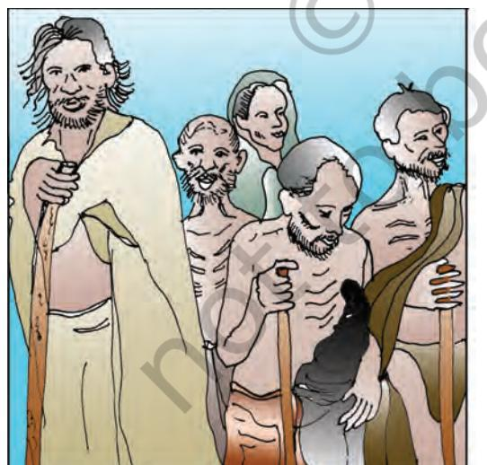
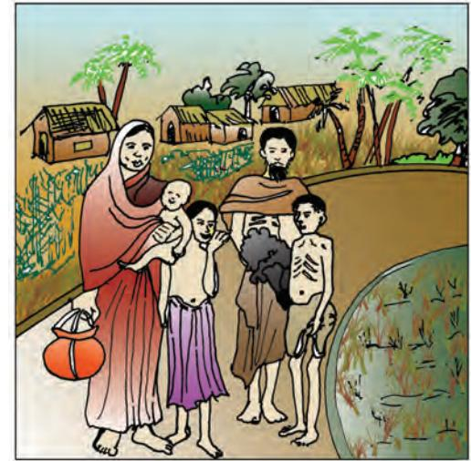
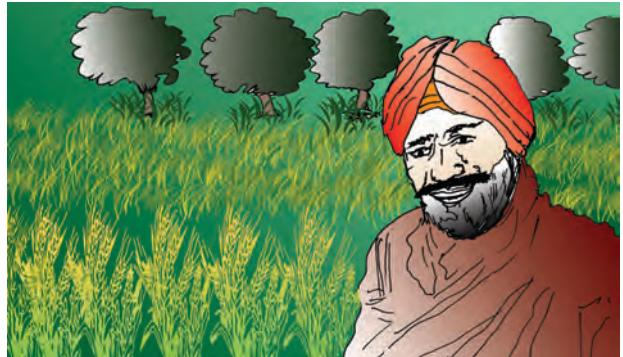
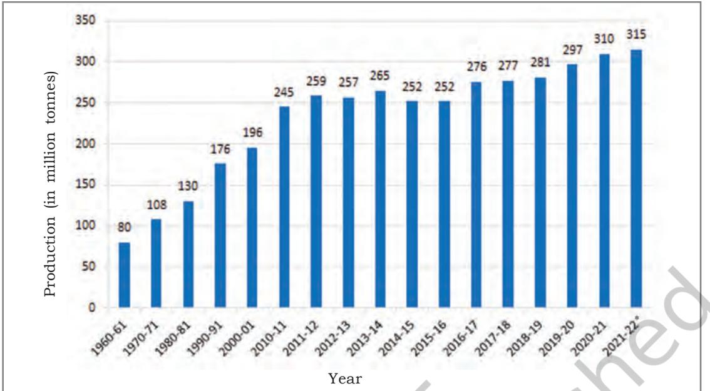
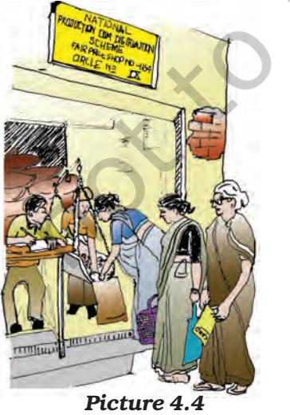
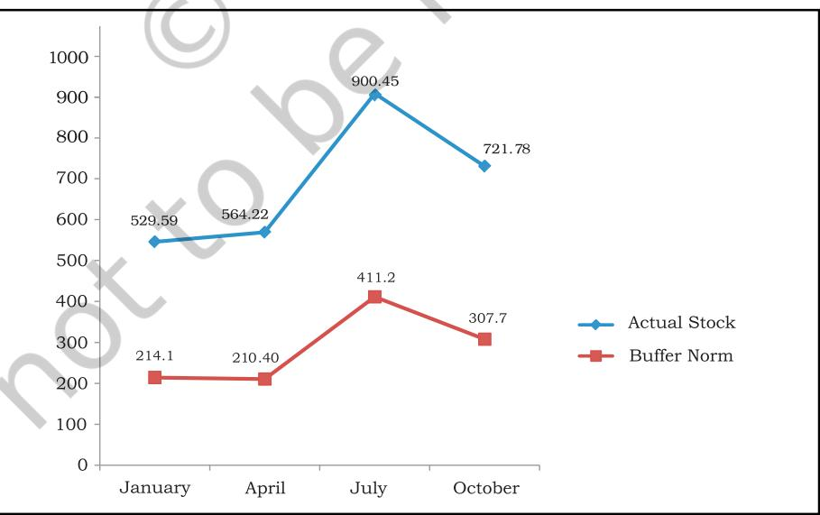
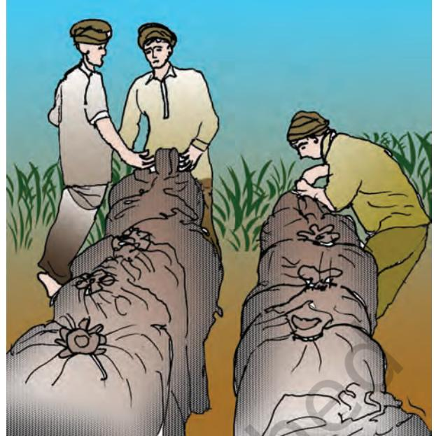

## Overview

4

4

- Food security means availability, accessibility and affordability of food to all people at all times. The poor households are more vulnerable to food insecurity whenever there is a problem of production or distribution of food crops. Food security depends on the Public Distribution System (PDS) and government vigilance and action at times, when this security is threatened.
## What is food security?

Food is as essential for living as air is for breathing. But food security means something more than getting two square meals. Food security has following dimensions

- (a) *availability of food* means food production within the country, food imports and the previous years stock stored in government granaries.
- (b) *accessibility* means food is within reach of every person.
- (c) *affordability* implies that an individual has enough money to buy sufficient, safe and nutritious food to meet one's dietary needs.

Thus, food security is ensured in a country only if (1) enough food is available for all the persons (2) all persons have the capacity to buy food of acceptable quality and (3) there is no barrier on access to food.

#### Why food security?

The poorest section of the society might be food insecure most of the times while persons above the poverty line might also be food insecure when the country faces In the 1970s, food security was understood as the "availability at all times of adequate supply of basic foodstuffs" (UN, 1975). Amartya Sen added a new dimension to food security and emphasised the "access" to food through what he called 'entitlements' — a combination of what one can produce, exchange in the market alongwith state or other socially provided supplies. Accordingly, there has been a substantial shift in the understanding of food security. The 1995 World Food Summit declared, "Food security at the individual, household, regional, national and global levels exists when all people, at all times, have physical and economic access to sufficient, safe and nutritious food to meet their dietary needs and food preferences for an active and healthy life" (FAO, 1996, p.3). The declaration further recognises that "poverty eradication is essential to improve access to food".

a national disaster/calamity like earthquake, drought, flood, tsunami, widespread failure of crops causing famine, etc. *How is food security affected during a calamity?* Due to a natural calamity, say drought, total production of foodgrains decreases. It creates a shortage of food in the affected areas. Due to shortage of food, the prices goes up. At the high prices, some people cannot afford to buy food. If such calamity happens in a very wide spread area or is stretched over a longer time period, it may cause a situation of starvation. A massive starvation might take a turn of famine.

*A Famine is characterised by wide spread deaths due to starvation and*

42 Economics

*epidemics caused by forced use of contaminated water or decaying food and loss of body resistance due to weakening from starvation.*

The most devastating famine that occurred in India was the FAMINE OF BENGAL in 1943. This famine killed thirty lakh people in the province of Bengal.

Do you know who were affected the most by the famine? The agricultural labourers, fishermen, transport workers and other casual labourers were affected the most by dramatically increasing price of rice. They were the ones who died in this famine.

| Year | Production | Imports | Exports | Total Availability |
| --- | --- | --- | --- | --- |
|  | (Lakh tonnes) | (Lakh tonnes) | (Lakh tonnes) | (Lakh tonnes) |
| 1938 | 85 | – | – | 85 |
| 1939 | 79 | 04 | – | 83 |
| 1940 | 82 | 03 | – | 85 |
| 1941 | 68 | 02 | – | 70 |
| 1942 | 93 | – | 01 | 92 |
| 1943 | 76 | 03 | – | 79 |

Table 4.1: Production of Rice in the Province of Bengal

*Source*: Sen, A.K, 1981 Page 61

- 1. Some people say that the Bengal famine happened because there was a shortage of rice. Study the table and find out whether you agree with the statement?
- 2. Which year shows a drastic decline in food availability?

Picture 4.1 *Starvation victims arriving at a relief centre, 1945.*

Picture 4.2 *During the Bengal Famine of 1943, a family leaves its village in Chittagong district in Bengal.*

- (a) What do you see in Picture 4.1?
- (b) Which age group is seen in the first picture?
- (c) Can you say that the family shown in the Picture 4.2 is a poor family? why?
- (d) Can you imagine the source of livelihood of the people, (shown in two Pictures) before the occurrence of famine? (In the context of a village)
- (e) Find out what type of help is given to the victims of a natural calamity at a relief camp.
- (f ) Have you ever helped such victims (in the form of money, food, clothes, medicines etc.) PROJECT WORK: Gather more information about famines in India.

Nothing like Bengal famine has happened in India again. It is, however, disturbing to note that even today, famine like conditions exist in many parts of the country, leading to starvation deaths at times. Natural calamities and pandemics may also lead to food shortage. For example Covid-19 pandemic had an adverse impact upon the food security. Restriction on movement of people and goods and services impacted economic activity. Therefore food security is needed in a country to ensure food at all times, including calamities and pandemics

Who are food-insecure?

Although a large section of people suffer from food and nutrition insecurity in India, the worst affected groups are landless people with little or no land to depend upon, traditional artisans, providers of traditional services, petty selfemployed workers and destitutes including beggars. In the urban areas, the food insecure families are those whose working members are generally employed in ill-paid occupations and casual labour market. These workers are largely engaged in seasonal activities and are paid very low wages that just ensure bare survival.

#### Story of Ramu

Ramu works as a casual labourer in agriculture in Raipur village. His eldest son Somu who is 10 years old also works as a *pali* to look after the cattle of the Sarpanch of the village Satpal Singh. Somu is employed for the whole year by the Sarpanch and is paid a sum of Rs 1,000 for this work. Ramu has three more sons and two daughters but they are too young to work on the field. His wife Sunhari is also (part time) working as house cleaner for the livestock, removing and managing cow dung. She gets ½ litre milk and some cooked food along with vegetables for her daily work. Besides she also works in the field along with her husband in the busy season and supplements his earnings. Agriculture being a seasonal activity employs Ramu only during times of sowing, transplanting and harvesting. He remains unemployed for about 4 months during the period of plant consolidation and maturing in a year. He looks for work in other activities. Some times he gets employment in brick laying or in construction activities in the village. By all his efforts, Ramu is able to earn enough either in cash or kind for him to buy essentials for two square meals for his family. However, during the days when he is unable to get some work, he and his family really face difficulties and sometimes his small kids have to sleep without food. Milk and vegetables are not a regular part of meals in the family. Ramu is food insecure during 4 months when he remains unemployed because of the seasonal nature of agriculture work.

- Why is agriculture a seasonal activity?
- Why is Ramu unemployed for about four months in a year?
- What does Ramu do when he is unemployed?
- Who are supplementing income in Ramu's family?
- Why does Ramu face difficulty when he is unable to have work?
- When is Ramu food insecure?

### Story of Ahmad

Ahmad is a rickshaw puller in Bangalore. He has shifted from Jhumri Taliah along with his 3 brothers, 2 sisters and old parents. He stays in a *jhuggi*. The survival of all members of his family depends on his daily earnings from pulling rickshaw. However, he does not have a secured employment and his earnings fluctuate every day. During some days he gets enough earning for him to save some amount after buying all his day-to-day necessities. On other days, he barely earns enough to buy his daily necessities. However, fortunately, Ahmad has a yellow card, which is PDS Card for below poverty line people. With this card, Ahmad gets sufficient quantity of wheat, rice, sugar and kerosene oil for his daily use. He gets these essentials at half of the market price. He purchases his monthly stock during a particular day when the ration shop is opened for below poverty people. In this way, Ahmad is able to eke out his survival with less than sufficient earnings for his big family where he is the only earning member.

# Let's Discuss

- Does Ahmad have a regular income from rickshaw-pulling?
- How does the yellow card help Ahmad

run his family even with small earnings from rickshaw-pulling?

The social composition along with the inability to buy food also plays a role in food insecurity. The SCs, STs and some sections of the OBCs (lower castes among them) who have either poor land-base or very low land productivity are prone to food insecurity. The people affected by natural disasters, who have to migrate to other areas in search of work, are also among the most food insecure people. A high incidence of malnutrition prevails among women. This is a matter of serious concern as it puts even the unborn baby at the risk of malnutrition. A large proportion of pregnant and nursing mothers and children under the age of 5 years constitute an important segment of the food insecure population.

According to the National Health and Family Survey (NHFS) 1998–99, the number of such women and children is approximately 11 crore.

The food insecure people are disproportionately large in some regions of the country, such as economically backward states with high incidence of poverty, tribal and remote areas, regions more prone to natural disasters etc. In fact, the states of Uttar Pradesh (eastern and south-eastern parts), Bihar, Jharkhand, Orissa, West Bengal, Chattisgarh, parts of Madhya Pradesh and Maharasthra account for largest number of food insecure people in the country.

Hunger is another aspect indicating food insecurity. Hunger is not just an expression of poverty, it brings about poverty. The attainment of food security therefore involves eliminating current hunger and reducing the risks of future hunger. Hunger has chronic and seasonal dimensions. Chronic hunger is a consequence of diets persistently inadequate in terms of quantity and/or

Food Security in India 45

quality. Poor people suffer from chronic hunger because of their very low income and in turn inability to buy food even for survival. Seasonal hunger is related to cycles of food growing and harvesting. This is prevalent in rural areas because of the seasonal nature of agricultural activities and in urban areas because of casual labourers, e.g., there is less work for casual construction labourers during the rainy season. This type of hunger exists when a person is unable to get work for the entire year.

| Table 4.2: Percentage of Households with |
| --- |
| 'Hunger' in India |

|  |  | Type of hunger |  |
| --- | --- | --- | --- |
| Year | Seasonal | Chronic | Total |
| Rural |  |  |  |
| 1983 | 16.2 | 2.3 | 18.5 |
| 1993–94 | 4.2 | 0.9 | 5.1 |
| 1999–2000 | 2.6 | 0.7 | 3.3 |
| Urban |  |  |  |
| 1983 | 5.6 | 0.8 | 6.4 |
| 1993–94 | 1.1 | 0.5 | 1.6 |
| 1999–2000 | 0.6 | 0.3 | 0.9 |

**Source:** Sagar (2004)

The percentage of seasonal, as well as, chronic hunger has declined in India as shown in the above table.

**India is aiming at Self-sufficiency in Foodgrains since Independence.**

After Independence, Indian policymakers adopted all measures to achieve self-sufficiency in food grains. India adopted a new strategy in agriculture, which resulted in **'Green Revolution'**, especially in the production of wheat and rice.

Indira Gandhi, the then Prime Minister of India, officially recorded the impressive strides of Green Revolution in agriculture by releasing a special stamp entitled 'Wheat Revolution' in July 1968. The

**Picture 4.3** *A farmer from Punjab standing in a field of one of the High Yielding Varieties of wheat on which the Green Revolution is based*

success of wheat was later replicated in rice. The increase in foodgrains was, however, disproportionate. The highest rate of growth was achieved in Uttar Pradesh and Madhya Pradesh, which was 58 and 33 million tonnes in 2020–21. The total foodgrain production was 310 Million tonnes in 2020–21 and it has changed to 315 million tonnes in 2021–22.

Uttar Pradesh and Madhya Pradesh recorded a significant production in field of wheat which was 36 and 18 million tonnes in 2020–21, respectively.

West Bengal and UP, on the other hand, recorded significant production of rice 17 and 16 Million tonnes in 2020–21 respectively.

# *Suggested Activity*

Visit some farms in a nearby village and collect the details of food crops cultivated by the farmers.

### **Food Security in India**

Since the advent of the Green Revolution in the early-1970s, the country has avoided famine even during adverse weather conditions.

India has become self-sufficient in foodgrains during the last 30 years because of a variety of crops grown all over the country. The availability of foodgrains (even in adverse weather conditions or otherwise) at the country

46 Economics

Graph 4.1: Production of Foodgrains in India (Million Tonnes)

*Source*: Department of Agricultural, Cooperation and Farmers Welfare, Ministry of Agriculture and Farmers Welfare, Directorate of Economics and Statistics, 2022. *Fourth Estimate

- *Let's Discuss*
Study Graph 4.1 and answer the following questions:

- (a) In which year did our country cross the 200 Million tonne per year mark in foodgrain production?
- (b) In which decade did India experience the highest decadal increase in foodgrain production?
- (c) Is production increase consistent in India since 2000–01?

level has further been ensured with a carefully designed food security system by the government. This system has two components: (a) buffer stock, and (b) public distribution system.

## What is Buffer stock?

Buffer Stock is the stock of foodgrains, namely wheat and rice, procured by the government through the Food Corporation of India (FCI). The FCI purchases wheat and rice from the farmers in states where there is surplus production. The farmers are paid a preannounced price for their crops. This price is called Minimum Support Price (MSP). The MSP is declared by the government every year before the sowing season to provide incentives to farmers for raising the production of these crops. The purchased foodgrains are stored in granaries. Do you know why this buffer stock is created by the government? This is done to distribute foodgrains in the deficit areas and among the poorer strata of the society at a price lower than the market price also known as Issue Price. This also helps resolve the problem of shortage of food during adverse weather conditions or during the periods of calamity.

### What is the Public Distribution System?

The food procured by the FCI is distributed through government regulated ration shops among the poorer section of the society. This is called the Public Distribution System (PDS). Ration shops are now present in most localities,

Food Security in India 47

villages, towns and cities. There are about 5.5 lakh ration shops all over the country. Ration shops also, known as Fair Price Shops, keep stock of foodgrains, sugar, and kerosene for cooking. These items are sold to people at a price lower than the market price. Any family with a ration card* can buy a stipulated amount of these items (e.g. 35 kg of grains, 5 litres of kerosene, 5 kgs of sugar etc.) every month from the nearby ration shop.

> *There are three kinds of ration cards: (a) Antyodaya cards for the poorest of the poor; (b) BPL cards for those below poverty line; and (c) APL cards for all others.

# Suggested Activity

Visit your area's ration shop and get the following details

- 1. When does the ration shop open?
- 2. What are the items sold at the ration shop?
- 3. Compare the prices of rice and sugar from the ration shop with the prices at any other grocery shop? (for families below poverty line)
- 4. Find out:

Do you have a ration card? What has your family recently bought with this card from the ration shop?

48 Economics

Are there any problems that they face? Why are ration shops necessary?

The introduction of Rationing in India dates back to the 1940s against the backdrop of the Bengal famine. The rationing system was revived in the wake of an acute food shortage during the 1960s, prior to the Green Revolution. In the wake of the high incidence of poverty levels, as reported by the NSSO in the mid-1970s, three important food intervention programmes were introduced: Public Distribution System (PDS) for food grains (in existence earlier but strengthened thereafter); Integrated Child Development Services (ICDS) (introduced in 1975 on an experimental basis) and Food-for -Work** (FFW) (introduced in 1977–78). Over the years, several new programmes have been launched and some have been restructured with the growing experience of administering the programmes. At present, there are several Poverty Alleviation Programmes (PAPs), mostly in rural areas, which have an explicit food component also. While some of the programmes such as PDS, mid-day meals etc. are exclusively food security programmes, most of the PAPs also enhance food security. Employment programmes greatly contribute to food security by increasing the income of the poor.

# Suggested Activity

Gather detailed information about some of the programmes initiated by the government, which have food component.

Hint: Rural wage employment programme, Employment Guarantee Scheme, Sampurna Grameen Rojgar Yojana, Mid Day Meal, Integrated Child Development Services, etc.

*Picture 4.4* Discuss with your teacher.

## **The National Food Security Act, 2013

This Act provides for food and nutritional security life at affordable prices and enables people to live a life with dignity. Under this act, 75% of the rural population and 50% of the urban population have been categorised as eligible households for food security.

Current Status of Public the Distribution System

Public Distribution System (PDS) is the most important step taken by the Government of India (GoI) towards ensuring food security. In the beginning, the coverage of PDS was universal with no discrimination between the poor and the non-poor. Over the years, the policy related to PDS has been revised to make it more efficient and targeted. In 1992, Revamped Public Distribution System (RPDS) was introducted in 1,700 blocks in the country. The target was to provide the benefits of PDS to remote and backward areas. From June 1997, in a renewed attempt, Targeted Public Distribution System (TPDS) was introducted to adopt the principle of targeting the 'poor in all areas'. It was for the first time that a differential price policy was adopted for poor and nonpoor. Further, in 2000, two special schemes were launched *viz*., *Antyodaya Anna Yojana**** (AAY) and *Annapurna Scheme* (APS) with special target groups

| Name of | Year of | Coverage target | Latest volume | Issue price |
| --- | --- | --- | --- | --- |
| scheme | introduction | group |  | (Rs per kg.) |
| PDS | Up to 1992 | Universal | – | W-2.34 |
|  |  |  |  | R-2.89 |
| RPDS | 1992 | Backward blocks | 20 kg of | W-2.80 |
|  |  |  | foodgrains | R-3.77 |
| TPDS | 1997 | Poor and non-poor | 35 kg of | BPL – W-4.15 |
|  | launched in | BPL | foodgrains/month | R-5.65 |
|  | 2000 | APL |  | APL-W-6.10 |
|  |  |  |  | R-8.30 |
| AAY | 2002 | Poorest of the poor | 35 kg of per household | W-2.00 |
|  |  |  | foodgrains per month | R-3.00 |
| APS | 2000 | Indigent senior | 10 kg of | Free |
|  |  | citizens | foodgrains |  |
| National | 2013 | Priority households | 5 Kg per person | W-2.00 |
| Food |  |  | per month | R-3.00 |
| Security |  |  |  | Coarse-1.00 |
| Act(NFSA) |  |  |  | grains |

Table 4.3: Some Important Features of PDS

Note: W - Wheat; R - Rice; BPL - Below poverty line; APL - Above poverty line *Source*: Food Corporation of India, fci.gov.in/sales.php-view-41,2021 (updated on 29.09.2021) National Food Security Act, 2013

Food Security in India 49

of 'poorest of the poor' and 'indigent senior citizens', respectively. The functioning of these two schemes was linked with the existing network of the PDS.

Some important features of PDS are summarised in Table 4.3.

The PDS has proved to be the most effective instrument of government policy over the years in stabilising prices and making food available to consumers at affordable prices. It has been instrumental in averting widespread hunger and famine by supplying food from surplus regions of the country to the deficit ones. In addition, the prices have been under revision in favour of poor households in general. The system, including the minimum support price and procurement has contributed to an increase in foodgrain production and provided income security to farmers in certain regions.

However, FCI godowns are overflowing with grains, with some rotting away and some being eaten by rats. Graph 4.2 shows the difference in foodgrain stocks in Central pool and its stocking norms.

#### ***Antyodaya Anna Yojana (AAY)

AAY was launched in December 2000. Under this scheme one crore of the poorest among the BPL families covered under the targeted public distribution system were identified. Poor families were identified by the respective state rural development departments through a Below Poverty Line (BPL) survey. Twenty-five kilograms of foodgrains were made available to each eligible family at a highly subsidised rate of ` 2 per kg for wheat and ` 3 per kg for rice. This quantity has been enhanced from 25 to 35 kg with effect from April 2002. The scheme has been further expanded twice by additional 50 lakh BPL families in June 2003 and in August 2004. With this increase, 2 crore families have been covered under the AAY.

Graph 4.2: Central Foodgrains (Wheat + Rice) Stock and Minimum Buffer Norm (Million Tonnes)

*Source*: Food Corporation and India (dfpd.gov.in/foodgrain-stocking), 2020-21 (Accessed on 29/09/2021)

*+Subsidy is a payment that a government makes to a producer to supplement the market price of a commodity. Subsidies can keep consumer prices low while maintaining a higher income for domestic producers.*

Study the Graph 4.2 and answer the following questions:

- In which recent year foodgrain stock with the government was maximum?
- What is the minimum buffer stock norm for the FCI?
- Why were the FCI granaries overflowing with foodgrains?

In 2022, the stock of wheat and rice with Central pool is 159 LMT ( Lakh million tonnes) of wheat and 104 LMT of rice which was much more than the minimum buffer norms. However, these remained consistently higher than the buffer norms. The situation improved with the distribution of foodgrains under different schemes launched by the government. There is a general consensus that high level of buffer stocks of foodgrains is very undesirable and can be wasteful. The storage of massive food stocks has been responsible for high carrying costs, in addition to wastage and deterioration in grain quality. Freezing of MSP for a few years should be considered seriously.

The increased food grains procurement at enhanced MSP# is the result of the pressure exerted by leading foodgrain producing states, such as Punjab, Haryana and Andhra Pradesh. Moreover, as the procurement

 **Picture 4.5** *Farmers Carrying Bags of Grains to the Granaries.*

is concentrated in a few prosperous regions (Punjab, Haryana, Western Uttar Pradesh, Andhra Pradesh and to a lesser extent in West Bengal) and mainly of two crops— wheat and rice increase in MSP has induced farmers, particularly in surplus states, to divert land from production of coarse grains, which is the staple food of the poor, to the production of rice and wheat. The intensive utilisation of water in the cultivation of rice has also led to environmental degradation and fall in the water level, threatening the sustainability of the agricultural development in these states.

 # The rising Minimum Support Prices (MSP) have raised the maintenance cost of procuring foodgrains by the government. Rising transportation and storage costs of the FCI are other contributing factors in this increase.

As per the NSSO report No. 558 in rural India, the per person per month consumption of rice has declined from 6.38 Kg. in 2004-05 to 5.98 Kg in 2011-12. In urban India, the per person per month consumption of rice, too has declined from 4.71 Kg in 2004-05 to 4.49 Kg in 2011-12. Per Capita consumption of PDS rice has doubled in rural India and increased by 66% in urban India since 2004-05. The per Capita consumption of PDS wheat has doubled since 2004-05 in both rural and urban India.

PDS dealers are sometimes found resorting to malpractices like diverting the grains to open market to get better margin, selling poor quality grains at ration shops, irregular opening of the shops, etc. It is common to find that ration shops regularly have unsold stocks of poor quality grains left. This has proved to be a big problem. When ration shops are unable to sell, a massive stock of foodgrains piles up with the FCI. In recent years, there is another factor that has led to the decline of the PDS. Earlier every family, poor and non-poor had a ration card with a fixed quota of items such as rice, wheat, sugar etc. These were sold at the same low price to every family. The three types of cards and the range of prices that you see today did not exist. A large number of families could buy foodgrains from the ration shops subject to a fixed quota. These included low income families whose incomes were marginally higher than the below poverty line families. Now, with TPDS of three different prices, any family above the poverty line gets very little discount at the ration shop. The price for APL family

52 Economics

is almost as high as open market price, so there is little incentive for them to buy these items from the ration shop.

# Role of cooperatives in food security

The cooperatives are also playing an important role in food security in India especially in the southern and western parts of the country. The cooperative societies set up shops to sell low priced goods to poor people. For example, out of all fair price shops running in Tamil Nadu, around 94 per cent are being run by the cooperatives. In Delhi, Mother Dairy is making strides in provision of milk and vegetables to the consumers at controlled rate decided by Government of Delhi. Amul is another success story of cooperatives in milk and milk products from Gujarat. It has brought about the White Revolution in the country. These are a few examples of many more cooperatives running in different parts of the country ensuring food security of different sections of society.

Similarly, in Maharashtra, Academy of Development Science (ADS) has facilitated a network of NGOs for setting up grain banks in different regions. ADS organises training and capacity building programmes on food security for NGOs. Grain Banks are now slowly taking shape in different parts of Maharashtra. ADS efforts to set up Grain Banks, to facilitate replication through other NGOs and to influence the Government's policy on food security are thus paying rich dividends. The ADS Grain Bank programme is acknowledged as a successful and innovative food security intervention.

# Summary

Food security of a nation is ensured if all of its citizens have enough nutritious food available, all persons have the capacity to buy food of acceptable quality and there is no barrier on access to food. The people living below the poverty line might be food insecure all the time while better off people might also turn food insecure due to calamity or disaster. Although a large section of people suffer from food and nutrition insecurity in India, the worst affected groups are landless or land poor households in rural areas and people employed in ill paid occupations and casual labourers engaged in seasonal activities in the urban areas. The food insecure people are disproportionately large in some regions of the country, such as economically backward states with high incidence of poverty, tribal and remote areas, regions more prone to natural disasters etc. To ensure availability of food to all sections of the society the Indian government carefully designed food security system, which is composed of two components: (a) buffer stock and (b) public distribution system. In addition to PDS, various poverty alleviation programmes were also started which comprised a component of food security. Some of these programmes are: Integrated Child Development Services (ICDS); Food-for-Work (FFW); Mid-Day Meals; Antyodaya Anna Yojana (AAY) etc. In addition to the role of the government in ensuring food security, there are various cooperatives and NGOs also working intensively towards this direction.

- 1. How is food security ensured in India?
- 2. Which are the people more prone to food insecurity?
- 3. Which states are more food insecure in India?
- 4. Do you believe that green revolution has made India self-sufficient in food grains? How?
- 5. A section of people in India are still without food. Explain?
- 6. What happens to the supply of food when there is a disaster or a calamity?
- 7. Differentiate between seasonal hunger and chronic hunger?
- 8. What has our government done to provide food security to the poor? Discuss any two schemes launched by the government?
- 9. Why buffer stock is created by the government?
- 10. Write notes on:
	- (a) Minimum support price
	- (b) Buffer stock
	- (c) Issue price
	- (d) Fair price shops
- 11. What are the problems of the functioning of ration shops?
- 12. Write a note on the role of cooperatives in providing food and related items.

Food Security in India 53

- DEV, S. MAHENDRA, KANNAN, K.P. AND RAMCHANDRAN, NEERA (EdS.). 2003. *Towards a Food Secure India: Issues and Policies.* Institute for Human Development, New Delhi.
- SAGAR, VIDYA. 2004. '*Food Security in India*', Paper presented in ADRF-IFRI Final Meeting on Food Security in India, September 10–11, New Delhi.
- SAXENA, N.C. 2004. '*Synergising Government Efforts for Food Security*' in Swaminathan, M.S. and Medrano, Pedro (Eds.), Towards Hunger Free India, East-West Books, Chennai.
- SAXENA, N.C. 2004. '*Reorganising Policies and Delivery for Alleviating Hunger and Malnutrition*' Paper presented at National Food Security Summit, New Delhi.
- SEN, A.K. 1983. *'Poverty and Famines: An Essay on Entitlement and Deprivation'*. Oxford University Press.
- SHARMA, REKHA AND MEENAKSHI, J.V. 2004. '*Micronutrient Deficiencies in Rural Diets*'. *Towards Hunger Free India: From Vision to Action*. Proceedings of Consultation on 'Towards Hunger-free India: Count Down from 2007'. New Delhi.
- FAO 1996. *World Food Summit 1995*. Food and Agricultural Organisation, Rome.
- *Government of India. Economic Survey*. 2002–03, 2003–04, 2004–05. Ministry of Finance. New Delhi.
- IIPS 2000. *National Health and Family Survey*  2. International Institute of Population Sciences. Mumbai.
- UN 1975. *Report of the World Food Conference 1975*. (Rome), United Nations, New York.

Food Corporation of India; (fci.gov.in/stocks.php?view=18)

2024-25

54 Economics

