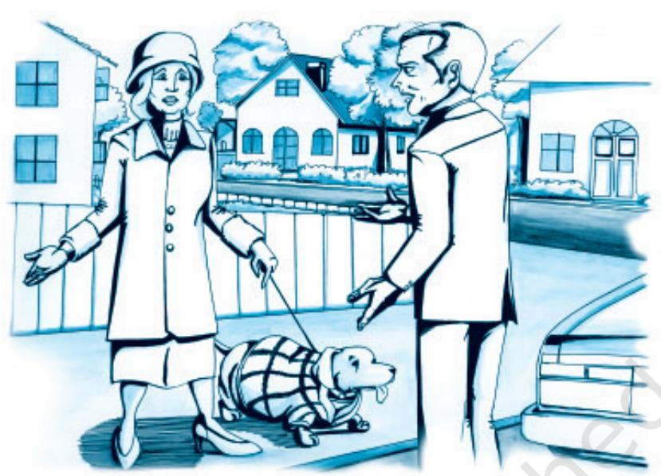
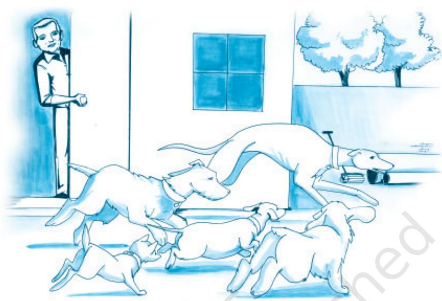
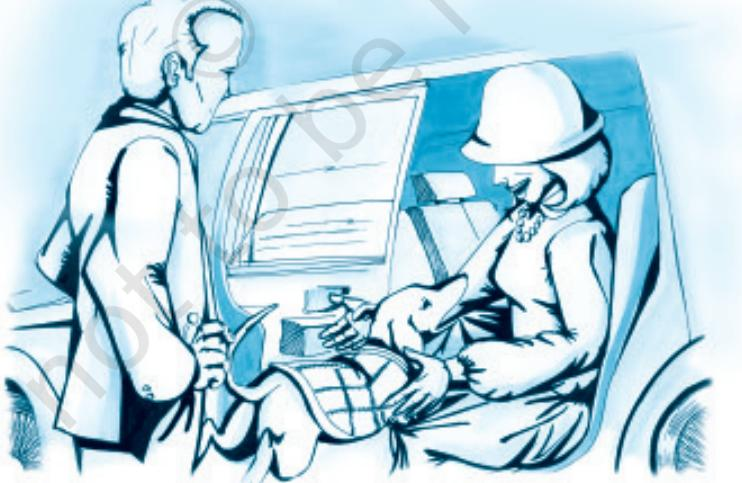
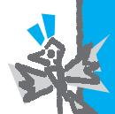
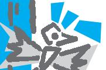

A Triumph of Surgery 1

*Tricki, a small dog, is pampered and overfed by his rich mistress. He falls seriously ill and his mistress consults a veterinary surgeon. Does he perform an operation? Does the dog recover?*

### READ AND FIND OUT

- Why is Mrs Pumphrey worried about Tricki?
- What does she do to help him? Is she wise in this?
- Who does 'I' refer to in this story?

I WAS really worried about Tricki this time. I had pulled up my car when I saw him in the street with his mistress and I was shocked at his appearance. He had become hugely fat, like a bloated sausage with a leg at each corner. His eyes, bloodshot and rheumy, stared straight ahead and his tongue lolled from his jaws.

Mrs Pumphrey hastened to explain, "He was so listless, Mr Herriot. He seemed to have no energy. I thought he must be suffering from malnutrition, so I have been giving him some little extras between meals to build him up, some malt and cod-liver oil and a bowl of Horlicks at night to make him sleep — nothing much really."

"And did you cut down on the sweet things as I told you?"

"Oh, I did for a bit, but he seemed to be so weak I had to relent. He does love cream cakes and chocolates so. I can't bear to refuse him."

I looked down again at the little dog. That was the trouble. Tricki's only fault was greed. He had never been known to refuse food; he would tackle a meal at any hour of the day or night. And I wondered about all the things Mrs Pumphrey hadn't mentioned.

"Are you giving him plenty of exercise?"

"Well, he has his little walks with me as you can see, but Hodgkin, the gardener, has been down with lumbago, so there has been no ring-throwing lately."

I tried to sound severe: "Now I really mean this. If you don't cut his food right down and give him more exercise he is going to be really ill. You must harden your heart and keep him on a very strict diet."

Mrs Pumphrey wrung her hands. "Oh I will, Mr Herriot. I'm sure you are right, but it is so difficult, so very difficult." She set off, head down, along the road, as if determined to put the new regime into practice immediately.

I watched their progress with growing concern. Tricki was tottering along in his little tweed coat; he had a whole wardrobe of these coats for the cold weather and a raincoat for the wet days. He struggled on, drooping in his harness. I thought it wouldn't be long before I heard from Mrs Pumphrey.

The expected call came within a few days. Mrs Pumphrey was distraught. Tricki would eat nothing. Refused even his favourite dishes; and besides, he had bouts of vomiting. He spent all his time lying on a rug, panting. Didn't want to go for walks, didn't want to do anything.

I had made my plans in advance. The only way was to get Tricki out of the house for a period. I suggested that he be hospitalised for about a fortnight to be kept under observation.

The poor lady almost swooned. She was sure he would pine and die if he did not see her every day.

But I took a firm line. Tricki was very ill and this was the only way to save him; in fact, I thought it best to take him without delay and,

followed by Mrs Pumphrey's wailings, I marched out to the car carrying the little dog wrapped in a blanket.

The entire staff was roused and maids rushed in and out bringing his day bed, his night bed, favourite cushions, toys and rubber rings, breakfast bowl, lunch bowl, supper bowl. Realising that my car would never hold all the stuff, I started to drive away. As I moved off, Mrs Pumphrey, with a despairing cry, threw an armful of the little coats through the window. I looked in the mirror before I turned the corner of the drive; everybody was in tears.

Out on the road, I glanced down at the pathetic little animal gasping on the seat by my side. I patted the head and Tricki made a brave effort to wag his tail. "Poor old lad," I said. "You haven't a kick in you but I think I know a cure for you."

## READ AND FIND OUT

- Is the narrator as rich as Tricki's mistress?
- How does he treat the dog?
- Why is he tempted to keep Tricki on as a permanent guest?
- Why does Mrs Pumphrey think the dog's recovery is "a triumph of surgery"?

At the surgery, the household dogs surged round me. Tricki looked down at the noisy pack with dull eyes and, when put down, lay motionless on the carpet. The other dogs, after sniffing round him for a few seconds, decided he was an uninteresting object and ignored him.

I made up a bed for him in a warm loose box next to the one where the other dogs slept. For two days I kept an eye on him, giving him no food but plenty of water. At the end of the second day he started to show some interest in his surroundings and on the third he began to whimper when he heard the dogs in the yard.

When I opened the door, Tricki trotted out and was immediately engulfed by Joe, the greyhound, and his friends. After rolling him over and thoroughly inspecting him, the dogs moved off down the garden. Tricki followed them, rolling slightly with his surplus fat.

Later that day, I was present at feeding time. I watched while Tristan slopped the food into the bowls. There was the usual headlong rush followed by the sounds of high-speed eating; every dog knew that if he fell behind the others he was liable to have some competition for the last part of his meal.

A Triumph of Surgery 3

When they had finished, Tricki took a walk round the shining bowls, licking casually inside one or two of them. Next day, an extra bowl was put out for him and I was pleased to see him jostling his way towards it.

From then on, his progress was rapid. He had no medicinal treatment of any kind but all day he ran about with the dogs, joining in their friendly scrimmages. He discovered the joys of being bowled over, tramped on and squashed every few minutes. He became an accepted member of the gang, an unlikely, silky little object among the shaggy crew, fighting like a tiger for his share at mealtimes and hunting rats in the old henhouse at night. He had never had such a time in his life.

All the while, Mrs Pumphrey hovered anxiously in the background, ringing a dozen times a day for the latest bulletins. I dodged the questions about whether his cushions were being turned regularly or his correct coat worn according to the weather; but I was able to tell her that the little fellow was out of danger and convalescing rapidly.

The word 'convalescing' seemed to do something to Mrs Pumphrey. She started to bring round fresh eggs, two dozen at a time, to build up Tricki's strength. For a happy period my partners and I had two eggs each for breakfast, but when the bottles of wine began to arrive, the real possibilities of the situation began to dawn on the household.

It was to enrich Tricki's blood. Lunch became a ceremonial occasion with two glasses of wine before and several during the meal.

We could hardly believe it when the brandy came to put a final edge on Tricki's constitution. For a few nights the fine spirit was rolled around, inhaled and reverently drunk.

They were days of deep content, starting well with the extra egg in the morning, improved and sustained by the midday wine and finishing luxuriously round the fire with the brandy.

It was a temptation to keep Tricki on as a permanent guest, but I knew Mrs Pumphrey was suffering and after a fortnight, felt compelled to phone and tell her that the little dog had recovered and was awaiting collection.

Within minutes, about thirty feet of gleaming black metal drew up outside the surgery. The chauffeur opened the door and I could just make out the figure of Mrs Pumphrey almost lost in the interior. Her hands were tightly clasped in front of her; her lips trembled. "Oh, Mr Herriot, do tell me the truth. Is he really better?"

"Yes, he's fine. There's no need for you to get out of the car — I'll go and fetch him."

I walked through the house into the garden. A mass of dogs was hurtling round and round the lawn and in their midst, ears flapping, tail waving, was the little golden figure of Tricki. In two weeks he had been transformed into a lithe, hard-muscled animal; he was keeping up well with the pack, stretching out in great bounds, his chest almost brushing the ground.

I carried him back along the passage to the front of the house. The chauffeur was still holding the car door open and when Tricki saw his

mistress he took off from my arms in a tremendous leap and sailed into Mrs Pumphrey's lap. She gave a startled "Ooh!" And then had to defend herself as he swarmed over her, licking her face and barking.

During the excitement, I helped the chauffeur to bring out the beds, toys, cushions, coats and bowls, none of which had been used. As the car moved away, Mrs Pumphrey leaned out of the window. Tears shone in her eyes. Her lips trembled.

"Oh, Mr Herriot," she cried, "how can I ever thank you? This is a triumph of surgery!"

JAMES HERRIOT

#### GLOSSARY

- sausage: finely minced meat stuffed into long cylindrical cases and divided into small lengths by twisting or tying
- rheumy: a watery discharge from a mucous membrane especially of the nose or eyes
- listless: lacking energy and enthusiasm

lumbago: muscular pain in the lower part of the back (lumbar region) regime: prescribed course of exercise and diet

distraught: extremely worried

- surgery: a place where a doctor, a dentist or a veterinary surgeon treats patients
scrimmage: rough or confused struggle

convalescing: recovering from an illness

lithe: flexible

## Think about it

- 1. What kind of a person do you think the narrator, a veterinary surgeon, is? Would you say he is tactful as well as full of common sense?
- 2. Do you think Tricki was happy to go home? What do you think will happen now?
- 3. Do you think this is a real-life episode, or mere fiction? Or is it a mixture of both?

6 Footprints without Feet

# Talk about it

- 1. This episode describes the silly behaviour of a rich woman who is foolishly indulgent, perhaps because she is lonely. Do you think such people are merely silly, or can their actions cause harm to others?
- 2. Do you think there are also parents like Mrs Pumphrey?
- 3. What would you have done if you were: (i) a member of the staff in Mrs Pumphrey's household, (ii) a neighbour? What would your life have been like, in general?
- 4. What would you have done if you were in the narrator's place?

## Suggested reading

- 'Rikki Tikki Tawi' by Rudyard Kipling
- *Dog Stories* by James Herriot
- 'A Zoo in My Luggage' by Gerald Durrell
- 'A Tiger Comes to Town' by R.K. Narayan

A Triumph of Surgery 7

