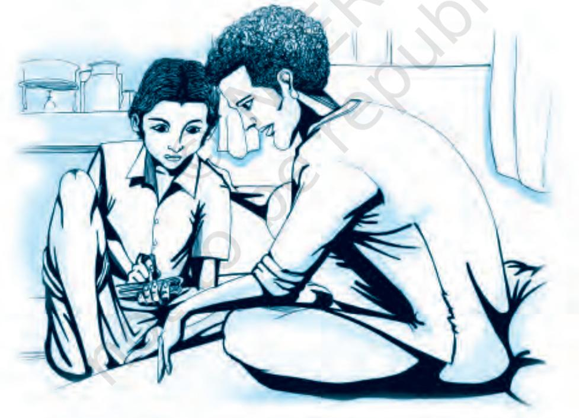
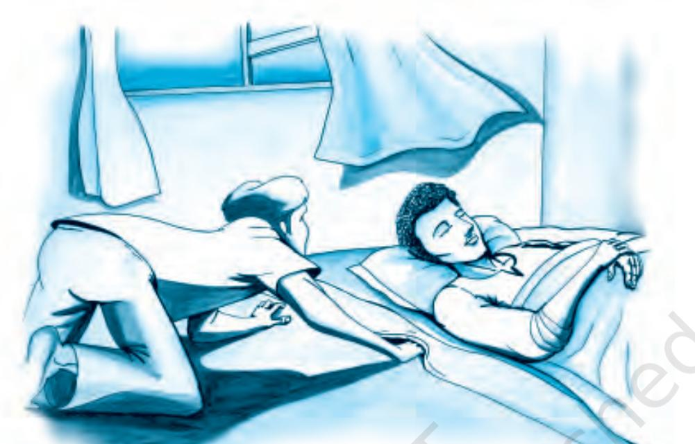

*A young boy makes friends with Anil. Anil trusts him completely and employs him. Does the boy betray his trust?*

### READ AND FIND OUT

- Who does 'I' refer to in this story?
- What is he "a fairly successful hand" at?
- What does he get from Anil in return for his work?

I WAS still a thief when I met Anil. And though only 15, I was an experienced and fairly successful hand.

Anil was watching a wrestling match when I approached him. He was about 25 — a tall, lean fellow — and he looked easy-going, kind and simple enough for my purpose. I hadn't had much luck of late and thought I might be able to get into the young man's confidence.

"You look a bit of a wrestler yourself," I said. A little flattery helps in making friends.

"So do you," he replied, which put me off for a moment because at that time I was rather thin.

"Well," I said modestly, "I do wrestle a bit."

"What's your name?"

"Hari Singh," I lied. I took a new name every month. That kept me ahead of the police and my former employers.

After this introduction, Anil talked about the well-oiled wrestlers who were grunting, lifting and throwing each other about. I didn't have much to say. Anil walked away. I followed casually.

"Hello again," he said.

I gave him my most appealing smile. "I want to work for you," I said. "But I can't pay you."

I thought that over for a minute. Perhaps I had misjudged my man. I asked, "Can you feed me?"

"Can you cook?"

"I can cook," I lied again.

"If you can cook, then may be I can feed you."

He took me to his room over the Jumna Sweet Shop and told me I could sleep on the balcony. But the meal I cooked that night must have been terrible because Anil gave it to a stray dog and told me to be off. But I just hung around, smiling in my most appealing way, and he couldn't help laughing.

Later, he patted me on the head and said never mind, he'd teach me to cook. He also taught me to write my name and said he would soon teach me to write whole sentences and to add numbers. I was grateful. I knew that once I could write like an educated man there would be no limit to what I could achieve.

It was quite pleasant working for Anil. I made the tea in the morning and then would take my time buying the day's supplies, usually making a profit of about a rupee a day. I think he knew I made a little money this way but he did not seem to mind.

The Thief's Story 9

Anil made money by fits and starts. He would borrow one week, lend the next. He kept worrying about his next cheque, but as soon as it arrived he would go out and celebrate. It seems he wrote for magazines a queer way to make a living!

One evening he came home with a small bundle of notes, saying he had just sold a book to a publisher. At night, I saw him tuck the money under the mattress.

I had been working for Anil for almost a month and, apart from cheating on the shopping, had not done anything in my line of work. I had every opportunity for doing so. Anil had given me a key to the door, and I could come and go as I pleased. He was the most trusting person I had ever met.

And that is why it was so difficult to rob him. It's easy to rob a greedy man, because he can afford to be robbed; but it's difficult to rob a careless man — sometimes he doesn't even notice he's been robbed and that takes all the pleasure out of the work.

Well, it's time I did some real work, I told myself; I'm out of practice. And if I don't take the money, he'll only waste it on his friends. After all, he doesn't even pay me.

### READ AND FIND OUT

- How does the thief think Anil will react to the theft?
- What does he say about the different reactions of people when they are robbed?
- Does Anil realise that he has been robbed?

Anil was asleep. A beam of moonlight stepped over the balcony and fell on the bed. I sat up on the floor, considering the situation. If I took the money, I could catch the 10.30 Express to Lucknow. Slipping out of the blanket, I crept up to the bed. Anil was sleeping peacefully. His face was clear and unlined; even I had more marks on my face, though mine were mostly scars.

My hand slid under the mattress, searching for the notes. When I found them, I drew them out without a sound. Anil sighed in his sleep and turned on his side, towards me. I was startled and quickly crawled out of the room.

When I was on the road, I began to run. I had the notes at my waist, held there by the string of my pyjamas. I slowed down to a walk and counted the notes: 600 rupees in fifties! I could live like an oil-rich Arab for a week or two.

When I reached the station I did not stop at the ticket office (I had never bought a ticket in my life) but dashed straight to the platform. The Lucknow Express was just moving out. The train had still to pick up speed and I should have been able to jump into one of the carriages, but I hesitated — for some reason I can't explain — and I lost the chance to get away.

When the train had gone, I found myself standing alone on the deserted platform. I had no idea where to spend the night. I had no friends, believing that friends were more trouble than help. And I did not want to make anyone curious by staying at one of the small hotels near the station. The only person I knew really well was the man I had robbed. Leaving the station, I walked slowly through the bazaar.

In my short career as a thief, I had made a study of men's faces when they had lost their goods. The greedy man showed fear; the rich man showed anger; the poor man showed acceptance. But I knew that Anil's face, when he discovered the theft, would show only a touch of sadness. Not for the loss of money, but for the loss of trust.

I found myself in the *maidan* and sat down on a bench. The night was chilly — it was early November — and a light drizzle added to my discomfort. Soon it was raining quite heavily. My shirt and pyjamas stuck to my skin, and a cold wind blew the rain across my face.

The Thief's Story 11

I went back to the bazaar and sat down in the shelter of the clock tower. The clock showed midnight. I felt for the notes. They were damp from the rain.

Anil's money. In the morning he would probably have given me two or three rupees to go to the cinema, but now I had it all. I couldn't cook his meals, run to the bazaar or learn to write whole sentences any more.

I had forgotten about them in the excitement of the theft. Whole sentences, I knew, could one day bring me more than a few hundred rupees. It was a simple matter to steal — and sometimes just as simple to be caught. But to be a really big man, a clever and respected man, was something else. I should go back to Anil, I told myself, if only to learn to read and write.

I hurried back to the room feeling very nervous, for it is much easier to steal something than to return it undetected. I opened the door quietly, then stood in the doorway, in clouded moonlight. Anil was still asleep. I crept to the head of the bed, and my hand came up with the notes. I felt his breath on my hand. I remained still for a minute. Then my hand found the edge of the mattress, and slipped under it with the notes.

I awoke late next morning to find that Anil had already made the tea. He stretched out his hand towards me. There was a fifty-rupee note between his fingers. My heart sank. I thought I had been discovered.

"I made some money yesterday," he explained. "Now you'll be paid regularly."

My spirits rose. But when I took the note, I saw it was still wet from the night's rain.

"Today we'll start writing sentences," he said.

He knew. But neither his lips nor his eyes showed anything. I smiled at Anil in my most appealing way. And the smile came by itself, without any effort.

RUSKIN BOND

#### GLOSSARY

flattery: insincere praise modestly: without boasting; in a humble way grunting: making low guttural sounds appealing: attractive unlined: (here) showing no sign of worry or anxiety

12 Footprints without Feet

# Think about it

- 1. What are Hari Singh's reactions to the prospect of receiving an education? Do they change over time? (*Hint*: Compare, for example, the thought: "I knew that once I could write like an educated man there would be no limit to what I could achieve" with these later thoughts: "Whole sentences, I knew, could one day bring me more than a few hundred rupees. It was a simple matter to steal — and sometimes just as simple to be caught. But to be a really big man, a clever and respected man, was something else.") What makes him return to Anil?
- 2. Why does not Anil hand the thief over to the police? Do you think most people would have done so? In what ways is Anil different from such employers?

## Talk about it

- 1. Do you think people like Anil and Hari Singh are found only in fiction, or are there such people in real life?
- 2. Do you think it a significant detail in the story that Anil is a struggling writer? Does this explain his behaviour in any way?
- 3. Have you met anyone like Hari Singh? Can you think and imagine the circumstances that can turn a fifteen-year-old boy into a thief?
- 4. Where is the story set? (You can get clues from the names of the persons and places mentioned in it.) Which language or languages are spoken in these places? Do you think the characters in the story spoke to each other in English?

Suggested reading

- 'He Said It with Arsenic' by Ruskin Bond
- 'Vanka' by Anton Chekhov
- 'A Scandal in Bohemia' by Arthur Conan Doyle

The Thief's Story 13

