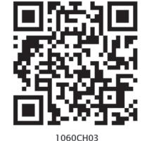
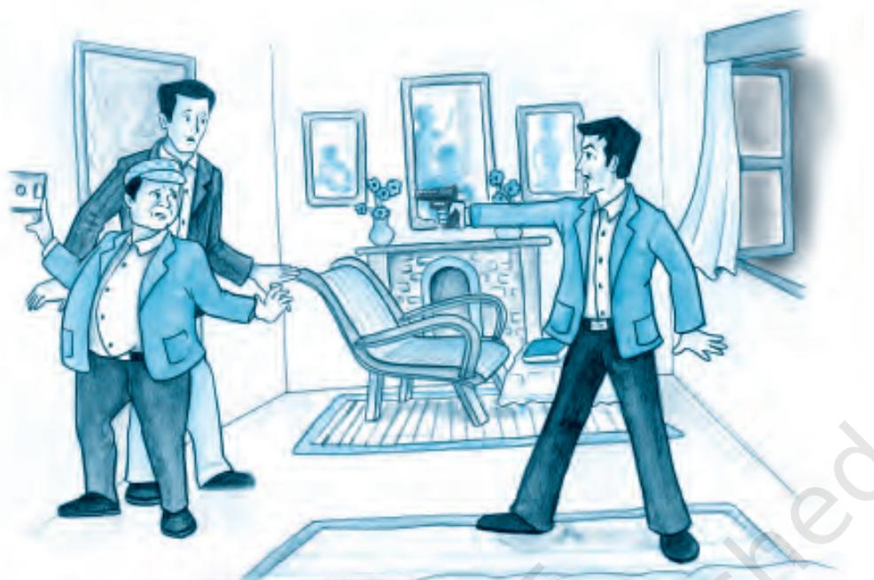
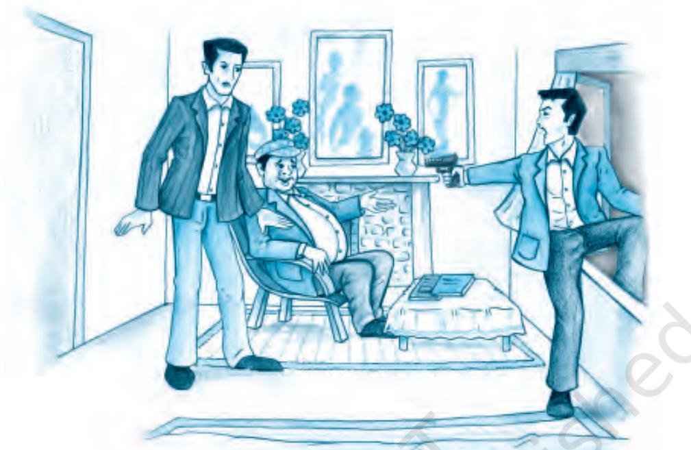

# The Midnight Visitor 3

*Ausable, a secret agent, is expecting to get a very important report. Another secret agent, Max, threatens him with a pistol, demanding the report. Does Ausable outwit him?*

## READ AND FIND OUT

- How is Ausable different from other secret agents?
- Who is Fowler and what is his first authentic thrill of the day?

AUSABLE did not fit any description of a secret agent Fowler had ever read. Following him down the musty corridor of the gloomy French hotel where Ausable had a room, Fowler felt let down. It was a small room, on the sixth and top floor, and scarcely a setting for a romantic adventure.

Ausable was, for one thing, fat. Very fat. And then there was his accent. Though he spoke French and German passably, he had never altogether lost the American accent he had brought to Paris from Boston twenty years ago.

"You are disappointed," Ausable said wheezily over his shoulder. "You were told that I was a secret agent, a spy, dealing in espionage and danger. You wished to meet me because you are a writer, young and romantic. You envisioned mysterious figures in the night, the crack of pistols, drugs in the wine."

"Instead, you have spent a dull evening in a French music hall with a sloppy fat man who, instead of having messages slipped into his hand by dark-eyed beauties, gets only a prosaic telephone call making an appointment in his room. You have been bored!" The fat man chuckled to himself as he unlocked the door of his room and stood aside to let his frustrated guest enter.

"You are disillusioned," Ausable told him. "But take cheer, my young friend. Presently you will see a paper, a quite important paper for

which several men and women have risked their lives, come to me. Some day soon that paper may well affect the course of history. In that thought is drama, is there not?"

As he spoke, Ausable closed the door behind him. Then he switched on the light.

And as the light came on, Fowler had his first authentic thrill of the day. For halfway across the room, a small automatic pistol in his hand, stood a man.

Ausable blinked a few times.

"Max," he wheezed, "you gave me quite a start. I thought you were in Berlin. What are you doing here in my room?"

### READ AND FIND OUT

- How has Max got in?
- How does Ausable say he got in?

Max was slender, a little less than tall, with features that suggested slightly the crafty, pointed countenance of a fox. There was about him aside from the gun — nothing especially menacing.

"The report," he murmured. "The report that is being brought to you tonight concerning some new missiles. I thought I would take it from you. It will be safer in my hands than in yours."

The Midnight Visitor 15

Ausable moved to an armchair and sat down heavily. "I'm going to raise the devil with the management this time, and you can bet on it," he said grimly. "This is the second time in a month that somebody has got into my room through that nuisance of a balcony!" Fowler's eyes went to the single window of the room. It was an ordinary window, against which now the night was pressing blackly.

 "Balcony?" Max said, with a rising inflection. "No, a passkey. I did not know about the balcony. It might have saved me some trouble had I known."

"It's not my balcony," Ausable said with extreme irritation. "It belongs to the next apartment." He glanced explanatorily at Fowler. "You see," he said, "this room used to be part of a large unit, and the next room through that door there — used to be the living room. *It* had the balcony, which extends under *my* window now. You can get onto it from the empty room two doors down — and somebody did, last month. The management promised to block it off. But they haven't."

Max glanced at Fowler, who was standing stiffly not far from Ausable, and waved the gun with a commanding gesture. "Please sit down," he said. "We have a wait of half an hour, I think."

"Thirty-one minutes," Ausable said moodily. "The appointment was for twelve-thirty. I wish I knew how you learned about the report, Max."

The little spy smiled evilly. "And we wish we knew how your people got the report. But no harm has been done. I will get it back tonight. What is that? Who is at the door?"

Fowler jumped at the sudden knocking at the door. Ausable just smiled. "That will be the police," he said. "I thought that such an important paper as the one we are waiting for should have a little extra protection. I told them to check on me to make sure everything was all right."

Max bit his lip nervously. The knocking was repeated.

"What will you do now, Max?" Ausable asked. "If I do not answer the door, they will enter anyway. The door is unlocked. And they will not hesitate to shoot."

Max's face was black with anger as he backed swiftly towards the window. He swung a leg over the sill. "Send them away!" he warned. "I will wait on the balcony. Send them away or I'll shoot and take my chances!"

The knocking at the door became louder and a voice was raised. "Mr Ausable! Mr Ausable!"

16 Footprints without Feet

Keeping his body twisted so that his gun still covered the fat man and his guest, the man at the window grasped the frame with his free hand to support himself. Then he swung his other leg up and over the window-sill.

The doorknob turned. Swiftly Max pushed with his left hand to free himself from the sill and drop to the balcony. And then, as he dropped, he screamed once, shrilly.

The door opened and a waiter stood there with a tray, a bottle and two glasses. "Here is the drink you ordered for when you returned," he said, and set the tray on the table, deftly uncorked the bottle, and left the room.

White-faced, Fowler stared after him. "But..." he stammered, "the police..."

"There were no police." Ausable sighed. "Only Henry, whom I was expecting."

"But won't that man out on the balcony…?" Fowler began.

"No," said Ausable, "he won't return. You see, my young friend, there is no balcony."

ROBERT ARTHUR

The Midnight Visitor 17

#### GLOSSARY

romantic: imaginative; having a fantastic view of reality passably: just well enough; tolerably well espionage: spying sloppy: (here) carelessly dressed prosaic: ordinary chuckled: laughed quietly, without opening his mouth wheezed: spoke breathing noisily and heavily missiles: weapons directed by remote control or automatically shrilly: piercingly; in a high pitch

## Think about it

- 1. "Ausable did not fit any description of a secret agent Fowler had ever read." What do secret agents in books and films look like, in your opinion? Discuss in groups or in class some stories or movies featuring spies, detectives and secret agents, and compare their appearance with that of Ausable in this story. (You may mention characters from fiction in languages other than English. In English fiction you may have come across Sherlock Holmes, Hercule Poirot, or Miss Marple. Have you watched any movies featuring James Bond?)
- 2. How does Ausable manage to make Max believe that there is a balcony attached to his room? Look back at his detailed description of it. What makes it a convincing story?
- 3. Looking back at the story, when do you think Ausable thought up his plan for getting rid of Max? Do you think he had worked out his plan in detail right from the beginning? Or did he make up a plan taking advantage of events as they happened?

## Talk about it

- 1. In this story, Ausable shows great 'presence of mind,' or the ability to think quickly, and act calmly and wisely, in a situation of danger and surprise. Give examples from your own experience, or narrate a story, which shows someone's presence of mind.
- 2. Discuss what you would do in the situations described below. Remember that presence of mind comes out of a state of mental preparedness. If you have thought about possible problems or

18 Footprints without Feet

dangers, and about how to act in such situations, you have a better chance of dealing with such situations if they do arise.

- A small fire starts in your kitchen.
- A child starts to choke on a piece of food.
- An electrical appliance starts to hiss and gives out sparks.
- A bicycle knocks down a pedestrian.
- It rains continuously for more than twenty-four hours.
- A member of your family does not return home at the usual or expected time.

You may suggest other such situations.

# Suggested reading

- 'After Twenty Years' by O. Henry
- 'The Stolen Bacillus' by H.G. Wells
- 'The Face on the Wall' by E.V. Lucas

The Midnight Visitor 19

