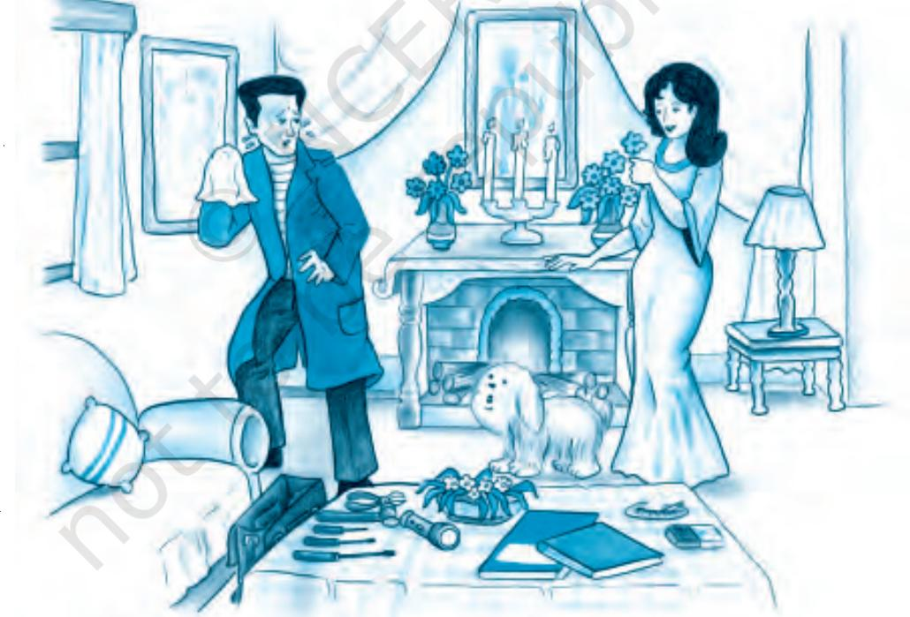

*It is said that you must set a thief to catch a thief. But it is also said that there is honour among thieves. Which saying does this story illustrate?*

READ AND FIND OUT

- What does Horace Danby like to collect?
- Why does he steal every year?

EVERYONE thought that Horace Danby was a good, honest citizen. He was about fifty years old and unmarried, and he lived with a housekeeper who worried over his health. In fact, he was usually very well and happy except for attacks of hay fever in summer. He made locks and was successful enough at his business to have two helpers. Yes, Horace Danby was good and respectable — but not completely honest.

Fifteen years ago, Horace had served his first and only sentence in a prison library. He loved rare, expensive books. So he robbed a safe every year. Each year he planned carefully just what he would do, stole enough to last for twelve months, and secretly bought the books he loved through an agent.

Now, walking in the bright July sunshine, he felt sure that this year's robbery was going to be as successful as all the others. For two weeks he had been studying the house at Shotover Grange, looking at its rooms, its electric wiring, its paths and its garden. This afternoon the two servants, who remained in the Grange while the family was in London, had gone to the movies. Horace saw them go, and he felt happy in spite of a little tickle of hay fever in his nose. He came out from behind the garden wall, his tools carefully packed in a bag on his back.

There were about fifteen thousand pounds' worth of jewels in the Grange safe. If he sold them one by one, he expected to get at least five thousand, enough to make him happy for another year. There were three very interesting books coming up for sale in the autumn. Now he would get the money he wanted to buy them.

He had seen the housekeeper hang the key to the kitchen door on a hook outside. He put on a pair of gloves, took the key, and opened the door. He was always careful not to leave any fingerprints.

A small dog was lying in the kitchen. It stirred, made a noise, and moved its tail in a friendly way.

"All right, Sherry," Horace said as he passed. All you had to do to keep dogs quiet was to call them by their right names, and show them love.

The safe was in the drawing room, behind a rather poor painting. Horace wondered for a moment whether he should collect pictures instead of books. But they took up too much room. In a small house, books were better.

There was a great bowl of flowers on the table, and Horace felt his nose tickle. He gave a little sneeze and then put down his bag. He carefully arranged his tools. He had four hours before the servants returned.

The safe was not going to be hard to open. After all, he had lived with locks and safes all his life. The burglar alarm was poorly built. He went into the hall to cut its wire. He came back and sneezed loudly as the smell of the flowers came to him again.

How foolish people are when they own valuable things, Horace thought. A magazine article had described this house, giving a plan of all the rooms and a picture of this room. The writer had even mentioned that the painting hid a safe!

But Horace found that the flowers were hindering him in his work. He buried his face in his handkerchief.

Then he heard a voice say from the doorway, "What is it? A cold or hay fever?"

Before he could think, Horace said, "Hay fever," and found himself sneezing again.

The voice went on, "You can cure it with a special treatment, you know, if you find out just what plant gives you the disease. I think you'd better see a doctor, if you're serious about your work. I heard you from the top of the house just now."

A Question of Trust 21

### READ AND FIND OUT

- Who is speaking to Horace Danby?
- Who is the real culprit in the story?

It was a quiet, kindly voice, but one with firmness in it. A woman was standing in the doorway, and Sherry was rubbing against her. She was young, quite pretty, and was dressed in red. She walked to the fireplace and straightened the ornaments there.

"Down, Sherry," she said. "Anyone would think I'd been away for a month!" She smiled at Horace, and went on, "However, I came back just in time, though I didn't expect to meet a burglar."

Horace had some hope because she seemed to be amused at meeting him. He might avoid trouble if he treated her the right way. He replied, "I didn't expect to meet one of the family."

She nodded. "I see what an inconvenience it is for you to meet me. What are you going to do?"

Horace said, "My first thought was to run."

"Of course, you could do that. But I would telephone the police and tell them all about you. They'd get you at once."

Horace said, "I would, of course, cut the telephone wires first and then...," he hesitated, a smile on his face, "I would make sure that you could do nothing for some time. A few hours would be enough."

She looked at him seriously. "You'd hurt me?"

Horace paused, and then said, "I think I was trying to frighten you when I said that."

"You didn't frighten me."

Horace suggested, "It would be nice if you would forget you ever saw me. Let me go."

The voice was suddenly sharp. "Why should I? You were going to rob me. If I let you go, you'll only rob someone else. Society must be protected from men like you."

Horace smiled. "I'm not a man who threatens society. I steal only from those who have a lot of money. I steal for a very good reason. And I hate the thought of prison."

She laughed, and he begged, thinking that he had persuaded her, "Look, I have no right to ask you for anything, but I'm desperate. Let me go and I promise never to do this kind of thing again. I really mean it."

She was silent, watching him closely. Then she said, "You are really afraid of going to prison, aren't you?"

She came over to him shaking her head. "I have always liked the wrong kind of people."

She picked up a silver box from the table and took a cigarette from it. Horace, eager to please her and seeing that she might help him, took off his gloves and gave her his cigarette lighter.

"You'll let me go?" He held the lighter towards her.

"Yes, but only if you'll do something for me."

"Anything you say."

"Before we left for London, I promised my husband to take my jewels to our bank; but I left them here in the safe. I want to wear them to a party tonight, so I came down to get them, but…"

Horace smiled. "You've forgotten the numbers to open the safe, haven't you?"

"Yes," replied the young lady.

"Just leave it to me and you'll have them within an hour. But I'll have to break your safe."

"Don't worry about that. My husband won't be here for a month, and I'll have the safe mended by that time."

A Question of Trust 23

And within an hour Horace had opened the safe, given her the jewels, and gone happily away.

For two days he kept his promise to the kind young lady. On the morning of the third day, however, he thought of the books he wanted and he knew he would have to look for another safe. But he never got the chance to begin his plan. By noon a policeman had arrested him for the jewel robbery at Shotover Grange.

His fingerprints, for he had opened the safe without gloves, were all over the

room, and no one believed him when he said that the wife of the owner of the house had asked him to open the safe for her. The wife herself, a gray-haired, sharp-tongued woman of sixty, said that the story was nonsense.

Horace is now the assistant librarian in the prison. He often thinks of the charming, clever young lady who was in the same profession as he was, and who tricked him. He gets very angry when anyone talks about 'honour among thieves'.

VICTOR CANNING

#### GLOSSARY

hay fever: a disorder affecting the nose and throat, caused by allergy to pollen or dust

24 Footprints without Feet

# Think about it

- 1. Did you begin to suspect, before the end of the story, that the lady was not the person Horace Danby took her to be? If so, at what point did you realise this, and how?
- 2. What are the subtle ways in which the lady manages to deceive Horace Danby into thinking she is the lady of the house? Why doesn't Horace suspect that something is wrong?
- 3. "Horace Danby was good and respectable but not completely honest". Why do you think this description is apt for Horace? Why can't he be categorised as a typical thief?
- 4. Horace Danby was a meticulous planner but still he faltered. Where did he go wrong and why?

# Talk about it

- 1. Do you think Horace Danby was unfairly punished, or that he deserved what he got?
- 2. Do intentions justify actions? Would you, like Horace Danby, do something wrong if you thought your ends justified the means? Do you think that there are situations in which it is excusable to act less than honestly?

## Suggested reading

- 'The Unexpected' by Ella Edkin
- 'The Confession' by Anton Chekhov
- 'A Case for the Defence' by Graham Greene

A Question of Trust 25

