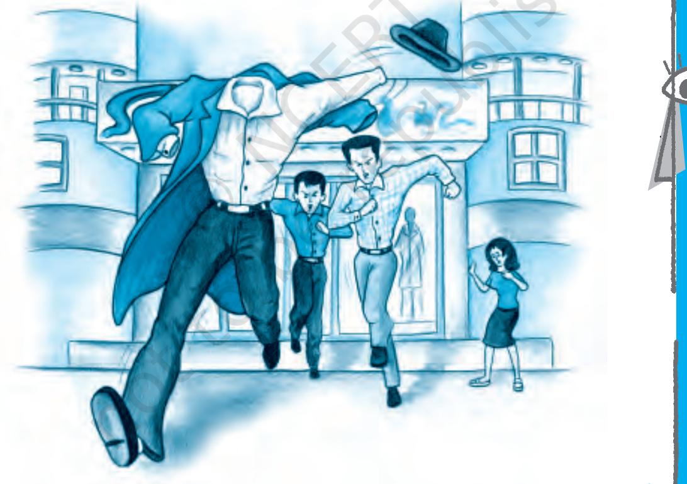

*Can a man become invisible? This is the story of a scientist who discovers how to make himself invisible. Does he use, or misuse, his discovery?*

Footprints without Feet 5

### READ AND FIND OUT

- How did the invisible man first become visible?
- Why was he wandering the streets?

THE two boys started in surprise at the fresh muddy imprints of a pair of bare feet. What was a barefooted man doing on the steps of a house, in the middle of London? And where was the man?

As they gazed, a remarkable sight met their eyes. A fresh footmark appeared from nowhere!

Further footprints followed, one after another, descending the steps and progressing down the street. The boys followed, fascinated, until the muddy impressions became fainter and fainter, and at last disappeared altogether.

The explanation of the mystery was really simple enough. The bewildered boys had been following a scientist who had just discovered how to make the human body transparent.

Griffin, the scientist, had carried out experiment after experiment to prove that the human body could become invisible. Finally he swallowed certain rare drugs and his body became as transparent as a sheet of glass — though it also remained as solid as glass.

Brilliant scientist though he was, Griffin was rather a lawless person. His landlord disliked him and tried to eject him. In revenge Griffin set fire to the house. To get away without being seen he had to remove his clothes. Thus it was that he became a homeless wanderer, without clothes, without money, and quite invisible — until he happened to step in some mud, and left footprints as he walked!

He escaped easily enough from the boys who followed his footprints in London. But his adventures were by no means over. He had chosen a bad time of the year to wander about London without clothes. It was mid-winter. The air was bitterly cold and he could not do without clothes. Instead of walking about the streets he decided to slip into a big London store for warmth.

Closing time arrived, and as soon as the doors were shut Griffin was able to give himself the pleasure of clothing and feeding himself without regard to expense. He broke open boxes and wrappers and fitted himself out with warm clothes. Soon, with shoes, an overcoat and a wide-brimmed hat, he became a fully dressed and visible person. In the kitchen of the restaurant he found cold meat and coffee, and he followed up the meal with sweets and wine taken from the grocery store. Finally he settled down to sleep on a pile of quilts.

If only Griffin had managed to wake up in good time all might have been well. As it was, he did not wake up until the assistants were already arriving next morning. When he saw a couple of them

Footprints without Feet 27

approaching, he panicked and began to run. They naturally gave chase. In the end he was able to escape only by quickly taking off his newlyfound clothes. So once more he found himself invisible but naked in the chill January air.

This time he decided to try the stock of a theatrical company in the hope of finding not only clothes but also something that would hide the empty space above his shoulders. Shivering with cold he hurried to Drury Lane, the centre of the theatre world.

He soon found a suitable shop. He made his way, invisible, upstairs and came out a little later wearing bandages round his forehead, dark glasses, false nose, big bushy side-whiskers, and a large hat. To escape without being seen, he callously attacked the shopkeeper from behind, after which he robbed him of all the money he could find.

### READ AND FIND OUT

- Why does Mrs Hall find the scientist eccentric?
- What curious episode occurs in the study?
- What other extraordinary things happen at the inn?

Eager to get away from crowded London he took a train to the village of Iping, where he booked two rooms at the local inn.

The arrival of a stranger at an inn in winter was in any case an unusual event. A stranger of such uncommon appearance set all tongues wagging. Mrs Hall, the landlord's wife, made every effort to be friendly. But Griffin had no desire to talk, and told her, "My reason for coming to Iping is a desire for solitude. I do not wish to be disturbed in my work. Besides, an accident has affected my face."

Satisfied that her guest was an eccentric scientist, and in view of the fact that he had paid her in advance, Mrs Hall was prepared to excuse his strange habits and irritable temper. But the stolen money did not last long, and presently Griffin had to admit that he had no more ready cash. He pretended, however, that he was expecting a cheque to arrive at any moment.

Shortly afterwards a curious episode occurred. Very early in the morning a clergyman and his wife were awakened by noises in the study. Creeping downstairs, they heard the chink of money being taken from the clergyman's desk.

Without making any noise and with a poker grasped firmly in his hand, the clergyman flung open the door.

"Surrender!"

28 Footprints without Feet

Then to his amazement he realised that the room appeared to be empty. He and his wife looked under the desk, and behind the curtains, and even up the chimney. There wasn't a sign of anybody. Yet the desk had been opened and the housekeeping money was missing.

"Extraordinary affair!" the clergyman kept saying for the rest of the day.

But it was not as extraordinary as the behaviour of Mrs Hall's furniture a little later that morning.

The landlord and his wife were up very early, and were surprised to see the scientist's door wide open. Usually it was shut and locked, and he was furious if anyone entered his room. The opportunity seemed too good to be missed. They peeped round the door, saw nobody, and decided to investigate. The bedclothes were cold, showing that the scientist must have been up for some time; and stranger still, the clothes and bandages that he always wore were lying about the room.

All of a sudden Mrs Hall heard a sniff close to her ear. A moment later the hat on the bedpost leapt up and dashed itself into her face. Then the bedroom chair became alive. Springing into the air it charged straight at her, legs foremost. As she and her husband turned away in terror, the extraordinary chair pushed them both out of the room and then appeared to slam and lock the door after them.

Mrs Hall almost fell down the stairs in hysterics. She was convinced that the room was haunted by spirits, and that the stranger had somehow caused these to enter into her furniture.

"My poor mother used to sit in that chair," she moaned. "To think it should rise up against me now!"

The feeling among the neighbours was that the trouble was caused by witchcraft. But witchcraft or not, when news of the burglary at the clergyman's home became known, the strange scientist was strongly suspected of having had a hand in it. Suspicion grew even stronger when he suddenly produced some ready cash, though he had admitted not long before that he had no money.

The village constable was secretly sent for. Instead of waiting for the constable, Mrs Hall went to the scientist, who had somehow mysteriously appeared from his empty bedroom.

"I want to know what you have been doing to my chair upstairs," she demanded. "And I want to know how it is you came out of an empty room and how you entered a locked room."

Footprints without Feet 29

The scientist was always quick-tempered; now he became furious. "You don't understand who or what I am!" he shouted. "Very well — I'll show you."

Suddenly he threw off bandages, whiskers, spectacles, and even nose. It took him only a minute to do this. The horrified people in the bar found themselves staring at a headless man!

Mr Jaffers, the constable, now arrived, and was quite surprised to find that he had to arrest a man without a head. But Jaffers was not easily prevented from doing his duty. If a magistrate's warrant ordered a person's arrest, then that person had to be arrested, with or without his head.

There followed a remarkable scene as the policeman tried to get hold of a man who was becoming more and more invisible as he threw off one garment after another. Finally a shirt flew into the air, and the constable found himself struggling with someone he could not see at

30 Footprints without Feet

all. Some people tried to help him, but found themselves hit by blows that seemed to come from nowhere.

In the end Jaffers was knocked unconscious as he made a last attempt to hold on to the unseen scientist.

There were nervous, excited cries of "Hold him!" But this was easier said than done. Griffin had shaken himself free, and no one knew where to lay hands on him.

H.G. WELLS

### Think about it

- 1. "Griffin was rather a lawless person." Comment.
- 2. How would you assess Griffin as a scientist?

## Talk about it

- 1. Would you like to become invisible? What advantages and disadvantages do you foresee, if you did?
- 2. Are there forces around us that are invisible, for example, magnetism? Are there aspects of matter that are 'invisible' or not visible to the naked eye? What would the world be like if you could see such forces or such aspects of matter?
- 3. What makes glass or water transparent (what is the scientific explanation for this)? Do you think it would be scientifically possible for a man to become invisible, or transparent? (Keep in mind that writers of science fiction have often turned out to be prophetic in their imagination!)

# Suggested reading

- *The Invisible Man* by H.G. Wells
- 'As Far As the Human Eye Can See' by Isaac Asimov
- *It Happened Tomorrow* (ed.) Bal Phondke

Footprints without Feet 31

