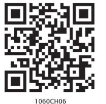
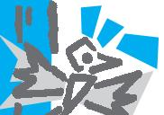
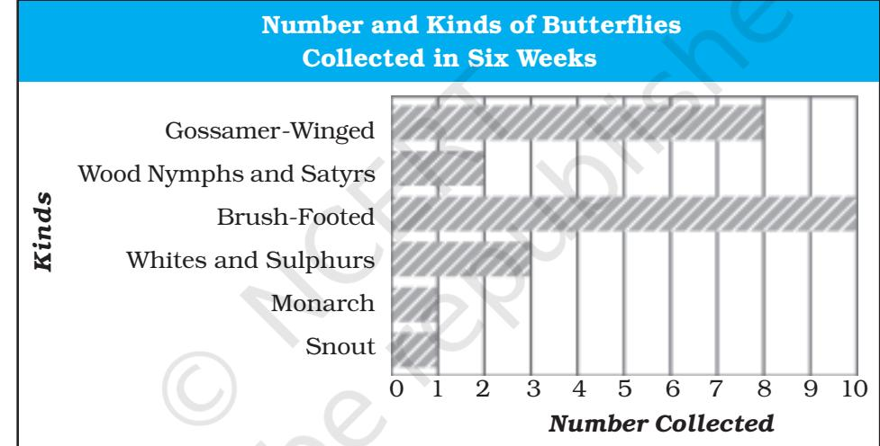
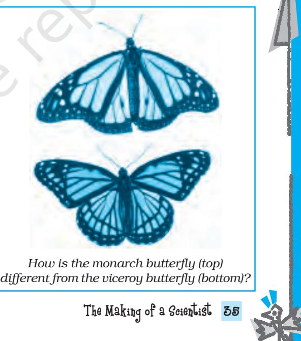

# The Making of a Scientist 6

*Richard Ebright has recieved the Searle Scholar Award and the Schering Plough Award for Biochemistry and Molecular Biology. It was his fascination for butterflies that opened the world of science to him.*

### READ AND FIND OUT

- How did a book become a turning point in Richard Ebright's life?
- How did his mother help him?

AT the age of twenty-two, a former 'scout of the year' excited the scientific world with a new theory on how cells work. Richard H. Ebright and his college room-mate explained the theory in an article in the *Proceedings of the National Academy of Science.*

It was the first time this important scientific journal had ever published the work of college students. In sports, that would be like making the big leagues at the age of fifteen and hitting a home run your first time at bat* . For Richard Ebright, it was the first in a long string of achievements in science and other fields. And it all started with butterflies.

An only child, Ebright grew up north of Reading, Pennsylvania. "There wasn't much I could do there," he said. "I certainly couldn't play football or baseball with a team of one. But there was one thing I could do — collect things."

So he did, and did he ever! Beginning in kindergarten, Ebright collected butterflies with the same determination that has marked all his activities. He also collected rocks, fossils, and coins. He became an eager astronomer, too, sometimes star-gazing all night.

* A home run in the game of baseball is when the batter scores a run after running safely around all bases and back to the home plate without stopping. A ball hit out of the playing field is also called a home run. Getting a paper published at the age of fifteen in a scientific journal is here compared to scoring a home run while batting for the first time.

From the first he had a driving curiosity along with a bright mind. He also had a mother who encouraged his interest in learning. She took him on trips, bought him telescopes, microscopes, cameras, mounting materials, and other equipment and helped him in many other ways.

"I was his only companion until he started school," his mother said. "After that I would bring home friends for him. But at night we just did things together. Richie was my whole life after his father died when Richie was in third grade."

She and her son spent almost every evening at the dining room table. "If he didn't have things to do, I found work for him — not physical work, but learning things," his mother said. "He liked it. He wanted to learn."

And learn he did. He earned top grades in school. "On everyday things he was just like every other kid," his mother said.

By the time he was in the second grade, Ebright had collected all twentyfive species of butterflies found around his hometown. (See following box.)

|  | Species and Sub-species of Butterflies Collected in |  |
| --- | --- | --- |
|  | Six Weeks in Reading, Pennsylvania |  |
| Gossamer-Winged | Wood Nymphs | Brush-footed |
| Butterflies | and Satyrs | Butterflies |
| • • white M hairstreak | eyed brown • | variegated fritillary |
| • acadian hairstreak • | wood nymph (grayling) • | Harris's checkerspot |
| • bronze copper | • Monarchs | pearl crescent |
| • bog copper • | • monarch or milkweed | mourning cloak |
| • purplish copper | • | painted lady |
| • eastern-tailed blue | Whites and Sulphurs • | buckeye |
| • • melissa blue | olympia • | viceroy |
| • • silvery blue | cloudless sulphur • | white admiral |
| • | European cabbage | • red-spotted purple |
| Snout Butterfly |  | • hackberry |

"That probably would have been the end of my butterfly collecting," he said. "But then my mother got me a children's book called *The Travels of Monarch X."* That book, which told how monarch butterflies migrate to Central America, opened the world of science to the eager young collector.

The Making of a Scientist 33

At the end of the book, readers were invited to help study butterfly migrations. They were asked to tag butterflies for research by Dr Frederick A. Urquhart of the University of Toronto, Canada. Ebright's mother wrote to Dr Urquhart, and soon Ebright was attaching light adhesive tags to the wings of monarchs. Anyone who found a tagged butterfly was asked to send the tag to Dr Urquhart.

The butterfly collecting season around Reading lasts six weeks in late summer. (See graph below.) If you're going to chase them one by one, you won't catch very many. So the next step for Ebright was to raise a flock of butterflies. He would catch a female monarch, take her eggs, and raise them in his basement through their life cycle, from egg to caterpillar to pupa to adult butterfly. Then he would tag the butterflies' wings and let them go. For several years his basement was home to thousands of monarchs in different stages of development.

"Eventually I began to lose interest in tagging butterflies. It's tedious and there's not much feedback," Ebright said. "In all the time I did it," he laughed, "only two butterflies I had tagged were recaptured — and they were not more than seventy-five miles from where I lived."

## READ AND FIND OUT

- What lesson does Ebright learn when he does not win anything at a science fair?
- What experiments and projects does he then undertake?
- What are the qualities that go into the making of a scientist?

34 Footprints without Feet

Then in the seventh grade he got a hint of what real science is when he entered a county science fair — and lost. "It was really a sad feeling to sit there and not get anything while everybody else had won something," Ebright said. His entry was slides of frog tissues, which he showed under a microscope. He realised the winners had tried to do real experiments, not simply make a neat display.

Already the competitive spirit that drives Richard Ebright was appearing. "I knew that for the next year's fair I would have to do a real experiment," he said. "The subject I knew most about was the insect work I'd been doing in the past several years."

So he wrote to Dr Urquhart for ideas, and back came a stack of suggestions for experiments. Those kept Ebright busy all through high school and led to prize projects in county and international science fairs.

For his eighth grade project, Ebright tried to find the cause of a viral disease that kills nearly all monarch caterpillars every few years. Ebright thought the disease might be carried by a beetle. He tried raising caterpillars in the presence of beetles. "I didn't get any real results," he said. "But I went ahead and showed that I had tried the experiment. This time I won."

The next year his science fair project was testing the theory that viceroy butterflies copy monarchs. The theory was that viceroys look like monarchs because monarchs don't taste good to birds. Viceroys,

on the other hand, do taste good to birds. So the more they look like monarchs, the less likely they are to become a bird's dinner.

Ebright's project was to see whether, in fact, birds would eat monarchs. He found that a starling would not eat ordinary bird food. It *would* eat all the monarchs it could get. (Ebright said later research by other people showed that viceroys probably do copy the monarch.) This project was placed first in the zoology division and third overall in the county science fair.

In his second year in high school, Richard Ebright began the research that led to his discovery of an unknown insect hormone. lndirectly, it also led to his new theory on the life of cells.

The question he tried to answer was simple: What is the purpose of the twelve tiny gold spots on a monarch pupa?

"Everyone assumed the spots were just ornamental," Ebright said. "But Dr Urquhart didn't believe it."

To find the answer, Ebright and another excellent science student first had to build a device that showed that the spots were producing a hormone necessary for the butterfly's full development.

This project won Ebright first place in the county fair and entry into the International Science and Engineering Fair. There he won third place for zoology. He also got a chance to work during the summer at the entomology laboratory of the Walter Reed Army Institute of Research.

As a high school junior, Richard Ebright continued his advanced experiments on the monarch pupa. That year his project won first place at the International Science Fair and gave him another chance to work in the army laboratory during the summer.

In his senior year, he went a step further. He grew cells from a monarch's wing in a culture and showed that the cells would divide and develop into normal butterfly wing scales only if they were fed the hormone from the gold spots. That project won first place for zoology at the International Fair. He spent the summer after graduation doing further work at the army laboratory and at the laboratory of the U.S. Department of Agriculture.

The following summer, after his freshman year at Harvard University, Ebright went back to the laboratory of the Department of Agriculture and did more work on the hormone from the gold spots. Using the laboratory's sophisticated instruments, he was able to identify the hormone's chemical structure.

A year-and-a-half later, during his junior year, Ebright got the idea for his new theory about cell life. It came while he was looking at X-ray photos of the chemical structure of a hormone.

When he saw those photos, Ebright didn't shout, 'Eureka!' or even, 'I've got it!' But he believed that, along with his findings about insect hormones, the photos gave him the answer to one of biology's puzzles: how the cell can 'read' the blueprint of its DNA. DNA is the substance in the nucleus of a cell that controls heredity. It determines the form and function of the cell. Thus DNA is the blueprint for life.

36 Footprints without Feet

Ebright and his college room-mate, James R. Wong, worked all that night drawing pictures and constructing plastic models of molecules to show how it could happen. Together they later wrote the paper that explained the theory.

Surprising no one who knew him, Richard Ebright graduated from Harvard with highest honours, second in his class of 1,510. Ebright went on to become a graduate student researcher at Harvard Medical School. There he began doing experiments to test his theory.

If the theory proves correct, it will be a big step towards understanding the processes of life. It might also lead to new ideas for preventing some types of cancer and other diseases. All of this is possible because of Ebright's scientific curiosity. His high school research into the purpose of the spots on a monarch pupa eventually led him to his theory about cell life.

Richard Ebright has been interested in science since he first began collecting butterflies — but not so deeply that he hasn't time for other interests. Ebright also became a champion debater and public speaker and a good canoeist and all-around outdoors-person. He is also an expert photographer, particularly of nature and scientific exhibits.

In high school Richard Ebright was a straight-A student. Because learning was easy, he turned a lot of his energy towards the Debating and Model United Nations clubs. He also found someone to admire — Richard A. Weiherer, his social studies teacher and adviser to both clubs. "Mr Weiherer was the perfect person for me then. He opened my mind to new ideas," Ebright said.

"Richard would always give that extra effort," Mr Weiherer said. "What pleased me was, here was this person who put in three or four hours at night doing debate research besides doing all his research with butterflies and his other interests.

"Richard was competitive," Mr Weiherer continued, "but not in a bad sense." He explained, "Richard wasn't interested in winning for winning's sake or winning to get a prize. Rather, he was winning because he wanted to do the best job he could. For the right reasons, he wants to be the best."

And that is one of the ingredients in the making of a scientist. Start with a first-rate mind, add curiosity, and mix in the will to win for the right reasons. Ebright has these qualities. From the time the book, *The Travels of Monarch X,* opened the world of science to him, Richard Ebright has never lost his scientific curiosity.

ROBERT W. PETERSON

The Making of a Scientist 37

#### GLOSSARY

- leagues: groups of sports clubs or teams playing matches among themselves
#### county: region

- starling: common European bird (with black, brown-spotted plumage) which nests near buildings and is a good mimic
entomology: the study of insects

eureka: a cry of triumph at a discovery (originally attributed to Archimedes) canoeist: a person who paddles a canoe, a light boat

# Think about it

- 1. How can one become a scientist, an economist, a historian... ? Does it simply involve reading many books on the subject? Does it involve observing, thinking and doing experiments?
- 2. You must have read about cells and DNA in your science books. Discuss Richard Ebright's work in the light of what you have studied. If you get an opportunity to work like Richard Ebright on projects and experiments, which field would you like to work on and why?

# Talk about it

- 1. Children everywhere wonder about the world around them. The questions they ask are the beginning of scientific inquiry. Given below are some questions that children in India have asked Professor Yash Pal and Dr Rahul Pal as reported in their book, *Discovered Questions* (NCERT, 2006).
	- (i) What is DNA fingerprinting? What are its uses?
	- (ii) How do honeybees identify their own honeycombs?
	- (iii) Why does rain fall in drops?

Can you answer these questions? You will find Professor Yash Pal's and Dr Rahul Pal's answers (as given in *Discovered Questions*) on page 75.

- 2. You also must have wondered about certain things around you. Share these questions with your class, and try and answer them.
# Suggested reading

- 'Journey by Night' by Norah Burke
- *Children Who Made It Big* by Thangamani
- *School Days* by Tom Brown

## 38 Footprints without Feet

