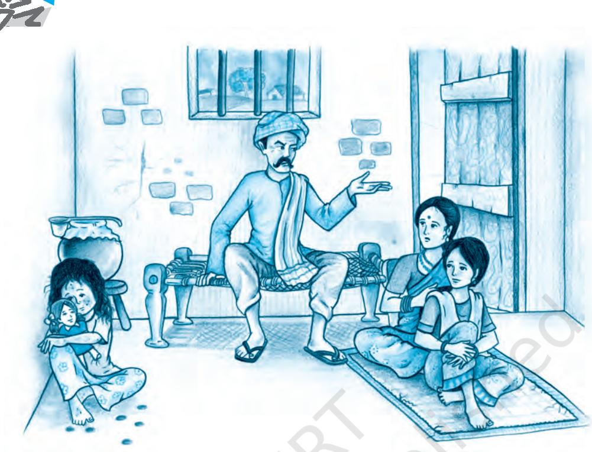
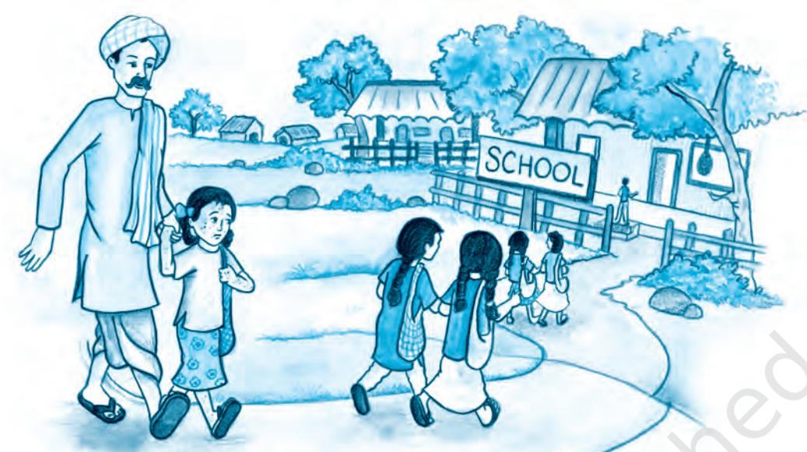
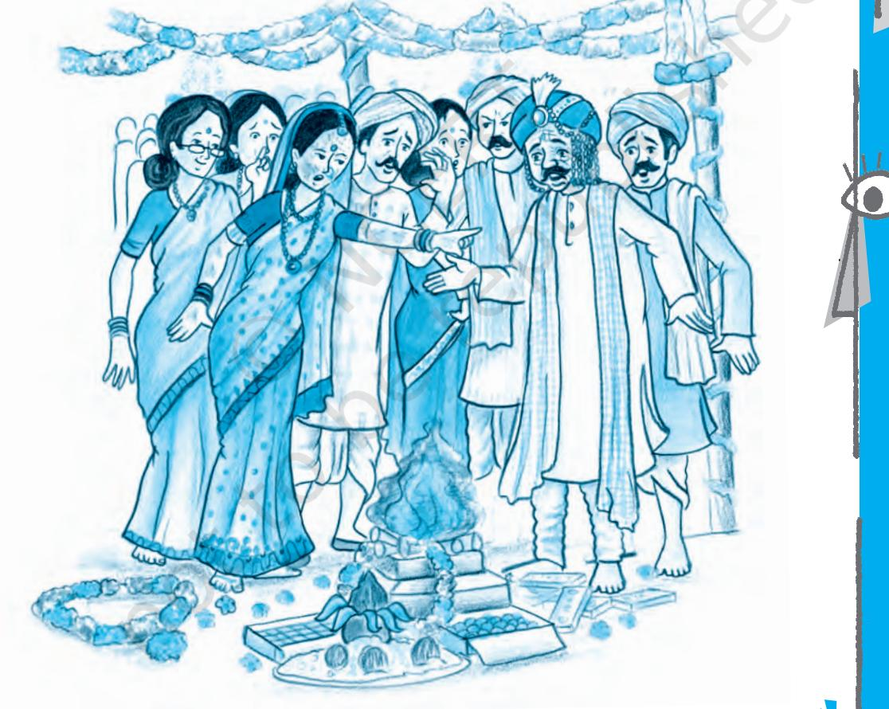

F r o m h er v e r y c h i ldh o o d B h o li w a s n e gle ct e d a t h o m e . W h y d i d h er t e a c h e r t a k e sp e c ia l in t er e st in h e r ? D i d B h o li m ea su r e u p t o h e r te a c h er ' s e x p ec ta ti o n s?

Bholi 8

### **READ AND FIND OUT**

- **Why is Bholi's father worried about her?**
- **For what unusual reasons is Bholi sent to school?**

HER name was Sulekha, but since her childhood everyone had been calling her Bholi, the simpleton.

She was the fourth daughter of *Numberdar* Ramlal. When she was ten months old, she had fallen off the cot on her head and perhaps it had damaged some part of her brain. That was why she remained a backward child and came to be known as Bholi, the simpleton.

At birth, the child was very fair and pretty. But when she was two years old, she had an attack of small-pox. Only the eyes were saved, but the entire body was permanently disfigured by deep black pockmarks. Little Sulekha could not speak till she was five, and when at last she learnt to speak, she stammered. The other children often made fun of her and mimicked her. As a result, she talked very little.

 Ramlal had seven children — three sons and four daughters, and the youngest of them was Bholi. It was a prosperous farmer's household and there was plenty to eat and drink. All the children except Bholi were healthy and strong. The sons had been sent to the city to study in schools and later in colleges. Of the daughters, Radha, the eldest, had already been married. The second daughter Mangla's marriage had also been settled, and when that was done, Ramlal would think of the third, Champa. They were good-looking, healthy girls, and it was not difficult to find bridegrooms for them.

But Ramlal was worried about Bholi. She had neither good looks nor intelligence.

Bholi was seven years old when Mangla was married. The same year a primary school for girls was opened in their village. The *Tehsildar sahib* came to perform its opening ceremony. He said to Ramlal, "As a revenue official you are the representative of the government in the village and so you must set an example to the villagers. You must send your daughters to school."

That night when Ramlal consulted his wife, she cried, "Are you crazy? If girls go to school, who will marry them?"

But Ramlal had not the courage to disobey the *Tehsildar.* At last his wife said, "I will tell you what to do. Send Bholi to school. As it is, there is little chance of her getting married, with her ugly face and lack of sense. Let the teachers at school worry about her."

### **READ AND FIND OUT**

- **• Does Bholi enjoy her first day at school?**
- **• Does she find her teacher different from the people at home?**

The next day Ramlal caught Bholi by the hand and said, "Come with me. I will take you to school." Bholi was frightened. She did not

48 Footprints without Feet

know what a school was like. She remembered how a few days ago their old cow, Lakshmi, had been turned out of the house and sold.

"N-n-n-n NO, no-no-no," she shouted in terror and pulled her hand away from her father's grip.

"What's the matter with you, you fool?" shouted Ramlal. "I am only taking you to school." Then he told his wife, "Let her wear some decent clothes today, or else what will the teachers and the other schoolgirls think of us when they see her?"

New clothes had never been made for Bholi. The old dresses of her sisters were passed on to her. No one cared to mend or wash her clothes. But today she was lucky to receive a clean dress which had shrunk after many washings and no longer fitted Champa. She was even bathed and oil was rubbed into her dry and matted hair. Only then did she begin to believe that she was being taken to a place better than her home!

When they reached the school, the children were already in their classrooms. Ramlal handed over his daughter to the headmistress. Left alone, the poor girl looked about her with fear-laden eyes. There were several rooms, and in each room girls like her squatted on mats, reading from books or writing on slates. The headmistress asked Bholi to sit down in a corner in one of the classrooms.

Bholi 49

Bholi did not know what exactly a school was like and what happened there, but she was glad to find so many girls almost of her own age present there. She hoped that one of these girls might become her friend.

The lady teacher who was in the class was saying something to the girls but Bholi could understand nothing. She looked at the pictures on the wall. The colours fascinated her — the horse was brown just like the horse on which the *Tehsildar* had come to visit their village; the goat was black like the goat of their neighbour; the parrot was green like the parrots she had seen in the mango orchard; and the cow was just like their Lakshmi. And suddenly Bholi noticed that the teacher was standing by her side, smiling at her.

"What's your name, little one?"

"Bh-Bho-Bho-." She could stammer no further than that.

Then she began to cry and tears flowed from her eyes in a helpless flood. She kept her head down as she sat in her corner, not daring to look up at the girls who, she knew, were still laughing at her.

When the school bell rang, all the girls scurried out of the classroom, but Bholi dared not leave her corner. Her head still lowered, she kept on sobbing.

"Bholi."

The teacher's voice was so soft and soothing! In all her life she had never been called like that. It touched her heart.

"Get up," said the teacher. It was not a command, but just a friendly suggestion. Bholi got up.

"Now tell me your name."

Sweat broke out over her whole body. Would her stammering tongue again disgrace her? For the sake of this kind woman, however, she decided to make an effort. She had such a soothing voice; she would not laugh at her.

"Bh-Bh-Bho-Bho-," she began to stammer.

"Well done, well done," the teacher encouraged her. "Come on, now the full name?"

"Bh-Bh-Bho-Bholi." At last she was able to say it and felt relieved as if it was a great achievement.

"Well done." The teacher patted her affectionately and said, "Put the fear out of your heart and you will be able to speak like everyone else."

Bholi looked up as if to ask, 'Really?'

50 Footprints without Feet

"Yes, yes, it will be very easy. You just come to school everyday. Will you come?"

Bholi nodded.

"No, say it aloud."

"Ye-Ye-Yes." And Bholi herself was astonished that she had been able to say it.

"Didn't I tell you? Now take this book."

The book was full of nice pictures and the pictures were in colour dog, cat, goat, horse, parrot, tiger and a cow just like Lakshmi. And with every picture was a word in big black letters.

"In one month you will be able to read this book. Then I will give you a bigger book, then a still bigger one. In time you will be more learned than anyone else in the village. Then no one will ever be able to laugh at you. People will listen to you with respect and you will be able to speak without the slightest stammer. Understand? Now go home, and come back early tomorrow morning."

Bholi felt as if suddenly all the bells in the village temple were ringing and the trees in front of the school-house had blossomed into big red flowers. Her heart was throbbing with a new hope and a new life.

#### **READ AND FIND OUT**

- **• Why do Bholi's parents accept Bishamber's marriage proposal?**
- **• Why does the marriage not take place?**

Thus the years passed.

The village became a small town. The little primary school became a high school. There were now a cinema under a tin shed and a cotton ginning mill. The mail train began to stop at their railway station.

One night, after dinner, Ramlal said to his wife, "Then, shall I accept Bishamber's proposal?"

"Yes, certainly," his wife said. "Bholi will be lucky to get such a well-to-do bridegroom. A big shop, a house of his own and I hear several thousand in the bank. Moreover, he is not asking for any dowry."

"That's right, but he is not so young, you know — almost the same age as I am — and he also limps. Moreover, the children from his first wife are quite grown up."

Bholi 51

"So what does it matter?" his wife replied. "Forty-five or fifty — it is no great age for a man. We are lucky that he is from another village and does not know about her pock-marks and her lack of sense. If we don't accept this proposal, she may remain unmarried all her life."

"Yes, but I wonder what Bholi will say."

"What will that witless one say? She is like a dumb cow."

"May be you are right," muttered Ramlal.

In the other corner of the courtyard, Bholi lay awake on her cot, listening to her parents' whispered conversation.

Bishamber Nath was a well-to-do grocer. He came with a big party of friends and relations with him for the wedding. A brass-band playing a popular tune from an Indian film headed the procession, with the bridegroom riding a decorated horse. Ramlal was overjoyed to see such pomp and splendour. He had never dreamt that his fourth daughter would have such a grand wedding. Bholi's elder sisters who had come for the occasion were envious of her luck.

When the auspicious moment came the priest said, "Bring the bride."

Bholi, clad in a red silken bridal dress, was led to the bride's place near the sacred fire.

"Garland the bride," one of his friends prompted Bishamber Nath.

The bridegroom lifted the garland of yellow marigolds. A woman slipped back the silken veil from the bride's face. Bishamber took a quick glance. The garland remained poised in his hands. The bride slowly pulled down the veil over her face.

"Have you seen her?" said Bishamber to the friend next to him. "She has pock-marks on her face."

"So what? You are not young either."

"Maybe. But if I am to marry her, her father must give me five thousand rupees."

Ramlal went and placed his turban — his honour — at Bishamber's feet. "Do not humiliate me so. Take two thousand rupees."

"No. Five thousand, or we go back. Keep your daughter."

"Be a little considerate, please. If you go back, I can never show my face in the village."

"Then out with five thousand."

Tears streaming down his face, Ramlal went in, opened the safe and counted out the notes. He placed the bundle at the bridegroom's feet.

52 Footprints without Feet

On Bishamber's greedy face appeared a triumphant smile. He had gambled and won. "Give me the garland," he announced.

Once again the veil was slipped back from the bride's face, but this time her eyes were not downcast. She was looking up, looking straight at her prospective husband, and in her eyes there was neither anger nor hate, only cold contempt.

Bishamber raised the garland to place it round the bride's neck; but before he could do so, Bholi's hand struck out like a streak of lightning and the garland was flung into the fire. She got up and threw away the veil.

"*Pitaji*!" said Bholi in a clear loud voice; and her father, mother, sisters, brothers, relations and neighbours were startled to hear her speak without even the slightest stammer.

"*Pitaji*! Take back your money. I am not going to marry this man."

Bholi 53

Ramlal was thunderstruck. The guests began to whisper, "So shameless! So ugly and so shameless!"

"Bholi, are you crazy?" shouted Ramlal. "You want to disgrace your family? Have some regard for our *izzat!"*

"For the sake of your *izzat,"* said Bholi, "I was willing to marry this lame old man. But I will not have such a mean, greedy and contemptible coward as my husband. I won't, I won't, I won't."

"What a shameless girl! We all thought she was a harmless dumb cow."

Bholi turned violently on the old woman, "Yes, Aunty, you are right. You all thought I was a dumb–driven cow. That's why you wanted to hand me over to this heartless creature. But now the dumb cow, the stammering fool, is speaking. Do you want to hear more?"

Bishamber Nath, the grocer, started to go back with his party. The confused bandsmen thought this was the end of the ceremony and struck up a closing song.

Ramlal stood rooted to the ground, his head bowed low with the weight of grief and shame.

The flames of the sacred fire slowly died down. Everyone was gone. Ramlal turned to Bholi and said, "But what about you, no one will ever marry you now. What shall we do with you?"

And Sulekha said in a voice that was calm and steady, "Don't you worry, *Pitaji*! In your old age I will serve you and Mother and I will teach in the same school where I learnt so much. Isn't that right, Ma'am?"

The teacher had all along stood in a corner, watching the drama. "Yes, Bholi, of course," she replied. And in her smiling eyes was the light of a deep satisfaction that an artist feels when contemplating the completion of her masterpiece.

K.A. ABBAS

#### GLOSSARY

simpleton: a foolish person easily tricked by others *numberdar*: an official who collects revenue matted: entangled squatted: sat on their heels scurried: ran or moved hurriedly ginning: separating raw cotton from its seeds downcast: looking downwards

54 Footprints without Feet

## Think about it

- 1. Bholi had many apprehensions about going to school. What made her feel that she was going to a better place than her home?
- 2. How did Bholi's teacher play an important role in changing the course of her life?
- 3. Why did Bholi at first agree to an unequal match? Why did she later reject the marriage? What does this tell us about her?
- 4. Bholi's real name is Sulekha. We are told this right at the beginning. But only in the last but one paragraph of the story is Bholi called Sulekha again. Why do you think she is called Sulekha at that point in the story?
- 5. Bholi's story must have moved you. Do you think girl children are not treated at par with boys? You are aware that the government has introduced a scheme to save the girl child as the sex ratio is declining. The scheme is called *Beti Bachao Beti Padhao*, Save the Girl Child. Read about the scheme and design a poster in groups of four and display on the school notice board.

Ministry of Women & Child Development Goverment of India

# Talk about it

- 1. Bholi's teacher helped her overcome social barriers by encouraging and motivating her. How do you think you can contribute towards changing the social attitudes illustrated in this story?
- 2. Should girls be aware of their rights, and assert them? Should girls and boys have the same rights, duties and privileges? What are some of the ways in which society treats them differently? When we speak of 'human rights', do we differentiate between girls' rights and boys' rights?
- 3. Do you think the characters in the story were speaking to each other in English? If not, in which language were they speaking? (You can get clues from the names of the persons and the non-English words used in the story.)

## Suggested reading

- 'The Brass Gong' by Qazi Abdul Sattar
- 'Old Man at the Bridge' by Earnest Hemingway
- 'Gandhiji the Teacher' by Rajkumari Amrit Kaur

Bholi 55

