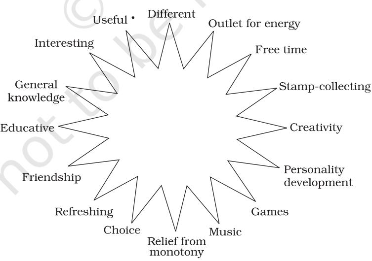
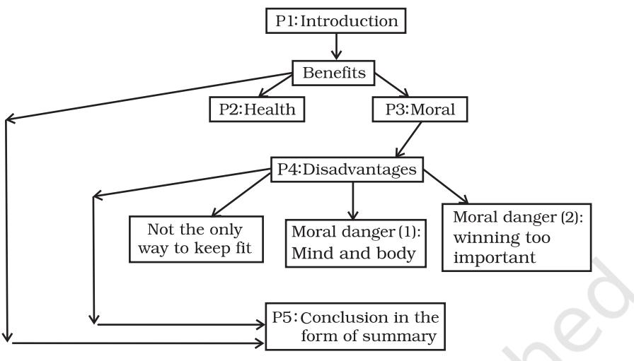

MOST of us find it difficult to begin writing. We can make this easier by thinking about the topic either through brainstorming, that is with several people in a group giving their ideas as they strike them, or by putting them down on a sheet of paper as they occur to us.

*For example, if the topic is 'Hobbies', we can draw a circle and write 'hobbies' in it:*

Hollies

*Then we can put down our thoughts as they come to us in a random manner as shown below.*

ESSAY-WRITING 89

*Having done that we select the points and expand each into a sentence.*

- 1. Hobbies are free-time activities. Examples are stampcollecting, painting etc.
- 2. They are matters of personal choice, not forced.
- 3. They are interesting and give pleasure.
- 4. They refresh the mind by providing an opportunity to do different kinds of activities.
- 5. They provide relief from monotony.
- 6. They help us channelise our energy.
- 7. They can also be useful activities and can provide pleasure to others. For example, reading out to visually impaired people, visiting art exhibitions, music concerts etc.
- 8. Hobbies are educative and they widen our general knowledge.
- 9. They help us develop our overall personality.
- 10. They serve as a medium for the expression of our creativity.
- 11. We meet interesting people through our common interests and develop friendships.

*We usually begin a topic with a definition or short description. We could begin thus:*

> Hobbies are activities that we engage in, in our free time. We may be interested in needlework, drawing and painting or music. Other common hobbies are stampcollecting, clay-modelling, solving crossword puzzles.

> Although hobbies also entail work they are taken upon through one's own personal choice. They are not forced upon us. They are activities that we are really interested in and hence give us a great deal of pleasure.

> Hobbies make life interesting. They refresh our minds after a hard day's work. We need to do something different in order to do our routine work effectively. Hobbies provide this variety.

> Hobbies relieve us from the monotony of daily life. They fill us with enthusiasm for work and keep our energy levels high. We will go to any extent to get the things that we require, to get the utmost joy from our hobbies.

Hobbies are also useful activities. Quite a few hobbies, like stamp-collecting, widen our general knowledge about various countries of the world. When we share common interests we even get into correspondence with people of other countries.

# This is how we write an essay.

A composition on a particular subject consisting of more than one paragraph is an essay. The characteristics of a good essay are:

| Unity : | The essay should deal with the main subject, and |
| --- | --- |
|  | all parts of it should be clearly linked with that |
|  | subject. |
| Coherence : | There should be a logical sequence of thought. This |
|  | requires a logical relationship between ideas, |
|  | sentences and paragraphs. |
| Relevance : | Unimportant information should not be included. |
| Proportion: | Giving more space to the important ideas. |

Read the following essay and the passage analysis that follows it carefully.

### *The Importance of Games*

- 1. "The Battle of Waterloo was won on the playing fields of Eton." These words have been attributed to the Duke of Wellington. Certainly one does not play games in order to win battles; neither does the curriculum include them for that reason. But the importance of games in life should not be underestimated, for without them it is harder for a person to be sound in body and mind.
- 2. For one thing, if a person is to fulfil all the duties that society expects of him, it is important for him to keep healthy. He may be very intelligent, but that has little meaning if he cannot make use of his intelligence, because he is always suffering from bad health. In some ways, the human body is like a machine. If it is not made use of, it starts to work badly. People who are not fit grow weak and become more susceptible to disease. Any form of game is useful, provided it gives the body an opportunity to take regular physical exercise.

#### ESSAY-WRITING 91

- 3. Secondly, playing and therefore experiencing winning and losing — encourages the spirit of sportsmanship, thus enabling one to deal with life's problems in a wise and natural manner. Games teach the truth embodied in the Olympic motto: 'The important thing in playing is not the winning or the losing, but the participation' — and, I may add, doing the best one can.
- 4. We have to remember some other things about playing games, however. First, it is the physical exercise that is important for health, not the games themselves, and there are other ways of getting this. Is not India the home of yoga? It is also possible to be too interested in games. When we think of the Greek ideal expressed in the Latin phrase, 'mens sana in corpore sano' (a healthy mind in a healthy body), we should not forget that it is the mind which is mentioned first. And if we let games become the most important thing in our lives, we may be in danger of changing the Olympic motto to 'the important thing is winning'.
- 5. Nevertheless, in spite of these dangers, playing games can be a valuable activity, and if we take part in them wisely, we can gain great benefits.

### Passage Analysis

- l The writer uses five paragraphs
- l Each paragraph deals sequentially with a topic.
	- Paragraph 1 introduces the subject, and makes a general statement about the importance of games.
	- Paragraph 2 explains the benefits of playing games.
	- Paragraph 3 deals with the moral benefits.
	- Paragraph 4 deals with the disadvantages and dangers.
	- Paragraph 5 sums up the writer's opinion, taking into account all he has said in paragraphs 2, 3 and 4, i.e. it forms the conclusion. The structure (or plan) of the essay is summed up in the following flow diagram.

# Activity

Here are a few topics for essay writing. Follow the steps listed above to write on these topics.

- 1. Himalayan quake 2005.
- 2. Those who can bear all can dare all.
- 3. Fascinating facts about water.
- 4. Public health in transition.
- 5. Human population grows up.
- 6. Success begins in the mind.
- 7. Think before you shop.

The trend of decline in the Child Sex Ratio (CSR) defined as the number of girls per 1000 boys between 0–6 years of age, has remained unabated till today. To ensure survival, protection and empowerment of the girl child, the government has announced *Beti Bachao, Beti Padhao* scheme. This is being implemented through a national campaign. The objectives of this scheme are:

- Prevention of gender-biased sex selection elimination.
- Ensuring survival and protection of the girl child.
- Ensuring education and participation of the girl child.

Organise as essay writing activity in your class, the themes should be based on the objectives stated above. Mention how you can contribute to this programme, in the essay.

