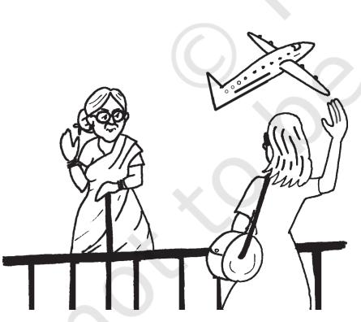

My Mother at Sixty-six Kamala Das

Keeping Quiet Pablo Neruda

A Thing of Beauty John Keats

A Roadside Stand Robert Frost

Aunt Jennifer's Tigers Adrienne Rich

POETRY

## My Mother at Sixty-six 1

## About the poet

Kamala Das (1934-2009) was born in Malabar, Kerala. She is recognised as one of India's foremost poets. Her works are known for their originality, versatility and the indigenous flavour of the soil. Kamala Das has published many novels and short stories in English and Malayalam under the name 'Madhavikutty'. In addition to five books of poetry. She is a sensitive writer who captures the complex subtleties of human relationships in lyrical idiom, My Mother at Sixty-six is an example.

## Before you read

Ageing is a natural process; have you ever thought what our elderly parents expect from us?

90/Flamingo

Driving from my parent's home to Cochin last Friday morning, I saw my mother, beside me,

doze, open mouthed, her face ashen like that

of a corpse and realised with pain

that she was as old as she looked but soon

put that thought away, and looked out at Young

Trees sprinting, the merry children spilling out of their homes, but after the airport's security check, standing a few yards

away, I looked again at her, wan, pale

as a late winter's moon and felt that old

familiar ache, my childhood's fear, but all I said was, see you soon, Amma,

all I did was smile and smile and smile......

sprinting : short fast race, running wan : colourless

## Think it out

- 1. What is the kind of pain and ache that the poet feels?
- 2. Why are the young trees described as 'sprinting'?
- 3. Why has the poet brought in the image of the merry children 'spilling out of their homes'?
- 4. Why has the mother been compared to the 'late winter's moon'?
- 5. What do the parting words of the poet and her smile signify?

Notice that the whole poem is in a single sentence, punctuated by commas.

It indicates a single thread of thought interspersed with observations of the real world around and the way these are connected to the main idea.

