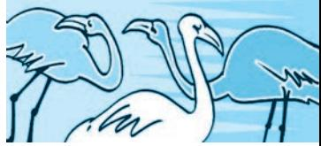
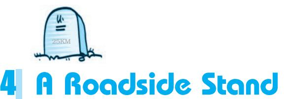
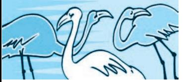
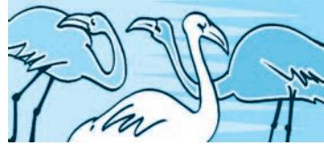

### About the poet

Robert Frost (1874-1963) is a highly acclaimed American poet of the twentieth century. Robert Frost wrote about characters, people and landscapes. His poems are concerned with human tragedies and fears, his reaction to the complexities of life and his ultimate acceptance of his burdens. Stopping by the Woods on a Snowy Evening, Birches, Mending walls are a few of his well-known poems. In the poem A Roadside Stand, Frost presents the lives of poor deprived people with pitiless clarity and with the deepest sympathy and humanity.

### Before you read

Have you ever stopped at a roadside stand? What have you observed there?

The little old house was out with a little new shed In front at the edge of the road where the traffic sped, A roadside stand that too pathetically pled, It would not be fair to say for a dole of bread, But for some of the money, the cash, whose flow supports The flower of cities from sinking and withering faint. The polished traffic passed with a mind ahead, Or if ever aside a moment, then out of sorts At having the landscape marred with the artless paint Of signs that with N turned wrong and S turned wrong Offered for sale wild berries in wooden quarts, Or crook-necked golden squash with silver warts, Or beauty rest in a beautiful mountain scene, You have the money, but if you want to be mean, Why keep your money (this crossly) and go along. The hurt to the scenery wouldn't be my complaint

A Roadside Stand/97

So much as the trusting sorrow of what is unsaid: Here far from the city we make our roadside stand And ask for some city money to feel in hand To try if it will not make our being expand, And give us the life of the moving-pictures' promise That the party in power is said to be keeping from us.

It is in the news that all these pitiful kin Are to be bought out and mercifully gathered in To live in villages, next to the theatre and the store, Where they won't have to think for themselves anymore, While greedy good-doers, beneficent beasts of prey, Swarm over their lives enforcing benefits That are calculated to soothe them out of their wits, And by teaching them how to sleep they sleep all day, Destroy their sleeping at night the ancient way.

Sometimes I feel myself I can hardly bear The thought of so much childish longing in vain, The sadness that lurks near the open window there, That waits all day in almost open prayer For the squeal of brakes, the sound of a stopping car, Of all the thousand selfish cars that pass, Just one to inquire what a farmer's prices are. And one did stop, but only to plow up grass In using the yard to back and turn around; And another to ask the way to where it was bound;

And another to ask could they sell it a gallon of gas They couldn't (this crossly); they had none, didn't it see?

No, in country money, the country scale of gain, The requisite lift of spirit has never been found, Or so the voice of the country seems to complain, I can't help owning the great relief it would be To put these people at one stroke out of their pain. And then next day as I come back into the sane, I wonder how I should like you to come to me And offer to put me gently out of my pain.

quarts : bottles or containers squash : a kind of vegetable (gourd)

98/Flamingo

### Think it out

- 1. The city folk who drove through the countryside hardly paid any heed to the roadside stand or to the people who ran it. If at all they did, it was to complain. Which lines bring this out? What was their complaint about?
- 2. What was the plea of the folk who had put up the roadside stand?
- 3. The government and other social service agencies appear to help the poor rural people, but actually do them no good. Pick out the words and phrases that the poet uses to show their double standards.
- 4. What is the 'childish longing' that the poet refers to? Why is it 'vain'?
- 5. Which lines tell us about the insufferable pain that the poet feels at the thought of the plight of the rural poor?

## Talk about it

### Discuss in small groups.

The economic well-being of a country depends on a balanced development of the villages and the cities.

# Try this out

You could stop at a dhaba or a roadside eatery on the outskirts of your town or city to see

- 1. how many travellers stop there to eat?
- 2. how many travellers stop for other reasons?
- 3. how the shopkeepers are treated?
- 4. the kind of business the shopkeepers do.
- 5. the kind of life they lead.

Notice the rhyme scheme. Is it consistent or is there an occasional variance? Does it indicate thought predominating over sound pattern?

Notice the stanza divisions. Do you find a shift to a new idea in successive stanzas?

