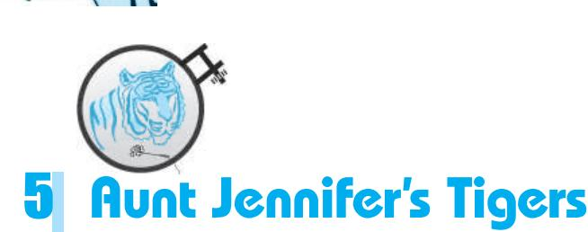
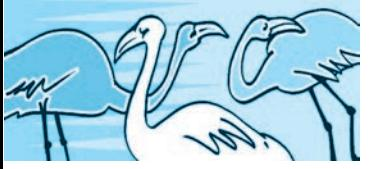

## About the poet

Adrienne Rich (1929–2012) was born in Baltimore, Maryland, USA. She is widely known for her involvement in contemporary women's movement as a poet and theorist. She has published nineteen volumes of poetry, three collections of essays and other writings. A strong resistance to racism and militarism echoes through her work. The poem Aunt Jennifer's Tigers addresses the constraints of married life a woman experiences.

## Before you read

What does the title of the poem suggest to you? Are you reminded of other poems on tigers?

Aunt Jennifer's tigers prance across a screen, Bright topaz denizens of a world of green. They do not fear the men beneath the tree; They pace in sleek chivalric certainty.

Aunt Jennifer's fingers fluttering through her wool Find even the ivory needle hard to pull. The massive weight of Uncle's wedding band Sits heavily upon Aunt Jennifer's hand.

When Aunt is dead, her terrified hands will lie Still ringed with ordeals she was mastered by. The tigers in the panel that she made Will go on prancing, proud and unafraid.

denizen : a person, an animal or a plant that lives, grows or is often found in a particular place. sleek : elegant

100/Flamingo

## Think it out

- 1. How do 'denizens' and 'chivalric' add to our understanding of the tiger's attitudes?
- 2. Why do you think Aunt Jennifer's hands are 'fluttering through her wool' in the second stanza? Why is she finding the needle so hard to pull?
- 3. What is suggested by the image 'massive weight of Uncle's wedding band'?
- 4. Of what or of whom is Aunt Jennifer terrified with in the third stanza?
- 5. What are the 'ordeals' Aunt Jennifer is surrounded by, why is it significant that the poet uses the word 'ringed'? What are the meanings of the word 'ringed' in the poem?
- 6. Why do you think Aunt Jennifer created animals that are so different from her own character? What might the poet be suggesting, through this difference?
- 7. Interpret the symbols found in this poem.
- 8. Do you sympathise with Aunt Jennifer. What is the attitude of the speaker towards Aunt Jennifer?

Notice the colours suggested in the poem. Notice the repetitive use of certain sounds in the poem.

## ...... Notes ......

102/Flamingo

