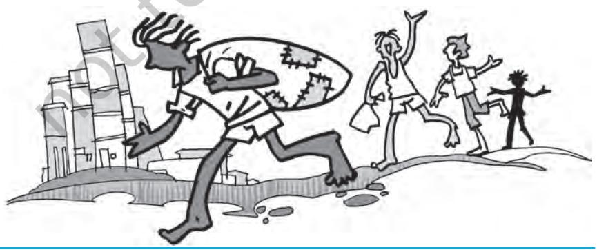

Lost Spring/13

#### Stories of Stolen Childhood

#### *About the author*

Anees Jung (1944) was born in Rourkela and spent her childhood and adolescence in Hyderabad. She received her education in Hyderabad and in the United States of America. Her parents were both writers. Anees Jung began her career as a writer in India. She has been an editor and columnist for major newspapers in India and abroad, and has authored several books. The following is an excerpt from her book titled *Lost Spring, Stories of Stolen Childhood*. Here she analyses the grinding poverty and traditions which condemn these children to a life of exploitation.

#### *Notice these expressions in the text. Infer their meaning from the context.*

- 
- ó slog their daylight hours ó dark hutments
- 
- ó looking for ó perpetual state of poverty
	-
- ó roof over his head ó imposed the baggage on the child

### *'Sometimes I find a Rupee in the garbage'*

"Why do you do this?" I ask Saheb whom I encounter every morning scrounging for gold in the garbage dumps of my neighbourhood. Saheb left his home long ago. Set amidst the green fields of Dhaka, his home is not even a distant memory. There were many storms that swept away their fields and homes, his mother tells him. That's why they left, looking for gold in the big city where he now lives.

"I have nothing else to do," he mutters, looking away.

"Go to school," I say glibly, realising immediately how hollow the advice must sound.

"There is no school in my neighbourhood. When they build one, I will go."

"If I start a school, will you come?" I ask, half-joking. "Yes," he says, smiling broadly.

A few days later I see him running up to me. "Is your school ready?"

"It takes longer to build a school," I say, embarrassed at having made a promise that was not meant. But promises like mine abound in every corner of his bleak world.

After months of knowing him, I ask him his name. "Saheb-e-Alam," he announces. He does not know what it means. If he knew its meaning — lord of the universe he would have a hard time believing it. Unaware of what his name represents, he roams the streets with his friends, an army of barefoot boys who appear like the morning birds and disappear at noon. Over the months, I have come to recognise each of them.

"Why aren't you wearing chappals?" I ask one.

"My mother did not bring them down from the shelf," he answers simply.

"Even if she did he will throw them off," adds another who is wearing shoes that do not match. When I comment on it, he shuffles his feet and says nothing. "I want shoes," says a third boy who has never owned a pair all his life. Travelling across the country I have seen children walking barefoot, in cities, on village roads. It is not lack of money but a tradition to stay barefoot, is one explanation. I wonder if this is only an excuse to explain away a perpetual state of poverty.

I remember a story a man from Udipi once told me. As a young boy he would go to school past an old temple, where his father was a priest. He would stop briefly at the temple and pray for a pair of shoes. Thirty years later I visited his town and the temple, which was now drowned in an air of

14/Flamingo

desolation. In the backyard, where lived the new priest, there were red and white plastic chairs. A young boy dressed in a grey uniform, wearing socks and shoes, arrived panting and threw his school bag on a folding bed. Looking at the boy, I remembered the prayer another boy had made to the goddess when he had finally got a pair of shoes, "Let me never lose them." The goddess had granted his prayer. Young boys like the son of the priest now wore shoes. But many others like the ragpickers in my neighbourhood remain shoeless.

My acquaintance with the barefoot ragpickers leads me to Seemapuri, a place on the periphery of Delhi yet miles away from it, metaphorically. Those who live here are squatters who came from Bangladesh back in 1971. Saheb's family is among them. Seemapuri was then a wilderness. It still is, but it is no longer empty. In structures of mud, with roofs of tin and tarpaulin, devoid of sewage, drainage or running water, live 10,000 ragpickers. They have lived here for more than thirty years without an identity, without permits but with ration cards that get their names on voters' lists and enable them to buy grain. Food is more important for survival than an identity. "If at the end of the day we can feed our families and go to bed without an aching stomach, we would rather live here than in the fields that gave us no grain," say a group of women in tattered saris when I ask them why they left their beautiful land of green fields and rivers. Wherever they find food, they pitch their tents that become transit homes. Children grow up in them, becoming partners in survival. And survival in Seemapuri means rag-picking. Through the years, it has acquired the proportions of a fine art. Garbage to them is gold. It is their daily bread, a roof over their heads, even if it is a leaking roof. But for a child it is even more.

"I sometimes find a rupee, even a ten-rupee note," Saheb says, his eyes lighting up. When you can find a silver coin in a heap of garbage, you don't stop scrounging, for there is hope of finding more. It seems that for children, garbage has a meaning different from what it means to their parents. For the children it is wrapped in wonder, for the elders it is a means of survival.

One winter morning I see Saheb standing by the fenced gate of the neighbourhood club, watching two young men dressed in white, playing tennis. "I like the game," he hums, content to watch it standing behind the fence. "I go

inside when no one is around," he admits. "The gatekeeper lets me use the swing."

Saheb too is wearing tennis shoes that look strange over his discoloured shirt and shorts. "Someone gave them to me," he says in the manner of an explanation. The fact that they are discarded shoes of some rich boy,

who perhaps refused to wear them because of a hole in one of them, does not bother him. For one who has walked barefoot, even shoes with a hole is a dream come true. But the game he is watching so intently is out of his reach.

This morning, Saheb is on his way to the milk booth. In his hand is a steel canister. "I now work in a tea stall down the road," he says, pointing in

the distance. "I am paid 800 rupees and all my meals." Does he like the job? I ask. His face, I see, has lost the carefree look. The steel canister seems heavier than the plastic bag he would carry so lightly over his shoulder. The bag was his. The canister belongs to the man who owns the tea shop. Saheb is no longer his own master!

### "I want to drive a car"

Mukesh insists on being his own master. "I will be a motor mechanic," he announces.

"Do you know anything about cars?" I ask.

- 1. What is Saheb looking for in the garbage dumps? Where is he and where has he come from?
- 2. What explanations does the author offer for the children not wearing footwear?
- 3. Is Saheb happy working at the tea-stall? Explain.

"I will learn to drive a car," he answers, looking straight into my eyes. His dream looms like a mirage amidst the dust of streets that fill his town Firozabad, famous for its bangles. Every other family in Firozabad is engaged in making bangles. It is the centre of India's glass-blowing industry where families have

spent generations working around furnaces, welding glass, making bangles for all the women in the land it seems.

Mukesh's family is among them. None of them know that it is illegal for children like him to work in the glass furnaces with high temperatures, in dingy cells without air and light; that the law, if enforced, could get him and all those 20,000 children out of the hot furnaces where they slog their daylight hours, often losing the brightness of their eyes. Mukesh's eyes beam as he volunteers to take me home, which he proudly says is being rebuilt. We walk down stinking lanes choked with garbage, past homes that remain hovels with crumbling walls, wobbly doors, no windows, crowded with families of humans and animals coexisting in a primeval state. He stops at the door of one such house, bangs a wobbly iron door with his foot, and pushes it open. We enter a half-built shack. In one part of it, thatched with dead grass, is a firewood stove over which sits a large vessel of sizzling spinach leaves. On the ground, in large aluminium platters, are more chopped vegetables. A frail young woman is cooking the evening meal for the whole family. Through eyes filled with smoke she smiles. She is the wife of Mukesh's elder brother. Not much older in years, she has begun to command respect as the bahu, the daughter-in-law of the house, already in charge of three men — her husband, Mukesh and their father. When the older man enters, she gently withdraws behind the broken wall and brings her veil closer to her face. As custom demands, daughters-inlaw must veil their faces before male elders. In this case the elder is an impoverished bangle maker. Despite long years of hard labour, first as a tailor, then a bangle maker, he has failed to renovate a house, send his two sons to school. All he has managed to do is teach them what he knows — the art of making bangles.

"It is his karam, his destiny," says Mukesh's grandmother, who has watched her own husband go blind with the dust from polishing the glass of bangles. "Can a god-given lineage ever be broken?" she implies. Born in the caste of bangle makers, they have seen nothing but bangles — in the house, in the yard, in every other house, every other yard, every street in Firozabad. Spirals of

bangles — sunny gold, paddy green, royal blue, pink, purple, every colour born out of the seven colours of the rainbow — lie in mounds in unkempt yards, are piled on four-wheeled handcarts, pushed by young men along the narrow lanes of the shanty town. And in dark hutments, next to lines of flames of flickering oil lamps, sit boys and girls with their fathers and mothers, welding pieces of coloured glass into circles of bangles. Their eyes are more adjusted to the dark than to the light outside. That is why they often end up losing their eyesight before they become adults.

Savita, a young girl in a drab pink dress, sits alongside an elderly woman, soldering pieces of glass. As her hands move mechanically like the tongs of a machine, I wonder if she knows the sanctity of the bangles she helps make. It symbolises an Indian woman's suhaag, auspiciousness in marriage. It will dawn on her suddenly one day when her head is draped with a red veil, her hands dyed red with henna, and red bangles rolled onto her wrists. She will then become a bride. Like the old woman beside her who became one many years ago. She still has bangles on her wrist, but no light in her eyes. "Ek waqt ser bhar khana bhi nahin khaya," she says, in a voice drained of joy. She has not enjoyed even one full meal in her entire lifetime that's what she has reaped! Her husband, an old man with a flowing beard, says, "I know nothing except bangles. All I have done is make a house for the family to live in."

Hearing him, one wonders if he has achieved what many have failed in their lifetime. He has a roof over his head!

The cry of not having money to do anything except carry on the business of making bangles, not even enough to eat, rings in every home. The young men echo the lament of their elders. Little has moved with time, it seems, in Firozabad. Years of mind-numbing toil have killed all initiative and the ability to dream.

"Why not organise yourselves into a cooperative?" I ask a group of young men who have fallen into the vicious circle of middlemen who trapped their fathers and forefathers. "Even if we get organised, we are the ones

18/Flamingo

who will be hauled up by the police, beaten and dragged to jail for doing something illegal," they say. There is no leader among them, no one who could help them see things differently. Their fathers are as tired as they are. They talk endlessly in a spiral that moves from poverty to apathy to greed and to injustice.

Listening to them, I see two distinct worlds one of the family, caught in a web of poverty, burdened by the stigma of caste in which they are born; the other a vicious circle of the sahukars, the middlemen,

the policemen, the keepers of law, the bureaucrats and the politicians. Together they have imposed the baggage on the child that he cannot put down. Before he is aware, he accepts it as naturally as his father. To do anything else would mean to dare. And daring is not part of his growing up. When I sense a flash of it in Mukesh I am cheered. "I want to be a motor mechanic,' he repeats. He will go to a garage and learn. But the garage is a long way

from his home. "I will walk," he insists. "Do you also dream of flying a plane?" He is suddenly silent. "No," he says, staring at the ground. In his small murmur there is an embarrassment that has not yet turned into regret. He is content to dream of cars that he sees hurtling down the streets of his town. Few airplanes fly over Firozabad.

- 1. What makes the city of Firozabad famous?
- 2. Mention the hazards of working in the glass bangles industry.
- 3. How is Mukesh's attitude to his situation different from that of his family?

Lost Spring/19

## Understanding the text

- 1. What could be some of the reasons for the migration of people from villages to cities?
- 2. Would you agree that promises made to poor children are rarely kept? Why do you think this happens in the incidents narrated in the text?
- 3. What forces conspire to keep the workers in the bangle industry of Firozabad in poverty?

# Talking about the text

- 1. How, in your opinion, can Mukesh realise his dream?
- 2. Mention the hazards of working in the glass bangles industry.
- 3. Why should child labour be eliminated and how?

## Thinking about language

Although this text speaks of factual events and situations of misery it transforms these situations with an almost poetical prose into a literary experience. How does it do so? Here are some literary devices:

- Hyperbole is a way of speaking or writing that makes something sound better or more exciting than it really is. For example: Garbage to them is gold.
- A Metaphor, as you may know, compares two things or ideas that are not very similar. A metaphor describes a thing in terms of a single quality or feature of some other thing; we can say that a metaphor "transfers" a quality of one thing to another. For example: The road was a ribbon of light.
- Simile is a word or phrase that compares one thing with another using the words "like" or "as". For example: As white as snow.

Carefully read the following phrases and sentences taken from the text. Can you identify the literary device in each example?

- 1. Saheb-e-Alam which means the lord of the universe is directly in contrast to what Saheb is in reality.
- 2. Drowned in an air of desolation.
- 3. Seemapuri, a place on the periphery of Delhi yet miles away from it, metaphorically.

20/Flamingo

- 4. For the children it is wrapped in wonder; for the elders it is a means of survival.
- 5. As her hands move mechanically like the tongs of a machine, I wonder if she knows the sanctity of the bangles she helps make.
- 6. She still has bangles on her wrist, but not light in her eyes.
- 7. Few airplanes fly over Firozabad.
- 8. Web of poverty.
- 9. Scrounging for gold.
- 10. And survival in Seemapuri means rag-picking. Through the years, it has acquired the proportions of a fine art.
- 11. The steel canister seems heavier than the plastic bag he would carry so lightly over his shoulders.

## Things to do

The beauty of the glass bangles of Firozabad contrasts with the misery of people who produce them.

This paradox is also found in some other situations, for example, those who work in gold and diamond mines, or carpet weaving factories, and the products of their labour, the lives of construction workers, and the buildings they build.

- l Look around and find examples of such paradoxes.
- l Write a paragraph of about 200 to 250 words on any one of them. You can start by making notes.

Here is an example of how one such paragraph may begin:

You never see the poor in this town. By day they toil, working cranes and earthmovers, squirreling deep into the hot sand to lay the foundations of chrome. By night they are banished to bleak labour camps at the outskirts of the city...

# ABOUT THE UNIT

## THEME

The plight of street children forced into labour early in life and denied the opportunity of schooling.

## SUB-THEME

The callousness of society and the political class to the sufferings of the poor.

Lost Spring/21

## COMPREHENSION

Factual understanding and responding with sensitivity. Thinking on socio-economic issues as a take-off from the text.

## TALKING ABOUT THE TEXT

- Fluency development
- Social awareness Discussion on
	- u the dreams of the poor and the reality.
	- u problems of child labour.

## THINKING ABOUT LANGUAGE

Focus on the use of figures of speech in writing.

## THINGS TO DO

Observation of the paradoxes in the society we live in.

## WRITING

Note-making and reporting.

Over 20 months from 2013 to 2015 more than 100 garbage collectors and scrap buyers in Delhi were interviewed. Their families lived in poverty in homes constructed with bamboo and plastic sheets. These temporary structures were their shelters as well as place for sorting scrap into about ten different categories. Once the garbage is sorted into sacks it is gold to the buyers on the basis of its weight. Sadly, the collectors usually are not paid the total amount after buying the scrap. Instead, small payments are made for daily expenses, and the rest is noted down as a deposit.

(As reported in THE CONVERSATION, June 27, 2017. Researcher Dana Kornberg, PhD candidate in sociology University of Michigan.

As you have read, a large population works in unorganized sectors like garbage pickers, bangle makers, vegetable sellers, etc. How do you think workers in unorganized sectors can take advantage of digital infrastructure promoted through Digital India Programme? Interview some people working in unorganized sector to collect their views and prepare a report.

