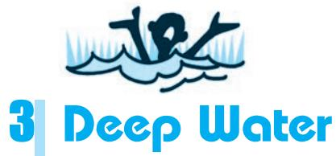
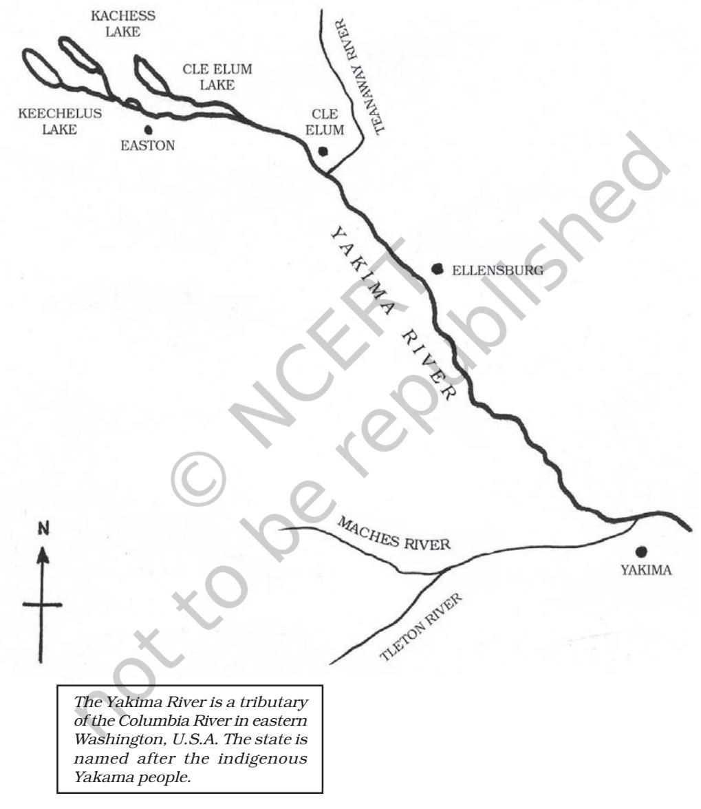
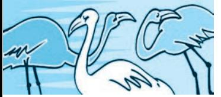
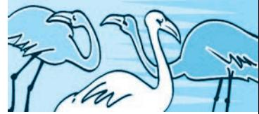
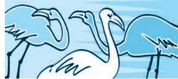
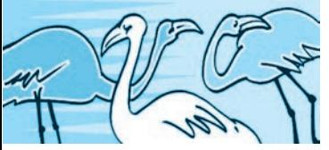

#### About the author

William Douglas (1898-1980) was born in Maine, Minnesota. After graduating with a Bachelors of Arts in English and Economics, he spent two years teaching high school in Yakima. However, he got tired of this and decided to pursue a legal career. He met Franklin D. Roosevelt at Yale and became an adviser and friend to the President. Douglas was a leading advocate of individual rights. He retired in 1975 with a term lasting thirty-six years and remains the longest-serving Justice in the history of the court. The following excerpt is taken from Of Men and Mountains by William O. Douglas. It reveals how as a young boy William Douglas nearly drowned in a swimming pool. In this essay he talks about his fear of water and thereafter, how he finally overcame it. Notice how the autobiographical part of the selection is used to support his discussion of fear.

Notice these words and expressions in the text. Infer their meaning from the context.

- 
- 
- flailed at the surface curtain of life fell
- 
- treacherous misadventure
- subdued my pride bob to the surface like a cork
	-
- fishing for landlocked salmon back and forth across the pool

Deep Water/23

It had happened when I was ten or eleven years old. I had decided to learn to swim. There was a pool at the Y.M.C.A. in Yakima that offered exactly the opportunity. The Yakima River was treacherous. Mother continually warned against it, and kept fresh in my mind the details of each drowning in the river. But the Y.M.C.A. pool was safe. It was only two or three feet deep at the shallow end; and while it was nine feet deep at the other, the drop was gradual. I got a pair of water wings and went to the pool. I hated to walk

#### THE YAKIMA RIVER

Sketch map not to scale

24/Flamingo

naked into it and show my skinny legs. But I subdued my pride and did it.

From the beginning, however, I had an aversion to the water when I was in it. This started when I was three or four years old and father took me to the beach in California. He and I stood together in the surf. I hung on to him, yet the waves knocked me down and swept over me. I was buried in water. My breath was gone. I was frightened. Father laughed, but there was terror in my heart at the overpowering force of the waves.

My introduction to the Y.M.CA. swimming pool revived unpleasant memories and stirred childish fears. But in a little while I gathered confidence. I paddled with my new water wings, watching the other boys and trying to learn by aping them. I did this two or three times on different days and was just beginning to feel at ease in the water when the misadventure happened.

I went to the pool when no one else was there. The place was quiet. The water was still, and the tiled bottom was as white and clean as a bathtub. I was timid about going in alone, so I sat on the side of the pool to wait for others.

I had not been there long when in came a big bruiser of a boy, probably eighteen years old. He had thick hair on his chest. He was a beautiful physical specimen, with legs and arms that showed rippling muscles. He yelled, "Hi, Skinny! How'd you like to be ducked?"

With that he picked me up and tossed me into the deep end. I landed in a sitting position, swallowed water, and went at once to the bottom. I was frightened, but not yet frightened out of my wits. On the way down I planned: When my feet hit the bottom, I would make a big jump, come to the surface, lie flat on it, and paddle to the edge of the pool.

It seemed a long way down. Those nine feet were more like ninety, and before I touched bottom my lungs were ready to burst. But when my feet hit bottom I summoned all my strength and made what I thought was a great spring upwards. I imagined I would bob to the surface like a cork. Instead, I came up slowly. I opened my eyes and saw nothing

but water — water that had a dirty yellow tinge to it. I grew panicky. I reached up as if to grab a rope and my hands clutched only at water. I was suffocating. I tried to yell but no sound came out. Then my eyes and nose came out of the water — but not my mouth.

I flailed at the surface of the water, swallowed and choked. I tried to bring my legs up, but they hung as dead weights, paralysed and rigid. A great force was pulling me under. I screamed, but only the water heard me. I had started on the long journey back to the bottom of the pool.

I struck at the water as I went down, expending my strength as one in a nightmare fights an irresistible force. I had lost all my breath. My lungs ached, my head throbbed. I was getting dizzy. But I remembered the strategy — I would spring from the bottom of the pool and come like a cork to the surface. I would lie flat on the water, strike out with my arms, and thrash with my legs. Then I would get to the edge of the pool and be safe.

I went down, down, endlessly. I opened my eyes. Nothing but water with a yellow glow — dark water that one could not see through.

And then sheer, stark terror seized me, terror that knows no understanding, terror that knows no control, terror that no one can understand who has not experienced it. I was shrieking under water. I was paralysed under water — stiff, rigid with fear. Even the screams in my throat were frozen. Only my heart, and the pounding in my head, said that I was still alive.

And then in the midst of the terror came a touch of reason. I must remember to jump when I hit the bottom. At last I felt the tiles under me. My toes reached out as if to grab them. I jumped with everything I had.

But the jump made no difference. The water was still around me. I looked for ropes, ladders, water wings. Nothing but water. A mass of yellow water held me. Stark terror took an even deeper hold on me, like a great charge of electricity. I shook and trembled with fright. My arms wouldn't move. My legs wouldn't move. I tried to call for help, to call for mother. Nothing happened.

And then, strangely, there was light. I was coming out of the awful yellow water. At least my eyes were. My nose was almost out too.

Then I started down a third time. I sucked for air and got water. The yellowish light was going out.

Then all effort ceased. I relaxed. Even my legs felt limp; and a blackness swept over my brain. It wiped out fear; it wiped out terror. There was no more panic. It was quiet and peaceful. Nothing to be afraid of. This is nice... to be drowsy... to go to sleep... no need to jump... too tired to jump... it's nice to be carried gently... to float along in space... tender arms around me... tender arms like Mother's... now I must go to sleep...

I crossed to oblivion, and the curtain of life fell.

The next I remember I was lying on my stomach beside the pool, vomiting. The chap that threw me in was saying, "But I was only fooling." Someone said, "The kid nearly died. Be all right now. Let's carry him to the locker room."

Several hours later, I walked home. I was weak and trembling. I shook and cried when I lay on

- 1. What is the "misadventure" that William Douglas speaks about?
- 2. What were the series of emotions and fears that Douglas experienced when he was thrown into the pool? What plans did he make to come to the surface?
- 3. How did this experience affect him?

my bed. I couldn't eat that night. For days a haunting fear was in my heart. The slightest exertion upset me, making me wobbly in the knees and sick to my stomach.

I never went back to the pool. I feared water. I avoided it whenever I could.

A few years later when I came to know the waters of the Cascades, I wanted to get into them. And whenever I did — whether I was wading the Tieton or Bumping River or bathing in Warm Lake of the Goat Rocks — the terror that had seized me in the pool would come back. It would take possession of me completely. My legs would become paralysed. Icy horror would grab my heart.

This handicap stayed with me as the years rolled by. In canoes on Maine lakes fishing for landlocked salmon,

bass fishing in New Hampshire, trout fishing on the Deschutes and Metolius in Oregon, fishing for salmon on the Columbia, at Bumping Lake in the Cascades wherever I went, the haunting fear of the water followed me. It ruined my fishing trips; deprived me of the joy of canoeing, boating, and swimming.

I used every way I knew to overcome this fear, but it held me firmly in its grip. Finally, one October, I decided to get an instructor and learn to swim. I went to a pool and practiced five days a week, an hour each day. The instructor put a belt around me. A rope attached to the belt went through a pulley that ran on an overhead cable. He held on to the end of the rope, and we went back and forth, back and forth across the pool, hour after hour, day after day, week after week. On each trip across the pool a bit of the panic seized me. Each time the instructor relaxed his hold on the rope and I went under, some of the old terror returned and my legs froze. It was three months before the tension began to slack. Then he taught me to put my face under water and exhale, and to raise my nose and inhale. I repeated the exercise hundreds of times. Bit by bit I shed part of the panic that seized me when my head went under water.

Next he held me at the side of the pool and had me kick with my legs. For weeks I did just that. At first my legs refused to work. But they gradually relaxed; and finally I could command them.

Thus, piece by piece, he built a swimmer. And when he had perfected each piece, he put them together into an integrated whole. In April he said, "Now you can swim. Dive off and swim the length of the pool, crawl stroke."

I did. The instructor was finished.

But I was not finished. I still wondered if I would be terror-stricken when I was alone in the pool. I tried it. I swam the length up and down. Tiny vestiges of the old terror would return. But now I could frown and say to that terror, "Trying to scare me, eh? Well, here's to you! Look!" And off I'd go for another length of the pool.

This went on until July. But I was still not satisfied. I was not sure that all the terror had left. So I went to Lake

28/Flamingo

Wentworth in New Hampshire, dived off a dock at Triggs Island, and swam two miles across the lake to Stamp Act Island. I swam the crawl, breast stroke, side stroke, and back stroke. Only once did the terror return. When I was in the middle of the lake, I put my face under and saw nothing but bottomless water. The old sensation returned in miniature. I laughed and said, "Well, Mr Terror, what do you think you can do to me?" It fled and I swam on.

Yet I had residual doubts. At my first opportunity I hurried west, went up the Tieton to Conrad Meadows, up the Conrad Creek Trail to Meade Glacier, and camped in the high meadow by the side of Warm Lake. The next morning I stripped, dived into the lake, and swam across to the other shore and back — just as Doug Corpron used to do. I shouted with joy, and Gilbert Peak returned the echo. I had conquered my fear of water.

The experience had a deep meaning for me, as only those who have known stark terror and conquered it can appreciate. In death there is peace. There is terror only in the fear of death, as Roosevelt knew when he said, "All we

have to fear is fear itself." Because

I had experienced both the sensation of dying and the terror that fear of it can produce, the will to live somehow grew in intensity.

At last I felt released — free to walk the trails and climb the peaks and to brush aside fear.

- 1. Why was Douglas determined to get over his fear of water?
- 2. How did the instructor "build a swimmer" out of Douglas?
- 3. How did Douglas make sure that he conquered the old terror?

## Understanding the text

- 1. How does Douglas make clear to the reader the sense of panic that gripped him as he almost drowned? Describe the details that have made the description vivid.
- 2. How did Douglas overcome his fear of water?
- 3. Why does Douglas as an adult recount a childhood experience of terror and his conquering of it? What larger meaning does he draw from this experience?

# Talking about the text

- 1. "All we have to fear is fear itself". Have you ever had a fear that you have now overcome? Share your experience with your partner.
- 2. Find and narrate other stories about conquest of fear and what people have said about courage. For example, you can recall Nelson Mandela's struggle for freedom, his perseverance to achieve his mission, to liberate the oppressed and the oppressor as depicted in his autobiography. The story We're Not Afraid To Die, which you have read in Class XI, is an apt example of how courage and optimism helped a family survive under the direst stress.

## Thinking about language

If someone else had narrated Douglas's experience, how would it have differed from this account? Write out a sample paragraph or paragraphs from this text from the point of view of a third person or observer, to find out which style of narration would you consider to be more effective? Why?

## Writing

- 1. Doing well in any activity, for example a sport, music, dance or painting, riding a motorcycle or a car, involves a great deal of struggle. Most of us are very nervous to begin with until gradually we overcome our fears and perform well.
Write an essay of about five paragraphs recounting such an experience. Try to recollect minute details of what caused the fear, your feelings, the encouragement you got from others or the criticism.

You could begin with the last sentence of the essay you have just read — "At last I felt released — free to walk the trails and climb the peaks and to brush aside fear."

- 2. Write a short letter to someone you know about your having learnt to do something new.
## Things to do

Are there any water sports in India? Find out about the areas or places which are known for water sports.

30/Flamingo

## THEME

A real-life personal account of experiencing fear and the steps taken to overcome it.

### SUB-THEME

Psychological analysis of fear.

#### COMPREHENSION

- Understanding another person's experience.
- Relating subjectively to the discussion on fear.

#### TALKING ABOUT THE TEXT

- Sharing personal experiences.
- Sharing accounts of acts of courage.

#### THINKING ABOUT LANGUAGE

Focus on first person narrative style.

#### WRITING

- First person narration of personal experience.
- Letter-writing on personal learning achievement.

### THINGS TO DO

Gathering information on water sports.

