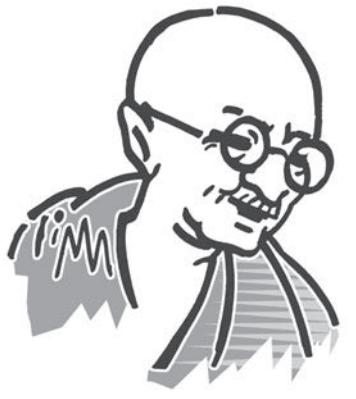

### About the author

Louis Fischer (1896-1970) was born in Philadelphia. He served as a volunteer in the British Army between 1918 and 1920. Fischer made a career as a journalist and wrote for The New York Times, The Saturday Review and for European and Asian publications. He was also a member of the faculty at Princeton University. The following is an excerpt from his book- The Life of Mahatma Gandhi. The book has been reviewed as one of the best books ever written on Gandhi by Times Educational Supplement.

Notice these expressions in the text. Infer their meaning from the context.

- 
- conflict of duties seek a prop

46/Flamingo

- urge the departure harbour a man like me
	-

When I first visited Gandhi in 1942 at his ashram in Sevagram, in central India, he said, "I will tell you how it happened that I decided to urge the departure of the British. It was in 1917."

He had gone to the December 1916 annual convention of the Indian National Congress party in Lucknow. There were 2,301 delegates and many visitors. During the proceedings, Gandhi recounted, "a peasant came up to me looking like any other peasant in India, poor and emaciated, and said, 'I am Rajkumar Shukla. I am from Champaran, and I want you to come to my district'!'' Gandhi had never heard of the place. It was in the foothills of the towering Himalayas, near the kingdom of Nepal.

Under an ancient arrangement, the Champaran peasants were sharecroppers. Rajkumar Shukla was one of them. He was illiterate but resolute. He had come to the

Congress session to complain about the injustice of the landlord system in Bihar, and somebody had probably said, "Speak to Gandhi."

Gandhi told Shukla he had an appointment in Cawnpore and was also committed to go to other parts of India. Shukla accompanied him everywhere. Then Gandhi returned to his ashram near Ahmedabad. Shukla followed him to the ashram. For weeks he never left Gandhi's side.

"Fix a date," he begged.

Impressed by the sharecropper's tenacity and story Gandhi said, ''I have to be in Calcutta on such-and-such a date. Come and meet me and take me from there."

Months passed. Shukla was sitting on his haunches at the appointed spot in Calcutta when Gandhi arrived; he waited till Gandhi was free. Then the two of them boarded a train for the city of Patna in Bihar. There Shukla led him to the house of a lawyer named Rajendra Prasad who later became President of the Congress party and of India. Rajendra Prasad was out of town, but the servants knew Shukla as a poor yeoman who pestered their master to help the indigo sharecroppers. So they let him stay on the grounds with his companion, Gandhi, whom they took to be another peasant. But Gandhi was not permitted to draw water

- 1. Strike out what is not true in the following.
	- a. Rajkumar Shukla was
		- (i) a sharecropper.
		- (ii) a politician.
		- (iii) delegate.
		- (iv) a landlord.
	- b. Rajkumar Shukla was
		- (i) poor.
		- (ii) physically strong.
		- (iii) illiterate.
- 2. Why is Rajkumar Shukla described as being 'resolute'?
- 3. Why do you think the servants thought Gandhi to be another peasant?

from the well lest some drops from his bucket pollute the entire source; how did they know that he was not an untouchable?

Gandhi decided to go first to Muzzafarpur, which was en route to Champaran, to obtain more complete information about conditions than Shukla was capable of imparting. He accordingly sent a telegram to Professor J.B. Kripalani, of the Arts College in Muzzafarpur, whom he had seen at Tagore's Shantiniketan school. The train

arrived at midnight, 15 April 1917. Kripalani was waiting at the station with a large body of students. Gandhi stayed there for two days in the home of Professor Malkani, a

teacher in a government school. ''It was an extraordinary thing 'in those days,'' Gandhi commented, "for a government professor to harbour a man like me". In smaller localities, the Indians were afraid to show sympathy for advocates of home-rule.

The news of Gandhi's advent and of the nature of his mission spread quickly through Muzzafarpur and to Champaran. Sharecroppers from Champaran began arriving on foot and by conveyance to see their champion. Muzzafarpur lawyers called on Gandhi to brief him; they frequently represented peasant groups in court; they told him about their cases and reported the size of their fee.

Gandhi chided the lawyers for collecting big fee from the sharecroppers. He said, ''I have come to the conclusion that we should stop going to law courts. Taking such cases to the courts does litte good. Where the peasants are so crushed and fear-stricken, law courts are useless. The real relief for them is to be free from fear.''

Most of the arable land in the Champaran district was divided into large

48/Flamingo

estates owned by Englishmen and worked by Indian tenants. The chief commercial crop was indigo. The landlords compelled all tenants to plant three twentieths or 15 per cent of their holdings with indigo and surrender the entire indigo harvest as rent. This was done by long-term contract.

Presently, the landlords learned that Germany had developed synthetic indigo. They, thereupon, obtained agreements from the sharecroppers to pay them compensation for being released from the 15 per cent arrangement.

The sharecropping arrangement was irksome to the peasants, and many signed willingly. Those who resisted, engaged lawyers; the landlords hired thugs. Meanwhile, the information about synthetic indigo reached the illiterate peasants who had signed, and they wanted their money back.

- 1. List the places that Gandhi visited between his first meeting with Shukla and his arrival at Champaran.
- 2. What did the peasants pay the British landlords as rent? What did the British now want instead and why? What would be the impact of synthetic indigo on the prices of natural indigo?

At this point Gandhi arrived in Champaran.

He began by trying to get the facts. First he visited the secretary of the British landlord's association. The secretary told him that they could give no information to an outsider. Gandhi answered that he was no outsider.

Next, Gandhi called on the British official commissioner of the Tirhut division in which the Champaran district lay. ''The commissioner,'' Gandhi reports, ''proceeded to bully me and advised me forthwith to leave Tirhut.''

Gandhi did not leave. Instead he proceeded to Motihari, the capital of Champaran. Several lawyers accompanied him. At the railway station, a vast multitude greeted Gandhi. He went to a house and, using it as headquarters, continued his investigations. A report came in that a peasant had been maltreated in a nearby village. Gandhi decided to go and see; the next morning he started out on the back of an elephant. He had not proceeded far when the police superintendent's messenger overtook him and ordered him to return to town

in his carriage. Gandhi complied. The messenger drove Gandhi home where he served him with an official notice to quit Champaran immediately. Gandhi signed a receipt for the notice and wrote on it that he would disobey the order.

In consequence, Gandhi received a summons to appear in court the next day.

All night Gandhi remained awake. He telegraphed Rajendra Prasad to come from Bihar with influential friends. He sent instructions to the ashram. He wired a full report to the Viceroy.

Morning found the town of Motihari black with peasants. They did not know Gandhi's record in South Africa. They had merely heard that a Mahatma who wanted to help them was in trouble with the authorities. Their spontaneous demonstration, in thousands, around the courthouse was the beginning of their liberation from fear of the British.

The officials felt powerless without Gandhi's cooperation. He helped them regulate the crowd. He was polite and friendly. He was giving them concrete proof that their might, hitherto dreaded and unquestioned, could be challenged by Indians.

The government was baffled. The prosecutor requested the judge to postpone the trial. Apparently, the authorities wished to consult their superiors.

Gandhi protested against the delay. He read a statement pleading guilty. He was involved, he told the court, in a "conflict of duties"— on the one hand, not to set a bad example as a lawbreaker; on the other hand, to render the "humanitarian and national service" for which he had come. He disregarded the order to leave, "not for want of respect for lawful authority, but in obedience to the higher law of our being, the voice of conscience". He asked the penalty due.

The magistrate announced that he would pronounce sentence after a two-hour recess and asked Gandhi to furnish bail for those 120 minutes. Gandhi refused. The judge released him without bail.

When the court reconvened, the judge said he would not deliver the judgment for several days. Meanwhile he allowed Gandhi to remain at liberty.

Rajendra Prasad, Brij Kishor Babu, Maulana Mazharul Huq and several other prominent lawyers had arrived from Bihar. They conferred with Gandhi. What would they do if he was sentenced to prison, Gandhi asked. Why, the senior lawyer replied, they had come to advise and help him; if he went to jail there would be nobody to advise and they would go home.

What about the injustice to the sharecroppers, Gandhi demanded. The lawyers withdrew to consult. Rajendra Prasad has recorded the upshot of their consultations — "They thought, amongst themselves, that Gandhi was totally a stranger, and yet he was prepared to go to prison for the sake of the peasants; if they, on the other hand, being not only residents of the adjoining districts but also those who claimed to have served these peasants, should go home, it would be shameful desertion."

They accordingly went back to Gandhi and told him they were ready to follow him into jail. ''The battle of Champaran is won,'' he exclaimed. Then he took a piece of paper and divided the group into pairs and put down the order in which each pair was to court arrest.

Several days later, Gandhi received a written communication from the magistrate informing

1. The events in this part of the text illustrate Gandhi's method of working. Can you identify some instances of this method and link them to his ideas of satyagraha and non-violence?

him that the Lieutenant-Governor of the province had ordered the case to be dropped. Civil disobedience had triumphed, the first time in modern India.

Gandhi and the lawyers now proceeded to conduct a far -flung inquiry into the grievances of the farmers. Depositions by about ten thousand peasants were written down, and notes made on other evidence. Documents were collected. The whole area throbbed with the activity of the investigators and the vehement protests of the landlords.

In June, Gandhi was summoned to Sir Edward Gait, the Lieutenant-Governor. Before he went he met

leading associates and again laid detailed plans for civil disobedience if he should not return.

Gandhi had four protracted interviews with the Lieutenant-Governor who, as a result, appointed an official commission of inquiry into the indigo sharecroppers' situation. The commission consisted of landlords, government officials, and Gandhi as the sole representative of the peasants.

Gandhi remained in Champaran for an initial uninterrupted period of seven months and then again for several shorter visits. The visit, undertaken casually on the entreaty of an unlettered peasant in the expectation that it would last a few days, occupied almost a year of Gandhi's life.

The official inquiry assembled a crushing mountain of evidence against the big planters, and when they saw this they agreed, in principle, to make refunds to the peasants. "But how much must we pay?" they asked Gandhi.

They thought he would demand repayment in full of the money which they had illegally and deceitfully extorted from the sharecroppers. He asked only 50 per cent. "There he seemed adamant," writes Reverend J. Z. Hodge, a British missionary in Champaran who observed the entire episode at close range. "Thinking probably that he would not give way, the representative of the planters offered to refund to the extent of 25 per cent, and to his amazement Mr. Gandhi took him at his word, thus breaking the deadlock."

This settlement was adopted unanimously by the commission. Gandhi explained that the amount of the refund was less important than the fact that the landlords had been obliged to surrender part of the money and, with it, part of their prestige. Therefore, as far as the peasants were concerned, the planters had behaved as lords above

the law. Now the peasant saw that he had rights and defenders. He learned courage.

Events justified Gandhi's position. Within a few years the British planters abandoned their estates, which reverted to the peasants. Indigo sharecropping disappeared.

Gandhi never contented himself with large political or economic solutions. He saw the cultural and social backwardness in the Champaran villages and wanted to do something about it immediately. He appealed for teachers. Mahadev Desai and Narhari Parikh, two young men who had just joined Gandhi as disciples, and their wives, volunteered for the work. Several more came from

Bombay, Poona and other distant parts of the land. Devadas, Gandhi's youngest son, arrived from the ashram and so did Mrs. Gandhi. Primary schools were opened in six villages. Kasturbai taught the ashram rules on personal cleanliness and community sanitation.

- 1. Why did Gandhi agree to a settlement of 25 per cent refund to the farmers?
- 2. How did the episode change the plight of the peasants?

Health conditions were miserable. Gandhi got a doctor to volunteer his services for six months. Three medicines were available — castor oil, quinine and sulphur ointment. Anybody who showed a coated tongue was given a dose of castor oil; anybody with malaria fever received quinine plus castor oil; anybody with skin eruptions received ointment plus castor oil.

Gandhi noticed the filthy state of women's clothes. He asked Kasturbai to talk to them about it. One woman took Kasturbai into her hut and said, ''Look, there is no box or cupboard here for clothes. The sari I am wearing is the only one I have."

During his long stay in Champaran, Gandhi kept a long distance watch on the ashram. He sent regular instructions by mail and asked for financial accounts. Once he wrote to the residents that it was time to fill in the old latrine trenches and dig new ones otherwise the old ones would begin to smell bad.

The Champaran episode was a turning-point in Gandhi's life. ''What I did," he explained, "was a very ordinary thing. I declared that the British could not order me about in my own country."

But Champaran did not begin as an act of defiance. It grew out of an attempt to alleviate the distress of large numbers of poor peasants. This was the typical Gandhi pattern — his politics were intertwined with the practical, day-to-day problems of the millions. His was not a loyalty to abstractions; it was a loyalty to living, human beings.

In everything Gandhi did, moreover, he tried to mould a new free Indian who could stand on his own feet and thus make India free.

Early in the Champaran action, Charles Freer Andrews, the English pacifist who had become a devoted follower of the Mahatma, came to bid Gandhi farewell before going on a tour of duty to the Fiji Islands. Gandhi's lawyer friends thought it would be a good idea for Andrews to stay in Champaran and help them. Andrews was willing if Gandhi agreed. But Gandhi was vehemently opposed. He said, ''You think that in this unequal fight it would be helpful if we have an Englishman on our side. This shows the weakness of your heart. The cause is just and you must rely upon yourselves to win the battle. You should not seek a prop in Mr. Andrews because he happens to be an Englishman''.

''He had read our minds correctly,'' Rajendra Prasad comments, "and we had no reply… Gandhi in this way taught us a lesson in self-reliance''.

Self-reliance, Indian independence and help to sharecroppers were all bound together.

## Understanding the text

- 1. Why do you think Gandhi considered the Champaran episode to be a turning-point in his life?
- 2. How was Gandhi able to influence lawyers? Give instances.
- 3. What was the attitude of the average Indian in smaller localities towards advocates of 'home rule'?
- 4. How do we know that ordinary people too contributed to the freedom movement?

54/Flamingo

## Talking about the text

### Discuss the following.

- 1. "Freedom from fear is more important than legal justice for the poor."
Do you think that the poor of India are free from fear after Independence?

- 2. The qualities of a good leader.
## Working with words

- List the words used in the text that are related to legal procedures.
For example: deposition

- List other words that you know that fall into this category.
## Thinking about language

- 1. Notice the sentences in the text which are in 'direct speech'. Why does the author use quotations in his narration?
- 2. Notice the use or non-use of the comma in the following sentences.
	- (a) When I first visited Gandhi in 1942 at his ashram in Sevagram, he told me what happened in Champaran.
	- (b) He had not proceeded far when the police superintendent's messenger overtook him.
	- (c) When the court reconvened, the judge said he would not deliver the judgment for several days.

## Things to do

- 1. Choose an issue that has provoked a controversy like the Bhopal Gas Tragedy or the Narmada Dam Project in which the lives of the poor have been affected.
- 2. Find out the facts of the case.
- 3. Present your arguments.
- 4. Suggest a possible settlement.

# ABOUT THE UNIT

## THEME

The leadership shown by Mahatma Gandhi to secure justice for oppressed people through convincing argumentation and negotiation.

### SUB-THEME

Contributions made by anonymous Indians to the freedom movement.

## READING COMPREHENSION

- Intensive reading of factual writing to understand events and facts. The think as you read questions at the end of each section help in understanding descriptions of people, consolidating facts and focusing on what is important to understand further sections.
- Scanning for specific instances in the text to support given statements.
- Inferential questions to reason out certain statements in the text.

## TALKING ABOUT THE TEXT

Discussion as a take-off from the text and making pupils think about issues such as freedom from fear as a prerequisite for justice. Understanding leadership qualities – direct relevance to pupils' prospects. Fluency development.

## WORKING WITH WORDS

Making pupils notice the specialist vocabulary used in legal parlance.

### NOTICING FORM

- Use of direct speech in narration. Pupils are already aware of the form changes when spoken words are reported. They should now be able to notice the choice of form in contexts of use to strengthen the effectiveness of narration.
- Use of the comma to separate subordinate clause from main clause if it precedes it, and its omission if it comes after the main clause.

## THINGS TO DO

Extension activity to help pupils understand the method of Gandhian activism and relate it to current problems of national importance.

- Investigation of facts
- Presentation of arguments
- Settlement

