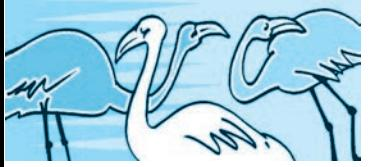
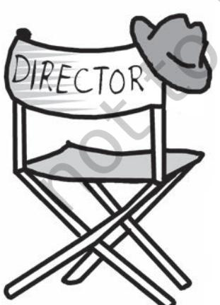
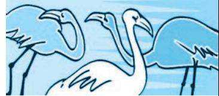
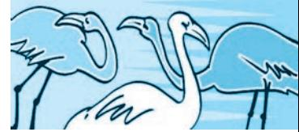
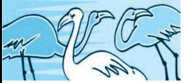
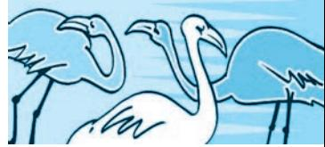
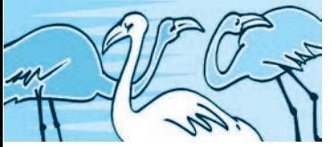
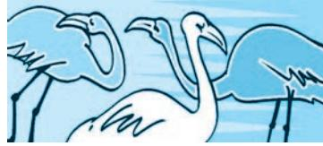

### About the author

Asokamitran (1931–2017), a Tamil writer, recounts his years at Gemini Studios in his book My Years with Boss which talks of the influence of movies on every aspect of life in India. The Gemini Studios, located in Chennai, was set up in 1940. It was one of the most influential film-producing organisations of India in the early days of Indian film-making. Its founder was S.S. Vasan. The duty of Asokamitran in Gemini Studios was to cut out newspaper clippings on a wide variety of subjects and store them in files. Many of these had to be written out by hand. Although he performed an insignificant function he was the most well-informed of all the members of the Gemini family. The following is an excerpt from his book My Years with Boss.

Notice these words and expressions in the text. Infer their meaning from the context.

- 
- catapulted into a coat of mail
- played into their hands the favourite haunt
- heard a bell ringing
- blew over was struck dumb
	-
	-

Poets and Pancakes/57

Pancake was the brand name of the make-up material that Gemini Studios bought in truck-loads. Greta Garbo1 must have used it, Miss Gohar must have used it, Vyjayantimala2 must also have used it but Rati Agnihotri may not have even heard of it. The make-up department of the Gemini Studios was in the upstairs of a building that was believed to have been Robert Clive's stables. A dozen other buildings

1. A Swedish actress, in 1954 she received an Honorary Oscar for her unforgettable screen performances. The Guinness Book of World Records named her the most beautiful woman who ever lived. She was also voted Best Silent Actress of the country.

2. An Indian actress whose performance was widely appreciated in Bimal Roy's Devdas. She won three Best Actress awards for her acting. She is now an active politician.

in the city are said to have been his residence. For his brief life and an even briefer stay in Madras, Robert Clive seems to have done a lot of moving, besides fighting some impossible battles in remote corners of India and marrying a maiden in St. Mary's Church in Fort St. George in Madras.

The make-up room had the look of a hair-cutting salon with lights at all angles around half a dozen large mirrors. They were all incandescent lights, so you can imagine the fiery misery of those subjected to make-up. The make-up department was first headed by a Bengali who became too big for a studio and left. He was succeeded by a Maharashtrian who was assisted by a Dharwar Kannadiga, an Andhra, a Madras Indian Christian, an Anglo-Burmese and the usual local Tamils. All this shows that there was a great deal of national integration long before A.I.R. and Doordarshan began broadcasting programmes on national integration. This gang of nationally integrated make-up men could turn any decent-looking person into a hideous crimson hued monster with the help of truck-loads of pancake and a number of other locally made potions and lotions. Those were the days of mainly indoor shooting, and only five per cent of the film was shot outdoors. I suppose the sets and studio lights needed the girls and boys to be made to look ugly in order to look presentable in the movie. A strict

hierarchy was maintained in the make-up department. The chief make-up man made the chief actors and actresses ugly, his senior assistant the 'second' hero and heroine, the junior assistant the main comedian, and so forth. The players who played the crowd were the responsibility of the office boy. (Even the make-up department of the Gemini Studio had an 'office boy'!) On the days when there was a crowdshooting, you could see him mixing his paint in a giant vessel and

58/FLAMINGO

slapping it on the crowd players. The idea was to close every pore on the surface of the face in the process of applying make-up. He wasn't exactly a 'boy'; he was in his early forties, having entered the studios years ago in the hope of becoming

a star actor or a top screen writer, director or lyrics writer. He was a bit of a poet.

In those days I worked in a cubicle, two whole sides of which were French windows. (I didn't know at that time they were called French windows.) Seeing me sitting at my desk tearing up newspapers day in and day out, most people thought I was doing next to nothing. It is likely that the Boss thought likewise too. So anyone who felt I should be given some occupation would barge into

- 1. What does the writer mean by 'the fiery misery' of those subjected to make-up'?
- 2. What is the example of national integration that the author refers to?
- 3. What work did the 'office boy' do in the Gemini Studios? Why did he join the studios? Why was he disappointed?
- 4. Why did the author appear to be doing nothing at the studios?

my cubicle and deliver an extended lecture. The 'boy' in the make-up department had decided I should be enlightened on how great literary talent was being allowed to go waste in a department fit only for barbers and perverts. Soon I was praying for crowd-shooting all the time. Nothing short of it could save me from his epics.

In all instances of frustration, you will always find the anger directed towards a single person openly or covertly and this man of the make-up department was convinced that all his woes, ignominy and neglect were due to Kothamangalam Subbu. Subbu was the No. 2 at Gemini Studios. He couldn't have had a more encouraging opening in films than our grown-up make-up boy had. On the contrary he must have had to face more uncertain and difficult times, for when he began his career, there were no firmly established film producing companies or studios. Even in the matter of education, specially formal education, Subbu couldn't have had an appreciable lead over our boy. But by virtue of being born a Brahmin — a virtue, indeed! — he must have had exposure to more affluent situations

and people. He had the ability to look cheerful at all times even after having had a hand in a flop film. He always had work for somebody — he could never do things on his own — but his sense of loyalty made him identify himself with his principal completely and turn his entire creativity to his principal's advantage. He was tailor-made for films. Here was a man who could be inspired when commanded. "The rat fights the tigress underwater and kills her but takes pity on the cubs and tends them lovingly — I don't know how to do the scene," the producer would say and Subbu would come out with four ways of the rat pouring affection on its victim's offspring. "Good, but I am not sure it is effective enough," the producer would say and in a minute Subbu would come out with fourteen more alternatives. Film-making must have been and was so easy with a man like Subbu around and if ever there was a man who gave direction and definition to Gemini Studios during its golden years, it was Subbu. Subbu had a separate identity as a poet and though he was certainly capable of more complex and higher forms, he deliberately chose to address his poetry to the masses. His success in films overshadowed and dwarfed his literary achievements — or so his critics felt. He composed several truly original 'story poems' in folk refrain and diction and also wrote a sprawling novel Thillana Mohanambal with dozens of very deftly etched characters. He quite successfully recreated the mood and manner of the Devadasis of the early 20th century. He was an amazing actor — he never aspired to the lead roles — but whatever subsidiary role he played in any of the films, he performed better than the supposed main players. He had a genuine love for anyone he came across and his house was a permanent residence for dozens of near and far relations and acquaintances. It seemed against Subbu's nature to be even conscious that he was feeding and supporting so many of them. Such a charitable and improvident man, and yet he had enemies! Was it because he seemed so close and intimate with The Boss? Or was it his general demeanour that resembled a sycophant's? Or his readiness to say nice things about everything? In any

case, there was this man in the make-up department who would wish the direst things for Subbu.

You saw Subbu always with The Boss but in the attendance rolls, he was grouped under a department called the Story Department comprising a lawyer and an assembly of writers and poets. The lawyer was also officially known as the legal adviser, but everybody referred to him as the opposite. An extremely talented actress, who was also extremely temperamental, once blew over on the sets. While everyone stood stunned, the lawyer quietly switched on the recording equipment. When the actress paused for breath, the lawyer said to her, "One minute, please," and played back the recording. There was nothing incriminating or unmentionably foul about the actress's tirade against the producer. But when she heard her voice again through the sound equipment, she was struck dumb. A girl from the countryside, she hadn't gone through all the stages of worldly experience that generally precede a position of importance and sophistication that she had found herself catapulted into. She never quite recovered from the terror she felt that day. That was the end of a brief and brilliant

acting career — the legal adviser, who was also a member of the Story Department, had unwittingly brought about that sad end. While every other member of the Department wore a kind of uniform — khadi dhoti with a slightly oversized and clumsily tailored white khadi shirt — the legal adviser wore pants and a tie and sometimes a coat that looked like a coat of mail. Often he looked alone and helpless — a man of cold logic in a crowd of dreamers — a neutral man in an assembly of Gandhiites

- 1. Why was the office boy frustrated? Who did he show his anger on?
- 2. Who was Subbu's principal?
- 3. Subbu is described as a many-sided genius. List four of his special abilities.
- 4. Why was the legal adviser referred to as the opposite by others?
- 5. What made the lawyer stand out from the others at Gemini Studios?

and khadiites. Like so many of those who were close to The Boss, he was allowed to produce a film and though a

Poets and Pancakes/61

lot of raw stock and pancake were used on it, not much came of the film. Then one day The Boss closed down the Story Department and this was perhaps the only instance in all human history where a lawyer lost his job because the poets were asked to go home.

Gemini Studios was the favourite haunt of poets like S.D.S.Yogiar3 , Sangu Subramanyam, Krishna Sastry and Harindranath Chattopadhyaya4 . It had an excellent mess which supplied good coffee at all times of the day and for most part of the night. Those were the days when Congress rule meant Prohibition and meeting over a cup of coffee was rather satisfying entertainment. Barring the office boys and a couple of clerks, everybody else at the Studios radiated leisure, a pre-requisite for poetry. Most of them wore khadi and worshipped Gandhiji but beyond that they had not the faintest appreciation for political thought of any kind. Naturally, they were all averse to the term 'Communism'. A Communist was a godless man — he had no filial or conjugal love; he had no compunction about killing his own parents or his children; he was always out to cause and spread unrest and violence among innocent and ignorant people. Such notions which prevailed everywhere else in South India at that time also, naturally, floated about vaguely among the khadi-clad poets of Gemini Studios. Evidence of it was soon forthcoming.

When Frank Buchman's Moral Re-Armament army, some two hundred strong, visited Madras sometime in 1952, they could not have found a warmer host in India than the Gemini Studios. Someone called the group an international circus. They weren't very good on the trapeze and their acquaintance with animals was only at the dinner table, but they presented two plays in a most professional manner. Their 'Jotham Valley' and 'The Forgotten Factor' ran several shows in Madras and along with the other citizens of the city, the Gemini family of six hundred saw the plays over and over again. The message of the plays were usually plain and simple homilies, but the sets and costumes were first-rate. Madras and the Tamil drama community were

62/FLAMINGO

3. A freedom fighter and a national poet.

4. A poet and a playwright.

terribly impressed and for some years almost all Tamil plays had a scene of sunrise and sunset in the manner of 'Jotham Valley' with a bare stage, a white background curtain and a tune played on the flute. It was some years later that I learnt that the MRA was a kind of counter-movement to international Communism and the big bosses of Madras like Mr. Vasan simply played into their hands. I am not sure however, that this was indeed the case, for the unchangeable aspects of these big bosses and their enterprises remained the same, MRA or no MRA, international Communism or no international Communism. The staff of Gemini Studios had a nice time hosting two hundred people of all hues and sizes of at least twenty nationalities. It was such a change from the usual collection of crowd players waiting to be slapped with thick layers of make-up by the office-boy in the make-up department.

A few months later, the telephone lines of the big bosses of Madras buzzed and once again we at Gemini Studios cleared a whole shooting stage to welcome another visitor. All they said was that he was a poet from England. The only poets from England the simple Gemini staff knew or heard of were Wordsworth and Tennyson; the more literate ones knew of Keats, Shelley and Byron; and one or two might have faintly come to know of someone by the name Eliot. Who was the poet visiting the Gemini Studios now?

"He is not a poet. He is an editor. That's why The Boss is giving him a big reception." Vasan was also the editor of the popular Tamil weekly Ananda Vikatan.

He wasn't the editor of any of the known names of British publications in Madras, that is, those known at the Gemini Studios. Since the top men of The Hindu were taking the initiative, the surmise was that the poet was the editor of a daily — but not from The Manchester Guardian or the London Times. That was all that even the most wellinformed among us knew.

At last, around four in the afternoon, the poet (or the editor) arrived. He was a tall man, very English, very serious and of course very unknown to all of us. Battling with half a dozen pedestal fans on the shooting stage, The Boss read

- 1. Did the people at Gemini Studios have any particular political affiliations?
- 2. Why was the Moral Rearmament Army welcomed at the Studios?
- 3. Name one example to show that Gemini studios was influenced by the plays staged by MRA.
- 4. Who was The Boss of Gemini Studios?
- 5. What caused the lack of communication between the Englishman and the people at Gemini Studios?
- 6. Why is the Englishman's visit referred to as unexplained mystery?

out a long speech. It was obvious that he too knew precious little about the poet (or the editor). The speech was all in the most general terms but here and there it was peppered with words like 'freedom' and 'democracy'. Then the poet spoke. He couldn't have addressed a more dazed and silent audience no one knew what he was talking about and his accent defeated any attempt to understand what he was saying. The whole thing lasted about an hour; then the poet left and we all dispersed in utter bafflement what are we doing? What is an English poet doing in a film studio which makes Tamil films for the simplest sort of people? People whose lives least afforded them the

possibility of cultivating a taste for English poetry? The poet looked pretty baffled too, for he too must have felt the sheer incongruity of his talk about the thrills and travails of an English poet. His visit remained an unexplained mystery.

The great prose-writers of the world may not admit it, but my conviction grows stronger day after day that prosewriting is not and cannot be the true pursuit of a genius. It is for the patient, persistent, persevering drudge with a heart so shrunken that nothing can break it; rejection slips don't mean a thing to him; he at once sets about making a fresh copy of the long prose piece and sends it on to another editor enclosing postage for the return of the manuscript. It was for such people that The Hindu had published a tiny announcement in an insignificant corner of an unimportant page — a short story contest organised by a British periodical by the name The Encounter. Of course, The Encounter wasn't a known commodity among the Gemini literati. I wanted to get an idea of the periodical before I spent a considerable sum in postage sending a manuscript

to England. In those days, the British Council Library had an entrance with no long winded signboards and notices to make you feel you were sneaking into a forbidden area. And there were copies of The Encounter lying about in various degrees of freshness, almost untouched by readers. When I read the editor's name, I heard a bell ringing in my shrunken heart. It was the poet who had visited the Gemini Studios — I felt like I had found a long lost brother and I sang as I sealed the envelope and wrote out his address. I felt that he too would be singing the same song at the same time — long lost brothers of Indian films discover each other by singing the same song in the first reel and in the final reel of the film. Stephen Spender5 . Stephen — that was his name.

And years later, when I was out of Gemini Studios and I had much time but not much money, anything at a reduced price attracted my attention. On the footpath in front of the Madras Mount Road Post Office, there was a pile of brand new books for fifty paise each. Actually they were copies of the same book, an elegant paperback of American origin. 'Special low-priced student edition, in connection with the 50th Anniversary of the Russian Revolution', I paid fifty paise and picked up a copy of the

book, The God That Failed. Six eminent men of letters in six separate essays described 'their journeys into Communism and their disillusioned return'; Andre Gide6 , Richard Wright7 , Ignazio Silone8 , Arthur Koestler9 , Louis Fischer10 and Stephen Spender. Stephen Spender! Suddenly the book assumed tremendous

- 1. Who was the English visitor to the studios?
- 2. How did the author discover who the English visitor to the studios was?
- 3. What does The God that Failed refer to?
- 5. An English poet essayist who concentrated on themes of social injustice and class struggle.

10. A well known American journalist and a writer of Mahatma Gandhi's biography entitled The Life of Mahatma Gandhi. The Oscar winning film Gandhi is based on this biographical account.

Poets and Pancakes/65

6. A French writer, humanist, moralist, received the Nobel Prize for Literature in 1947.

7. An American writer, known for his novel Native Son and his autobiography Black Boy.

8. An Italian writer, who was the founder member of the Italian communist party in 1921, and is known for the book. The God That Failed, authored by him.

9. A Hungarian born British novelist, known for his novel Darkness at Noon.

significance. Stephen Spender, the poet who had visited Gemini Studios! In a moment I felt a dark chamber of my mind lit up by a hazy illumination. The reaction to Stephen Spender at Gemini Studios was no longer a mystery. The Boss of the Gemini Studios may not have much to do with Spender's poetry. But not with his god that failed.

## Understanding the text

- 1. The author has used gentle humour to point out human foibles. Pick out instances of this to show how this serves to make the piece interesting.
- 2. Why was Kothamangalam Subbu considered No. 2 in Gemini Studios?
- 3. How does the author describe the incongruity of an English poet addressing the audience at Gemini Studios?
- 4. What do you understand about the author's literary inclinations from the account?

## Talking about the text

Discuss in small groups taking off from points in the text.

- 1. Film-production today has come a long way from the early days of the Gemini Studios.
- 2. Poetry and films.
- 3. Humour and criticism.

## Noticing transitions

- This piece is an example of a chatty, rambling style. One thought leads to another which is then dwelt upon at length.
- Read the text again and mark the transitions from one idea to another. The first one is indicated below.

Make-up department Office-boy Subbu

# Writing

You must have met some interesting characters in your neighbourhood or among your relatives. Write a humourous piece about their idiosyncrasies. Try to adopt the author's rambling style, if you can.

66/FLAMINGO

## Things to do

Collect about twenty cartoons from newspapers and magazines in any langauge to discuss how important people or events have been satirised. Comment on the interplay of the words and the pictures used.

## THEME

An account of the events and personalities in a film company in the early days of Indian cinema.

## SUB-THEME

Poets and writers in a film company environment.

### COMPREHENSION

- Understanding humour and satire.
- Following a rambling, chatty style and making inferences.

## TALKING ABOUT THE TEXT

### Discuss

- Today's film technology compared with that of the early days of Indian cinema (comparing and contrasting).
- Poetry and films; criticism and humour.

## NOTICING TRANSITIONS

Focus on devices for achieving thematic coherence.

## WRITING

Practice writing in the humorous style.

## THINGS TO DO

Extension activity on cartoons as a vehicle of satirical comment on human foibles.

