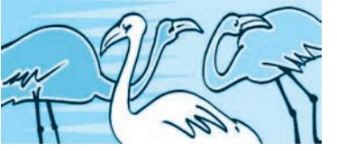
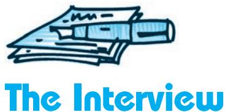
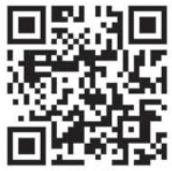
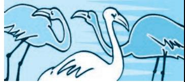
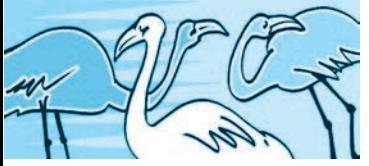
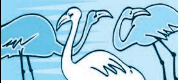
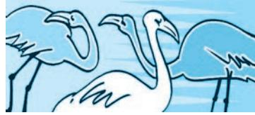

7

From the Introduction to The Penguin Book of Interviews edited by Christopher Silvester.

#### About the Author

68/Flamingo

Christopher Silvester (1959) was a student of history at Peterhouse, Cambridge. He was a reporter for Private Eye for ten years and has written features for Vanity Fair. Following is an excerpt taken from his introduction to the Penguin Book of Interviews, An Anthology from 1859 to the Present Day.

### Part I

Since its invention a little over 130 years ago, the interview has become a commonplace of journalism. Today, almost everybody who is literate will have read an interview at some point in their lives, while from the other point of view, several thousand celebrities have been interviewed over the years, some of them repeatedly. So it is hardly surprising that opinions of the interview — of its functions, methods and merits — vary considerably. Some might make quite extravagant claims for it as being, in its highest form, a source of truth, and, in its practice, an art. Others, usually celebrities who see themselves as its victims, might despise the interview as an unwarranted intrusion into their lives, or feel that it somehow diminishes them, just as in some primitive cultures it is believed that if one takes a photographic portrait of somebody then one is stealing that person's soul. V. S. Naipaul1 'feels that some people are wounded by interviews and lose a part of themselves,' Lewis Carroll, the creator of Alice in Wonderland, was said to have had 'a just horror of the interviewer' and he never consented to be interviewed — It

1. Known as a cosmopolitan writer. In his travel books and in his documentary works he presents his impressions of the country of his ancestors that is India. He received the Nobel Prize in Literature in 2001.

was his horror of being lionized which made him thus repel would be acquaintances, interviewers, and the persistent petitioners for his autograph and he would afterwards relate the stories of his success in silencing all such people with much satisfaction and amusement. Rudyard Kipling2 expressed an even more condemnatory attitude towards the interviewer. His wife, Caroline, writes in her diary for 14 October 1892 that their day was 'wrecked by two reporters from Boston'. She reports her husband as saying to the reporters, "Why do I refuse to be interviewed? Because it is immoral! It is a crime, just as much of a crime as an offence against my person, as an assault, and just as much merits punishment. It is cowardly and vile. No respectable man would ask it, much less give it," Yet Kipling had himself perpetrated such an 'assault' on Mark Twain only a few years before. H. G. Wells3 in an interview in 1894

referred to 'the interviewing ordeal', but was a fairly frequent interviewee and forty years later found himself interviewing Joseph Stalin4 . Saul Bellow5 , who has consented to be interviewed on several occasions, nevertheless once described interviews as being like thumbprints on his windpipe. Yet despite the drawbacks of the interview, it is a supremely serviceable medium of communication. "These days, more than at any other time, our most vivid impressions of our contemporaries are through

- 1. What are some of the positive views on interviews?
- 2. Why do most celebrity writers despise being interviewed?
- 3. What is the belief in some primitive cultures about being photographed?
- 6. What do you understand by the expression "thumbprints on his windpipe"?
- 5. Who, in today's world, is our chief source of information about personalities?

2. A prolific writer who was known as the poet of the common soldier. Kipling's Jungle Book which is a story of Kimball O' Hara and his adventures in the Himalayas is considered as a children's classic all over the world.

3. An English novelist, journalist, sociologist and historian he is known for his works of science fiction. Wells best known books are The Time Machine, The Invisible Man and The War of the Worlds.

4. A great Russian revolutionary and an active political organiser.

5. A playwright as well as a novelist, Bellow's works were influenced widely by World War II. Among his most famous characters are Augie March and Moses. He published short stories translated from Yiddish. He won the Nobel Prize for Literature in 1976.

interviews," Denis Brian has written. "Almost everything of moment reaches us through one man asking questions of another. Because of this, the interviewer holds a position of unprecedented power and influence."

#### Part II

"I am a professor who writes novels on Sundays" – Umberto Eco

The following is an extract from an interview of Umberto Eco. The interviewer is Mukund Padmanabhan from The Hindu. Umberto Eco, a professor at the University of Bologna in Italy had already acquired a formidable reputation as a scholar for his ideas on semiotics (the study of signs), literary interpretation, and medieval aesthetics before he turned to writing fiction. Literary fiction, academic texts, essays, children's books, newspaper articles— his written output is staggeringly large and wide-ranging, In 1980, he acquired the equivalent of intellectual superstardom with the publication of The Name of the Rose, which sold more than 10 million copies.

- Mukund: The English novelist and academic David Lodge once remarked, "I can't understand how one man can do all the things he [Eco] does."
- Umberto Eco: Maybe I give the impression of doing many things. But in the end, I am convinced I am always doing the same thing.
- Mukund: Which is?
- Umberto Eco: Aah, now that is more difficult to explain. I have some philosophical interests and I pursue them through my academic work and my novels. Even my books for children are about non-violence and peace...you see, the same bunch of ethical, philosophical interests.

And then I have a secret. Did you know what will happen if you eliminate the empty spaces from the universe, eliminate the empty spaces in all the atoms? The universe will become as big as my fist.

70/Flamingo

Similarly, we have a lot of empty spaces in our lives. I call them interstices. Say you are coming over to my place. You are in an elevator and while you are coming up, I am waiting for you. This is an interstice, an empty space. I work in empty spaces. While waiting for your elevator to come up from the first to the third floor, I have already written an article! (Laughs).

- Mukund: Not everyone can do that of course. Your non-fictional writing, your scholarly work has a certain playful and personal quality about it. It is a marked departure from a regular academic style — which is invariably depersonalised and often dry and boring. Have you consciously adopted an informal approach or is it something that just came naturally to you?
- Umberto Eco: When I presented my first Doctoral dissertation in Italy, one of the Professors said, "Scholars learn a lot of a certain subject, then they make a lot of false hypotheses, then they correct them and at the end, they put the conclusions. You, on the contrary, told the story of your research. Even including your trials and errors." At the same time, he recognised I was right and went on to publish my dissertation as a book, which meant he appreciated it.

At that point, at the age of 22, I understood scholarly books should be written the way I had done — by telling the story of the research. This is why my essays always have a narrative aspect. And this is why probably I started writing narratives [novels] so late — at the age of 50, more or less.

I remember that my dear friend Roland Barthes was always frustrated that he was an essayist and not a novelist. He wanted to do creative writing one day or another but he died before he could do so. I never felt this kind of frustration. I started writing novels by accident. I had nothing to do one

day and so I started. Novels probably satisfied my taste for narration.

- Mukund: Talking about novels, from being a famous academic you went on to becoming spectacularly famous after the publication of The Name of the Rose. You've written five novels against many more scholarly works of non-fiction, at least more than 20 of them...
- Umberto Eco: Over 40.
- Mukund: Over 40! Among them a seminal piece of work on semiotics. But ask most people about Umberto Eco and they will say, "Oh, he's the novelist." Does that bother you?
- Umberto Eco: Yes. Because I consider myself a university professor who writes novels on Sundays. It's not a joke. I participate in academic conferences and not meetings of Pen Clubs and writers. I identify myself with the academic community.

But okay, if they [most people] have read only the novels... (laughs and shrugs). I know that by writing novels, I reach a larger audience. I cannot expect to have one million readers with stuff on semiotics.

- Mukund: Which brings me to my next question. The Name of the Rose is a very serious novel. It's a detective yarn at one level but it also delves into metaphysics, theology, and medieval history. Yet it enjoyed a huge mass audience. Were you puzzled at all by this?
- Umberto Eco: No. Journalists are puzzled. And sometimes publishers. And this is because journalists and publishers believe that people like trash and don't like difficult reading experiences. Consider there are six billion people on this planet. The Name of the Rose sold between 10 and 15 million copies. So in a way I reached only a small

72/Flamingo

percentage of readers. But it is exactly these kinds of readers who don't want easy experiences. Or at least don't always want this. I myself, at 9 pm after dinner, watch television and want to see either 'Miami Vice' or 'Emergency Room'. I enjoy it and I need it. But not all day.

- Mukund: Could the huge success of the novel have anything to do with the fact that it dealt with a period of medieval history that...
- Umberto Eco: That's possible. But let me tell you another story, because I often tell stories like a Chinese wise man. My American publisher said while she loved my book, she didn't expect to sell more than 3,000 copies in a country where nobody has seen a cathedral or studies Latin. So I was given an advance for 3,000 copies, but in the end it sold two or three million in the U.S.

A lot of books have been written about the medieval past far before mine. I think the success of the book is a mystery. Nobody can predict it. I think if I had written The Name of the Rose ten years earlier or ten years later, it wouldn't have been the same. Why it worked at that time is a mystery.

### Understanding the text

- 1. Do you think Umberto Eco likes being interviewed? Give reasons for your opinion.
- 2. How does Eco find the time to write so much?
- 3. What was distinctive about Eco's academic writing style?
- 4. Did Umberto Eco consider himself a novelist first or an academic scholar?
- 5. What is the reason for the huge success of the novel, The Name of the Rose?

The Interview/73

## Talking about the text

Discuss in pairs or small groups.

- 1. Talk about any interview that you have watched on television or read in a newspaper. How did it add to your understanding of the celebrity, the interviewer and the field of the celebrity?
- 2. The medium you like best for an interview, print, radio, or television.
- 3. Every famous person has a right to his or her privacy. Interviewers sometimes embarrass celebrities with very personal questions.

### Noticing discourse linkers and signallers

### LINKERS

Notice how the utterances of the interviewer and the interviewee are linked to one another. The linkers have been italicised for you.

Linking is done either through the use of reference pronouns, like 'that', 'this', 'which' etc. It can also be done through a repetition of words.

I am convinced I am always doing the same thing.

Which is?

Aah, now that is more difficult to explain.

….

While waiting for your elevator to come up from the first to the third floor, I have already written an article! (Laughs).

Not everyone can do that of course.

Novels probably satisfied my taste for narration.

Talking about novels,

……………………………………….

………………………………………….

at least more than 20 of them... Over 40.

74/Flamingo

Over 40.

……………………………………………..

I cannot expect to have one million readers with stuff on semiotics.

Which brings me to my next question.

………………………………………………………

Were you puzzled at all by this? No. Journalists are puzzled.

……………………………………………………………..

Could the huge success of the novel have anything to do with the fact that it dealt with a period of medieval history that...

That's possible

……………………………………………………………………………

The use of linkers is important in all continuous stretches of text. It is very important in conversation, especially a structured conversation like an interview.

#### SIGNALLERS

When there are shifts in the topic the speaker usually indicates them through phrases that prepare the listener for the shift.

Notice these two examples taken from the interview:

"Which brings me to another question …."

"But let me tell you another story…"

Without these preparatory signallers the flow of ideas in a conversation will not be smooth and continuous.

### Writing

If the interviewer Mukund Padmanabhan had not got the space in the newspaper to reproduce the interview verbatim, he may have been asked to produce a short report of the interview with the salient points.

Write this report for him.

[The teacher should be able to help the pupils in what to include and what can be omitted. We could also provide a short report of an interview as a sample.]

The Interview/75

## Things to do

Interview a person whom you admire either in school or your neighbourhood and record it in writing.

# ABOUT THE UNIT

### THEME

The interview as a communication genre.

### SUB-THEME

An excerpt from an interview with an author.

### COMPREHENSION

- Understanding personal opinion.
- Understanding conversation and the interview pattern.

### TALKING ABOUT THE TEXT

- Expressing personal opinion on the interview genre.
- Comparing different media of communication.

### NOTICING DISCOURSE LINKERS AND SIGNALLERS

Focus on cohesion and coherence features of discourse.

### WRITING

Transfer of information from one genre to another, e.g., interview to report.

### THINGS TO DO

- Extension activity giving practice in interviewing people and personalities.
- Questioning and information gathering techniques.

