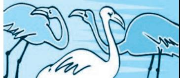
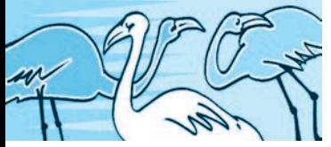
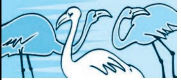
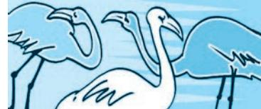
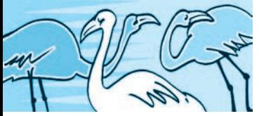
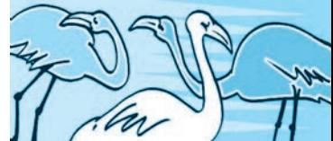
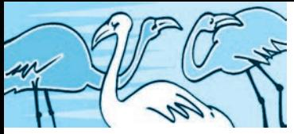
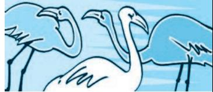
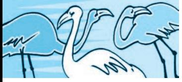

Going Places/77

About the Author

A. R. Barton is a modern writer, who lives in Zurich and writes in English. In the story Going Places, Barton explores the theme of adolescent fantasising and hero worship.

Notice these expressions in the text. Infer their meaning from the context.

- incongruity arcade
- prodigy amber glow
- chuffed wharf
- 

- 
- solitary elm pangs of doubt

"When I leave," Sophie said, coming home from school, "I'm going to have a boutique."

Jansie, linking arms with her along the street; looked doubtful.

"Takes money, Soaf, something like that."

"I'll find it," Sophie said, staring far down the street.

"Take you a long time to save that much."

"Well I'll be a manager then — yes, of course — to begin with. Till I've got enough. But anyway, I know just how it's all going to look."

"They wouldn't make you manager straight off, Soaf."

"I'll be like Mary Quant," Sophie said. "I'll be a natural. They'll see it from the start. I'll have the most amazing shop this city's ever seen.'"

Jansie, knowing they were both earmarked for the biscuit factory, became melancholy. She wished Sophie wouldn't say these things.

When they reached Sophie's street Jansie said, "It's only a few months away now, Soaf, you really should be

sensible. They don't pay well for shop work, you know that, your dad would never allow it."

"Or an actress. Now there's real money in that. Yes, and I could maybe have the boutique on the side. Actresses don't work full time, do they? Anyway, that or a fashion designer, you know — something a bit sophisticated".

And she turned in through the open street door leaving Jansie standing in the rain.

"If ever I come into money I'll buy a boutique."

"Huh - if you ever come into money... if you ever come into money you'll buy us a blessed decent house to live in, thank you very much."

Sophie's father was scooping shepherd's pie into his mouth as hard as he could go, his plump face still grimy and sweat — marked from the day.

"She thinks money grows on trees, don't she, Dad?' said little Derek, hanging on the back of his father's chair.

Their mother sighed.

Sophie watched her back stooped over the sink and wondered at the incongruity of the delicate bow which fastened her apron strings. The delicate-seeming bow and the crooked back. The evening had already blacked in the windows and the small room was steamy from the stove and cluttered with the heavy-breathing man in his vest at the table and the dirty washing piled up in the corner. Sophie felt a tightening in her throat. She went to look for her brother Geoff.

He was kneeling on the floor in the next room tinkering with a part of his motorcycle over some newspaper spread on the carpet. He was three years out of school, an apprentice mechanic, travelling to his work each day to the far side of the city. He was almost grown up now, and she suspected areas of his life about which she knew nothing, about which he never spoke. He said little at all, ever, voluntarily. Words had to be prized out of him like stones out of the ground. And she was jealous of his silence. When he wasn't speaking it was as though he was away somewhere, out there in the world in those places she had never been. Whether they were only the outlying districts

of the city, or places beyond in the surrounding country who knew? — they attained a special fascination simply because they were unknown to her and remained out of her reach.

Perhaps there were also people, exotic, interesting people of whom he never spoke — it was possible, though he was quiet and didn't make new friends easily. She longed to know them. She wished she could be admitted

more deeply into her brother's affections and that someday he might take her with him. Though their father forbade it and Geoff had never expressed an opinion, she knew he thought her too young. And she was impatient. She was conscious of a vast world out there waiting for her and she knew instinctively that she would feel as at home there as in the

- 1. Where was it most likely that the two girls would find work after school?
- 2. What were the options that Sophie was dreaming of? Why does Jansie discourage her from having such dreams?

city which had always been her home. It expectantly awaited her arrival. She saw herself riding there behind Geoff. He wore new, shining black leathers and she a yellow dress with a kind of cape that flew out behind. There was the sound of applause as the world rose to greet them.

He sat frowning at the oily component he cradled in his hands, as though it were a small dumb animal and he was willing it to speak.

"I met Danny Casey," Sophie said.

He looked around abruptly. "Where?"

"In the arcade — funnily enough."

"It's never true."

"I did too."

"You told Dad?"

She shook her head, chastened at his unawareness that he was always the first to share her secrets.

"I don't believe it."

"There I was looking at the clothes in Royce's window when someone came and stood beside me, and I looked around and who should it be but Danny Casey."

"All right, what does he look like?"

"Oh come on, you know what he looks like."

"Close to, I mean."

"Well — he has green eyes. Gentle eyes. And he's not so tall as you'd think..." She wondered if she should say about his teeth, but decided against it.

Their father had washed when he came in and his face and arms were shiny and pink and he smelled of soap. He switched on the television, tossed one of little Derek's shoes from his chair onto the sofa, and sat down with a grunt.

"Sophie met Danny Casey," Geoff said.

Sophie wriggled where she was sitting at the table. Her father turned his head on his thick neck to look at her. His expression was one of disdain.

"It's true," Geoff said.

"I once knew a man who had known Tom Finney," his father said reverently to the television. "But that was a long time ago."

"You told us," Geoff said.

"Casey might be that good some day."

"Better than that even. He's the best."

"If he keeps his head on his shoulders. If they look after him properly. A lot of distractions for a youngster in the game these days."

"He'll be all right. He's with the best team in the country."

"He's very young yet."

"He's older than I am."

"Too young really for the first team."

"You can't argue with that sort of ability."

"He's going to buy a shop," Sophie said from the table. Her father grimaced. "Where'd you hear that?"

"He told me so."

He muttered something inaudible and dragged himself round in his chair. "This another of your wild stories?"

"She met him in the arcade," Geoff said, and told him how it had been.

80/Flamingo

"One of these days you're going to talk yourself into a load of trouble," her father said aggressively.

"Geoff knows it's true, don't you Geoff?"

"He don't believe you-though he'd like to."

* * * The table lamp cast an amber glow across her brother's bedroom wall, and across the large poster of United's first team squad and the row of coloured photographs beneath, three of them of the young Irish prodigy, Casey.

"Promise you'll tell no-one?" Sophie said.

"Nothing to tell is there?"

"Promise, Geoff — Dad'd murder me."

"Only if he thought it was true."

"Please, Geoff."

"Christ, Sophie, you're still at school. Casey must have strings of girls."

"No he doesn't."

"How could you know that?" he jeered.

"He told me, that's how."

"As if anyone would tell a girl something like that."

"Yes he did. He isn't like that. He's... quiet."

"Not as quiet as all that — apparently."

"It was nothing like that, Geoff — it was me spoke first. When I saw who it was, I said, "Excuse me, but aren't

you Danny Casey?" And he looked sort of surprised. And he said, "Yes, that's right." And I knew it must be him because he had the accent, you know, like when they interviewed him on the television. So I asked him for an autograph for little Derek, but neither of us had any paper or a pen. So then we just talked a bit. About the clothes in Royce's window. He seemed lonely. After all, it's a long way from the west of Ireland. And then, just as he was going, he said, if I would care to meet him

- 1. Why did Sophie wriggle when Geoff told her father that she had met Danny Casey?
- 2. Does Geoff believe what Sophie says about her meeting with Danny Casey?
- 3. Does her father believe her story?
- 4. How does Sophie include her brother Geoff in her fantasy of her future?
- 5. Which country did Danny Casey play for?

Going Places/81

next week he would give me an autograph then. Of course, I said I would."

"As if he'd ever show up."

"You do believe me now, don't you?"

He dragged his jacket, which was shiny and shapeless, from the back of the chair and pushed his arms into it. She wished he paid more attention to his appearance. Wished he cared more about clothes. He was tall with a strong dark face. Handsome, she thought.

"It's the unlikeliest thing I ever heard," he said.

* * * On Saturday they made their weekly pilgrimage to watch United. Sophie and her father and little Derek went down near the goal — Geoff, as always, went with his mates higher up. United won two-nil and Casey drove in the second goal, a blend of innocence and Irish genius, going round the two big defenders on the edge of the penalty area, with her father screaming for him to pass, and beating the hesitant goalkeeper from a dozen yards. Sophie glowed with pride. Afterwards Geoff was ecstatic.

"I wish he was an Englishman," someone said on the bus.

"Ireland'll win the World Cup," little Derek told his mother when Sophie brought him home. Her father was gone to the pub to celebrate.

"What's this you've been telling?" Jansie said, next week.

"About what?"

"Your Geoff told our Frank you met Danny Casey."

This wasn't an inquisition, just Jansie being nosey. But Sophie was startled.

"Oh, that."

Jansie frowned, sensing she was covering. "Yes — that." "Well-yes, I did."

"You never did?" Jansie exclaimed.

Sophie glared at the ground. Damn that Geoff, this was a Geoff thing not a Jansie thing. It was meant to be something special just between them. Something secret. It wasn't a Jansie kind of thing at all. Tell gawky Jansie

something like that and the whole neighbourhood would get to know it. Damn that Geoff, was nothing sacred?

"It's a secret — meant to be."

"I'll keep a secret, Soaf, you know that."

"I wasn't going to tell anyone. There'll be a right old row if my dad gets to hear about it."

Jansie blinked. "A row? I'd have thought he'd be chuffed as anything."

She realised then that Jansie didn't know about the date bit — Geoff hadn't told about that. She breathed more easily. So Geoff hadn't let her down after all. He believed in her after all. After all some things might be sacred.

"It was just a little thing really. I asked him for an autograph, but we hadn't any paper or a pen so it was no good." How much had Geoff said?

"Jesus, I wish I'd have been there."

"Of course, my dad didn't want to believe it. You know what a misery he is. But the last thing I need is queues of people round our house asking him, "What's all this about Danny Casey?" He'd murder me. And you know how my mum gets when there's a row."

Jansie said, hushed, "You can trust me, Soaf, you know that."

* * * After dark she walked by the canal, along a sheltered path lighted only by the glare of the lamps from the wharf across the water, and the unceasing drone of the city was muffled and distant. It was a place she had often played in when she was a child. There was a wooden bench beneath a solitary elm where lovers sometimes came. She sat down to wait. It was the perfect place, she had always thought so, for a meeting of this kind. For those who wished not to be observed. She knew he would approve.

For some while, waiting, she imagined his coming. She watched along the canal, seeing him come out of the shadows, imagining her own consequent excitement. Not until some time had elapsed did she begin balancing against this the idea of his not coming.

Here I sit, she said to herself, wishing Danny would come, wishing he would come and sensing the time passing. I feel the pangs of doubt stirring inside me. I watch for him but still there is no sign of him. I remember Geoff saying he would never come, and how none of them believed me when I told them. I wonder what will I do, what can I tell them now if he doesn't come? But we know how it was, Danny and me — that's the main thing. How can you help what people choose to believe? But all the same, it makes me despondent, this knowing I'll never be able to show them they're wrong to doubt me.

She waited, measuring in this way the changes taking place in her. Resignation was no sudden thing.

Now I have become sad, she thought. And it is a hard burden to carry, this sadness. Sitting here waiting and knowing he will not come I can see the future and how I will have to live with this burden. They of course will doubt me, as they always doubted me, but I will have to hold up my head remembering how it was. Already I envisage the slow walk home, and Geoff's disappointed face when I tell him, "He didn't come, that Danny." And then he'll fly out and slam the door. "But we know how it was," I shall tell myself, "Danny and me." It is a hard thing, this sadness.

She climbed the crumbling steps to the street. Outside the pub she passed her father's bicycle propped against the wall, and was glad. He would not be there when she got home.

"Excuse me, but aren't you Danny Casey?"

Coming through the arcade she pictured him again outside Royce's.

He turns, reddening slightly. "Yes, that's right."

"I watch you every week, with my dad and my brothers. We think you're great."

"Oh, well now — that's very nice."

"I wonder — would you mind signing an autograph?"

His eyes are on the same level as your own. His nose is freckled and turns upwards slightly, and when he smiles he does so shyly, exposing teeth with gaps between. His eyes are green, and when he looks straight at you they

seem to shimmer. They seem gentle, almost afraid. Like a

gazelle's. And you look away. You let his eyes run over you a little. And then you come back to find them, slightly breathless.

And he says, "I don't seem to have a pen at all."

You realise you haven't either.

"My brothers will be very sorry," you say.

And afterwards you wait there alone in the arcade for a long while, standing where he

- 1. Why didn't Sophie want Jansie to know about her story with Danny?
- 2. Did Sophie really meet Danny Casey?
- 3. Which was the only occasion when she got to see Danny Casey in person?

stood, remembering the soft melodious voice, the shimmer of green eyes. No taller than you. No bolder than you. The prodigy. The innocent genius. The great Danny Casey.

And she saw it all again, last Saturday — saw him ghost past the lumbering defenders, heard the fifty thousand catch their breath as he hovered momentarily over the ball, and then the explosion of sound as he struck it crisply into the goal, the sudden thunderous eruption of exultant approbation.

## Understanding the text

- 1. Sophie and Jansie were class-mates and friends. What were the differences between them that show up in the story?
- 2. How would you describe the character and temperament of Sophie's father?
- 3. Why did Sophie like her brother Geoff more than any other person? From her perspective, what did he symbolise?
- 4. What socio-economic background did Sophie belong to? What are the indicators of her family's financial status?

## Talking about the text

Discuss in pairs.

- 1. Sophie's dreams and disappointments are all in her mind.
Going Places/85

- 2. It is natural for teenagers to have unrealistic dreams. What would you say are the benefits and disadvantages of such fantasising?
## Working with words

Notice the following expressions. The highlighted words are not used in a literal sense. Explain what they mean.

- Words had to be prized out of him like stones out of a ground.
- Sophie felt a tightening in her throat.
	- If he keeps his head on his shoulders.
- On Saturday they made their weekly pilgrimage to the United.
- She saw… him ghost past the lumbering defenders.

# Noticing form

Notice the highlighted words in the following sentences.

- 1. "When I leave,' Sophie said, coming home from school, "I'm going to have a boutique."
- 2. Jansie, linking arms with her along the street, looked doubtful.
- 3. "I'll find it," Sophie said, staring far down the street.
- 4. Jansie, knowing they were both earmarked for the biscuit factory, became melancholy.
- 5. And she turned in through the open street door leaving Jansie standing in the rain.
	- When we add "ing" to a verb we get the present participle form. The present participle form is generally used along with forms of "be', (is, was, are, were, am) to indicate the present continuous tense as in "Sophie was coming home from school."
	- We can use the present participle by itself without the helping verb, when we wish to indicate that an action is happening at the same time as another.
	- In example 1, Sophie "said" something. "Said", here, is the main action.
	- What Sophie was doing while she was "saying" is indicated by "coming home from school". So we get the information of two actions happening at the same time. We convey the information in one sentence instead of two.

86/Flamingo

- Analyse the other examples in the same way.
- Pick out five other sentences from the story in which present participles are used in this sense.

## Thinking about language

Notice these words in the story.

- "chuffed", meaning delighted or very pleased
- "nosey", meaning inquisitive
- "gawky", meaning awkward, ungainly.

These are words that are used in an informal way in colloquial speech.

Make a list of ten other words of this kind.

#### Writing

- Think of a person who you would like to have as your rolemodel.
- Write down the points to be discussed or questions to be asked, if you were asked to interview that person on a television show.

## Things to do

Look for other stories or movies where this theme of hero worship and fantasising about film or sports icons finds a place.

### ABOUT THE UNIT

#### THEME

Adolescent hero-worship and fantasising.

#### SUB-THEME

Relationships-family, friends.

#### COMPREHENSION

Inferential comprehension.

#### TALKING ABOUT THE TEXT

Discussion on a subject of immediate relevance to the life of school-leavers.

Going Places/87

#### WORKING WITH WORDS

Metaphorical expressions.

#### NOTICING FORM

Focus on the use of present participles to indicate simultaneity of action.

#### THINKING ABOUT LANGUAGE

Colloquial expressions, teenage slang.

#### THINGS TO DO

Extension activity: Relating to other stories or films (any language).

