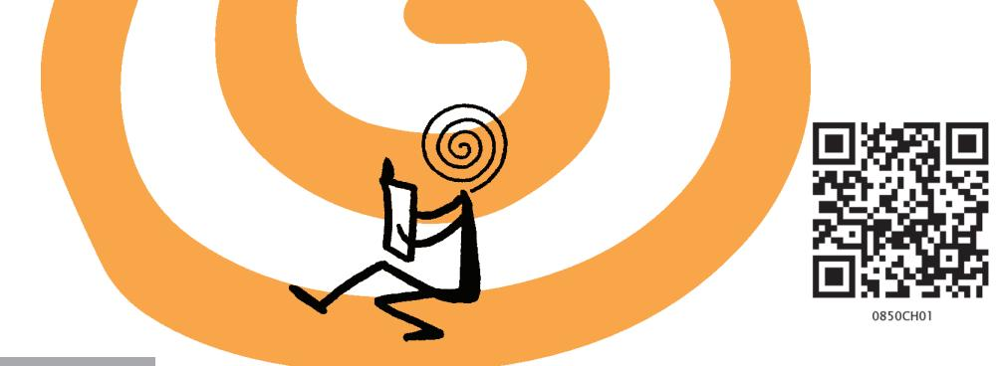
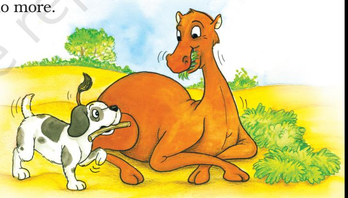
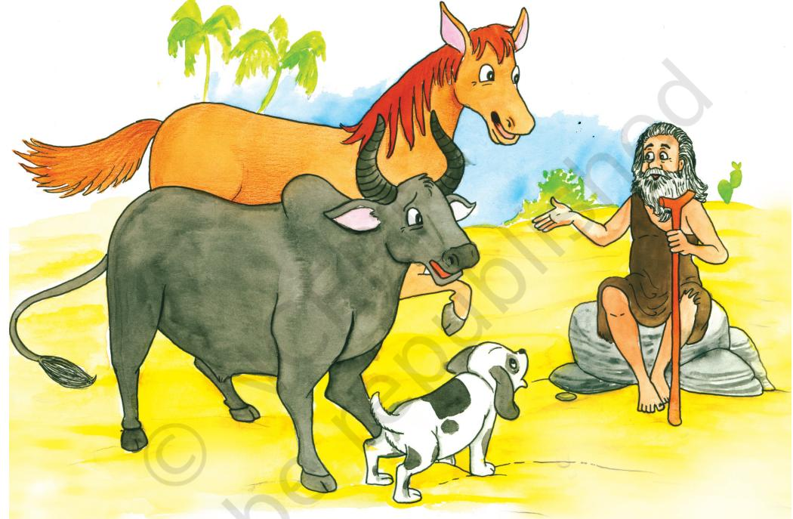
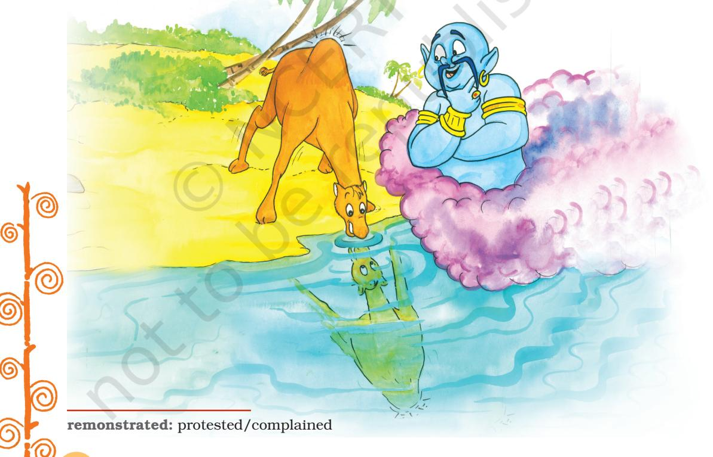

# 1 How the Camel got his hump

### I

- *•* The world had just begun, and the animals were working for humans.
- *•* There was one lazy animal that did nothing, and said nothing but 'Humph'.
- *•* Even the clever Djinn was at his wit's end.

IN the beginning, when the world was new and the Animals were just beginning to work for Man, there was a Camel, and he lived in the middle of a Howling Desert because he did not want to work. He ate sticks and thorns and prickles, and when anybody spoke to him he said "Humph!" Just "Humph!" and no more.

Presently the Horse came to him on Monday morning, with a saddle on his back and said, "Camel, O Camel, come out and trot like the rest of us."

"Humph!" said the Camel, and the Horse went away and told the Man.

Presently the Dog came to him, with a stick in his mouth, and said,

Djinn: (*pronounced 'jin' and variously spelt as 'genie', 'genii', 'jinnee', 'djinni', 'djinny'*): a spirit that has strange powers and can assume any form, human or animal

"Camel, O Camel, come and fetch and carry like the rest of us."

"Humph!" said the Camel, and the Dog went away and told the Man.

Presently the Ox came to him, with the yoke on his neck, and said, "Camel, O Camel, come and plough like the rest of us."

"Humph!" said the Camel, and the Ox went away and told the Man.

At the end of the day the Man called the Horse and the Dog and the Ox together, and said, "Three, O Three, I'm very sorry for you;

but that Humph-thing in the Desert can't work, or he would have been here by now, so I am going to leave him alone, and you must work double-time to make up for it."

That made the Three very angry, and they held a panchayat on the edge of the Desert; and the Camel came chewing cud and laughed at them. Then he said "Humph!" and went away again.

Presently there came along the Djinn who was in charge of All Deserts, rolling in a cloud of dust.

2 It so happened...

"Djinn of All Deserts," said the Horse, "is it right for anyone to be idle?"

"Certainly not," said the Djinn.

"Well," said the Horse, "there's a thing in the middle of your Desert with a long neck and long legs, and he hasn't done a stroke of work since Monday morning. He won't trot."

"Whew!" said the Djinn whistling, "that's my Camel. What does he say about it?"

"He says 'Humph!', and he won't plough," said the Ox.

"Very good," said the Djinn. "I'll humph him if you will kindly wait a minute."

#### Comprehension Check

- *1. What tasks, do you think, were assigned to the dog and the ox?*
- *2. Why did the camel live in the middle of the desert?*
- *3. What made the dog, the horse and the ox very angry?*
- *4. How did the Djinn know the horse was complaining against the camel?*

I'll humph him: I'll deal with him appropriately./I'll set him right.

How the Camel got his hump 3

- *•* The Djinn remonstrated with the camel, who said "Humph".
- *•* The camel's beautiful back suddenly grew a lump, which was the camel's hump.
- *•* The Djinn assured the camel his hump would always be a help, not a hindrance.

The Djinn rolled himself up in his dust-cloak, and took a walk across the Desert, and found the Camel looking at his own reflection in a pool of water.

"My friend," said the Djinn, "what's this I hear of your doing no work?"

The Djinn sat down, with his chin in his hand, while the Camel looked at his own reflection in the pool of water.

"You've given the Three extra work ever since Monday morning, all on account of your idleness," said the Djinn. And he went on thinking with his chin in his hand.

4 It so happened...

"Humph!" said the Camel.

"I shouldn't say that again if I were you," said the Djinn; "you might say it once too often. I want you to work."

And the Camel said "Humph!" again; but no sooner had he said it than he saw his back, that he was so proud of, puffing up and puffing up into a great big hump.

"Do you see that?" said the Djinn. ''That's your very own humph that you've brought upon your very own self by not working. Today is Thursday, and you've done no work since Monday, when the work began. Now you are going to work."

"How can I," said the Camel, "with this humph on my back?"

''That has a purpose," said the Djinn, "all because you missed those three days. You will be able to work now for three days without eating, because you can live on your humph; and don't you ever say I never did anything for you. Come out of the Desert and go to the Three, and behave."

And the Camel went away to join the Three. And from that day to this the Camel always wears a humph (we call it 'hump' now, not to hurt his feelings); but he has never yet caught up with the three days that he missed at the beginning of the world, and he has never yet learned how to behave.

> RUDYARD KIPLING *(abridged)*

### Comprehension Check

- *1. The camel was looking at this own reflection in the pool. What does it suggest to you about the camel?*
- *2. The camel said, "Humph" repeatedly. How did it affect him?*
- *3. What, according to the Djinn, was the use of the "humph"?*
- *4. "...he has never yet learnt to behave". In the light of this, what is the writer's opinion about the camel?*

How the Camel got his hump 5

## Exercise

Discuss the following topics in groups.

- 1. Can this story be factually true?
- 2. What, according to you, is the story about? Consider the following:
	- (i) How the world began.
	- (ii) Why everyone should do his/her share of work seriously.
	- (iii) How animals are important to humans.
	- (iv) How the camel got his hump.
- J3. What did you do over the weekend? Were you generally active or idle? Please check your back before starting to discuss or answer the question.
- 4. There are broadly two categories of workers those who prefer to do today what they can do tomorrow, and those who prefer to do tomorrow what they can do today. Where do you belong?

## Think it Over

- J• All work is dignified: there is no such thing as 'menial work'.
- He who struggles is better than he who never attempts.
- JJ• 'All work and no play...' Is it a good idea? William Faulkner, American novelist and poet, didn't think so. In his words, "One of the saddest things is that the only thing that a man can do for eight hours a day, day after day, is work. You can't eat

eight hours a day... All you can do for eight hours is work. Which is the reason why man makes himself and everybody else so miserable and unhappy".

6 It so happened...

