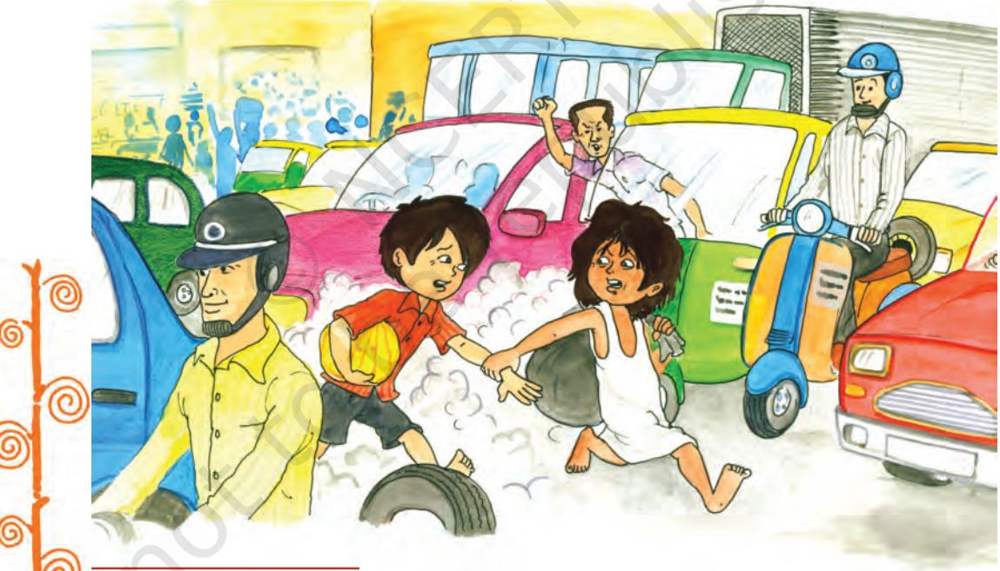
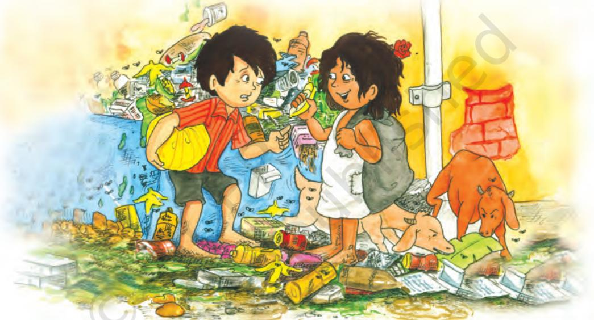
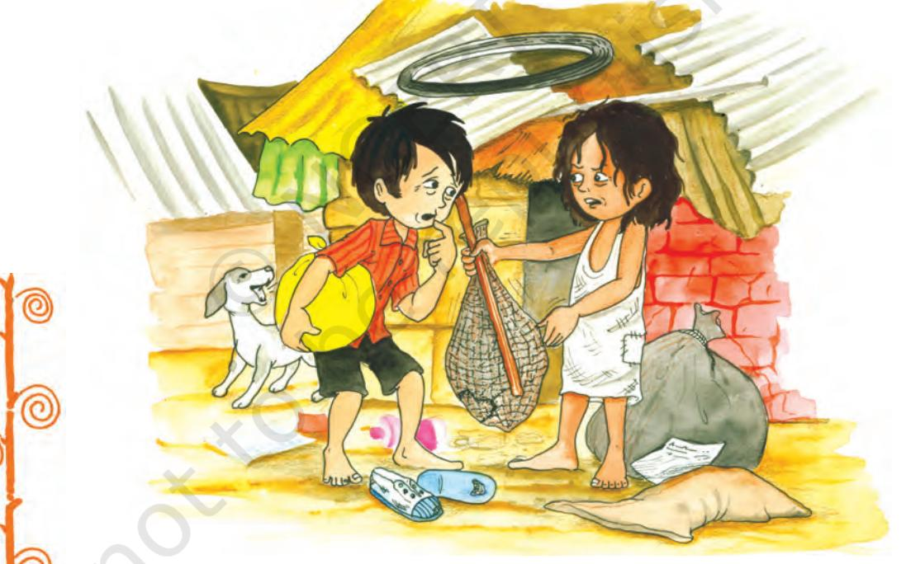
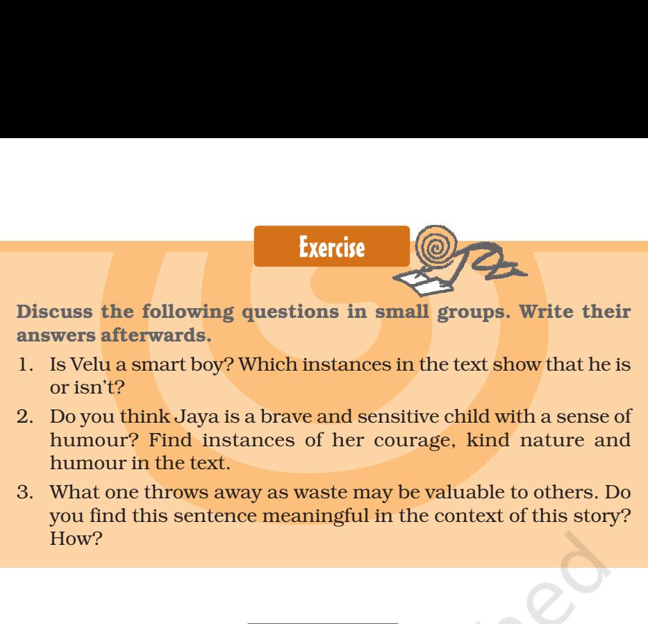

# 2 Children at work

#### Before you read

*There are many reasons why children have to work. Some help their family make a livelihood. Others, who run away from unhappy homes, need to support themselves. Children who have to work can't go to school and play like other children of their age.*

## I

- *•* Velu, an eleven-year old boy, runs away from home.
- *•* He wanders around for hours before getting on a train to Chennai without a ticket.
- *•* Tired and hungry, he doesn't know where to go when a stranger at the station shouts a word of welcome.

WHEN the Kanyakumari Express pulled in at Chennai Central, it took Velu some time to get off. When he finally stood on the platform, his legs felt wobbly, as if he was still on a moving train.

"Oy, out of the way!" A porter went by with a loaded trolley. Velu jumped aside.

He sat on a bench on the platform, putting his small bundle down. In all his eleven years, he had never seen so many people, except once a year at the fair in his village. People walked by, bumping into him with their suitcases. A voice announced something on a loudspeaker. Near him a group of people sat on

pulled in: arrived wobbly: unsteady

their luggage, looking at a TV hanging from the roof. The noise was terrible.

Velu put his head down on his knees, feeling miserable and exhausted. He had run away from his village two days ago. For two days he had eaten nothing but some peanuts and a piece of jaggery. In his bundle he carried a shirt, a towel and a comb.

He had walked for most of the first day to Kanur and then got on the train to Chennai. Velu had no money for a ticket but luckily the ticket collector didn't come to the unreserved compartment. He had tried to sleep on the floor near the door. A group of men next to him had played cards and shouted all night.

"*Aiy*! What, new to town eh?" called out a rough voice.

Velu opened his eyes. There were a lot of people standing around, but nobody was looking at him.

"Here! *Aiy*!"

He turned around. Behind him was a girl around his own age, wearing a long *banian* that came down to her knees. Her hair was stiff and brownish and she had a huge sack on one shoulder. She was picking up dirty plastic cups from the floor and stuffing them

into her sack. Why is she calling me, thought Velu. And why is a girl wearing a *banian*?

"No need to stare stupidly. What's your name?"

"Velu," muttered Velu, looking away.

"So Mr Velu," said the girl, looking at his bundle. "Run away from home?"

Velu didn't answer. He didn't want to tell some strange girl what he had done. He had run away because he couldn't stand his father beating him for one more day. His father would snatch away all the money Velu and his sisters earned and spend it on drink.

"Don't think I don't know. This place is full of children like you. So what are you going to do here? Become rich?"

She sat down next to him. Velu shifted away slightly.

He felt hunger pinching him and pressed his stomach with a grimace. "Hungry?" asked the girl. "You won't get food by sitting here glumly, making faces. I can find some if you want."

She picked up her sack and started to walk away. Velu stayed on the bench. What should he do? Should he follow this girl? Where was she going to take him? She was disappearing into the crowd, so he had to make up his mind quickly. Alright, he decided. Anyway I have no idea where to go. He jumped up and ran after her. She wasn't even looking back to see where he was.

## Comprehension Check

- *1. Velu stood on the platform but he felt "as if he was still on a moving train". Why?*
- *2. What made him feel miserable?*
- *3. (i) Velu travelled without a ticket. Why? (ii) How did he escape the ticket collector's attention?*
- *4. Why had Velu run away from home?*
- *5. Why did he decide to follow the 'strange' girl?*

grimace: twisted expression (on the face) due to pain glumly: sadly/gloomily

Children at work 9

- *•* Velu follows his friend through the crowded streets to a big building.
- *•* Behind the building, there is a big garbage bin.
- *•* Velu wonders why they are there at all.

He caught up with the girl as she was leaving the station. When they got to the road, Velu found that the vehicles kept coming and never stopped for anyone. Smoke and dust flew at him from all sides, making his head spin. They had to wait for a long time before they could find a gap to run through. Velu kept hesitating and the girl finally dragged him to the other side.

"What do you think you're doing? Grazing cows? If you stand around in the middle of the road like that, you'll be *chutney*."

Velu's heart was still beating fast. He looked back at Central Station and the traffic speeding by. How had they managed to come through that? They walked along the side of the road under some

making his head spin: giving him a headache/making him feel dizzy *chutney*: (here) run over/killed; crushed and ground into *chutney*

10 It so happened...

huge signboards. Velu looked up at the pictures: *banians*, car tyres, pens, a woman holding a box. The writing was all in English, so he didn't know what it meant.

The girl turned onto a wide bridge and walked up. Velu stopped and peeped over the railing. Under him, the road ran into the city. In the distance he could see huge buildings and towers and more roads.

"See that big building with the wall around it? If you're not careful, you'll soon be counting bars there." The girl grinned and pointed at a huge building.

Velu squinted and read the Tamil sign, *Central Jail*.

"Why? I haven't done anything wrong."

"You don't have to do anything. Just don't get caught, that's all."

What does she mean, Velu wondered. Meanwhile the girl was already heading down the bridge with the sack on her shoulder. What was in it? He had seen her putting plastic cups into it at the station.

"What are you carrying in that bag?"

"Things. Bottles, paper."

Velu wondered what she was doing with them, but he felt shy to ask any more questions.

It was still morning but the sun blasted down on the tar and Velu's bare feet burned. It was not like walking on a mud road. He was soaked with sweat. He tried hard to walk in the shade and keep up with the girl at the same time. She walked really fast. How far away was the food?

After almost an hour of walking, they stopped in front of a big building. *Sri Rajarajeshwari Prasanna Kalyana Mandapam* read Velu slowly. A sign with letters made of flowers said, *Groom: J. V. Vinayagan, Bride: Rani*. Velu stared at the big cars parked outside. One of the cars had a flower garland and roses taped onto it. The girl looked around, pulled one off quickly and stuck it in her hair.

"Come on," she said.

"Are we going to eat here?" asked Velu, looking at the huge hall and the people inside.

Children at work 11

"Hopes!" said the girl shaking her thumb under his nose. She led him behind the hall. There was a big garbage bin overflowing with rubbish. Two goats were standing on the pile, fighting for a banana leaf. A cloud of flies buzzed around their legs. There was a rotten smell in the air. The girl picked up a squashy banana and held it out to Velu.

"Here's your food."

Velu was shocked. "Are we going to eat their leftovers?"

"*Chey*! What do you think I am? A dog? I only take untouched food. Here, some more, catch!" She threw him a *vada*. Velu looked at it with distaste.

"Come on, hero, eat it! You think I like it? I told you I'll find you something to eat. Don't think I have money to buy food for you. You'd better eat what you get until you have your own money."

Velu hesitated, but his stomach squeezed him again. He gulped down the banana and *vada*. His stomach felt better immediately. He could have eaten at least ten times more, but the girl could find only one more banana which she ate herself.

squashy: crushed stomach squeezed him: he was very hungry; his stomach, which was empty, twiched and pained gulped down: swallowed quickly (without chewing)

12 It so happened...

"It's too early, they've only eaten tiffin. If you're still hungry, you'll have to wait for them to finish lunch. You can wait if you want. I have to work, I'm going." She picked up a couple of bottles from the heap and threw it into her sack. Then she walked off.

Velu panicked. He realised that if the girl left him, he had no idea where he was and what to do. It was better to stick to her, she seemed to know her way around. He ran after her again.

"*Aiy*!" he called. He did not even know the girl's name. "*Aiy*, what is your name?" he asked hurrying behind her.

She stopped and turned around. "Oho! So you've been following me around without even knowing my name. Jaya."

"I'm not following you."

"What then? Who got you food?"

"Can I come with you? Where are you going?"

"Come if you want. This bag is full, I have to go home to get another one."

#### Comprehension Check

- *1. Can Velu read Tamil and English? How do you know?*
- *2. "If you are not careful, you will soon be counting bars there," the girl said. (i) What is she referring to?*
	- *(ii) What does she mean when she says "If you are not careful..."? (She says something a little later which means the same. Find that sentence.)*
- *3. (i) Where did the girl lead Velu to?*
	- *(ii) What did they get to eat?*
- *4. What work did she do? Think of a one-word answer.*

# III

- *•* There is a row of huts near some dirty puddles.
- *•* Outside one of the huts, Jaya dumps her sack.
- *•* Grateful to his friend, Velu thinks of the days ahead.

Jaya and Velu walked along the roads for half an hour, until they came to a bridge across a dirty trickle of water. "We are in Triplicane now. See, that's Buckingham Canal," said Jaya.

tiffin: snack (not a proper meal) panicked: was very worried

Children at work 13

Velu stared. This was a canal? Near some puddles of water was a row of the strangest huts he had ever seen. They were built out of all sorts of things — metal sheets, tyres, bricks, wood and plastic. They stood crookedly and looked as if they would fall any moment.

"Is this where you live? These houses are strange!" said Velu. "In our village, the houses are made of mud and palm leaves."

Jaya went around to one of the huts and dumped her sack outside. Then she picked up an empty one.

"Let's go."

 She turned to Velu and gave him a shove. "At least help me now. Here, wear these and come with me."

She threw him a pair of old shoes without laces and pushed a sack and a stick into his hands. Velu was confused. What work did she want him to do with these things? The only work he had ever done was on the landowner's farm, weeding and taking cows out to graze.

"Are there any farms in the city?" he asked Jaya.

crookedly: not straight shove: push weeding: working in a field removing grass/ digging, etc

14 It so happened...

She laughed and thumped her stick on the ground. "Farms! There are no farmers here. We are ragpickers."

"Ragpickers?"

"See my sack? Full of things I collected."

"Collected? From where?" asked Velu.

"From rubbish bins, where else?"

"You collect rubbish?" Velu had never heard of such a thing

"*Ayye*, blockhead. It's not any rubbish. Only paper, plastic, glass,

such things. We sell it to Jam Bazaar Jaggu."

Velu was puzzled. He had heard of people throwing away rubbish. But why would anyone want to buy rubbish?

"Who's Jam Bazaar Jaggu? Why's he buying all this?"

"You think he buys it for show? He sells it to a factory. Come on, I don't have time to waste, like you."

Velu did not move. He hadn't run away and come to this new place to dig through garbage bins. Jaya poked at him with her stick.

"Look here!" she shouted. "If someone gets there before us we don't get anything. Don't just stand there, posing. Big hero. I'm trying to help you. Who filled your stomach today?"

Velu scratched his head and sighed. I'll do it for now, he thought, until I find a better job.

> GITA WOLF ANUSHKA RAVISHANKAR ORIJIT SEN From *Trash — on Ragpicker Children and Recycling*

#### Comprehension Check

- *1. (i) What material are the 'strange' huts made out of? (ii) Why does Velu find them strange?*
- *2. What sort of things did Jaya and children like her collect and what did they do with those things?*
- *3. Is Velu happy or unhappy to find work? Give a reason for your answer.*

blockhead: fool posing: looking important, hoping to impress others

Children at work 15

- J3. What one throws away as waste may be valuable to others. Do you find this sentence meaningful in the context of this story? How?
humour in the text.

# Think it Over

JJ• The best investment that a country can make is to put milk into its children.

 • People don't notice goodness because it is transparent like water and air; only if it runs out does it become noticeable.

• It is never too late to have a happy childhood.

Is it someone you know? J J J J J J J J J J J J J J J

J

J

J

J

J

J

J

J

J

J

J

J

J

A busy official known for his love of animals was once passing through a village in a cart. Suddenly he asked the cartman to stop and tried to listen to what sounded like a wail from far away. The cartman asked, "Is it a man you know?" The official replied, "No, it's a dog I don't know."

J J J J J J J J J J J J J J J J J J J J J J J J J J J J

16 It so happened...

