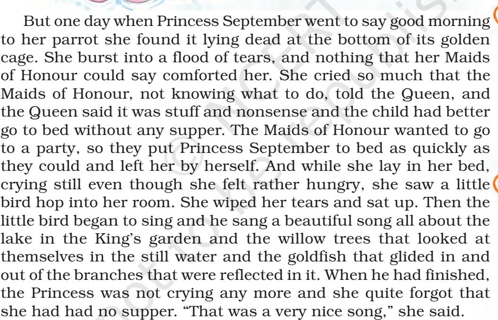
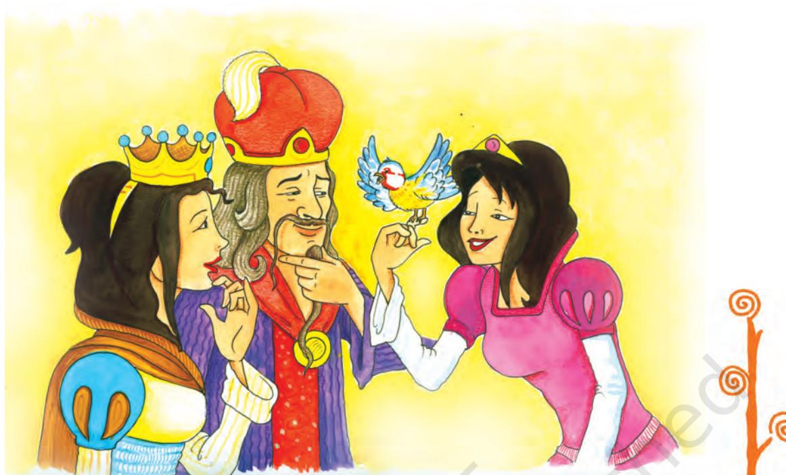
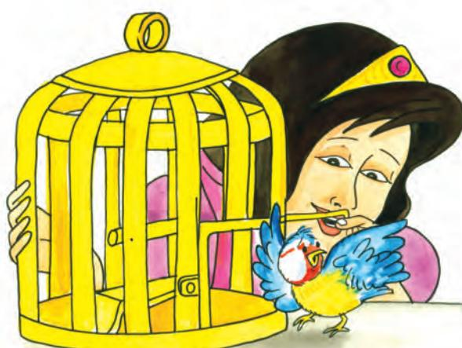
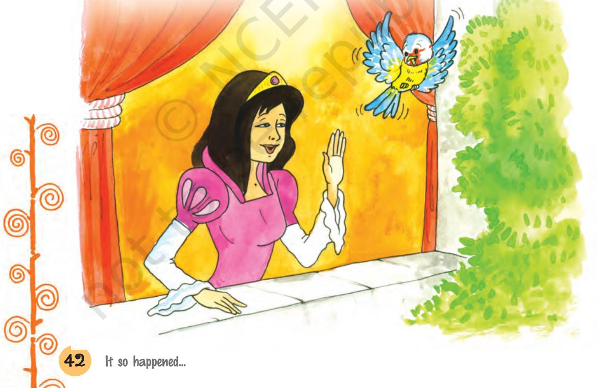

- I
- *Princess September, like each one of her numerous sisters, receives the gift of a parrot in a golden cage on her father's birthday.*
- *The parrot dies, and by chance a singing bird comes in its place.*
- *The princess shows off her pet to the sisters who advise her to put it in a cage.*

THE King and Queen of Siam had many daughters, and the Queen said that it confused her to have to remember so many names. One day the King decided to call them January, February, March (though of course in Siamese) till he came to the youngest whom he called September.

The King of Siam had a peculiar habit. Instead of receiving gifts on his birthday he gave them. One year on his birthday, not having anything else handy, he gave each of his daughters a green parrot in a golden cage. The princesses were very proud of their parrots and they spent an hour every day in teaching them to talk. Presently all the parrots could say 'God save the king' and some of them could say 'Pretty Polly' in no less than seven Oriental languages.

Siam: now Thailand handy: immediately available Oriental: of the east (the Orient means countries of the Far East. Its opposite is the Occident.);

Maids of Honour: women attending the Princess

Princess September 35

The little bird gave her a bow. "Would you care to have me in place of your parrot?" said the little bird. "It's true that I'm not so pretty to look at, but on the other hand I have a much better voice." Princess September clapped her hands with delight and then the little bird hopped on to the end of her bed and sang her to sleep.

When she awoke next day the little bird was still there, and as she opened her eyes he said, "Good morning!" The Maids of Honour brought in her breakfast, and he ate rice out of her hand and he had his bath in her saucer. He began to sing again so beautifully that the Maids of Honour were quite surprised, for they had never heard anything like it, and Princess September was very proud and happy.

"Now I want to show you to my eight sisters," said the Princess.

She stretched out the first finger of her right hand so that it served as a perch and the little bird flew down and sat on it. Then, followed by her Maids of Honour, she went through the palace and called on each of the Princesses. And for each of them the little bird sang a different song. But the parrots could only say 'God save the king' and 'Pretty Polly'. At last she showed the little bird to the King and the Queen. They were surprised and delighted.

"I knew I was right to send you to bed without any supper," said the Queen.

"This bird sings much better than the parrots," said the King.

"I should have thought you got quite tired of hearing people say 'God save the king'," said the Queen. "I can't think why those girls wanted to teach their parrots to say it too."

"The sentiment is admirable," said the King, "and I never mind how often I hear it. But I do get tired of hearing those parrots say 'Pretty Polly'."

"They say it in seven different languages," said the Princesses.

"I dare say they do," said the King, "but it reminds me too much of my Councillors. They say the same thing in seven different ways and it never means anything in any way they say it."

- perch: place where a bird sits or rests I dare say: I agree/accept (that it is true)
36 It so happened...

The Princesses were vexed at this, and the parrots looked very glum indeed. But Princess September ran through all the rooms of the palace, singing like a lark, while the little bird flew round and round her singing like a nightingale.

Things went on like this for several days and then the eight Princesses put their heads together. They went to September and sat down in a circle round her. "My poor September," they said, "we are sorry for the death of your beautiful parrot. It must be dreadful for you not to have a pet bird as we have. So we have all put our pocket-money together and we are going to buy you a lovely green and yellow parrot."

''Thank you for nothing," said September. "I have a pet bird which sings the most charming songs to me and I don't know what on earth I should do with a green and yellow parrot."

"Well, my dear," they said, "it's absurd to talk of your bird when the little fellow flies in and out just as he likes." They looked round the room and raised their eyebrows.

Princess September 37

vexed: distressed; worried glum: sad put their heads together: discussed amongst themselves to take a decision

"Do you mind our asking where your bird is now?" they said.

"He has gone to pay a visit to his father-in-law," said Princess September.

"And what makes you think he'll come back?" asked the Princesses. "He always does come back," said September.

"Well, my dear," said the eight Princesses, "if you'll take our advice you won't run any risks like that. If he comes back, and mind you, if he does you'll be lucky, pop him into the cage and keep him there. That's the only way you can be sure of him."

"But I like to have him fly about the room," said the young Princess September.

"Safety first," said her sisters ominously.

They got up and walked out of the room, shaking their heads, and they left September very uneasy.

## Comprehension Check

- *1. How many daughters did the royal couple have?*
- *2. Why were they named after the months of the year?*
- *3. The King had a peculiar habit. What was it? Why is it called peculiar?*
- *4. (i) What was Princess September's reaction to the loss of her parrot?*
	- *(ii) What was her mother's reaction to it?*
	- *(iii) What do the reactions indicate about the nature and temperament of each?*
- *5. What pulled the Princess out of her gloom?*
- *6. How did the Maids of Honour come to know that the Princess and the bird had become intimate friends?*
- *7. The new bird was full of new songs but the old parrots always repeated themselves. What did they say?*
- *8. What is the King's opinion about his Councillors? Why did he form that opinion?*
- *9. (i) The eight Princesses made an offer to Princess September. What was it?*

*(ii) Why, in your view, did they do it?*

- *10. What did the sisters advise the Princess to do about her bird?*
pop: put; push ominously: threateningly – suggesting that something bad was about to happen

38 It so happened...

- *Princess September loves the bird far too much to take chances, and acts upon her sisters' advice.*
- *The bird cannot overcome the loss of freedom.*
- *Princess September decides to put the bird's happiness above her own.*

It seemed to Princess September that her little bird had been away a long time. Something might have happened to him. What with hawks and with snares you never knew what trouble he might get into. Besides, he might forget her, or he might take a fancy to

somebody else. That would be dreadful. She wished he were safely back again.

Suddenly September heard a 'tweet-tweet' just behind her ear and she saw the little bird sitting on her shoulder. He had come in so quietly and alighted so softly that she had not heard him.

"I wondered what on earth had become of you," said the Princess.

"I thought you'd wonder that," said the little bird. "The fact is I very nearly didn't come back tonight at all. My father-in-law was giving a party and they all wanted me to stay, but I thought you'd be anxious."

Under the circumstances this was a very unfortunate remark for the little bird to make.

September felt her heart go thump against her chest, and she made up her mind to take no more risks. She put up her hand and took

snares: traps for catching birds or animals alighted: came down

Princess September 39

hold of the bird. The bird suspected nothing and he was so surprised when she carried him over to the cage, popped him in, and shut the door on him that for a moment he could think of nothing to say. But in a moment or two he hopped up to the ivory perch and said, "What is the joke?"

''There's no joke," said

September, "but some of mamma's cats are prowling about tonight, and I think you're much safer in there."

"Well, just for this once I don't mind," said the little bird, "so long as you let me out in the morning."

He ate a very good supper and then began to sing. But in the middle of his song he stopped.

"I don't know what is the matter with me," he said, "but I don't feel like singing tonight."

"Very well," said September, "go to sleep instead."

So he put his head under his wing and in a minute was fast asleep. September went to sleep too. But when the dawn broke she was awakened by the little bird calling her at the top of his voice.

"Wake up, wake up," he said. "Open the door of this cage and let me out. I want to have a good fly while the dew is still on the ground."

"You are much better off where you are," said September.

"Let me out, let me out," said the little bird. And he tried to slip through the bars of the cage, but of course couldn't, and he beat against the door, but of course he couldn't open it. Then the eight Princesses came in and looked at him. They told September she was very wise to take their advice. They said he would soon get used to the cage and in a few days would quite forget he had ever been free. The little bird said nothing at all while they were there, but as soon as they were gone he began to cry again: "Let me out, let me out."

prowling: moving about quietly

40 It so happened...

"Don't be such an old silly," said September. "I've put you in the cage because I'm so fond of you. I know what's good for you much better than you do yourself. Sing me a little song and I'll give you a piece of sugar."

But the little bird stood in the corner of his cage looking out at the blue sky, and never sang a note.

"What's the good of sulking?" said September. "Why don't you sing and forget your troubles?"

"How can I sing?" answered the bird. "I want to see the trees and the lake and the green rice growing in the fields."

"I'll take you out every day," she said.

"It's not the same thing," said the little bird. "The rice-fields and the lake and the willow trees look quite different when you see them through the bars of a cage."

The bird wouldn't sing a song and he wouldn't eat a thing. The Princess was a little anxious at this, and asked her sisters what they thought about it.

"You must be firm," they said.

"But if he won't eat, he'll die," she answered.

"That would be very ungrateful of him," they said. "He must know that you're only thinking of his own good. If he's obstinate and dies it'll serve him right and you'll be well rid of him."

September didn't see how that was going to do *her* very much good,

but they were eight to one and all older than she, so she said nothing.

"Perhaps he'll have got used to his cage by tomorrow," she said.

And next day when she awoke she cried out good morning in a cheerful voice. She got no answer. She jumped out of bed and ran to the cage. She gave a startled cry, for there the little bird lay,

at the bottom, on his side, with his eyes closed, and he looked as if he were dead. She opened the door and putting her hand in lifted him out. She gave a sob of relief, for she felt that his little heart was beating still.

"Wake up, wake up, little bird," she said.

She began to cry and her tears fell on the little bird. He opened his eyes and saw that the bars of the cage were no longer around him.

"I cannot sing unless I'm free, and if I cannot sing I die," he said. The Princess gave a great sob.

''Then take your freedom," she said. "I shut you in a golden cage because I loved you and wanted to have you all to myself. But I never knew it would kill you. I love you enough to let you be happy in your own way."

She threw open the window and gently placed the little bird on the sill. He shook himself a little.

"Come and go as you will, little bird," she said. "I will never put you in a cage any more."

"I will come because I love you, little Princess," said the bird. "And I will sing you the loveliest songs I know. I shall go far away, but I

shall always come back and I shall never forget you." He gave himself another shake. "Good gracious me, how stiff I am," he exclaimed.

Then he opened his wings and flew right away into the blue. But the little Princess burst into tears, for it is very difficult to put the happiness of someone you love before your own, and with her little bird far out of sight she felt, all of a sudden, very lonely. When her sisters knew what had happened they mocked her and said that the little bird would never return. But he did, at last. And he sat on September's shoulder and ate out of her hand and sang her the beautiful songs he had learned while he was flying up and down the fair places of the world. September kept her window open day and night so that the little bird might come into her room whenever he felt inclined, and this was very good for her; so she grew extremely beautiful.

 And when she was old enough she married the King of Cambodia and was carried on a white elephant all the way to the city in which the King lived. But her sisters never slept with their windows open, so they grew extremely ugly as well as disagreeable, and when the time came to marry them off they were given away to the King's Councillors with a pound of tea and a Siamese cat.

> SOMERSET MAUGHAM [slightly abridged]

## Comprehension Check

- *1. In the following sentence elaborate the parts given in bold. Under the circumstances it was a very unfortunate remark for the bird to make.*
- *2. (i) What did Princess September do to ensure the safety of her pet? (ii) How did the bird react to it?*
- *3. Why did the bird refuse to be taken out in her cage?*
- *4. (i) What persuaded Princess September to give the bird his freedom again? (ii) How did the bird react to it?*
- *5. Princess September kept her window open day and night.*
	- *(i) How did it help the bird?*
	- *(ii) How did it help the Princess herself?*
- *6. The eight sisters kept their windows shut. How did it affect them?*

disagreeable: unpleasant

Princess September 43

Discuss the following questions in small groups. Write their answers later.

- J1. Are the sisters unkind and cruel? Find evidence in the text to support your idea.
	- 2. Which, to you, is the most important idea in this story, and why?
		- (i) importance of music
		- (ii) value of freedom
		- (iii) beauty of nature

## Think it Over

- J• There are two ways to study butterflies: chase them with nets then inspect their dead bodies, or sit quietly in a garden and watch them dance among the flowers.
- Freedom practises its own logic. It puts a bouquet of rights in your right hand and a basket of duties in your left hand. This is merely to help you walk straight.
- JJ• To be free is to be disciplined. Who knew it better than a young enthusiast walking down the road swinging his arms wildly. When he accidentally hit an old gentleman on the tip of his nose, the man asked "What do you think you are doing?"

"I'm sorry", said the enthusiast, "but it's a free country. I am swinging my arms."

"Remember," advised the old man, "your freedom ends where my nose begins."

44 It so happened...

