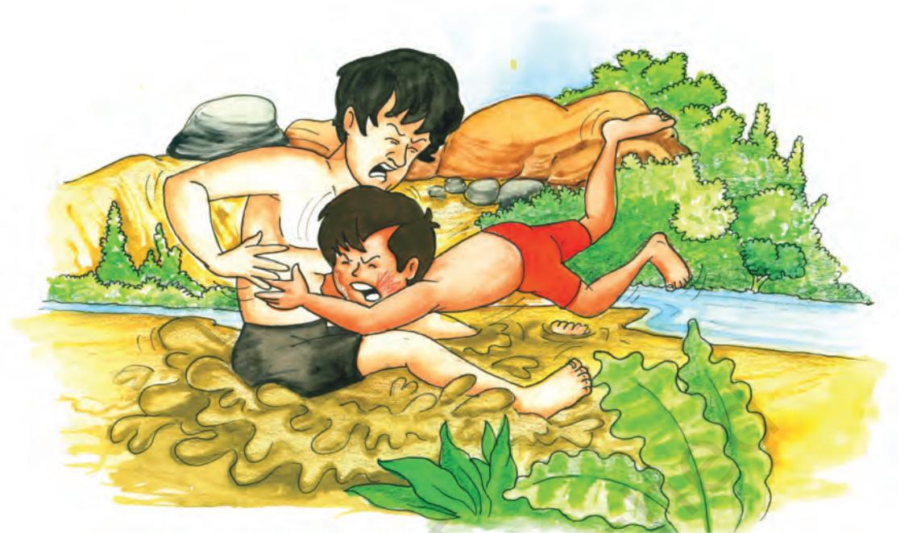
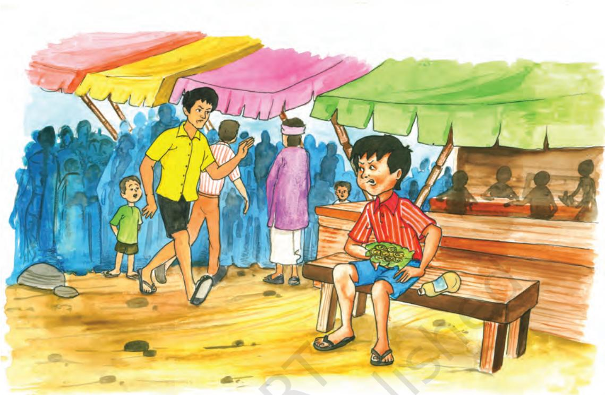

6 The fight

- I
- *•* Ranji discovers a pool in the forest and plunges into it for a swim.
- *•* There is serious trouble between him and someone else over who has a right to the pool. A fight ensues.
- *•* The first round ends in a draw.

RANJI had been less than a month in Rajpur when he discovered the pool in the forest. It was the height of summer, and his school had not yet opened, and, having as yet made no friends in this semi-hill station, he wandered about a good deal by himself into the hills and forests that stretched away interminably on all sides of the town. It was hot, very hot, at that time of the year, and Ranji walked about in his vest and shorts, his brown feet white with the chalky dust that flew up from the ground. The earth was parched, the grass brown, the trees listless, hardly stirring, waiting for a cool wind or a refreshing shower of rain.

It was on such a day — a hot, tired day — that Ranji found the pool in the forest. The water had a gentle translucency, and you could see the smooth round pebbles at the bottom of the pool. A small stream emerged from a cluster of rocks to feed the pool. During the monsoon, this stream would be a gushing torrent, cascading down from the hills, but during the summer, it was barely a trickle.

interminably: endlessly parched: hot and dry translucency: clarity (possible to see through) torrent: rushing stream (of water) cascading: coming down (like a waterfall) trickle: weak or thin flow of water.

The rocks, however, held the water in the pool, and it did not dry up like the pools in the plains.

When Ranji saw the pool, he did not hesitate to get into it. He had often gone swimming, alone or with friends, when he had lived with his parents in a thirsty town in the middle of the Rajputana desert. There, he had known only sticky, muddy pools, where buffaloes wallowed and women washed clothes. He had never seen a pool like this — so clean and cold and inviting. He leapt into the water. His limbs were supple, free of any fat, and his dark body glistened in patches of sunlit water.

The next day he came again to quench his body in the cool waters of the forest pool. He was there for almost an hour sliding in and out of the limpid green water, or lying stretched out on the smooth yellow rocks in the shade of broad-leaved sal trees. It was while he lay thus that he noticed another boy standing a little distance away, staring at him in a rather hostile manner. The other boy was a little older than Ranji — taller, thickset, with a broad nose and thick, red lips. He had only just noticed Ranji, and when Ranji did not say anything, the other called out, "What are you

doing here, Mister?*"*

Ranji, who was prepared to be friendly, was taken aback at the hostility of the other's tone.

"I am swimming," he replied. "Why don't you join me?"

"I always swim alone," said the other. "This is my pool; I did not invite you here."

The stranger strode up to Ranji, who still sat on

wallowed: rolled about (in mud or dirty water) quench: cool (his body) thickset: stout/ solidly built taken aback: surprised hostility: ill will/enmity

46 It so happened...

the rock and, planting his broad feet firmly on the sand, said (as though this would settle the matter once and for all), "Don't you know I am a Warrior? I do not take replies from villagers like you!"

"So you like to fight with villagers?" said Ranji. "Well, I am not a villager. I am a Fighter!"

"I am a Warrior!"

"I am a Fighter!"

They had reached an impasse. One had said he was a Warrior, the other had proclaimed himself a Fighter. There was little else that could be said.

"You understand that I am a Warrior?" said the stranger, feeling that perhaps this information had not penetrated Ranji's head.

"I have heard you say it three times," replied Ranji.

"Then why are you not running away?"

"I am waiting for you to run away!"

"I will have to beat you," said the stranger, assuming a violent attitude, showing Ranji the palm of his hand.

"I am waiting to see you do it," said Ranji.

"You will see me do it," said the other boy.

Ranji waited. The other boy made a strange, hissing sound. They stared each other in the eye for almost a minute. Then the Warrior slapped Ranji across the face with all the force he could muster. Ranji staggered, feeling quite dizzy. There were thick red finger marks on his cheek.

"There you are!" exclaimed his assailant. "Will you be off now?"

For answer, Ranji swung his arm up and pushed a hard, bony fist into the other's face.

And then they were at each other's throats, swaying on the rock, tumbling on to the sand, rolling over and over, their legs and arms locked in a desperate, violent struggle. Gasping and cursing, clawing and slapping, they rolled into the shallows of the pool.

Even in the water the fight continued as, spluttering and covered with mud, they groped for each other's head and throat. But after

impasse: (also pronounced *ampass*) deadlock; place or position from which there is no way out penetrated: gone through/into muster: (*here*) use; collect or gather staggered: felt weak/unsteady (due to the blow) assailant: the person who attacks; (here) enemy/ adversary swaying: moving from side to side (in the fight) spluttering: speaking quickly/confusedly

The fight 47

five minutes of frenzied, unscientific struggle, neither boy had emerged victorious. Their bodies heaving with exhaustion, they stood back from each other, making tremendous efforts to speak.

"Now — now do you realise — I am a Warrior?" gasped the stranger.

"Do you know I am a Fighter?" said Ranji with difficulty.

They gave a moment's consideration to each other's answers and, in that moment of silence, there was only their heavy breathing and the rapid beating of their hearts.

"Then you will not leave the pool?" said the warrior.

"I will not leave it," said Ranji.

"Then we shall have to continue the fight," said the other.

"All right," said Ranji.

But neither boy moved, neither took the initiative.

The warrior had an inspiration.

"We will continue the fight tomorrow," he said. "If you dare to

frenzied: violent exhaustion: tiredness/fatigue tremendous: great rapid: quick/fast inspiration: (here) a new idea.

48 It so happened...

come here again tomorrow, we will continue this fight, and I will not show you mercy as I have done today."

"I will come tomorrow," said Ranji. "I will be ready for you."

They turned from each other then and, going to their respective rocks, put on their clothes, and left the forest by different routes.

## Comprehension Check

- *1. In what way is the forest pool different from the one which Ranji knew in the Rajputana desert?*
- *2. The other boy asked Ranji to 'explain' himself.*
	- *(i) What did he expect Ranji to say?*
	- *(ii) Was he, in your opinion, right or wrong to ask this question?*
- *3. Between Ranji and the other boy, who is trying to start a quarrel? Give a reason for your answer.*
- *4. "Then we will have to continue the fight," said the other.*
	- *(i) What made him say that?*
	- *(ii) Did the fight continue? If not, why not?*

## II

- *•* Next day the two claimants face each other across the pool.
- *•* They throw challenges and counter-challenges at each other.
- *•* The best solution, they realise, lies not in fighting each other but fighting together for something.

When Ranji got home, he found it difficult to explain the cuts and bruises that showed on his face, leg and arms. It was difficult to conceal the fact that he had been in an unusually violent fight, and his mother insisted on his staying at home for the rest of the day. That evening, though, he slipped out of the house and went to the bazaar, where he found comfort and solace in a bottle of vividly coloured lemonade and a banana leaf full of hot, sweet *jalebis*. He had just finished the lemonade when he saw his adversary coming down the road. His first impulse was to turn away and look elsewhere, his second to throw the lemonade bottle at his enemy. But he did neither of

The fight 49

these things. Instead, he stood his ground and scowled at his passing adversary. And the warrior said nothing either but scowled back with equal ferocity.

The next day was as hot as the previous one. Ranji felt weak and lazy and not at all eager for a fight. His body was stiff and sore after the previous day's encounter. But he could not refuse the challenge. Not to turn up at the pool would be an acknowledgement of defeat. From the way he felt just then he knew he would be beaten in another fight. But he could not acquiesce in his own defeat. He must defy his enemy to the last, or outwit him, for only then could he gain his respect. If he surrendered now, he would be beaten for all time; but to fight and be beaten today left him free to fight and be beaten again. As long as he fought, he had a right to the pool in the forest.

50 It so happened...

scowled: looked angrily adversary: opponent/enemy ferocity: fierceness (suggesting anger/cruelty) acquiesce: accept quietly

He was half hoping that the warrior would have forgotten the challenge, but these hopes were dashed when he saw his opponent sitting, stripped to the waist, on a rock on the other side of the pool. The warrior was rubbing oil on his body. He saw Ranji beneath the sal trees, and called a challenge across the waters of the pool.

"Come over on this side and fight!" he shouted.

But Ranji was not going to submit to any conditions laid down by his opponent.

"Come this side and fight!" he shouted back with equal vigour.

"Swim across and fight me here!" called the other. "Or perhaps you cannot swim the length of this pool?"

But Ranji could have swum the length of the pool a dozen times without tiring, and here he would show the warrior his superiority. So, slipping out of his vest, he dived straight into the water, cutting through it like a knife, and surfaced with hardly a splash. The warrior's mouth hung open in amazement.

"You can dive!" he exclaimed.

"It is easy," said Ranji, treading water, waiting for a further challenge. "Can't you dive?"

"No," said the other. "I jump straight in. But if you will tell me how, I will make a dive."

"It is easy," said Ranji. "Stand on the rock, stretch your arms out and allow your head to displace your feet."

The warrior stood up, stiff and straight, stretched out his arms, and threw himself into the water. He landed flat on his belly, with a crash that sent the birds screaming out of the trees.

Ranji dissolved into laughter.

vigour: strength treading water: keeping oneself upright in deep water by moving the feet

The fight 51

"Are you trying to empty the pool?" he asked, as the warrior came to the surface, spouting water like a small whale.

"Wasn't it good?" asked the boy, evidently proud of his feat.

"Not very good," said Ranji. "You should have more practice. See, I will do it again."

And pulling himself up on a rock, he executed another perfect dive. The other boy waited for him to come up, but, swimming under water, Ranji circled him and came upon him from behind.

"How did you do that?" asked the astonished youth.

"Can't you swim under water?" asked Ranji.

"No, but I will try it."

The warrior made a tremendous effort to plunge to the bottom of the pool and indeed he thought he had gone right down, though his bottom, like a duck's, remained above surface.

Ranji, however, did not discourage him.

"It was not bad," he said. "But you need a lot of practice."

"Will you teach me?" asked his enemy.

"If you like, I will teach you."

"You must teach me. If you do not teach me, I will beat you. Will you come here every day and teach me?"

 "If you like," said Ranji. They had pulled themselves out of the water, and were sitting side by side on a smooth grey rock.

"My name is Suraj,*"* said the warrior. *"*What is yours?*"*

"It is Ranji."

*"*I am strong, am I not?*"* asked Suraj, bending his arm so that a ball of muscle stood up stretching the white of his flesh.*"*

*"*You are strong," said Ranji. "You are a real *pahelwan*."

"One day I will be the world's champion wrestler," said Suraj, slapping his thighs, which shook with the impact of his hand. He looked critically at Ranji's hard, thin body. "You are quite strong yourself," he conceded. "But you are too bony. I know, you people do not eat enough. You must come and have your food with me. I drink one seer of milk every day. We have got our own cow! Be my

52 It so happened...

feat: clever act; special skill plunge: jump conceded: admitted seer: same as *ser*, a unit of weight used previously in India. A *ser*, a little less than a litre, was one-fortieth of a maund.

friend, and I will make you a *pahelwan* like me! I know — if you teach me to dive and swim underwater, I will make you a *pahelwan*! That is fair, isn't it?"

"That is fair!" said Ranji, though he doubted if he was getting the better of the exchange.

Suraj put his arm around the younger boy and said, "We are friends now, yes?"

They looked at each other with honest, unflinching eyes, and in that moment love and understanding were born.

"We are friends," said Ranji.

The birds had settled again in their branches, and the pool was quiet and limpid in the shade of the sal trees.

"It is our pool," said Suraj. "Nobody else can come here without our permission. Who would dare?"

"Who would dare?" said Ranji, smiling with the knowledge that he had won the day.

RUSKIN BOND

## Comprehension Check

- *1. What is it that Ranji finds difficult to explain at home?*
- *2. Ranji sees his adversary in the bazaar.*
	- *(i) What does he wish to do?*
	- *(ii) What does he actually do, and why?*
- *3. Ranji is not at all eager for a second fight. Why does he go back to the pool, then?*

unflinching: (without blinking) looking straight at each other limpid: clear

The fight 53

- *4. Who was the better swimmer? How do you know it?*
- *5. What surprises the warrior?*
- *6. Now that they are at the pool, why don't they continue the fight?*
- J*7. Ranji's superiority over the other boy is obvious in the following: physical strength, good diving, his being a fighter, sense of humour, swimming under water, making a good point, willingness to help*

*Underline the relevant phrases.*

- *8. What, according to you, makes the two adversaries turn into good friends in a matter of minutes? Explain it as you have understood it.*
Exercise

Discuss the following topics in small groups.

- 1. Is fighting the only way of resolving differences of opinion? What else can be done to reach a mutually acceptable settlement?
- 2. Have you ever been in a serious fight only to realise later that it was unnecessary and futile? Share your experience/views with others frankly and honestly.
- J3. Why do some of us find it necessary to prove that we are better than others? Will you be amused or annoyed to read the following sign at the back of the car in front of you?

I may be going slow but I am ahead of you.

JJ• Good friends are like stars. You don't always see them, but you know they are there.

 • Success is the outline of a rest house on the horizon. Effort is the uneven path leading towards it. Destiny is the vehicle in which one arrives.

54 It so happened...

