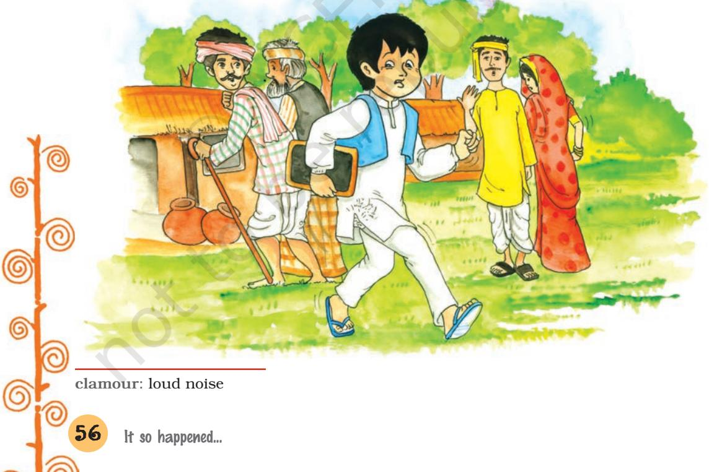
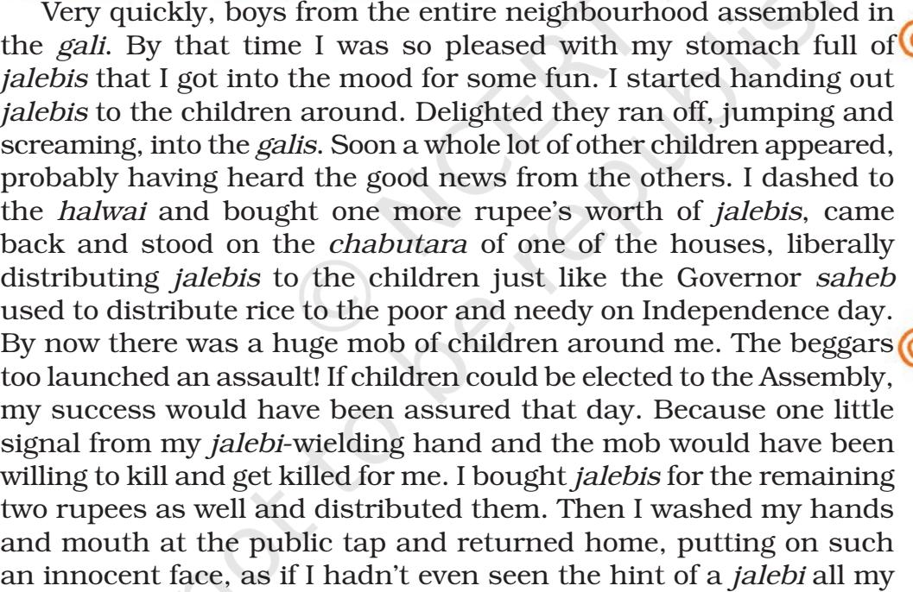
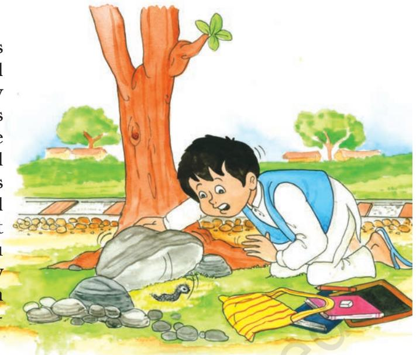

7 Jalebis

- I
- An honest boy is on his way to school carrying money in his pocket to pay the school fees.
- The sight of crisp, syrupy jalebis in the market excites him and the coins in his pocket begin to jingle.
- After a long debate with himself, he yields to the sweet temptation.

IT happened many years ago. I was in the fifth standard at the government school, Kambelpur, now called Atak. One day, I went to school with four rupees in my pocket to pay the school fees and the fund. When I got there I found that the teacher who collected the fees, Master Ghulam Mohammed, was on leave and so the fees would be collected the next day. All through the day the coins simply sat in my pocket, but once school got over and I was outside, they began to speak.

All right. Coins don't talk. They jingle or go khanak-khanak. But I'm telling you, that day they actually spoke! One coin said, "What are you thinking about? Those fresh, hot jalebis coming out of the kadhao in the shop over there, they're not coming out for nothing. Jalebis are meant to be eaten and only those with money

khanak-khanak: sound of jingling of coins jalebis: syrupy Indian sweet kadhao: large, open pot for cooking/boiling

in their pocket can eat them, And money isn't for nothing. Money is meant to be spent and only they spend it, who like jalebis."

"Look here, you four rupees, I said to them. I am a good boy. Don't misguide me or it won't be good for you. I get so much at home that I consider even looking at something in the bazaar a sin. Besides, you are my fees and fund money. If I spend you today, then how shall I show my face to Master Ghulam Mohammed in school tomorrow and after that to Allah miyan at Qayamat? You probably don't know it but when Master Ghulam Mohammed gets angry and makes you stand on the bench, he simply forgets to let you sit till the last bell rings. So it's best you stop chewing at my ears like this and let me go home straight."

The coins disliked what I'd said so much that all of them began to speak at the same time. There was such a clamour that passersby in the bazaar stared, eyes wide with surprise, at me and my pocket. The coin of those days, the wretched thing, made so much more noise too! Finally, in a panic, I grabbed all four of them and held them tight in my fist and then they were silent.

After taking a few steps, I loosened my grip. Immediately, the oldest coin said, "Here we are trying to tell you something for your own good and you try to strangle us instead. Tell me honestly now, don't you feel like eating those hot, hot jalebis? And then, if you do end up spending us for today, won't you get the scholarship money tomorrow? Sweets with the fees money, fees with the scholarship money. End of story! Kissa khatam, paisa hazam."

What you're saying isn't right, I replied, but it isn't that wrong either. Listen. Stop blabbering and let me think. I am not a common sort of boy. But then, these jalebis are no common sort of jalebis either. They're crisp, fresh and full of sweet syrup.

My mouth watered, but I wasn't about to be swept away so easily. In school I was among the most promising students. In the fourth standard exams, I had even won a scholarship of four rupees a month. Besides, I came from a particularly well-to-do family, so I enjoyed considerable prestige. I'd never once been beaten so far. On the contrary, Masterji had got me to beat the other boys. For a child of such status, standing there in the middle of the bazaar eating jalebis? No. It wasn't right, I decided. I clenched the rupiyas in my fist and came home.

Kissa khatam paisa hazam: end of story (literally: story ends, money disappears) blabbering: talking confusedly prestige: respect

Jalebis 57

The coins were so keen on being spent that day, they kept up their attempts at persuasion till their voices began to choke. When I reached home and sat on the bed, they began to speak. I went inside to have lunch, they began to shriek. Thoroughly fed up, I rushed out of the house barefoot and ran towards the bazaar. Terrified I was, but quickly I told the halwai to weigh a whole rupee worth of jalebis. His astonished look seemed to be asking where I had the handcart in which I would carry all those jalebis. Those were inexpensive times. One rupee fetched more than twenty rupees does nowadays. The halwai opened up a whole newspaper and heaped a pile of jalebis on it.

### Comprehension Check

- 1. Why didn't he pay the school fees on the day he brought money to school?
- 2. (i) What were the coins 'saying' to him? (ii) Do you think they were misguiding him?
- 3. Why didn't he take the coins' advice? Give two or three reasons.
- 4. (i) What did the oldest coin tell him?
	- (ii) Did he follow his advice? If not, why not?
- 5. He reached home with the coins in his pocket. What happened then?

### II

- A heap of jalebis he eats, and shares them liberally with one and all.
- Though penniless now, he feels no less important than a mob leader.
- The real problem at hand is payment of school fees on time.

Just as I was gathering up the heap, in the distance I spotted our tonga. Chachajaan was returning from Court. I clutched the jalebis to my chest and ran into a gali. When I reached a safe corner, I began to devour the jalebis. I ate so many... so many jalebis that if anyone pressed my stomach a little, jalebis would have popped out of my ears and nostrils.

58 It so happened...

persuasion: coaxing halwai: sweetmeat seller tonga: two-wheeled, horse-drawn vehicle gali: narrow lane

chabutara: platform assault: attack jalebi-wielding hand: the hand that held jalebis

life. Jalebis I had gobbled up easily enough, but digesting them became another matter. With every breath came a burp, and with every burp, the danger of bringing out a jalebi or two — the fear was killing me. At night I had to eat my dinner as well. If I hadn't eaten I would have been asked to explain why I did not want any food, and if I had pretended illness the doctor would have been summoned and if the doctor, after feeling my pulse, had declared, Munna has devoured a mound of jalebis, I would simply die.

The result was that all night I lay, coiled up like a jalebi, suffering a stomach ache. Thank God I didn't have to eat all four rupees worth of jalebis by myself. Otherwise, as they say, when children speak, flowers shower from their mouths but I would be the first child in the world with whose every word a crisp, fried jalebi would come out.

Chidren don't have stomachs, they have digestion machines. My machine too kept working right through the night. In the morning, just like any other day, I washed my face and like a virtuous student, with chalk and slate in hand, I headed for school. I knew I would get the previous month's scholarship that day and once I'd paid the fees with that amount, the jalebis would be completely digested. But when I got to school, I found out that the scholarship was going to be paid the following month. My head started to spin. I felt as if I was standing on my head and could not get on to my feet again even if I tried. Master Ghulam Mohammed announced that the fees would be taken during the recess. When the recess bell rang, I tucked my bag under my arm and left the school and simply followed my nose, walking on and on... If no mountain or ocean blocked my path, I would have kept going till the earth ended and the sky began, and once I got there, I would say to Allah miyan. "Just this once save me. Order a farishta to pass by and drop just four rupees in my pocket. I promise I will use them only to pay my fees and not to eat jalebis."

I couldn't reach the point where the earth ended, but definitely reached the point where the Kambelpur railway station began. The

60 It so happened...

gobbled: eaten quickly/greedily summoned: sent for/called virtuous: good and noble farishta: angel

elders had warned me never to cross the railway tracks. Fine. The elders had also warned me that one must never eat sweets with one's fees money. How did this instruction escape my mind that day? I don't know.

#### Comprehension Check

- 1. (i) Why didn't he eat all the jalebis he had bought? (ii) What did he do with the remaining jalebis?
- 2. "The fear was killing me." What was the fear?
- 3. "Children's stomachs are like digestion machines." What do you understand by that? Do you agree?
- 4. How did he plan to pay the fees the next day?
- 5. When it is time to pay the fees, what does he do? How is he disobeying the elders by doing so?

### III

- Remorseful and scared, he prays to God for monetary help.
- He makes matters look normal but prays harder than ever.
- The inevitable happens, though somewhere along the way he notices the divide between the fanciful and the factual.

There was a shade-giving tree beside the railway tracks. I sat under it and wondered whether there could possibly be a more unfortunate child than me in this world! When the coins had first created a racket in my pocket, the entire matter seemed so simple and straightforward. Eat jalebis with the fees money and then pay the fees with the scholarship money. I thought that two and two added up to four and could never be five. How was I to know that sometimes it added up to five as well? Had I known that I would get the scholarship the next month, I would have postponed my jalebi eating programme to the next month as well. Now for the crime of eating a few jalebis, for the first time in my life I was absent from school, and crouching in the shade of a tree in a deserted corner of the railway station. Sitting there under the tree, at first I felt like crying.

racket: uproar/loud noise crouching: sitting (as if hiding)

Jalebis 61

Then I felt like laughing when it struck me that the tears I was shedding were not tears but drops of jalebi syrup. From the jalebis my thoughts went to the fees, and from fees to Master Ghulam Mohammed's cane, and from his cane I thought of God. I closed my eyes, and began to pray.

'Allah miyan! I'm a very good boy. I have memorised the entire namaaz. I even know the last ten surats of the Quran by heart. If you wish, I can recite the entire ayat-al-kursi for you just now. The need of your devoted servant is only the fees money that I ate the jalebis with... So all right, I admit I made a mistake. I didn't eat them all by myself, though I fed them to a whole lot of children too, but yes, it was a mistake. If I'd known the scholarship money would be given next month, I would neither have eaten them nor fed them to the others. Now you do one thing, just put four rupees in my bag. If there's a paisa more than four ruppes I will be very displeased with you. I promise, if I ever eat sweets with my fees money again, then let a thief's punishment be my punishment. So, Allah miyan, just this once, help me out. There is no shortage of anything in your treasury. Even our chaprasi takes a whole lot of money home

> every month, and Allahji, after all I am the nephew of a big officer.

Won't you give me just four rupees?

After the prayer I offered namaaz, recited ten surats, ayat-alkursi, kalma-e-tayyab, in fact everything that I remembered. Then I blew over my bag saying Choo. Then, after saying bismillah, I realised that what

surats: verses from the Holy Quran ayat-al-kursi: title of a verse in the Holy Quran; treasury: wealth chaprasi: peon choo: sound of 'blowing over the bag' (to ward off evil) bismillah: in the name of God (words spoken before starting something)

62 It so happened...

they said was only too true — no one can erase what fate has decreed. Forget four rupees, there weren't even four paise in my bag. Just a few textbooks and notebooks. One pencil. One sharpener. One Id card my Mamu had sent me last Id.

I felt like crying as loudly as I could, but then I remembered that school must have ended and the children must be on their way home. Tired and defeated, I got up from there and walked to the bazaar and waited for the school bell to ring, so that when the children came out I too would walk home with them as if I had come straight from school.

I didn't even realise that I was standing near the jalebiwala's shop. Suddenly, the halwai called out, "Kyon bhai, shall I weigh a rupee's worth? Don't want jalebis today?"

I felt like saying I won't eat your jalebis today but, I'd sure like to roast your liver and eat that instead. But I wasn't feeling too well that day, so I simply moved away.

The next day I did the same thing. I got dressed and left home, went up to the school gate and then turned off to the railway station. Under the same tree I sat and began to say the same prayers. I repeatedly pleaded, Allah miyan! At least give it to me today. Today is the second day.

Then I said, "All right come, let's play a game. I will go from here to that signal. You secretly place four rupees under this big rock. I will touch the signal and come back. What fun it will be if I pick up the rock and find four rupees underneath! So, are you ready? I am going towards the signal. One-two-three."

I went up to the signal and returned, smiling. But I could not find the courage to pick up the rock. What if the coins were not there? But then, I thought, what if they were?

Finally after saying bismillah, when I lifted up the rock, this big hairy worm got up, and curling and twisting wriggled towards me. I screamed and ran away and once again touched the signal. Then,

Jalebis 63

crawling on my hands and knees, I reached the tree. I tried my best not to let my eyes stray towards the rock. But as I picked up my bag and was about to leave, I had to look once again at the rock, and do you know what I saw there? I saw Mr Worm coiled on it comfortably, staring at me.

I walked away

thinking, tomorrow I will do wazu, wear clean clothes and come here. From morning to noon I will keep reading the namaaz. If, even after that, Allah doesn't give me four rupees, I will be forced to learn how to strike bargains or make deals with Him. After all, if my Allah does not give me my four rupees then who will? That day, when I returned home, apparently from school and actually from the railway station, I was caught. The report of my absence had reached home. It's useless to relate what happened after that.

Well, whatever happened, happened. But up to the seventh or eighth standard I kept wondering, if Allah miyan had sent me four rupees that day, what harm could it have possibly caused anyone? It was only later that I came to the conclusion that if Allah miyan were to provide all for the asking, then man would, even today, be living in nests like vultures and crows and would not have learnt the art of making jalebis!

> AHMED NADEEM QASMI (translated from the Urdu by SUFIYA PATHAN)

wazu: ablution (washing face, hands and feet before praying)

64 It so happened...

#### Comprehension Check

- 1. What was the consequence of buying jalebis with the fees money?
- 2. His prayer to God is like a lawyer's defence of a bad case. Does he argue his case well? What are the points he makes? J
- 3. He offers to play a game with Allah Miyan. What is the game?
- 4. Did he get four rupees by playing the game? What did he get to see under the rock?
- 5. If God had granted his wish that day, what harm would it have caused him in later life?

# Exercise

Work in small groups.

- 1. Select and read sentences that show
	- that the boy is tempted to eat jalebis.
	- that he is feeling guilty.
	- that he is justifying a wrong deed.
- 2. Discuss the following points.
	- Is the boy intelligent? If so, what is the evidence of it?
	- Does his outlook on the jalebis episode change after Class VIII? Does he see that episode in a new light?
	- Why are coins made to 'talk' in this story? What purpose does it serve?

## Think it Over

J

 JJ• I do not feel obliged to believe that the same God who has endowed us with senses, reason and intellect has intended us to forgo their use and by some other means to give us knowledge which we can attain by them.

Jalebis 65

