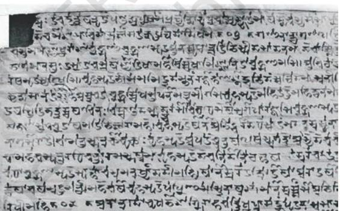
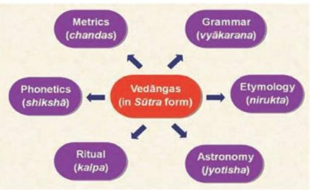
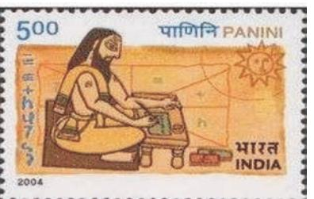
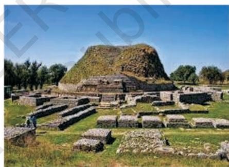
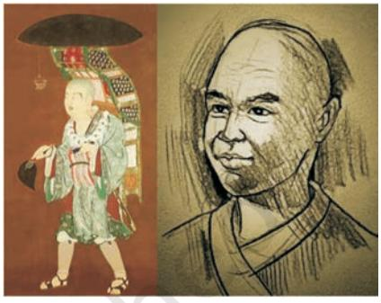
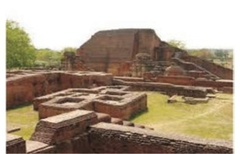
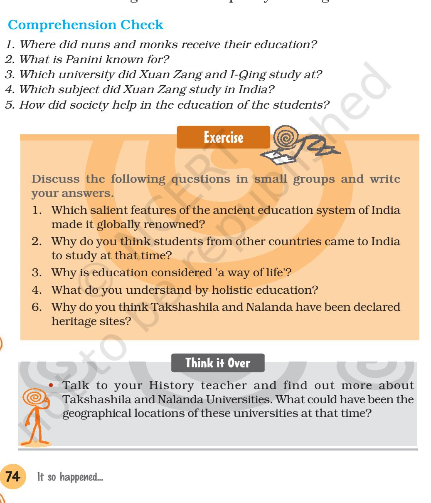

# 8 Ancient Education System of India

I

- Did you know that India has been the centre of learning since ancient times? How did we come to know about this?
- There are inscriptions on stones and copper, palm leaf records and our scriptures as evidences of the historic origins of learning in India. Today we follow an education system in which learning takes place through syllabus, curricula, textbooks and assessment practices. Have you ever thought what these were like in the past?
- In this feature story, we will give you glimpses of our ancient education system.

#### INTRODUCTION

66 It so happened...

You must have heard or read that travellers from various regions having different climates and cultures began to visit parts of India from early times. To them, India was a land of wonder! The fame of Indian culture, wealth, religions, philosophies, art, architecture, as well as its educational practices had spread far and wide. The education system of ancient times was regarded as a source for the knowledge, traditions and practices that guided and encouraged humanity.

#### SALIENT FEATURES OF ANCIENT EDUCATION SYSTEM

From the time of Rigveda onwards, our ancient education system evolved over the period and focused on the holistic development of the individual by taking care of both the inner and the outer self. The system focused on the moral, physical, spiritual and intellectual aspects of life. It emphasised on values such as humility, truthfulness, discipline, self-reliance and respect for all creations. Students were taught to appreciate the balance between human beings and nature. Teaching and learning followed the tenets of Vedas and Upanishads fulfilling duties towards self, family and society, thus encompassing all aspects of life. Education system focused both on learning and physical development. In other words, the emphasis was on healthy mind and healthy body. You can see that education in India has a heritage of being pragmatic, achievable and complementary to life.

#### SOURCES OF EDUCATION

The ancient system of education was the education of the Vedas, Brahmanas, Upanishads and Dharmasutras. You must have heard the names of Aryabhata, Panini, Katyayana and Patanjali. Their writings and the medical treatises of Charaka and Sushruta were

A page from a manuscript* of the Rigveda

also some of the sources of learning. Distinction was also drawn

Ancient Education System of India 67

*This birch bark manuscript of the Rigveda was found in Kashmir. About 150 years ago, it was used to prepare one of the earliest printed texts of the Rigveda, as well as an English translation. It is now preserved in a library in Pune, Maharashtra. (Class VI, Our Pasts-1, NCERT, 2017)

heritage: something that is handed down from the past, as a tradition tenets: the main principles of a religion or philosophy

between Shastras (learned disciplines) and Kavyas (imaginative and creative literature). Sources of learning were drawn from various disciplines such as Itihas (history), Anviksiki (logic), Mimamsa (interpretation) Shilpashastra (architecture), Arthashastra (polity), Varta (agriculture, trade, commerce,

Visual mapping of the various disciplines encompassed in the Vedas

animal husbandry) and Dhanurvidya (archery).

Physical education too was an important curricular area and pupils participated in krida (games, recreational activities), vyayamaprakara (exercises), dhanurvidya (archery) for acquiring martial skills, and yogasadhana (training the mind and body) among others. The Gurus and their pupils worked conscientiously together to become proficient in all aspects of learning.

In order to assess pupils' learning, shastrartha (learned debates) were organised. Pupils at an advanced stage of learning guided younger pupils. There also existed the system of peer learning, like you have group/peer work.

#### ANCIENT EDUCATION SYSTEM IN INDIA — A WAY OF LIFE

In ancient India, both formal and informal ways of education system existed. Indigenous education was imparted at home, in temples, pathshalas, tols, chatuspadis and gurukuls. There were people in homes, villages and temples who guided young children in imbibing pious ways of life. Temples were also the centres of learning and took interest in the promotion of knowledge of our ancient system. Students went to viharas and universities for higher knowledge. Teaching was largely oral and students remembered and meditated upon what was taught in the class.

indigenous: originating or occurring naturally in a particular place Vihara: Buddhist monastery

68 It so happened...

Gurukuls, also known as ashrams, were the residential places of learning. Many of these were named after the sages. Situated in forests, in serene and peaceful surroundings, hundreds of students used to learn together in gurukuls. Women too had access to education during the early Vedic period. Among the prominent women Vedic scholars, we find references to Maitreyi, Viswambhara, Apala, Gargi and Lopamudra, to name a few.

During that period, the gurus and their shishyas lived together helping each other in day-to-day life. The main objective was to have complete learning, leading a disciplined life and realising one's inner potential. Students lived away from their homes for years together till they achieved their goals. The gurukul was also the place where the relationship of the guru and shishya strengthened with time. While pursuing their education in different disciplines like history, art of debate, law, medicine, etc., the emphasis was not only on the outer dimensions of the discipline but also on enriching inner dimensions of the personality.

### Comprehension Check

- 1. Why were travellers attracted towards India?
- 2. What were the sources of the ancient education system?
- 3. What were the features of education system in ancient India?
- 4. What was the role of guru in pupils' lives?

# II

- In Part I, you have read about the ancient education system in ashrams/gurukuls, and the way of life in them.
- This system continued to flourish during the time of the Buddha and the subsequent periods.

Many monasteries/viharas were set up for monks and nuns to meditate, debate and discuss with the learned for their quest for knowledge during this period. Around these viharas, other educational centres of higher learning developed, which attracted

monastery: a place where monks line and worship

Ancient Education System of India 69

students from China, Korea, Tibet, Burma, Ceylon, Java, Nepal and other distant countries.

## VIHARAS AND UNIVERSITIES

The Jataka tales, accounts given by Xuan Zang and I-Qing (Chinese scholars), as well as other sources tell us that kings and society took active interest in promoting education. As a result many famous educational centres came into existence. Among the most notable universities that evolved during this period were situated at Takshashila, Nalanda, Valabhi, Vikramshila, Odantapuri and Jagaddala. These universities developed in connection with the viharas. Those at Benaras, Navadeep and Kanchi developed in connection with temples and became centres of community life in the places where they were situated.

These institutions catered to the needs of advanced level students. Such students joined the centres of higher learning and developed their knowledge by mutual discussions and debates with renowned scholars.

Not only this, there was also occasional summoning by a king to a gathering in which the scholars of the country of various viharas and universities would meet, debate and exchange their views.

In this section we will give you glimpses of two universities of the ancient period. These universities were considered among the best centres of learning in the world. These have been recently declared heritage sites by the United Nations Educational, Scientific and Cultural Organization (UNESCO).

### TAKSHASHILA OR TAXILA

In ancient times, Takshashila was a noted centre of learning, including religious teachings of Buddhism, for several centuries. It continued to attract students from around the world until its destruction in the 5th century CE. It was known for its higher

70 It so happened...

summon: to officially arrange a meeting of people university: institution of higher education

education and the curriculum comprised the study of ancient scriptures, law, medicine, astronomy, military science and the eighteen silpas or arts.

Takshashila became famous as a place of learning due to its teachers' expertise. Among its noted pupils were the legendary Indian grammarian, Panini. He was an expert in language and grammar and authored one of the greatest works on grammar called Ashtadhyayi. Jivaka, one of the most renowned physicians in ancient India, and Chanakya (also known as Kautilya),

Postage stamp of Indian grammarian, Panini

a skilled exponent of statecraft, both studied here. Students came to Takshashila from Kashi, Kosala, Magadha and also from other countries in spite of the long and arduous journey they had to undertake.

Takshashila was an ancient Indian city, which is now in north-western Pakistan. It is an important archaeological site and the UNESCO declared it to be a World Heritage Site in 1980. Its fame rested on the University, where Chanakya is said to have composed his Arthashastra.

Archaeologist Alexander Cunningham discovered its ruins in the mid-19th century.

ROLE OF THE TEACHER

Teachers had complete autonomy in all aspects from selection of students to designing their syllabi. When the teacher was satisfied with the performance of the students, the course concluded.

autonomy: freedom to act on one's will statecraft: the skill of governing a country

Ancient Education System of India 71

He would admit as many students as he liked and taught what his students were keen to learn. Debate and discussions were the primary methods of teaching. Teachers were assisted by their advanced level students.

#### NALANDA UNIVERSITY

Nalanda, when Xuan Zang visited it, was called Nala and was a centre of higher learning in various subjects. The University attracted scholars from the different parts of the country as well as world. The Chinese scholars I-Qing and Xuan Zang visited Nalanda in the 7th century CE. They have given vivid accounts of Nalanda. They have noted that as many as one hundred

Xuan Zang I-Qing

discourses happened on a daily basis, in a variety of disciplines through the methods of debate and discussions. Xuan Zang himself became a student of Nalanda to study yogashastra. He has mentioned that the Chancellor of Nalanda, Shilabhadra, was the highest living authority in yoga. The courses of study offered by Nalanda University covered a wide range, almost the entire circle of knowledge then available. Students at Nalanda studied the Vedas and were also trained in fine arts, medicine, mathematics, astronomy, politics and the art of warfare.

The ancient Nalanda was a centre of learning from the 5th century CE to 12th century CE. Located in present day Rajgir, Bihar, India, Nalanda was one of the oldest universities of the world and UNESCO declared the ruins of Nalanda Mahavihara, a world

heritage site. The new Nalanda University is envisaged as a centre of inter-civilisational dialogue.

72 It so happened...

#### ROLE OF COMMUNITY

At that time, knowledge was considered sacred and no fee was charged. Contributions towards education were considered the highest form of donation. All members of the society contributed in some form or the other. Financial support came from rich merchants, wealthy parents and society. Besides gifts of buildings, the universities received gifts of land. This form of free education was also prevalent in other ancient universities like Valabhi, Vikramshila and Jagaddala.

At the same time in the south of India, agraharas served as centers of learning and teaching. South Indian kingdoms also had other cultural institutions known as Ghatika and Brahmapuri. A Ghatika was a centre of learning including religion and was small in size. An agrahara was a bigger institution, a whole settlement of learned Brahmins, with its own powers of government and was maintained by generous donations from the society. Temples, Mathas, Jain Basadis and Buddhist Viharas also existed as other sources of learning during this period.

#### CONTINUATION OF INDIAN EDUCATION SYSTEM

The Indian education system continued in the form of ashrams, in temples and as indigenous schools. During the medieval period, maktabas and madrassas became part of the education system. During the pre-colonial period, indigenous education flourished in India. This was an extension of the formal system that had taken roots earlier. This system was mostly religious and spiritual form of education. Tols in Bengal, pathshalas in western India, chatuspadis in Bihar, and similar schools existed in other parts of India. Local resources via donations supported education. References in texts and memoirs inform that villagers also supported education in southern India.

As we understand, the ancient education system of India focused on the holistic development of the students, both inner and outer self, thus preparing them for life. Education was free and not centralised. Its foundations were laid in the rich cultural traditions

Ancient Education System of India 73

of India thereby helping in the development of the physical, intellectual, spiritual and artistic aspects of life holistically.

Our present day education system has a lot to learn from the ancient education system of India. Therefore, the stress is being laid on connecting learning to the world outside the school. Today educationists recognise the role and importance of multilingual and multicultural education, thereby connecting the ancient and the traditional knowledge with contemporary learning.

## Comprehension Check

- 1. Where did nuns and monks receive their education?
- 2. What is Panini known for?
- 3. Which university did Xuan Zang and I-Qing study at?
- 4. Which subject did Xuan Zang study in India?
- 5. How did society help in the education of the students?

# Notes

Ancient Education System of India 75

