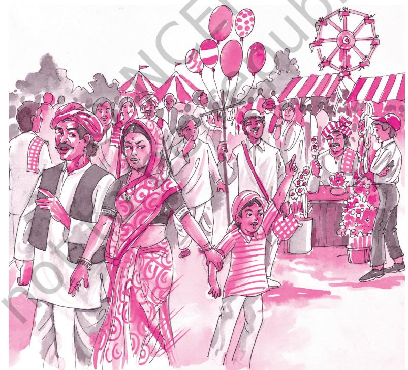
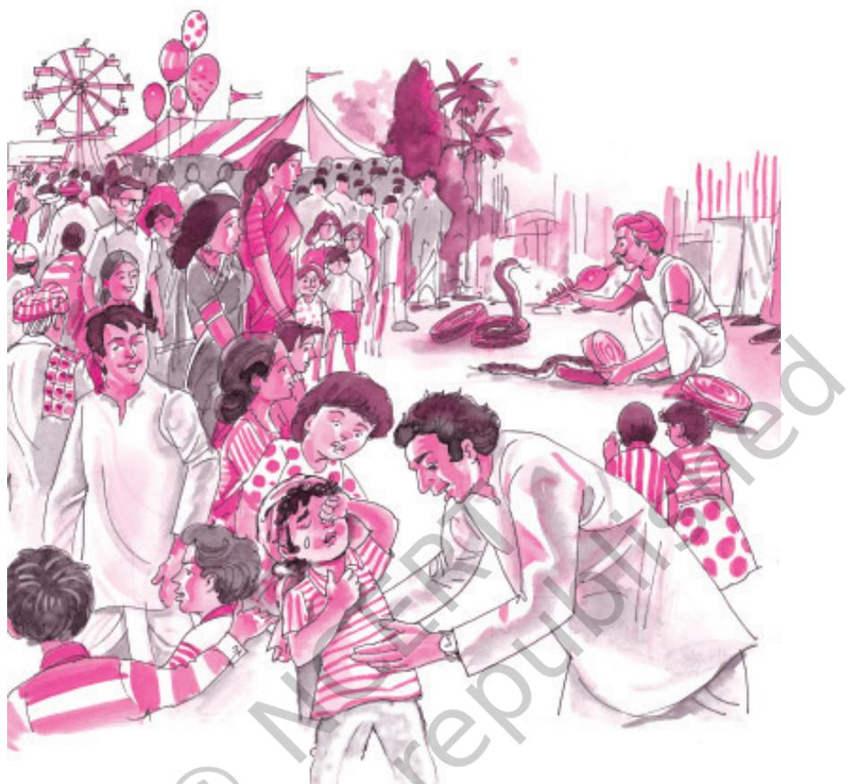
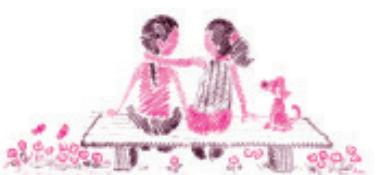

A child goes to a fair with his parents. He is happy and excited and wants the sweets and toys displayed there. But his parents don't buy them for him. Why then does he refuse when someone else offers them to him?

IT was the festival of spring. From the wintry shades of narrow lanes and alleys emerged a gaily clad humanity. Some walked, some rode on horses, others sat, being carried in bamboo and bullock carts. One little boy ran between his father's legs, brimming over with life and laughter.

"Come, child, come," called his parents, as he lagged behind, fascinated by the toys in the shops that lined the way.

He hurried towards his parents, his feet obedient to their call, his eyes still lingering on the receding toys. As he came to where they had stopped to wait for him, he could not suppress the desire of his heart, even though he well knew the old, cold stare of refusal in their eyes.

"I want that toy," he pleaded.

His father looked at him red-eyed, in his familiar tyrant's way. His mother, melted by the free spirit of the day was tender and, giving him her finger to hold, said, "Look, child, what is before you!"

It was a flowering mustard-field, pale like melting gold as it swept across miles and miles of even land.

A group of dragon-flies were bustling about on their gaudy purple wings, intercepting the flight of a lone black bee or butterfly in search of sweetness from the flowers. The child followed them in the air with his gaze, till one of them would still its wings and rest, and he would try to catch it. But it would go fluttering, flapping, up into the air, when he had almost caught it in his hands. Then his mother gave a cautionary call: "Come, child, come, come on to the footpath."

He ran towards his parents gaily and walked abreast of them for a while, being, however, soon left behind, attracted by the little insects and worms along the footpath that were teeming out from their hiding places to enjoy the sunshine.

"Come, child, come!" his parents called from the shade of a grove where they had seated themselves on the edge of a well. He ran towards them.

A shower of young flowers fell upon the child as he entered the grove, and, forgetting his parents, he began to gather the raining petals in his hands. But lo! he heard the cooing of doves and ran towards his parents, shouting, "The dove! The dove!" The raining petals dropped from his forgotten hands.

"Come, child, come!" they called to the child, who had now gone running in wild capers round the banyan tree, and gathering him up they took the narrow, winding footpath which led to the fair through the mustard fields.

2 / Moments

As they neared the village the child could see many other footpaths full of throngs, converging to the whirlpool of the fair, and felt at once repelled and fascinated by the confusion of the world he was entering.

A sweetmeat seller hawked, "*gulab-jaman, rasagulla, burfi, jalebi*," at the corner of the entrance and a crowd pressed round his counter at the foot of an architecture of many coloured sweets, decorated with leaves of silver and gold. The child stared openeyed and his mouth watered for the *burfi* that was his favourite sweet. "I want that *burfi*," he slowly murmured. But he half knew as he begged that his plea would not be heeded because his parents would say he was greedy. So without waiting for an answer he moved on.

A flower-seller hawked, "A garland of *gulmohur*, a garland of *gulmohur*!" The child seemed irresistibly drawn. He went towards the basket where the flowers lay heaped and half murmured, "I want that garland." But he well knew his parents would refuse to buy him those flowers because they would say that they were cheap. So, without waiting for an answer, he moved on.

A man stood holding a pole with yellow, red, green and purple balloons flying from it. The child was simply carried away by the rainbow glory of their silken colours and he was filled with an overwhelming desire to possess them all. But he well knew his parents would never buy him the balloons because they would say he was too old to play with such toys. So he walked on farther.

A snake-charmer stood playing a flute to a snake which coiled itself in a basket, its head raised in a graceful bend like the neck of a swan, while the music stole into its invisible ears like the gentle rippling of an invisible waterfall. The child went towards the snake-charmer. But, knowing his parents had forbidden him to hear such coarse music as the snake-charmer played, he proceeded farther.

There was a roundabout in full swing. Men, women and children, carried away in a whirling motion, shrieked and cried with dizzy laughter. The child watched them intently and then he made a bold request: "I want to go on the roundabout, please, Father, Mother."

The Lost Child / 3

There was no reply. He turned to look at his parents. They were not there, ahead of him. He turned to look on either side. They were not there. He looked behind. There was no sign of them.

A full, deep cry rose within his dry throat and with a sudden jerk of his body he ran from where he stood, crying in real fear, "Mother, Father." Tears rolled down from his eyes, hot and fierce; his flushed face was convulsed with fear. Panic-stricken, he ran to one side first, then to the other, hither and thither in all directions, knowing not where to go. "Mother, Father," he wailed. His yellow turban came untied and his clothes became muddy.

Having run to and fro in a rage of running for a while, he stood defeated, his cries suppressed into sobs. At little distances on the green grass he could see, through his filmy eyes, men and women talking. He tried to look intently among the patches of bright yellow clothes, but there was no sign of his father and mother among these people, who seemed to laugh and talk just for the sake of laughing and talking.

He ran quickly again, this time to a shrine to which people seemed to be crowding. Every little inch of space here was congested with men, but he ran through people's legs, his little sob lingering: "Mother, Father!" Near the entrance to the temple, however, the crowd became very thick: men jostled each other, heavy men, with flashing, murderous eyes and hefty shoulders. The poor child struggled to thrust a way between their feet but, knocked to and fro by their brutal movements, he might have been trampled underfoot, had he not shrieked at the highest pitch of his voice, "Father, Mother!" A man in the surging crowd heard his cry and, stooping with great difficulty, lifted him up in his arms.

"How did you get here, child? Whose baby are you?" the man asked as he steered clear of the mass. The child wept more bitterly than ever now and only cried, "I want my mother, I want my father!"

The man tried to soothe him by taking him to the roundabout. "Will you have a ride on the horse?" he gently asked as he approached the ring. The child's throat tore into a thousand shrill sobs and he only shouted, "I want my mother, I want my father!"

4 / Moments

The man headed towards the place where the snake-charmer still played on the flute to the swaying cobra. "Listen to that nice music, child!" he pleaded. But the child shut his ears with his fingers and shouted his double-pitched strain: "I want my mother, I want my father!" The man took him near the balloons, thinking the bright colours of the balloons would distract the child's attention and quieten him. "Would you like a rainbowcoloured balloon?" he persuasively asked. The child turned his eyes from the flying balloons and just sobbed, "I want my mother, I want my father!"

The man, still trying to make the child happy, bore him to the gate where the flower-seller sat. "Look! Can you smell those nice flowers, child! Would you like a garland to put round your neck?"

The Lost Child / 5

The child turned his nose away from the basket and reiterated his sob, "I want my mother, I want my father!"

Thinking to humour his disconsolate charge by a gift of sweets, the man took him to the counter of the sweet shop. "What sweets would you like, child?" he asked. The child turned his face from the sweet shop and only sobbed, "I want my mother, I want my father!"

MULK RAJ ANAND

- 1. What are the things the child sees on his way to the fair? Why does he lag behind?
- 2. In the fair he wants many things. What are they? Why does he move on without waiting for an answer?
- 3. When does he realise that he has lost his way? How have his anxiety and insecurity been described?
- 4. Why does the lost child lose interest in the things that he had wanted earlier?
- 5. What do you think happens in the end? Does the child find his parents?

How to ensure not to get lost.

- l *The Coolie* by Mulk Raj Anand
- l 'Kabuliwallah' by Rabindranath Tagore

