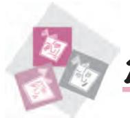
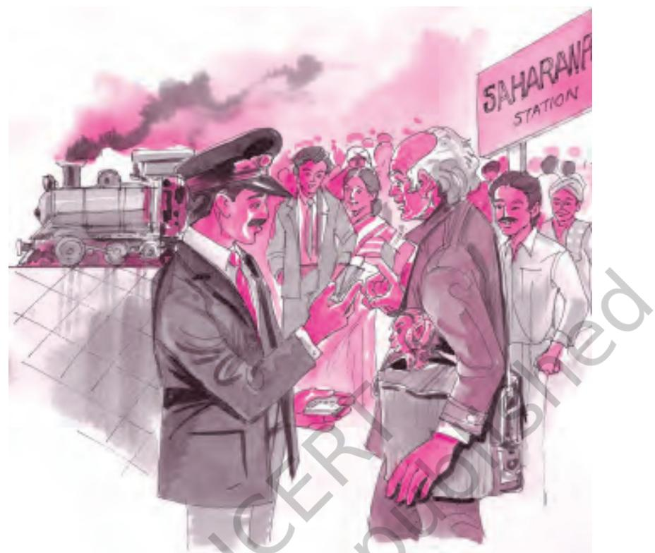
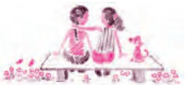
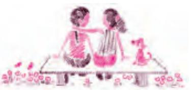

2. The Adventures of Toto

Have you ever had a baby monkey as a pet? Toto is a baby monkey. Let's find out whether he is mischievous or docile.

GRANDFATHER bought Toto from a tonga-driver for the sum of five rupees. The tonga-driver used to keep the little red monkey tied to a feeding-trough, and the monkey looked so out of place there that Grandfather decided he would add the little fellow to his private zoo.

Toto was a pretty monkey. His bright eyes sparkled with mischief beneath deep-set eyebrows, and his teeth, which were a pearly white, were very often displayed in a smile that frightened the life out of elderly Anglo-lndian ladies. But his hands looked dried-up as though they had been pickled in the sun for many years. Yet his fingers were quick and wicked; and his tail, while adding to his good looks (Grandfather believed a tail would add to anyone's good looks), also served as a third hand. He could use it to hang from a branch; and it was capable of scooping up any delicacy that might be out of reach of his hands.

Grandmother always fussed when Grandfather brought home some new bird or animal. So it was decided that Toto's presence should be kept a secret from her until she was in a particularly good mood. Grandfather and I put him away in a little closet opening into my bedroom wall, where he was tied securely — or so we thought — to a peg fastened into the wall.

A few hours later, when Grandfather and I came back to release Toto, we found that the walls, which had been covered with some ornamental paper chosen by Grandfather, now stood out as naked brick and plaster. The peg in the wall had been wrenched from its socket, and my school blazer, which had been hanging there, was in shreds. I wondered what Grandmother would say. But Grandfather didn't worry; he seemed pleased with Toto's performance.

 "He's clever," said Grandfather. "Given time, I'm sure he could have tied the torn pieces of your blazer into a rope, and made his escape from the window!"

His presence in the house still a secret, Toto was now transferred to a big cage in the servants' quarters where a number of Grandfather's pets lived very sociably together — a tortoise, a pair of rabbits, a tame squirrel and, for a while, my pet goat. But the monkey wouldn't allow any of his companions to sleep at night; so Grandfather, who had to leave Dehra Dun next day to collect his pension in Saharanpur, decided to take him along.

Unfortunately I could not accompany Grandfather on that trip, but he told me about it afterwards. A big black canvas kit-bag was provided for Toto. This, with some straw at the bottom, became his new abode. When the bag was closed, there was no escape. Toto could not get his hands through the opening, and the canvas was too strong for him to bite his way through. His efforts to get out only had the effect of making the bag roll about on the floor or occasionally jump into the air — an exhibition that attracted a curious crowd of onlookers on the Dehra Dun railway platform.

Toto remained in the bag as far as Saharanpur, but while Grandfather was producing his ticket at the railway turnstile, Toto suddenly poked his head out of the bag and gave the ticketcollector a wide grin.

The poor man was taken aback; but, with great presence of mind and much to Grandfather's annoyance, he said, "Sir, you have a dog with you. You'll have to pay for it accordingly."

In vain did Grandfather take Toto out of the bag; in vain did he try to prove that a monkey did not qualify as a dog, or even as a quadruped. Toto was classified a dog by the ticket-collector; and three rupees was the sum handed over as his fare.

Then Grandfather, just to get his own back, took from his pocket our pet tortoise, and said, "What must I pay for this, since you charge for all animals?"

The ticket-collector looked closely at the tortoise, prodded it with his forefinger, gave Grandfather a pleased and triumphant look, and said, "No charge. It is not a dog."

8 / Moments

When Toto was finally accepted by Grandmother he was given a comfortable home in the stable, where he had for a companion the family donkey, Nana. On Toto's first night in the stable, Grandfather paid him a visit to see if he was comfortable. To his surprise he found Nana, without apparent cause, pulling at her halter and trying to keep her head as far as possible from a bundle of hay.

Grandfather gave Nana a slap across her haunches, and she jerked back, dragging Toto with her. He had fastened on to her long ears with his sharp little teeth.

Toto and Nana never became friends.

A great treat for Toto during cold winter evenings was the large bowl of warm water given him by Grandmother for his bath. He would cunningly test the temperature with his hand, then gradually step into the bath, first one foot, then the other (as he had seen me doing), until he was into the water up to his neck.

The Adventures of Toto/ 9

Once comfortable, he would take the soap in his hands or feet, and rub himself all over. When the water became cold, he would get out and run as quickly as he could to the kitchen-fire in order to dry himself. If anyone laughed at him during this performance, Toto's feelings would be hurt and he would refuse to go on with his bath. One day Toto nearly succeeded in boiling himself alive.

A large kitchen kettle had been left on the fire to boil for tea and Toto, finding himself with nothing better to do, decided to remove the lid. Finding the water just warm enough for a bath, he got in, with his head sticking out from the open kettle. This was just fine for a while, until the water began to boil. Toto then raised himself a little; but, finding it cold outside, sat down again. He continued hopping up and down for some time, until Grandmother arrived and hauled him, half-boiled, out of the kettle.

If there is a part of the brain especially devoted to mischief, that part was largely developed in Toto. He was always tearing things to pieces. Whenever one of my aunts came near him, he made every effort to get hold of her dress and tear a hole in it.

One day, at lunch-time, a large dish of *pullao* stood in the centre of the dining-table. We entered the room to find Toto stuffing himself with rice. My grandmother screamed — and Toto threw a plate at her. One of my aunts rushed forward — and received a glass of water in the face. When Grandfather arrived, Toto picked up the dish of *pullao* and made his exit through a window. We found him in the branches of the jackfruit tree, the dish still in his arms. He remained there all afternoon, eating slowly through the rice, determined on finishing every grain. And then, in order to spite Grandmother, who had screamed at him, he threw the dish down from the tree, and chattered with delight when it broke into a hundred pieces.

Obviously Toto was not the sort of pet we could keep for long. Even Grandfather realised that. We were not well-to-do, and could not afford the frequent loss of dishes, clothes, curtains and wallpaper. So Grandfather found the tonga-driver, and sold Toto back to him — for only three rupees.

RUSKIN BOND

10 / Moments

## Glossary

- turnstile: a mechanical gate consisting of revolving horizontal arms fixed to a vertical post, allowing only one person at a time to pass through

halter: a rope or strap placed around the head of a horse or other animal, used for leading or tethering it

- 1. How does Toto come to grandfather's private zoo?
- 2. "Toto was a pretty monkey." In what sense is Toto pretty?
- 3. Why does grandfather take Toto to Saharanpur and how? Why does the ticket collector insist on calling Toto a dog?
- 4. How does Toto take a bath? Where has he learnt to do this? How does Toto almost boil himself alive?
- 5. Why does the author say, "Toto was not the sort of pet we could keep for long"?

Do you have a pet? Is your pet mischievous? Tell the class about it.

- l *My Family and Other Animals* by Gerald Durrell
- l 'Grandfather's Private Zoo' by Ruskin Bond
- l *Jungle Book* by Rudyard Kipling

The Adventures of Toto/ 11

