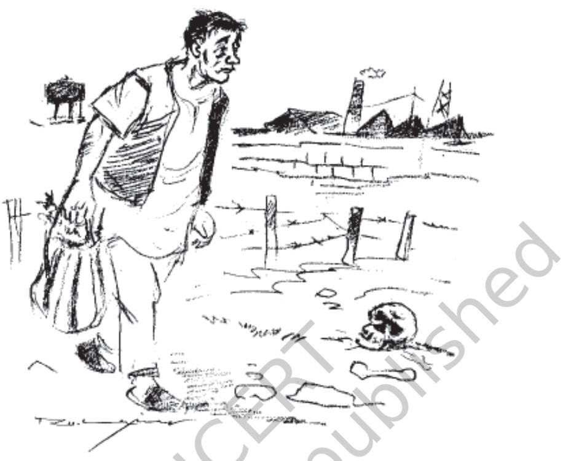

## 3. Iswaran the Storyteller

One night Mahendra woke up from his sleep and saw "a dark cloudy form". He broke out into a cold sweat. Was it a ghost?

THE story was narrated to Ganesh by a young man, Mahendra by name. He was a junior supervisor in a firm which offered on hire supervisors at various types of construction sites: factories, bridges, dams, and so on. Mahendra's job was to keep an eye on the activities at the work site. He had to keep moving from place to place every now and then as ordered by his head office: from a coal mining area to a railway bridge construction site, from there after a few months to a chemical plant which was coming up somewhere.

He was a bachelor. His needs were simple and he was able to adjust himself to all kinds of odd conditions, whether it was an ill-equipped circuit house or a makeshift canvas tent in the middle of a stone quarry. But one asset he had was his cook, Iswaran. The cook was quite attached to Mahendra and followed him uncomplainingly wherever he was posted. He cooked for Mahendra, washed his clothes and chatted away with his master at night. He could weave out endless stories and anecdotes on varied subjects.

Iswaran also had an amazing capacity to produce vegetables and cooking ingredients, seemingly out of nowhere, in the middle of a desolate landscape with no shops visible for miles around. He would miraculously conjure up the most delicious dishes made with fresh vegetables within an hour of arriving at the zinc-sheet shelter at the new workplace.

Mahendra would be up early in the morning and leave for work after breakfast, carrying some prepared food with him. Meanwhile Iswaran would tidy up the shed, wash the clothes, and have a leisurely bath, pouring several buckets of water over his head, muttering a prayer all the while. It would be lunchtime by then. After eating, he would read for a while before dozing off. The book was usually some popular Tamil thriller running to hundreds of pages. Its imaginative descriptions and narrative flourishes would hold Iswaran in thrall.

His own descriptions were greatly influenced by the Tamil authors that he read. When he was narrating even the smallest of incidents, he would try to work in suspense and a surprise ending into the account. For example, instead of saying that he had come across an uprooted tree on the highway, he would say, with eyebrows suitably arched and hands held out in a dramatic gesture, "The road was deserted and I was all alone. Suddenly I spotted something that looked like an enormous bushy beast lying sprawled across the road. I was half inclined to turn and go back. But as I came closer I saw that it was a fallen tree, with its dry branches spread out." Mahendra would stretch himself back in his canvas chair and listen to Iswaran's tales uncritically.

Iswaran the Storyteller/ 13

"The place I come from is famous for timber," Iswaran would begin. "There is a richly wooded forest all around. The logs are hauled on to the lorries by elephants. They are huge well-fed beasts. When they turn wild even the most experienced mahout is not able to control them." After this prologue Iswaran would launch into an elaborate anecdote involving an elephant.

"One day a tusker escaped from the timber yard and began to roam about, stamping on bushes, tearing up wild creepers and breaking branches at will. You know, sir, how an elephant behaves when it goes mad." Iswaran would get so caught up in the excitement of his own story that he would get up from the floor and jump about, stamping his feet in emulation of the mad elephant.

"The elephant reached the outskirts of our town; breaking the fences down like matchsticks," he would continue. "It came into the main road and smashed all the stalls selling fruits, mud pots and clothes. People ran helter-skelter in panic! The elephant now entered a school ground where children were playing, breaking through the brick wall. All the boys ran into the classrooms and shut the doors tight. The beast grunted and wandered about, pulling out the football goal-post, tearing down the volleyball net, kicking and flattening the drum kept for water, and uprooting the shrubs. Meanwhile all the teachers had climbed up to the terrace of the school building; from there they helplessly watched the depredations of the elephant. There was not a soul below on the ground. The streets were empty as if the inhabitants of the entire town had suddenly disappeared.

"I was studying in the junior class at that time, and was watching the whole drama from the rooftop. I don't know what came over me suddenly. I grabbed a cane from the hands of one of the teachers and ran down the stairs and into the open. The elephant grunted and menacingly swung a branch of a tree which it held in its trunk. It stamped its feet, kicking up a lot of mud and dust. It looked frightening. But I moved slowly towards it, stick in hand. People were watching the scene hypnotised from nearby housetops. The elephant looked at me red-eyed, ready to rush towards me. It lifted its trunk and trumpeted loudly. At that moment I moved forward and, mustering all my force, whacked

14 / Moments

its third toenail on the quick. The beast looked stunned for a moment; then it shivered from head to foot — and collapsed."

At this point Iswaran would leave the story unfinished, and get up mumbling, "I will be back after lighting the gas and warming up the dinner." Mahendra who had been listening with rapt attention would be left hanging. When he returned, Iswaran would not pick up the thread of the story right away. Mahendra would have to remind him that the conclusion was pending. "Well, a veterinary doctor was summoned to revive the animal," Iswaran would shrug casually. "Two days later it was led away by its mahout to the jungle."

"Well, how did you manage to do it, Iswaran — how did you bring down the beast?"

"It has something to do with a Japanese art, I think, sir. Karate or ju-jitsu it is called. I had read about it somewhere. It temporarily paralyses the nervous system, you see."

Not a day passed without Iswaran recounting some story packed with adventure, horror and suspense. Whether the story was credible or not, Mahendra enjoyed listening to it because of the inimitable way in which it was told. Iswaran seemed to more than make up for the absence of a TV in Mahendra's living quarters.

One morning when Mahendra was having breakfast Iswaran asked, "Can I make something special for dinner tonight, sir? After all today is an auspicious day — according to tradition we prepare various delicacies to feed the spirits of our ancestors today, sir."

That night Mahendra enjoyed the most delicious dinner and complimented Iswaran on his culinary skills. He seemed very pleased but, unexpectedly, launched into a most garish account involving the supernatural.

"You know, sir, this entire factory area we are occupying was once a burial ground," he started. Mahendra was jerked out of the pleasant reverie he had drifted into after the satisfying meal.

"I knew on the first day itself when I saw a human skull lying on the path. Even now I come across a number of skulls and bones," Iswaran continued.

He went on to narrate how he sometimes saw ghosts at night. "I am not easily frightened by these things, sir. I am a brave fellow. But one horrible ghost of a woman which appears off and on at midnight during the full moon... It is an ugly creature with matted hair and a shrivelled face, like a skeleton holding a foetus in its arms."

Mahendra shivered at the description and interrupted rather sharply, "You are crazy, Iswaran. There are no such things as ghosts or spirits. It is all a figment of your imagination. Get your digestive system examined — and maybe your head as well. You are talking nonsense."

He left the room and retired for the night, expecting Iswaran to sulk for a couple of days. But the next morning he was surprised to find the cook as cheerful and talkative as ever.

From that day on Mahendra, for all his brave talk, went to bed with a certain unease. Every night he peered into the darkness

16 / Moments

outside through the window next to his bed, trying to make sure that there was no movement of dark shapes in the vicinity. But he could only see a sea of darkness with the twinkling lights of the factory miles away.

He had always liked to admire the milk-white landscape on full-moon nights. But after hearing Iswaran's story of the female ghost he avoided looking out of his window altogether when the moon was full.

One night, Mahendra was woken up from his sleep by a low moan close to his window. At first he put it down to a cat prowling around for mice. But the sound was too guttural for a cat. He resisted the curiosity to look out lest he should behold a sight which would stop his heart. But the wailing became louder and less feline. He could not resist the temptation any more. Lowering himself to the level of the windowsill he looked out at the white sheet of moonlight outside. There, not too far away, was a dark cloudy form clutching a bundle. Mahendra broke into a cold sweat and fell back on the pillow, panting. As he gradually recovered from the ghastly experience he began to reason with himself, and finally concluded that it must have been some sort of auto suggestion, some trick that his subconscious had played on him.

By the time he had got up in the morning, had a bath and come out to have his breakfast, the horror of the previous night had faded from his memory. Iswaran greeted him at the door with his lunch packet and his bag. Just as Mahendra was stepping out Iswaran grinned and said, "Sir, remember the other day when I was telling you about the female ghost with a foetus in its arms, you were so angry with me for imagining things? Well, you saw her yourself last night. I came running hearing the sound of moaning that was coming from your room..."

A chill went down Mahendra's spine. He did not wait for Iswaran to complete his sentence. He hurried away to his office and handed in his papers, resolving to leave the haunted place the very next day!

R.K. LAXMAN

Iswaran the Storyteller/ 17

## Glossary

in thrall: the state of being in someone's power depredations: attacks which are made to destroy something guttural sound: sound produced in the throat; harsh-sounding feline: relating to cats or other members of the cat family

- 1. In what way is Iswaran an asset to Mahendra?
- 2. How does Iswaran describe the uprooted tree on the highway? What effect does he want to create in his listeners?
- 3. How does he narrate the story of the tusker? Does it appear to be plausible?
- 4. Why does the author say that Iswaran seemed to more than make up for the absence of a TV in Mahendra's living quarters?
- 5. Mahendra calls ghosts or spirits a figment of the imagination. What happens to him on a full-moon night?
- 6. Can you think of some other ending for the story?

Is Iswaran a fascinating storyteller? Discuss with your friends the qualities of a good storyteller. Try to use these qualities and tell a story.

- l 'The Story Teller*'* by Saki (H.H. Munro)
- l *Ghost Stories* (ed.) Ruskin Bond
- l 'The Canterville Ghost*'* by Oscar Wilde
- l 'Pret in the House' by Ruskin Bond

18 / Moments

