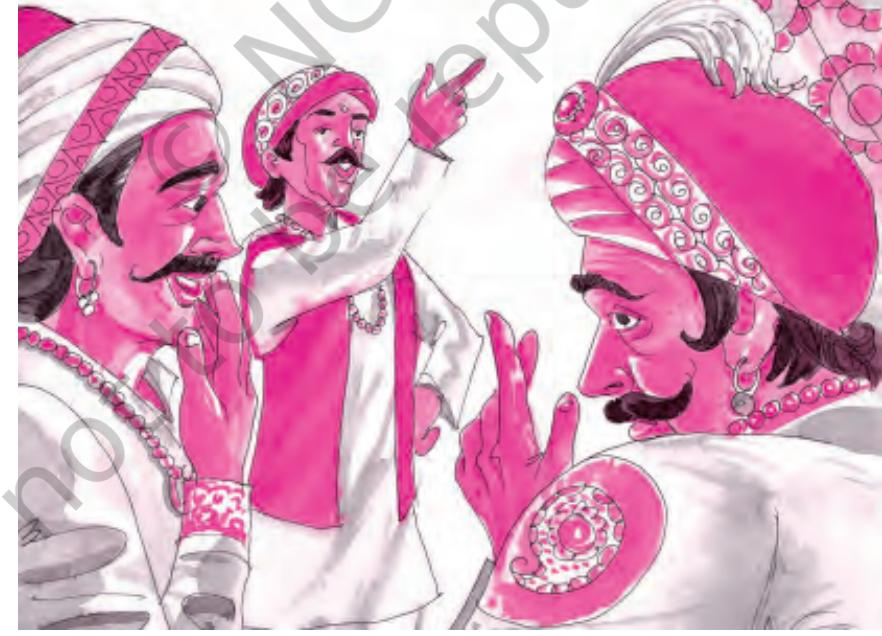
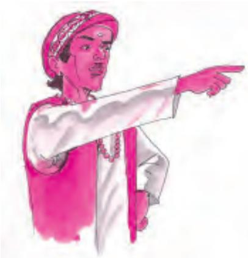
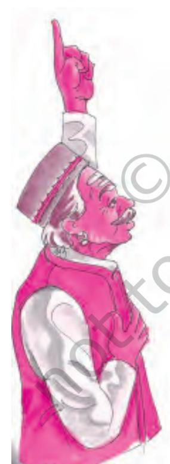
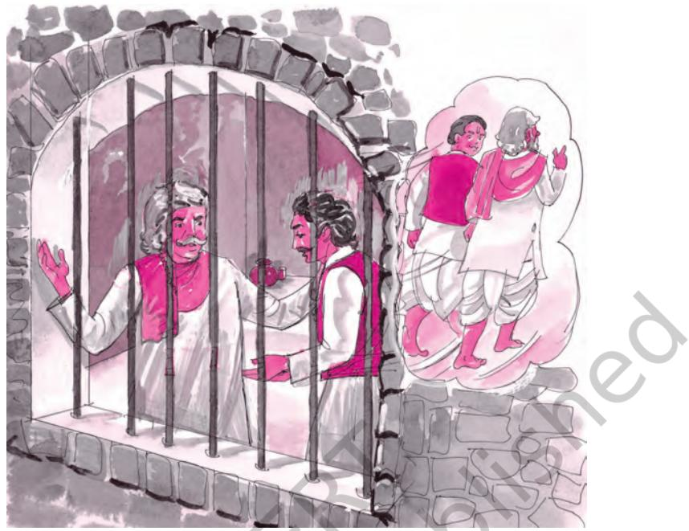

4. In the Kingdom of Fools

It is believed that fools are so dangerous that only very wise people can manage them. Who are the fools in this story? What happens to them?

IN the Kingdom of Fools, both the king and the minister were idiots. They didn't want to run things like other kings, so they decided to change night into day and day into night. They ordered that everyone should be awake at night, till their fields and run their businesses only after dark, and go to bed as soon as the sun came up. Anyone who disobeyed would be punished with death. The people did as they were told for fear of death. The king and the minister were delighted at the success of their project. One day a guru and his disciple arrived in the city. It was a beautiful city, it was broad daylight, but there was no one about. Everyone was asleep, not a mouse stirring. Even the cattle had been taught to sleep by day. The two strangers were amazed by what they saw around them and wandered around town till evening, when suddenly the whole town woke up and went about its nightly business.

The two men were hungry. Now that the shops were open, they went to buy some groceries. To their astonishment, they found that everything cost the same, a single *duddu* — whether they bought a measure of rice or a bunch of bananas, it cost a *duddu*. The guru and his disciple were delighted. They had never heard of anything like this. They could buy all the food they wanted for a rupee.

When they had cooked and eaten, the guru realised that this was a kingdom of fools and it wouldn't be a good idea for them to stay there. "This is no place for us. Let's go," he said to his disciple. But the disciple didn't want to leave the place. Everything was cheap here. All he wanted was good, cheap food. The guru said, "They are all fools. This won't last very long, and you can't tell what they'll do to you next."

But the disciple wouldn't listen to the guru's wisdom. He wanted to stay. The guru finally gave up and said, "Do what you want. I'm going," and left. The disciple stayed on, ate his fill every day — bananas and ghee and rice and wheat, and grew fat like a street-side sacred bull.

One bright day, a thief broke into a rich merchant's house. He had made a hole in the wall and sneaked in, and as he was carrying out his loot, the wall of the old house collapsed on his head and killed him on the spot. His brother ran to the king and complained, "Your Highness, when my brother was pursuing his ancient trade, a wall fell on him and killed him. This merchant is to blame. He

should have built a good, strong wall. You must punish the wrongdoer and compensate the family for this injustice."

The king said, "Justice will be done. Don't worry," and at once summoned the owner of the house.

When the merchant arrived, the king questioned him.

"What's your name?"

"Such and Such, Your Highness."

"Were you at home when the dead man burgled your house?" "Yes, My Lord. He broke in and the wall was weak. It fell on him."

"The accused pleads guilty. Your wall killed this man's brother. You have murdered a man. We have to punish you."

"Lord," said the helpless merchant, "I didn't put up the wall. It's really the fault of the man who built the wall. He didn't build it right. You should punish him."

"Who is that?"

"My Lord, this wall was built in my father's time. I know the man. He's an old man now. He lives nearby."

The king sent out messengers to bring in the bricklayer who had built the wall. They brought him, tied hand and foot.

"You there, did you build this man's wall in his father's time?"

"Yes, My Lord, I did."

"What kind of a wall is this that you built? It has fallen on a poor man and killed him. You've murdered him. We have to punish you by death."

Before the king could order the execution, the poor bricklayer pleaded, "Please listen to me before you give your orders. It's true I built this wall and it was no good. But that was because my mind was not on it. I remember very well a dancing girl who was going up and down that street all day with her anklets jingling, and I couldn't keep my eyes or my mind on the wall I was building. You must get that dancing girl. I know where she lives."

"You're right. The case deepens. We must look into it. It is not easy to judge such complicated cases. Let's get that dancer, wherever she is."

The dancing girl, now an old woman, came trembling to the court.

"Did you walk up and down that street many years ago, while this poor man was building a wall? Did you see him?"

"Yes, My Lord, I remember it very well."

"So you did walk up and down, with your anklets jingling. You were young and you distracted him, so he built a bad wall.

In the Kingdom of Fools/ 21

It has fallen on a poor burglar and killed him. You've killed an innocent man. You'll have to be punished."

She thought for a minute and said, "My Lord, wait. I know now why I was walking up and down that street. I had given some gold to the goldsmith to make some jewellery for me. He was a lazy scoundrel. He made so many excuses, said he would give it now and he would give it then and so on all day. He made me walk up and down to his house a dozen times.

That was when this bricklayer saw me. It's not my fault, My Lord, it's the damned goldsmith's fault."

"Poor thing, she's absolutely right," thought the king, weighing the evidence. "We've got the real culprit at last. Get the goldsmith, wherever he is hiding. At once!"

The king's bailiffs searched for the goldsmith, who was hiding in a corner of his shop. When he heard the accusation against him, he had his own story to tell.

"My Lord," he said, "I'm a poor goldsmith. It's true I made this dancer come many times to my door. I gave her excuses because I couldn't finish making her jewellery before I finished the rich merchant's orders. They had a wedding coming, and they wouldn't wait. You know how impatient rich men are!"

"Who is this rich merchant who kept you from finishing this poor woman's jewellery, made her walk up and down, which distracted this bricklayer, which made a mess of his wall, which has now

fallen on an innocent man and killed him? Can you name him?"

The goldsmith named the merchant, and he was none other than the original owner of the house whose wall had fallen. Now justice had come full circle, thought the king, back to the merchant. When he was rudely summoned back to the court, he arrived crying, "It wasn't me but my father who ordered the jewellery! He's dead! I'm innocent!"

But the king consulted his minister and ruled decisively: "It's true your father is the true murderer. He's dead, but somebody must be punished in his place. You've inherited everything from that criminal father of yours, his riches as well as his sins. I knew at once, even when I first set eyes on you, that you were at the root of this horrible crime. You must die."

And he ordered a new stake to be made ready for the execution. As the servants sharpened the stake and got it ready for the final impaling of the criminal, it occurred to the minister that the rich merchant was somehow too thin to be properly executed on the stake. He appealed to the king's common sense. The king too worried about it.

"What shall we do?" he said, when suddenly it struck him that all they needed

to do was to find a man fat enough to fit the stake. The servants were immediately sent all over the town looking for a man who would fit the stake, and their eyes fell on the disciple who had fattened himself for months on bananas and rice and wheat and ghee.

"What have I done wrong? I'm innocent. I'm a sanyasi!" he cried.

"That may be true. But it's the royal decree that we should find a man fat enough to fit the stake," they said, and carried him to the place of execution. He remembered his wise guru's words: "This is a city of fools. You don't know what they will do next." While he was waiting for death, he prayed to his guru in his heart, asking him to hear his cry wherever he was. The guru saw everything in a vision; he had magic powers, he could see far, and he could see the future as he could see the present and the past. He arrived at once to save his disciple, who had got himself into such a scrape through love of food.

As soon as he arrived, he scolded the disciple and told him something in a whisper. Then he went to the king and addressed him, "O wisest of kings, who is greater? The guru or the disciple?"

"Of course, the guru. No doubt about it. Why do you ask?"

"Then put me to the stake first. Put my disciple to death after me."

When the disciple heard this, he understood and began to clamour, "Me first! You brought me here first! Put me to death first, not him!"

The guru and the disciple now got into a fight about who should go first. The king was puzzled by this behaviour. He asked the guru, "Why do you want to die? We chose him because we needed a fat man for the stake."

"You shouldn't ask me such questions. Put me to death first," replied the guru.

"Why? There's some mystery here. As a wise man you must make me understand."

"Will you promise to put me to death if I tell you?" asked the guru. The king gave him his solemn word. The guru took him aside, out of the servants' earshot, and whispered to him, "Do you know why we want to die right now, the two of us? We've been all over the world but we've never found a city like this or a king like you. That stake is the stake of the god of justice. It's new, it has never had a criminal on it. Whoever dies on it first will be reborn as the king of this country. And whoever goes next will be the future minister of this country. We're sick of our ascetic life. It would be nice to enjoy ourselves as king and minister for a while. Now keep your word, My Lord, and put us to death. Me first, remember?"

The king was now thrown into deep thought. He didn't want to lose the kingdom to someone else in the next round of life. He needed time. So he ordered the execution postponed to the next day and talked in secret with his minister. "It's not right for us to give over the kingdom to others in the next life. Let's go on the stake ourselves and we'll be reborn as king and minister again. Holy men do not tell lies," he said, and the minister agreed.

So he told the executioners, "We'll send the criminals tonight. When the first man comes to you, put him to death first. Then do the same to the second man. Those are my orders. Don't make any mistake."

That night, the king and his minister went secretly to the prison, released the guru and the disciple, disguised themselves as the two, and as arranged beforehand with loyal servants, were taken to the stake and promptly executed.

In the Kingdom of Fools/ 25

When the bodies were taken down to be thrown to crows and vultures the people panicked. They saw before them the dead bodies of the king and the minister. The city was in confusion.

All night they mourned and discussed the future of the kingdom. Some people suddenly thought of the guru and the disciple and caught up with them as they were preparing to leave town unnoticed. "We people need a king and a minister," said someone. Others agreed. They begged the guru and the disciple to be their king and their minister. It didn't take many arguments to persuade the disciple, but it took longer to persuade the guru. They finally agreed to rule the kingdom of the foolish king and the silly minister, on the condition that they could change all the old laws.

From then on, night would again be night and day would again be day, and you could get nothing for a *duddu*. It became like any other place.

> [*A Kannada folktale from A.K. Ramanujan's Folk Tales from India*]

26 / Moments

## Glossary

bailiff: a law officer who makes sure that the decisions of a court are obeyed

scrape: a difficult situation that one has got into

- 1. What are the two strange things the guru and his disciple find in the Kingdom of Fools?
- 2. Why does the disciple decide to stay in the Kingdom of Fools? Is it a good idea?
- 3. Name all the people who are tried in the king's court, and give the reasons for their trial.
- 4. Who is the real culprit according to the king? Why does he escape punishment?
- 5. What are the Guru's words of wisdom? When does the disciple remember them?
- 6. How does the guru manage to save his disciple's life?

In Shakespeare's plays the fool is not really foolish. If you have read or seen Shakespeare's plays such as *King Lear, As You Like It, Twelfth Night,* you may talk about the role of the fool.

Do you know any stories in your language about wise fools, such as Tenali Rama or Gopal Bhar? You can also read about them in Ramanujan's collection of folk tales.

- l *Tales from Shakespeare* by Charles and Mary Lamb
- l *Folk Tales from India: A Selection of Oral Tales from Twentytwo Languages* Selected and Edited by A.K. Ramanujan
- l *Classic Folk Tales from Around the World* Edited by Robert Nye

In the Kingdom of Fools/ 27

