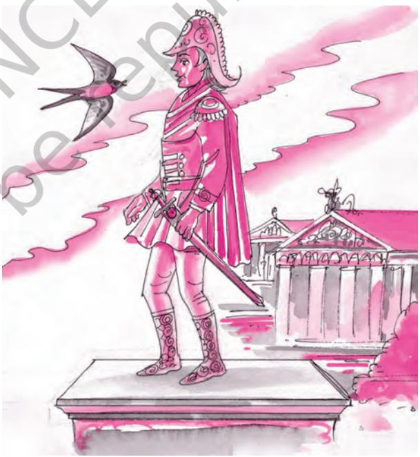
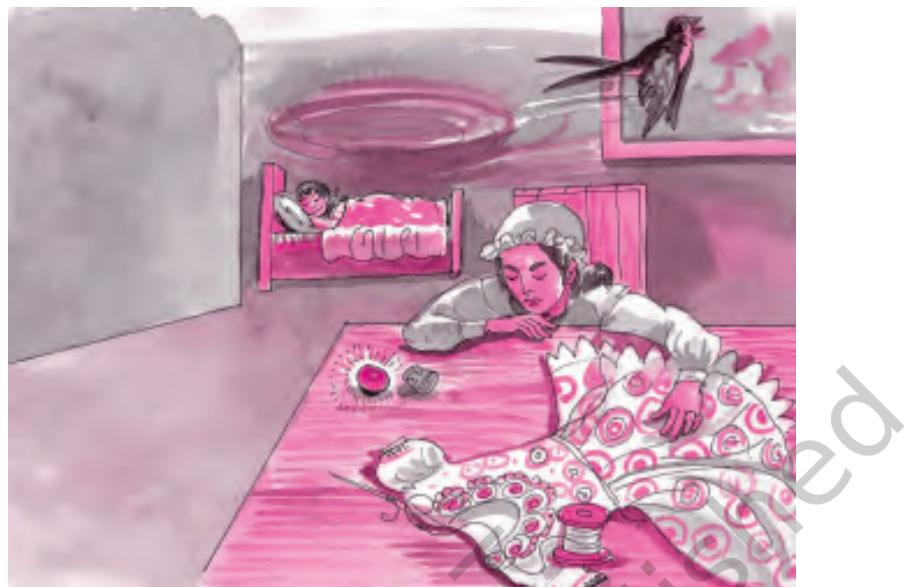
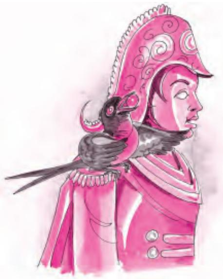
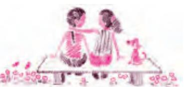
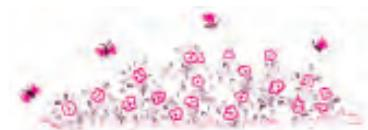
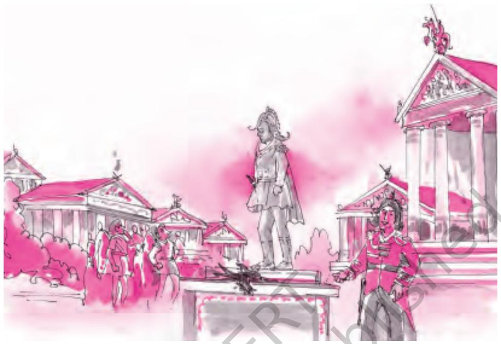
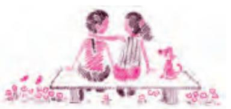

## 5. The Happy Prince

The Happy Prince was a beautiful statue. He was covered with gold, he had sapphires for eyes, and a ruby in his sword. Why did he want to part with all the gold that he had, and his precious stones?

HIGH above the city, on a tall column, stood the statue of the Happy Prince. He was gilded all over with thin leaves of fine gold, for eyes he had two bright sapphires, and a large red ruby glowed on his sword hilt.

One night there flew over the city a little swallow. His friends had gone away to Egypt six weeks before, but he had stayed behind; then he decided to go to Egypt too.

All day long he flew, and at night time he arrived at the city.

"Where shall I put up?" he said. "I hope the town has made preparations."

Then he saw the statue on the tall column.

"I will put up there," he cried. "It is a fine position with plenty of fresh air." So he alighted just between the feet of the Happy Prince.

"I have a golden bed-room," he said softly to himself as he looked round, and he

prepared to go to sleep; but just as he was putting his head under his wing a large drop of water fell on him. "What a curious thing!" he cried. "There is not a single cloud in the sky, the stars are quite clear and bright, and yet it is raining."

Then another drop fell.

"What is the use of a statue if it cannot keep the rain off ?" he said. "I must look for a good chimney pot," and he determined to fly away.

But before he had opened his wings, a third drop fell, and he looked up, and saw — Ah! What did he see?

The eyes of the Happy Prince were filled with tears, and tears were running down his golden cheeks. His face was so beautiful in the moonlight that the little swallow was filled with pity.

"Who are you?" he said.

"I am the Happy Prince."

"Why are you weeping then?" asked the swallow. "You have quite drenched me."

"When I was alive and had a human heart," answered the statue, "I did not know what tears were, for I lived in the Palace, where sorrow is not allowed to enter. My courtiers called me the Happy Prince, and happy indeed I was. So I lived, and so I died. And now that I am dead they have set me up here so high that I can see the ugliness and all the misery of my city, and though my heart is made of lead yet I cannot choose but weep."

'What! Is he not solid gold?' said the swallow to himself. He was too polite to make any personal remarks.

"Far away," continued the statue in a low musical voice, "far away in a little street there is a poor house. One of the windows is open, and through it I can see a woman seated at a table. Her face is thin and worn, and she has coarse, red hands, all pricked by the needle, for she is a seamstress. She is embroidering flowers on a satin gown for the loveliest of the Queen's maids of honour, to wear at the next Court ball. In a bed in the corner of the room her little boy is lying ill. He has a fever, and is asking his mother to give him oranges. His mother has nothing to give him but river water, so he is crying. Swallow, Swallow, little Swallow, will you not bring her the ruby out of my sword hilt? My feet are fastened to this pedestal and I cannot move."

The Happy Prince/ 29

"I am waited for in Egypt," said the swallow. "My friends are flying up and down the Nile, and talking to the large lotus flowers. Soon they will go to sleep."

The Prince asked the swallow to stay with him for one night and be his messenger. "The boy is so thirsty, and the mother so sad," he said.

"I don't think I like boys," answered the swallow. "I want to go to Egypt."

But the Happy Prince looked so sad that the little swallow was sorry. "It is very cold here," he said. But he agreed to stay with him for one night and be his messenger.

"Thank you, little Swallow," said the Prince.

The swallow picked out the great ruby from the Prince's sword, and flew away with it in his beak over the roofs of the town.

He passed by the cathedral tower, where the white marble angels were sculptured. He passed by the palace and heard the sound of dancing. A beautiful girl came out on the balcony with her lover.

"I hope my dress will be ready in time for the State ball," she said. "I have ordered flowers to be embroidered on it, but the seamstresses are so lazy."

He passed over the river, and saw the lanterns hanging on the masts of the ships. At last he came to the poor woman's house and looked in. The boy was tossing feverishly on his bed, and the mother had fallen asleep, she was so tired. In he hopped, and laid the great ruby on the table beside the woman's thimble. Then he flew gently round the bed, fanning the boy's forehead with his wings. "How cool I feel!" said the boy, "I must be getting better;" and he sank into a delicious slumber.

Then the swallow flew back to the Happy Prince, and told him what he had done. "It is curious," he remarked, "but I feel quite warm now, although it is so cold."

"That is because you have done a good action," said the Prince. And the little swallow began to think, and then fell asleep. Thinking always made him sleepy.

When day broke he flew down to the river and had a bath. "Tonight I go to Egypt," said the swallow, and he was in high

30 / Moments

spirits at the prospect. He visited all the monuments and sat a long time on top of the church steeple.

When the moon rose he flew back to the Happy Prince.

"Have you any commissions for Egypt?" he cried. "I am just starting."

"Swallow, Swallow, little Swallow," said the Prince, "will you stay with me one night longer?"

"I am waited for in Egypt," answered the swallow.

"Swallow, Swallow, little Swallow," said the Prince, "far away across the city I see a young man in a garret. He is leaning over a desk covered with papers, and in the glass by his side there is a bunch of withered violets. His hair is brown and crisp, and his lips are red as a pomegranate, and he has large and dreamy eyes. He is trying to finish a play for the Director of the Theatre, but he is too cold to write any more. There is no fire in the grate, and hunger has made him faint."

"I will wait with you one night longer," said the swallow, who really had a good heart. He asked if he should take another ruby to the young playwright.

"Alas! I have no ruby now," said the Prince. "My eyes are all that I have left. They are made of rare sapphires, which were

The Happy Prince/ 31

brought out of India a thousand years ago." He ordered the swallow to pluck out one of them and take it to the playwright. "He will sell it to the jeweller, and buy firewood, and finish his play," he said.

"Dear Prince," said the swallow, "I cannot do that," and he began to weep.

"Swallow, Swallow, little Swallow," said the Prince, "do as I command you."

So the swallow plucked out the Prince's eye, and flew away to the young man's garret. It

was easy enough to get in, as there was a hole in the roof. Through this he darted, and came into the room. The young man had his head buried in his hands, so he did not hear the flutter of the bird's wings, and when he looked up he found the beautiful sapphire lying on the withered violets.

"I am beginning to be appreciated," he cried. "This is from some great admirer. Now I can finish my play," and he looked quite happy.

The next day the swallow flew down to the harbour. He sat on the mast of a large vessel and watched the sailors working. "I am going to Egypt," cried the swallow, but nobody minded, and when the moon rose he flew back to the Happy Prince.

"I have come to bid you goodbye," he cried.

"Swallow, Swallow, little Swallow," said the Prince, "will you not stay with me one night longer?"

"It is winter," answered the swallow, "and the snow will soon be here. In Egypt the sun is warm on the green palm trees, and the crocodiles lie in the mud and look lazily about them."

"In the square below," said the Happy Prince, "there stands a little matchgirl. She has let her matches fall in the gutter, and they are all spoiled. Her father will beat her if she does not bring home some money, and she is crying. She has no shoes or

32 / Moments

stockings, and her little head is bare. Pluck out my other eye, and give it to her, and her father will not beat her."

"I will stay with you one night longer," said the swallow, "but I cannot pluck out your eye. You would be quite blind then."

"Swallow, Swallow, little Swallow," said the Prince, "do as I command you."

So he plucked out the Prince's other eye, and darted down with it. He swooped past the matchgirl, and slipped the jewel into the palm of her hand.

"What a lovely bit of glass!" cried the little girl; and she ran home, laughing.

Then the swallow came back to the Prince. "You are blind now," he said, "so I will stay with you always."

"No, little Swallow," said the poor Prince, "you must go away to Egypt."

"No, I will stay with you always," said the swallow, and he slept at the Prince's feet.

All the next day he sat on the Prince's shoulder, and told him stories of what he had seen in strange lands.

"Dear little Swallow," said the Prince, "you tell me of marvellous things, but more marvellous than anything is the suffering of men and women. There is no Mystery so great as Misery. Fly over my city, little Swallow, and tell me what you see there."

So the swallow flew over the great city, and saw the rich making merry in their beautiful houses, while the beggars were sitting at the gates. He flew into dark lanes, and saw the white faces of starving children looking out listlessly at the black streets. Under the archway of a bridge two little boys were lying in each other's arms to try and keep themselves warm. "How hungry we are!" they said. "You must not lie here," shouted the watchman, and they wandered out into the rain.

Then he flew back and told the Prince what he had seen.

"I am covered with fine gold," said the Prince. "You must take it off, leaf by leaf, and give it to the poor; the living always think that gold can make them happy."

Leaf after leaf of the fine gold the swallow picked off, till the Happy Prince looked quite dull and grey. Leaf after leaf of the

fine gold he brought to the poor, and the children's faces grew rosier, and they laughed and played in the street. "We have bread now!" they cried.

Then the snow came, and after the snow came the frost. The streets looked as if they were made of silver. Everybody went about in furs, and the little boys wore scarlet caps and skated on the ice.

The poor little swallow grew colder and colder, but he would not leave the Prince, he loved him too well. He picked up crumbs outside the baker's door when the baker was not looking, and tried to keep himself warm by flapping his wings.

But at last he knew that he was going to die. He had just enough strength to fly up to the Prince's shoulder once more. "Goodbye, dear Prince!" he murmured. "Will you let me kiss your hand?

"I am glad that you are going to Egypt at last, little Swallow," said the Prince. "You have stayed too long here but you must kiss me on the lips, for I love you."

"It is not to Egypt that I am going," said the swallow. "I am going to the House of Death. Death is the brother of Sleep, is he not?"

And he kissed the Happy Prince on the lips, and fell down dead at his feet.

At that moment a curious crack sounded inside the statue, as if something had broken. The fact is that the leaden heart had snapped right in two. It certainly was a dreadfully hard frost.

Early the next morning the Mayor was walking in the square below in company with the Town Councillors. As they passed the column he looked up at the statue. "Dear me! How shabby the Happy Prince looks!" he said.

"How shabby, indeed!" cried the Town Councillors, who always agreed with the Mayor and they went up to look at it.

"The ruby has fallen out of his sword, his eyes are gone, and he is golden no longer," said the Mayor. "In fact, he is little better than a beggar!"

"Little better than a beggar," said the Town Councillors.

"And here is actually a dead bird at his feet!" continued the Mayor. "We must really issue a proclamation that birds are not

34 / Moments

to be allowed to die here." And the Town Clerk made a note of the suggestion.

So they pulled down the statue of the Happy Prince. "As he is no longer beautiful he is no longer useful," said the Art Professor at the University.

Then they melted the statue in a furnace. "What a strange thing!" said the overseer of the workmen at the foundry. "This broken lead heart will not melt in the furnace. We must throw it away." So they threw it on a dust heap where the dead swallow was also lying.

*"Bring me the two most precious things in the city," said God to one of His Angels; and the Angel brought Him the leaden heart and the dead bird.*

*"You have rightly chosen," said God, "for in my garden of Paradise this little bird shall sing for ever more and in my city of gold the Happy Prince shall praise me."*

OSCAR WILDE

The Happy Prince/ 35

## Glossary

seamstress: a woman who makes a living by sewing

- thimble: a metal or plastic cap with a closed end, worn to protect the finger and push the needle in sewing

garret: small dark room at the top of the house

- 1. Why do the courtiers call the prince 'the Happy Prince'? Is he really happy? What does he see all around him?
- 2. Why does the Happy Prince send a ruby for the seamstress? What does the swallow do in the seamstress' house?
- 3. For whom does the prince send the sapphires and why?
- 4. What does the swallow see when it flies over the city?
- 5. Why did the swallow not leave the prince and go to Egypt?
- 6. What are the precious things mentioned in the story? Why are they precious?

The little swallow says, "It is curious, but I feel quite warm now, although it is so cold." Have you ever had such a feeling? Share your experience with your friends.

- l 'The Selfish Giant' by Oscar Wilde.
- l 'How Much Land Does a Man Require?' by Leo Tolstoy

