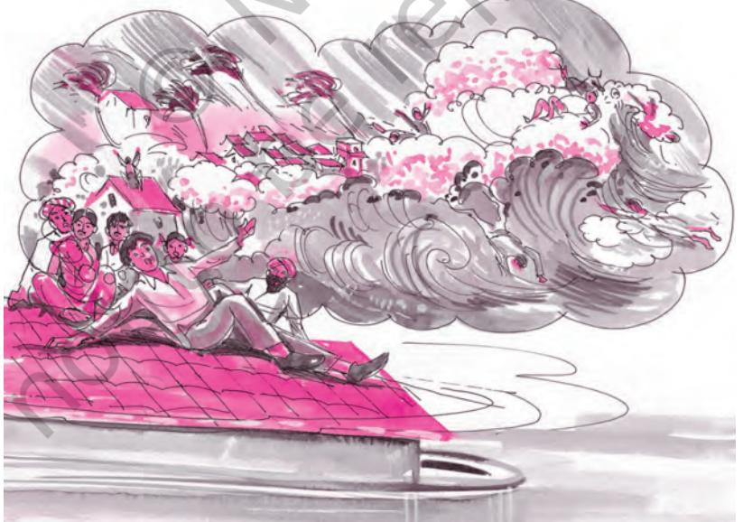
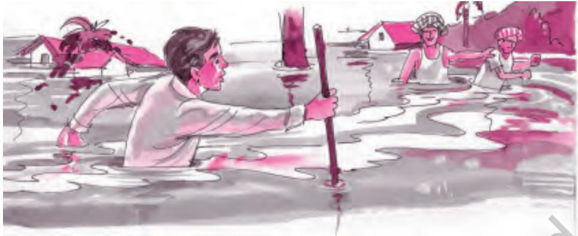
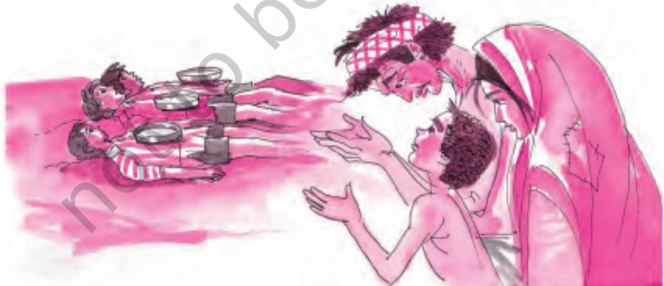
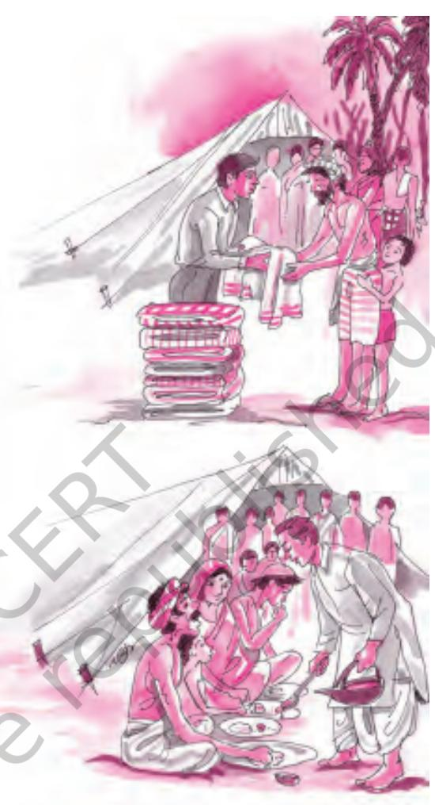

## 6. Weathering the Storm in Ersama

The cyclone that hit Orissa in October 1999 killed thousands of people and devastated hundreds of villages. For two dreadful nights Prashant, a young man, was marooned on the roof of a house. On the third day he decided to go to his village. Did he find his family?

ON 27 October 1999, seven years after his mother's death, Prashant had gone to the block headquarters of Ersama, a small town in coastal Orissa, some eighteen kilometres from his village, to spend the day with a friend. In the evening, a dark and menacing storm quickly gathered. Winds beat against the houses with a speed and fury that Prashant had never witnessed before. Heavy and incessant rain filled the darkness, ancient trees were

uprooted and crashed to the earth. Screams rent the air as people and houses were swiftly washed away. The angry waters swirled into his friend's house, neck deep. The building was of brick and mortar and was strong enough to survive the devastation of the wind's velocity of 350 km per hour. But the cold terror of the family grew with the crashing of trees that had got uprooted and fallen on their house, some time in the middle of the night, damaging its roof and walls.

The crazed destruction wrought by the cyclone and the surge of the ocean continued for the next thirty-six hours, although wind speeds had reduced somewhat by the next morning. To escape the waters rising in the house, Prashant and his friend's family had taken refuge on the roof. Prashant will never forget the shock he experienced at his first glimpse of the devastation wrought by the super cyclone, in the grey light of the early morning. A raging, deadly, brown sheet of water covered everything as far as the eye could see; only fractured cement houses still stood in a few places. Bloated animal carcasses and human corpses floated in every direction. All round even huge old trees had fallen. Two coconut trees had fallen on the roof of their house. This was a blessing in disguise, because the tender coconuts from the trees kept the trapped family from starving in the several days that followed.

For the next two days, Prashant sat huddled with his friend's family in the open on the rooftop. They froze in the cold and incessant rain; the rain water washed away Prashant's tears. The only thought that flashed through his mind was whether his family had survived the fury of the super cyclone. Was he to be bereaved once again?

Two days later, which seemed to Prashant like two years, the rain ceased and the rain waters slowly began to recede. Prashant was determined to seek out his family without further delay. But the situation was still dangerous, and his friend's family pleaded with Prashant to stay back a little while longer. But Prashant knew he had to go.

He equipped himself with a long, sturdy stick, and then started on his eighteen-kilometre expedition back to his village through the swollen flood waters. It was a journey he would never forget. He constantly had to use his stick to locate the road, to determine

38 / Moments

where the water was most shallow. At places it was waist deep, and progress was slow. At several points, he lost the road and had to swim. After some distance, he was relieved to find two friends of his uncle who were also returning to their village. They decided to move ahead together.

As they waded through the waters, the scenes they witnessed grew more and more macabre. They had to push away many human bodies — men, women, children — and carcasses of dogs, goats and cattle that the current swept against them as they moved ahead. In every village that they passed, they could barely see a house standing. Prashant now wept out loud and long. He was sure that his family could not have survived this catastrophe.

Eventually, Prashant reached his village, Kalikuda. His heart went cold. Where their home once stood, there were only remnants of its roof. Some of their belongings were caught, mangled and twisted in the branches of trees just visible above the dark waters. Young Prashant decided to go to the Red Cross shelter to look for his family.

Among the first people he saw in the crowd was his maternal grandmother. Weak with hunger, she rushed to him, her hands outstretched, her eyes brimming. It was a miracle. They had long given him up for dead.

Quickly word spread and his extended family gathered around him, and hugged him tight in relief. Prashant anxiously scanned the motley, battered group. His brother and sister, his uncles and aunts, they all seemed to be there.

Weathering the Storm in Ersama/ 39

By the next morning, as he took in the desperate situation in the shelter, he decided to get a grip over himself. He sensed a deathly grief settling upon the 2500 strong crowd in the shelter. Eighty-six lives were lost in the village. All the ninety-six houses had been washed away. It was their fourth day at the shelter. So far they had survived on green coconuts, but there were too few to go around such a tumult of people.

Prashant, all of nineteen years, decided to step in as leader of his village, if no one else did. He organised a group of youths and elders to jointly pressurise the merchant once again to part with his rice. This time the delegation succeeded and returned triumphantly, wading through the receding waters with food for the entire shelter. No one cared that the rice was already rotting. Branches from fallen trees were gathered to light a reluctant and slow fire, on which to cook the rice. For the first time in four days, the survivors at the cyclone shelter were able to fill their bellies. His next task was to organise a team of youth volunteers to clean the shelter of filth, urine, vomit and floating carcasses, and to tend to the wounds and fractures of the many who had been injured.

On the fifth day, a military helicopter flew over the shelter and dropped some food parcels. It then did not return. The youth task force gathered empty

40 / Moments

utensils from the shelter. Then they deputed the children to lie in the sand left by the waters around the shelter with these utensils on their stomachs, to communicate to the passing helicopters that they were hungry. The message got through, and after that the helicopter made regular rounds of the shelter, airdropping food and other basic needs.

Prashant found that a large number of children had been orphaned. He brought them together and put up a polythene sheet shelter for them. Women were mobilised to look after them, while the men secured food and materials for the shelter.

As the weeks passed, Prashant was quick to recognise that the women and children were sinking deeper and deeper in their

grief. He persuaded the women to start working in the food-forwork programme started by an NGO, and for the children he organised sports events. He himself loved to play cricket, and so he organised cricket matches for children. Prashant engaged, with other volunteers, in helping the widows and children to pick up the broken pieces of their lives. The initial government plan was to set up institutions for orphans and widows. However, this step was successfully resisted, as it was felt that in such institutions, children would grow up without love, and widows

Weathering the Storm in Ersama/ 41

would suffer from stigma and loneliness. Prashant's group believed orphans should be resettled in their own community itself, possibly in new foster families made up of childless widows and children without adult care.

It is six months after the devastation of the super cyclone. This time Prashant's wounded spirit has healed simply because he had no time to bother about his own pain. His handsome, youthful face is what the widows and orphaned children of his village seek out most in their darkest hour of grief.

HARSH MANDER

## Glossary

menacing: dangerous and harmful incessant: unceasing; continual swirled: moved or flowed along with a whirling motion carcasses: dead bodies of animals bereaved: lost a close relation or friend through his/her death remnants: small remaining quantities motley: disparate; varied in appearance or character tumult: uproar of a disorderly crowd

- 1. What havoc has the super cyclone wreaked in the life of the people of Orissa?
- 2. How has Prashant, a teenager, been able to help the people of his village?
- 3. How have the people of the community helped one another? What role do the women of Kalikuda play during these days?
- 4. Why do Prashant and other volunteers resist the plan to set up institutions for orphans and widows? What alternatives do they consider?

- 5. Do you think Prashant is a good leader? Do you think young people can get together to help people during natural calamities?

Talk about the preparedness of the community for a natural disaster.

(You can talk about evacuation plans and rehabilitation; permanent safe shelters; warning systems; relief efforts; building materials to withstand cyclone/flood/earthquake, i.e. safe housing; peoples' organisation of their own rescue; the survival instinct, etc.)

- l 'A Home on the Street' by Harsh Mander
- l 'Paying for His Tea' by Harsh Mander
- l *Eton Munda Won the Battle* by Mahasweta Devi

Weathering the Storm in Ersama/ 43

