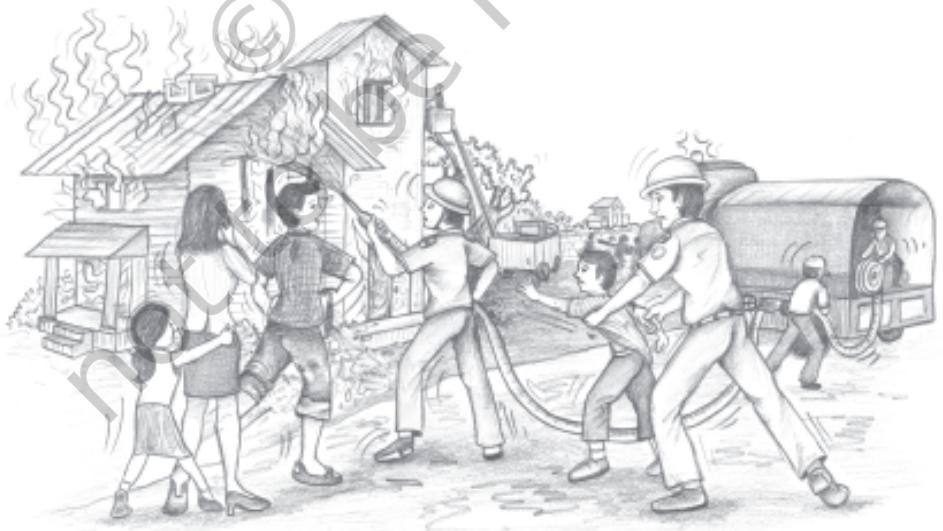
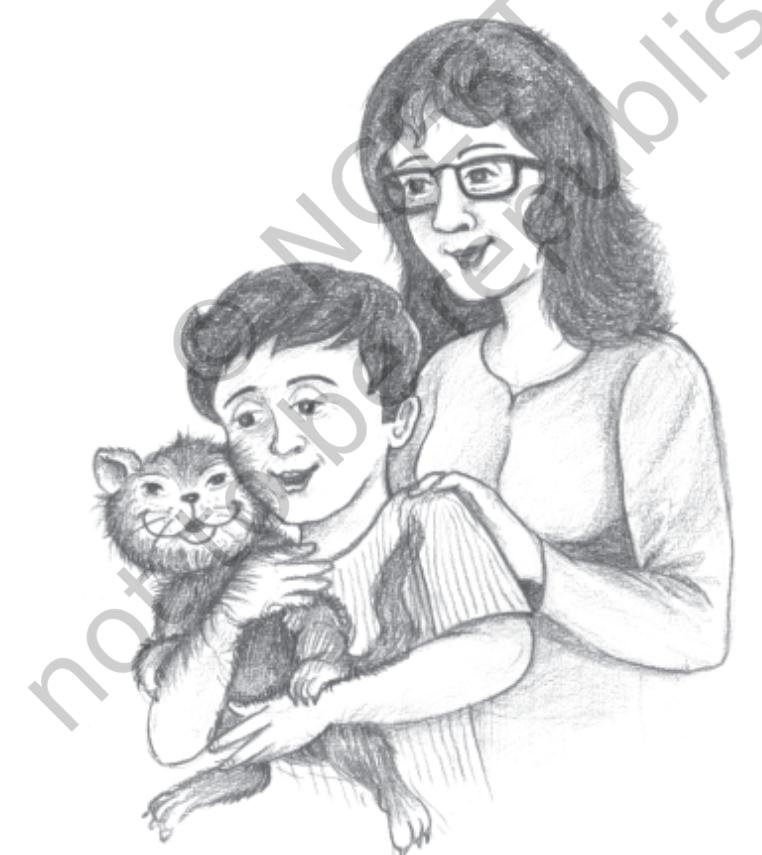

This story reflects the challenges of being a teenager, and the problems of growing up. How does the author overcome his problems?

MY first year of high school felt awkward. After leaving junior high at the head of my class with all the seniority the upper grade levels could afford me, it felt strange starting over as a freshman. The school was twice as big as my old school, and to make matters worse, my closest friends were sent to a different high school. I felt very isolated.

I missed my old teachers so much that I would go back and visit them. They would encourage me to get involved in school activities so that I could meet new people. They told me that in time I would adjust and probably end up loving my new school more than I had my old one. They made me promise that when that happened I would still come by and visit them from time to time. I understood the psychology in what they were saying, but I took some comfort in it nonetheless.

One Sunday afternoon, not long after I had started high school, I was sitting at home at our dining-room table doing homework. It was a cold and windy fall day, and we had a fire going in our fireplace. As usual, my red tabby cat was lying on top of all my papers, purring loudly and occasionally swatting at my pen for entertainment's sake.

She was never far from me. I had rescued her when she was a kitten, and somehow she knew that I was the one responsible for giving her 'the good life'.

My mother kept stoking the fire to keep the house nice and warm. Suddenly, I smelled something strange, and then I noticed it... smoke pouring in through the seams of the ceiling. The smoke began to fill the room so quickly that we could barely see. Groping our way to the front door, we all ran out into the front yard. By the time we made our way outside, the whole roof was engulfed in flames and it was spreading quickly. I ran to the neighbours to call the fire department, while I watched my mother run back into the house.

My mother then ran out of the house carrying a small metal box full of important documents. She dropped the case on the lawn and, in a crazed state, ran back into the house. I knew what she was after. My father had died when I was young, and I was certain that she was not going to let his pictures and letters go up in flames. They were the only things that she had to remember him by. Still I screamed at her, "Mom! No!"

I was about to run after her when I felt a large hand hold me back. It was a fireman. I hadn't even noticed that the street had already filled with fire trucks. I was trying to free myself from his grasp, yelling, "You don't understand, my mother's in there!"

He held on to me while other firefighters ran into the house. He knew that I wasn't acting very logically and that if he were to let go, I'd run. He was right.

"It's all right, they'll get her," he said.

He wrapped a blanket around me and sat me down in our car. Soon after that, a fireman emerged from our house with

my mom in tow. He quickly took her over to the truck and put an oxygen mask on her. I ran over and hugged her. All those times I ever argued with her and hated her vanished at the thought of losing her.

"She's going to be okay," said the fireman. "She just inhaled a little smoke." And then he ran back to fight the fire while my mother and I sat there dazed. I remember watching my house burn down and thinking that there was nothing I could do about it.

Five hours later, the fire was finally out. Our house was almost completely burned down. But then it struck me ...I hadn't seen my cat. Where was my cat? Much to my horror, I realised that she was nowhere to be found. Then all at once it hit me — the new school, the fire, my cat — I broke down in tears and cried and cried. I was suffering loss, big time.

The firemen wouldn't let us go back into the house that night. It was still too dangerous. Dead or alive, I couldn't imagine leaving without knowing about my cat. Regardless, I had to go. We piled into the car with just the clothes on our backs and a few of the firemen's blankets, and made our way to my grandparents' house to spend the night.

The next day, Monday, I went to school. When the fire broke out, I was still wearing the dress I had worn to church that morning but I had no shoes! I had kicked them off when I was doing my homework. They became yet another casualty of the fire. So I had to borrow some tennis shoes from my aunt. Why couldn't I just stay home from school? My mother wouldn't hear of it, but I was totally embarrassed by everything. The clothes I was wearing looked weird, I had no books or homework, and my backpack was gone. I had my life in that backpack! The more I tried to fit in, the worse it got. Was I destined to be an outcast and a geek all my life? That's what it felt like. I didn't want to grow up, change or have to handle life if it was going to be this way. I just wanted to curl up and die.

I walked around school like a zombie. Everything felt surreal, and I wasn't sure what was going to happen. All the security I had known, from my old school, my friends, my house and my cat had all been ripped away.

A House Is Not a Home/ 51

When I walked through what used to be my house after school that day, I was shocked to see how much damage there was whatever hadn't burned was destroyed by the water and chemicals they had used to put out the fire. The only material things not destroyed were the photo albums, documents and some other personal items that my mother had managed to heroically rescue. But my cat was gone and my heart ached for her.

There was no time to grieve. My mother rushed me out of the house. We would have to find a place to live, and I would have to go buy some clothes for school.

We had to borrow money from my grandparents because there were no credit cards, cash or even any identification to be able to withdraw money from the bank. Everything had gone up in smoke.

That week the rubble that used to be our house was being cleared off the lot. Even though we had rented an apartment nearby, I would go over to watch them clear away debris, hoping that my cat was somewhere to be found. She was gone. I kept thinking about her as that vulnerable little kitten. In the early morning when I would disturb her and get out of bed, she would tag along after me, climb up my robe and crawl into my pocket to fall asleep. I was missing her terribly.

It always seems that bad news spreads quickly, and in my case it was no different. Everyone in high school, including the teachers, was aware of my plight. I was embarrassed as if somehow I were responsible. What a way to start off at a new school! This was not the kind of attention I was looking for.

The next day at school, people were acting even more strange than usual. I was getting ready for gym class at my locker. People were milling around me, asking me to hurry up. I thought it strange, but in the light of the past few weeks, nothing would surprise me. It almost seemed that they were trying to shove me into the gym — then I saw why. There was a big table set up with all kinds of stuff on it, just for me. They had taken up a collection and bought me school supplies, notebooks, all kinds of different clothes — jeans, tops, sweatsuits. It was like Christmas. I was overcome by emotion. People who had never spoken to me before were coming up to me to introduce themselves. I got all kinds of invitations to their houses. Their genuine outpouring of concern

52 / Moments

really touched me. In that instant, I finally breathed a sigh of relief and thought for the first time that things were going to be okay. I made friends that day.

A month later, I was at my house watching them rebuild it. But this time it was different — I wasn't alone. I was with two of my new friends from school. It took a fire for me to stop focusing on my feelings of insecurity and open up to all the wonderful people around me. Now I was sitting there watching my house being rebuilt when I realised my life was doing the same thing.

While we sat there on the curb, planning my new bedroom, I heard someone walk up to me from behind and say, "Does this belong to you?" When I turned around to see who it was, I couldn't believe my eyes. A woman was standing there holding my cat! I leapt up and grabbed her out of the woman's arms. I held her

A House Is Not a Home/ 53

close to me and cried into that beautiful orange fur. She purred happily. My friends were hugging me, hugging the cat and jumping around.

Apparently, my cat had been so freaked by the fire that she ran over a mile away. Her collar had our phone number on it, but our phones had been destroyed and disconnected. This wonderful woman took her in and worked hard to find out whose cat it was. Somehow, she knew this cat was loved and sorely missed.

As I sat there with my friends and my cat curled up in my lap, all the overwhelming feelings of loss and tragedy seemed to diminish. I felt gratitude for my life, my new friends, the kindness of a stranger and the loud purr of my beloved cat. My cat was back and so was I.

ZAN GAUDIOSO

## Glossary

stoking the fire: feeding and tending the fire zombie: a dull and apathetic person surreal: strange; bizarre milling around: moving in an aimless manner shove: push hard

## THINK ABOUT IT

- 1. What does the author notice one Sunday afternoon? What is his mother's reaction? What does she do?
- 2. Why does he break down in tears after the fire?
- 3. Why is the author deeply embarrassed the next day in school? Which words show his fear and insecurity?
- 4. The cat and the author are very fond of each other. How has this been shown in the story? Where was the cat after the fire? Who brings it back and how?
- 5. What actions of the schoolmates change the author's understanding of life and people, and comfort him

54 / Moments

emotionally? How does his loneliness vanish and how does he start participating in life?

- 6. What is the meaning of "My cat was back and so was I"? Had the author gone anywhere? Why does he say that he is also back?

Have any of your classmates/schoolmates had an experience like the one described in the story where they needed help? Describe how they were helped.

- l *Her Story So Far: Tales of the Girl Child in India* edited by Monica Das
- l *Modern Hindi Stories* edited by Indu Jain
- l *Malgudi Days* by R.K. Narayan

A House Is Not a Home/ 55

