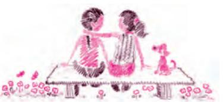
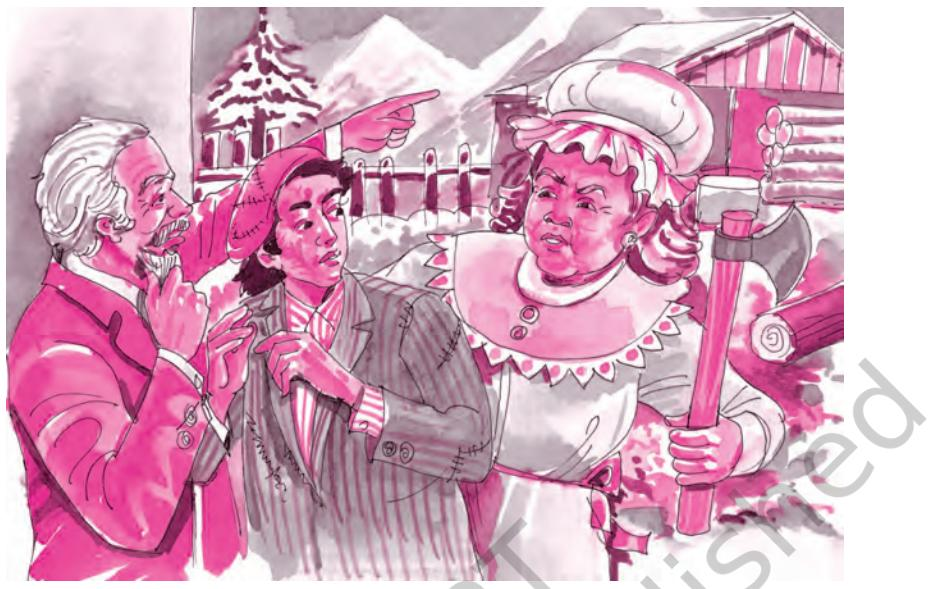
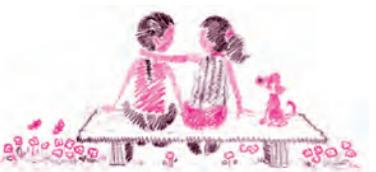
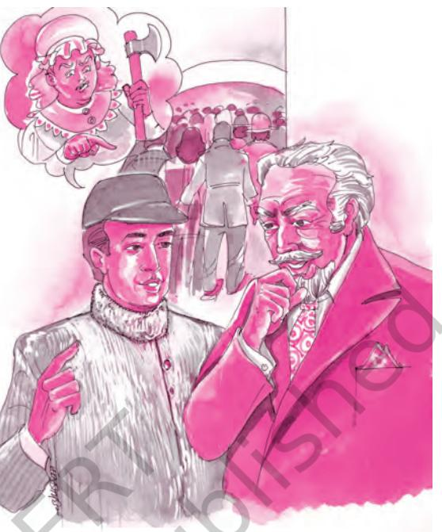
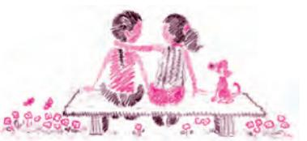

9. The Beggar

What induced the beggar, Lushkoff, to change his ways? Let's read and find out.

"KIND sir, have pity; turn your attention to a poor, hungry man! For three days I have had nothing to eat; I haven't five copecks for a lodging, I swear it before God. For eight years I was a village schoolteacher and then I lost my place through intrigues. I fell a victim to calumny. It is a year now since I have had anything to do."

The advocate, Sergei, looked at the ragged, fawn-coloured overcoat of the suppliant, at his dull, drunken eyes, at the red spot on either cheek, and it seemed to him as if he had seen this man somewhere before.

"I have now had an offer of a position in the province of Kaluga," the mendicant went on, "but I haven't the money to get there. Help me kindly; I am ashamed to ask, but — I am obliged to by circumstances."

Sergei's eyes fell on the man's overshoes, one of which was high and the other low, and he suddenly remembered something.

"Look here, it seems to me I met you the day before yesterday in Sadovya Street," he said; "but you told me then that you were a student who had been expelled, and not a village schoolteacher. Do you remember?"

"N-no, that can't be so," mumbled the beggar, taken aback. "I am a village schoolteacher, and if you like I can show you my papers."

"Have done with lying! You called yourself a student and even told me what you had been expelled for. Don't you remember?"

Sergei flushed and turned from the ragged creature with an expression of disgust.

"This is dishonesty, my dear sir!" he cried angrily. "This is swindling — I shall send the police for you, damn you!"

"Sir!" he said, laying his hand on his heart, "the fact is I was lying! I am neither a student nor a schoolteacher. All that was fiction. Formerly I sang in a Russian choir and was sent away for drunkenness. But what else can I do? I can't get along without lying. No one will give me anything when I tell the truth, what can I do?"

"What can you do? You ask what you can do?" cried Sergei, coming close to him. "Work! That's what you can do! You must work!"

"Work — yes. I know that myself; but where can I find work?" "How would you like to chop wood for me?"

"I wouldn't refuse to do that, but in these days even skilled wood-cutters find themselves sitting without bread."

"Will you come and chop wood for me?"

"Yes sir, I will."

"Very well; we'll soon find out."

Sergei hastened along, rubbing his hands. He called his cook out of the kitchen.

"Here, Olga," he said, "take this gentleman into the wood-shed and let him chop wood."

The scarecrow of a beggar shrugged his shoulders, as if in perplexity, and went irresolutely after the cook. It was obvious from his gait that he had not consented to go and chop wood because he was hungry and wanted work, but simply from pride and shame and because he had been trapped by his own words. It was obvious, too, that his strength had been undermined by vodka and that he was unhealthy and did not feel the slightest inclination for toil.

Sergei hurried into the dining-room. From its windows one could see the wood-shed and everything that went on in the yard. Standing at the window, Sergei saw the cook and the beggar come out into the yard by the back door and make their way across the dirty snow to the shed. Olga glared wrathfully at her companion, shoved him aside with her elbow, unlocked the shed, and angrily banged the door.

The Beggar/ 57

Next he saw the pseudo-teacher seat himself on a log and become lost in thought with his red cheeks resting on his fists. The woman flung down an axe at his feet, spat angrily, and, judging from the expression of her lips, began to scold him. The beggar irresolutely pulled a billet of wood towards him, set it up between his feet, and tapped it feebly with the axe. The billet wavered and fell down. The beggar again pulled it to him, blew on his freezing hands, and tapped it with his axe cautiously, as if afraid of hitting his overshoe or of cutting off his finger; the stick of wood again fell to the ground.

Sergei's anger had vanished and he now began to feel a little sorry and ashamed of himself for having set a spoiled, drunken, perhaps sick man to work at menial labour in the cold.

An hour later Olga came in and announced that the wood had all been chopped.

"Good! Give him half a rouble," said Sergei. "If he wants to he can come back and cut wood on the first day of each month. We can always find work for him."

On the first of the month the waif made his appearance and again earned half a rouble, although he could barely stand on his legs. From that day on he often appeared in the yard and every

58 / Moments

time work was found for him. Now he would shovel snow, now put the wood-shed in order, now beat the dust out of rugs and mattresses. Every time he received from twenty to forty copecks, and once, even a pair of old trousers were sent out to him.

When Sergei moved into another house he hired him to help in the packing and hauling of the furniture. This time the waif was sober, gloomy, and silent. He hardly touched the furniture, and walked behind the wagons hanging his head, not even making a pretence of appearing busy. He only shivered in the cold and became embarrassed when the carters jeered at him for his idleness, his feebleness, and his tattered, fancy overcoat. After the moving was over Sergei sent for him.

"Well, I am happy that my words have taken effect,'" he said, handing him a rouble. "Here's for your pains. I see you are sober and have no objection to work. What is your name?'"

"Lushkoff."

"Well, Lushkoff, I can now offer you some other, cleaner employment. Can you write?'"

"I can."

"Then take this letter to a friend of mine tomorrow and you will be given some copying to do. Work hard, don't drink, and remember what I have said to you. Goodbye!"

Pleased at having put a man on the right path, Sergei tapped Lushkoff kindly on the shoulder and even gave him his hand at parting. Lushkoff took the letter, and from that day forth came no more to the yard for work.

Two years went by. Then one evening, as Sergei was standing at the ticket window of a theatre paying for his seat, he noticed a little man beside him with a coat collar of curly fur and a worn sealskin cap. This little individual timidly asked the ticket seller for a seat in the gallery and paid for it in copper coins.

"Lushkoff, is that you?" cried Sergei, recognising in the little man his former wood-chopper. "How are you? What are you doing? How is everything with you?"

"All right. I am a notary now and am paid thirty-five roubles a month."

The Beggar/ 59

"Thank Heaven! That's fine! I am delighted for your sake. I am very, very glad, Lushkoff. You see, you are my godson, in a sense. I gave you a push along the right path, you know. Do you remember what a roasting I gave you, eh? I nearly had you sinking into the ground at my feet that day. Thank you, old man, for not forgetting my words."

"Thank you, too." said Lushkoff. "If I hadn't come to you then I might still have been calling myself a teacher or a

student to this day. Yes, by flying to your protection I dragged myself out of a pit."

"I am very glad, indeed."

"Thank you for your kind words and deeds. I am very grateful to you and to your cook. God bless that good and noble woman! You spoke finely then, and I shall be indebted to you to my dying day; but, strictly speaking, it was your cook, Olga, who saved me."

"How is that?"

"When I used to come to your house to chop wood she used to begin: 'Oh, you sot, you! Oh, you miserable creature! There's nothing for you but ruin.' And then she would sit down opposite me and grow sad, look into my face and weep. 'Oh, you unlucky man! There is no pleasure for you in this world and there will be none in the world to come. You drunkard! You will burn in hell. Oh, you unhappy one!' And so she would carry on, you know, in that strain. I can't tell you how much misery she suffered, how many tears she shed for my sake. But the chief thing was — she

60 / Moments

used to chop the wood for me. Do you know, sir, that I did not chop one single stick of wood for you? She did it all. Why this saved me, why I changed, why I stopped drinking at the sight of her I cannot explain. I only know that, owing to her words and noble deeds, a change took place in my heart; she set me right and I shall never forget it. However, it is time to go now; there goes the bell." Lushkoff bowed and departed to the gallery.

ANTON CHEKHOV

## Glossary

- copeck (also spelt kopeck): Russian coin equal to one hundredth of a rouble
- calumny: the making of false and defamatory statements about someone in order to damage his/her reputation
- suppliant (or supplicant): a person making a humble plea to someone in power or authority

mendicant: beggar

swindling: cheating a person of money

perplexity: state of being puzzled; bewilderment

irresolutely: hesitantly; undecidedly

billet: here, a thick piece of wood

waif: a homeless person

- shovel: remove snow with a shovel (a tool resembling a spade with a broad blade and typically upturned sides)
roasting (an informal or humorous word): here, scolding sot: a habitual drunkard

## THINK ABOUT I T

- 1. Has Lushkoff become a beggar by circumstance or by choice?
- 2. What reasons does he give to Sergei for his telling lies?
- 3. Is Lushkoff a willing worker? Why, then, does he agree to chop wood for Sergei?

The Beggar/ 61

- 4. Sergei says, "I am happy that my words have taken effect." Why does he say so? Is he right in saying this?
- 5. Lushkoff is earning thirty five roubles a month. How is he obliged to Sergei for this?
- 6. During their conversation Lushkoff reveals that Sergei's cook, Olga, is responsible for the positive change in him. How has Olga saved Lushkoff?

How can we help beggars/abolish begging?

- l 'The Man with the Twisted Lip' by Arthur Conan Doyle
- l *The Three Sisters* by Anton Chekhov

