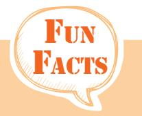
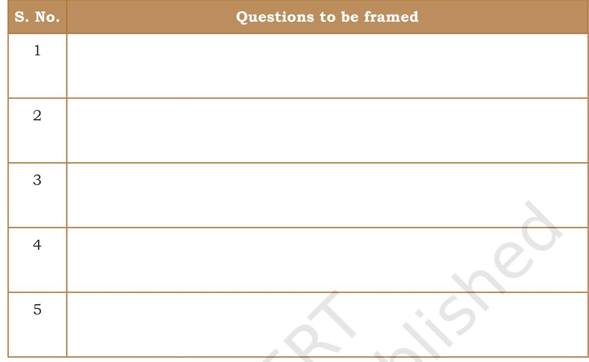
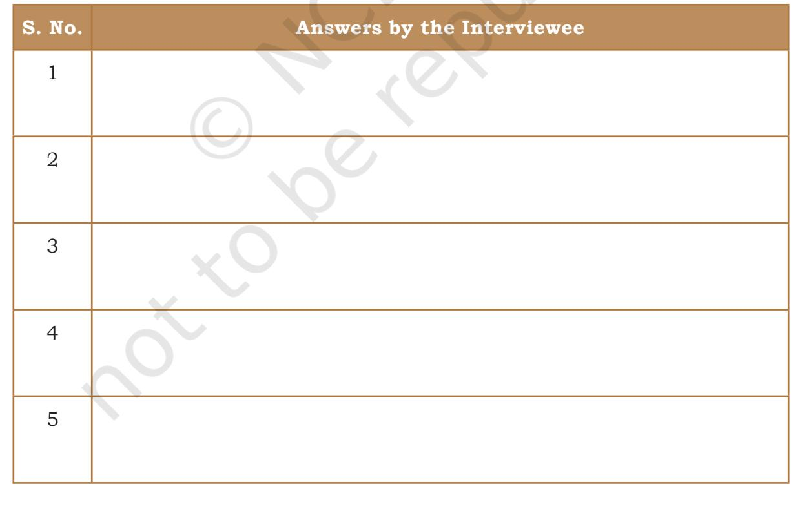

# 2 **Nelson Mandela: Long Walk to Freedom**

;

# **Let's Begin**

UNIT

?

- 1. You have read the story about Nelson Mandela in your textbook, *First Flight,* and the struggle of the people of South Africa. Mandela draws our attention to the meaning and importance of freedom and leading a life with freedom.
 He states that freedom comes with responsibilities. Discuss with your peers, how freedom and responsibilities go hand in hand.

_________________________________________________________

_________________________________________________________

_________________________________________________________

_________________________________________________________

_________________________________________________________

_________________________________________________________

## **Reading Comprehension**

## **Text I**

Given below is a speech by Sardar Patel, one of the prominent figures of India's freedom struggle. This is one of the convocation speeches delivered by him. Read the speech and answer the questions that follow.

### **Sardar Patel's Call to Youth to build Character and be Disciplined**

I must thank you for the affectionate and warm welcome which you have extended to me and for the love and regard which you

Unit-2.indd 17 27-Jun-2019 04:20:40 PM

have shown me by conferring this honour to me. Gifts are of many kinds those achieved by one's own endeavour are good and deserved, but no gift should be conferred on one whose worthiness has not been tested. By selecting me without assuring yourself of my fitness for the gift, you have laid me under a heavy debt and, by your injunctions that I should continue to prove worthy of it throughout my life, you have imposed on me a very difficult obligation. At present, I cannot say anything because I am bound by your love and affection; and, therefore, with your blessing and God's grace, I pray that I may prove worthy of it. Should I fail, the blame for my failure will be shared by you as well.

> On this occasion, I wish to place before you a few thoughts which occur to my mind as incidental to our hard-won freedom. We have now won our freedom. But just as I am doubtful, if I deserved the honour that you have done me, you have also to think whether you have done everything to deserve freedom that you have attained after such a bitter and sustained struggle.

There are people who think that having won freedom, there is nothing more to do about it. Freedom has come to us through sacrifices. Those who made sacrifices tasted the fruit of their efforts and self-denials, but it is for those who are now enjoying freedom to taste its fruit. After the last World War, there is an all-round deterioration in human standards. People have become self-centered. They have forgotten or ignored the wider interests of the country. The essential and noteworthy features of our struggle were: sacrifice, truth, and non-violence. The weapons of the

World War were: violence, brute force, political and military moves, and counter moves. As a result of the churning of the ocean, the world has emitted poison. That poison is spreading all over and there is none to swallow it. The countries which

were free have managed to digest it somewhat, but we, who have just attained our freedom, it is hard to do the same. Therefore, those who think that having attained freedom they have attained everything have really attained nothing! The freedom that we have won is yet to be consolidated. The foundations of freedom have to be well and truly laid! This one-year old child has to be nursed and nourished, instructed and strengthened. It is for us to do it and we must do it.

Unit-2.indd 18 27-Jun-2019 04:20:40 PM

In India today, there is no time for useless controversies and unnecessary debates and disputes. One can indulge in these pastimes when one has time and leisure. At present, we have to occupy ourselves with the all absorbing task of making the foundation of our freedom strong and unassailable. We have to reflect on our place in this broken and destructed world and what our duty and obligations are! If we fail to make the best use of our freedom to make it worthwhile and turn it to our advantage and advancements, future generations will heap curses on us. They will say that a spiritualist, a great soul gave us this precious boon, but we did not know how to retain it and lost it.

I should like to urge upon those who train citizens of tomorrow and to those citizens of tomorrow that we have yet to stand on our feet. We must concentrate on one thing alone, viz., how to make our country strong and united. We can make it strong when hearts are pure and when we fully appreciate our duty. Now that foreign rulers have gone, are we in a position to sustain the whole burden that has devolved on us? When we took over from them, the administrative fabric was in tatters. We have to mend and place it. This, in itself, is a heavy responsibility. It is for our universities to train young men to shoulder these responsibilities.

The great university of life is full of experiences, but to make full use of those experiences, all of us students, teachers and professors—have to be cautious and on guard.

The most essential requisite is character. If your character is lacking and you leave the precincts of the alma mater without your character fully developed, you will be wasting an opportunity of a lifetime.

You have to realise that India has to attain its rightful place in the comity of nations. The leadership of Asia would be hers if she conducts herself well and if her citizens make their fitting contribution to nation's resurgence. Whatever trials and troubles we might have passed through, there is no denying the fact that we have a precious inheritance and the teachings we have received from the departed leaders are great assets for us.

India abounds in the resources of nature and manpower. They are awaiting full use. That task must devolve on young men and women. We ourselves were trained in the school of experience. We fought for freedom and we have attained that prize for you. It is now up to you to prove yourself worthy of the same. This you can do only if you work with single-minded devotion to the cause of the country. It is only then that you can deserve this freedom and be proud of it.

conferring endeavour obligation precincts unassailable Look Up and Understand

Sentences

Unit-2.indd 19 27-Jun-2019 04:20:41 PM

### Look Up and Understand

comity of nations communalism inheritance resurgence

The real danger of India lies in our disunity. That poison of communalism was spread in the past. You should draw a curtain over it. Only then could we equip ourselves for the freedom that has come to us. There are still people in the country whose loyalty to India has not settled down. They should and will leave India.

This is the occasion for mutual help and mutual cooperation. We must know what our duty is as true citizens. Your teacher has to impart that duty. Unless we learn to shoulder our responsibility in the true spirit of discipline and citizenship we cannot go ahead. We must strengthen our shoulders and our legs so that we can stand erect and bear the burden that has devolved on us. Then alone would we secure the real objective of freedom.

> (Source: *The Collected Works of Sardar Vallabhbhai Patel Volume XIII [1 January 1948–31 December 1948],* Editor: P.N. Chopra, Konark Publishers Pvt. Ltd., New Delhi)

**Complete the sentences given below by choosing the most appropriate word or phrase.**

**Q.1. The occasion of the speech of Sardar Patel here is** 

**____________________________________________________.**

- (a) an address to a public gathering
- (b) a convocation address at a university
- (c) a speech in Indian Parliament
- (d) a speech delivered to civil servants
- **Q.2. Patel feels that future generations will heap curses on us if____________________________________________.**
	- (a) we fail to protect our freedom
	- (b) we fail to protect the corrupt people in public life
	- (c) we wage war against other nations
	- (d) we understand the need for peace
- **Q.3. The first and foremost thing Patel stressed to be done is_____________________________________________.**
	- (a) to make the country strong and united
	- (b) to give employment to everyone
	- (c) to fight a war against those who oppressed us
	- (d) to make every citizen feel happy

20 Words and Expressions 2 – Class X

Unit-2.indd 20 27-Jun-2019 04:20:41 PM

| Q.4. | One major characteristic of university education, | as Sardar Patel believes, is_________________. |  |  |  |
| --- | --- | --- | --- | --- | --- |
| (a) | character | (b) | duty |  |  |
| (c) | knowledge | (d) | power |  |  |
| Q.5. | What did Patel not mean when he said, "You have | to realise that India has to attain its rightful place |  |  |  |
| in the comity of nations"? Tick the right answer. | (a) | Friendly and cordial relationship with other nations |  |  |  |
| (b) | Group of nations which wage war against other | (c) | Community of people |  |  |
| (d) | Nations from a continent |  |  |  |  |
| Q.6. | 'India abounds in the resources of nature and | manpower' means_________________________________. |  |  |  |
| (a) | India has a vibrant economy | (b) | India's natural resources and population are a |  |  |
| s | great resource | e |  |  |  |
| c | (c) | India's lack of manpower | n | (d) | Indians are great resource for development |
| e | Q.7. | What is the greatest danger for India as Patel | t |  |  |
| n | believes in his speech? | e | (a) | India has a vibrant economy. |  |
| S | (b) | India's natural resources and population are a | great resource. |  |  |
| (c) | India's lack of manpower. | (d) | Indians are great resource for development. |  |  |
| Q.8. | Complete the following statement based on your | understanding of Patel's speech. |  |  |  |
| The first and foremost duty of the young nation is | _____________________________________________________ |  |  |  |  |
| _____________________________________________________ | _____________________________________________________ |  |  |  |  |
| _____________________________________________________ |  |  |  |  |  |
| 21 | Unit 2 – Nelson Mandela: Long Walk to Freedom |  |  |  |  |

Unit-2.indd 21 27-Jun-2019 04:20:42 PM

### **Idiom**

Break the ice: to end a conflict or commence a friendship

- 1. Use the following words and phrases in your own sentences.
_____________________________________________________

_____________________________________________________

_____________________________________________________

_____________________________________________________

_____________________________________________________ _____________________________________________________ _____________________________________________________ _____________________________________________________

- (a) Precincts______________________________________________
- (b) Comity of nations_____________________________________
- (c) Unassailable__________________________________________
- (d) Mutual cooperation___________________________________
- 2. Sardar Patel called upon young students to understand the meaning of freedom and ways to sustain it. Here are two key words which he stressed upon—'Freedom' and 'Responsibility'. Working in pairs, find words and phrases which convey the feeling of these words and write below.

| Freedom | Responsibility |
| --- | --- |
| __________________________________ | __________________________________ |
| __________________________________ | __________________________________ |
| __________________________________ | __________________________________ |
| __________________________________ | __________________________________ |
| __________________________________ | __________________________________ |
| __________________________________ | __________________________________ |

22 Words and Expressions 2 – Class X

Unit-2.indd 22 27-Jun-2019 04:20:42 PM

You may have written above at least seven to eight words for each key word. Using the words write at least five sentences describing 'Freedom' and 'Responsibility'. One has been done for you.

Example: Freedom is not free.

| ______________________________________________________________________ |
| --- |
| ______________________________________________________________________ |
| ______________________________________________________________________ |
| ______________________________________________________________________ |
| ______________________________________________________________________ |
| ______________________________________________________________________ |
| ______________________________________________________________________ |
| ______________________________________________________________________ |
| ______________________________________________________________________ |
| ______________________________________________________________________ |

Use of Articles

- 1. You have come across the use of articles 'a', 'an', and 'the' in the lesson. The tasks in the textbook give you the idea that the use of 'the' with proper noun carries a special meaning. Read the following paragraph from the speech you have read above. The articles are missing in the paragraph. With the help of your partner, fill in the blanks.
________weapons of________world war were: violence, brute force, political and military moves, and counter moves. As________ result of________churning of the ocean, ________ world has emitted poison. That poison is spreading all over

Unit 2 – Nelson Mandela: Long Walk to Freedom 23

Sentences

Unit-2.indd 23 27-Jun-2019 04:20:42 PM

# Fun Facts

### **Pronouns**

When I was a kid, my English teacher looked my way and said, "Name two pronouns." I said, "Who, me?"

and there is none to swallow it.________countries which were free have managed to digest it somewhat, but we, who have just attained our freedom, it is hard to do_____________ same. Therefore, those who think that having attained freedom they have attained everything, have really attained nothing!____________ freedom that we have won is yet to be consolidated.

- 2. Which article most frequently occurs in the passage? Why is it so? Can you replace it with some other article? Why/Why not? Discuss with your peers and make notes.
_________________________________________________________ _________________________________________________________ _________________________________________________________ _________________________________________________________ _________________________________________________________ _________________________________________________________ _________________________________________________________

# Fun Facts

#### **Comma**

Comma can be used between words in a series. *I like to drink coffee, tea, orange juice, and milk.*

3. Fill in the blanks with suitable articles.

- (a) ______boy and______girl were shopping in a market. ______boy was from Kerala and______girl was from Nagaland.
_________________________________________________________

_________________________________________________________ _________________________________________________________

- (b) Can you turn off ______light?
- (c) He has taken______taxi to______station.
- (d) Is there______police station nearby?
- (e) My sister works in______bank.
- (f) He has been looking for______ job for the last seven years.
- (g) Would you like to eat______apple?
- (h) He goes to the theatre once______month.

Unit-2.indd 24 27-Jun-2019 04:20:42 PM

- (i) This morning I bought______newspaper and______ magazine. ______newspaper is on my table and I forgot where I have placed______magazine.
- (j) We would like to have dinner at______good restaurant.

1. The following passage has an error in each line. Find the error and write the correct word or words against the line.

I don't mean that some peoples are born clear headed

and is therefore natural writers, whereas others _________ are naturally fuzzy and will never wrote well. _________ Thinking clearly was a conscious act that writers _________ must forced on themselves, as if they were working _________ on any other project that requires logic: makes _________ shopping list or doing an algebra problems. _________ Good writing do not come naturally, _________ though most people seems to think it does. _________ Professional writer are constantly bearded by _________ people who say they'd like to "trying a little _________ writing sometime"—meaned when they _________ retire from their real profession. _________

# Listening

- 1. Your teacher or any one student will read out the text given below to the whole class. Listen carefully. Working in groups of four, note down in short the important points as you listen. Discuss in your group. Recreate and write the text you have listened to. You need not write the exact text, but the meaning should be nearest to the actual text read out to you. Your teacher will read out the text again for all the
_________

Sentences

Unit-2.indd 25 27-Jun-2019 04:20:43 PM

#### **Comma**

Comma can be used before the conjunction in a compound sentence.

Fun Facts

*She likes to read poems, and she likes to read fiction.*

groups so that you can check whether you have understood the text well.

### **Text for listening**

A few minutes ago, walking back from lunch, I started to cross the street when I heard the sound of a coin dropping. It wasn't much but, as I turned my eyes caught the heads of several other people turning too. A woman had dropped what appeared to be a one rupee coin. The tinkling sound of a coin dropping on the pavement grabs attention. Whatever be the value of the coin no one can ignore the sound of it. It got me thinking about sounds again.

# Speaking

- 1. You have read the speeches of Nelson Mandela and Sardar Patel. You know their beliefs and ideas on freedom and responsibilities for a new born nation. Discuss with your partner and put down your ideas on what freedom means to you. Prepare an outline.
_________________________________________________________

_________________________________________________________ _________________________________________________________ _________________________________________________________ _________________________________________________________ _________________________________________________________ _________________________________________________________ _________________________________________________________ _________________________________________________________ _________________________________________________________

- 2. Prepare a speech for the morning assembly reflecting on the following questions.
	- (a) How do you feel today about the country's freedom?
	- (b) Are we free and independent?
	- (c) Are we serious about our responsibilities as citizens?

Unit-2.indd 26 27-Jun-2019 04:20:43 PM

- -
	-
	-

### For interviewer

### For interviewee

28 Words and Expressions 2 – Class X

Unit-2.indd 28 27-Jun-2019 04:20:44 PM

- 2. Make groups of four and find out the background information on Nelson Mandela, Mahatma Gandhi, and Martin Luther King. All three of them fought against all odds and used non-violence to achieve their aim. Choose any two of the above stated leaders and do a comparative study of their principles and lives.

| S. No. | Leader 1: __________________ | Leader 2: ___________________ |
| --- | --- | --- |
| 1 |  |  |
| 2 |  |  |
| 3 |  |  |
| 4 |  |  |
| 5 |  |  |
| 6 |  |  |
| 7 |  |  |
| 8 |  |  |
| 9 |  |  |
| 10 |  |  |

Sentences

Unit-2.indd 29 27-Jun-2019 04:20:44 PM

- 1. You have learnt about the freedom struggles of many nations after the Second World War and how many leaders spearheaded freedom movements in their countries. Based on the learning from history and political science, write about any two leaders from different nations. The following are prompts that can help you:
	- (a) Their thoughts
	- (b) Their uniqueness
	- (c) Honesty and integrity
	- (d) Confidence and leadership qualities
	- (e) Inspirational speeches
	- (f) Contributions to free their countries

(**Hints:** You may develop their profiles in chronological order. You may visit the library. Consult social science teachers in your school and elders in your neighbourhood.)

Unit-2.indd 30 27-Jun-2019 04:20:44 PM

