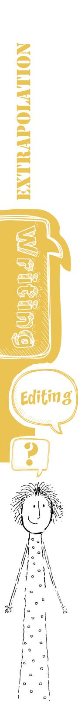
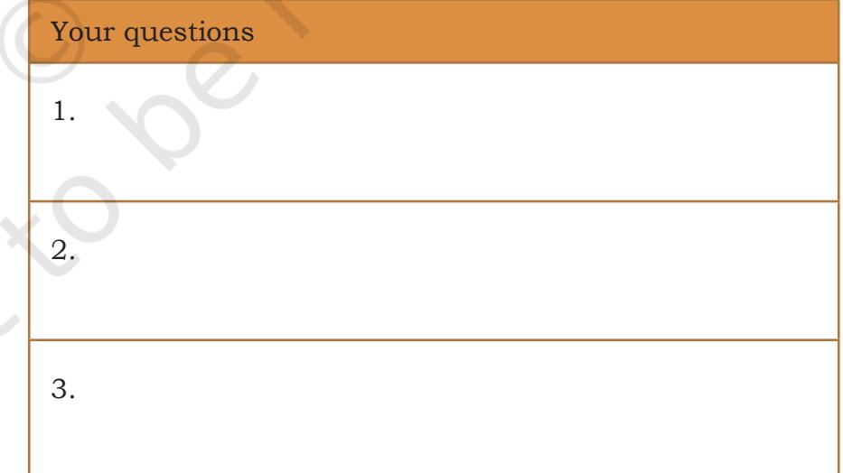
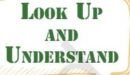
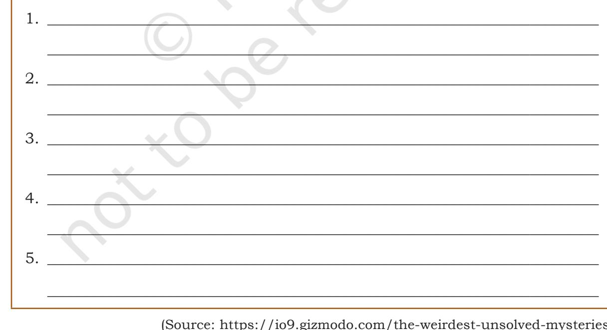
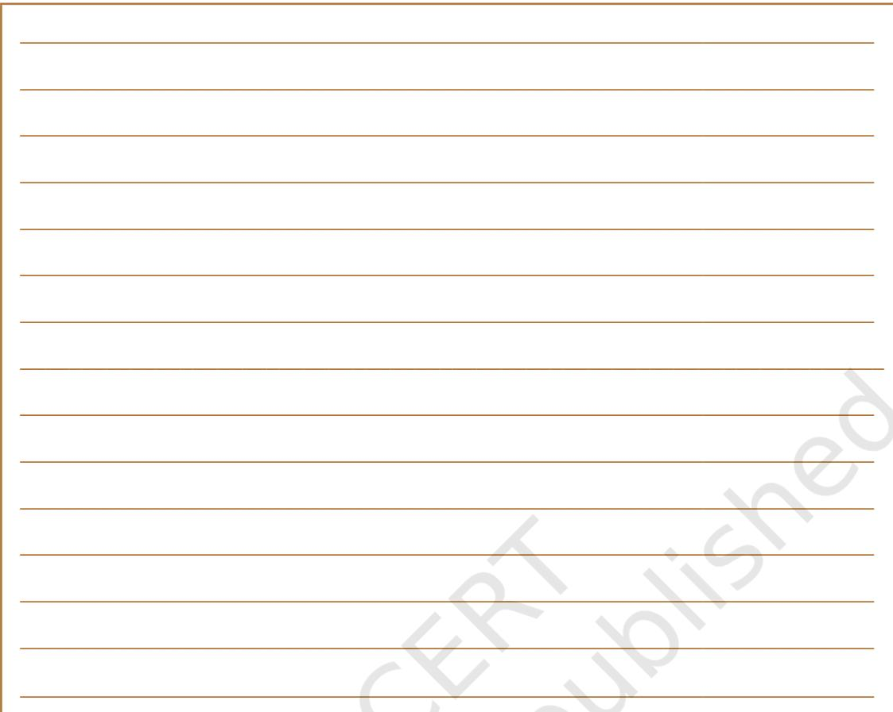

# 3 **Two Stories about Flying**

;

### **Let's Begin**

UNIT

?

 You have read two stories about flying. 'His First Flight' is about how a young bird learns to fly and 'Black Aeroplane' is a mystery.

- 1. Read the story, 'His First Flight' again. Working in groups of four, answer the following questions selecting the correct option.
### **Q.1. The young seagull was afraid of flying because  ____**

- (a) he felt his wings would not support him
- (b) other bird knew to fly very well

**_____________________________________**.

- (c) the sea was very large
- (d) his mother and father threatened him

### **Q.2. Why did his family taunt him about his cowardice?**

- (a) He went with his sisters and brothers.
- (b) He was not listening to them.
- (c) He was not accepting their request to fly with them.
- (d) He was not liked by them at all.

### **Q.3. How did the young seagull start flying?**

- (a) His mother showed him the fish and moved away from him to make him fly.
- (b) His brothers and sisters trained him to fly.
- (c) He was hungry and he moved to fly in search of food.
- (d) He did not learn to fly at all.


Unit-3.indd 31 27-Jun-2019 04:19:59 PM



### **Q.4. Which of the following statements is not true of the young seagull?**

- (a) He was lazy and did not want to fly.
- (b) He wanted to fly, but was afraid of flying.
- (c) His mother, father, brothers, and sisters helped him fly.
- (d) His hunger made him fly.
- **Q.5. Say whether the following statements about the seagull are true or false.**
- (a) The young seagull liked to fly with his brothers and sisters. ( )
- (b) The young seagull was hungry so he started to fly.

( )

- (c) He was scared of flying first. ( )
- (d) He flew on his own to get the food. ( )
- 2. You have another story, 'The Black Aeroplane' in the lesson. Read the story again and develop at least five multiple choice questions based on the story. Work in pairs and ask your partner to answer them. The questions may be based on the events, persons, reasons and causes of the events, and results in the story.



32 Words and Expressions 2 – Class X

Unit-3.indd 32 27-Jun-2019 04:20:00 PM

```
5.
```
4.

### **Reading Comprehension**

### **Text I**

Let's now read the story of a bus conductor and his passengers with a dog. The story is written by A.G Gardiner.

### **All about a Dog**

It was a bitterly cold night, and even at the far end of the bus the east wind that raved along the street cut like a knife. The bus stopped and two women and a man got in together and filled the vacant places. The young woman was dressed in sealskin, and carried one of those little Pekinese dogs that women in sealskin like to carry in their laps. The conductor came in and took the fares. Then his eyes rested with old malice on the beady eyed toy dog. I saw trouble brewing. This was the opportunity for which he had been waiting and he intended to make the most of it. I had marked him as the type of what Mr. Wells has called the Resentful Employee, the man with a great vague grievance against everything and a particular grievance against passengers who came and sat in his seat while he shivered at the door.

"You must take that dog out," he said with sour venom.

"I shall certainly do nothing of the kind. You can take my name and address," said the woman, who had evidently expected the challenge and knew the reply.

"You must take the dog out— that's my orders."

"I won't go on the top in such weather. It would kill me," said the woman.

"Certainly not," said her lady companion, "You've got a cough as it is."

"It's nonsense," said her male companion.



bitterly embittered evidently malice

Sentences

Unit-3.indd 33 27-Jun-2019 04:20:00 PM

avalanche imperiously imperturbably indignant quarterdeck

Look Up and Understand

The conductor pulled the bell and the bus stopped. "This bus doesn't go until that dog is brought out." And he stepped on to the pavement and waited. It was his moment of triumph. He had the law on his side and the whole bus full of angry people under the harrow. His embittered soul was having a real holiday.

The storm inside rose high "Shameful!" "He's no better than a German." "Why isn't he in the army?" "Call the police. Let's all report him." "Let's make him give us our fares back." Everybody was on the side of the lady and the dog.

That little animal sat blinking at the dim lights in happy unconsciousness of the rumpus of which he was the cause. The conductor came to the door, "What's your number?" said one, taking out a pocket-book with a gesture of terrible things. "There's my number," said the conductor imperturbably. "Give us our fares back." "You can't leave us here all night." "No fares back," said the conductor.

Two or three passengers got out and disappeared into the night. The conductor took another turn on the pavement, then went and had a talk with the driver. Another bus, the last on the road, sailed by indifferent to the shouts of the passengers to stop, "They stick by each other the villains," was the comment.

Someone pulled the bell violently. That brought the driver round to the door, "Who's conductor of this bus?" he said and paused for reply. "None coming," he returned to his seat, and resumed beating his arms across his chest. There was no hope in that quarter. A policeman strolled up and looked in at the door. An avalanche of indignant protests and appeals burst on him. "Well, he's got his rules, you know," he said. "Give your name and address." "That's what he's been offered, and he won't take it." "Oh," said the policeman, and he went away and took his stand a few yards down the street, where he was joined by two more constables.

And still the little dog blinked at the lights, and the conductor walked to and fro on the pavement, like a captain on the quarterdeck in the hour of victory. A young woman, whose voice had risen high above the gale inside, descended on him with an air of threatening and slaughter. He was immovable as cold as the night, and as hard as the pavement. She passed on in a fury of impotence to the three policemen, who stood like a group of statuary on the street watching the drama. Then she came back,

Unit-3.indd 34 27-Jun-2019 04:20:00 PM

imperiously beckoned to her 'young man' who had sat a silent witness of her rage, and vanished. Others followed. The bus was emptying. Even the dashing young fellow who had demanded the number and who had declared he would see this thing through if he sat there all night, had taken an opportunity to slip away.

Meanwhile the Pekinese party was passing through every stage as of resistance to abject surrender. "I'll go on the top." said the sealskin lady at last. "You mustn't." "I will." "You'll have pneumonia."

"Let me take it." (This from the man) "Certainly not." She would die with her dog. When she had disappeared up the stairs, the conductor came back, pulled the bell, and the bus went on. He stood sourly triumphant while his conduct was savagely discussed in his face by the remnant of the party.

Then the engine struck work, and the conductor went to help the driver. It was a long job and presently the lady with the dog stole down the stairs and re-entered the bus. When the engine was put right, the conductor came back and pulled the bell. Then his eyes fell on the dog, and his hand went to the bell-rope again. The driver looked around, the conductor pointed to the dog, the bus stopped, and the struggle recommenced with all the original features — the conductor walking the pavement, the driver smacking his arms on the box, the little dog blinking at the lights, the sealskin lady declaring that she would not go on the top and finally going.

"I've got my rules," said the conductor to me when I was the last passenger left behind. He had won his victory, but felt that he would like to justify himself to somebody. "Rules," I said," are necessary things, but there are rules and rules. Some are hard and fast rules, like the rules of the road, which cannot be broken without danger to life and limb. But some are only rules for guidance, which you can apply or wink at, as common sense dictates, like that rule about the dogs. They are not a whip, put in your hand to scourge your passengers with, but an authority for an emergency. They are meant to be observed in the spirit, not in the letter, for the comfort and not the discomfort of the passengers. You have kept the rule and broken its spirit. You may mix your rules with a little goodwill and good temper." He took it very well and when I got off the bus he said "Good night" quite amiably.

Sentences

abject remnant scourge smacking

Look Up and Understand

Unit-3.indd 35 27-Jun-2019 04:20:01 PM

**Now, complete the box narrating the story in the correct sequence.**


 1. Making adverbs: bitterly, imperturbably, violently, and evidently are some words you have come across in the story. These are adverbs. A few words are given below. Make adverbs of these words and use them in sentences of your own. (Take care of the spelling when you convert these into adverbs.)

_________________________________________

(a) Angry _________________________________________

Unit-3.indd 36 27-Jun-2019 04:20:01 PM

| (b) | Vague | _________________________________________ |  |
| --- | --- | --- | --- |
|  |  | _________________________________________ |  |
| (c) | Indignant | _________________________________________ | Fu n |
|  |  | _________________________________________ | Facts |
| (d) | Threatening | _________________________________________ |  |
|  |  |  | For, Since, |
|  |  | _________________________________________ | During |
| (e) | Hurry | _________________________________________ | She is going to |
|  |  |  | Mumbai for three |
|  |  | _________________________________________ | years. |

### 2. Now, look at the word given below in italic.

### He was *immovable.*

'im' is the prefix added to the word 'movable'. The prefix 'im' made 'immovable' an antonym of 'movable'. Now, make more words with the prefix im- which are antonyms.

| 1. mobile—immobile | 2. |
| --- | --- |
| 3. | 4. |
| 5. | 6. |
| 7. | 8. |

### 3. In groups of five, create a word-web or collocation chart of words with prefixes 'il' and 'in' .

| Example: logical—illogical | Example: secure—insecure |
| --- | --- |
| 1. | 1. |
| 2. | 2. |
| 3. | 3. |
| 4. | 4. |
| 5. | 5. |

# Sentences

I am working on the book since Thursday.

Can you meet me during tea time.

Unit-3.indd 37 27-Jun-2019 04:20:02 PM


### **A. Phrasal verbs**

The sentence below is taken from the text you have read. The phrase in italic is a phrasal verb. A phrasal verb is a combination of words (a verb + a preposition, for example *check in* or a verb + an adverb, for example *break down*). When they are used together, they usually take on a different meaning to that of the original verb.

*…Walk away* from the old Dakota.

*walk away* is a phrasal verb which means *to move away from*.

Find out the meaning of the following phrasal verbs and use them appropriately in sentences.

| (a) | walk | in | __________________________________________ | _____________________________________________________ |
| --- | --- | --- | --- | --- |
| walk out | (b) | ___________________________________________ | ______________________________________________________ |  |
| (c) | take | away | ___________________________________________ | ______________________________________________________ |
| (d) | take | up | ___________________________________________ | ______________________________________________________ |
| (e) | take | in | ___________________________________________ | ______________________________________________________ |
| (f) | take | out | ___________________________________________ | ______________________________________________________ |
| (g) | give | away | ___________________________________________ | ______________________________________________________ |
| (h) | give | in | ___________________________________________ | ______________________________________________________ |
| (i) | give | up | ___________________________________________ | ______________________________________________________ |
| (j) | put | in | ___________________________________________ | ______________________________________________________ |

38 Words and Expressions 2 – Class X

Unit-3.indd 38 27-Jun-2019 04:20:02 PM

| (k) | put | away ___________________________________________ |
| --- | --- | --- |
|  |  | ______________________________________________________ |
| (l) | put | out ___________________________________________ |
|  |  | ______________________________________________________ |

### **B. The Passive**

Compare the two sentences given below: Ramesh painted the walls.

The walls were painted by Ramesh.

 The first sentence is in *active* form and the second sentence is in *passive* form*.* When the person doing the action (Ramesh) is the subject, we use the verb in the active voice. When the subject is what the action is directed at (the walls), we use the verb in the passive voice. In the first sentence, we talked about Ramesh but in the second sentence we talked about what happened to the walls.

 In the passive sentence we use *by+agent* to add important information, that is *by Ramesh.* We can leave out *by+agent* if it does not provide any specific information.

Example:

All the students were given sweets yesterday.

My room is cleaned everyday in the morning.

A large number of films on wildlife conservation have been made.

### **Use the words given below and frame sentences using the passive forms of the verbs.**

Examples:

- • Rice/cultivate/Gangetic valley and coastal region. (Simple Present) Rice is cultivated in Gangetic valley and coastal region.
- • The documents/sign/principal. (Present Perfect) The documents have been signed by the principal.
- (a) Taj Mahal/build/Shah Jahan. (Simple Past)
- (b) Malaria virus/transmit/female Anopheles mosquito. (Simple Present)

 ______________________________________________________

- (c) The case/solve/police and two persons arrest. (Present Perfect)
 ______________________________________________________

 ______________________________________________________

Sentences

Unit-3.indd 39 27-Jun-2019 04:20:02 PM


### **Comma**

Comma can be used to set off a dependent clause at the beginning of a sentence.

*After working for an hour, he decided to rest for a while.* 

- (d) Many houses/and lives/destroy/the volcanic eruption in Mt. Etna. (Simple Past)
- (e) The ultraviolet rays/prevent/the ozone layer/entering the earth's surface. (Simple Present)

 ______________________________________________________

 ______________________________________________________

 _____________________________________________________

- (f) The field/convert/playground. (Present Perfect)
- **C. Unscramble the following sentences to make meaningful ones:**
	- (a) records/flying/many/who/American aviator/was an/  Amelia Earhart/set
	- (b) the first/across/woman/solo/to fly/the Atlantic Ocean/ she/became
	- (c) a flight/July 1937/the globe/Earhart/disappeared/ to circumnavigate/somewhere/over the/Pacific/in/ during
	- (d) was never/found/and/she was/officially declared/ plane wreckage/lost/at sea/her
	- (e) century/her/disappearance/remains/of the/one of the/greatest/unsolved mysteries/twentieth



(Source: https://io9.gizmodo.com/the-weirdest-unsolved-mysteries -of-world-war-ii-5886698)

40 Words and Expressions 2 – Class X

Unit-3.indd 40 27-Jun-2019 04:20:02 PM


- 1. Use capital letters, commas, and full stops to edit this paragraph.
In some parts of our country, there are frequent reports about Unidentified Flying Objects (UFOs) which people claimed to have seen flying in the sky and which are believed to be space ships carrying aliens from other planets some people have given evidences to support their observations they said that they have found mysterious objects in paddy fields. Some others, after seeing a film on space said that they had seen unusual objects flying in the sky. Public panicked there were arguments and discussions all over the country. Police were on red alert Many community centres were established people become more vigilant gradually the number of sightings reduced.

### Listening

- 1 . Do you like riddles? Riddles make us think and attempt to solve puzzles through various ways and means. Read this riddle out loud and find answers to it. You can also discuss with your friends. You will notice that we speak out what we think. This is known as Think-aloud protocol. As you solve the riddles, speak out all the ideas that come to your mind to solve it.
### **Riddle 1**

A farmer returns from the market, where he bought a goat, a cabbage and a wolf (what a crazy market). On the way home he must cross a river. His boat is small and won't fit more

Unit-3.indd 41 27-Jun-2019 04:20:03 PM


### **Comma**

Comma can be used before and after quotation marks.

*"He is happy," the Principal said. The principal said, "He is happy."*

than one of his purchases. He cannot leave the goat alone with the cabbage (because the goat would eat it), nor he can leave the goat alone with the wolf (because the goat would be eaten).

How can the farmer get everything on the other side in this river crossing puzzle?

### **Riddle 2**

Three humans, one big monkey, and two small monkeys are to cross a river:

- (a) Only humans and the big monkey can row the boat.
- (b) At all times, the number of humans on either side of the river must be greater or equal to the number of monkeys on that side (or else the humans will be killed by the monkeys!).
- (c) The boat only has room for two (monkeys or humans).
- (d) Monkeys can jump out of the boat when it's on the river bank.

How will they cross the river? Help them out.

## Writing

### Article Writing

- 1. 'Rules are meant to be observed in spirit not only in letter'. Explain what you understand by this statement. Write an article in about 120–150 words on how the rules can be effectively implemented in the society and citizens can follow it in the true spirit. You may use any of the ideas given in the box. Follow the stages involved in the process approach to writing.
	- (a) Use it in the context of gender (protection of women's rights/dowry/female infanticide, etc.).
	- (b) In the context of environment (cutting of trees/ poaching/pollution).
	- (c) Smoking in public/following traffic rules, etc. (add cartoons with fun facts, for example parking in front of no parking sign).
	- (d) In the context of value and self discipline.

Unit-3.indd 42 27-Jun-2019 04:20:03 PM



- 


- 
- 
- 
- 

